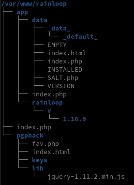
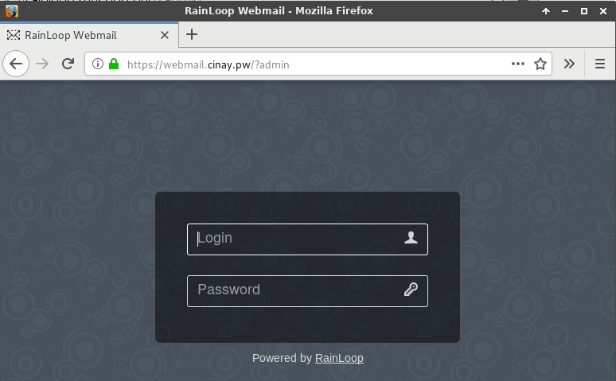
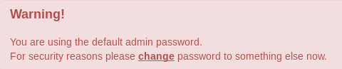
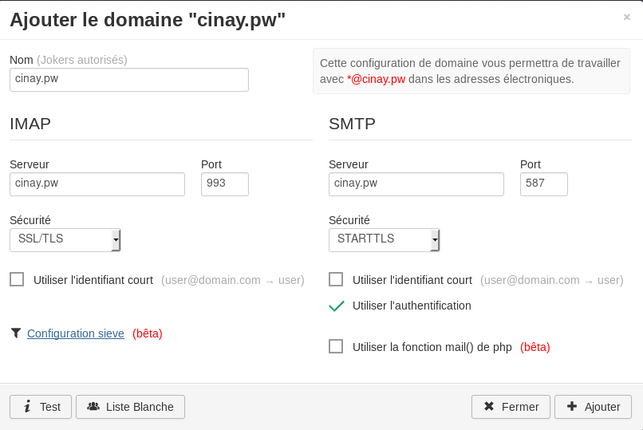
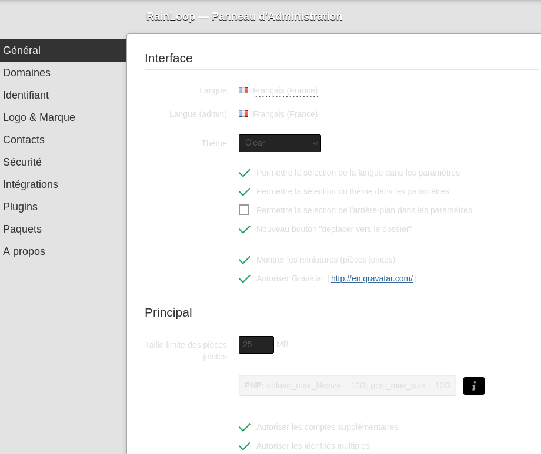
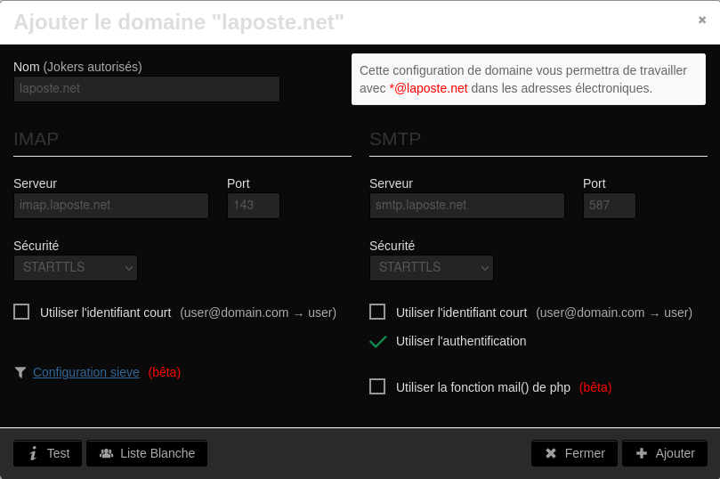

+++
title = 'rainloop'
date = 2021-08-18 00:00:00 +0100
categories = divers
+++
## Rainloop


*[Rainloop](https://github.com/RainLoop/rainloop-webmail) est un webmail opensource développé en PHP qui se veut complet et simple d'utilisation. Il gère très bien les protocoles IMAP/SMTP et dispose d'une interface moderne (HTML5/CSS3) très érgonomique, c'est plutôt agréable. Du côté des fonctionnalités, on retrouve toutes celles d'un client mail classique, avec en plus un système de plugins.*

### Rainloop Installation

Téléchargez le zip depuis le site officiel et décompressez-le dans le dossier /var/www/rainloop :

```
sudo -s
wget http://repository.rainloop.net/v2/webmail/rainloop-latest.zip
mkdir /var/www/rainloop
unzip rainloop-latest.zip -d /var/www/rainloop
rm -rf rainloop-latest.zip
```

Modifiez les permissions pour que le serveur web ait accès au répertoire /var/www/rainloop

```
cd /var/www/rainloop
find . -type d -exec chmod 755 {} \;
find . -type f -exec chmod 644 {} \;
chown -R www-data:www-data .
```

### Structure dossier /var/www/rainloop



### Certificats domaine webmail.cinay.pw

Ajout domaine **webmail.cinay.pw** aux certificats Letsencrypt

Ajouter les variables pour l'accès api OVH

```
export OVH_AK="Lj45UFRTDESDnnh5"
export OVH_AS="J582RTDESDnnh5rhDE89ZFSxng58aKL"
```

Génération des certificats

	/root/.acme.sh/acme.sh --dns dns_ovh --issue --keylength 4096 -d cinay.pw -d webmail.cinay.pw -d nc.cinay.pw -d gitlab.cinay.pw -d webmail.cinay.pw

Il faut également ajouter le domaine aux DNS du "registar" OVH par un CNAME

    webmail                     3600 IN CNAME  cinay.pw.

### Nginx virtualhost webmail.cinay.pw

Ajouter un nouveau virtual host Nginx,créer le fichier **/etc/nginx/conf.d/webmail.cinay.pw.conf**

```
server {
    listen 443 ssl http2;
    listen [::]:443 ssl http2;
    server_name webmail.cinay.pw;

    include ssl_params;
    include header_params;
    include dh_param;

    root /var/www/default-www/ ;
    index index.php index.html index.htm;
        location ~ \.php$ {
           fastcgi_split_path_info ^(.+\.php)(/.+)$;
           fastcgi_pass unix:/run/php/php7.0-fpm.sock;    # PHP7.0
           fastcgi_index index.php;
           include fastcgi_params;
	   fastcgi_param SCRIPT_FILENAME $request_filename;
        }

    access_log /var/log/nginx/webmail.cinay.pw-access.log;
    error_log /var/log/nginx/webmail.cinay.pw-error.log;
}
```

Vérifier et redémarrer Nginx pour prendre en compte le nouveau vhost :

    nginx -t
    systemctl restart nginx

### Rainloop Configuration

Configuration à la première connexion <https://webmail.cinay.pw/?admin> 

{:width="600"}

Par défaut les identifiants sont : **admin** et **12345**



Une fois connecté à l'interface d'administration, changer le mot de passe **admin** en cliquant sur le lien **change**  
Pour changer le language ,dans le menu de gauche cliquez sur **General**  
Vous devez ajouter un nouveau domaine. Dans le menu de gauche cliquez sur **Domaines** puis sur **+ Ajouter un domaine**. Une nouvelle fenêtre s'ouvre et vous demande de configurer IMAP et SMTP pour ce domaine. 

{:width="600"}

Cliquer sur **i test** qui doit passer au vert  
Ajouter tous les utilisateurs du domaine autorisés à se connecter dans le White List (bouton en bas), les utilisateurs sont séparés par des espaces  
Au final cliquer sur **Ajouter**  
Supprimer gmail.com dans **Domaines**  

Connectez-vous à votre boîte mail via le formulaire principal <https://webmail.cinay.pw>

## Rainloop Yunohost

{:width="150"}

En mode su

    yunohost app install rainloop

```
Choose the domain where this app should be installed [cinay.eu | gitea.cinay.eu | static.cinay.eu | yanfi.net | yanfi.space | searx.yanfi.space | zic.yanfi.space] (default: yanfi.space): 
Choose the path where this app should be installed (default: /rainloop): 
Should this app be exposed to anonymous visitors? [yes | no] (default: no): 
Choose an administration password for this app: 
Do you want to add YunoHost users to the recipients suggestions? [yes | no] (default: yes): 
Select default language [de | en | es | fr | it | pt] (default: en): fr
[...]
Info: [####################] > Installation of rainloop completed
Success! Installation completed
```

**Administration**  

*ajout du domaine de messagerie `laposte.net` non géré par Yunohost*

Lien https://yanfi.space/rainloop/app/?admin  
{:width="600"}

Domaine &rarr; Ajouter un domaine  
{:width="600"}

**Ajouter un compte**  

Lien https://yanfi.space/rainloop/app/#/settings/accounts  
Saisir une adresse messagerie de la poste et son mot de passe associé  

## Rainloop Dark Thème

1. Télécharger Dark Theme : [app.min.zip](https://github.com/RainLoop/rainloop-webmail/files/4904423/app.min.zip)
1.    Extraire simplement le fichier CSS du fichier ZIP 
1.    Naviguez vers votre dossier CSS Rainloop :  
`cd /var/www/rainloop/app/rainloop/v/1.16.0/static/css`  
1.    Renommez le fichier `app.min.css` original en `app.min_orig.css`  
`mv app.min.css app.min_orig.css`
1.    Collez le fichier CSS extrait dans votre dossier CSS Rainloop:  
`cp app.min.css /var/www/rainloop/app/rainloop/v/1.16.0/static/css/` 
1.    Rafraîchissez votre navigateur


