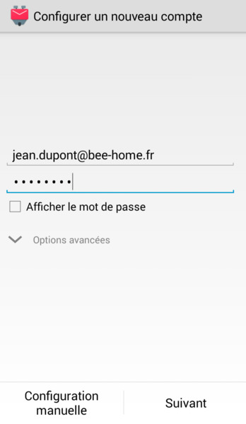
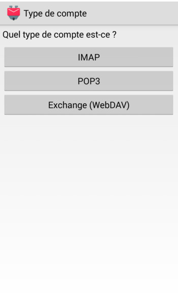
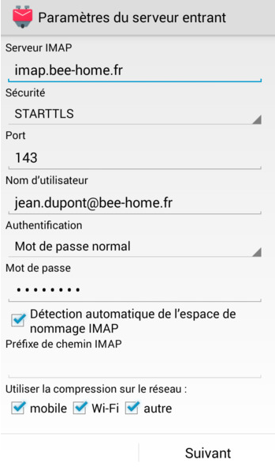
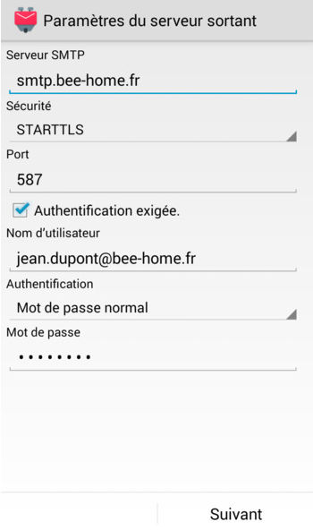
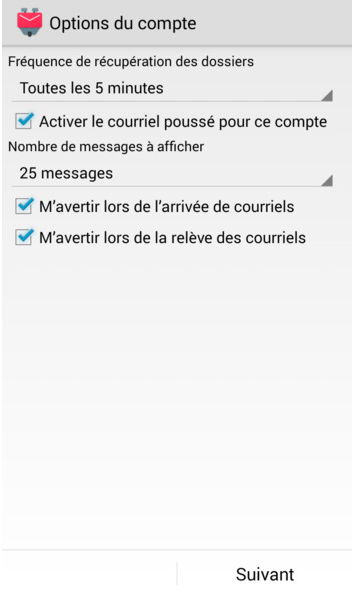
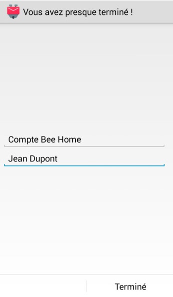

+++
title = 'Android K-9 Mail'
date = 2021-08-20 00:00:00 +0100
categories = ['messagerie']
+++
## K-9 Mail

<https://k9mail.app/>  
Vous pouvez l'installer depuis [Google Play](https://play.google.com/store/apps/details?id=com.fsck.k9) ou depuis [F-Droid](https://f-droid.org/packages/com.fsck.k9/).

### Exemple compte bee-home.fr

1. *Type de compte* : choisissez *IMAP*  
{:height="300"}
2. *Configurer un nouveau compte* : saisissez ici votre adresse mail et son mot de passe, puis choisissez *Suivant*.  
{:height="300"}
3. *Paramètres du serveur entrant* : vous devez obligatoirement saisir `imap.bee-home.fr` comme serveur IMAP. Utiliser la sécurité STARTTLS.  
{:height="300"}
4. *Paramètres du serveur sortant* : vous devez obligatoirement saisir smtp.bee-home.fr comme serveur SMTP.Utiliser la sécurité STARTTLS.  
{:height="300"}
5. *Options du compte* : modifier la fréquence de récupération du dossier. Il s'agit de vérifier régulièrement si vous avez des nouveaux messages.  
{:height="300"}
6. *Vous avez presque terminé !* : vous pouvez directement choisir *Terminé*.  
{:height="300"}

### K-9 Mail 5.800

Changements notables

*    L'interface utilisateur a été remaniée. 
*    Dans la version 5.800, nous avons apporté les modifications nécessaires pour que la synchronisation périodique en arrière-plan et le Push fonctionnent de manière beaucoup plus fiable.
*    Cette version de K-9 Mail ne fonctionne que sur Android 5.0 et plus récent.
*    Diverses améliorations et corrections de bogues liées au chiffrement de bout en bout (Autocrypt, OpenPGP).

## forum.k9mail.app

<https://forum.k9mail.app/>

### Vérifier manuellement les nouveaux messages

**Comment vérifier manuellement les nouveaux messages / synchroniser un dossier ?**

Dans K-9 Mail 5.800, le modèle "tirer pour rafraîchir" est utilisé pour vérifier la présence de nouveaux messages.
Synchronisation manuelle d'un dossier

<video width="640" height="480" controls>
  <source src="/files/k-9mail01.mp4" type="video/mp4">
</video>

Balayez vers le bas sur la liste des messages. Une fois que l'indicateur de progression circulaire est entièrement visible, relâchez votre doigt et K-9 Mail synchronisera ce dossier.

Synchronisation manuelle d'un compte

<video width="640" height="480" controls>
  <source src="/files/k-9mail02.mp4" type="video/mp4">
</video>

Ouvrez le tiroir latéral, faites glisser vers le bas la liste des dossiers. Une fois que l'indicateur de progression circulaire est entièrement visible, relâchez votre doigt et K-9 Mail synchronisera ce compte.

Synchroniser manuellement tous les comptes

<video width="640" height="480" controls>
  <source src="/files/k-9mail03.mp4" type="video/mp4">
</video>

Ouvrez le tiroir latéral, appuyez sur la moitié inférieure de l'élément d'en-tête coloré pour passer à la liste des comptes, puis faites glisser votre doigt vers le bas sur la liste des comptes. Lorsque l'indicateur de progression circulaire est entièrement visible, relâchez votre doigt et K-9 Mail synchronisera tous les comptes.

Futur

Nous sommes conscients que tout le monde n'aime pas le modèle "tirer pour rafraîchir". Nous prévoyons de ramener des boutons ou des entrées de menu pour rafraîchir un dossier/compte/tous les comptes.

