+++
title = 'KVM QEMU virtualiser windows 10 sur Archlinux + partage NFS'
date = 2021-09-08 00:00:00 +0100
categories = virtuel
+++
## Créer un windows 10 virtuel

[KVM / QEMU based Windows 10 VM - Step by Step](https://dennisnotes.com/note/20180614-ubuntu-18.04-qemu-setup/)

On part avec une image disque existante `~/virtuel/KVM/winten.qcow2`  

Pour créer une nouvelle machine virtuelle, lancez "Virtual Machine Manager", qui ouvre une interface graphique simple. Cliquez sur le bouton supérieur gauche pour ouvrir la fenêtre Nouvelle VM.  
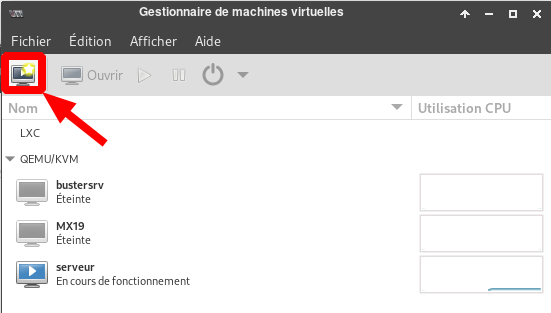{:width="400"}

La première chose que vous devez faire est de sélectionner comment vous souhaitez installer le système d'exploitation.  
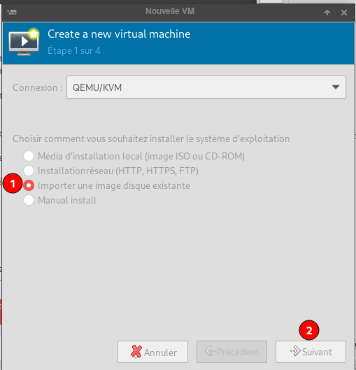{:width="400"}  
Sélectionner l'image  
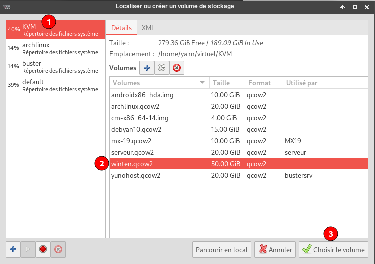{:width="400"}  
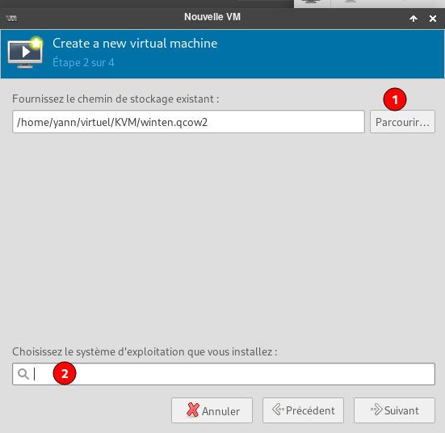{:width="400"}  
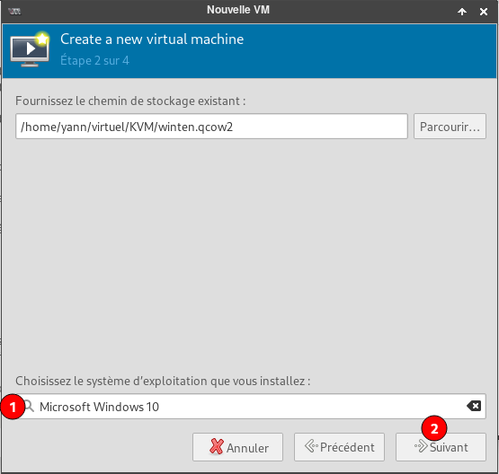{:width="400"}  

À l'étape suivante, vous devez sélectionner la quantité de RAM et le nombre de cœurs de processeur que la VM doit avoir. Les ressources des hôtes sont affichées sous forme de petit texte gris sous les champs de saisie.  
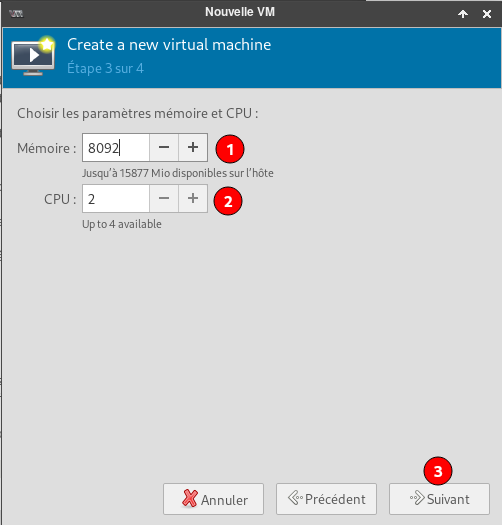{:width="400"}  

Terminer la configuration  
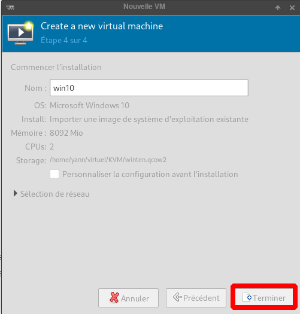{:width="400"}  

L'image vrtuelle windows 10 est lancée   
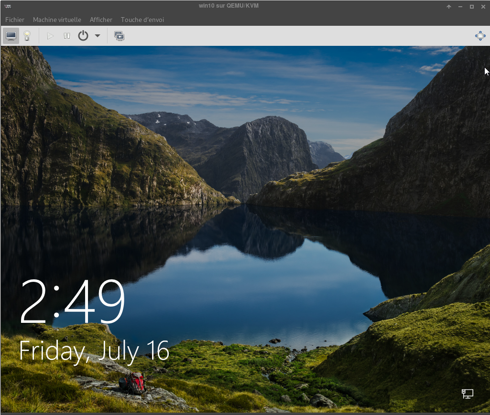{:width="600"}  

## Archlinux NFS Serveur

Installer le serveur NFS : `sudo pacman -S nfs-utils`  
Le dossier à partager `/srv/media/dplus/android-apk/Galaxy-S8_SM-G950F`  
Le fichier `/etc/exports`  

```
# /files *(ro,no_subtree_check) ; Accès en lecture seule pour tout le monde
# /files 192.168.0.100(rw,no_subtree_check) ; Accès en lecture-écriture pour le client dont l'ip est 192.168.0.100
/srv/media/dplus/android-apk/Galaxy-S8_SM-G950F 192.168.0.1/24(rw,no_subtree_check) ;  Accès en lecture-écriture pour tous les clients du réseau 192.168.0.0
```

Exporter : `sudo exportfs -arv`  
Lancer le service : `sudo systemctl start nfs-server.service`  
Activer le service : `sudo systemctl enable nfs-server.service`  

Vérification `sudo showmount -e 192.168.0.42`  

```
Export list for 192.168.0.42:
/srv/media/dplus/android-apk/Galaxy-S8_SM-G950F 192.168.0.0/24
```


## Partage NFS sur VM windows 10 

*[Comment monter un partage NFS sur une machine virtuelle "windows 10"](https://graspingtech.com/mount-nfs-share-windows-10/)*  

Installer le client NFS (Services pour NFS)
La première chose à faire est d'installer le client NFS, ce qui peut être fait en suivant les étapes ci-dessous :

Étape 1 : Ouvrez **Programs and Features**

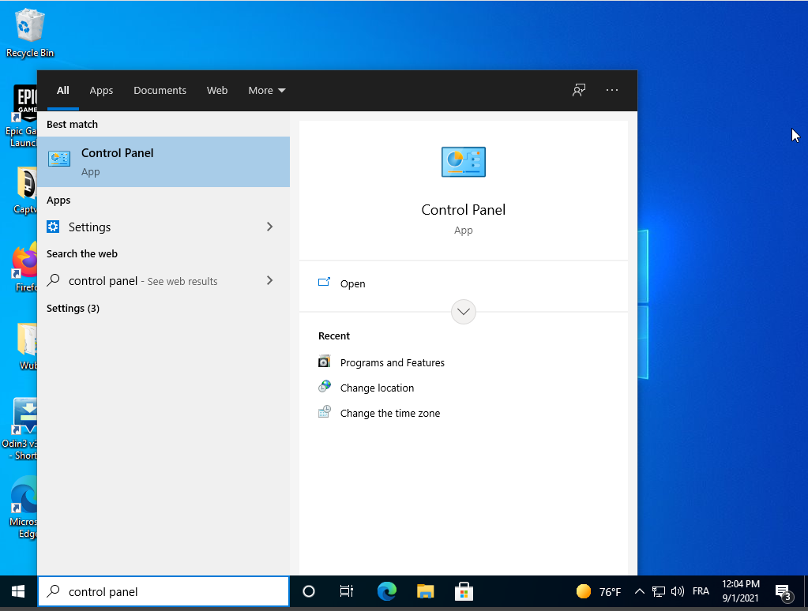{:width="400"}

Étape 2 : Cliquez sur Activer ou désactiver les fonctionnalités de Windows.

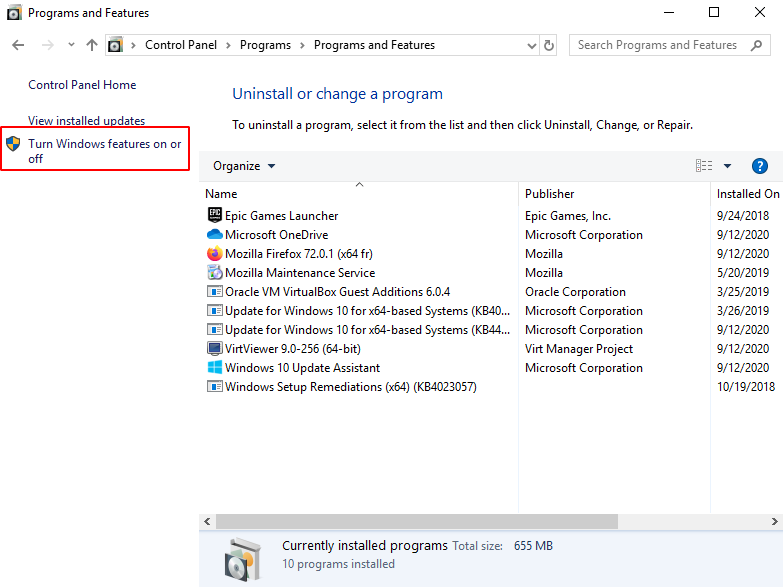{:width="600"}

Étape 3 : Faites défiler vers le bas et cochez l'option Services for NFS, puis cliquez sur OK.

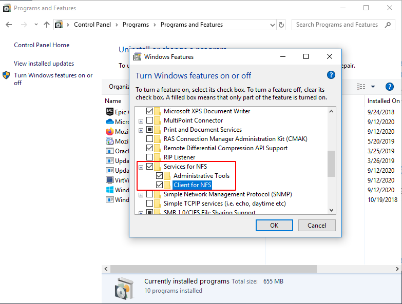{:width="600"}  
Activer les services pour les NFS

Étape 4 : Une fois l'installation terminée, cliquez sur OK et retournez sur le bureau.

### Comment monter un partage NFS

Ouvrir un terminal  
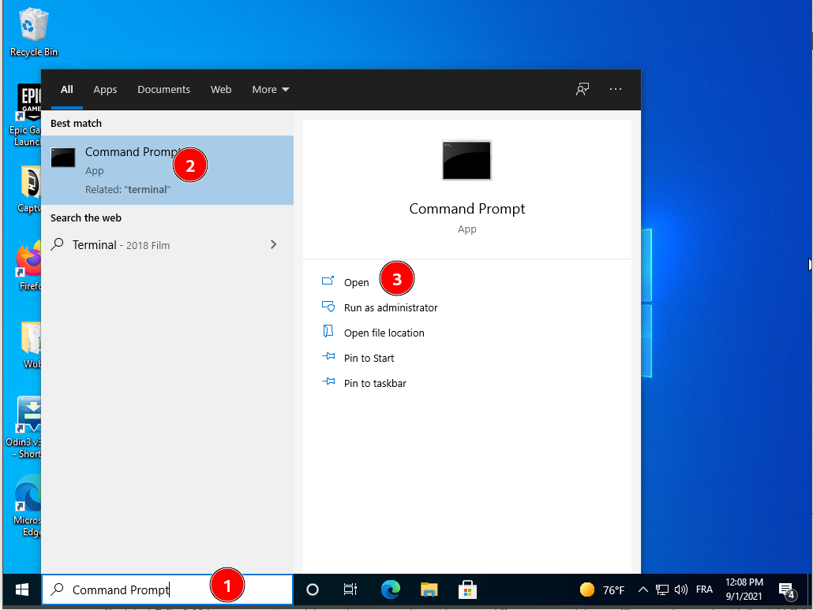{:width="600"}

En supposant que votre périphérique NAS se trouve sur le même réseau que votre machine Windows et que l'adresse IP du périphérique est 192.168.0.42, la commande suivante montera un partage sur le système NFS à /mnt/vms.

mount -o anon \\192.168.0.42\srv\media\dplus\android-apk\Galaxy-S8_SM-G950F Z:   
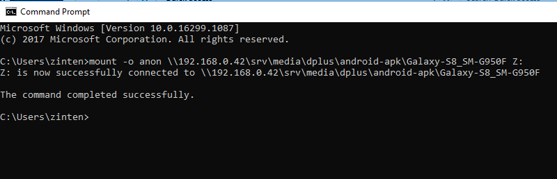{:width="600"}  

Le partage est maintenant monté et nous pouvons accéder aux données en naviguant sur le lecteur Z :  
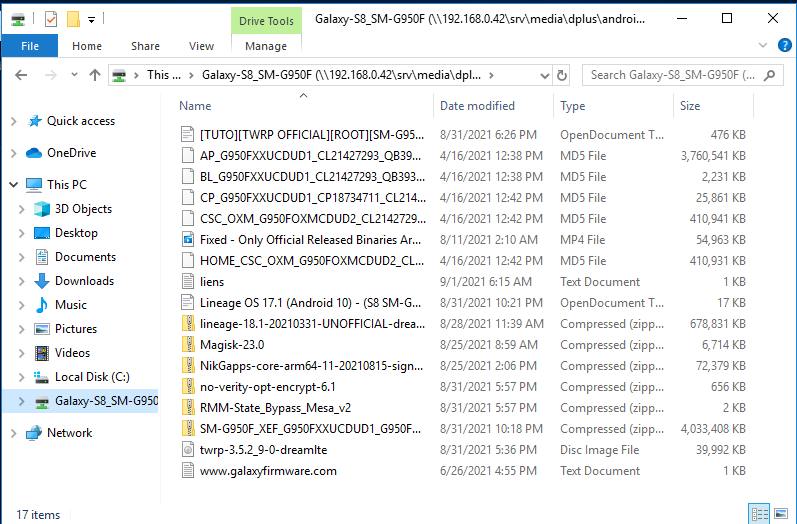{:width="600"}

C'est tout, nous pouvons maintenant écrire sur le dispositif NAS. J'ai cependant remarqué qu'il faut beaucoup de temps pour essayer d'ouvrir le titre pour la première fois.

### Autoriser l'utilisateur anonyme à écrire

Avec les options par défaut, vous n'aurez que des autorisations de lecture lorsque vous monterez un partage UNIX en utilisant l'utilisateur anonyme. Nous pouvons donner à l'utilisateur anonyme des droits d'écriture en modifiant l'UID et le GID qu'il utilise pour monter le partage.

L'image ci-dessous montre le partage monté en utilisant les paramètres par défaut.

{:width="150"}

Pour modifier l'UID et le GID, nous devons apporter une simple modification au registre Windows en suivant les étapes suivantes :

1. Ouvrez **regedit** en le tapant dans la boîte de recherche et appuyez sur Entrée.
2. Naviguer vers **HKEY_LOCAL_MACHINE_SOFTWARE\Microsoft\ClientForNFS\CurrentVersion\Default** 
3. Créez une nouvelle valeur DWORD **New DWORD (32-bit) Value** dans le dossier **Default** nommé **AnonymousUid** et attribuez l'UID trouvé dans le répertoire UNIX tel que partagé par le système NFS.
4. Créez une nouvelle valeur DWORD **New DWORD (32-bit) Value** dans le dossier **Default** nommé **AnonymousUid** et attribuez le GID trouvé dans le répertoire UNIX partagé par le système NFS.  
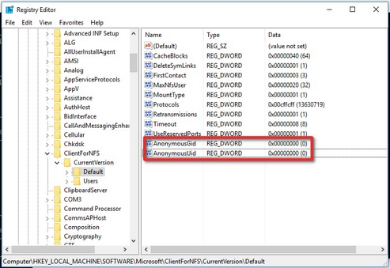{:width="600"}
5. Redémarrez le client NFS ou redémarrez la machine pour appliquer les changements.

La sortie de la commande mount devrait maintenant ressembler à ceci :

```
Propriétés locales et distantes
-------------------------------------------------------------------------------
Z : \\192.168.0.42\mnt\vms UID=0, GID=0
                                                rsize=1048576, wsize=1048576
                                                mount=soft, timeout=1.6
                                                retry=1, locking=yes
                                                fileaccess=755, lang=ANSI
                                                sensible à la casse=non
                                                sec=sys
```

Notez la valeur 0 appliquée à l'UID et au GID. Cela signifie que le partage est monté en utilisant l'utilisateur root.


## Winten trucs et astuces

**How to Enable or Disable Microsoft Defender Antivirus Potential Unwanted App (PUA) Protection in Windows 10**

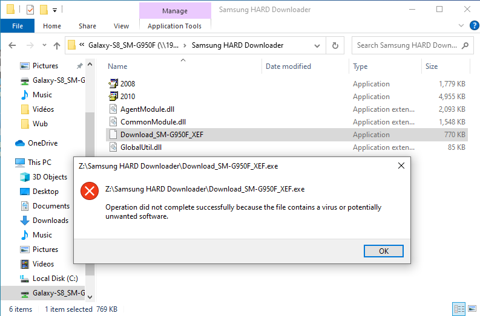{:width="600"}  
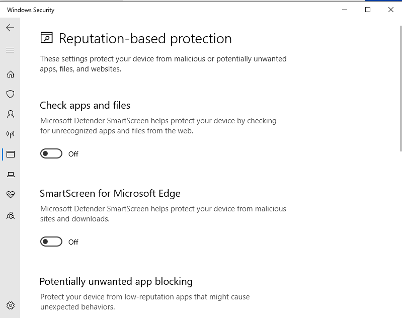{:width="600"}  
{:width="600"}  

[Comment désactiver Windows Defender dans Windows 10](https://fr.wikihow.com/d%C3%A9sactiver-Windows-Defender-dans-Windows-10)  
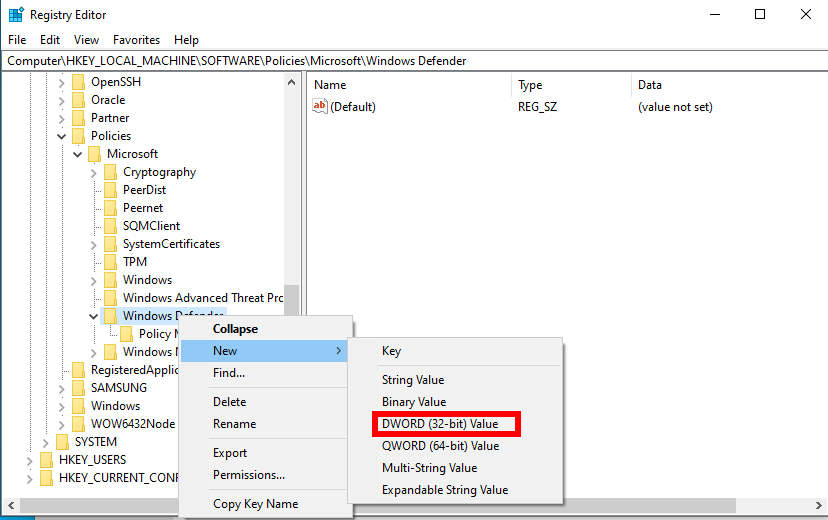{:width="600"}  
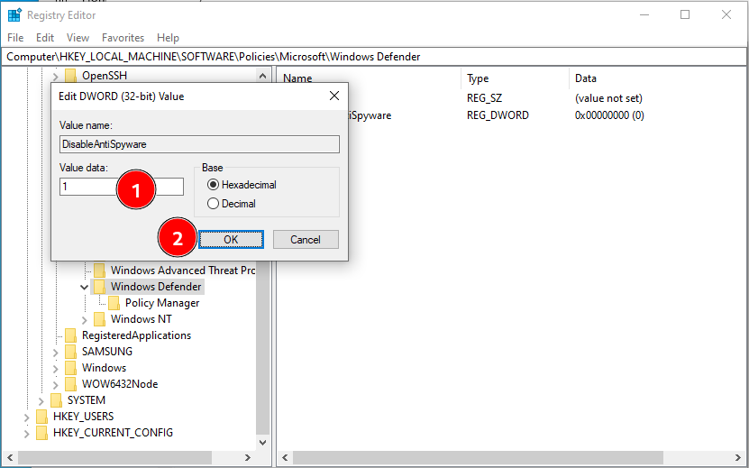{:width="600"}  
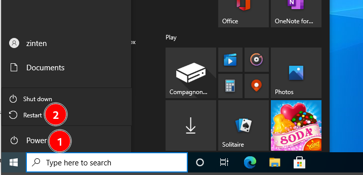{:width="600"}  
