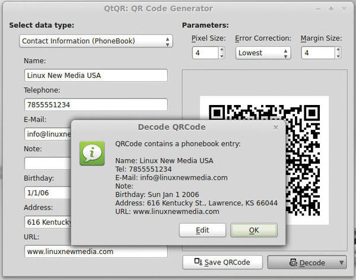

+++
title = 'QR Code (code-barres) définition, encodage et décodage'
date = 2021-09-10 00:00:00 +0100
categories = ['outils']
+++
## QR Code


*Les QR codes (Quick Response) ont fait leur apparition depuis un certain temps et sont pour ceux qui ne le sauraient pas encore, des code-barres à deux dimensions. Ceux-ci permettent d’emmagasiner du texte dans une image, constituée d’éléments noirs disposés sur un fond blanc. Après avoir été scannées et décodées, celles-ci peuvent déclencher diverses actions : navigation internet, envoi de mail, appel téléphonique, envois de SMS et j’en passe… Si les QR codes se démarquent des code-barres traditionnels, c’est avant tout parce qu’ils permettent d’embarquer plus de données. L’autre avantage des QR Codes réside dans le fait qu’ils peuvent être lus grâce à pas mal d’applications et sur un grand nombre de terminaux différents. À commencer par nos Smartphones.*

*    [Linux Magazine - Generating QR Codes in Linux](http://www.linux-magazine.com/Online/Features/Generating-QR-Codes-in-Linux)
*    <http://www.paulfp.net/blog/2013/08/using-a-qr-code-to-connect-to-your-wifi-network-quickly-and-easily/>
*    <http://nlug.ml1.co.uk/2013/10/generate-qr-codes-for-wifi-networks/4434>
*    <http://www.commandlinefu.com/commands/view/13028/generate-qr-code-for-a-wifi-hotspot>
*    <http://manpages.ubuntu.com/cgi-bin/search.py?q=qrencode>
*    <https://github.com/zxing/zxing/wiki/Barcode-Contents#wifi-network-config-android>

### Les générateurs en ligne

* [On Line - Qr Code Generator (en)](https://www.qrstuff.com/)  
* [On Line - Qr Code Generator (fr)](https://qrcode.tec-it.com/fr)  

### QtQR (GUI)

Comme son nom l'indique, QtQR est basé sur Qt. L'outil s'appuie sur Python et la bibliothèque python-qrtools. Vous pouvez simplement installer le programme via le gestionnaire de paquets sur Ubuntu. Pour les autres distributions, vous trouverez le code source et les paquets RPM et DEB sur la [page de téléchargement du projet(en)](https://launchpad.net/qr-tools/+download).  
Sous archlinux/manjaro : `yay -S qtqr`

La fenêtre principale de QtQR est assez simple : En haut à gauche, dans la sélection, vous pouvez définir les données que vous souhaitez stocker dans le code QR. Pour une adresse, choisissez Contact Information (PhoneBook). Selon le type d'information, QtQR affiche les champs appropriés  
  
*QtQR peut également décoder les codes QR. Ici, le logiciel lit un code QR enregistré dans un fichier contenant les informations indiquées dans le panneau gauche de la fenêtre.*

À mesure que vous remplissez les champs, le programme crée le code QR correspondant sur la droite. Vous pouvez redimensionner le code en haut à droite. Taille des pixels vous permet de définir le nombre de pixels par point carré que le code QR utilise, tandis que Taille de la marge vous permet de spécifier la taille de la marge. Error Correction vous permet de définir le niveau de correction. Une fois que vous avez défini tous les paramètres, enregistrez le code sous forme de fichier PNG en cliquant sur le bouton Save QRCode.

### QRencode - zbar (CLI)

* [QRencode – Créez des QR codes depuis votre terminal sous GNU/Linux](http://la-vache-libre.org/qrencode-creez-des-qr-codes-depuis-votre-terminal-sous-gnulinux/)  
* [QRcode/Code_QR](https://doc.ubuntu-fr.org/qrcode)  

Comment créer et lire des QR codes sous GNU/Linux et ce depuis notre terminal ?

La première chose à faire va être d’installer deux petites applications, à savoir **QRencode** pour la partie création, et **ZBar** pour la partie scan/lecture.  
Sur Archlinux 

    sudo pacman -S qrencode zbar

Sur debian et dérivés 

    sudo apt-get install qrencode zbar-tools

### Créer un QR Code

Créer un QR Code qui contient une URL.

    qrencode "http://test-qr.org/" -o $HOME/Images/test-qr.png

L’information contenue dans le QR code est l’url  

>Vous n’aurez pas de retour à l’écran

### Options qrencode

    qrencode -h

```
qrencode version 4.0.0
Copyright (C) 2006-2017 Kentaro Fukuchi
Usage: qrencode [OPTION]... [STRING]
Encode input data in a QR Code and save as a PNG or EPS image.

  -h           afficher ce message.
  --help       afficher l'utilisation des options longues.
  -o FILENAME  écrit l'image dans FILENAME. Si'-' est spécifié, le résultat 
               sera sortie sur la sortie standard. Si -S est donné, structured
               symbols sont écrits dans FILENAME-01.png, FILENAME-02.png, ...
               (le suffixe est supprimé de FILENAME, si spécifié)
  -r FILENAME  lit les données d'entrée à partir de FILENAME.
  -s NUMBER    spécifier la taille du module en points (pixels). (par défaut=3)
  -l {LMQH}    spécifie le niveau de correction d'erreur de L (le plus bas) à H (le plus haut).
               (par défaut=L)
  -v NUMBER    spécifie la version minimale du symbole. (par défaut=auto)
  -m NUMBER    spécifie la largeur des marges. (par défaut=4 (2 pour Micro))
  -d NUMBER    spécifie l'IAP du PNG généré. (par défaut=72)
  -t {PNG,PNG32,EPS,SVG,XPM,ANSI,ANSI256,ASCII,ASCIIi,UTF8,ANSIUTF8}
               spécifie le type de l'image générée. (par défaut=PNG)
  -S           Faire des symboles structurés. La version doit être spécifiée.
  -k           suppose que le texte d'entrée contient des kanji (shift-jis).
  -c           coder les caractères de l'alphabet en minuscules en mode 8 bits. (par défaut)
  -i           ignorer les distinctions de casse et n'utiliser que des majuscules.
  -8           encoder des données entières en mode 8 bits. k, -c et -i seront ignorés.
  -M           encode dans un Micro QR Code.
  -V           affiche le numéro de version et les droits d'auteur du qrencode.
  [STRING]     les données d'entrée. S'il n'est pas spécifié, les données seront extraites de
               entrée standard.

  Essayez "qrencode --help" pour plus d'options.
```

### Extraire contenu QR Code

Vous pouvez dès lors l’ouvrir dans votre visionneuse d’image et la scanner à l’aide d’une application dédiée pour en extraire l’information.  

Vous pouvez également extraire l’information directement depuis le terminal et c’est là que ZBar entre en jeux .  

    zbarimg $HOME/Images/test-qr.png

qui devrait vous renvoyer un retour de ce type :

```
QR-Code:http://test-qr.org/
scanned 1 barcode symbols from 1 images in 0.01 seconds
```

Autre exemple

    zbarimg -q --raw qr-wifi.png 
    WIFI:S:MyWifi;T:WPA;P:MyPassword!;; 

>Comme pour les autres applications de ce type, vous pouvez également prendre connaissance de toutes les options disponibles à l’aide de l’argument -h.

## Les différents Qr Code

* [Barcode Contents](https://github.com/zxing/zxing/wiki/Barcode-Contents)  
* [QR Code en action](http://www-igm.univ-mlv.fr/~dr/XPOSE2011/QRCode/usages.html)  


### QR code wifi

Générer un QR code pour se connecter en wifi sans avoir à saisir SSID et Mot de passe  

    format "WIFI:S:my-ssid;T:[WEP|WPA|WPA2];P:my-password;;"
    qrencode "WIFI:T:WPA2;S:<SSID>;P:<Mot-de-passe>;;" -o fichier.png

>ATTENTION : Ne pas oublier d'échapper avec le "\" tous les caractères non alpha numériques

Pour créer un QRcode pour partager un réseau wifi personnel, taper la commande suivante dans un terminal :

	qrencode -s 7 -o qr-wifi.png "WIFI:S:$(zenity --entry --text="Network name (SSID)" --title="Create WiFi QR");T:WPA2;P:$(zenity --password --title="Wifi Password");;"

Pour créer un QRcode pour partager un réseau wifi personnel dont le SSID est masqué, taper la commande suivante dans un terminal :

	qrencode -s 7 -o qr-wifi.png "WIFI:S:$(zenity --entry --text="Hidden Network name (SSID)" --title="Create WiFi QR");T:WPA;P:$(zenity --password --title="Wifi Password");H:true;;"

Une autre méthode pour se connecter a un réseau wifi masqué est de partager uniquement le password de ce dernier et de s'y connecter manuellement en récupérant le password dans le clipboard d'Android via le QRcode scanné qui est généré de la manière suivante :

	qrencode -s 7 -o wifi-P.png "$(zenity --password --title="Wifi Password")"

Exemple d'utilisation des zbar-tools : zbarimg et zbarcam  
zbarimg décode les images de QRcode, exemple :

	zbarimg -q --raw qr-wifi.png 
		WIFI:S:MyWifi;T:WPA;P:MyPassword!;;

### QR passer un lien vers son dépôt Nextcloud

Exemple : partager les photos de vacances

    qrencode -t SVG -o lienPartagePhotos.svg "https://nextcloud.mon-nom-de-domaine.fr/index.php/s/B7LRrx2EA97V"

*    *-t SVG* permet de créer une image vectorielle au format libre SVG qui a l'avantage d'être légère et facilement redimensionnable sans perte de résolution
*    *-o nom-de-fichier.typ* permet de spécifier le nom du fichier image
*    et enfin la chaîne à coder entre guillemets


### QR Vcard

NTT DoCoMo a popularisé un format MECARD compact pour l'encodage des informations de contact. Par exemple, pour coder le nom *Demi Parmentier*, adresse *32, rue Adolphe Wurtz, 76140 LE PETIT-QUEVILLY*, numéro de téléphone *0257783943*, e-mail *DemiParmentier@dayrep.com*, on coderait ceci dans un code-barres :

    qrencode -s 7 -o qr-vcard.png "MECARD:N:Demi Parmentier;TEL:0257783943;EMAIL:DemiParmentier@dayrep.com;ADR:32, rue Adolphe Wurtz, 76140 LE PETIT-QUEVILLY;;"

### QR Numéro de téléphone

Un tel URI devrait être utilisé pour coder un numéro de téléphone. De plus, il est conseillé d'inclure des préfixes qui rendent le numéro accessible à l'international. Par exemple, pour coder le numéro de téléphone francais 0348664720, il faut coder **tel:+33348664720**. Ce tel URI comprend un préfixe "+33" qui le rendra utilisable en dehors de la France.

    qrencode -s 7 -o qr-tel.png "tel:+33348664720"

### QR SMS

Tout comme une adresse e-mail, on peut encoder un shortcode SMS ou un numéro en créant un sms URI. Par exemple, pour créer un lien vers le numéro 12345, on coderait sms:12345:message. 

    qrencode -s 7 -o qr-sms.png "sms:12345:message à envoyer"

### QR Adresse électronique

Pour encoder une adresse e-mail comme sean@example.com, on pourrait simplement encoder sean@example.com. Cependant pour s'assurer qu'il est reconnu comme une adresse e-mail, il est conseillé de créer un mailto : URI à partir de l'adresse : mailto:sean@example.com.

    qrencode -s 7 -o qr-email.png "mailto:sean@example.com"

Les lecteurs doivent ouvrir un message électronique vierge à l'adresse indiquée.

Notez que NTT DoCoMo a normalisé un format MATMSG plus expressif pour encoder une adresse e-mail, un sujet et un message.

    qrencode -s 7 -o qr-email.png "MATMSG:TO:mail@server.fr;SUB:sujet;BODY:corps;;"

### QR TOTP

L'algorithme de mot de passe à usage unique basé sur le temps (TOTP) est une extension de l'algorithme de mot de passe à usage unique basé sur HMAC (HOTP) qui génère un mot de passe à usage unique en prenant plutôt le caractère unique de l'heure actuelle et est utilisé dans un certain nombre de systèmes d'authentification à deux facteurs.


    qrencode -s 7 -o qr-totp.png "otpauth://totp/VIP%20Access:VSST87192127?secret=64HZJT3E4DCBQCHQ4ICBFI2OJXQXR6RI&issuer=Emetteur"

Lire le qrcode par une application TOTP comme **andOTP**  
Le code "secret" est la partie la plus importante du Qrcode totp ,le code barre doit être détruit après utilisation pour des raisons de sécurité...  

>Note : certain des caractères sont encodés (Voir [Url Encoder en ligne](https://convertstring.com/fr/EncodeDecode/UrlEncode))

### QR Client Wireguard

Générer le code dans un fichier image

    qrencode -r wg-client.conf -o wg-client.png

Générer le code qr dans la fenêtre du terminal

    qrencode -t ansiutf8 -r wg-client.conf
