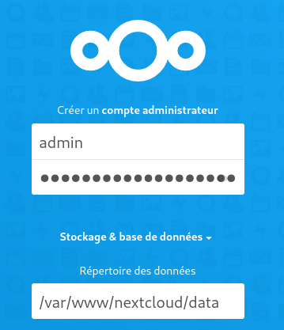
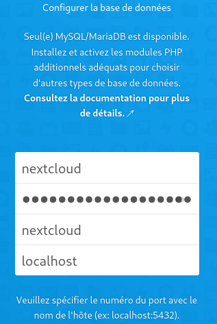
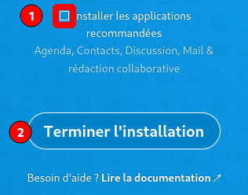
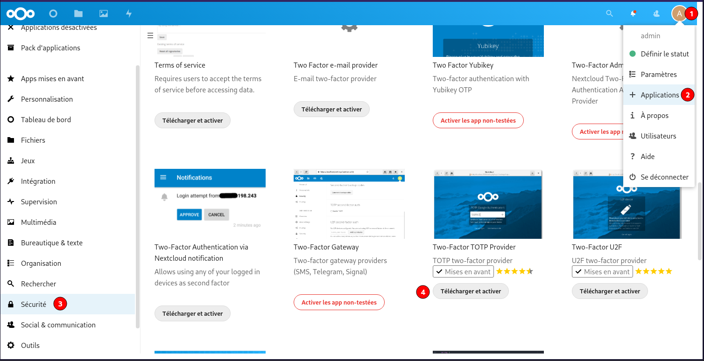
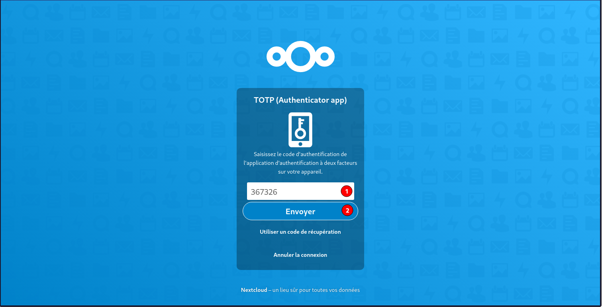
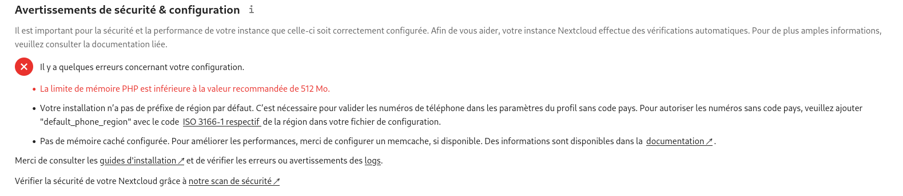
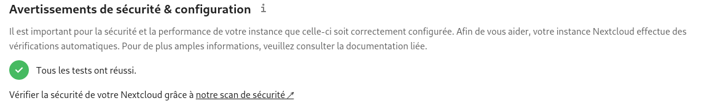
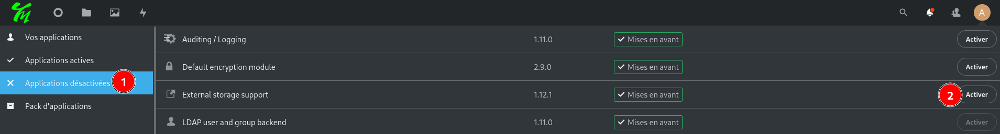
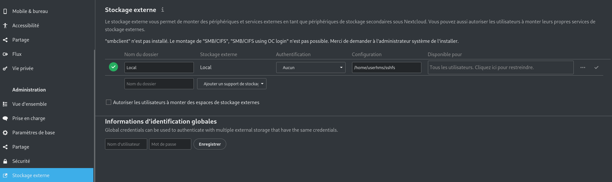

+++
title = 'Nginx, PHP8.0, MariaDB et Nextcloud'
date = 2021-09-23 00:00:00 +0100
categories = ['nextcloud']
+++
*Nextcloud peut être installé sur n'importe quel serveur supportant une version récente de PHP et supportant MariaDB (base de données par défaut), MySQL ou PostgreSQL.*

Serveur debian/ubuntu à jour  
Utilisateur avec droits sudo  

## Nginx PHP8.0 MariaDB

### nginx

    sudo apt install nginx

Oter le commentaire de la ligne `server_tokens off;` dans la configuration de base `/etc/nginx/nginx.conf`

* **worker_processes** : laisser **auto** ou pour profiter pleinement de la puissance de votre serveur, il est recommandé de mettre autant de worker_processes que de cœurs disponibles sur votre serveur. Pour connaître le nombre de cœurs sur votre serveur, il suffit de lancer la commande : `grep processor /proc/cpuinfo | wc -l`
* **server_tokens** : pour des raisons de sécurité, il est recommandé de désactiver l'envoi d'informations telles que le numéro de version de votre Nginx. Pour cela, décommentez cette directive dans le bloc http.  
* modifier le fichier `/etc/nginx/nginx.conf`  

On autorise tls1.2 et tls1.3 uniquement et ciphers off 

```
[...]
	ssl_protocols TLSv1.2 TLSv1.3;
	ssl_prefer_server_ciphers off;
[...]
```

Relancer nginx : `sudo systemctl restart nginx`

### PHP 8.0

Ajout du dépôt sury.org

    sudo -s

Pour installer la version de 8 de php, ajouter le dépôt sury.

```bash
apt install -y lsb-release apt-transport-https ca-certificates wget
wget -O /etc/apt/trusted.gpg.d/php.gpg https://packages.sury.org/php/apt.gpg
echo "deb https://packages.sury.org/php/ $(lsb_release -sc) main" |tee /etc/apt/sources.list.d/php.list
```

Installer php8.0

Mise à jour des dépôts :

    apt update

installer les paquets PHP nécessaires à nextcloud

    apt install php8.0 php8.0-cli php8.0-gd php8.0-imap php8.0-mysql php8.0-soap php8.0-apcu php8.0-common php8.0-gmp  php8.0-intl php8.0-opcache php8.0-xml php8.0-curl php8.0-igbinary php8.0-readline  php8.0-zip php8.0-bcmath php8.0-fpm php8.0-imagick php8.0-mbstring php8.0-redis imagemagick

### MariaDB

[Debian 10 Buster : installer et configurer MariaDB](/htmldoc/Debian%2010%20Buster%20-%20installer%20et%20configurer%20MariaDB.html)

## Nextcloud

- [Installer Nextcloud 22 – Ubuntu et Debian](https://www.jjworld.fr/installer-nextcloud-creer-son-cloud-personnel/)
- [Nextcloud Server Administration Guide](https://docs.nextcloud.com/server/latest/admin_manual/)
- [Manuel utilisateur de Nextcloud (fr)](https://docs.nextcloud.com/server/latest/user_manual/fr/)

### Installation

On télécharge Nextcloud 22 

    wget https://download.nextcloud.com/server/releases/latest-22.tar.bz2

Télécharger le SHA256 

    wget https://download.nextcloud.com/server/releases/latest-22.tar.bz2.sha256

Vérifier l'intégrité de l'archive téléchargée 

    sha256sum -c latest-22.tar.bz2.sha256 < latest-22.tar.bz2

Doit donner le résultat suivant : **latest-22.tar.bz2: OK**

Vérifier la signature PGP et la provenance de l'archive téléchargée (FACULTATIF)

```
sudo wget https://download.nextcloud.com/server/releases/latest.tar.bz2.asc
sudo wget https://nextcloud.com/nextcloud.asc
gpg --import nextcloud.asc
gpg --verify latest.tar.bz2.asc latest.tar.bz2
```

Donne le résultat suivant

```
gpg: Signature faite le jeu. 08 avril 2021 15:34:38 CEST
gpg:                avec la clef RSA 28806A878AE423A28372792ED75899B9A724937A
gpg: Bonne signature de « Nextcloud Security <security@nextcloud.com> » [inconnu]
gpg: Attention : cette clef n'est pas certifiée avec une signature de confiance.
gpg:             Rien n'indique que la signature appartient à son propriétaire.
Empreinte de clef principale : 2880 6A87 8AE4 23A2 8372  792E D758 99B9 A724 937A
```

Décompresser l'archive Nextcloud :

    tar -xvf latest-22.tar.bz2

Déplacement

    sudo mv nextcloud /var/www/

Supprimez les fichiers et signatures téléchargés :

    rm latest-22.tar.bz2* 

### Utilisateur nextcloud

Lors du déploiement basique d’un serveur HTTP, l’utilisateur sous lequel fonctionne ce serveur (Apache, Nginx...) est la plupart du temps www-data, nobody ou apache. Cela signifie que si plusieurs sites existent sous la même instance de Nginx, tous utilisent le même utilisateur. Or si l’un des sites s’avère corrompu par un utilisateur malveillant alors l’assaillant peut profiter pleinement de tous les droits de l’utilisateur sous lequel tourne le serveur web. Tous les sites s'avèrent donc vulnérables.

Pour des raisons évidentes de sécurité, il est donc recommandé de cloisonner ces utilisateurs et d'avoir un utilisateur dédié à la gestion du dossier nextcloud. Cet utilisateur aura des droits aussi restreints que possible à ce répertoire.
Par défaut, les fichiers de Nextcloud possèdent les permissions suivantes :

*    répertoires : 755 (permission de lecture, d'écriture et d'exécution pour le propriétaire et permission de lecture et d'exécution pour le groupe et les autres)
*    fichiers : 644 (permission de lecture et d'écriture pour le propriétaire et permission de lecture uniquement pour le groupe et les autres).

Nous allons donc modifier le propriétaire du répertoire `/var/www/nextcloud` et l'attribuer à un nouvel utilisateur dédié : **nextcloud** 

Par ailleurs, Nginx est lancé sous l'utilisateur **www-data** et doit avoir accès en lecture au répertoire `/var/www/nextcloud` pour lire les ressources statiques (HTML, CSS, JS, etc.). Nous allons donc attribuer le répertoire `/var/www/nextcloud` au groupe **www-data**. Enfin nous retirerons toutes les permissions de ce répertoire aux autres utilisateurs.

Créez un utilisateur nextcloud 

    sudo useradd -r nextcloud

Modifiez le propriétaire et le groupe du répertoire /var/www/nextcloud :

    sudo chown -R nextcloud:www-data /var/www/nextcloud

Retirez toutes les permissions aux autres utilisateurs :

    sudo chmod -R o-rwx /var/www/nextcloud

### MariaDB

Installation de MariaDB

Comme d'habitude, on utilise la commande apt-get pour installer les paquets de MariaDB

    sudo apt install mariadb-server

Mot de passe base nextcloud

    tr -cd '[:alnum:]' < /dev/urandom | fold -w16 | head -n1 

Accès base par su

    sudo -s  


Tout comme pour la gestion du répertoire nextcloud et pour plus de sécurité, vous allez tout d'abord créer un utilisateur MySQL **nextcloud** dédié à la base de données nextcloud, renseigner un mot de passe et ensuite lui donner les droits sur cette base de données.

```
mysql -u root <<-EOF
CREATE DATABASE nextcloud; 
CREATE USER "nextcloud"@"localhost"; 
SET password FOR "nextcloud"@"localhost" = password('xxxxxxxxxxxxxxxxxx'); 
GRANT ALL PRIVILEGES ON nextcloud.* TO "nextcloud"@"localhost" IDENTIFIED BY "xxxxxxxxxxxxxxxxxx"; 
FLUSH PRIVILEGES;
EOF
```

### cloud.xoyaz.xyz

Domaine xoyaz.xyz OVH 

```
$TTL 3600
@	IN SOA dns106.ovh.net. tech.ovh.net. (2021091801 86400 3600 3600000 300)
             IN NS     ns106.ovh.net.
             IN NS     dns106.ovh.net.
             IN A      5.2.79.127
             IN AAAA   2a04:52c0:101:82::1
cloud        IN A      45.145.166.51
cloud        IN AAAA   2a04:ecc0:8:a8:4567:833:0:1
hms          IN A      45.145.166.51
hms          IN AAAA   2a04:ecc0:8:a8:4567:833:0:1
wg           IN CNAME  xoyaz.xyz.
zic          IN CNAME  xoyaz.xyz.
```

**Certificats Let's Encrypt sur le domaine cloud.xoyaz.xyz**  
Installation des certificats

```
acme.sh --ecc --install-cert -d hms.xoyaz.xyz -d cloud.xoyaz.xyz --key-file /etc/ssl/private/xoyaz.xyz-key.pem --fullchain-file /etc/ssl/private/xoyaz.xyz-fullchain.pem --reloadcmd 'sudo systemctl reload nginx.service'
```

Editer le crontab

    crontab -e

```
56 0 * * * "/home/userhms/.acme.sh"/acme.sh --cron --home "/home/userhms/.acme.sh" --renew-hook "/home/userhms/.acme.sh/acme.sh --ecc --install-cert -d hms.xoyaz.xyz -d cloud.xoyaz.xyz --key-file /etc/ssl/private/xoyaz.xyz-key.pem --fullchain-file /etc/ssl/private/xoyaz.xyz-fullchain.pem  --reloadcmd 'sudo systemctl reload nginx.service'" > /dev/null
```

**PHP pool nextcloud**  
Création du pool nextcloud `/etc/php/8.0/fpm/pool.d/nextcloud.conf`

    nano /etc/php/8.0/fpm/pool.d/nextcloud.conf 

```
[nextcloud]
listen = /run/php/nextcloud.sock

listen.owner = nextcloud
listen.group = www-data

user = nextcloud
group = www-data

pm = ondemand
pm.max_children = 56
pm.process_idle_timeout = 60s
pm.max_requests = 500

env[HOSTNAME] = $HOSTNAME
env[PATH] = /usr/local/bin:/usr/bin:/bin
env[TMP] = /tmp
env[TMPDIR] = /tmp
env[TEMP] = /tmp
```

**mémoire pour PHP** , ajouter `memory_limit = 512M`  dans le fichier `/etc/php/8.0/fpm/php.ini`  

    sudo sed -i -e "s/^memory_limit \+= \+.*$/memory_limit = 512M/g" /etc/php/8.0/fpm/php.ini   
    sudo sed -i -e "s/^output_buffering \+= \+.*$/output_buffering = 0/g" /etc/php/8.0/fpm/php.ini

Vérification

    cat /etc/php/8.0/fpm/php.ini |egrep "memory_limit|^output_buffering"

```
output_buffering = 0
memory_limit = 512M
```

**Cache PHP : OPcache**  

*OPcache (qui signifie Optimizer Plus Cache) est introduit depuis la version 5.5.0 de PHP. Il sert à cacher l’opcode de PHP, c’est-à-dire les instructions de bas niveau générées par la machine virtuelle PHP lors de l’exécution d’un script. Autrement dit, le code pré-compilé est stocké en mémoire. Cela évite ainsi l’étape de compilation à chaque requête PHP. De plus, OPcache va optimiser l’exécution du code afin d’en améliorer les performances.*

Alternative A: Éditez le fichier /etc/php/8.0/fpm/php.ini,ajouter les lignes suivantes dans la section [opcache] :

    sudo nano /etc/php/8.0/fpm/php.ini

```
[opcache]
opcache.enable = 1
opcache.interned_strings_buffer = 8
opcache.max_accelerated_files = 10000
opcache.memory_consumption = 128
opcache.save_comments = 1
opcache.revalidate_freq = 1
```

Alternative B: Exécuter les instructions suivantes

```
sed -i -e "s/^;* *opcache\.enable *= *.*$/opcache.enable=1/g" /etc/php/8.0/fpm/php.ini
sed -i -e "s/^;* *opcache\.memory_consumption *= *.*$/opcache.memory_consumption=128/g" /etc/php/8.0/fpm/php.ini
sed -i -e "s/^;* *opcache\.interned_strings_buffer *= *.*$/opcache.interned_strings_buffer=8/g" /etc/php/8.0/fpm/php.ini 	 
sed -i -e "s/^;* *opcache\.max_accelerated_files *= *.*$/opcache.max_accelerated_files=10000/g" /etc/php/8.0/fpm/php.ini 	 
sed -i -e "s/^;* *opcache\.revalidate_freq *= *.*$/opcache.revalidate_freq=1/g" /etc/php/8.0/fpm/php.ini
sed -i -e "s/^;* *opcache\.save_comments *= *.*$/opcache.save_comments=1/g" /etc/php/8.0/fpm/php.ini
```

Vérification

    cat /etc/php/8.0/fpm/php.ini | \
	egrep "^;* *opcache\.enable *=|^;* *opcache\.interned_strings_buffer *=\
	|^;* *opcache\.max_accelerated_files *=|^;* *opcache\.memory_consumption *=\
	|^;* *opcache\.save_comments *=|^;* *opcache\.revalidate_freq *="

La nouvelle configuration sera prise en compte après redémarrage du service PHP-FPM :

    sudo systemctl restart php8.0-fpm.service

**Nginx cloud.xoyaz.xyz.conf**

NGINX Configuration <https://docs.nextcloud.com/server/22/admin_manual/installation/nginx.html>

Le fichier de configuration web `cloud.xoyaz.xyz.conf`

    sudo nano /etc/nginx/conf.d/cloud.xoyaz.xyz.conf

```
upstream php-handler {
    server unix:/var/run/php/nextcloud.sock;
}

server {
    listen 80;
    listen [::]:80;
    server_name cloud.xoyaz.xyz;
    # enforce https
    return 301 https://$server_name:443$request_uri;
}

server {
    listen 443 ssl http2;
    listen [::]:443 ssl http2;
    server_name cloud.xoyaz.xyz;

    # Use Mozilla's guidelines for SSL/TLS settings
    # https://mozilla.github.io/server-side-tls/ssl-config-generator/
    # NOTE: some settings below might be redundant
    ssl_certificate /etc/ssl/private/xoyaz.xyz-fullchain.pem;
    ssl_certificate_key /etc/ssl/private/xoyaz.xyz-key.pem;

    # TLS 1.3 only
    ssl_protocols TLSv1.3;
    ssl_prefer_server_ciphers off;
 
    # HSTS (ngx_http_headers_module is required) (63072000 seconds)
    add_header Strict-Transport-Security "max-age=63072000" always;
 
	# Virtual Host Configs
	include /etc/nginx/conf.d/hms.xoyaz.xyz.d/*.conf;

    # OCSP stapling
    ssl_stapling on;
    ssl_stapling_verify on;
 
    # verify chain of trust of OCSP response using Root CA and Intermediate certs
    ssl_trusted_certificate /etc/ssl/private/xoyaz.xyz-fullchain.pem;
 
    # replace with the IP address of your resolver
    resolver 8.8.8.8;


    # Add headers to serve security related headers
    # Before enabling Strict-Transport-Security headers please read into this
    # topic first.
    #add_header Strict-Transport-Security "max-age=15768000; includeSubDomains; preload;" always;
    #
    # WARNING: Only add the preload option once you read about
    # the consequences in https://hstspreload.org/. This option
    # will add the domain to a hardcoded list that is shipped
    # in all major browsers and getting removed from this list
    # could take several months.
    add_header Referrer-Policy "no-referrer" always;
    add_header X-Content-Type-Options "nosniff" always;
    add_header X-Download-Options "noopen" always;
    add_header X-Frame-Options "SAMEORIGIN" always;
    add_header X-Permitted-Cross-Domain-Policies "none" always;
    add_header X-Robots-Tag "none" always;
    add_header X-XSS-Protection "1; mode=block" always;

    # Remove X-Powered-By, which is an information leak
    fastcgi_hide_header X-Powered-By;

    # Path to the root of your installation
    root /var/www/nextcloud;

    location = /robots.txt {
        allow all;
        log_not_found off;
        access_log off;
    }

    # The following 2 rules are only needed for the user_webfinger app.
    # Uncomment it if you're planning to use this app.
    #rewrite ^/.well-known/host-meta /public.php?service=host-meta last;
    #rewrite ^/.well-known/host-meta.json /public.php?service=host-meta-json last;

    # The following rule is only needed for the Social app.
    # Uncomment it if you're planning to use this app.
    #rewrite ^/.well-known/webfinger /public.php?service=webfinger last;

    location = /.well-known/carddav {
      return 301 $scheme://$host:$server_port/remote.php/dav;
    }
    location = /.well-known/caldav {
      return 301 $scheme://$host:$server_port/remote.php/dav;
    }

    # Anything else is dynamically handled by Nextcloud
    location ^~ /.well-known            { return 301 /index.php$uri; }

    # set max upload size
    client_max_body_size 512M;
    fastcgi_buffers 64 4K;

    # Enable gzip but do not remove ETag headers
    gzip on;
    gzip_vary on;
    gzip_comp_level 4;
    gzip_min_length 256;
    gzip_proxied expired no-cache no-store private no_last_modified no_etag auth;
    gzip_types application/atom+xml application/javascript application/json application/ld+json application/manifest+json application/rss+xml application/vnd.geo+json application/vnd.ms-fontobject application/x-font-ttf application/x-web-app-manifest+json application/xhtml+xml application/xml font/opentype image/bmp image/svg+xml image/x-icon text/cache-manifest text/css text/plain text/vcard text/vnd.rim.location.xloc text/vtt text/x-component text/x-cross-domain-policy;

    # Uncomment if your server is build with the ngx_pagespeed module
    # This module is currently not supported.
    #pagespeed off;

    location / {
        rewrite ^ /index.php;
    }

    location ~ ^\/(?:build|tests|config|lib|3rdparty|templates|data)\/ {
        deny all;
    }
    location ~ ^\/(?:\.|autotest|occ|issue|indie|db_|console) {
        deny all;
    }

    location ~ ^\/(?:index|remote|public|cron|core\/ajax\/update|status|ocs\/v[12]|updater\/.+|oc[ms]-provider\/.+|.+\/richdocumentscode\/proxy)\.php(?:$|\/) {
        fastcgi_split_path_info ^(.+?\.php)(\/.*|)$;
        set $path_info $fastcgi_path_info;
        try_files $fastcgi_script_name =404;
        include fastcgi_params;
        fastcgi_param SCRIPT_FILENAME $document_root$fastcgi_script_name;
        fastcgi_param PATH_INFO $path_info;
        fastcgi_param HTTPS on;
        # Avoid sending the security headers twice
        fastcgi_param modHeadersAvailable true;
        # Enable pretty urls
        fastcgi_param front_controller_active true;
        fastcgi_pass php-handler;
        fastcgi_intercept_errors on;
        fastcgi_request_buffering off;
    }

    location ~ ^\/(?:updater|oc[ms]-provider)(?:$|\/) {
        try_files $uri/ =404;
        index index.php;
    }

    # Adding the cache control header for js, css and map files
    # Make sure it is BELOW the PHP block
    location ~ \.(?:css|js|woff2?|svg|gif|map)$ {
        try_files $uri /index.php$request_uri;
        add_header Cache-Control "public, max-age=15778463";
        # Add headers to serve security related headers (It is intended to
        # have those duplicated to the ones above)
        # Before enabling Strict-Transport-Security headers please read into
        # this topic first.
        #add_header Strict-Transport-Security "max-age=15768000; includeSubDomains; preload;" always;
        #
        # WARNING: Only add the preload option once you read about
        # the consequences in https://hstspreload.org/. This option
        # will add the domain to a hardcoded list that is shipped
        # in all major browsers and getting removed from this list
        # could take several months.
        add_header Referrer-Policy "no-referrer" always;
        add_header X-Content-Type-Options "nosniff" always;
        add_header X-Download-Options "noopen" always;
        add_header X-Frame-Options "SAMEORIGIN" always;
        add_header X-Permitted-Cross-Domain-Policies "none" always;
        add_header X-Robots-Tag "none" always;
        add_header X-XSS-Protection "1; mode=block" always;

        # Optional: Don't log access to assets
        access_log off;
    }

    location ~ \.(?:png|html|ttf|ico|jpg|jpeg|bcmap|mp4|webm)$ {
        try_files $uri /index.php$request_uri;
        # Optional: Don't log access to other assets
        access_log off;
    }
}
```

Vérifier et recharger nginx

    sudo nginx -t
    sudo systemctl reload nginx

### Paramétrage

Lancer  <https://cloud.xoyaz.xyz>  

Créer un compte administrateur et son mot de passe
admin 
Saisir les informations sur la base , utilisateur et mot de passe   
{:width="200"} {:width="200"} {:width="200"}  

Ne pas installer les applications recommandées  
Ne pas tenir compte de l'erreur d'adressage <https://apps/files/> à la fin de l'installation  
Fermer l'onglet et réouvrir le lien <https://cloud.xoyaz.xyz>
{: .prompt-danger }

Réinitialiser le mot de passe admin nextcloud

    sudo -u nextcloud php /var/www/nextcloud/occ user:resetpassword admin

### Authentification à deux facteurs

* [Utilisation de l’authentification à deux facteurs](https://docs.nextcloud.com/server/latest/user_manual/fr/user_2fa.html)  
* [Sécuriser son compte Nextcloud avec le 2FA](https://www.aukfood.fr/securiser-son-compte-nextcloud-avec-le-2fa/)  

Cette activation de la double authentification passe par plusieurs étapes.  
La première est d’installer une (ou plusieurs applications) permettant d’avoir un deuxième facteur d’authentification. Ces applications sont listées [le magasin des applications Nextcloud catégorie Sécurité](https://apps.nextcloud.com/categories/security). Il existe plusieurs applications, chacunes d’elles ayant une fonctionnalité précise.

Installer l'application [TOTP two-factor provider](https://apps.nextcloud.com/apps/twofactor_totp)   
{:width="600"}   
Ensuite se rendre dans Paramètres &rarr; Sécurité  
{:width="600"}   
Il faut sauver les code de récupération TOTP  
Paramétrer les applications TOTP avec le code ou QrCode  
Vérifier pour valider le passage en authorisation à deux facteurs TOTP  
Se reconnecter à l'application et après saisie login/Mot de passe , un code est exigé    
{:width="600"}   

## Opérations sur nextcloud

### Optimisation 

{:width="600"}

**Votre installation n’a pas de préfixe de région par défaut.** , ajouter `'default_phone_region' => 'FR',` dans le  le fichier `/var/www/nextcloud/config/config.php` ou exécuter la commande suivante   
Configuration de la région par défaut pour les numéros de téléphone

    sudo -u nextcloud php /var/www/nextcloud/occ config:system:set default_phone_region --value="FR"

**Cache de données : APCu & Redis**  

*APCu permet notamment de mettre en cache les variables PHP et de les stocker en mémoire vive. Redis est un système de gestion de base de données NoSQL avec un système de clef-valeur scalable (s’adapte à la charge). Une des principales caractéristiques de Redis est de conserver l’intégralité des données en RAM. Cela permet d’obtenir d’excellentes performances en évitant les accès disques, particulièrement coûteux.*  
[How To Install and Secure Redis on Ubuntu 18.04](https://www.digitalocean.com/community/tutorials/how-to-install-and-secure-redis-on-ubuntu-18-04)

Installez les paquets APCu et Redis :

	sudo apt install php8.0-apcu redis-server php8.0-redis 
	
Ajoutez les lignes suivantes dans le fichier /var/www/nextcloud/config/config.php :

	sudo nano /var/www/nextcloud/config/config.php

```
  'memcache.local' => '\OC\Memcache\APCu',
  'memcache.distributed' => '\OC\Memcache\Redis',
  'memcache.locking' => '\OC\Memcache\Redis',
  'redis' => [
     'host'     => 'localhost',
     'port'     => 6379,
  ],
```

La nouvelle configuration sera prise en compte après redémarrage du service PHP-FPM :

	sudo systemctl restart php8.0-fpm.service

Si tout est bien paramétré , voici le message   
{:width="600"}

**Stockage externe**  
{:width="600"}  
{:width="600"}


**Travaux cron**  

Vous pouvez programmer des tâches cron de trois façons : en utilisant AJAX, Webcron ou cron. La méthode par défaut consiste à utiliser AJAX. Cependant, la méthode recommandée est d'utiliser cron. 

Si systemd est installé sur le système, un timer systemd peut être une alternative à un cronjob.

Cette approche nécessite deux fichiers : `nextcloudcron.service` et `nextcloudcron.timer`  
Créez ces deux fichiers dans `/etc/systemd/system/` 

`/etc/systemd/system/nextcloudcron.service` doit ressembler à ceci :

```
[Unit]
Description=Nextcloud cron.php job

[Service]
User=nextcloud
ExecStart=/usr/bin/php -f /var/www/nextcloud/cron.php
KillMode=process
```

Remplacez l'utilisateur `User` par l'utilisateur de votre serveur http (**www-data** si ce n'est pas **nextcloud**) et `/var/www/nextcloud/cron.php` par l'emplacement de cron.php dans votre répertoire nextcloud.

Le paramètre `KillMode=process` est nécessaire pour que les programmes externes qui sont lancés par la tâche cron continuent à fonctionner après la fin de la tâche cron.

Notez que le fichier **.service** unit n'a pas besoin d'une section `[Install]`. Veuillez vérifier votre installation car nous l'avons recommandé dans les versions précédentes de ce manuel d'administration.

Le fichier `/etc/systemd/system/nextcloudcron.timer` devrait ressembler à ceci :

```
[Unit]
Description=Run Nextcloud cron.php every 5 minutes

[Timer]
OnBootSec=5min
OnUnitActiveSec=5min
Unit=nextcloudcron.service

[Install]
WantedBy=timers.target
```

Les parties importantes de l'unité de minuterie sont **OnBootSec** et **OnUnitActiveSec**. **OnBootSec** démarre la minuterie 5 minutes après le démarrage, sinon vous devriez la démarrer manuellement après chaque démarrage. **OnUnitActiveSec** déclenchera une minuterie de 5 minutes après la dernière activation de l'unité de service.

Maintenant, tout ce qui reste à faire est de démarrer et d'activer le minuteur en exécutant cette commande :

    systemctl enable --now nextcloudcron.timer

Lorsque l'option `--now` est utilisée avec enable, l'unité respective sera également démarrée.

Note : Il n'est pas obligatoire de sélectionner l'option Cron dans le menu d'administration pour les travaux en arrière-plan, car une fois que cron.php est exécuté à partir de la ligne de commande ou du service cron, il sera automatiquement réglé sur Cron.  
{:width="600"}
{: .prompt-info }

Vérifier

    systemctl list-timers

```
NEXT                          LEFT          LAST                          PASSED       UNIT                         ACTIVATES
Thu 2021-09-23 21:59:15 CEST  3min 45s left Thu 2021-09-23 21:54:15 CEST  1min 14s ago nextcloudcron.timer          nextcloudcron.service
```

**Nouveau mot de passe utilisateur en ligne de commande**   

    php occ user:resetpassword NOM_UTILISATEUR

Exemple, changer le mot de passe administrateur

    php occ user:resetpassword admin

**Base de données MariaDB**  
Edition du fichier mysql.cnf 

    sudo nano /etc/mysql/mariadb.conf.d/50-server.cnf

section mysqld

```
[mysqld]
innodb_buffer_pool_size=512M
innodb_io_capacity=4000


transaction_isolation = READ-COMMITTED
binlog_format = ROW
```

Redémarrer MariaDB 

    sudo systemctl restart mariadb.service

**Configuration de Redis**  
Source : [Documentation Nextcloud – Redis](https://docs.nextcloud.com/server/19/admin_manual/configuration_server/caching_configuration.html)  
Ajout de l’utilisateur nextcloud au groupe redis  

    sudo usermod -a -G redis nextcloud

Configuration du fichier `redis.conf` 

```
sudo -s
sed -i -e "s/^#* *port +*.*$/port 0/g" /etc/redis/redis.conf
sed -i -e "s/^#* *unixsocket +*.*$/unixsocket \/var\/run\/redis\/redis-server.sock/g" /etc/redis/redis.conf
sed -i -e "s/^#* *unixsocketperm+*.*$/unixsocketperm 770/g" /etc/redis/redis.conf
```

Vérification

    cat /etc/redis/redis.conf | egrep "^#*port +|^#* *unixsocket +|^#* *unixsocketperm +"

```
port 0
unixsocket /var/run/redis/redis-server.sock
unixsocketperm 770
```

Redémarrage de Redis 

    sudo systemctl restart redis-server.service
    ps ax | grep redis

```
 8111 ?        Ssl    0:00 /usr/bin/redis-server 127.0.0.1:0
 8120 pts/0    R+     0:00 grep redis
```

**File Locking et Memory Cache**  
Source : [File Locking](https://docs.nextcloud.com/server/15/admin_manual/configuration_files/files_locking_transactional.html) et [Memory Caching](https://docs.nextcloud.com/server/19/admin_manual/configuration_server/caching_configuration.html)

    sudo -s
    cd /var/www/nextcloud

Configuration avec la commande occ:

```
# Activation de filelocking
sudo -u nextcloud php /var/www/nextcloud/occ config:system:set filelocking.enabled --value="true"
 
# Configuration du Redis
sudo -u nextcloud php /var/www/nextcloud/occ config:system:set redis host --value="/var/run/redis/redis-server.sock"
sudo -u nextcloud php /var/www/nextcloud/occ config:system:set redis port --value="0"
sudo -u nextcloud php /var/www/nextcloud/occ config:system:set redis timeout --value="0.0"
  
# Configuration de memcache.distributed (à effectuer après la configuration de Redis)
sudo -u nextcloud php /var/www/nextcloud/occ config:system:set memcache.distributed --value="\OC\Memcache\Redis"
 
# Configuration de memcache.local et memcache.locking
sudo -u nextcloud php /var/www/nextcloud/occ config:system:set memcache.local --value="\OC\Memcache\APCu"
sudo -u nextcloud php /var/www/nextcloud/occ config:system:set memcache.locking --value="\OC\Memcache\Redis"
```

En cas d'erreur 

```
An unhandled exception has been thrown:
OC\HintException: [0]: Memcache \OC\Memcache\APCu not available for local cache (Is the matching PHP module installed and enabled?)
```

Il faut ajouter `apc.enable_cli=1` au fichier `/etc/php/8.0/mods-available/apcu.ini` puis relancer le service

```
extension=apcu.so
apc.enable_cli=1
```

Redémarrage nginx fpm :

    sudo systemctl restart php8.0-fpm.service

Vérification :

    cat /var/www/nextcloud/config/config.php | egrep "'filelocking\.enabled|'memcache\.local|'memcache\.locking|'host|'port|'timeout|'memcache\.distributed"

```
  'filelocking.enabled' => 'true',
  'memcache.local' => '\\OC\\Memcache\\APCu',
  'memcache.distributed' => '\\OC\\Memcache\\Redis',
  'memcache.locking' => '\\OC\\Memcache\\Redis',
    'host' => '/var/run/redis/redis-server.sock',
    'port' => '0',
    'timeout' => '0.0',
```

Redémarrage nginx fpm :

    sudo systemctl restart php8.0-fpm.service

**Documentation**

* [Configuring a MySQL or MariaDB database](https://docs.nextcloud.com/server/latest/admin_manual/configuration_database/linux_database_configuration.html#configuring-a-mysql-or-mariadb-database)
* [Enable PHP OPcache](https://docs.nextcloud.com/server/latest/admin_manual/installation/server_tuning.html#enable-php-opcache)
* [Memory Caching](https://docs.nextcloud.com/server/latest/admin_manual/configuration_server/caching_configuration.html)
* [uploading big files > 512MB](https://docs.nextcloud.com/server/latest/admin_manual/configuration_files/big_file_upload_configuration.html)

### Mise à niveau manuelle

Commencez toujours par faire une nouvelle sauvegarde et désactivez toutes les applications tierces.

1.    Sauvegardez votre base de données Nextcloud Server existante, le répertoire de données et le fichier config.php. (Voir Sauvegarde, pour les informations de restauration voir Restauration de la sauvegarde)

2.    Téléchargez et décompressez la dernière version du serveur Nextcloud (fichier d'archive) depuis nextcloud.com/install/ dans un répertoire vide en dehors de votre installation actuelle.

    Note  
    Pour décompresser votre nouvelle archive, exécutez : unzip nextcloud-[version].zip ou tar -xjf nextcloud-[version].tar.bz2

3.    Arrêtez votre serveur Web.

4.    Si vous exécutez une tâche cron pour l'entretien de nextcloud, désactivez-la en commentant l'entrée dans le fichier crontab

        crontab -u www-data -e

    (Mettez un # au début de la ligne correspondante).

5.    Renommez votre répertoire Nextcloud actuel, par exemple nextcloud-old.

6.    La décompression de la nouvelle archive crée un nouveau répertoire nextcloud peuplé de vos nouveaux fichiers de serveur. Déplacez ce répertoire et son contenu vers l'emplacement original de votre ancien serveur. Par exemple `/var/www/`, de sorte que vous ayez à nouveau `/var/www/nextcloud`.

7.    Copiez le fichier `config/config.php` de votre ancien répertoire Nextcloud vers votre nouveau répertoire Nextcloud.

8.    Si vous gardez votre répertoire `data/` dans votre répertoire `nextcloud/`, copiez-le de votre ancienne version de Nextcloud vers votre nouveau `nextcloud/`. Si vous le conservez en dehors de `nextcloud/`, vous n'avez rien à faire avec lui, car son emplacement est configuré dans votre config.php original, et aucune des étapes de mise à niveau ne le touche.

9.    Si vous utilisez une application tierce, il se peut qu'elle ne soit pas toujours disponible dans votre instance Nextcloud mise à niveau/nouvelle. Pour vérifier cela, comparez une liste des applications dans le nouveau dossier `nextcloud/apps/` à une liste des applications dans votre ancien dossier `nextcloud/apps/` sauvegardé. Si vous trouvez des applications tierces dans l'ancien dossier qui doivent être dans la nouvelle instance/mise à niveau, copiez-les simplement et assurez-vous que les autorisations sont configurées comme indiqué ci-dessous.

10.    Si vous utilisez un thème tiers, assurez-vous de le copier de votre répertoire `themes/` vers votre nouveau répertoire. Il est possible que vous ayez à le modifier après la mise à niveau.  

11. Ajustez la propriété et les permissions des fichiers :

        chown -R www-data:www-data nextcloud
        find nextcloud/ -type d -exec chmod 750 {} \ ;
        find nextcloud/ -type f -exec chmod 640 {} \ ;

12.    Redémarrez votre serveur Web.

13.    Maintenant, lancez la mise à niveau depuis la ligne de commande en utilisant occ, comme cet exemple sur Ubuntu Linux :

        sudo -u www-data php occ upgrade

    ( !) cette commande DOIT être exécutée à partir du répertoire d'installation de nextcloud.

14.    L'opération de mise à niveau prend quelques minutes à quelques heures, en fonction de la taille de votre installation. Lorsqu'elle est terminée, vous verrez un message de réussite ou un message d'erreur qui vous indiquera où la mise à niveau a échoué.

15.    Réactivez le cron-job nextcloud. (Voir l'étape 4 ci-dessus).

        crontab -u www-data -e

    (Supprimez le # au début de la ligne correspondante dans le fichier crontab).

Connectez-vous et jetez un coup d'oeil au bas de votre page d'administration pour vérifier le numéro de version. Vérifiez vos autres paramètres pour vous assurer qu'ils sont corrects. Allez sur la page Apps et vérifiez les applications principales pour vous assurer que les bonnes sont activées. Réactivez vos applications tierces.

### Sauvegarde de Nextcloud

Source : [Nextcloud Backup](https://docs.nextcloud.com/server/latest/admin_manual/maintenance/backup.html)

#### Création des répertoires de sauvegarde 

```
# Fichiers
mkdir -p /backups/nextcloud/files
# Base de données
mkdir -p /backups/nextcloud/database
# Permissions
chmod -R o-rwx /backups/
```

#### Activation mode Maintenance 

```
# Activation
sudo -u www-data php /var/www/nextcloud/occ maintenance:mode --on
# Vérification
sudo -u www-data php /var/www/nextcloud/occ maintenance:mode
```

#### Sauvegarde des fichiers 

dans un répertoire /backups/nextcloud/ 

```
# Sauf répertoire data et corbeille
rsync -Aavx /var/www/nextcloud/ \
/backups/nextcloud/files/nextcloud-backup_`date +"%Y%m%d_%H%M%S"`/ \
--exclude={'data/*','*/files_trashbin/files/*'}
```

Le répertoire de sauvegarde sera /backups/nextcloud/files/nextcloud-backup_20201010_153025/ pour une sauvegarde effectuée le 10 Octobre 2020 à 15:30:25.

Important : Si vous souhaitez tout de même sauvegarder le répertoire data et la corbeille, il faudra supprimer le paramètre --exclude.

#### Sauvegarde base de données MySQL/MariaDB 

```
mysqldump --single-transaction -h localhost -u nextcloud -pVotreMotDePasse nextcloud > \
/backups/nextcloud/database/nextcloud-sqlbkp_`date +"%Y%m%d_%H%M%S"`.bak
```

-h : nom ou IP du serveur de base de données  
-u : utilisateur de la base de données  
-p : mot de passe de l’utilisateur  

Attention :

– Pas d’espace entre -p et le mot de passe
– Remplacer VotreMotDePasse par le mot de passe de l’utilisateur.

#### Désactivation mode Maintenance

```
# Désactivation 
sudo -u www-data php /var/www/nextcloud/occ maintenance:mode --off
```

#### Exemple de script de sauvegarde

```bash
#!/bin/bash
# Path
nextcloudPath=/var/www/nextcloud/
occPath=$nextcloudPath\occ
sourcePath=/var/www/nextcloud/
mainDestinationPath=/backups/nextcloud/`date +"%Y/%m"`/
filesDestinationPath=$mainDestinationPath\files/
databaseDestinationPath=$mainDestinationPath\database/
# Database
dbhost=$(cat $nextcloudPath\config/config.php | egrep "dbhost" | sed 's/^.*\=> *'\''//' | sed 's/'\'',.*$//')
dbname=$(cat $nextcloudPath\config/config.php | egrep "dbname" | sed 's/^.*\=> *'\''//' | sed 's/'\'',.*$//')
dbuser=$(cat $nextcloudPath\config/config.php | egrep "dbuser" | sed 's/^.*\=> *'\''//' | sed 's/'\'',.*$//')
dbpassword=$(cat $nextcloudPath\config/config.php | egrep "dbpassword" | sed 's/^.*\=> *'\''//' | sed 's/'\'',.*$//')
# Verbose
cyan='\e[1;36m'
white='\e[1;37m'
neutral='\e[0;m'
echo -e "${cyan}dbhost : ${white}$dbhost${neutral}"
echo -e "${cyan}dbname : ${white}$dbname${neutral}"
echo -e "${cyan}dbuser : ${white}$dbuser${neutral}"
#echo -e "${cyan}dbpassword : ${white}$dbpassword${neutral}"
read -t 10 -p "The backup will start after 10 seconds" || true
# Destinations creation
mkdir -p $filesDestinationPath
mkdir -p $databaseDestinationPath
chmod -R o-rwx /backups/
# Maintenance mode activation
sudo -u www-data php $occPath maintenance:mode --on
# Database backup
mysqldump --single-transaction -h $dbhost -u $dbuser -p$dbpassword $dbname > $databaseDestinationPath\nextcloud-sqlbkp_`date +"%Y%m%d_%H%M%S"`.bak
# Files backup
rsync -Aavx $sourcePath $filesDestinationPath\nextcloud-backup_`date +"%Y%m%d_%H%M%S"`/ --exclude={'data/*','*/files_trashbin/files/*'}
#rsync -Aavx $sourcePath $filesDestinationPath\nextcloud-backup_`date +"%Y%m%d_%H%M%S"`/
# Maintenance mode deactivation
sudo -u www-data php $occPath maintenance:mode --off
exit 0
```

Exemple de restauration : [Nextcloud – Restoring backup](https://docs.nextcloud.com/server/latest/admin_manual/maintenance/restore.html?highlight=restore)


