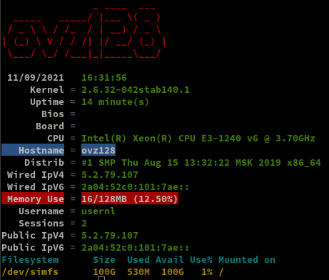

+++
title = 'Serveur de stockage OVZ-STORAGE-128 LiteServer Debian 9 IP 5.2.79.107'
date = 2021-09-24 00:00:00 +0100
categories = ['vps']
+++
{:width="50"}

## Liteserver

  
`LiteServer backup OVZ-STORAGE-128 ARRETE DEFINITIVEMENT le 24 septembre 2021`{: .prompt-info }

*[{:width="200"}](https://www.liteserver.nl/) est votre partenaire pour une connectivité réseau de qualité. Nous avons les routes les plus courtes et les plus rapides vers des milliers de réseaux mondiaux. Nous avons des POP dans plusieurs pays avec une connectivité aux points d'échange locaux pour acheminer le trafic aussi efficacement que possible.  
Notre réseau est rapide et évolutif à tout moment.*

* [Client Panel](https://clients.liteserver.nl/clientarea.php)
* [VPS Control Panel Access](https://vpspanel.liteserver.nl)

## OpenVz Debian Stretch

Réinstallation complète le 11 septembre 2021.
{: .prompt-info }

{:width="100"}

OVZ-STORAGE-128  
Mémoire : 128 Mo  
Disk : 100 Go  

IP V4 : 5.2.79.107  
Gateway 	5.2.79.1  
Netmask 	255.255.255.0  
Nameserver 	185.31.172.240  
Nameserver 	89.188.29.4  

IP V6 : 2a04:52c0:101:7ae::7a5e  
Subnet 	2a04:52c0:101:7ae::/64  
Gateway 	2a04:52c0:101::1  
Nameserver 	2a01:6340:1:20:4::10  
Nameserver 	2a01:1b0:7999:446::1:4  

### Connexion root

    ssh root@5.2.79.107

Changement mot de passe

    passwd root

Mise à jour

    apt update && apt upgrade

Installer utilitaires  

    apt install rsync curl tmux jq figlet git mailutils dnsutils p7zip-full -y

### Hostname

    hostnamectl

```
   Static hostname: ovz128
         Icon name: computer-container
           Chassis: container
        Machine ID: e99f11664be0498a9058bec3da43b127
           Boot ID: c1370365279a495f9caac1854599279a
    Virtualization: openvz
  Operating System: Debian GNU/Linux 9 (stretch)
            Kernel: Linux 2.6.32-042stab140.1
      Architecture: x86-64
```

### Europe/Paris (TimeZone tzdata)

Europe/Amsterdam  

    dpkg-reconfigure tzdata

```
Current default time zone: 'Europe/Amsterdam'
Local time is now:      Sat Sep 11 16:22:49 CEST 2021.
Universal Time is now:  Sat Sep 11 14:22:49 UTC 2021.
```

### Création utilisateur

Utilisateur **usernl**  

    useradd -m -d /home/usernl/ -s /bin/bash usernl

Mot de passe **usernl**  

    passwd usernl

Visudo pour les accès root via utilisateur **usernl**  

    apt install sudo 
    echo "usernl     ALL=(ALL) NOPASSWD: ALL" >> /etc/sudoers


Déconnexion puis connexion ssh en mode utilisateur  

    ssh usernl@5.2.79.107

### OpenSSH, clé et script

{:width="100"}

**connexion avec clé**  
<u>sur l'ordinateur de bureau</u>
Générer une paire de clé curve25519-sha256 (ECDH avec Curve25519 et SHA2) pour une liaison SSH avec le serveur.  

    ssh-keygen -t ed25519 -o -a 100 -f ~/.ssh/OVZ-STORAGE-128

Envoyer les clés publiques sur le serveur KVM   

    scp ~/.ssh/OVZ-STORAGE-128.pub usernl@5.2.79.107:/home/usernl/

<u>sur le serveur KVM</u>
On se connecte  

    ssh usernl@5.2.79.107

Copier le contenu de la clé publique dans /home/$USER/.ssh/authorized_keys  

    cd ~

Sur le KVM ,créer un dossier .ssh  

```bash
mkdir .ssh
cat $HOME/OVZ-STORAGE-128.pub >> $HOME/.ssh/authorized_keys
```

et donner les droits  

    chmod 600 $HOME/.ssh/authorized_keys

effacer le fichier de la clé  

    rm $HOME/*.pub

Modifier la configuration serveur SSH  

    sudo nano /etc/ssh/sshd_config

Modifier

```conf
Port 55036
PermitRootLogin no
PasswordAuthentication no
```


<u>session SSH ne se termine pas correctement lors d'un "reboot" à distance</u>  
Si vous tentez de **redémarrer/éteindre** une machine distance par **ssh**, vous pourriez constater que votre session ne se termine pas correctement, vous laissant avec un terminal inactif jusqu'à l'expiration d'un long délai d'inactivité. Il existe un bogue 751636 à ce sujet. Pour l'instant, la solution de contournement à ce problème est d'installer :  

    sudo apt-get install libpam-systemd

cela terminera la session ssh avant que le réseau ne tombe.  
Veuillez noter qu'il est nécessaire que PAM soit activé dans sshd.  

Relancer openSSH  

    sudo systemctl restart sshd

Accès depuis le poste distant avec la clé privée  

    ssh usernl@5.2.79.107 -p 55036 -i ~/.ssh/OVZ-STORAGE-128  # choix par défaut ,pour la compatibilité avec l'ancien serveur de sauvegarde de 128Go

### Outils, scripts motd et ssh_rc_bash

Motd

    sudo rm /etc/motd && sudo nano /etc/motd

```
   ___ __   __ ____     _  ___  ___        
  / _ \\ \ / /|_  /___ / ||_  )( _ )       
 | (_) |\ V /  / /|___|| | / / / _ \       
  \___/  \_/_ /___|__  |_|/___|\___/  ____ 
 | __|   |_  )  |__  |/ _ \  / | /  \|__  |
 |__ \ _  / /  _  / / \_, /_ | || () | / / 
 |___/(_)/___|(_)/_/   /_/(_)|_| \__/ /_/  
                                           
```

Script **ssh_rc_bash**  
>**ATTENTION!!! Les scripts sur connexion peuvent poser des problèmes pour des appels externes autres que ssh**

    wget https://static.xoyaz.xyz/files/ssh_rc_bash
    chmod +x ssh_rc_bash # rendre le bash exécutable
    ./ssh_rc_bash        # exécution



### systemd/journal

Ajout de l'utilisateur courant au groupe systemd-journal  

    sudo gpasswd -a $USER systemd-journal

Accès utilisateur aux fichiers log     

    sudo gpasswd -a $USER adm

Après déconnexion puis reconnexion 

```
Linux ovz128 2.6.32-042stab140.1 #1 SMP Thu Aug 15 13:32:22 MSK 2019 x86_64
   ___ __   __ ____     _  ___  ___        
  / _ \\ \ / /|_  /___ / ||_  )( _ )       
 | (_) |\ V /  / /|___|| | / / / _ \       
  \___/  \_/_ /___|__  |_|/___|\___/  ____ 
 | __|   |_  )  |__  |/ _ \  / | /  \|__  |
 |__ \ _  / /  _  / / \_, /_ | || () | / / 
 |___/(_)/___|(_)/_/   /_/(_)|_| \__/ /_/  
Last login: Sat Sep 11 16:30:39 2021 from 194.110.113.91
```

l'utilisateur a accès au journal:  

    journalctl

Pour avoir les lignes NON TRONQUEES  

    export SYSTEMD_LESS=FRXMK journalctl

Pour un mode permanent ,modifier **~/.bashrc**

    echo "export SYSTEMD_LESS=FRXMK journalctl" >> ~/.bashrc

Locales

    apt-get install locales
    locale-gen en_US.UTF-8

### Erreurs,Avertissements

#### Services

```
usernl@backup:~$ systemctl list-units --type=service
  UNIT                           LOAD   ACTIVE SUB     DESCRIPTION                                 
  console-getty.service          loaded active running Console Getty                               
  cron.service                   loaded active running Regular background program processing daemon
  dbus.service                   loaded active running D-Bus System Message Bus                    
  exim4.service                  loaded active running LSB: exim Mail Transport Agent              
  getty@tty2.service             loaded active running Getty on tty2                               
  networking.service             loaded active exited  Raise network interfaces                    
  quota.service                  loaded active exited  Initial Check File System Quotas            
● rc-local.service               loaded failed failed  /etc/rc.local Compatibility                 
  rsyslog.service                loaded active running System Logging Service                      
  ssh.service                    loaded active running OpenBSD Secure Shell server                 
  systemd-journal-flush.service  loaded active exited  Flush Journal to Persistent Storage         
  systemd-journald.service       loaded active running Journal Service                             
  systemd-logind.service         loaded active running Login Service                               
  systemd-remount-fs.service     loaded active exited  Remount Root and Kernel File Systems        
  systemd-sysctl.service         loaded active exited  Apply Kernel Variables                      
  systemd-tmpfiles-setup.service loaded active exited  Create Volatile Files and Directories       
  systemd-udev-trigger.service   loaded active exited  udev Coldplug all Devices                   
  systemd-udevd.service          loaded active running udev Kernel Device Manager                  
  systemd-update-utmp.service    loaded active exited  Update UTMP about System Boot/Shutdown      
  systemd-user-sessions.service  loaded active exited  Permit User Sessions                        
  user@1000.service              loaded active running User Manager for UID 1000                   
● vzquota.service                loaded failed failed  LSB: Start vzquota at the end of boot       

LOAD   = Reflects whether the unit definition was properly loaded.
ACTIVE = The high-level unit activation state, i.e. generalization of SUB.
SUB    = The low-level unit activation state, values depend on unit type.

22 loaded units listed. Pass --all to see loaded but inactive units, too.
To show all installed unit files use 'systemctl list-unit-files'.
```

Désactiver rc.local et vzquota.service 

    sudo systemctl disable rc-local.service 
    sudo systemctl disable vzquota.service

## Parefeu (iptables)

  
On utilise un service systemd  
Créer le fichier le script **/sbin/iptables-firewall.sh**

    sudo nano /sbin/iptables-firewall.sh

```
#!/bin/bash
# Configure iptables firewall

# Limit PATH
PATH="/sbin:/usr/sbin:/bin:/usr/bin"

# iptables configuration
firewall_start() {
###################
#      IPv4       #
###################

# refuser input et forward par défaut, accepter output
iptables -t filter -P INPUT DROP
iptables -t filter -P FORWARD DROP
iptables -t filter -P OUTPUT ACCEPT

# interface lo (loop) accessible
iptables -A INPUT -i lo -j ACCEPT
iptables -A OUTPUT -o lo -j ACCEPT

# maintenir les connexions établies
iptables -A INPUT -m state --state RELATED,ESTABLISHED -j ACCEPT
iptables -A OUTPUT -m state --state RELATED,ESTABLISHED -j ACCEPT

# accepter en entrée le ping (icmp), et les
# connexions sur les ports nécessaires.
iptables -A INPUT -p icmp --icmp-type echo-request -m conntrack --ctstate NEW -m limit --limit 1/s --limit-burst 1 -j ACCEPT
iptables -A INPUT -p tcp --dport 55036 -j ACCEPT
iptables -A INPUT -p udp --dport 55036 -j ACCEPT

# accepter en sortie le ping, les requêtes HTTP(S), DNS,
# et les connexions sur les ports nécessaires.
iptables -A OUTPUT -p icmp --icmp-type echo-request -m conntrack --ctstate NEW -j ACCEPT
iptables -A OUTPUT -p udp --dport 53 -j ACCEPT
iptables -A OUTPUT -p tcp --dport 53 -j ACCEPT

###################
#      IPv6       #
###################

# refuser input et forward par défaut, accepter output
ip6tables -t filter -P INPUT DROP
ip6tables -t filter -P FORWARD DROP
ip6tables -t filter -P OUTPUT ACCEPT

# interface lo (loop) accessible
ip6tables -A INPUT -i lo -j ACCEPT
ip6tables -A OUTPUT -o lo -j ACCEPT

# maintenir les connexions établies
ip6tables -A INPUT -m state --state RELATED,ESTABLISHED -j ACCEPT
ip6tables -A OUTPUT -m state --state RELATED,ESTABLISHED -j ACCEPT

# accepter en entrée le ping (icmpv6), les
# connexions entrantes déjà établies et les connexions sur les ports nécessaires.
ip6tables -A INPUT -p icmpv6 --icmpv6-type echo-request -m conntrack --ctstate NEW -m limit --limit 1/s --limit-burst 1 -j ACCEPT
ip6tables -A INPUT -p tcp --dport 55036 -j ACCEPT
ip6tables -A INPUT -p udp --dport 55036 -j ACCEPT

# accepter en sortie le ping, les requêtes HTTP(S), DNS,
# et les connexions sur les ports nécessaires.
ip6tables -t filter -A OUTPUT -p icmpv6 --icmpv6-type echo-request -j ACCEPT
ip6tables -A OUTPUT -p udp --dport 53 -j ACCEPT
ip6tables -A OUTPUT -p tcp --dport 53 -j ACCEPT
}

# clear iptables configuration
firewall_stop() {
  iptables -F
  iptables -X
  iptables -P INPUT   ACCEPT
  iptables -P FORWARD ACCEPT
  iptables -P OUTPUT  ACCEPT
  ip6tables -F
  ip6tables -X
  ip6tables -P INPUT   ACCEPT
  ip6tables -P FORWARD ACCEPT
  ip6tables -P OUTPUT  ACCEPT
}

# execute action
case "$1" in
  start|restart)
    echo "Starting firewall"
    firewall_stop
    firewall_start
    ;;
  stop)
    echo "Stopping firewall"
    firewall_stop
    ;;
esac
```

Les droits et exécutable

    sudo chown root:root /sbin/iptables-firewall.sh
    sudo chmod 750 /sbin/iptables-firewall.sh 

Créer le service systemd **iptables-firewall.service**

```
cat << EOF | sudo tee /etc/systemd/system/iptables-firewall.service
[Unit]
Description=iptables firewall service
After=network.target

[Service]
Type=oneshot
ExecStart=/sbin/iptables-firewall.sh start
RemainAfterExit=true
ExecStop=/sbin/iptables-firewall.sh stop
StandardOutput=journal

[Install]
WantedBy=multi-user.target
EOF
```

Recharger systemd manager

    sudo systemctl daemon-reload

Lancer le service iptables et l'activer

    sudo systemctl start iptables-firewall # vérifier le fonctionnement avant de valider
    sudo systemctl enable iptables-firewall

## Rsync

Création des dossiers

    mkdir -p $HOME/{BiblioCalibre,CalibreTechnique,musique}

Copier la clé privée **OVZ-STORAGE-128** dans le dossier **~/.ssh**  
Les droits : `chmod 600 .ssh/OVZ-STORAGE-128`  

On se connecte depuis l'adresse ip 5.2.79.107 sur l'adresse ip 5.2.79.127 via ssh   

    ssh -p 55036 -i .ssh/OVZ-STORAGE-128 usernl@5.2.79.127

```
The authenticity of host '[5.2.79.127]:55036 ([5.2.79.127]:55036)' can't be established.
ECDSA key fingerprint is SHA256:NuFqR5id10fVzRLsSTqJ4vBpFnNYi+APGsvPYth6PHw.
Are you sure you want to continue connecting (yes/no)? yes
Warning: Permanently added '[5.2.79.127]:55036' (ECDSA) to the list of known hosts.
Linux vps70253415 5.7.0-1-amd64 #1 SMP Debian 5.7.6-1 (2020-06-24) x86_64
                 ____  __  ___  ___  ____ _ _   _  ___ 
 __ __ _ __  ___|__  |/  \|_  )| __||__ /| | | / || __|
 \ V /| '_ \(_-<  / /| () |/ / |__ \ |_ \|_  _|| ||__ \
  \_/ | .__//__/ /_/  \__//___||___/|___/  |_| |_||___/
    __|_|   ___    ____  ___    _  ___  ____           
   | __|   |_  )  |__  |/ _ \  / ||_  )|__  |          
   |__ \ _  / /  _  / / \_, /_ | | / /   / /           
   |___/(_)/___|(_)/_/   /_/(_)|_|/___| /_/ 
You have new mail.
Last login: Sat Sep 11 17:00:05 2021 from 194.110.113.91
```

Synchronisation des dossiers entre 5.2.79.127 (xoyaz.xyz) et 5.2.79.107

    nano $HOME/rsync-xoyaz-local.sh

```bash
#!/bin/bash

# Synchronisation entre serveurs ovz128 5.2.79.107 avec vps70253415 5.2.79.127

# Dossier local
REPLOC="/home/usernl" 
# Dossier distant xoyaz.xyz 5.2.79.127
REPDIS="/home/usernl/backup"
# Utilisateur distant
USERDIS="usernl@xoyaz.xyz"
# Port ssh
PORT="55036"
# Clé privée
PRIVKEY="/home/usernl/.ssh/OVZ-STORAGE-128"

echo "-----------------------------------------------
Synchro xoyaz.xyz 'musique' avec ovz128 'musique' " 
rsync -avz --progress --stats --human-readable --rsync-path="sudo rsync" -e "ssh -p $PORT -i $PRIVKEY -o StrictHostKeyChecking=no -o UserKnownHostsFile=/dev/null" \
$USERDIS:$REPDIS/musique/* $REPLOC/musique/ ; \
 if [ $? -eq 0 ]; then \
 echo "Synchro xoyaz.xyz 'musique' avec ovz128 'musique' -> OK" | systemd-cat -t allsync -p info ; \
 else \
 echo "Synchro xoyaz.xyz 'musique' avec ovz128 'musique' -> ERREUR" | systemd-cat -t allsync -p emerg ; \
 fi

echo "-----------------------------------------------
Synchro xoyaz.xyz 'BiblioCalibre' avec ovz128 'BiblioCalibre' " 
rsync -avz --progress --stats --human-readable --rsync-path="sudo rsync" -e "ssh -p $PORT -i $PRIVKEY -o StrictHostKeyChecking=no -o UserKnownHostsFile=/dev/null" \
$USERDIS:$REPDIS/BiblioCalibre/* $REPLOC/BiblioCalibre/ ; \
 if [ $? -eq 0 ]; then \
 echo "Synchro xoyaz.xyz 'BiblioCalibre' avec ovz128 'BiblioCalibre' -> OK" | systemd-cat -t allsync -p info ; \
 else \
 echo "Synchro xoyaz.xyz 'BiblioCalibre' avec ovz128 'BiblioCalibre' -> ERREUR" | systemd-cat -t allsync -p emerg ; \
 fi
 
echo "-----------------------------------------------
Synchro xoyaz.xyz 'CalibreTechnique' avec ovz128 'CalibreTechnique' " 
rsync -avz --progress --stats --human-readable --rsync-path="sudo rsync" -e "ssh -p $PORT -i $PRIVKEY -o StrictHostKeyChecking=no -o UserKnownHostsFile=/dev/null" \
$USERDIS:$REPDIS/CalibreTechnique/* $REPLOC/CalibreTechnique/ ; \
 if [ $? -eq 0 ]; then \
 echo "Synchro xoyaz.xyz 'CalibreTechnique' avec ovz128 'CalibreTechnique' -> OK" | systemd-cat -t allsync -p info ; \
 else \
 echo "Synchro xoyaz.xyz 'CalibreTechnique' avec ovz128 'CalibreTechnique' -> ERREUR" | systemd-cat -t allsync -p emerg ; \
 fi

echo "-----------------------------------------------
Synchro xoyaz.xyz 'www' avec ovz128 'www' " 
rsync -avz --progress --stats --human-readable --rsync-path="sudo rsync" -e "ssh -p $PORT -i $PRIVKEY -o StrictHostKeyChecking=no -o UserKnownHostsFile=/dev/null" \
$USERDIS:$REPDIS/www/* $REPLOC/www/ ; \
 if [ $? -eq 0 ]; then \
 echo "Synchro xoyaz.xyz 'www' avec ovz128 'www' -> OK" | systemd-cat -t allsync -p info ; \
 else \
 echo "Synchro xoyaz.xyz 'www' avec ovz128 'www' -> ERREUR" | systemd-cat -t allsync -p emerg ; \
 fi

clear
journalctl --no-pager -t allsync --since today

exit 0
```

Droit en exécution

    chmod +x $HOME/rsync-xoyaz-local.sh

Ouvrir tmux et lancer le bash

    tmux
    cd $HOME
    ./rsync-xoyaz-local.sh

Ordonnancement (cron)

Tous les jours à 3h30

    sudo crontab -e

```
30 2 * * * /home/usernl/rsync-xoyaz-local.sh
```
