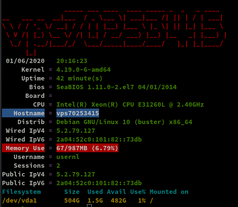
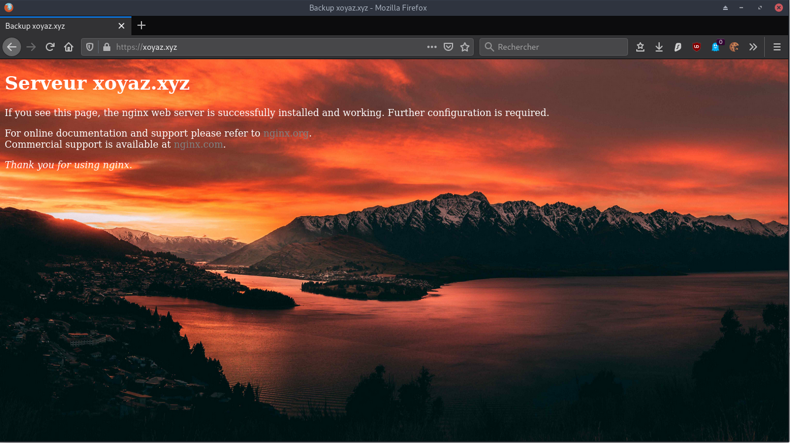
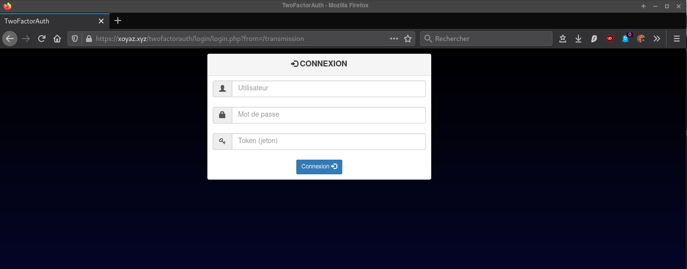
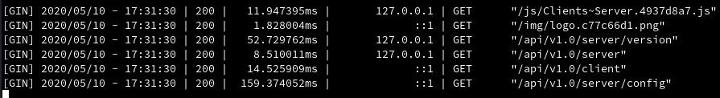
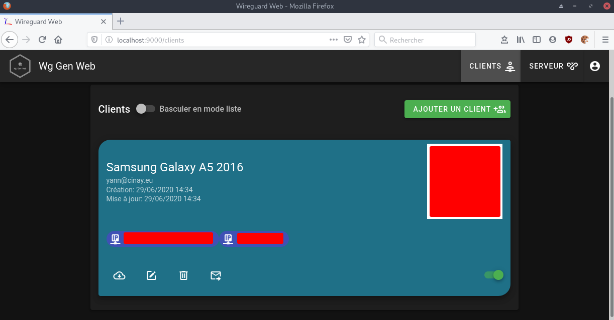
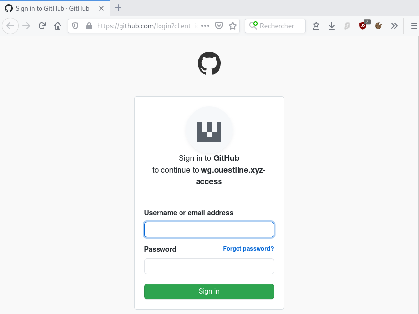
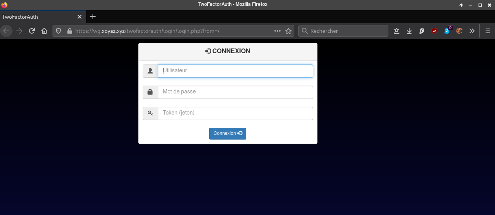
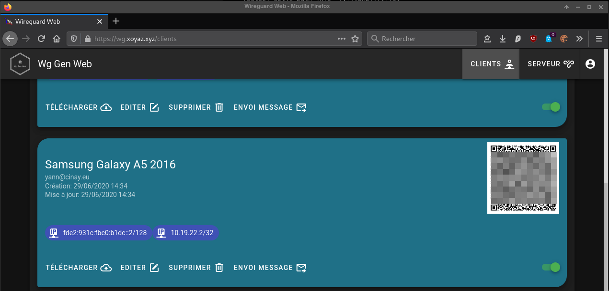
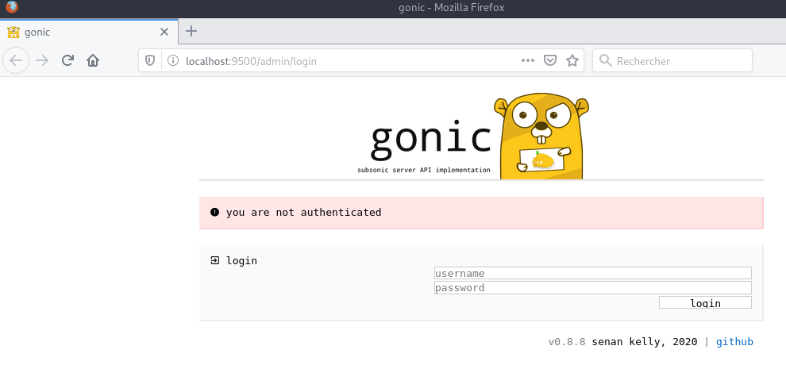

+++
title = 'LiteServer backup vps70253415 Debian 10 (HDD 512Go) borg + audio gonic - xoyaz.xyz'
date = 2021-09-24 00:00:00 +0100
categories = ['vps', 'sauvegarde']
+++
## Liteserver

  
`LiteServer backup vps70253415 ARRETE DEFINITIVEMENT le 24 septembre 2021`{: .prompt-info }

{:width="200"}

*[LiteServer](https://www.liteserver.nl/) est votre partenaire pour une connectivité réseau de qualité. Nous avons les routes les plus courtes et les plus rapides vers des milliers de réseaux mondiaux. Nous avons des POP dans plusieurs pays avec une connectivité aux points d'échange locaux pour acheminer le trafic aussi efficacement que possible.
Notre réseau est rapide et évolutif à tout moment.*

* [Client Panel](https://clients.liteserver.nl/clientarea.php)
* [VPS Control Panel Access](https://vpspanel.liteserver.nl)

## KVM Debian Buster

{:width="100"}

vps70253415  
Status 	Online  
IPv4 Address 	1  
IP Address 	5.2.79.127  
Virtualization Type 	(KVM)  
Hostname 	vps70253415  
Node 	NL-DRN-KVMHDD-13  
Operating System 	Debian 10.1.0 - Minimal (64-bit)  
IPv6 Address 	1  
Disk Space 	512 GB  
Bandwidth 	6 TB  
Memory 	1 GB  
Swap 	-  

### Installer le noyau 5.7 (facultatif)

*A partir du noyau 5.6 a le module wireguard est intégré*

ssh root@5.2.79.127

Exécuter les commandes suivantes

```
echo "deb http://deb.debian.org/debian/ unstable main" | sudo tee /etc/apt/sources.list.d/unstable-wireguard.list
printf 'Package: *\nPin: release a=unstable\nPin-Priority: 90\n' | sudo tee /etc/apt/preferences.d/limit-unstable
apt update && apt upgrade
apt install linux-image-5.7.0-1-amd64
```

Redémarrer la machine et vérifier

    systemctl reboot
    uname -a

*Linux vps70253415 5.7.0-1-amd64 #1 SMP Debian 5.7.6-1 (2020-06-24) x86_64 GNU/Linux*

### Connexion root

    ssh root@5.2.79.127

Changement mot de passe

    passwd root

Mise à jour

    apt update && apt upgrade

Installer utilitaires  

    apt install rsync curl tmux jq figlet git mailutils dnsutils p7zip-full -y

### Hostname

    hostnamectl

```
   Static hostname: vps70253415
         Icon name: computer-vm
           Chassis: vm
        Machine ID: bc596acea5de2e7255c0f5f7f6db3946
           Boot ID: c4deac0e19e047999cf65fa83d97ca8e
    Virtualization: kvm
  Operating System: Debian GNU/Linux 10 (buster)
            Kernel: Linux 4.19.0-6-amd64
      Architecture: x86-64
```

### Europe/Paris (TimeZone tzdata)

Europe/Amsterdam  

    dpkg-reconfigure tzdata

```
Current default time zone: 'Europe/Amsterdam'
Local time is now:      Wed Jun 10 14:01:44 CEST 2020.
Universal Time is now:  Wed Jun 10 12:01:44 UTC 2020.
```

### Adresse IPV4 IPV6

Le paramétrage réseau

    /etc/network/interfaces

```
# The loopback network interface
auto lo
iface lo inet loopback

# The primary network interface
auto eth0
iface eth0 inet static
address 5.2.79.127
netmask 255.255.255.0
 
gateway 5.2.79.1
iface eth0 inet6 static
	accept_ra 0
	address 2a04:52c0:101:82::1
	netmask 64

	gateway 2a04:52c0:0101:0000:0000:0000:0000:0001
post-up /sbin/ip -r route add 2a04:52c0:0101:0000:0000:0000:0000:0001 dev eth0
post-up /sbin/ip -r route add default via 2a04:52c0:0101:0000:0000:0000:0000:0001
```

Après modification du paramétrage réseau, un redémarrage est nécessaire
{: .prompt-warning }

Le réseau après redémarrage

    ip a

```
1: lo: <LOOPBACK,UP,LOWER_UP> mtu 65536 qdisc noqueue state UNKNOWN group default qlen 1000
    link/loopback 00:00:00:00:00:00 brd 00:00:00:00:00:00
    inet 127.0.0.1/8 scope host lo
       valid_lft forever preferred_lft forever
    inet6 ::1/128 scope host 
       valid_lft forever preferred_lft forever
2: eth0: <BROADCAST,MULTICAST,UP,LOWER_UP> mtu 1500 qdisc pfifo_fast state UP group default qlen 1000
    link/ether 00:16:3c:a9:4f:7e brd ff:ff:ff:ff:ff:ff
    inet 5.2.79.127/24 brd 5.2.79.255 scope global eth0
       valid_lft forever preferred_lft forever
    inet6 2a04:52c0:101:82::1/64 scope global 
       valid_lft forever preferred_lft forever
    inet6 fe80::216:3cff:fea9:4f7e/64 scope link 
       valid_lft forever preferred_lft forever
```


### Création utilisateur

Utilisateur **usernl**  

    useradd -m -d /home/usernl/ -s /bin/bash usernl

Mot de passe **usernl**  

    passwd usernl

Visudo pour les accès root via utilisateur **usernl**  

```bash
apt install sudo  
echo "usernl     ALL=(ALL) NOPASSWD: ALL" >> /etc/sudoers
```

Déconnexion puis connexion ssh en mode utilisateur  

    ssh usernl@5.2.79.127

### OpenSSH, clé et script

{:width="70"}  
**connexion avec clé**  
<u>sur l'ordinateur de bureau</u>
Générer une paire de clé curve25519-sha256 (ECDH avec Curve25519 et SHA2) pour une liaison SSH avec le serveur.  

    ssh-keygen -t ed25519 -o -a 100 -f ~/.ssh/OVZ-STORAGE-128

Envoyer les clés publiques sur le serveur KVM   

    scp ~/.ssh/OVZ-STORAGE-128.pub usernl@5.2.79.127:/home/usernl/

<u>sur le serveur KVM</u>
On se connecte  

    ssh usernl@5.2.79.127

Copier le contenu de la clé publique dans /home/$USER/.ssh/authorized_keys  

    cd ~

Sur le KVM ,créer un dossier .ssh  

```bash
mkdir .ssh
cat $HOME/OVZ-STORAGE-128.pub >> $HOME/.ssh/authorized_keys
```

et donner les droits  

    chmod 600 $HOME/.ssh/authorized_keys

effacer le fichier de la clé  

    rm $HOME/*.pub

Modifier la configuration serveur SSH  

    sudo nano /etc/ssh/sshd_config

Modifier

```conf
Port = 55036
PermitRootLogin no
PasswordAuthentication no
```


<u>session SSH ne se termine pas correctement lors d'un "reboot" à distance</u>  
Si vous tentez de **redémarrer/éteindre** une machine distance par **ssh**, vous pourriez constater que votre session ne se termine pas correctement, vous laissant avec un terminal inactif jusqu'à l'expiration d'un long délai d'inactivité. Il existe un bogue 751636 à ce sujet. Pour l'instant, la solution de contournement à ce problème est d'installer :  

    sudo apt-get install libpam-systemd

cela terminera la session ssh avant que le réseau ne tombe.  
Veuillez noter qu'il est nécessaire que PAM soit activé dans sshd.  

Relancer openSSH  

    sudo systemctl restart sshd

Accès depuis le poste distant avec la clé privée  

    ssh usernl@5.2.79.127 -p 55036 -i /home/yannick/.ssh/OVZ-STORAGE-128  # choix par défaut ,pour la compatibilité avec l'ancien serveur de sauvegarde de 128Go

### Outils, scripts motd et ssh_rc_bash

Motd

    sudo rm /etc/motd && sudo nano /etc/motd

```
                 ____  __  ___  ___  ____ _ _   _  ___ 
 __ __ _ __  ___|__  |/  \|_  )| __||__ /| | | / || __|
 \ V /| '_ \(_-<  / /| () |/ / |__ \ |_ \|_  _|| ||__ \
  \_/ | .__//__/ /_/  \__//___||___/|___/  |_| |_||___/
    __|_|   ___    ____  ___    _  ___  ____           
   | __|   |_  )  |__  |/ _ \  / ||_  )|__  |          
   |__ \ _  / /  _  / / \_, /_ | | / /   / /           
   |___/(_)/___|(_)/_/   /_/(_)|_|/___| /_/                                                                   
```

Script **ssh_rc_bash**  
>**ATTENTION!!! Les scripts sur connexion peuvent poser des problèmes pour des appels externes autres que ssh**

    wget https://yann.cinay.eu/files/ssh_rc_bash
    chmod +x ssh_rc_bash # rendre le bash exécutable
    ./ssh_rc_bash        # exécution



## Parefeu

*Choix entre ufw et iptables (problématique avec wireguard)*

### Parefeu UFW

{:width="50"} 

*UFW, ou pare - feu simple , est une interface pour gérer les règles de pare-feu dans Arch Linux, Debian ou Ubuntu. UFW est utilisé via la ligne de commande (bien qu'il dispose d'interfaces graphiques disponibles), et vise à rendre la configuration du pare-feu facile.*

Installation **Debian / Ubuntu**

    sudo apt-get install ufw

*Par défaut, les jeux de règles d'UFW sont vides, de sorte qu'il n'applique aucune règle de pare-feu, même lorsque le démon est en cours d'exécution.*   

Les règles 

    sudo ufw allow 55036/tcp  # port SSH
    sudo ufw allow http       # port 80
    sudo ufw allow https      # port 443
    sudo ufw allow DNS        # port 53
    sudo ufw allow 51820/udp  # wireguard

Activer le parefeu

    sudo ufw enable

```
Command may disrupt existing ssh connections. Proceed with operation (y|n)? y
Firewall is active and enabled on system startup
```

Status

     sudo ufw status verbose

```
Status: active
Logging: on (low)
Default: deny (incoming), allow (outgoing), deny (routed)
New profiles: skip

To                         Action      From
--                         ------      ----
55036/tcp                  ALLOW IN    Anywhere                  
80/tcp                     ALLOW IN    Anywhere                  
443/tcp                    ALLOW IN    Anywhere                  
53 (DNS)                   ALLOW IN    Anywhere                  
51820/udp                  ALLOW IN    Anywhere                  
55036/tcp (v6)             ALLOW IN    Anywhere (v6)             
80/tcp (v6)                ALLOW IN    Anywhere (v6)             
443/tcp (v6)               ALLOW IN    Anywhere (v6)             
53 (DNS (v6))              ALLOW IN    Anywhere (v6)             
51820/udp (v6)             ALLOW IN    Anywhere (v6)   
```

### iptables

{:width="50"}  
On utilise un service systemd  
Créer le fichier le script **/sbin/iptables-firewall.sh**

    sudo nano /sbin/iptables-firewall.sh

```
#!/bin/bash
# Configure iptables firewall

# Limit PATH
PATH="/sbin:/usr/sbin:/bin:/usr/bin"

# iptables configuration
firewall_start() {
###################
#      IPv4       #
###################

# refuser input et forward par défaut, accepter output
iptables -t filter -P INPUT DROP
iptables -t filter -P FORWARD DROP
iptables -t filter -P OUTPUT ACCEPT

# interface lo (loop) accessible
iptables -A INPUT -i lo -j ACCEPT
iptables -A OUTPUT -o lo -j ACCEPT

# maintenir les connexions établies
iptables -A INPUT -m state --state RELATED,ESTABLISHED -j ACCEPT
iptables -A OUTPUT -m state --state RELATED,ESTABLISHED -j ACCEPT

# accepter en entrée le ping (icmp), et les
# connexions sur les ports nécessaires.
iptables -A INPUT -p icmp --icmp-type echo-request -m conntrack --ctstate NEW -m limit --limit 1/s --limit-burst 1 -j ACCEPT
iptables -A INPUT -p tcp --dport 55036 -j ACCEPT

# accepter en sortie le ping, les requêtes HTTP(S), DNS,
# et les connexions sur les ports nécessaires.
iptables -A OUTPUT -p icmp --icmp-type echo-request -m conntrack --ctstate NEW -j ACCEPT
iptables -A OUTPUT -p udp --dport 53 -j ACCEPT
iptables -A OUTPUT -p tcp --dport 53 -j ACCEPT

# wireguard
iptables -A INPUT -p udp --dport 51820 -j ACCEPT

# HTTP + HTTPS Out
iptables -t filter -A OUTPUT -p tcp --dport 80 -j ACCEPT
iptables -t filter -A OUTPUT -p tcp --dport 443 -j ACCEPT

# HTTP + HTTPS In
iptables -t filter -A INPUT -p tcp --dport 80 -j ACCEPT
iptables -t filter -A INPUT -p tcp --dport 443 -j ACCEPT

###################
#      IPv6       #
###################

# refuser input et forward par défaut, accepter output
ip6tables -t filter -P INPUT DROP
ip6tables -t filter -P FORWARD DROP
ip6tables -t filter -P OUTPUT ACCEPT

# interface lo (loop) accessible
ip6tables -A INPUT -i lo -j ACCEPT
ip6tables -A OUTPUT -o lo -j ACCEPT

# maintenir les connexions établies
ip6tables -A INPUT -m state --state RELATED,ESTABLISHED -j ACCEPT
ip6tables -A OUTPUT -m state --state RELATED,ESTABLISHED -j ACCEPT

# accepter en entrée le ping (icmpv6), les
# connexions entrantes déjà établies et les connexions sur les ports nécessaires.
#ip6tables -A INPUT -p icmpv6 --icmpv6-type echo-request -m conntrack --ctstate NEW -m limit --limit 1/s --limit-burst 1 -j ACCEPT
ip6tables -A INPUT -p icmpv6 -j ACCEPT
ip6tables -A INPUT -p tcp --dport 55036 -j ACCEPT

# wireguard
ip6tables -A INPUT -p udp --dport 51820 -j ACCEPT

# HTTP + HTTPS Out
ip6tables -t filter -A OUTPUT -p tcp --dport 80 -j ACCEPT
ip6tables -t filter -A OUTPUT -p tcp --dport 443 -j ACCEPT

# HTTP + HTTPS In
ip6tables -t filter -A INPUT -p tcp --dport 80 -j ACCEPT
ip6tables -t filter -A INPUT -p tcp --dport 443 -j ACCEPT


# accepter en sortie le ping, les requêtes HTTP(S), DNS,
# et les connexions sur les ports nécessaires.
ip6tables -t filter -A OUTPUT -p icmpv6 --icmpv6-type echo-request -j ACCEPT
ip6tables -A OUTPUT -p udp --dport 53 -j ACCEPT
ip6tables -A OUTPUT -p tcp --dport 53 -j ACCEPT
}

# clear iptables configuration
firewall_stop() {
  iptables -F
  iptables -X
  iptables -P INPUT   ACCEPT
  iptables -P FORWARD ACCEPT
  iptables -P OUTPUT  ACCEPT
  ip6tables -F
  ip6tables -X
  ip6tables -P INPUT   ACCEPT
  ip6tables -P FORWARD ACCEPT
  ip6tables -P OUTPUT  ACCEPT
}

# execute action
case "$1" in
  start|restart)
    echo "Starting firewall"
    firewall_stop
    firewall_start
    ;;
  stop)
    echo "Stopping firewall"
    firewall_stop
    ;;
esac

```

Les droits et exécutable

    sudo chown root:root /sbin/iptables-firewall.sh
    sudo chmod 750 /sbin/iptables-firewall.sh 

Créer le service systemd **iptables-firewall.service**

```
cat << EOF | sudo tee /etc/systemd/system/iptables-firewall.service
[Unit]
Description=iptables firewall service
After=network.target

[Service]
Type=oneshot
ExecStart=/sbin/iptables-firewall.sh start
RemainAfterExit=true
ExecStop=/sbin/iptables-firewall.sh stop
StandardOutput=journal

[Install]
WantedBy=multi-user.target
EOF
```

Recharger systemd manager

    sudo systemctl daemon-reload

Lancer le service iptables et l'activer

    sudo systemctl start iptables-firewall # vérifier le fonctionnement avant de valider
    sudo systemctl enable iptables-firewall

## OVH configuration domaine xoyaz.xyz

{:width="50"}

```
$TTL 3600
@	IN SOA dns106.ovh.net. tech.ovh.net. (2021030200 86400 3600 3600000 300)
           IN NS     ns106.ovh.net.
           IN NS     dns106.ovh.net.
           IN A      5.2.79.127
           IN AAAA   2a04:52c0:101:82::1
wg         IN CNAME  xoyaz.xyz.
zic        IN CNAME  xoyaz.xyz.
```

wg : wireguard  
zic: audio serveur

## Certificats letsencrypt - xoyaz.xyz

{:width="80"}

Installation gestionnaire des certificats Let's Encrypt

```
cd ~
sudo apt install socat # prérequis
git clone https://github.com/Neilpang/acme.sh.git
cd acme.sh
./acme.sh --install 
```

Les clés OVH API  

    acme.sh --dns dns_ovh --issue --keylength ec-384 -d 'xoyaz.xyz' -d 'zic.xoyaz.xyz'

Résultat de l'installation

```
[Tue 02 Jun 2020 07:03:47 AM CEST] Your cert is in  /home/usernl//.acme.sh/xoyaz.xyz_ecc/xoyaz.xyz.cer 
[Tue 02 Jun 2020 07:03:47 AM CEST] Your cert key is in  /home/usernl//.acme.sh/xoyaz.xyz_ecc/xoyaz.xyz.key 
[Tue 02 Jun 2020 07:03:47 AM CEST] The intermediate CA cert is in  /home/usernl//.acme.sh/xoyaz.xyz_ecc/ca.cer 
[Tue 02 Jun 2020 07:03:47 AM CEST] And the full chain certs is there:  /home/usernl//.acme.sh/xoyaz.xyz_ecc/fullchain.cer 
```

Installation des certificats

```
sudo mkdir -p /etc/ssl/private/
sudo chown $USER -R /etc/ssl/private/
acme.sh --ecc --install-cert -d xoyaz.xyz -d 'zic.xoyaz.xyz' --key-file /etc/ssl/private/xoyaz.xyz-key.pem --fullchain-file /etc/ssl/private/xoyaz.xyz-fullchain.pem --reloadcmd 'sudo systemctl reload nginx.service'
```

Editer le crontab

    crontab -e

```
56 0 * * * "/home/usernl/.acme.sh"/acme.sh --cron --home "/home/usernl/.acme.sh" --renew-hook "/home/usernl/.acme.sh/acme.sh --ecc --install-cert -d xoyaz.xyz --key-file /etc/ssl/private/xoyaz.xyz-key.pem --fullchain-file /etc/ssl/private/xoyaz.xyz-fullchain.pem --reloadcmd 'sudo systemctl reload nginx.service'" > /dev/null
```

## Borgbackup xoyaz.xyz (5.2.79.127)

{:width="80"}

Conventions

* **serveur backup** : Serveur de sauvegarde borgbackup xoyaz.xyz (5.2.79.127)

On se connecte sur la machine

    sudo apt update

Installer borgbackup

    sudo apt install borgbackup

on passe en mode su  

    sudo -s

Créer un utilisateur borg dédié aux sauvegardes par BorgBackup :

    mkdir -p /srv/data
    useradd borg --create-home --home-dir /srv/data/borg-backups

Créer le dossier .ssh utilisateur "borg"

    sudo -u borg mkdir /srv/data/borg-backups/.ssh

Créer le fichier authorized_keys

    sudo -u borg touch /srv/data/borg-backups/.ssh/authorized_keys

Autoriser utilisateur **borg** à exécuter */usr/bin/borg* uniquement

    echo "borg ALL=NOPASSWD: /usr/bin/borg" >> /etc/sudoers

## Nginx + PHP7.3

### Nginx Light

[Installer nginx-light](/posts/nginx-light/)

modifier le fichier `/etc/nginx/nginx.conf`  

On autorise tls1.2 et tls1.3 uniquement et ciphers off 

```
[...]
	ssl_protocols TLSv1.2 TLSv1.3;
	ssl_prefer_server_ciphers off;
[...]
```

Accès dossier pour les fichiers de configuration

```
[...]
        ##
        # Virtual Host Configs
        ##

        include /etc/nginx/conf.d/*.conf;
        # include /etc/nginx/sites-enabled/*;
[...]
```

### PHP7.3

Installation

    sudo apt install  php7.3-fpm php7.3-sqlite3 php7.3-gd

### xoyaz.xyz

Créer le fichier `/etc/nginx/conf.d/xoyaz.xyz.conf` 

```
server {
    listen 80;
    listen [::]:80;
    server_name xoyaz.xyz;
    return 301 https://$host$request_uri;
}
server {
    listen 443 ssl http2;
    listen [::]:443 ssl http2;
    server_name xoyaz.xyz;
    ssl_certificate /etc/ssl/private/xoyaz.xyz-fullchain.pem;
    ssl_certificate_key /etc/ssl/private/xoyaz.xyz-key.pem;

    root /var/www/;
    index index/ index.php;

    # TLS 1.3 only
    ssl_protocols TLSv1.3;
    ssl_prefer_server_ciphers off;
 
    # HSTS (ngx_http_headers_module is required) (63072000 seconds)
    add_header Strict-Transport-Security "max-age=63072000" always;
 
    # OCSP stapling
    ssl_stapling on;
    ssl_stapling_verify on;
 
    # verify chain of trust of OCSP response using Root CA and Intermediate certs
    ssl_trusted_certificate /etc/ssl/private/xoyaz.xyz-fullchain.pem;

    # fichiers de configuration
    include /etc/nginx/conf.d/xoyaz.xyz.d/*.conf;
 
    # replace with the IP address of your resolver
    resolver 127.0.0.1;

}
```

Créer le sous-dossier

    sudo mkdir /etc/nginx/conf.d/xoyaz.xyz.d/

Vérifier

    sudo nginx -t

```
nginx: the configuration file /etc/nginx/nginx.conf syntax is ok
nginx: configuration file /etc/nginx/nginx.conf test is successful
```

Recharger nginx

    sudo systemctl reload nginx

Pour tester le php

    echo "<?php phpinfo(); ?>" | sudo tee /var/www//info.php

https://xoyaz.xyz/info.php

### Page d'accueil (facultatif)  

Déposer une image dans le dossier `/var/www/`  
Créer un fichier `/var/www//index/`  

```hmtl
<!DOCTYPE/>
/>
<head>
 <meta charset="UTF-8"> 
 <title>Backup xoyaz.xyz</title>
<style type="text/css" media="screen" >
html { 
  margin:0;
  padding:0;
  background: url(wallpaper.jpg) no-repeat center fixed; 
  -webkit-background-size: cover; /* pour anciens Chrome et Safari */
  background-size: cover; /* version standardisée */
}
body { color: white; }
a:link {
  color: grey;
  background-color: transparent;
  text-decoration: none;
}

a {
  text-decoration: underline;
  background-color: transparent;
  color: #a00;
}
a:visited {
  color: #844;
}
a:hover, a:focus, a:active {
  text-decoration: none;
  color: white;
  background: #800;
}


</style>

</head>
<body>

<h1>Serveur xoyaz.xyz</h1>

<p><a href="/transmission">Transmission</a>
<em> permet le téléchargement et la création de torrents.<br>Ce logiciel supporte les technologies décentralisées sans tracker, tel que PEX, DHT et les liens magnets.</em>
</p>

<p><a href="https://zic.xoyaz.xyz">Navidrome</a>
<em> Audio est compatible avec la majorité des  clients subsoniques.<br>
Les clients android suivants sont testés et leur bon fonctionnement est confirmé :
<a href="https://play.google.com/store/apps/details?id=github.daneren2005.dsub">DSub</a>, <a href="https://play.google.com/store/apps/details?id=org.moire.ultrasonic">Ultrasons</a> et <a href="https://play.google.com/store/apps/details?id=com.ghenry22.mymusicstash">Stash de la musique</a></em>
</p>
</body>
</>
```

Lien <https://xoyaz.xyz>  
{:width="500"}


### Authentification 2FA

*Authentification double facteur PHP TOTP*  
[PHP - Portail d'authentification web authentification à deux facteurs (2FA).](/posts/PHP_Authentification_2FA(Arno0x)/)

**TwoFactorAuth** utilise PHP et des bibliothèques 

*    php 7.3 pour nginx 
*    La bibliothèque GD 
*    La bibliothèque SQLite3 

Installation

    sudo apt install php7.3-fpm php7.3-gd php7.3-sqlite3
    git clone https://github.com/Arno0x/TwoFactorAuth.git twofactorauth
    sudo mv twofactorauth /var/www//
    sudo chown www-data.www-data -R /var/www//twofactorauth

Modifier 'QRCODE_TITLE','SESSION_NAME' et 'AUTH_SUCCEED_REDIRECT_URL' dans le fichier de configuration `/var/www//twofactorauth/config.php`   

Ouvrir le lien https://xoyaz.xyz/twofactorauth/index.php  
Créer l'administrateur "xoyaz", son mot de passe et scanner le Qr Code avec une application TOTP    


## Transmission

*Transmission permet le téléchargement et la création de torrents. Ce logiciel supporte les technologies décentralisées sans tracker, tel que PEX, DHT et les liens magnets.*

Pour l'installation suivre ce lien :[Debian Transmission](/posts/debian-transmission-daemon/)  

Ajout utilisateur courant au groupe "debian-transmission"

    sudo usermod -a -G debian-transmission $USER

**Accès sécurisé sur le site xoyaz.xyz/transmission avec login mot de passe et 2FA**

On supprime le fichier de configuration `~/.config/transmission-daemon/settings.json`

    sudo rm ~/.config/transmission-daemon/settings.json

Modification du fichier de configuration `/etc/transmission-daemon/settings.json`

    sudo systemctl stop transmission-daemon.service


Le fichier de configuration "transmission"

```json
{
    "alt-speed-down": 50,
    "alt-speed-enabled": false,
    "alt-speed-time-begin": 540,
    "alt-speed-time-day": 127,
    "alt-speed-time-enabled": false,
    "alt-speed-time-end": 1020,
    "alt-speed-up": 50,
    "bind-address-ipv4": "0.0.0.0",
    "bind-address-ipv6": "::",
    "blocklist-enabled": false,
    "blocklist-url": "http://www.example.com/blocklist",
    "cache-size-mb": 4,
    "dht-enabled": true,
    "download-dir": "/home/usernl/torrent/complet",
    "download-limit": 100,
    "download-limit-enabled": 0,
    "download-queue-enabled": true,
    "download-queue-size": 5,
    "encryption": 1,
    "idle-seeding-limit": 30,
    "idle-seeding-limit-enabled": false,
    "incomplete-dir": "/home/usernl/torrent/encours",
    "incomplete-dir-enabled": false,
    "lpd-enabled": false,
    "max-peers-global": 200,
    "message-level": 1,
    "peer-congestion-algorithm": "",
    "peer-id-ttl-hours": 6,
    "peer-limit-global": 200,
    "peer-limit-per-torrent": 50,
    "peer-port": 51413,
    "peer-port-random-high": 65535,
    "peer-port-random-low": 49152,
    "peer-port-random-on-start": false,
    "peer-socket-tos": "default",
    "pex-enabled": true,
    "port-forwarding-enabled": false,
    "preallocation": 1,
    "prefetch-enabled": true,
    "queue-stalled-enabled": true,
    "queue-stalled-minutes": 30,
    "ratio-limit": 2,
    "ratio-limit-enabled": false,
    "rename-partial-files": true,
    "rpc-authentication-required": false,
    "rpc-bind-address": "0.0.0.0",
    "rpc-enabled": true,
    "rpc-host-whitelist": "",
    "rpc-host-whitelist-enabled": false,
    "rpc-password": "{2f217a20225338209def1c9fa5587751c6a608d8Onz8WkP5",
    "rpc-port": 9091,
    "rpc-url": "/transmission/",
    "rpc-username": "yan",
    "rpc-whitelist": "127.0.0.1",
    "rpc-whitelist-enabled": false,
    "scrape-paused-torrents-enabled": true,
    "script-torrent-done-enabled": false,
    "script-torrent-done-filename": "",
    "seed-queue-enabled": false,
    "seed-queue-size": 10,
    "speed-limit-down": 100,
    "speed-limit-down-enabled": false,
    "speed-limit-up": 100,
    "speed-limit-up-enabled": false,
    "start-added-torrents": true,
    "trash-original-torrent-files": false,
    "umask": 7,
    "upload-limit": 100,
    "upload-limit-enabled": 0,
    "upload-slots-per-torrent": 14,
    "utp-enabled": true
}
```

Relancer transmission

    sudo systemctl start transmission-daemon


Le fichier de  configuration **/etc/nginx/conf.d/xoyaz.xyz.conf**

```
server {
    listen 80;
    listen [::]:80;
    server_name xoyaz.xyz;
    return 301 https://$host$request_uri;
}
server {
    listen 443 ssl http2;
    listen [::]:443 ssl http2;
    server_name xoyaz.xyz;
    ssl_certificate /etc/ssl/private/xoyaz.xyz-fullchain.pem;
    ssl_certificate_key /etc/ssl/private/xoyaz.xyz-key.pem;

    root /var/www/;
    index index/ index.php;

    # TLS 1.3 only
    ssl_protocols TLSv1.3;
    ssl_prefer_server_ciphers off;
 
    # HSTS (ngx_http_headers_module is required) (63072000 seconds)
    add_header Strict-Transport-Security "max-age=63072000" always;
 
    # OCSP stapling
    ssl_stapling on;
    ssl_stapling_verify on;
 
    # verify chain of trust of OCSP response using Root CA and Intermediate certs
    ssl_trusted_certificate /etc/ssl/private/xoyaz.xyz-fullchain.pem;

    #PHP7.3
        location ~ \.php$ {
           fastcgi_split_path_info ^(.+\.php)(/.+)$;
           fastcgi_pass unix:/run/php/php7.3-fpm.sock;   # PHP7.3
           fastcgi_index index.php;
           include fastcgi_params;
           fastcgi_param SCRIPT_FILENAME $document_root$fastcgi_script_name;
      }

    # fichiers de configuration
    include /etc/nginx/conf.d/xoyaz.xyz.d/*.conf;
 
    # replace with the IP address of your resolver
    resolver 127.0.0.1;

	location = /twofactorauth/login/login.php {
	  allow all;
     auth_request off;
     fastcgi_split_path_info ^(.+\.php)(/.+)$;
     fastcgi_pass unix:/run/php/php7.3-fpm.sock;   # PHP7.3
     fastcgi_index index.php;
     include fastcgi_params;
     fastcgi_param SCRIPT_FILENAME $document_root$fastcgi_script_name;
	}

	location = /twofactorauth/nginx/auth.php {
     fastcgi_split_path_info ^(.+\.php)(/.+)$;
     fastcgi_pass unix:/run/php/php7.3-fpm.sock;   # PHP7.3
     fastcgi_index index.php;
     include fastcgi_params;
     fastcgi_param SCRIPT_FILENAME $document_root$fastcgi_script_name;
     fastcgi_param  CONTENT_LENGTH "";
	}

	location /twofactorauth/ {
		index index.php;
	}


	location /twofactorauth/db/ {
	    deny all;
	}

    location /transmission {
	  proxy_pass http://127.0.0.1:9091;
	  auth_request /twofactorauth/nginx/auth.php;
	  error_page 401 =401 $scheme://$host/twofactorauth/login/login.php?from=$uri;
	  proxy_buffering off;
    }	

}
```

recharger nginx

    sudo nginx -t
    sudo systemctl reload nginx

Lien <https://xoyaz.xyz/transmission>  
{:width="500"}  
saisir utilisateur, mot de passe et le jeton OTP correspondant  

{:width="500"}

## Go + Node

### Go

{:width="50"}

Go installation (Debian) , installer la dernière version de Go (https://golang.org/dl/)

    cd ~
    wget https://dl.google.com/go/go1.14.2.linux-amd64.tar.gz
    sudo tar -C /usr/local -xzf go1.14.2.linux-amd64.tar.gz
    rm go1.14.2.linux-amd64.tar.gz

Environnement de configuration

Bash: ~/.bashrc  

    echo "export PATH=$PATH:/usr/local/go/bin:$HOME/go/bin" >> ~/.bashrc
    export "GOPATH=$HOME/go" >> ~/.bashrc
    source ~/.bashrc

### Nodejs

{:width="50"}

Installer la version LTS de nodejs pour le frontend.

    sudo apt-get install curl software-properties-common 
    curl -sL https://deb.nodesource.com/setup_12.x | sudo bash -

```
## Run `sudo apt-get install -y nodejs` to install Node.js 12.x and npm
## You may also need development tools to build native addons:
     sudo apt-get install gcc g++ make
## To install the Yarn package manager, run:
     curl -sL https://dl.yarnpkg.com/debian/pubkey.gpg | sudo apt-key add -
     echo "deb https://dl.yarnpkg.com/debian/ stable main" | sudo tee /etc/apt/sources.list.d/yarn.list
     sudo apt-get update && sudo apt-get install yarn
```

Nodejs

    sudo apt-get install -y nodejs


## Wireguard (DESINSTALLE)

{:width="50"}


### Wireguard - base

*WireGuard est un serveur VPN à code source ouvert, gratuit, moderne et rapide, doté d'une cryptographie de pointe. Il est plus rapide et plus simple que l'IPSec et l'OpenVPN*

Wireguard est dans le noyau 5.6+

    apt install wireguard

**Générer une paire de clés**

On se positionne dans le dossier **/etc/wireguard/**  

    cd /etc/wireguard

WireGuard repose sur une authentification par clé publique/privée (cryptographie asymétrique), vous devez donc créer ces clés avec les sous-commandes wg genkey et wg pubkey  
La création de la clé privée se fait avec wg genkey et la clé publique est générée en la canalisant dans wg pubkey

    umask 077; wg genkey | tee vps70253415-private.key | wg pubkey > vps70253415-public.key

**Autoriser le serveur Wireguard à relayer les paquets **

Autoriser le serveur Wireguard à relayer les paquets venant de ces clients vers l'internet et de traiter les paquets retours (modifier **/etc/sysctl.conf**)

    sed -i 's/^#net.ipv4.ip_forward=1/net.ipv4.ip_forward=1/' /etc/sysctl.conf
    sed -i 's/^#net.ipv6.conf.all.forwarding=1/net.ipv6.conf.all.forwarding=1/' /etc/sysctl.conf
    sysctl -p # prise en compte immédiate


**Fichier de configuration /etc/wireguard/wg0.conf**

Récupérer le nom de la carte réseau `ip a` , dans notre cas **eth0**  

La première étape consiste à choisir une plage IPV4 privée qui sera utilisée par le serveur : **10.19.22.0/8**  

Pour une adresse IPV6 [Local IPv6 Address Generator](https://www.ultratools.com/tools/rangeGenerator)  : fde2:931c:fbc0:b1dc::/64  

Prefix/L|  fd
--------|--------
 Global ID|  e2931cfbc0
Subnet ID|  b1dc
Combine/CID|  fde2:931c:fbc0:b1dc::/64
IPv6 addresses|  fde2:931c:fbc0:b1dc::/64:XXXX:XXXX:XXXX:XXXX
Start Range|  fde2:931c:fbc0:b1dc:0:0:0:0
End Range|  fde2:931c:fbc0:b1dc:ffff:ffff:ffff:ffff
No. of hosts|  18446744073709551616 

Nous utiliserons 10.19.22.0/24 qui se trouve dans la plage 10.19.22.0/8 . Le serveur aura l'adresse IP suivante: 10.19.22.1 . Il est également nécessaire de choisir un port, qui sera exposé publiquement, pour que le serveur écoute.Le port de documentation standard est généralement 51820.

Créer le fichier **/etc/wireguard/wg0.conf**

    nano /etc/wireguard/wg0.conf

```
[Interface]
Address = 10.19.22.1/24
Address = fde2:931c:fbc0:b1dc::1/64
ListenPort = 51820
PostUp = iptables -A FORWARD -i wg0 -j ACCEPT; iptables -t nat -A POSTROUTING -o eth0 -j MASQUERADE; ip6tables -A FORWARD -i wg0 -j ACCEPT; ip6tables -t nat -A POSTROUTING -o eth0 -j MASQUERADE
PostDown = iptables -D FORWARD -i wg0 -j ACCEPT; iptables -t nat -D POSTROUTING -o eth0 -j MASQUERADE; ip6tables -D FORWARD -i wg0 -j ACCEPT; ip6tables -t nat -D POSTROUTING -o eth0 -j MASQUERADE
PrivateKey = 5Zsr0jQXiuCpHFkye325Zsr0jMUKinVEOPmk=
DNS = 10.19.22.1
DNS = fde2:931c:fbc0:b1dc::1
SaveConfig = true
```

**Address** , fixer l'adresse IP privée du serveur à l'intérieur du VPN.Les adresses du réseau VPN de 10.19.22.0 à 10.19.22.255 sont fixées par le masque **/24**  
**PostUp** , pour la mise en place des règles iptables de translation d'adresses à l'activation du VPN (autoriser le routage des paquets réseau venant des clients vers internet)  
**PostDown** , pour la suppression des règles iptables de translation d'adresses à l'arrêt du VPN  
**PrivateKey** , clé privée du serveur

Modification des droits (lecture uniquement par "root")

    chmod 600 /etc/wireguard/wg0.conf

### Gestion Wireguard web service

{:width="50"}

Création dossier application web

    sudo mkdir -p /opt/appwg

Copier le git wg-gen-web

    cd ~
    git clone https://gitea.cinay.eu/yann/wg-gen-web.git
    sudo mkdir -p /usr/local/go/src/wg-gen-web
    sudo cp -r wg-gen-web/{api,auth,core,util,version,model,storage,template} /usr/local/go/src/wg-gen-web/

Construction du site

    cd /home/usernl/wg-gen-web/cmd/wg-gen-web/
    go build -o deb-wg-gen-web
    cd ../../ui
    npm install  # + npm audit fix si nécessaire
    npm run build
    sudo cp /home/usernl/wg-gen-web/cmd/wg-gen-web/deb-wg-gen-web /opt/appwg
    sudo mkdir -p /opt/appwg/ui
    sudo cp -r /home/usernl/wg-gen-web/ui/dist /opt/appwg/ui/

**Configuration .env**

l'autorisation à 2 facteurs n'est pas utilisée, le fichier **/opt/appwg/.env** se résume à remplir la zone correspondante SMTP de la messagerie et désactiver l'autorisation

    /opt/appwg/.env

```
# IP address to listen to
SERVER=0.0.0.0
# port to bind
PORT=8080
# Gin framework release mode
GIN_MODE=release
# where to write all generated config files
WG_CONF_DIR=/etc/wireguard
# WireGuard main config file name, generally <interface name>.conf
WG_INTERFACE_NAME=wg0.conf

# SMTP settings to send email to clients
SMTP_HOST=smtp.gmail.com
SMTP_PORT=587
SMTP_USERNAME=account@gmail.com
SMTP_PASSWORD=*************
SMTP_FROM=Wg Gen Web <account@gmail.com>

# set provider name to fake to disable auth, also the default
OAUTH2_PROVIDER_NAME=fake
```  

**Créer le service wgweb.service **

Tester manuellement le fonctionnement  
Ouvrir un terminal  

    sudo -s
    cd /opt/appwg/
    ./deb-wg-gen-web    # arrêt par Ctrl C

Ouvrir le lien https://wg.rnmkcy.eu   
Les échanges sont affichés dans la fenêtre du terminal

{:width="700"}

Créer un service systemd **wgweb** qui lance le serveur avec journalisation  

    sudo nano /etc/systemd/system/wgweb.service

```
[Unit]
Description=Gestion web wg
After=network.target

[Service]

Type=simple

Restart=on-failure
RestartSec=10

WorkingDirectory=/opt/appwg
ExecStart=/opt/appwg/deb-wg-gen-web

[Install]
WantedBy=multi-user.target
```

**wireguard (wg0.conf et server.json)**

Modifier les fichiers existants pour être identique au paramétrage de wireguard **wg0.conf** situé sous **/etc/wireguard**

    /etc/wireguard/server.json 

```json
{
  "address": [
    "fde2:931c:fbc0:b1dc::1/64",
    "10.19.22.1/24"
  ],
  "listenPort": 51820,
  "mtu": 0,
  "privateKey": "UEQCgh/6a2RQbF9+qqylVjqLCK/mRwqRPc/4vjRsYXg=",
  "publicKey": "0s1wsNpuU1RlKgj6AmoN0aKUeb+aESByhO3yTSnfTyE=",
  "endpoint": "xoyaz.xyz:51820",
  "persistentKeepalive": 16,
  "dns": [
    "fde2:931c:fbc0:b1dc::1",
    "10.19.22.1"
  ],
  "allowedips": [
    "0.0.0.0/0",
    "::/0"
  ],
  "preUp": "",
  "postUp": "iptables -A FORWARD -i wg0 -j ACCEPT; iptables -t nat -A POSTROUTING -o eth0 -j MASQUERADE; ip6tables -A FORWARD -i wg0 -j ACCEPT; ip6tables -t nat -A POSTROUTING -o eth0 -j MASQUERADE",
  "preDown": "",
  "postDown": "iptables -D FORWARD -i wg0 -j ACCEPT; iptables -t nat -D POSTROUTING -o eth0 -j MASQUERADE; ip6tables -D FORWARD -i wg0 -j ACCEPT; ip6tables -t nat -D POSTROUTING -o eth0 -j MASQUERADE",
  "updatedBy": "Unknown",
  "created": "2020-06-29T12:31:50.589913433Z",
  "updated": "2020-06-29T12:31:50.589913433Z"
```

    cat /etc/wireguard/wg0.conf 

```ini
[Interface]
Address = fde2:931c:fbc0:b1dc::1/64
Address = 10.19.22.1/24
ListenPort = 51820
PrivateKey = UEQCgh/6a2RQbF9+qqylVjqLCK/mRwqRPc/4vjRsYXg=

PreUp = echo WireGuard PreUp
PostUp = echo WireGuard PostUp
PreDown = echo WireGuard PreDown
}
```

On modifie dans **/opt/appwg/.env** ,le paramètre WG_CONF_DIR=./wireguard &rarr; `WG_CONF_DIR=/etc/wireguard`  

Recharger `systemd` puis démarrer le service:

    sudo systemctl daemon-reload
    sudo systemctl start wgweb.service
    sudo systemctl status wgweb.service

```
● wgweb.service - Gestion web wg
   Loaded: loaded (/etc/systemd/system/wgweb.service; disabled; vendor preset: enabled)
   Active: active (running) since Mon 2020-06-29 12:16:29 CEST; 83ms ago
 Main PID: 2084 (deb-wg-gen-web)
    Tasks: 5 (limit: 1146)
   Memory: 8.7M
   CGroup: /system.slice/wgweb.service
           └─2084 /opt/appwg/deb-wg-gen-web

Jun 29 12:16:29 vps70253415 systemd[1]: Started Gestion web wg.
Jun 29 12:16:29 vps70253415 deb-wg-gen-web[2084]: time="2020-06-29T12:16:29+02:00" level=info msg="Lancement de la version Web de Wg Gen : yann"
Jun 29 12:16:29 vps70253415 deb-wg-gen-web[2084]: time="2020-06-29T12:16:29+02:00" level=warning msg="Oauth n'est pas utilisé, aucune authentification réelle ne sera effectuée"
```

Activer le service si tout fonctionne

    sudo systemctl enable wgweb.service

### Activer serveur wireguard

Le gestionnaire web est à jour , on peut lancer le serveur wireguard

    sudo systemctl start wg-quick@wg0.service

Vérifier

    systemctl status wg-quick@wg0.service

```
● wg-quick@wg0.service - WireGuard via wg-quick(8) for wg0
   Loaded: loaded (/lib/systemd/system/wg-quick@.service; disabled; vendor preset: enabled)
   Active: active (exited) since Mon 2020-06-29 13:54:19 CEST; 9s ago
     Docs: man:wg-quick(8)
           man:wg(8)
           https://www.wireguard.com/
           https://www.wireguard.com/quickstart/
           https://git.zx2c4.com/wireguard-tools/about/src/man/wg-quick.8
           https://git.zx2c4.com/wireguard-tools/about/src/man/wg.8
  Process: 3171 ExecStart=/usr/bin/wg-quick up wg0 (code=exited, status=0/SUCCESS)
 Main PID: 3171 (code=exited, status=0/SUCCESS)

Jun 29 13:54:19 vps70253415 wg-quick[3171]: [#] echo WireGuard PreUp
Jun 29 13:54:19 vps70253415 wg-quick[3171]: WireGuard PreUp
Jun 29 13:54:19 vps70253415 wg-quick[3171]: [#] ip link add wg0 type wireguard
Jun 29 13:54:19 vps70253415 wg-quick[3171]: [#] wg setconf wg0 /dev/fd/63
Jun 29 13:54:19 vps70253415 wg-quick[3171]: [#] ip -6 address add fde2:931c:fbc0:b1dc::1/64 dev wg0
Jun 29 13:54:19 vps70253415 wg-quick[3171]: [#] ip -4 address add 10.19.22.1/24 dev wg0
Jun 29 13:54:19 vps70253415 wg-quick[3171]: [#] ip link set mtu 1420 up dev wg0
Jun 29 13:54:19 vps70253415 wg-quick[3171]: [#] echo WireGuard PostUp
Jun 29 13:54:19 vps70253415 wg-quick[3171]: WireGuard PostUp
Jun 29 13:54:19 vps70253415 systemd[1]: Started WireGuard via wg-quick(8) for wg0.

```

Activer

    sudo systemctl enable wg-quick@wg0.service

### WireGuard modifications  via systemd.path

*Appliquer automatiquement les modifications apportées à WireGuard*

Utilisation de **systemd.path** monitor pour les changements dans le répertoire, voir [systemd doc](https://www.freedesktop.org/software/systemd/man/systemd.path/)

    /etc/systemd/system/wg-gen-web.path

```init
[Unit]
Description=Surveiller /etc/wireguard pour les changements

[Path]
PathModified=/etc/wireguard

[Install]
WantedBy=multi-user.target
```

Ce **wg-gen-web.path** activera le fichier de l'unité avec le même nom, **wg-gen-web.service**

    /etc/systemd/system/wg-gen-web.service

```
[Unit]
Description=Relancer WireGuard si changements
After=network.target

[Service]
Type=oneshot
ExecStart=/usr/bin/systemctl restart wg-quick@wg0.service

[Install]
WantedBy=multi-user.target
```

Ce qui permettra de relancer le service WireGuard

    sudo systemctl start wg-gen-web.path
    sudo systemctl status wg-gen-web.path

```
● wg-gen-web.path - Surveiller /etc/wireguard pour les changements
   Loaded: loaded (/etc/systemd/system/wg-gen-web.path; disabled; vendor preset: enabled)
   Active: active (waiting) since Mon 2020-06-29 13:55:51 CEST; 23ms ago

Jun 29 13:55:51 vps70253415 systemd[1]: Started Surveiller /etc/wireguard pour les changements.

```

Activation

    sudo systemctl enable wg-gen-web.path

Pour suivre  dans le journal

    sudo journalctl -f -t wg-quick

```
-- Logs begin at Mon 2020-06-29 11:14:09 CEST. --
Jun 29 13:59:54 vps70253415 wg-quick[3479]: [#] ip link add wg0 type wireguard
Jun 29 13:59:54 vps70253415 wg-quick[3479]: [#] wg setconf wg0 /dev/fd/63
Jun 29 13:59:54 vps70253415 wg-quick[3479]: [#] ip -6 address add fde2:931c:fbc0:b1dc::1/64 dev wg0
Jun 29 13:59:54 vps70253415 wg-quick[3479]: [#] ip -4 address add 10.19.22.1/24 dev wg0
Jun 29 13:59:54 vps70253415 wg-quick[3479]: [#] ip link set mtu 1420 up dev wg0
Jun 29 13:59:54 vps70253415 wg-quick[3479]: [#] iptables -A FORWARD -i wg0 -j ACCEPT; iptables -t nat -A POSTROUTING -o eth0 -j MASQUERADE; ip6tables -A FORWARD -i wg0 -j ACCEPT; ip6tables -t nat -A POSTROUTING -o eth0 -j MASQUERADE
```

**Gestionnaire web wireguard via SSH**  
Wireguard &rarr; localhost:8080

Ouvrir un terminal sur le client linux qui dispose des clés ssh et lancer la commande

    ssh -L 9000:localhost:8080 usernl@5.2.79.127 -p 55036 -i /home/yannick/.ssh/OVZ-STORAGE-128

Ouvrir un navigateur sur le client et saisir localhost:9000 pour afficher le gestionnaire web de wireguard  



### wg.xoyaz.xyz

Accès paramétrage wireguard serveur et client par lien https://wg.xoyaz.xyz    
Ajouter le sous-domaine wg au gestionnaire de domaine xoyaz.xyz  
Créer un certificat "let's Encrypt" pour le sous-domaine wg.xoyaz.xyz  

**Utiliser Github comme accès sécurisé**  
Créer un accès sécurisé oauth2 via github ([Creating an OAuth App](https://docs.github.com/en/developers/apps/creating-an-oauth-app))  
Se connecter sur github en utilisateur puis  **Settings &rarr; Developer settings**  
Nom de l'application : wireguard-xoyaz.xyz  
URL de redirection : https://wg.xoyaz.xyz  
Sauvegarder  **ID** et **Secret du client** pour la configuration du `.env` puis cliquer sur **Enregistrer**  


Le fichier `/opt/appwg/.env` complet après les modifications

```
# IP address to listen to
SERVER=127.0.0.1
# port to bind
PORT=8080
# Gin framework release mode
GIN_MODE=release
# where to write all generated config files
WG_CONF_DIR=/etc/wireguard
# WireGuard main config file name, generally <interface name>.conf
WG_INTERFACE_NAME=wg0.conf

# SMTP settings to send email to clients
SMTP_HOST=cinay.eu
SMTP_PORT=587
SMTP_USERNAME=wg@cinay.eu
SMTP_PASSWORD=xxxxxxxxxxx
SMTP_FROM=Wg Gen Web <wg@cinay.eu>

# set provider name
OAUTH2_PROVIDER_NAME=github
OAUTH2_PROVIDER=https://github.com
OAUTH2_CLIENT_ID=xxxxxxxxxxxxxxxxxxxxxxxxxx
OAUTH2_CLIENT_SECRET=xxxxxxxxxxxxxxxxxxxxxxxx
OAUTH2_REDIRECT_URL=https://wg.xoyaz.xyz
```

Relancer le service `sudo systemctl restart wgweb.service`

Fichier de configuration `/etc/nginx/conf.d/wg.xoyaz.xyz.conf`

```
server {
    listen 443 ssl http2;
    listen [::]:443 ssl http2;
    server_name wg.xoyaz.xyz;
    ssl_certificate /etc/ssl/private/xoyaz.xyz-fullchain.pem;
    ssl_certificate_key /etc/ssl/private/xoyaz.xyz-key.pem;

    # TLS 1.3 only
    ssl_protocols TLSv1.3;
    ssl_prefer_server_ciphers off;
 
    # HSTS (ngx_http_headers_module is required) (63072000 seconds)
    add_header Strict-Transport-Security "max-age=63072000" always;
 
    # OCSP stapling
    ssl_stapling on;
    ssl_stapling_verify on;
 
    # verify chain of trust of OCSP response using Root CA and Intermediate certs
    ssl_trusted_certificate /etc/ssl/private/xoyaz.xyz-fullchain.pem;
 
    # replace with the IP address of your resolver
    resolver 127.0.0.1;

    location / {
    	  #//normal proxy configuration
	  proxy_http_version 1.1;
	  proxy_pass_request_headers on;
	  proxy_set_header Host $host;
	  proxy_set_header X-Real-IP $remote_addr;
	  proxy_set_header X-Forwarded-For $proxy_add_x_forwarded_for;
	  proxy_set_header Accept-Encoding "";
	
	  proxy_pass http://localhost:8080;
	  proxy_redirect default;
    }	
}

```

Recharger nginx `sudo systemctl reload nginx`

Accès <https://wg.xoyaz.xyz>  
{:width="500"}

**Authentication 2FA (login+ mot de passe+jeton TOTP)**  
A l'aide de nginx et PHP, on va sécuriser l'accès au paramétrage wireguard  
Le fichier de configurarion wireguard web `/opt/appwg/.env` complet

```
# IP address to listen to
SERVER=127.0.0.1
# port to bind
PORT=8080
# Gin framework release mode
GIN_MODE=release
# where to write all generated config files
WG_CONF_DIR=/etc/wireguard
# WireGuard main config file name, generally <interface name>.conf
WG_INTERFACE_NAME=wg0.conf

# SMTP settings to send email to clients
SMTP_HOST=cinay.eu
SMTP_PORT=587
SMTP_USERNAME=wg@cinay.eu
SMTP_PASSWORD=xxxxxxxxxxx
SMTP_FROM=Wg Gen Web <wg@cinay.eu>

# set provider name to fake to disable auth, also the default
OAUTH2_PROVIDER_NAME=fake
```

Relancer le service `sudo systemctl restart wgweb.service`

Fichier de configuration `/etc/nginx/conf.d/wg.xoyaz.xyz.conf`

```
server {
    listen 443 ssl http2;
    listen [::]:443 ssl http2;
    server_name wg.xoyaz.xyz;
    ssl_certificate /etc/ssl/private/xoyaz.xyz-fullchain.pem;
    ssl_certificate_key /etc/ssl/private/xoyaz.xyz-key.pem;

    root /var/www/;
    index index/ index.php;

    # TLS 1.3 only
    ssl_protocols TLSv1.3;
    ssl_prefer_server_ciphers off;
 
    # HSTS (ngx_http_headers_module is required) (63072000 seconds)
    add_header Strict-Transport-Security "max-age=63072000" always;
 
    # OCSP stapling
    ssl_stapling on;
    ssl_stapling_verify on;
 
    # verify chain of trust of OCSP response using Root CA and Intermediate certs
    ssl_trusted_certificate /etc/ssl/private/xoyaz.xyz-fullchain.pem;
 
    # replace with the IP address of your resolver
    resolver 127.0.0.1;

	location = /twofactorauth/login/login.php {
	 allow all;
     auth_request off;
     fastcgi_split_path_info ^(.+\.php)(/.+)$;
     fastcgi_pass unix:/run/php/php7.3-fpm.sock;   # PHP7.3
     fastcgi_index index.php;
     include fastcgi_params;
     fastcgi_param SCRIPT_FILENAME $document_root$fastcgi_script_name;
	}

	location = /twofactorauth/nginx/auth.php {
     fastcgi_split_path_info ^(.+\.php)(/.+)$;
     fastcgi_pass unix:/run/php/php7.3-fpm.sock;   # PHP7.3
     fastcgi_index index.php;
     include fastcgi_params;
     fastcgi_param SCRIPT_FILENAME $document_root$fastcgi_script_name;
     fastcgi_param  CONTENT_LENGTH "";
	}

	location /twofactorauth/ {
		index index.php;
	}


	location /twofactorauth/db/ {
	    deny all;
	}


    location / {
	  proxy_pass http://localhost:8080;
	  auth_request /twofactorauth/nginx/auth.php;
	  error_page 401 =401 $scheme://$host/twofactorauth/login/login.php?from=$uri;
	  proxy_buffering off;
    }	
}

```

Recharger nginx `sudo systemctl reload nginx`

Accès <https://wg.xoyaz.xyz>  
{:width="500"}  
Saisir login + mot de passe + Jeton TOTP  
{:width="500"}  


## DNS Unbound

{:width="100"}

Un problème majeur avec beaucoup de configurations VPN est que le DNS n'est pas suffisant. Cela finit par une fuite de connexion client et de détails d'emplacement. Un bon moyen de tester cela est à travers le site <http://dnsleak.com/>

Nous allons sécuriser le trafic DNS avec la solution **unbound** qui offre les caractéristiques suivantes

* Léger et rapide
* Facile à installer et à configurer
* Orienté sécurité
* Prise en charge DNSSEC 

Nous allons le configurer de manière à contrer les fuites DNS, les attaques plus sophistiquées comme la fausse configuration de proxy, les routeurs escrocs et toutes sortes d'attaques MITM sur HTTPS et autres protocoles.

Nous installons unbound sur le serveur    
Passage en mode super utilisateur

    sudo -s # ou su

>ATTENTION : Le programme **resolvconf** est en général seulement nécessaire quand un système a plusieurs programmes qui ont besoin de modifier de façon dynamique les informations sur les serveurs de noms de domaine. Sur un système simple où les serveurs de noms de domaine ne changent pas souvent ou bien ne sont modifiés que par un programme, le <u>fichier de configuration **resolv.conf** est suffisant</u>.  
Il faut installer **resolvconf**, sinon on a une erreur **unbound-resolvconf**  
Une fois le paquet «  **resolvconf**  » installé, <u>il ne faut plus modifier le fichier</u> « **/etc/resolv.conf**  », car le contenu de celui-ci sera automatiquement géré et remplacé par «  **resolvconf**  ».

Installation des outils dns, des paquets Unbound et resolv :  

    apt install unbound unbound-host resolvconf -y

Téléchargement de la liste des serveurs DNS racines

    curl -o /var/lib/unbound/root.hints https://www.internic.net/domain/named.cache
    chown unbound:unbound /var/lib/unbound/root.hints

Ajout d'un fichier de configuration **dns-vps70253415.conf**  

    /etc/unbound/unbound.conf.d/dns-vps70253415.conf 
    
```    
server:
    num-threads: 4

    # enable logs
    verbosity: 0  # no verbosity,  only  errors

    # liste des serveurs DNS racine
    root-hints: "/var/lib/unbound/root.hints"

    # Répondre aux requêtes DNS sur toutes les interfaces
    interface: 0.0.0.0                          # 0.0.0.0 unbound sur plusieurs interfaces
    interface: ::0
    max-udp-size: 3072

    # IPs authorised to access the DNS Server
    access-control: 0.0.0.0/0                 refuse
    access-control: 127.0.0.0/8               allow
    access-control: 10.19.22.0/16             allow

    access-control: ::0/0                     refuse
    access-control: ::1                       allow
    access-control: ::ffff:127.0.0.1          allow
    access-control: fe80::/10                 allow
    access-control: fde2:931c:fbc0:b1dc::/48  allow

    local-zone: "19.10.in-addr.arpa." transparent

    #hide DNS Server info
    hide-identity: yes
    hide-version: yes

    # limit DNS fraud and use DNSSEC
    harden-glue: yes
    harden-dnssec-stripped: yes
    harden-referral-path: yes

    # add an unwanted reply threshold to clean the cache and avoid, when possible, DNS poisoning
    unwanted-reply-threshold: 10000000

    # have the validator print validation failures to the log
    val-log-level: 1

    # minimum lifetime of cache entries in seconds
    cache-min-ttl: 1800

    # maximum lifetime of cached entries in seconds
    cache-max-ttl: 14400
    prefetch: yes
    prefetch-key: yes

#include: /etc/unbound/unbound.conf.d/adslist.txt 
```

Droits

    chown -R unbound:unbound /var/lib/unbound

Pour vérifier si le fichier de configuration est valide

    unbound-checkconf /etc/unbound/unbound.conf.d/dns-vps70253415.conf

*unbound-checkconf: no errors in /etc/unbound/unbound.conf.d/dns-vps70253415.conf*  
Désactiver systemd-resolved (si utilisé)

    systemctl stop systemd-resolved
    systemctl disable systemd-resolved

Activer Unbound (ILS SONT ACTIFS DES LEUR INSTALLATION) 

    systemctl enable unbound-resolvconf
    systemctl enable unbound

Redémarrer le serveur

    systemctl reboot

Après redémarrage et connexion au serveur

    systemctl status unbound unbound-resolvconf resolvconf

```
● unbound.service - Unbound DNS server
   Loaded: loaded (/lib/systemd/system/unbound.service; enabled; vendor preset: enabled)
   Active: active (running) since Mon 2020-06-29 10:30:54 CEST; 51s ago
     Docs: man:unbound(8)
  Process: 419 ExecStartPre=/usr/lib/unbound/package-helper chroot_setup (code=exited, status=0/SU
  Process: 427 ExecStartPre=/usr/lib/unbound/package-helper root_trust_anchor_update (code=exited,
 Main PID: 479 (unbound)
    Tasks: 4 (limit: 1146)
   Memory: 27.4M
   CGroup: /system.slice/unbound.service
           └─479 /usr/sbin/unbound -d

● unbound-resolvconf.service - Unbound DNS server via resolvconf
   Loaded: loaded (/lib/systemd/system/unbound-resolvconf.service; enabled; vendor preset: enabled
   Active: active (exited) since Mon 2020-06-29 10:30:54 CEST; 51s ago
  Process: 483 ExecStart=/usr/lib/unbound/package-helper resolvconf_start (code=exited, status=0/S
 Main PID: 483 (code=exited, status=0/SUCCESS)

● resolvconf.service - Nameserver information manager
   Loaded: loaded (/lib/systemd/system/resolvconf.service; enabled; vendor preset: enabled)
   Active: active (exited) since Mon 2020-06-29 10:30:49 CEST; 56s ago
     Docs: man:resolvconf(8)
  Process: 159 ExecStartPre=/bin/mkdir -p /run/resolvconf/interface (code=exited, status=0/SUCCESS
  Process: 164 ExecStartPre=/bin/touch /run/resolvconf/postponed-update (code=exited, status=0/SUC
  Process: 170 ExecStart=/sbin/resolvconf --enable-updates (code=exited, status=0/SUCCESS)
```

**Vérifications**

Les commandes suivantes ne fonctionneront que si le paquet "dnsutils" est installé sur votre système Debian!

On teste en utilisant les serveurs DNS locaux

	dig @127.0.0.1 afnic.fr +short +dnssec

```
192.134.5.37
A 13 2 600 20200727092903 20200627041243 49517 afnic.fr. bjYXQtVXcDZeY9GbpF7mRxyDacpSRyu2fbgwx//9FudaejAP7xl+BEyp rMTimYAKqC7IUErlK6jpoj9D4EGPfA==
```

**Mise à jour des serveurs DNS racines**

Télécharger le script

    curl -o /etc/unbound/dnsunbound-update-root-dns.sh https://yann.cinay.eu/files/dnsunbound-update-root-dns.sh

Droits en exécution pour le bash **dnsunbound-update-root-dns.sh**

    chmod +x /etc/unbound/dnsunbound-update-root-dns.sh

Planification journalière

    crontab -e

Ajouter en fin de fichier

```
# Mise à jour automatique des serveurs DNS de la racine
10 02 * * * /etc/unbound/dnsunbound-update-root-dns.sh > /dev/null
```


## Serveur Audio Gonic

{:width="200"}  

### Installation gonic

Le dossier de l'application

    sudo mkdir -p /opt/gonic
    
Le dossier musique est local **/home/usernl/backup/musique**, créer un lien sur ce dossier  

    sudo ln -s /home/usernl/backup/musique /opt/gonic/music

Installer "gonic"

    # dépendances
    sudo apt install build-essential git sqlite libtag1-dev ffmpeg libasound2-dev pkg-config    
    cd $HOME/
    # cloner 
    git clone https://gitea.cinay.eu/yann/golang-subsonic.git
    cd golang-subsonic/

Construire l'exécutable "gonic" et le copier dans /usr/local/bin

    ./_do_build_server
    sudo mv gonic /usr/local/bin/   

### Service gonic    

Que fait le service ?

* Le dossier musique ets local
* lancer le serveur "gonic" en écoute local sur le port 4747 avec les options `-music-path`, `-db-path` et `-proxy-prefix` 
* A l'arrêt,tuer la tâche "gonic" 

Chaque service généré par systemd est configuré par un fichier .service qui se trouve dans le répertoire **/etc/systemd/system**

    sudo nano /etc/systemd/system/gonic.service

```
[Unit]
Description=Gonic audio server
After=network.target

[Service]
Type=simple

Restart=on-failure
RestartSec=10

ExecStart=/usr/local/bin/gonic -music-path /opt/gonic/music -db-path /opt/gonic/gonic.db -proxy-prefix /

[Install]
WantedBy=multi-user.target
```

Recharger `systemd` puis démarrer le service:

    sudo systemctl daemon-reload
    sudo systemctl start gonic.service

Visualiser le journal

    sudo journalctl -t gonic

```
-- Logs begin at Mon 2020-06-29 11:14:09 CEST, end at Mon 2020-06-29 15:57:28 CEST. --
Jun 29 15:57:28 vps70253415 gonic[12048]: 2020/06/29 15:57:28 starting gonic v0.8.8
Jun 29 15:57:28 vps70253415 gonic[12048]: 2020/06/29 15:57:28 provided config
Jun 29 15:57:28 vps70253415 gonic[12048]: 2020/06/29 15:57:28     cache-path      /tmp/gonic_cache
Jun 29 15:57:28 vps70253415 gonic[12048]: 2020/06/29 15:57:28     config-path
Jun 29 15:57:28 vps70253415 gonic[12048]: 2020/06/29 15:57:28     db-path         /opt/gonic/gonic.db
Jun 29 15:57:28 vps70253415 gonic[12048]: 2020/06/29 15:57:28     jukebox-enabled false
Jun 29 15:57:28 vps70253415 gonic[12048]: 2020/06/29 15:57:28     listen-addr     0.0.0.0:4747
Jun 29 15:57:28 vps70253415 gonic[12048]: 2020/06/29 15:57:28     music-path      /opt/gonic/music
Jun 29 15:57:28 vps70253415 gonic[12048]: 2020/06/29 15:57:28     proxy-prefix    /
Jun 29 15:57:28 vps70253415 gonic[12048]: 2020/06/29 15:57:28     scan-interval   0
Jun 29 15:57:28 vps70253415 gonic[12048]: 2020/06/29 15:57:28     version         false
Jun 29 15:57:28 vps70253415 gonic[12048]: 2020/06/29 15:57:28 starting job 'http'
```

### Accès web 

#### Via SSH

- Gonic &rarr; localhost:4747

*on va utiliser une redirection de port via ssh*

**Serveur audio gonic**  
Ouvrir un terminal sur le client linux qui dispose des clés ssh et lancer la commande

    ssh -L 9500:localhost:4747 usernl@5.2.79.127 -p 55036 -i /home/yannick/.ssh/OVZ-STORAGE-128

Ouvrir un navigateur sur le client et saisir localhost:9500 pour afficher le serveur audio gonic  



#### Proxy nginx zic.xoyaz.xyz

Gonic est un serveur local http sur le port 4747 et pour un accès externe il nous faut un proxy

Proxy nginx - configuration `/etc/nginx/conf.d/zic.xoyaz.xyz.conf`

```
# /etc/nginx/conf.d/zic.xoyaz.xyz.conf	
##
# Virtual Host zic.xoyaz.xyz
##

server {
    listen 80;
    listen [::]:80;
	
    ## redirect http to https ##
    server_name zic.xoyaz.xyz;
    return  301 https://$server_name$request_uri;
}
	
server {
    listen 443 ssl http2;
    listen [::]:443 ssl http2;
    server_name zic.xoyaz.xyz;
    ssl_certificate /etc/ssl/private/xoyaz.xyz-fullchain.pem;
    ssl_certificate_key /etc/ssl/private/xoyaz.xyz-key.pem;

    root /var/www/;
    index index/ index.htm index.nginx-debian/;

    # TLS 1.3 only
    ssl_protocols TLSv1.3;
    ssl_prefer_server_ciphers off;
 
    # HSTS (ngx_http_headers_module is required) (63072000 seconds)
    add_header Strict-Transport-Security "max-age=63072000" always;
 
    # OCSP stapling
    ssl_stapling on;
    ssl_stapling_verify on;
 
    # verify chain of trust of OCSP response using Root CA and Intermediate certs
    ssl_trusted_certificate /etc/ssl/private/xoyaz.xyz-fullchain.pem;
 
    # replace with the IP address of your resolver
    resolver 127.0.0.1;

    # Proxy audio gonic server
    location / {

      proxy_set_header        Host $host;
      proxy_set_header        X-Real-IP $remote_addr;
      proxy_set_header        X-Forwarded-For $proxy_add_x_forwarded_for;
      proxy_set_header        X-Forwarded-Proto $scheme;

      proxy_pass          http://localhost:4747;
      proxy_read_timeout  120;
    }
	
}
```

On vérifie et on relance le serveur nginx

    sudo nginx -t
    sudo systemctl reload nginx
    
Accès https://zic.xoyaz.xyz
