+++
title = 'HETZNER VPS CX21 4Go RAM 40Go SSD  debian 10 yunohost (yanfi.space,yanfi.net et cinay.eu)'
date = 2021-09-27 00:00:00 +0100
categories = vps serveur
+++
[](https://www.hetzner.com/cloud-fr)  

## debian-10-cx21 

{:height="40"} {:height="40"}

PARAMETRES D'ACCES:  
L'adresse IPv4 du VPS est : 95.216.222.127  
L'adresse IPv6 du VPS est : 2a01:4f9:c010:45b3::/64  
Hostname : debian-4gb-hel1-1

Le nom du VPS est : debian-10-cx21  
La clé publique **debian-10-cx21.pub** est transmise au gestionnaire pour la construction du serveur
Connexion SSH en "root" avec clés SSH **debian-10-cx21** sans mot de passe

    ssh -i .ssh/debian-10-cx21 root@95.216.222.127

Créer mot de passe  "root"

    passwd

Réseau

```
1: lo: <LOOPBACK,UP,LOWER_UP> mtu 65536 qdisc noqueue state UNKNOWN group default qlen 1000
    link/loopback 00:00:00:00:00:00 brd 00:00:00:00:00:00
    inet 127.0.0.1/8 scope host lo
       valid_lft forever preferred_lft forever
    inet6 ::1/128 scope host 
       valid_lft forever preferred_lft forever
2: eth0: <BROADCAST,MULTICAST,UP,LOWER_UP> mtu 1500 qdisc pfifo_fast state UP group default qlen 1000
    link/ether 96:00:00:80:22:12 brd ff:ff:ff:ff:ff:ff
    inet 95.216.222.127/32 brd 95.216.222.127 scope global dynamic eth0
       valid_lft 85731sec preferred_lft 85731sec
    inet6 2a01:4f9:c010:45b3::2255/64 scope global 
       valid_lft forever preferred_lft forever
    inet6 fe80::9400:ff:fe80:2212/64 scope link 
       valid_lft forever preferred_lft forever
```

Noyau et OS : `uname -a`

Linux debian-4gb-hel1-1 4.19.0-12-amd64 #1 SMP Debian 4.19.152-1 (2020-10-18) x86_64 GNU/Linux

Paramétrage fuseau **Europe/Paris** : `dpkg-reconfigure tzdata`  

```
Current default time zone: 'Europe/Paris'
Local time is now:      Sun Nov 22 08:06:42 CET 2020.
Universal Time is now:  Sun Nov 22 07:06:42 UTC 2020.
```

Vérifier l'heure

    timedatectl status

```
               Local time: Sun 2020-11-22 08:45:34 CET
           Universal time: Sun 2020-11-22 07:45:34 UTC
                 RTC time: Sun 2020-11-22 07:45:35
                Time zone: Europe/Paris (CET, +0100)
System clock synchronized: yes
              NTP service: active
          RTC in local TZ: no
```

Hostname

    hostnamectl

```
   Static hostname: debian-4gb-hel1-1
         Icon name: computer-vm
           Chassis: vm
        Machine ID: 5e93c746b78b49c5a61470c448d04423
           Boot ID: 513fff3bb1db43a392217d19105e2c2d
    Virtualization: kvm
  Operating System: Debian GNU/Linux 10 (buster)
            Kernel: Linux 4.19.0-12-amd64
      Architecture: x86-64
```


**Locales** reconfiguration pour le français par défaut

    dpkg-reconfigure locales

```
[*] en_US.UTF-8 UTF-8
[*] fr_FR.UTF-8 UTF-8
```

## Yunohost 

{:width="30"} 

### Installation

Une fois que vous avez accès à votre serveur (directement ou par SSH)  
vous pouvez installer YunoHost en exécutant cette commande en tant que root :

    apt update && apt upgrade
    apt install curl
    curl https://install.yunohost.org | bash 

```bash
[...]
[ OK ] YunoHost installation completed !
===============================================================================
You should now proceed with Yunohost post-installation. This is where you will
be asked for :
  - the main domain of your server ;
  - the administration password.

You can perform this step :
  - from the command line, by running 'yunohost tools postinstall' as root
  - or from your web browser, by accessing : 
    - https://95.216.222.127/ (global IP, if you're on a VPS)

If this is your first time with YunoHost, it is strongly recommended to take
time to read the administator documentation and in particular the sections
'Finalizing your setup' and 'Getting to know YunoHost'. It is available at
the following URL : https://yunohost.org/admindoc
===============================================================================
```

### Post-installation (yanfi.space)

    yunohost tools postinstall

```
Main domain: yanfi.space
[...]
Warning: The ssh configuration has been manually modified, but you need to explicitly specify category 'ssh' with --force to actually apply the changes.
Success! YunoHost is now configured
Warning: The post-install completed! To finalize your setup, please consider:
    - adding a first user through the 'Users' section of the webadmin (or 'yunohost user create <username>' in command-line);
    - diagnose potential issues through the 'Diagnosis' section of the webadmin (or 'yunohost diagnosis run' in command-line);
    - reading the 'Finalizing your setup' and 'Getting to know Yunohost' parts in the admin documentation: https://yunohost.org/admindoc.
```

>Le mot de passe root remplacé par celui de l'admin yunohost

### SSH (admin)

{:width="50"} 

Autoriser admin à se connecter SSH

    mkdir  /home/admin/.ssh
    cp /root/.ssh/authorized_keys /home/admin/.ssh/
    chown admin.1007 -R /home/admin/.ssh

Modification SSH pour être conforme à l'installation yunohost mise à part l'utilisation d'un fichier clé qui n'est pas pris en compte dans la gestion SSH Yunohost

    sudo nano /etc/ssh/sshd_config

```
# This configuration has been automatically generated
# by YunoHost

Protocol 2
Port 55127

ListenAddress ::
ListenAddress 0.0.0.0


HostKey /etc/ssh/ssh_host_ecdsa_key
HostKey /etc/ssh/ssh_host_ed25519_key
HostKey /etc/ssh/ssh_host_rsa_key

# ##############################################
# Stuff recommended by Mozilla "modern" compat'
# https://infosec.mozilla.org/guidelines/openssh
# ##############################################


  # By default use "modern" Mozilla configuration
  # Keys, ciphers and MACS
  KexAlgorithms curve25519-sha256@libssh.org,ecdh-sha2-nistp521,ecdh-sha2-nistp384,ecdh-sha2-nistp256,diffie-hellman-group-exchange-sha256
  Ciphers chacha20-poly1305@openssh.com,aes256-gcm@openssh.com,aes128-gcm@openssh.com,aes256-ctr,aes192-ctr,aes128-ctr
  MACs hmac-sha2-512-etm@openssh.com,hmac-sha2-256-etm@openssh.com,umac-128-etm@openssh.com,hmac-sha2-512,hmac-sha2-256,umac-128@openssh.com


# LogLevel VERBOSE logs user's key fingerprint on login.
# Needed to have a clear audit track of which key was using to log in.
SyslogFacility AUTH
LogLevel VERBOSE

# #######################
# Authentication settings
# #######################

# Comment from Mozilla about the motivation behind disabling root login
#
# Root login is not allowed for auditing reasons. This is because it's difficult to track which process belongs to which root user:
#
# On Linux, user sessions are tracking using a kernel-side session id, however, this session id is not recorded by OpenSSH.
# Additionally, only tools such as systemd and auditd record the process session id.
# On other OSes, the user session id is not necessarily recorded at all kernel-side.
# Using regular users in combination with /bin/su or /usr/bin/sudo ensure a clear audit track.

LoginGraceTime 120
PermitRootLogin no
StrictModes yes
PubkeyAuthentication yes
PermitEmptyPasswords no
ChallengeResponseAuthentication no
UsePAM yes

# Change to no to disable tunnelled clear text passwords
# (i.e. everybody will need to authenticate using ssh keys)
PasswordAuthentication no

# Post-login stuff
Banner /etc/issue.net
PrintMotd no
PrintLastLog yes
ClientAliveInterval 60
AcceptEnv LANG LC_*

# Disallow user without ssh or sftp permissions
AllowGroups ssh.main sftp.main ssh.app sftp.app admins root

# Allow users to create tunnels or forwarding
AllowTcpForwarding yes
AllowStreamLocalForwarding yes
PermitTunnel yes
PermitUserRC yes

# SFTP stuff
Subsystem sftp internal-sftp

# Apply following instructions to user with sftp perm only
Match Group sftp.main,!ssh.main
    ForceCommand internal-sftp
    # We can't restrict to /home/%u because the chroot base must be owned by root
    # So we chroot only on /home
    # See https://serverfault.com/questions/584986/bad-ownership-or-modes-for-chroot-directory-component
    ChrootDirectory /home
    # Forbid SFTP users from using their account SSH as a VPN (even if SSH login is disabled)
    AllowTcpForwarding no
    AllowStreamLocalForwarding no
    PermitTunnel no
    # Disable .ssh/rc, which could be edited (e.g. from Nextcloud or whatever) by users to execute arbitrary commands even if SSH login is disabled
    PermitUserRC no

Match Group sftp.app,!ssh.app
    ForceCommand internal-sftp
    ChrootDirectory %h
    AllowTcpForwarding no
    AllowStreamLocalForwarding no
    PermitTunnel no
    PermitUserRC no
    PasswordAuthentication yes

# root login is allowed on local networks
# It's meant to be a backup solution in case LDAP is down and
# user admin can't be used...
# If the server is a VPS, it's expected that the owner of the
# server has access to a web console through which to log in.
Match Address 192.168.0.0/16,10.0.0.0/8,172.16.0.0/12,169.254.0.0/16,fe80::/10,fd00::/8
    PermitRootLogin yes
```

Relancer openSSH  

    systemctl restart sshd

Ouvrir le port 55127 et fermer le port 22

    yunohost firewall allow TCP 55127
    yunohost firewall disallow TCP 22

Accès utilisateur depuis le poste distant avec la clé privée  

    ssh admin@95.216.222.127 -p 55127 -i /home/yannick/.ssh/debian-10-cx21

Installer utilitaires

    sudo apt install rsync curl tmux jq figlet git dnsutils tree -y

Motd

    sudo rm /etc/motd && sudo nano /etc/motd

```bash
                                ___  _                      
  ___  ___  ___  ___   __ __ __|_  )/ |  ___  ___  ___  ___ 
 |___||___||___||___| / _|\ \ / / / | | |___||___||___||___|
                      \__|/_\_\/___||_|                     
    _  _  __ _  _ _   / _|(_)    ___ _ __  __ _  __  ___    
   | || |/ _` || ' \ |  _|| | _ (_-<| '_ \/ _` |/ _|/ -_)   
    \_, |\__,_||_||_||_| _|_|(_)/__/| .__/\__,_|\__|\___|   
    |__/ _  __ _  _ _   / _|(_)    _|_|  ___ | |_           
     | || |/ _` || ' \ |  _|| | _ | ' \ / -_)|  _|          
      \_, |\__,_||_||_||_|  |_|(_)|_||_|\___| \__|          
      |__/(_) _ _   __ _  _  _     ___  _  _                
      / _|| || ' \ / _` || || | _ / -_)| || |               
      \__||_||_||_|\__,_| \_, |(_)\___| \_,_|               
                          |__/                              
```

Autoriser utilisateur à accéder aux journaux systemd

    sudo usermod -a -G systemd-journal $USER

### SSH - Alerte par messagerie

**alerte email quand une connexion ssh est réussie**

Attention: selon les commentaires, cela ne fonctionnera pas si l'utilisateur crée un fichier nommé `~/.ssh/rc` 
{: .prompt-warning }

Modifier ou créer `/etc/ssh/sshrc` avec le contenu suivant:

```
DESTINATAIRE="vps@ciany.eu"
VPHOST=$(hostname -f)
DATE=$(date "+%d.%m.%Y--%Hh%Mm")
IP=$(echo $SSH_CONNECTION | awk '{print $1}')
#IP=`echo $SSH_CONNECTION | cut -d " " -f 1`
LOCALISATION=$(curl -s ipinfo.io/"$IP" | jq -r '[.country, .city] | join(", ")')
REVERSE=$(dig -x $IP +short)
echo "Connexion de ${USER} sur $VPHOST

IP de connexion: ${IP}
Localisation appelant: ${LOCALISATION}
ReverseDNS: ${REVERSE}
Date: ${DATE}
" | mail -s "Connexion de ${USER} sur $VPHOST" $DESTINATAIRE
```

### SSHFS partage xoyaz.xyz

{:width="70"} 

*Secure shell file system (ou SSHFS) permet le partage d'un système de fichiers de manière sécurisée en utilisant le protocole SFTP de SSH*

Le but, créer un accès réseau sur un autre serveur pour les gros volumes de fichiers (musique, livres, etc...)  
Le dossier local **/opt/sshfs/**

    sudo mkdir -p /opt/sshfs

Il faut créer une liaison réseau sécurisée entre **cinay.eu &larr; &rarr; xoyaz.xyz**  

    sudo apt install sshfs

Autorisations

* Autorisations "utilisateur"
     * Exécuter `sshfs` (ou toute autre commande de montage FUSE) avec l’option `-o allow_other`
* Autoriser l’accès “root” des supports **fuse**
     * Ajouter `user_allow_other` au fichier **/etc/fuse.conf**
     * Exécuter `sshfs` (ou toute autre commande de montage FUSE) avec l’option `-o allow_root`

**Partage avec serveur hms.xoyaz.xyz** : Clé privée **hms-sto-250**   
Droits : `chmod 600 /home/admin/.ssh/hms-sto-250`  

**Montage manuelle** pour authentifier la clé avec utilisateur "debian"

    sudo -s
    sshfs -o allow_other userhms@hms.xoyaz.xyz:/home/userhms/sshfs /opt/sshfs -C -p 55051 -oIdentityFile=/home/admin/.ssh/hms-sto-250

>NOTE: Il faut mettre l'adresse IP du serveur , si les domaines peuvent ne pas être "résolus"

Après vérification , `ls /opt/sshfs` , déconnexion `fusermount -u /opt/sshfs`

**Montage auto**  
Ajouter la ligne suivante au fichier `/etc/fstab`

    userhms@hms.xoyaz.xyz:/home/userhms/sshfs /opt/sshfs fuse.sshfs _netdev,identityfile=/home/admin/.ssh/hms-sto-250,allow_other,port=55051 0 0

Montage pour authentifier la clé avec utilisateur "root"

    sudo mount -a

---
**OBSOLETE**  
**Partage avec serveur xoyaz.xyz**  
Clé privée **OVZ-STORAGE-128** pour accéder au serveur xoyaz.xyz

	chmod 600 /home/admin/.ssh/OVZ-STORAGE-128

**Exécution manuelle** pour authentifier la clé avec utilisateur "debian"

    sudo -s
    sshfs -o allow_other usernl@xoyaz.xyz:/home/usernl/backup /opt/sshfs -C -p 55036 -oIdentityFile=/home/admin/.ssh/OVZ-STORAGE-128

```bash
The authenticity of host '[xoyaz.xyz]:55036 ([2a04:52c0:101:82::73db]:55036)' can't be established.
ECDSA key fingerprint is SHA256:NuFqR5id10fVzRLsSTqJ4vBpFnNYi+APGsvPYth6PHw.
Are you sure you want to continue connecting (yes/no)? yes
```

>NOTE: Il faut mettre l'adresse IP du serveur , si les domaines peuvent ne pas être "résolus"

Après vérification , `ls /opt/sshfs` , déconnexion `fusermount -u /opt/sshfs`

**Montage fstab**

ajouter les lignes suivantes au fichier **/etc/fstab**

    usernl@xoyaz.xyz:/home/usernl/backup /opt/sshfs fuse.sshfs _netdev,identityfile=/home/admin/.ssh/OVZ-STORAGE-128,allow_other,port=55036 0 0

Montage pour authentifier la clé avec utilisateur "root"

    sudo mount -a

---

### Domaines et DNS

{:width="50"} 

Configuration DNS domaine par défaut **yanfi.space**

    yunohost domain dns-conf yanfi.space

```
; Basic ipv4/ipv6 records
@ 3600 IN A 95.216.222.127
@ 3600 IN AAAA 2a01:4f9:c010:45b3::2255

; XMPP
_xmpp-client._tcp 3600 IN SRV 0 5 5222 yanfi.space.
_xmpp-server._tcp 3600 IN SRV 0 5 5269 yanfi.space.
muc 3600 IN CNAME @
pubsub 3600 IN CNAME @
vjud 3600 IN CNAME @
xmpp-upload 3600 IN CNAME @

; Mail
@ 3600 IN MX 10 yanfi.space.
@ 3600 IN TXT "v=spf1 a mx -all"
mail._domainkey 3600 IN TXT "v=DKIM1; h=sha256; k=rsa; p=MIGfMA0GCSqGSIb3DQEBAQUAA4GNADCBiQKBgQDM7ja2oZ0efNg8WWoRY82kneRiJOciFAgyBfaDpNzRQdaphq082256m6Ol9tWEqCjWakO5nmvP03s+zw53lZoUfZyY4FE58AAesHszSyvVYhCz7uSfEijD4snvIYSqkuFvRNLv2WCYPQFelx9VPl5095f+8X0Y8dx4H2TvGGqsUQIDAQAB"
_dmarc 3600 IN TXT "v=DMARC1; p=none"

; Extra
* 3600 IN A 95.216.222.127
* 3600 IN AAAA 2a01:4f9:c010:45b3::2255
@ 3600 IN CAA 128 issue "letsencrypt.org"
```

Se connecter à l'espace client du site OVH : **Web cloud &rarr; Domaines &rarr; xoyize.xyz &rarr; Zone DNS**  
Cliquer sur **"Modifier en mode textuel"**, garder les 4 premières lignes :  
{:width="600"}  
puis effacer tout ce qu'il y a en-dessous, et le remplacer par la configuration donnée par votre serveur ( `yunohost domain dns-conf`)


Création et configuration DNS domaine **yanfi.net**

    yunohost domain add yanfi.net

Les dns

    yunohost domain dns-conf yanfi.net

```
; Basic ipv4/ipv6 records
@ 3600 IN A 95.216.222.127
@ 3600 IN AAAA 2a01:4f9:c010:45b3::2255

; XMPP
_xmpp-client._tcp 3600 IN SRV 0 5 5222 yanfi.net.
_xmpp-server._tcp 3600 IN SRV 0 5 5269 yanfi.net.
muc 3600 IN CNAME @
pubsub 3600 IN CNAME @
vjud 3600 IN CNAME @
xmpp-upload 3600 IN CNAME @

; Mail
@ 3600 IN MX 10 yanfi.net.
@ 3600 IN TXT "v=spf1 a mx -all"
mail._domainkey 3600 IN TXT "v=DKIM1; h=sha256; k=rsa; p=MIGfMA0GCSqGSIb3DQEBAQUAA4GNADCBiQKBgQC7jDcuICl4E9fLUhdum1TW7Pxj+pKDrn7np1nu4umYuZd7qVt69JGjtF4RvBGOASxguG1uVZLoBBYPgA8sZmmbT1Laf7g74YQm+i345yjzklT96aCJu1PvZMosvzMOBfbx6N08Nav5Rp++PTuMHFXhyDmJMr/c2/epVWm4eXbdAwIDAQAB"
_dmarc 3600 IN TXT "v=DMARC1; p=none"

; Extra
* 3600 IN A 95.216.222.127
* 3600 IN AAAA 2a01:4f9:c010:45b3::2255
@ 3600 IN CAA 128 issue "letsencrypt.org"
```

Création et configuration DNS domaine **cinay.eu**

    yunohost domain add cinay.eu
    
Les dns

    yunohost domain dns-conf cinay.eu

```
; Basic ipv4/ipv6 records
@ 3600 IN A 95.216.222.127
@ 3600 IN AAAA 2a01:4f9:c010:45b3::2255

; XMPP
_xmpp-client._tcp 3600 IN SRV 0 5 5222 cinay.eu.
_xmpp-server._tcp 3600 IN SRV 0 5 5269 cinay.eu.
muc 3600 IN CNAME @
pubsub 3600 IN CNAME @
vjud 3600 IN CNAME @
xmpp-upload 3600 IN CNAME @

; Mail
@ 3600 IN MX 10 cinay.eu.
@ 3600 IN TXT "v=spf1 a mx -all"
mail._domainkey 3600 IN TXT "v=DKIM1; h=sha256; k=rsa; p=MIGfMA0GCSqGSIb3DQEBAQUAA4GNADCBiQKBgQDn4KD67wSLqb4ACbBdFniSYnPkbNHAjCdah4fYFuyVkefSW5lZjmwPiZ26GJpf1gBT4/kUc5XtRdXosCDJuGsmfq0JwA7813Gmn00wNIuOGQ5WglGSvpm73iVomF/psI/+ElbA0TX0T8babIciq+jdA7g4ZhJ/zUX93oAAOoqaOQIDAQAB"
_dmarc 3600 IN TXT "v=DMARC1; p=none"

; Extra
* 3600 IN A 95.216.222.127
* 3600 IN AAAA 2a01:4f9:c010:45b3::2255
@ 3600 IN CAA 128 issue "letsencrypt.org"
```

### Reverse DNS HETZNER VPS CX21

Se connecter en console sur l'hébergeur du VPS et dans Networking , modifier les reverses DNS  

Mise à jour reverse DNS IPV4 IPV6  
95.216.222.127 → yanfi.space  
2a01:4f9:c010:45b3::2255 → yanfi.space  

### Certificats SSL

 

Installer un certificat Let's Encrypt en ligne de commande

    yunohost domain cert-install --no-checks # yanfi.space
    yunohost domain cert-install yanfi.net --no-checks
    yunohost domain cert-install cinay.eu --no-checks


### Utilisateur yann 

Création utilisateur yann

    yunohost user create yann

```
First name: yann
Last name: cinayeu
E-mail address: yann@cinay.eu
You are now about to define a new user password. The password should be at least 8 characters long—though it is good practice to use a longer password (i.e. a passphrase) and/or to a variation of characters (uppercase, lowercase, digits and special characters).
Password: 
Confirm password: 
Success! User created
fullname: yann cinayeu
mail: yann@cinay.eu
username: yann
```

### Historique de la ligne de commande

Ajoutez la recherche d’historique de la ligne de commande au terminal.
Tapez un début de commande précédent, puis utilisez shift + up (flèche haut) pour rechercher l’historique filtré avec le début de la commande.

```bash
# Global, tout utilisateur
echo '"\e[1;2A": history-search-backward' | sudo tee -a /etc/inputrc
echo '"\e[1;2B": history-search-forward' | sudo tee -a /etc/inputrc
```

### Script ssh_rc_bash

{:width="50"} 

>**ATTENTION!!! Les scripts sur connexion peuvent poser des problèmes pour des appels externes autres que ssh**

    wget https://static.xoyaz.xyz/files/ssh_rc_bash
    chmod +x ssh_rc_bash # rendre le bash exécutable
    ./ssh_rc_bash        # exécution

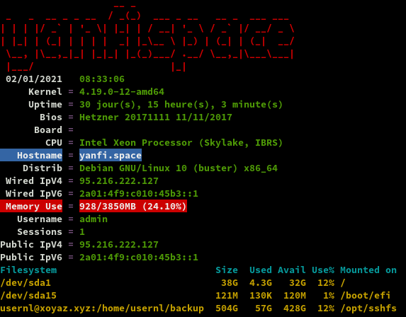


## Applications

La plupart des commandes sont exécutées en mode "su"
{: .prompt-info }

### Nextcloud (/nextcloud)

{:width="70"}

Sur le domaine cinay.eu  admin, yann

    yunohost app install https://github.com/YunoHost-Apps/nextcloud_ynh --debug

```
[...]
Choose a domain for Nextcloud (default: cinay.eu): 
Choose a path for Nextcloud (default: /nextcloud): 

Choose the Nextcloud administrator (must be an existing YunoHost user): yann
Access the users home folder from Nextcloud? [yes | no] (default: no): no
[...]
```

Dans les paramètres fichier de nextcloud , activer l'affichage des fichiers masqués  

#### Activer les applications

Activer les applications **Calendar**, **Contacts** et **Notes** sur nextcloud

#### Paramètres de base

* Paramètres de base
    * Serveur e-mail
* Personnaliser l'apparence
    * Logo
    * Image de connexion

#### Calendrier et contacts (android et thunderbird)

Paramétrage **OpenSync** android  
Connexion avec le lien https://cinay.eu/nextcloud/remote.php/dav (login+mdp)  
{:height="300"} 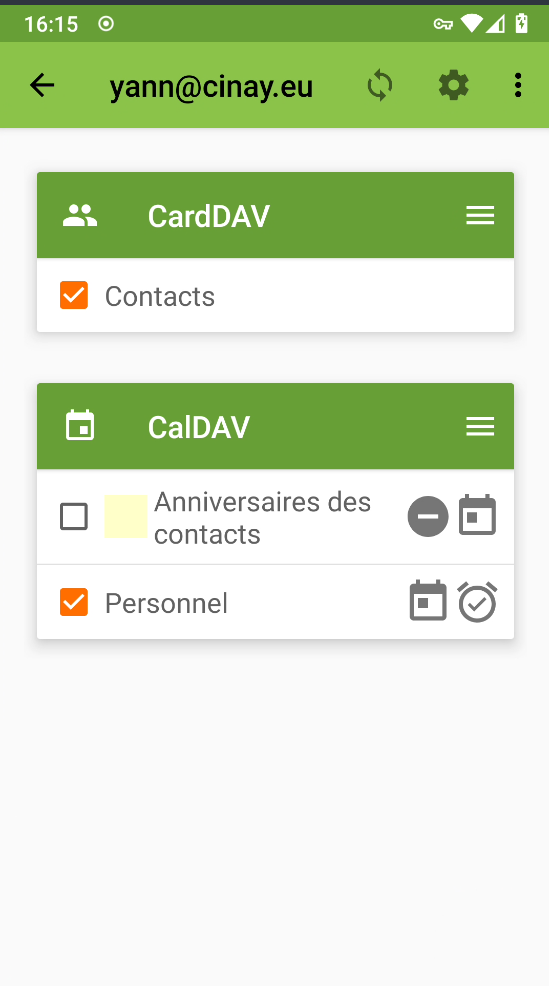{:height="300"}

Paramétrer les applications  qui utilisent le calendrier et les contacts  
**Contacts** , **acalendar**  et **Tâches**  
{:height="300"} {:height="300"} {:height="300"}  

Paramétrage agenda **Thunderbird**  
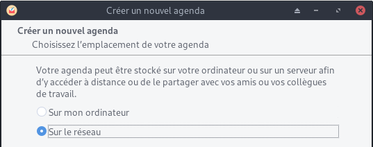{:width="300"} 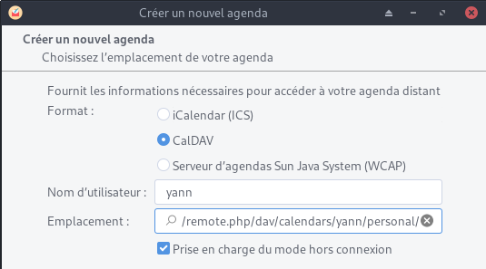{:width="300"}  
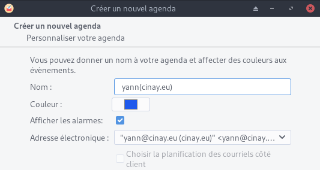{:width="300"}  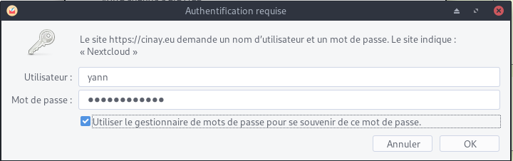{:width="300"}
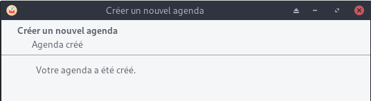{:width="300"}  
Se désabonner de l'ancien agenda cinay.xyz

Paramétrage contacts **Thunderbird**  
Outils &rarr; Préférences des modules &rarr; TbSync   
Dans l'application  
Actions sur les comptes &rarr; Ajouter un nouveau compte &rarr; Caldav & Carddav  
{:width="300"} 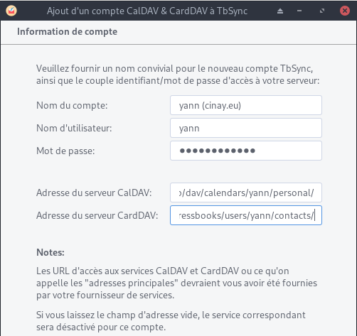{:width="300"}   
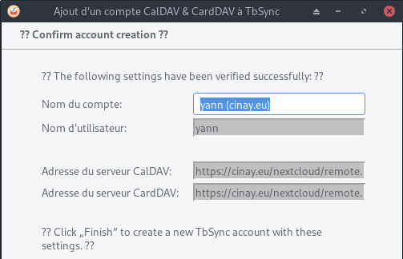{:width="300"}   
{:width="300"}   
Synchronisation toutes les heures pour les contacts  


Liens caldav carddav sur thunderbird (yann)    
https://cinay.eu/nextcloud/remote.php/dav/calendars/yann/personal/  
https://cinay.eu/nextcloud/remote.php/dav/addressbooks/users/yann/contacts/  

#### Compte nextcloud sur les postes clients de type PC

Ajout du compte https://cinay.eu/nextcloud sur les clients nextcloud    
Synchronisations:

* ~/.keepassx &rarr; Home/.keepassx (créer le dossier)
* ~/media/Notes &rarr; Notes (créer le dossier)

#### Compte nextcloud sur android

Application nextcloud installée  
Se connecter https://cinay.eu/nextcloud et vérifier la création du compte  
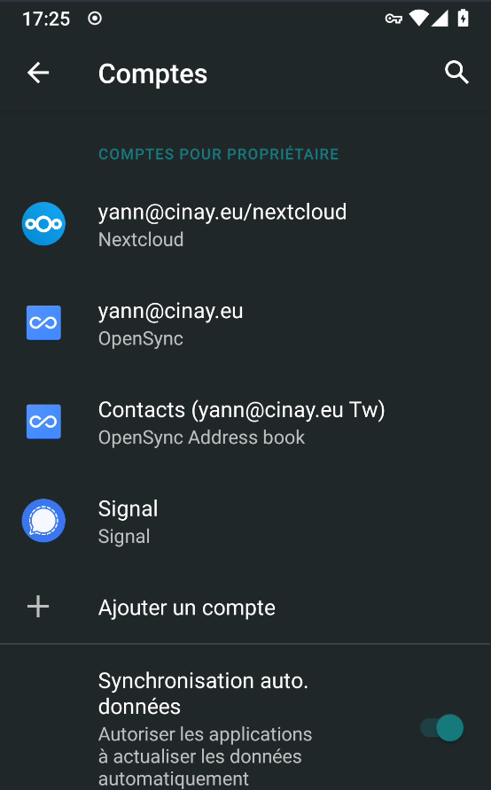{:height="300"}  

Synchroniser le fichier de mot de passe avec l'application keepass  
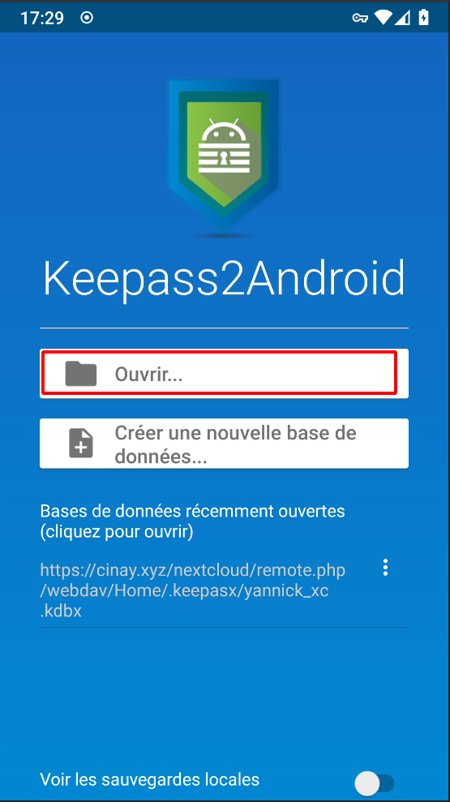{:height="300"}  {:height="300"}  
{:width="200"}  

>Corriger l’avertissement <font color="red">« La limite de mémoire PHP est inférieure à la valeur recommandée de 512 Mo »</font>  
Augmenter la mémoire : `memory_limit = 512M` dans le fichier `/etc/php/7.3/fpm/php.ini`   
Relancer `sudo systemctl restart php7.3-fpm`  


### Tiny Tiny RSS (/ttrss)

{:width="50px"}  
*Tiny Tiny RSS (ttrss) est un agrégateur de flux RSS et Atom libre sous licence libre GNU GPL v3*

Installation en mode de commande (su)

    yunohost app install ttrss

```
Choose a domain for Tiny-Tiny-RSS (default: cinay.eu): 
Choose a path for Tiny-Tiny-RSS (default: /ttrss): 
Success! Installation completed
```

Mise à jour

    yunohost app upgrade ttrss -u https://github.com/YunoHost-Apps/ttrss_ynh/tree/testing --debug

Personnaliser le CSS , configuration 

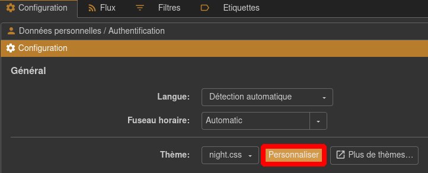{:width="400"}

Ajout du contenu suivant dans la feuille de style

```css
body.flat.ttrss_main #headlines-frame .hl.Unread:not(.active):not(.Selected),
body.flat.ttrss_main #headlines-frame .cdm.expandable.Unread:not(.active):not(.Selected) {
  background: #696969;
}
```

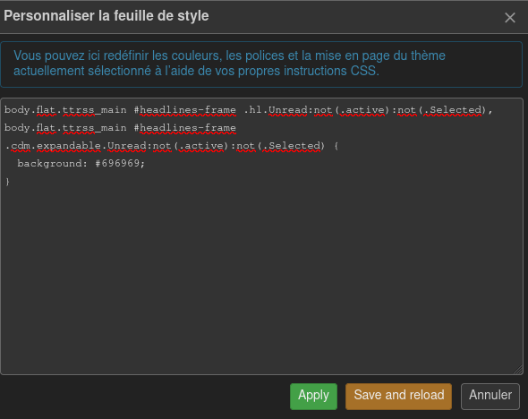{:width="400"}  
Puis cliquer **Save and reload**  

### Shaarli

{:width="70"}

Installation

    yunohost app install https://github.com/YunoHost-Apps/shaarli_ynh/tree/testing

```
domaine : yanfi.space
racine : /shaarli
utilisateur admin : yann
Mp admin : idem mp yann
Site publique: oui 
```

Basculer l'application de privée en publique 

    sed -i "s/is_public\: '0'/is_public\: '1'/g" /etc/yunohost/apps/shaarli/settings.yml

Regénérer la configuration

    yunohost app ssowatconf

### static.cinay.eu

En mode su

Créer le domaine static.cinay.eu et les certificats

    yunohost domain add static.cinay.eu
    yunohost domain cert-install static.cinay.eu --no-checks

Installer l’application `Custom web app` sur le domaine static.cinay.eu   

    yunohost app install https://github.com/YunoHost-Apps/my_webapp_ynh/tree/testing --debug

Domaine : static.cinay.eu  
Racine : /  
Utilisateur : yann  
Create a database: no  
Site publique: yes  
SFTP : no + mot de passe  

Accès au site https://static.cinay.eu

Le dossier **/opt/sshfs/static/** contient le site statique qui est issu d'une synchronisation d'un conteneur debian sur un ordinateur archlinux avec jekyll comme générateur 

```bash
rm -r /var/www/my_webapp/www/  # supprimer dossier web 
chown my_webapp.my_webapp -R /var/www/my_webapp
ln -s /opt/sshfs/static /var/www/my_webapp/www  # lien et droits my_webapp
ln -s /opt/sshfs/static/doc /var/www/my_webapp/www/doc
```

Modifier l'étiquette `my_webapp` (static.cinay.eu)

    yunohost app change-label my_webapp 'Statique static.cinay.eu'

### cinay.eu/site 

Accès à des liens tel que "Diceware"  
*Le diceware, ou méthode du lancer de dés selon l' Office québécois de la langue française, est, en cryptologie, une méthode employée pour créer des phrases secrètes, des mots de passe et d'autres variables cryptographiques en utilisant un dé ordinaire à six faces comme générateur de nombres aléatoires physique.*


Installer l’application `Custom web app` sans sftp sur cinay.eu/site  

    yunohost app install https://github.com/YunoHost-Apps/my_webapp_ynh/tree/testing --debug

Application id: my_webapp__2  

```bash
rm -r /var/www/my_webapp__2/www  # supprimer dossier web 
chown my_webapp__2.my_webapp__2 -R /var/www/my_webapp__2
ln -s /opt/sshfs/www /var/www/my_webapp__2/www  # lien et droits my_webapp
```

Modifier le fichier de configuration `/etc/nginx/conf.d/cinay.eu.d/my_webapp__2.conf` pour lister le contenu d'un répertoire

```
    # Deny access to hidden files and directories
#    location ~ ^/site/(.+/|)\.(?!well-known\/) {
#        deny all;
#    }

    fancyindex on;              # Enable fancy indexes.
    fancyindex_exact_size off;  # Output human-readable file sizes.
```

Redémarrer le serveur nginx

    systemctl restart nginx

Modifier l'étiquette `my_webapp__2`

    yunohost app change-label my_webapp__2 'Cartographie Diceware'

https://cinay.eu/site

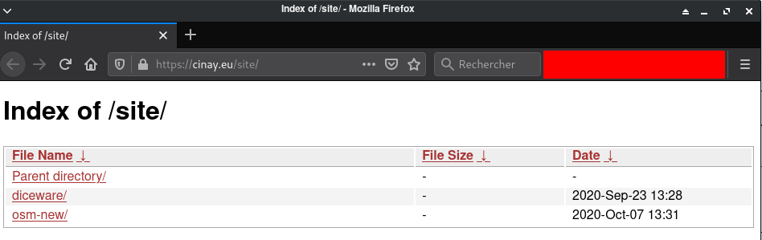{:width="500"}

### Cartes - map.cinay.eu

En mode su

Créer le domaine map.cinay.eu et les certificats

    yunohost domain add map.cinay.eu
    yunohost domain cert-install map.cinay.eu --no-checks

Installer l’application `Custom web app` sur le domaine map.cinay.eu   

    yunohost app install https://github.com/YunoHost-Apps/my_webapp_ynh

```
Choose the domain where this app should be installed [cinay.eu | gitea.cinay.eu | map.cinay.eu | static.cinay.eu | yanfi.net | yanfi.space | searx.yanfi.space | zic.yanfi.space] (default: yanfi.space): map.cinay.eu
Choose the path where this app should be installed (default: /site): /
Do you need a SFTP access? [yes | no] (default: yes): no
Choose an administration password for this app: 
Should this app be exposed to anonymous visitors? [yes | no] (default: yes): 
Do you need a MySQL database? [yes | no] (default: no): 
[...]
Info: [####################] > Installation of my_webapp__3 completed
Success! Installation completed
```

Accès au site https://map.cinay.eu

Le dossier **/opt/sshfs/www/osm-new/** contient le site cartographique basé sur leaflet

```bash
rm -r /var/www/my_webapp__3/www/  # supprimer dossier web 
chown my_webapp__3.my_webapp__3 -R /var/www/my_webapp__3
ln -s /opt/sshfs/www/osm-new /var/www/my_webapp__3/www  # lien et droits my_webapp__3
```

Modifier l'étiquette `my_webapp__3` (map.cinay.eu)

    yunohost app change-label my_webapp__3 'Cartes map.cinay.eu'


### Gitea (gitea.cinay.eu)

[{:width="70"}](https://github.com/YunoHost-Apps/gitea_ynh)

Ajout domaine et certificats gitea.cinay.eu

    yunohost domain add gitea.cinay.eu
    yunohost domain cert-install gitea.cinay.eu --no-checks

Installation à partir de github, on clône le dépôt

    git clone https://github.com/YunoHost-Apps/gitea_ynh.git

Blocage sur fail2ban à l'installation   
Commenter la mise en place FAIL2BAN 

    nano gitea_ynh/scripts/install

```
# SETUP FAIL2BAN
#ynh_script_progression --message="Configuring fail2ban..."
#ynh_add_fail2ban_config --logpath "/var/log/$app/gitea.log" --failregex ".*Failed authentication attempt for .* from <HOST>" --max_retry 5
```

Installer gitea

    yunohost app install gitea_ynh

Fail2ban , règle qui n'est pas ajouté

```
ynh_add_fail2ban_config --logpath /var/log/gitea/gitea.log --failregex '.*Failed authentication attempt for .* from <HOST>' --max_retry 5
```

Modifier l'étiquette `gitea`

    yunohost app change-label gitea 'Gitea gitea.cinay.eu'

### Searx (searx.yanfi.space)

[{:width="50"}](https://github.com/YunoHost-Apps/searx_ynh)

Ajout domaine et certificats searx.yanfi.space

    sudo yunohost domain add searx.yanfi.space
    sudo yunohost domain cert-install searx.yanfi.space --no-checks

**Searx - docker**  
Les procédures d'installation, voir le lien [Searx (métamoteur de recherche libre)](/posts/Searx-Metamoteur-Recherche-Libre/)

L'image du docker est [searx/searx](https://hub.docker.com/r/searx/searx) (basée sur [github.com/searx/searx](https://github.com/searx/searx)).  

    cd /home/admin
    docker pull searx/searx
    docker images

```
REPOSITORY    TAG       IMAGE ID       CREATED       SIZE
searx/searx   latest    096886989dad   6 hours ago   161MB
```

La méthode la plus simple pour déployer un conteneur en tant que service consiste à créer le conteneur s'il n'existe pas avec un nom donné et ensuite de mapper chacune des opérations de docker (démarrage et arrêt) aux commandes de service du système.

Une fois que nous avons créé ce conteneur, nous pouvons le démarrer, l'arrêter et le redémarrer en utilisant les commandes habituelles du docker en indiquant le nom du conteneur (`docker stop searx`, `docker start searx`, `docker restart searx`).

Créer un nouveau fichier d'unité systemd `searx.service` avec la description du service dans `/etc/systemd/system/`. 

    /etc/systemd/system/searx.service

```
[Unit]
Description=searx container
After=docker.service
Wants=network-online.target docker.socket
Requires=docker.socket
 
[Service]
Restart=always
ExecStartPre=/bin/bash -c "/usr/bin/docker container inspect searx 2> /dev/null || /usr/bin/docker run --name searx --rm -d -v /home/admin/searx:/etc/searx -p 8089:8080 -e BASE_URL=http://localhost:8089/ searx/searx"
ExecStart=/usr/bin/docker start -a searx
ExecStop=/usr/bin/docker stop -t 10 searx
 
[Install]
WantedBy=multi-user.target
```

Recharger les services

    sudo systemctl daemon-reload

Le fichier d'unité crée un nouveau service et associe les commandes de démarrage et d'arrêt du docker aux séquences de démarrage et d'arrêt du service.

Le fichier unit décrit comme des dépendances la cible réseau en ligne et la prise docker, si la prise docker ne démarre pas ce service ne le fera pas non plus. Il ajoute également une dépendance à docker.service, de sorte que ce service ne fonctionnera pas tant que docker.service n'aura pas démarré.

Nous pouvons maintenant démarrer/arrêter le service en émettant la commande correspondante :
	
    sudo systemctl start searx  # sudo systemctl stop searx

Vérifier localement

    curl --location --verbose --head --insecure localhost:8089

```
[...]
*   Trying 127.0.0.1...
* TCP_NODELAY set
* Expire in 200 ms for 4 (transfer 0x5614e62aef90)
* Connected to localhost (127.0.0.1) port 8089 (#0)
> HEAD / HTTP/1.1
> Host: localhost:8089
> User-Agent: curl/7.64.0
> Accept: */*
> 
< HTTP/1.1 200 OK
HTTP/1.1 200 OK
[...]
```

Modifier le fichier de configuration

    sudo nano ${PWD}/searx/settings.yml

```
general:

    instance_name : "yann-searx" # displayed name

server:
    base_url : http://localhost:8089/ # Set custom base_url. Possible values: False or "https://your.custom.host/lo
cation/"

ui:
    theme_args :
        oscar_style : logicodev-dark # default style of oscar
    results_on_new_tab: True  # Open result links in a new tab by default

# supprimer la ligne 'disabled : True' des éléments ci dessous

  - name : ddg definitions
    engine : duckduckgo_definitions
    shortcut : ddd
    weight : 2

  - name : duckduckgo
    engine : duckduckgo
    shortcut : ddg

  - name : duckduckgo images
    engine : duckduckgo_images
    shortcut : ddi
    timeout: 3.0

```

Redémarrage pour prise en charge des modifications

    sudo systemctl restart searx

Valider le service pour qu'il fonctionne au démarrage en courant :

    sudo systemctl enable searx

Pour info, docker ID

    docker ps

```
CONTAINER ID   IMAGE         COMMAND                  CREATED         STATUS         PORTS                    NAMES
dfefa57f88f9   searx/searx   "/sbin/tini -- /usr/…"   9 minutes ago   Up 9 minutes   0.0.0.0:8089->8080/tcp   searx
```

Redémarrer le container par son ID : `docker restart dfefa57f88f9`  

**TEST à partir d'un poste distant**   
Exécuter sur un poste distant

    ssh -L 9000:localhost:8089 cxuser@135.181.27.140 -p 55140 -i /home/yannick/.ssh/cx11_ed25519  

Sur le même poste , ouvrir le navigateur avec un lien <http://localhost:9000>

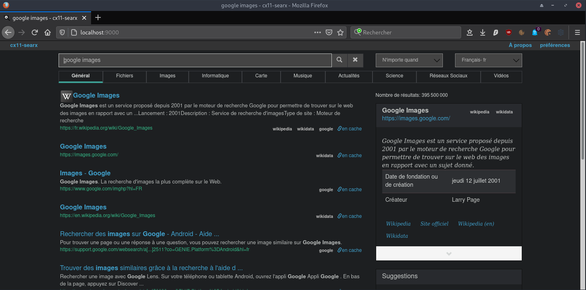{:width="600"}

**Proxy searx**  
Installer application yunohost proxy **redirect**

	sudo yunohost app install https://github.com/YunoHost-Apps/redirect_ynh

```
Choose a domain for your redirect (default: cinay.eu): searx.yanfi.space
Choose a path for your redirect (default: /redirect): /
Redirect destination path (default: http://127.0.0.1): http://127.0.0.1:8089
Redirect type [public_302 | public_301 | public_proxy | private_proxy] (default: public_302): public_proxy
Info: Installing redirect...
[...]
Success! Installation completed
```

Modifier l'étiquette `redirect` (searx.cinay.eu)

    sudo yunohost app change-label redirect 'Moteur Recherche searx.cinay.eu'

Accès lien https://searx.yanfi.space


**Mise à jour de l'image docker searx**

    cd /home/admin

Télécharge la dernière image searx


docker images --format "{{.Repository}}:{{.Tag}}" | grep ':latest' | xargs -L1 docker pull;


```bash
latest: Pulling from searx/searx
339de151aab4: Pull complete 
cb464254eb0a: Pull complete 
3df700c30092: Pull complete 
9a4946c2a738: Pull complete 
2c615ec6f7fa: Pull complete 
ef48a2d171a2: Pull complete 
Digest: sha256:b4df2141a868644563f82680d66dc0d3c1d366f598ffc1cdb484d796c117230f
Status: Downloaded newer image for searx/searx:latest
```

Liste des images

    docker images

```bash
REPOSITORY    TAG       IMAGE ID       CREATED        SIZE
searx/searx   latest    2b9a1d1fc86a   5 days ago     205MB
searx/searx   <none>    096886989dad   7 months ago   161MB
```

Arrêt image searx

    sudo systemctl stop searx.service

Supprimer l'image par ID

    docker rmi 096886989dad

Les images restantes

    docker images

```bash
REPOSITORY    TAG       IMAGE ID       CREATED      SIZE
searx/searx   latest    2b9a1d1fc86a   5 days ago   205MB
```

Relancer le service

    sudo systemctl start searx.service
    sudo systemctl status searx.service

```bash
● searx.service - searx container
   Loaded: loaded (/etc/systemd/system/searx.service; enabled; vendor preset: enabled)
   Active: active (running) since Fri 2021-08-20 18:26:17 CEST; 17s ago
  Process: 15680 ExecStartPre=/bin/bash -c /usr/bin/docker container inspect searx 2> /dev/null || /usr/bin/docker run --name sear
 Main PID: 15788 (docker)
    Tasks: 7 (limit: 4579)
   Memory: 21.5M
   CGroup: /system.slice/searx.service
           └─15788 /usr/bin/docker start -a searx

Aug 20 18:26:16 yanfi.space systemd[1]: Starting searx container...
Aug 20 18:26:16 yanfi.space bash[15680]: []
Aug 20 18:26:16 yanfi.space bash[15680]: 6a7551c7a9fbbdc86e234aa07dbadde13ecd2878cef7beea49272b9de2a0b313
Aug 20 18:26:17 yanfi.space systemd[1]: Started searx container.
Aug 20 18:26:17 yanfi.space docker[15788]: searx version 1.0.0-200-313a9847
Aug 20 18:26:17 yanfi.space docker[15788]: Use existing /etc/searx/uwsgi.ini
Aug 20 18:26:17 yanfi.space docker[15788]: Use existing /etc/searx/settings.yml
Aug 20 18:26:17 yanfi.space docker[15788]: Listen on 0.0.0.0:8080
Aug 20 18:26:17 yanfi.space docker[15788]: [uWSGI] getting INI configuration from /etc/searx/uwsgi.ini
Aug 20 18:26:17 yanfi.space docker[15788]: [uwsgi-static] added mapping for /static => /usr/local/searx/searx/static
```

### Navidrome (stream audio)

*Navidrome est un serveur et un streamer de collection de musique en ligne open source. Il vous donne la liberté d'écouter votre playlist à partir de n'importe quel navigateur ou appareil mobile.*

Votre musique est a stockée par default dans le dossier multimédia partagé /home/yunohost.multimedia/share/Music. Ce dossier, facilement accessible depuis Nextcloud avec Stockages externes activée, vous permettra d'uploader facilement vos fichiers de musique sur votre server.

Vous pouvez personnaliser le dossier de stockage de vos fichiers de musique en éditant le fichier de configuration **/var/lib/navidrome/navidrome.toml** et rediriger la variable `MusicFolder = "/home/yunohost.multimedia/share/Music"`. Vous pouvez également changer d'autre réglage en vous aidant de la [documentation](https://www.navidrome.org/docs/usage/configuration-options/).

En mode su

Ajout domaine et certificats zic.yanfi.space

    yunohost domain add zic.yanfi.space
    yunohost domain cert-install zic.yanfi.space --no-checks

Installer navidrome

    yunohost app install https://github.com/YunoHost-Apps/navidrome_ynh/tree/testing --debug    

domaine : zic.yanfi.space  
racine : /  
anonyme : oui  

Modification fichier de configuration, dossier musique et scan

    nano /var/lib/navidrome/navidrome.toml

```
# Folder where your music library is stored. Can be read-only
MusicFolder = "/opt/sshfs/musique"

# How frequently to scan for changes in your music library. Set it to 0 to disable scans
ScanSchedule = '@every 24h'

```

Redémarrer le service

    systemctl restart navidrome.service

Modifier l'étiquette `navidrome`

    yunohost app change-label navidrome 'Zic Navidrome zic.cinay.eu'

### Rainloop

{:width="150"}

En mode su

    yunohost app install rainloop

```
Choose the domain where this app should be installed [cinay.eu | gitea.cinay.eu | static.cinay.eu | yanfi.net | yanfi.space | searx.yanfi.space | zic.yanfi.space] (default: yanfi.space): 
Choose the path where this app should be installed (default: /rainloop): 
Should this app be exposed to anonymous visitors? [yes | no] (default: no): 
Choose an administration password for this app: 
Do you want to add YunoHost users to the recipients suggestions? [yes | no] (default: yes): 
Select default language [de | en | es | fr | it | pt] (default: en): fr
[...]
Info: [####################] > Installation of rainloop completed
Success! Installation completed
```

### LibreSpeed

{:width="50"}

*Test de vitesse de connexion très léger.[LibreSpeed](https://fdossena.com/?p=speedtest/index.frag)*

domaine : yanfi.space  
site : /librespeed  

En mode su

    yunohost app install librespeed # un mot de passe administartion est demandé

Le fichier de configuration nginx

    /etc/nginx/conf.d/yanfi.space.d/librespeed.conf 

```
 rewrite ^/librespeed$ /librespeed/ permanent;
location /librespeed/ {

  # Path to source
  alias /var/www/librespeed/ ;

  # Force usage of https
  if ($scheme = http) {
    rewrite ^ https://$server_name$request_uri? permanent;
  }

### Example PHP configuration (remove it if not used)
  index yann-singleServer-full/ index.php;

  # Common parameter to increase upload size limit in conjunction with dedicated php-fpm file
  client_max_body_size 256M;

  try_files $uri $uri/ /index.php;
  location ~ [^/]\.php(/|$) {
    fastcgi_split_path_info ^(.+?\.php)(/.*)$;
    fastcgi_pass unix:/var/run/php/php7.3-fpm-librespeed.sock;
    fastcgi_index index.php;
    include fastcgi_params;
    fastcgi_param REMOTE_USER $remote_user;
    fastcgi_param PATH_INFO $fastcgi_path_info;
    fastcgi_param SCRIPT_FILENAME $request_filename;
  }
### End of PHP configuration part

  # Include SSOWAT user panel.
  include conf.d/yunohost_panel.conf.inc;
}
```

Le fichier original `example-singleServer-full/` a été remplacé par `yann-singleServer-full/`
{: .prompt-info }

https://yanfi.space/librespeed

### Calibre ebook.yanfi.space

Source : https://github.com/janeczku/calibre-web  
Caractéristiques

* Interface HTML5 Bootstrap 3
* configuration graphique complète
* Gestion des utilisateurs avec des permissions par utilisateur à grain fin
* Interface administrateur
* Interface utilisateur en brésilien, tchèque, néerlandais, anglais, finnois, français, allemand, grec, hongrois, italien, japonais, khmer, polonais, russe, chinois simplifié, espagnol, suédois, turc, ukrainien.
* Flux OPDS pour les applications de lecture de livres électroniques
* Filtrez et recherchez par titres, auteurs, tags, séries et langues.
* Créer une collection de livres personnalisée (étagères)
* Prise en charge de l'édition des métadonnées des livres électroniques et de la suppression des livres électroniques de la bibliothèque Calibre.
* Prise en charge de la conversion des eBooks par les binaires Calibre
* Restriction du téléchargement des livres électroniques aux utilisateurs connectés
* Support pour l'enregistrement public des utilisateurs
* Envoi d'eBooks vers des appareils Kindle d'un simple clic de souris
* Synchronisation de vos appareils Kobo avec votre bibliothèque Calibre via Calibre-Web
* Prise en charge de la lecture des eBooks directement dans le navigateur (.txt, .epub, .pdf, .cbr, .cbt, .cbz, .djvu)
* Téléchargement de nouveaux livres dans de nombreux formats, y compris les formats audio (.mp3, .m4a, .m4b)
* Prise en charge des colonnes personnalisées de Calibre
* Possibilité de masquer le contenu en fonction des catégories et du contenu des colonnes personnalisées par utilisateur.
* Possibilité de mise à jour automatique
* Connexion "Magic Link" pour faciliter la connexion aux eReaders
* Connexion via LDAP, google/github oauth et via l'authentification proxy.


Ajout domaine et certificats ebook.yanfi.space

    yunohost domain add ebook.yanfi.space
    yunohost domain cert-install ebook.yanfi.space --no-checks

Installer l'application **Calibre-web**  

    yunohost app install https://github.com/YunoHost-Apps/calibreweb_ynh

```
Choose the domain where this app should be installed [cinay.eu | gitea.cinay.eu | map.cinay.eu | static.cinay.eu | yanfi.net | yanfi.space | ebook.yanfi.space | searx.yanfi.space | zic.yanfi.space] (default: yanfi.space): ebook.yanfi.space
Choose the path where this app should be installed (default: /calibre): /
Choose an administrator user for this app [yann | claudine | yanfi]: yann
Should this app be exposed to anonymous visitors? [yes | no] (default: no): yes
Select a default language [fr | en | es | de] (default: fr): 
Do you want to allow uploading of books? [yes | no] (default: no): 
Do you want to allow access to the library to all Yunohost users?  [yes | no] (default: yes): 
```

**Le dossier des livres** est une copie d'un dossier distant qui est mis à jour une fois par jour  
Synchronisation du dossier local `/home/yunohost.multimedia/share/eBook/` avec le dossier distant `/home/usernl/backup/BiblioCalibre` du serveur xoyaz.xyz  
L'opération est exécutable en mode su seulement  

    rsync -avz --delete --rsync-path="sudo rsync" -e "ssh -p 55051 -i /home/admin/.ssh/hms-sto-250 -o StrictHostKeyChecking=no -o UserKnownHostsFile=/dev/null" userhms@hms.xoyaz.xyz:/home/userhms/sshfs/BiblioCalibre/* /home/yunohost.multimedia/share/eBook/  && chown calibreweb.calibreweb -R /home/yunohost.multimedia/share/eBook/

    Créer une tâche crontab

    sudo crontab -e

```
# Synchronisation du dossier local /home/yunohost.multimedia/share/eBook/ avec le dossier distant /home/userhms/sshfs/BiblioCalibre du serveur hms.xoyaz.xyz
# Tous les jours à 4h00 du matin
0 4 * * * rsync -avz --delete --rsync-path="sudo rsync" -e "ssh -p 55051 -i /home/admin/.ssh/hms-sto-250 -o StrictHostKeyChecking=no -o UserKnownHostsFile=/dev/null" userhms@hms.xoyaz.xyz:/home/userhms/sshfs/BiblioCalibre/* /home/yunohost.multimedia/share/eBook/  && chown calibreweb.calibreweb -R /home/yunohost.multimedia/share/eBook/
```

A FAIRE : En cas de modification du dossier /home/userhms/sshfs/BiblioCalibre sur le serveur hms.xoyaz.xyz  
Il faut effectuer une synchro du dossier par rsync depuis le serveur hms.xoyaz.xyz vers yanfi.space 
{: .prompt-info }


**Les traductions de l'application "calibreweb_ynh"** 

```bash
find /var/www/calibreweb/cps/templates/ -name "*.*" -type f -exec sed -i "s#'Sort according to book date, newest first'#'Trier selon la date du livre, le plus récent en premier'#g" {} \;
find /var/www/calibreweb/cps/templates/ -name "*.*" -type f -exec sed -i "s#'Sort according to book date, oldest first'#'Trier selon la date du livre, le plus ancien en premier'#g" {} \;
find /var/www/calibreweb/cps/templates/ -name "*.*" -type f -exec sed -i "s#'Sort title in alphabetical order'#'Trier le titre par ordre alphabétique'#g" {} \;
find /var/www/calibreweb/cps/templates/ -name "*.*" -type f -exec sed -i "s#'Sort title in reverse alphabetical order'#'Trier le titre en ordre alphabétique inverse'#g" {} \;
find /var/www/calibreweb/cps/templates/ -name "*.*" -type f -exec sed -i "s#'Sort authors in alphabetical order'#'Trier les auteurs par ordre alphabétique'#g" {} \;
find /var/www/calibreweb/cps/templates/ -name "*.*" -type f -exec sed -i "s#'Sort authors in reverse alphabetical order'#'Trier les auteurs par ordre alphabétique inverse'#g" {} \;
find /var/www/calibreweb/cps/templates/ -name "*.*" -type f -exec sed -i "s#'Sort according to publishing date, newest first'#'Trier selon la date de publication, les plus récentes en premier'#g" {} \;
find /var/www/calibreweb/cps/templates/ -name "*.*" -type f -exec sed -i "s#'Sort according to publishing date, oldest first'#'Trier selon la date de publication, la plus ancienne en premier'#g" {} \;
```


Les fichiers de traduction française dans le dossier `/var/www/calibreweb/cps/translations/fr/LC_MESSAGES/`  
Editer et modifier le fichier `messages.po`  
Convertir le `po` vers `mo` , lien  <http://po2mo.net/>  
Redémarrer le service `calibreweb`

    systemctl restart calibreweb

Ouverture du lien https://ebook.yanfi.space  
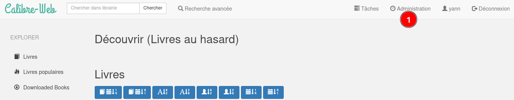{:width="400"} 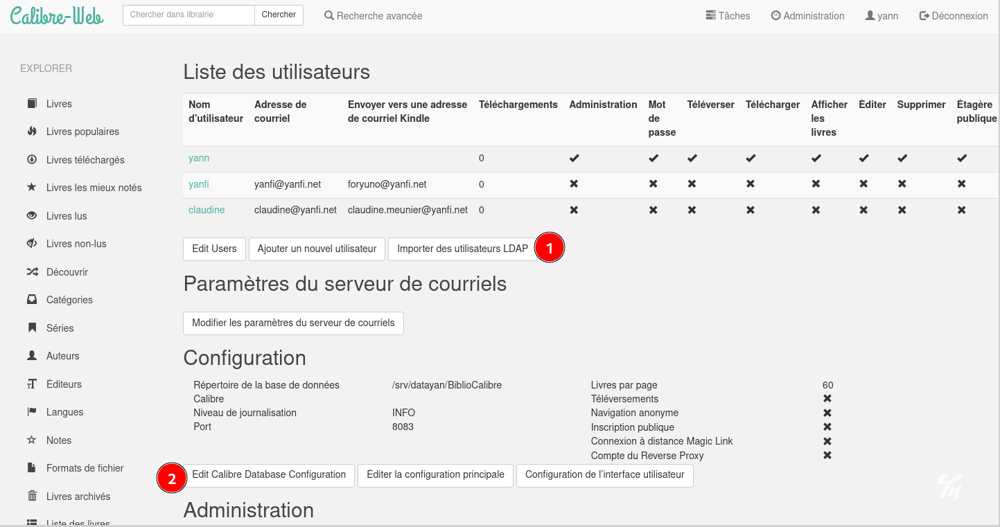{:width="400"}  

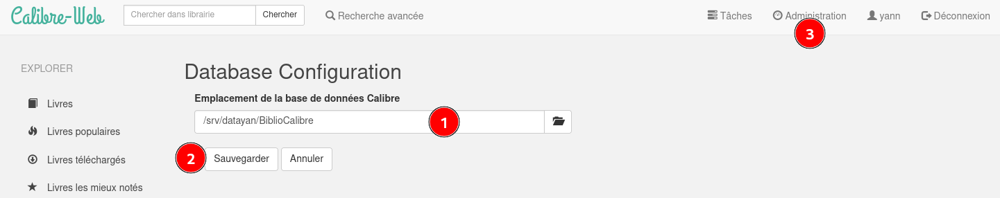{:width="400"} 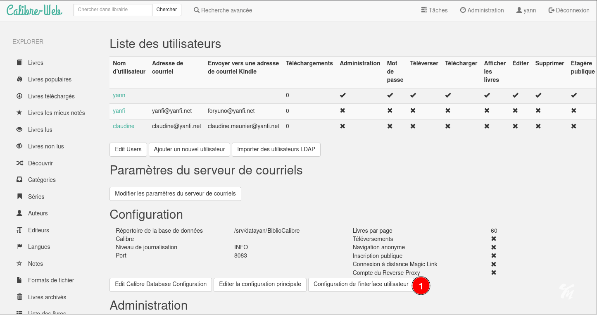{:width="400"}  

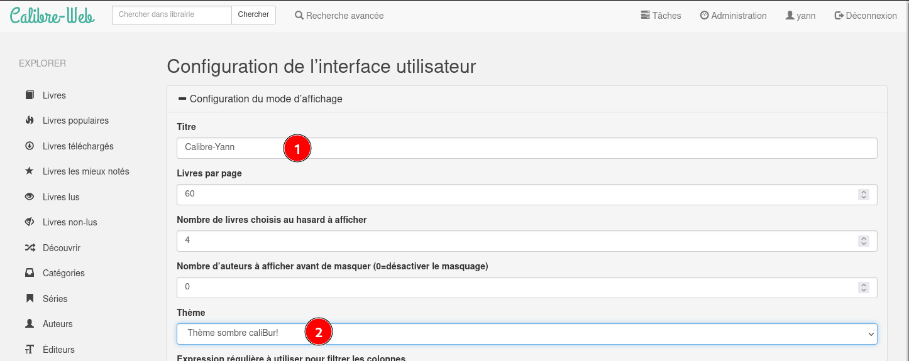{:width="400"} {:width="400"}  

{:width="400"}  

## Sauvegardes 

### BorgBackup 

* [BorgBackup client serveur](/posts/BorgBackup-Client-Serveur/)

### Via rsync

Sauvegarde complète de yunohost **yanfi.space** sur le serveur **hms.xoyaz.xyz** via **rsync**  
est désactivée depuis la mise en place de la sauvegarde par **BorgBackup**
{: .prompt-warning }

Créer le bash `~/backup-hms.xoyaz.xyz.sh` 

    nano ~/backup-hms.xoyaz.xyz.sh

```bash
#!/bin/sh
# Créer une sauvegarde totale localement
yunohost backup create --debug
# Copier cette sauvegarde sur le distant hms.xoyaz.xyz
rsync -avz --progress --stats --human-readable --rsync-path="sudo rsync" -e "ssh -p 55051 -i /home/admin/.ssh/hms-sto-250 -o StrictHostKeyChecking=no -o UserKnownHostsFile=/dev/null" /home/yunohost.backup/archives/$(date '+%Y%m%d')* userhms@hms.xoyaz.xyz:/home/userhms/sshfs/yanfi.space/ ; \
 if [ $? -eq 0 ]; then \
 echo "Sauvegardes $(date '+%Y%m%d')* -> OK" | systemd-cat -t allsync -p info ; \
 rm /home/yunohost.backup/archives/$(date '+%Y%m%d')* ; \
 else \
 echo "Sauvegardes $(date '+%Y%m%d')* -> ERREUR" | systemd-cat -t allsync -p emerg ; \
 fi
```

Le rendre exécutable

    chmod +x ~/backup-hms.xoyaz.xyz.sh

Le résultat de la commande est dans le journal

    journalctl --no-pager -t allsync --since today

```
-- Logs begin at Wed 2021-09-15 11:48:08 CEST, end at Wed 2021-09-15 18:47:50 CEST. --
Sep 15 18:24:45 yanfi.space allsync[16720]: Sauvegardes 20210915* -> OK
```

Tâche

    sudo crontab -e

```
10 02 * * * /home/admin/backup-hms.xoyaz.xyz.sh > /dev/null
```

## Yunohost +

### Maintenance

**sauvegardes borg sur le serveur xoyaz.yz**  
Clé SSH pour lister les sauvegardes borg sur le serveur xoyaz.yz

    ssh-keygen -t ed25519 -f ~/.ssh/borg_yanfi

Se connecter au serveur xoyaz.xyz et ajouter la clé publique 

    ssh userhms@45.145.166.51 -p 55051 -i /home/yann/.ssh/hms-sto-250
    sudo -u borgbackup -s # utilisateur borgbackup  
    echo 'ssh-ed25519 AAAAkjhreszFJE5AAAAIBWaYu5BvBcpuTeP4/0QXLm3/vmKP7EagcWXi+MGygJ7 yann@archyan' >> /home/backup/.ssh/authorized_keys

Test connexion SSH

    ssh borgbackup@xoyaz.xyz -p 55051 -i /home/yann/.ssh/borg_yanfi

### Erreurs et avertissements

yanfi.space  
Mise à jour reverse DNS IPV4 IPV6  
95.216.222.127 &rarr; yanfi.space  
2a01:4f9:c010:45b3::2255 &rarr; yanfi.space  


Mise à jour yunohost 02/02/2021

    yunohost diagnosis run --force

Le détail

    yunohost diagnosis show --issues

```
reports: 
  0: 
    description: Base system
    id: basesystem
    items: 
      status: WARNING
      summary: It looks like apt (the package manager) is configured to use the backports repository. Unless you really know what you are doing, we strongly discourage from installing packages from backports, because it's likely to create unstabilities or conflicts on your system.
  1: 
    description: Email
    id: mail
    items: 
      0: 
        details: 
          - The blacklist reason is: "http://www.barracudanetworks.com/reputation/?pr=1&ip=95.216.222.127"
          - After identifying why you are listed and fixed it, feel free to ask for your IP or domaine to be removed on https://barracudacentral.org/rbl/
        status: ERROR
        summary: Your IP or domain 95.216.222.127 is blacklisted on Barracuda Reputation Block List
      1: 
        details: 
          - The blacklist reason is: "https://matrix.spfbl.net/2a01:4f9:c010:45b3:0:0:0:1"
          - After identifying why you are listed and fixed it, feel free to ask for your IP or domaine to be removed on https://spfbl.net/en/dnsbl/
        status: ERROR
        summary: Your IP or domain 2a01:4f9:c010:45b3::2255 is blacklisted on SPFBL.net RBL
  2: 
    description: System configurations
    id: regenconf
    items: 
      details: This is probably OK if you know what you're doing! YunoHost will stop updating this file automatically... But beware that YunoHost upgrades could contain important recommended changes. If you want to, you can inspect the differences with 'yunohost tools regen-conf ssh --dry-run --with-diff' and force the reset to the recommended configuration with 'yunohost tools regen-conf ssh --force'
      status: WARNING
      summary: Configuration file /etc/ssh/sshd_config appears to have been manually modified.

```


Email

**Résoudre le blocage barracuda**  

```
          - The blacklist reason is: "http://www.barracudanetworks.com/reputation/?pr=1&ip=95.216.222.127"
          - After identifying why you are listed and fixed it, feel free to ask for your IP or domaine to be removed on https://barracudacentral.org/rbl/
        status: ERROR
        summary: Your IP or domain 95.216.222.127 is blacklisted on Barracuda Reputation Block List
```

Lien <https://barracudacentral.org/rbl/removal-request>  , il faut renseigner l'adresse ip `95.216.222.127` et un mail   
Traduction du résultat:

```
Demande reçue

Merci d'avoir soumis votre demande. S'il s'agit de votre première demande, la réputation de votre adresse IP sera portée à "normale" pendant 48 heures, le temps que nous menions notre enquête. Il peut s'écouler jusqu'à une heure avant que la réputation ne se propage à tous les pare-feu antispam Barracuda dans le monde. Nous vous remercions de votre patience et vous prions de nous excuser pour tout désagrément.

Votre numéro de confirmation est BBR21612284433-86752-13901.

EmailReg.org

Une façon d'éviter que votre courrier électronique soit bloqué par inadvertance est d'enregistrer votre domaine et vos adresses IP sur EmailReg.org. Les courriels provenant de noms de domaine et d'adresses IP correctement enregistrés sur EmailReg.org peuvent être automatiquement exemptés des couches de défense du filtrage du spam sur les pare-feu antispam Barracuda et d'autres solutions antispam, ce qui permet d'éviter que votre courriel soit accidentellement bloqué. 

```

Résoudre le blocage

```
          - The blacklist reason is: "https://matrix.spfbl.net/2a01:4f9:c010:45b3:0:0:0:1"
          - After identifying why you are listed and fixed it, feel free to ask for your IP or domaine to be removed on https://spfbl.net/en/dnsbl/
        status: ERROR
        summary: Your IP or domain 2a01:4f9:c010:45b3::2255 is blacklisted on SPFBL.net RBL
```

Vérifier rDNS

```
[yann@archyan ~]$ dig ptr 127.222.216.95.in-addr.arpa +noall +answer
127.222.216.95.in-addr.arpa. 86400 IN	PTR	yanfi.space.
[yann@archyan ~]$ dig PTR 1.0.0.0.0.0.0.0.0.0.0.0.0.0.0.0.3.b.5.4.0.1.0.c.9.f.4.0.1.0.a.2.ip6.arpa +noall +answer
1.0.0.0.0.0.0.0.0.0.0.0.0.0.0.0.3.b.5.4.0.1.0.c.9.f.4.0.1.0.a.2.ip6.arpa. 86400	IN PTR yanfi.space.
```

### Thème "yann"

A partir d'un thème existant : `cp -r /usr/share/ssowat/portal/assets/themes/{light,yann}`   
Les images : `/usr/share/ssowat/portal/assets/img/`  
Image de fond : `iceland-aurore-polaire.jpg`  
Logo : ym-70x70.png , yannick-white16x16.png   
Le fichier css : `/usr/share/ssowat/portal/assets/themes/yann/custom_portal.css`  
Modifier la balise `body {`

```css
/*
===============================================================================
 This file contain extra CSS rules to customize the YunoHost user portal and
 can be used to customize app tiles, buttons, etc...
===============================================================================
*/
body { 
  margin:0;
  padding:0;
  background: url("../../img/iceland-aurore-polaire.jpg") no-repeat center fixed; 
  -webkit-background-size: cover; /* pour anciens Chrome et Safari */
  background-size: cover; /* version standardisée */
}
```

Personnaliser le logo  
Modifier le fichier `/usr/share/ssowat/portal/assets/themes/yann/custom_portal.css`

```css
/* Logo */
.ynh-logo {
  opacity: 0.7;
  margin-top: 6em;
  width: 100%;
  height: 9em;
  background-image: url("../../img/ym-70x70.png");
  background-repeat: no-repeat;
  background-position: center 100%;
  background-size: contain;
}

.user-container:before {
  content: url("../../img/yannick-white64x64.png");
  background: #0000;
}

```

Modifier le fichier `/usr/share/ssowat/portal/assets/themes/yann/custom_overlay.css`

```css
#ynh-overlay-switch {
  /* FIXME : idk if this is an issue or not to have /yunohost/sso hard-coded here */
  background-image: url("/yunohost/sso/assets/img/ym-70x70.png");
  right: 60px;
  border-color: #7EA93D;
  background-color: #7EA93D;
}
```

Activer le thème `nano /etc/ssowat/conf.json.persistent` 

```json
{
    "theme" : "yann",
}
```

!!! Rrafraîchir le cache du navigateur pour que le thème se propage complètement ( Ctrl+Maj+R sur Firefox)  

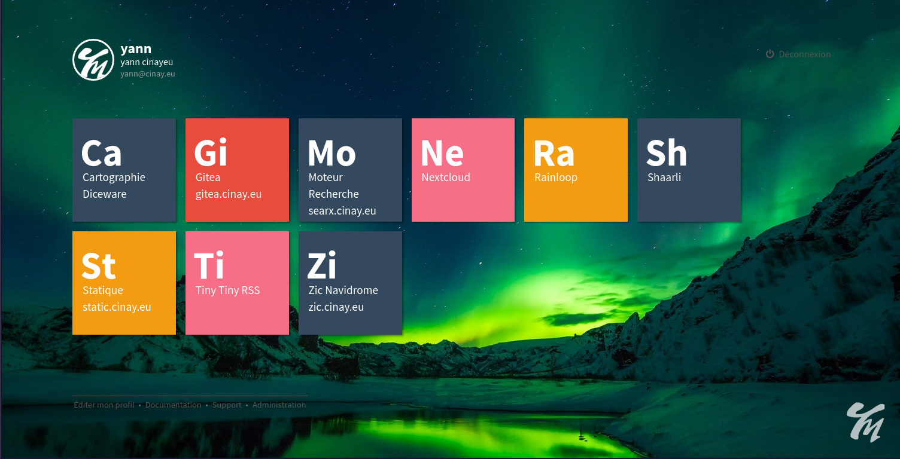{:width="600"}

### Mise à jour 

#### system et app

En mode su

    yunohost tools update
    # si mise à jour possible
    yunohost tools upgrade apps
    yunohost tools upgrade system

AIDE  

```
YunoHost update

positional arguments:
  TARGET      What to update, "apps" (application catalog) or "system" (fetch
              available package upgrades, equivalent to apt update), "all" for
              both

optional arguments:
  -h, --help  show this help message and exit
  --apps      (Deprecated, see first positional arg) Fetch the application
              list to check which apps can be upgraded
  --system    (Deprecated, see first positional arg) Fetch available system
              packages upgrades (equivalent to apt update)
root@yanfi:/home/admin# yunohost tools upgrade -h
usage: yunohost tools upgrade [{apps,system}] [-h] [--apps] [--system]

YunoHost upgrade

positional arguments:
  {apps,system}  What to upgrade, either "apps" (all apps) or "system" (all
                 system packages)

optional arguments:
  -h, --help     show this help message and exit
  --apps         (Deprecated, see first positional arg) Upgrade all
                 applications
  --system       (Deprecated, see first positional arg) Upgrade only the
                 system packages
```

#### Navidrome

**Mise à jour Navidrome avec une version compilée (langue FR par défaut)**  

Mise à jour (version compilée avec langue française par défaut et transmise par filezilla)

```
sudo systemctl stop navidrome.service
sudo cp ~/navidrome /opt/yunohost/navidrome/navidrome
sudo chown -R navidrome:navidrome /opt/yunohost/navidrome
sudo chmod +x /opt/yunohost/navidrome
```

Relance et vérification

```
sudo systemctl restart navidrome
sudo yunohost service log navidrome
```

**NE PAS FAIRE MAJ Navidrome**  
*Il faut renseigner le fichier manifest.json avec la version update pour ne pas faire la mise à jour !!!*  
EXEMPLE : `yunohost tools update`   

```
[...]
apps: 
  0: 
    current_version: 0.42.1~ynh1
    id: navidrome
    label: Zic Navidrome zic.cinay.eu
    new_version: 0.42.1~ynh2
```

Modifier la version dans le fichier manifest.json de l'application Navidrome

    sed -i 's/0.42.1~ynh1/0.42.1~ynh2/g' /etc/yunohost/apps/navidrome/manifest.json

