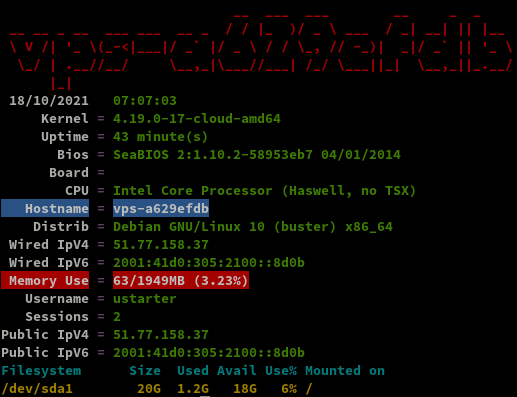

+++
title = 'OVH VPS Starter'
date = 2021-10-21 00:00:00 +0100
categories = vps
+++
  
Localisation du datacenter : Gravelines (France)  
  

## Debian 10

{:width="100"} 

vps-a629efdb.vps.ovh.net  
IPv4 : 51.77.158.37   
IPv6 : 2001:41d0:305:2100::8d0b  
Connexion SSH utilisateur **debian** 

    ssh debian@51.77.158.37

Passer en mode su

    sudo -s
    passwd root # modifier mot de passe root

---

### Adressage IPV6

en mode su

[Méthode OVH](https://docs.ovh.com/fr/vps/configurer-ipv6/)  
Configuration des fichiers interfaces  
*La méthode la plus souvent préconisée est de créer un fichier de configuration dans le répertoire /etc/network/interfaces.d/  
Cela permet de séparer la configuration IPv6 et de rétablir facilement les modifications en cas d’erreur.* 

    nano /etc/network/interfaces.d/51-cloud-init-ipv6.cfg

```
iface eth0 inet6 static
 address 2001:41d0:305:2100::8d0b
 netmask 128
 post-up /sbin/ip -6 route add 2001:41d0:305:2100::1 dev eth0
 post-up /sbin/ip -6 route add default via 2001:41d0:305:2100::1 dev eth0
 pre-down /sbin/ip -6 route del default via 2001:41d0:305:2100::1 dev eth0
 pre-down /sbin/ip -6 route del 2001:41d0:305:2100::1 dev eth0

```

Redémarrer le service réseau 

    systemctl restart networking

Vérification

    ip a

```
1: lo: <LOOPBACK,UP,LOWER_UP> mtu 65536 qdisc noqueue state UNKNOWN group default qlen 1000
    link/loopback 00:00:00:00:00:00 brd 00:00:00:00:00:00
    inet 127.0.0.1/8 scope host lo
       valid_lft forever preferred_lft forever
    inet6 ::1/128 scope host 
       valid_lft forever preferred_lft forever
2: eth0: <BROADCAST,MULTICAST,UP,LOWER_UP> mtu 1500 qdisc pfifo_fast state UP group default qlen 1000
    link/ether fa:16:3e:53:eb:05 brd ff:ff:ff:ff:ff:ff
    inet 51.77.158.37/32 brd 51.77.158.37 scope global dynamic eth0
       valid_lft 86395sec preferred_lft 86395sec
    inet6 2001:41d0:305:2100::8d0b/128 scope global 
       valid_lft forever preferred_lft forever
    inet6 fe80::f816:3eff:fe53:eb05/64 scope link 
       valid_lft forever preferred_lft forever
```

### Hostname Motd

Hostname

    hostnamectl

```
   Static hostname: vps-a629efdb
         Icon name: computer-vm
           Chassis: vm
        Machine ID: fb56aa8772094c6c8bf3009e24231e2d
           Boot ID: ffc24431d53841ee94f23d52cddea86e
    Virtualization: kvm
  Operating System: Debian GNU/Linux 10 (buster)
            Kernel: Linux 4.19.0-17-cloud-amd64
      Architecture: x86-64
```

    rm /etc/motd && nano /etc/motd

```bash
   ___ __     __ _   _                                                         
  / _ \\ \   / /| | | |                                                        
 | | | |\ \ / / | |_| |                                                        
 | |_| | \ V /  |  _  |                                                        
  \___/   \_/   |_| |_|             __   ____    ___          __      _  _     
 __   __ _ __   ___          __ _  / /_ |___ \  / _ \   ___  / _|  __| || |__  
 \ \ / /| '_ \ / __| _____  / _` || '_ \  __) || (_) | / _ \| |_  / _` || '_ \ 
  \ V / | |_) |\__ \|_____|| (_| || (_) |/ __/  \__, ||  __/|  _|| (_| || |_) |
   \_/  | .__/ |___/        \__,_| \___/|_____|   /_/  \___||_|   \__,_||_.__/ 
        |_|                                                                    
  ____   _    _____  _____  _  ____    ___     _____ _____                     
 | ___| / |  |___  ||___  |/ || ___|  ( _ )   |___ /|___  |                    
 |___ \ | |     / /    / / | ||___ \  / _ \     |_ \   / /                     
  ___) || | _  / /    / /_ | | ___) || (_) |_  ___) | / /                      
 |____/ |_|(_)/_/    /_/(_)|_||____/  \___/(_)|____/ /_/ 
```

### Utilisateur

en mode sudo, modifier le fichier de configuration sshd_config pour autoriser la connexion en root

    sudo -s
    echo "PermitRootLogin yes" >> /etc/ssh/sshd_config
    systemctl restart sshd 
    ssh root@51.77.158.37

**Modifier utilisateur**  
Linux fournit un outil nommé `usermod` spécifiquement pour faire des modifications aux comptes d'utilisateurs. Dans ce cas, nous l'utilisons pour renommer un compte utilisateur, ce qui est fait en utilisant le drapeau `-l`.

    /usr/sbin/usermod -l debian ustarter

L'indicateur `-l` ne changera que le nom de l'utilisateur. Toutes les autres choses attachées à l'utilisateur ne seront pas affectées, comme le répertoire personnel et l'UID.
{: .prompt-warning }

**Changer le répertoire d'origine**  
Pour modifier le répertoire d'origine de l'utilisateur, nous utilisons à nouveau la commande `usermod`. Cependant, cette fois, nous devons effectuer deux actions : changer le répertoire personnel en un nouveau chemin et déplacer le contenu de l'ancien chemin vers le nouveau.

Nous définissons le chemin du nouveau répertoire personnel en utilisant l'option `-d` ou `--home` avec le chemin du nouveau répertoire. Nous devons également utiliser l'option `-m` pour copier le contenu de l'ancien répertoire personnel dans le nouveau.

    /usr/sbin/usermod -d /home/ustarter -m debian 

**Renommer le groupe d'un utilisateur**  
Chaque utilisateur sur un système Linux est créé avec un groupe du même nom. Lorsque nous changeons le nom d'un utilisateur, le nom de son groupe reste inchangé. C'est une bonne idée de changer également le nom du groupe primaire de l'utilisateur.

Pour changer le nom du groupe primaire d'un utilisateur, nous utilisons la commande `groupmod` avec l'option `-n`. Nous devons fournir l'ancien nom et un nouveau nom.

    /usr/sbin/groupmod -n debian ustarter

**En une ligne de commande**  
Pour changer l'utilisateur 'debian' en 'ustarter'.

    groupadd ustarter; usermod -d /home/ustarter -m -g ustarter -l ustarter debian

Cela change le nom, le groupe, le répertoire d'origine et la propriété et le groupe de ce répertoire pour les nouveaux, ainsi que tous les fichiers. Vous vous retrouvez avec un utilisateur qu'il est impossible de distinguer de celui qui a été créé à l'origine sous le nom de "ustarter".

### Ajout utilisateur groupe sudo

Mot de passe **ustarter**  

    passwd ustarter

Visudo pour les accès root via utilisateur **ustarter**  

```bash
apt install sudo  
echo "ustarter     ALL=(ALL) NOPASSWD: ALL" >> /etc/sudoers
```

Déconnexion puis connexion ssh en mode utilisateur  

    ssh ustarter@51.77.158.37

### OpenSSH, clé et script

{:width="70"}  
**connexion avec clé**  
<u>sur l'ordinateur de bureau</u>
Générer une paire de clé curve25519-sha256 (ECDH avec Curve25519 et SHA2) pour une liaison SSH avec le serveur.  

    ssh-keygen -t ed25519 -o -a 100 -f ~/.ssh/ovh-vps-a629efdb

Envoyer les clés publiques sur le serveur KVM   

    ssh-copy-id -i ~/.ssh/ovh-vps-a629efdb.pub ustarter@51.77.158.37

<u>sur le serveur KVM</u>
On se connecte  

    ssh ustarter@51.77.158.37

Modifier la configuration serveur SSH  

    sudo nano /etc/ssh/sshd_config

Modifier

```conf
Port = 55037
PermitRootLogin no
PasswordAuthentication no
```

Relancer openSSH  

    sudo systemctl restart sshd

Accès depuis le poste distant avec la clé privée  

    ssh ustarter@51.77.158.37 -p 55037 -i ~/.ssh/ovh-vps-a629efdb  

### Fail2Ban

*Fail2ban est un framework de prévention contre les intrusions dont le but est de bloquer les adresses IP inconnues qui tentent de pénétrer dans votre système. Ce logiciel est recommandé, même essentiel, pour se prémunir contre toute attaque brutale contre vos services.*

Pour installer le package logiciel, utilisez la commande suivante :

    sudo apt install fail2ban

Une fois le paquet installé, il faut modifier le fichier de configuration de ce dernier pour l’adapter à votre usage. Avant toute modification, il est recommandé d’effectuer une sauvegarde du fichier de configuration en tapant la commande suivante :

    sudo cp /etc/fail2ban/jail.conf /etc/fail2ban/jail.conf.backup

Apportez ensuite vos modifications sur le fichier :

    sudo nano /etc/fail2ban/jail.conf

```
[sshd]

# To use more aggressive sshd modes set filter parameter "mode" in jail.local:
# normal (default), ddos, extra or aggressive (combines all).
# See "tests/files/logs/sshd" or "filter.d/sshd.conf" for usage example and details.
#mode   = normal
port    = 55037
logpath = %(sshd_log)s
backend = %(sshd_backend)s
```

Une fois ces modifications terminées, redémarrez le service à l’aide de la commande suivante :

    sudo systemctl restart fail2ban 

Pour toute demande complémentaire concernant Fail2Ban, n’hésitez pas à consulter la [documentation officielle de cet outil](https://www.fail2ban.org/wiki/index.php/Main_Page) 

### Outils et Script ssh_rc_bash

Outils

    sudo apt install rsync curl tmux jq figlet git dnsutils -y
 
>**ATTENTION!!! Les scripts sur connexion peuvent poser des problèmes pour des appels externes autres que ssh**

    wget https://static.xoyaz.xyz/files/ssh_rc_bash
    chmod +x ssh_rc_bash # rendre le bash exécutable
    ./ssh_rc_bash        # exécution



