+++
title = 'OpenMPTCProuter – Comment agréger (mutualiser) les connexions ADSL, 4G, etc...'
date = 2021-11-01 00:00:00 +0100
categories = ['virtuel']
+++
*Augmenter le débit en fusionnant plusieurs connexions (ADSL, 4G/5G, Fibre, etc...). La fusion des débits est réalisée avec [OpenMPTCProuter](https://www.openmptcprouter.com/) et si un lien tombe le deuxième prend le relais, ainsi on diminue les pertes de connexion internet.  
Outil OpenMPTCProuter utilise la technologie du VPN BONDING et du MultiPath et il est possible de fusionner jusqu'à 8 connexions (qu'elles soient Fibre, Adsl , Vdsl , 3g , 4g , 5G ...)*

* [Comment agréger vos connexions ADSL et 4G ?](https://www.tutos-informatique.com/adsl-4g-agregation/)
* [OpenMPTCProuter – Comment Agréger vos connexions](https://mondedie.fr/d/10791-openmptcprouter-comment-agreger-vos-connexions)
* [KVM/QEMU Installer un serveur debian virtuel (debsrv) sur un poste archlinux](/posts/Installer_serveur_debian_virtuel_QEMU_KVM-sur-poste-archlinux/)
* https://www.youtube.com/watch?v=-LhxArzUVXg
* [QEMU KVM - Convertir un disque dur virtuel VMDK au format QCOW2](https://www.adminmalin.fr/qemu-kvm-convertir-hdd-vmdk-qcow2/)
* [KVM converting virtual disks from raw img files to qcow2](https://www.aptgetlife.co.uk/kvm-converting-virtual-disks-from-raw-img-files-to-qcow2/)
* [Create A KVM Virtual Machine Using Qcow2 Image In Linux](https://ostechnix.com/create-a-kvm-virtual-machine-using-qcow2-image-in-linux/)
* [KVM: Creating a guest VM on a NAT network](https://fabianlee.org/2019/05/26/kvm-creating-a-guest-vm-on-a-nat-network/)

## Pré-requis nécessaires

* Un client dans l'habitation (pc, raspberry 3b+, Banana Pi BPI-R2, Virtualisation)
* Un VPS (Ikoula, firstheberg, ovh …)

Il faut laisser la box principale gérer la distribution des adresses.

Dans ce cas de figure vous devez fixer vous même l'adresse IP des appareils qui bénéficierons de l'aggregation de liens.  

Il faut que vos réseaux soient sur un adressage différent.

Exemple :

    ADSL en 192.168.0.X (votre box est 192.168.0.254)
    Routeur 4G en 192.168.X.X (votre routeur 4G est 192.168.106.17)

Dans mon cas j’ai choisi de laisser le DHCP sur ma FreeBox ainsi elle distribue le réseau sans agrégation. Si un PC doit avoir un boost de débit, il me suffit de configurer la carte réseau sur le réseau du OPENMPTCPROUTER.
{: .prompt-info }

## OpenMptcpRouter virtuel

### Qemu/KVM réseau NAT

Nous allons maintenant passer aux réseaux NAT qui permettent à l'invité KVM d'atteindre l'extérieur du réseau, mais les hôtes de l'extérieur ne peuvent pas atteindre l'invité directement.  Cela ouvre l'espace réseau disponible et permet d'isoler les applications, et pourrait également offrir un niveau de sécurité si un pare-feu était introduit.

Assurez-vous que le transfert d'IP est activé

Avant d'aller plus loin, assurez-vous que le transfert d'IP est activé sur l'hôte.

```
# Cette valeur doit être "1".
cat /proc/sys/net/ipv4/ip_forward
```

Si elle n'est pas activée, il faut la définir à la volée en utilisant :

    sudo sysctl -w net.ipv4.ip_forward=1

>Note : si systemd est installé le fichier /etc/sysctl.conf n'existe plus et est remplacé par un dossier sysctl.d où mettre les *.conf nécessaires. On doit y créer un fichier (ex: /etc/sysctl.d/99-sysctl.conf). Dans ce cas, pour que la commande "sysctl -p" fonctionne il faut indiquer le fichier, par ex sysctl -p /etc/sysctl.d/fichier.conf. Ou avoir créé un lien symbolique /etc/sysctl.conf vers /etc/sysctl.d/99-sysctl.conf

    sudo nano /etc/sysctl.d/99-sysctl.conf  # activation au démarrage
    
           net.ipv4.ip_forward = 1

**Créer un réseau NAT libvirt**

Vérifiez d'abord les réseaux actuellement définis et reconnus par libvirt.  Utilisez la commande suivante :

    virsh net-list --all

```
 Nom           État      Démarrage automatique   Persistent
-------------------------------------------------------------
 default       inactif   no                      Oui
 host-bridge   actif     Oui                     Oui
```

    virsh net-dumpxml host-bridge

```xml
<network>
  <name>host-bridge</name>
  <uuid>2738c462-22cc-4171-9abd-3090cdc4d336</uuid>
  <forward mode='bridge'/>
  <bridge name='br0'/>
</network>
```

Pour créer un nouveau réseau NAT, créez un fichier xml "nat223.xml".  Utilisez le réseau physique ou le nom du pont connecté au réseau physique pour l'attribut "dev" de l'élément `<forward>` (br0)

```
cat <<EOF > natmptcp.xml
<network>
  <name>natmptcp</name>
  <forward mode='nat' dev='br0'/>
  <bridge name='virbr1' stp='on' delay='2'/>
  <mac address='52:54:00:2b:8b:5f'/>
  <ip address='192.168.100.254' netmask='255.255.255.0'>
    <dhcp>
      <range start='192.168.100.1' end='192.168.100.253'/>
    </dhcp>
  </ip>
</network>
EOF
```

Si vous ne définissez pas l'attribut "dev" sur le périphérique ou le pont du réseau physique, vous obtiendrez un comportement inattendu car il pourra prendre des raccourcis et transmettre le trafic directement d'un réseau KVM à un autre en utilisant les interfaces internes.  En utilisant l'interface physique ou le pont connecté à l'interface physique, le trafic sera redirigé par le niveau de réseau le plus externe sur l'hôte et assurer que les règles iptables sont appliquées correctement.

Créez ensuite le réseau en utilisant ces commandes :

```bash
# create libvirt NAT network (net-create is for transient)
virsh net-define natmptcp.xml   # Réseau natmptcp défini depuis natmptcp.xml
virsh net-start natmptcp       # Réseau natmptcp démarré
virsh net-autostart natmptcp   # Réseau natmptcp marqué en démarrage automatique
```

L'état du NAT doit être actif, autostart, et persistant.

    virsh net-list --all

```
 Nom           État      Démarrage automatique   Persistent
-------------------------------------------------------------
 default       inactif   no                      Oui
 host-bridge   actif     Oui                     Oui
 natmptcp      actif     Oui                     Oui
```


### Importer image Qcow2 avec Virt-manager

Choisir une image x86_64 lien https://www.openmptcprouter.com/download  

    wget https://download.openmptcprouter.com/release/v0.58.5/x86_64/targets/x86/64/openmptcprouter-v0.58.5-r0+16336-b36068d35d-x86-64-generic-ext4-combined.vmdk

Convertir l'image vmdk en qcow2

    qemu-img convert -f vmdk -O qcow2 openmptcprouter-v0.58.5-r0+16336-b36068d35d-x86-64-generic-ext4-combined.vmdk /home/yann/virtuel/KVM/mptcp-x86-64-generic.qcow2

Virt-manager est une application à interface utilisateur graphique utilisée pour créer et gérer des machines virtuelles via libvirt.

Naviguer vers Fichier -> Nouvelle machine virtuelle    
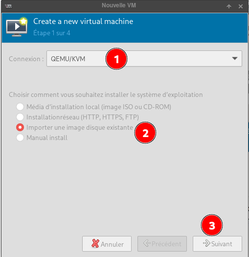{:width="400"}  
Virt-manager aura une option "Importer une image disque existante" dans la première fenêtre lors de la création d'une nouvelle machine virtuelle.  
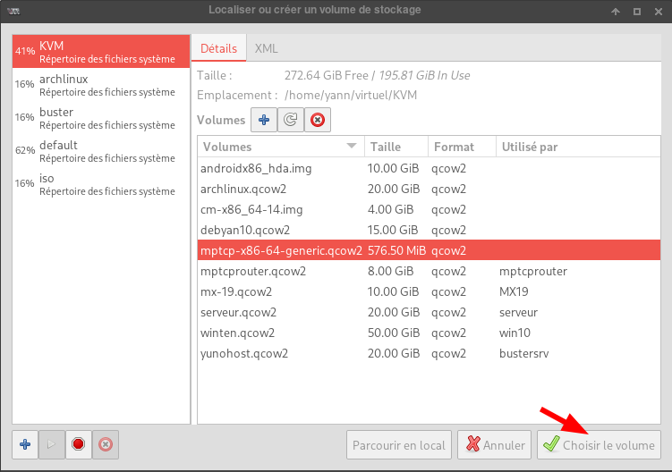{:width="500"}  
Choisissez-la et cliquez sur le bouton "Choisir le volume".

{:width="500"}  
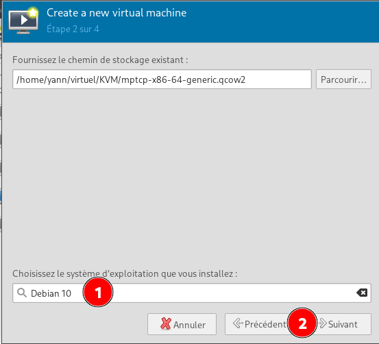{:width="400"}  
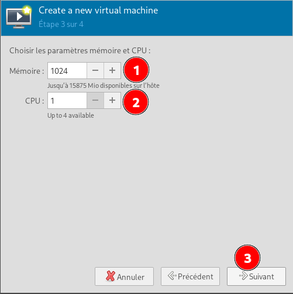{:width="400"}  
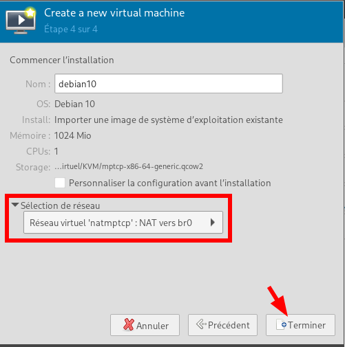{:width="400"}  

A la fin du boot taper touche "Entrée" et log "root" (pas de mot de passe)  
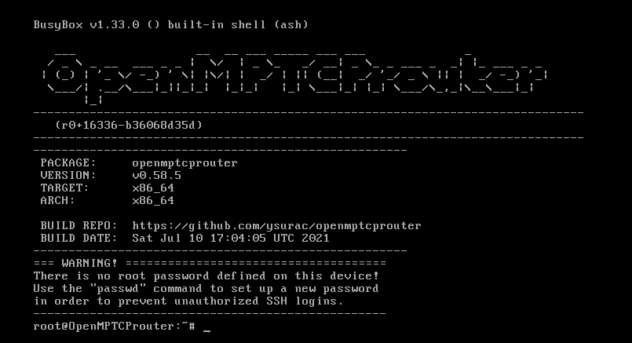  
Créer mot de passe root : ytreu  

La solution virtuelle pose des problèmes
{: .prompt-warning }

## OpenMptcpRouter VPS

  
Localisation du datacenter : Gravelines (France)  

{:width="100"} 

vps-a629efdb.vps.ovh.net  
IPv4 : 51.77.158.37   
IPv6 : 2001:41d0:305:2100::8d0b  
Connexion SSH utilisateur **debian** 

    ssh debian@51.77.158.37

Passer en mode su

    sudo -s

**Installation OpenMptcpRouter**

    wget -O - https://www.openmptcprouter.com/server/debian10-x86_64.sh | sh

A la fin  de l'installation

    reboot

>**Attention le port SSH change et devient 65222 au redémarrage**

Connexion ssh port 65222

    51.77.158.37

Vous avez des clés (MPLVPN, GloryStun, VPS) qui vous sont affichés il est important de les copier-coller quelque part :).

Au cas ou elles seront stockés ici sur votre VPS : root/openmptcprouter_config.txt

Pour accéder au fichier dans votre shell faire :

    cd ..
    cd /root/
    cat openmptcprouter_config.txt

Accès SSH par clé publique ajoutée au fichier `/home/debian/.ssh/authorized_keys`  
Configuration `/etc/ssh/sshd_config` &rarr; `PasswordAuthentication No`  
Relancer serveur ssh : `sudo systemctl restart sshd`  

Le fichier `/etc/motd`

```
   ___                       __  __  ____  _____  ____  ____                      _              
  / _ \  _ __    ___  _ __  |  \/  ||  _ \|_   _|/ ___||  _ \  _ __  ___   _   _ | |_  ___  _ __ 
 | | | || '_ \  / _ \| '_ \ | |\/| || |_) | | | | |    | |_) || '__|/ _ \ | | | || __|/ _ \| '__|
 | |_| || |_) ||  __/| | | || |  | ||  __/  | | | |___ |  __/ | |  | (_) || |_| || |_|  __/| |   
  \___/ | .__/  \___||_| |_||_|  |_||_|     |_|  \____||_|    |_|   \___/  \__,_| \__|\___||_|   
        |_|     __     __ ____   ____     ___     _   ___  ____    __                            
                \ \   / /|  _ \ / ___|   / _ \   / | / _ \|___ \  / /_                           
                 \ \ / / | |_) |\___ \  | | | |  | || | | | __) || '_ \                          
                  \ V /  |  __/  ___) | | |_| |_ | || |_| |/ __/ | (_) |                         
                   \_/   |_|    |____/   \___/(_)|_| \___/|_____| \___/                          
```

## OpenMptcpRouter Raspberry PI

**Raspberry PI 3 Model B**  
{:width="300px"}

* Processeur Quad Core Broadcom 2837 ARMv8 64bit
* Vitesse du processeur : 1,2 GHz
* 1 GB RAM
* BCM43143 WiFi intégré
* Bluetooth Low Energy (BLE) intégré
* 40 broches d'extension GPIO
* 4 ports USB2
* Sortie vidéo et stéréo
* Port caméra CSI pour connecter la caméra Raspberry Pi
* Port d'affichage DSI pour connecter l'écran tactile Raspberry Pi
* Lecteur de carte Micro SD pour charger votre système d'exploitation et stocker vos données
* Source d'alimentation Micro USB, supporte maintenant jusqu'à 2,5A

Sur un ordinateur , connecté une SDcard via un interface USB et relever son identification par dmesg

Identifier le périphérique SDcard après insertion

    dmesg

```
[16890.577559] sd 5:0:0:0: [sdd] Attached SCSI removable disk
```

La sdcard est attachée à /dev/sdd

Télécharger l'image sur le site  <https://www.openmptcprouter.com/download>, puis décompresser  
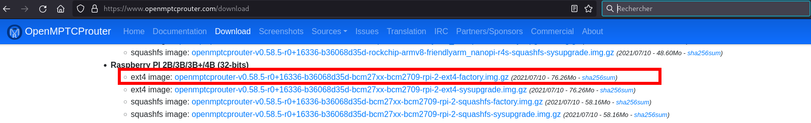{:width="600"}  

    wget https://download.openmptcprouter.com/release/v0.58.5/rpi2/targets/bcm27xx/bcm2709/openmptcprouter-v0.58.5-r0+16336-b36068d35d-bcm27xx-bcm2709-rpi-2-ext4-factory.img.gz
    gunzip openmptcprouter-v0.58.5-r0+16336-b36068d35d-bcm27xx-bcm2709-rpi-2-ext4-factory.img.gz

Flasher l'image sur la sdcard

    dd if=openmptcprouter-v0.58.5-r0+16336-b36068d35d-bcm27xx-bcm2709-rpi-2-ext4-factory.img of=/dev/sdd

Ensuite insérer la carte SD dans le logement prévu sur le RPI, connecter le cordon réseau et la liaison série puis brancher la micro-usb d'alimentation  sur la carte raspberry et enfin le DC-Pack sur le secteur.

**Pour une connexion par terminal avec adatateur USB/Série**   
Branchements adatateur USB/Série

|Interface USB/Série|Raspberry|
| ----------------- | ------- |
| GND | 6 (GND)|
| Rxd | 8 (Txd) |
| Txd | 10 (Rxd) |

lancer le logiciel de communication ( **minicom** ou **screen**)  

    sudo minicom # Débit/Parité/Bits:115200 8N1,Contrôle de flux matériel:Non,Contrôle de flux logiciel:Non  
	sudo screen /dev/ttyUSB0 115200

Il faut mettre votre PC dans le même réseau que le routeur OpenMptcpRouter si vous avez désactiver le DHCP de votre Box (le réseau est le 192.168.100.X et le routeur est en 192.168.100.1)
{: .prompt-info }

### Configuration du routeur OpenMptcpRouter

Passons maintenant à la configuration. I

Dans votre navigateur saisir l'adresse 192.168.100.1

La page d'accueil s'affiche il n'y a pas de mot de passe. Je vous recommande d'en définir un par mesure de sécurité.
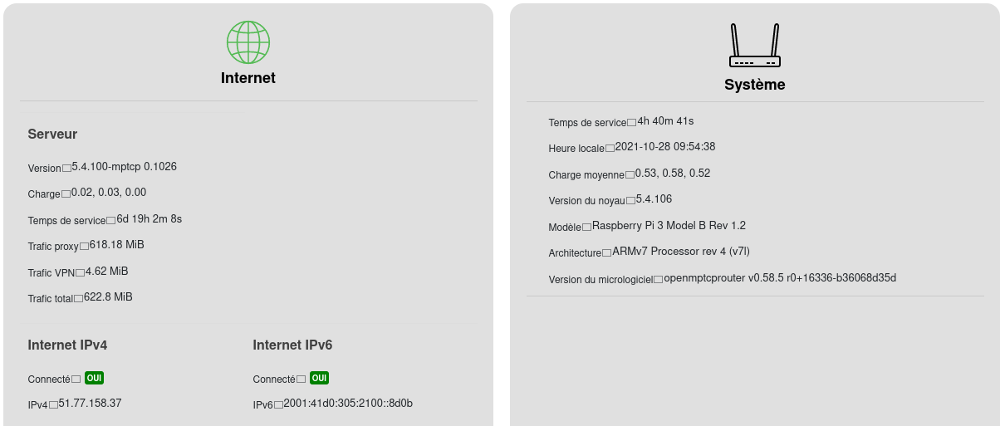{:width="700"}  
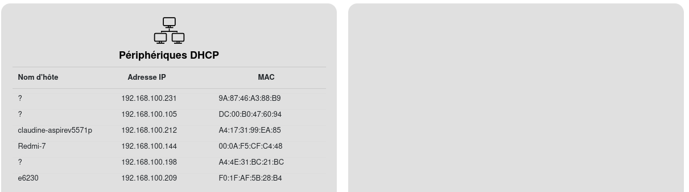{:width="700"}  


Il faut se rendre dans le menu Système > OpenMPTCProuter  

**VPS**  
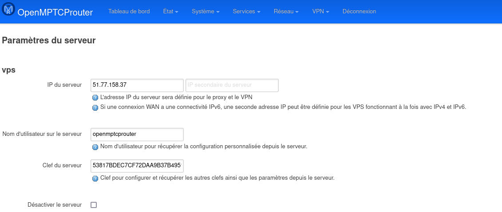{:width="600"}  
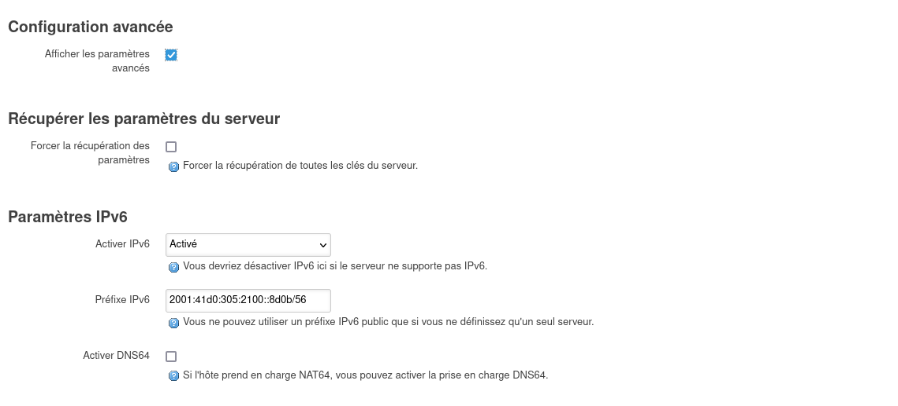{:width="600"}  
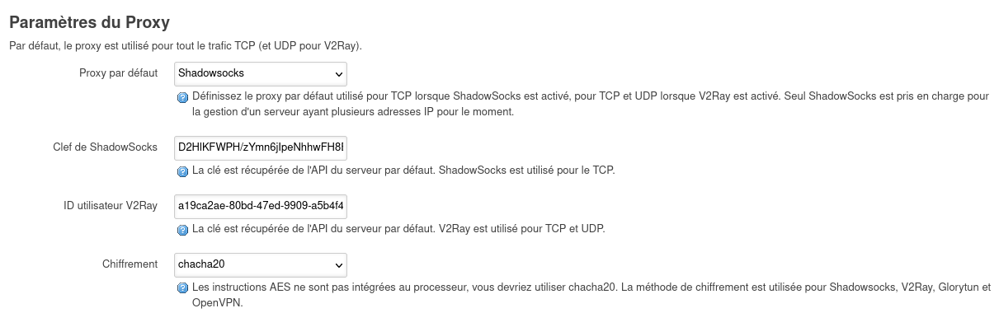{:width="600"}  
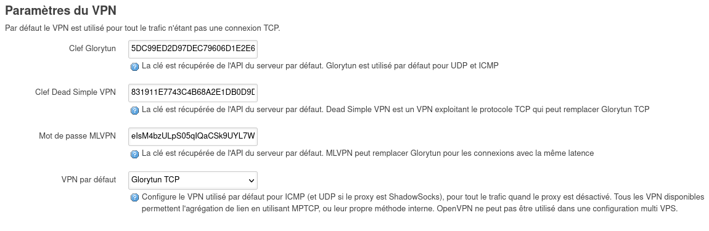{:width="600"}  
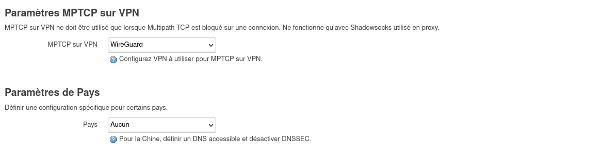{:width="600"}  

**Lan**  
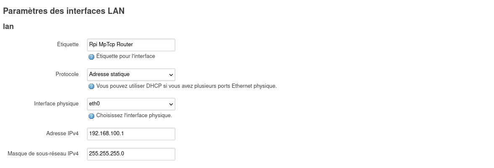{:width="600"}  

**Interfaces**  
{:width="600"}  

#### Etat du routeur

{:width="600"}  
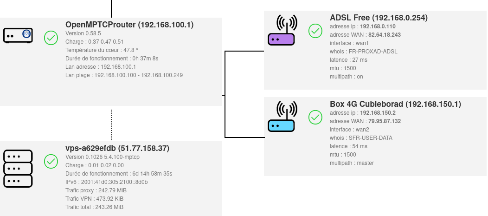{:width="600"}  
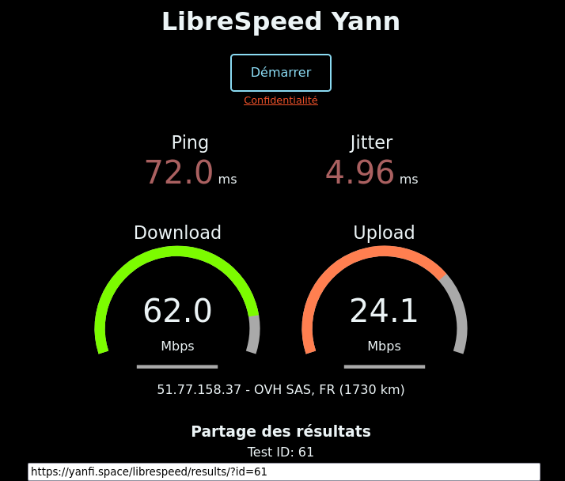{:width="600"}  

### Sauvegarde

Système &rarr; Sauvegarde  
Cliquer sur "Construire l'archive" pour télécharger une archive tar des fichiers de la configuration actuelle.

Enregister `backup-OpenMPTCProuter-2021-10-28.tar.gz` sous `Private` 

### Désactiver DHCP

Dans le cas où l'on veut garder le  DHCP de la box  

Désactivation DHCP sur OpenMptcpRouter : 

1. Allez dans Réseau > DHCP et DNS puis décocher la case Autoritaire.  
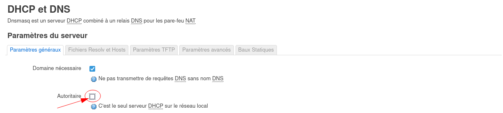{:width="600"}   
Puis "Enregistrer et Appliquer"
2. Ensuite on doit désactiver le DHCP dans l'interface LAN0 (dans Réseau > Interfaces , LAN -> Editer).  
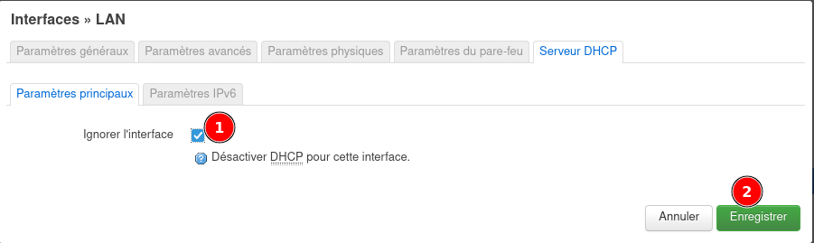{:width="600"}  

## Périphérique connecté

```
[yann@e6230 ~]$ ip route
default via 192.168.100.1 dev eno1 proto dhcp metric 100 
192.168.100.0/24 dev eno1 proto kernel scope link src 192.168.100.209 metric 100 
[yann@e6230 ~]$ cat /etc/resolv.conf
# Generated by NetworkManager
nameserver fd0f:ee:b0::1
nameserver 2001:41d0:305:2100::1
nameserver fdc3:a4cc:f380::1

[yann@e6230 ~]$ ip a show eno1
2: eno1: <BROADCAST,MULTICAST,UP,LOWER_UP> mtu 1500 qdisc fq_codel state UP group default qlen 1000
    link/ether f0:1f:af:5b:28:b4 brd ff:ff:ff:ff:ff:ff
    altname enp0s25
    inet 192.168.100.209/24 brd 192.168.100.255 scope global dynamic noprefixroute eno1
       valid_lft 41091sec preferred_lft 41091sec
    inet6 2001:41d0:305:2100::d89/128 scope global dynamic noprefixroute 
       valid_lft 41093sec preferred_lft 41093sec
    inet6 fdc3:a4cc:f380:0:55bf:393a:f14f:b05b/64 scope global noprefixroute 
       valid_lft forever preferred_lft forever
    inet6 2001:41d0:305:2100:f34f:1519:dc5f:3d6f/64 scope global noprefixroute 
       valid_lft forever preferred_lft forever
    inet6 2a01:e0a:2de:2c70:a256:529:deda:8043/64 scope global dynamic noprefixroute 
       valid_lft 86170sec preferred_lft 86170sec
    inet6 fe80::c1e4:fcc:cf3d:a4a/64 scope link noprefixroute 
       valid_lft forever preferred_lft forever

```


