+++
title = 'HostMyServers, server85393 Debian 10 (HDD 250Go) - hms.xoyaz.xyz'
date = 2021-11-15 00:00:00 +0100
categories = vps
+++
{:width="80"}  
<https://www.hostmyservers.fr/>  
[Accès client](https://www.hostmyservers.fr/user)

## KVM Debian Buster

{:width="100"}

Virtualization Type 	(KVM)  
CPU 2  
Memory 	4 GB  
Disk Space 	250 Go  
Operating System 	Debian 10 Buster (64-bit)  
IPv4 Address 45.145.166.51  
IPv6 Address 2a04:ecc0:8:a8:4567:833:0:1  

### Connexion root

    ssh root@45.145.166.51

Changement mot de passe

    passwd root

Mise à jour

    apt update && apt upgrade

Installer utilitaires  

    apt install rsync curl tmux jq figlet git mailutils dnsutils p7zip-full -y

### Hostname


    hostnamectl

```
   Static hostname: server85393
         Icon name: computer-vm
           Chassis: vm
        Machine ID: a7f055c469ef4bb3be932070c99c7cd7
           Boot ID: 57351a6ba7824484993707cafec46eea
    Virtualization: kvm
  Operating System: Debian GNU/Linux 10 (buster)
            Kernel: Linux 4.19.0-12-cloud-amd64
      Architecture: x86-64
```

### Adresse IPV4 IPV6

Le paramétrage réseau par défaut

    /etc/network/interfaces.d/50-cloud-init 

```
# This file is generated from information provided by the datasource.  Changes
# to it will not persist across an instance reboot.  To disable cloud-init's
# network configuration capabilities, write a file
# /etc/cloud/cloud.cfg.d/99-disable-network-config.cfg with the following:
# network: {config: disabled}
auto lo
iface lo inet loopback
    dns-nameservers 8.8.8.8

auto eth0
iface eth0 inet static
    address 45.145.166.51/24
    gateway 45.145.166.1

# control-alias eth0
iface eth0 inet6 static
    address 2a04:ecc0:8:a8:4567:0833::1/64
    gateway 2a04:ecc0:8:a8::1
```

### Création utilisateur

Utilisateur **userhms**  

    useradd -m -d /home/userhms/ -s /bin/bash userhms

Mot de passe **userhms**  

    passwd userhms

Visudo pour les accès root via utilisateur **userhms**  

```bash
apt install sudo  
echo "userhms     ALL=(ALL) NOPASSWD: ALL" >> /etc/sudoers
```

Déconnexion puis connexion ssh en mode utilisateur  

    ssh userhms@45.145.166.51

### OpenSSH, clé et script

{:width="70"}  
**connexion avec clé**  
<u>sur l'ordinateur de bureau</u>
Générer une paire de clé curve25519-sha256 (ECDH avec Curve25519 et SHA2) pour une liaison SSH avec le serveur.  

    ssh-keygen -t ed25519 -o -a 100 -f ~/.ssh/hms-sto-250

Envoyer les clés publiques sur le serveur KVM   

    ssh-copy-id -i ~/.ssh/hms-sto-250.pub userhms@45.145.166.51

<u>sur le serveur KVM</u>
On se connecte  

    ssh userhms@45.145.166.51

Modifier la configuration serveur SSH  

    sudo nano /etc/ssh/sshd_config

Modifier

```conf
Port = 55051
PermitRootLogin no
PasswordAuthentication no
```


<u>session SSH ne se termine pas correctement lors d'un "reboot" à distance</u>  
Si vous tentez de **redémarrer/éteindre** une machine distance par **ssh**, vous pourriez constater que votre session ne se termine pas correctement, vous laissant avec un terminal inactif jusqu'à l'expiration d'un long délai d'inactivité. Il existe un bogue 751636 à ce sujet. Pour l'instant, la solution de contournement à ce problème est d'installer :  

    sudo apt-get install libpam-systemd

cela terminera la session ssh avant que le réseau ne tombe.  
Veuillez noter qu'il est nécessaire que PAM soit activé dans sshd.  

Relancer openSSH  

    sudo systemctl restart sshd

Accès depuis le poste distant avec la clé privée  

    ssh userhms@45.145.166.51 -p 55051 -i ~/.ssh/hms-sto-250  

### Fail2Ban

*Fail2ban est un framework de prévention contre les intrusions dont le but est de bloquer les adresses IP inconnues qui tentent de pénétrer dans votre système. Ce logiciel est recommandé, même essentiel, pour se prémunir contre toute attaque brutale contre vos services.*

Pour installer le package logiciel, utilisez la commande suivante :

    sudo apt install fail2ban

Une fois le paquet installé, il faut modifier le fichier de configuration de ce dernier pour l’adapter à votre usage. Avant toute modification, il est recommandé d’effectuer une sauvegarde du fichier de configuration en tapant la commande suivante :

    sudo cp /etc/fail2ban/jail.conf /etc/fail2ban/jail.conf.backup

Apportez ensuite vos modifications sur le fichier :

    sudo nano /etc/fail2ban/jail.conf

Une fois ces modifications terminées, redémarrez le service à l’aide de la commande suivante :

    sudo systemctl restart fail2ban 

Pour toute demande complémentaire concernant Fail2Ban, n’hésitez pas à consulter la [documentation officielle de cet outil](https://www.fail2ban.org/wiki/index.php/Main_Page) 

### Outils, scripts motd et ssh_rc_bash

Motd

    sudo rm /etc/motd && sudo nano /etc/motd

```
                                     ___  ____  _____  ___  _____ 
  ___   ___  _ __ __   __ ___  _ __ ( _ )| ___||___ / / _ \|___ / 
 / __| / _ \| '__|\ \ / // _ \| '__|/ _ \|___ \  |_ \| (_) | |_ \ 
 \__ \|  __/| |    \ V /|  __/| |  | (_) |___) |___) |\__, |___) |
 |___/_\___||_|     \_/  \___||_|   \___/|____/|____/   /_/|____/ 
 |_____| ____     _  _  _   ____     _   __     __      ____   _  
 | || | | ___|   / || || | | ___|   / | / /_   / /_    | ___| / | 
 | || |_|___ \   | || || |_|___ \   | || '_ \ | '_ \   |___ \ | | 
 |__   _|___) |_ | ||__   _|___) |_ | || (_) || (_) |_  ___) || | 
    |_| |____/(_)|_|   |_| |____/(_)|_| \___/  \___/(_)|____/ |_| 
```

Script **ssh_rc_bash**  
>**ATTENTION!!! Les scripts sur connexion peuvent poser des problèmes pour des appels externes autres que ssh**

    wget https://static.xoyaz.xyz/files/ssh_rc_bash
    chmod +x ssh_rc_bash # rendre le bash exécutable
    ./ssh_rc_bash        # exécution

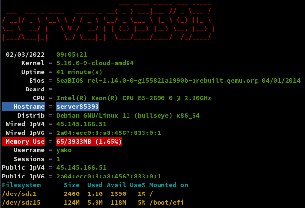

### Parefeu UFW

{:width="50"} 

*UFW, ou pare - feu simple , est une interface pour gérer les règles de pare-feu dans Arch Linux, Debian ou Ubuntu. UFW est utilisé via la ligne de commande (bien qu'il dispose d'interfaces graphiques disponibles), et vise à rendre la configuration du pare-feu facile.*

Installation **Debian / Ubuntu**

    sudo apt-get install ufw

*Par défaut, les jeux de règles d'UFW sont vides, de sorte qu'il n'applique aucune règle de pare-feu, même lorsque le démon est en cours d'exécution.*   

Les règles 

    sudo ufw allow 55051/tcp  # port SSH
    sudo ufw allow http       # port 80
    sudo ufw allow https      # port 443
    sudo ufw allow DNS        # port 53

Activer le parefeu

    sudo ufw enable

```
Command may disrupt existing ssh connections. Proceed with operation (y|n)? y
Firewall is active and enabled on system startup
```

Status

     sudo ufw status verbose

```
Status: active
Logging: on (low)
Default: deny (incoming), allow (outgoing), disabled (routed)
New profiles: skip

To                         Action      From
--                         ------      ----
80/tcp                     ALLOW       Anywhere                  
443/tcp                    ALLOW       Anywhere                  
DNS                        ALLOW       Anywhere                  
55051/tcp                  ALLOW       Anywhere                  
80/tcp (v6)                ALLOW       Anywhere (v6)             
443/tcp (v6)               ALLOW       Anywhere (v6)             
DNS (v6)                   ALLOW       Anywhere (v6)             
55051/tcp (v6)             ALLOW       Anywhere (v6)             
```

### Domaine hms.xoyaz.xyz (cloud ebook et zic)

{:width="50"}  
OVH configuration domaine xoyaz.xyz

```
$TTL 3600
@	IN SOA dns106.ovh.net. tech.ovh.net. (2021111506 86400 3600 3600000 300)
             IN NS     ns106.ovh.net.
             IN NS     dns106.ovh.net.
cloud        IN A      45.145.166.51
cloud        IN AAAA   2a04:ecc0:8:a8:4567:0833::1
ebook        IN A      45.145.166.51
ebook        IN AAAA   2a04:ecc0:8:a8:4567:0833::1
hms          IN A      45.145.166.51
hms          IN AAAA   2a04:ecc0:8:a8:4567:0833::1
zic          IN A      45.145.166.51
zic          IN AAAA   2a04:ecc0:8:a8:4567:0833::1
```

## Certificats Let's Encrypt

{:width="80"}

Installation gestionnaire des certificats Let's Encrypt

```
cd ~
sudo apt install socat # prérequis
git clone https://github.com/acmesh-official/acme.sh.git
cd acme.sh
./acme.sh --install 
```

Les clés OVH API   
Génération des certificats  

    acme.sh --dns dns_ovh --server letsencrypt --issue --keylength ec-384 -d 'hms.xoyaz.xyz' -d 'cloud.xoyaz.xyz' -d 'ebook.xoyaz.xyz' -d 'zic.xoyaz.xyz'

Résultat de l'installation

```
[Thu 30 Sep 2021 12:43:31 PM CEST] Your cert is in: /home/userhms//.acme.sh/hms.xoyaz.xyz_ecc/hms.xoyaz.xyz.cer
[Thu 30 Sep 2021 12:43:31 PM CEST] Your cert key is in: /home/userhms//.acme.sh/hms.xoyaz.xyz_ecc/hms.xoyaz.xyz.key
[Thu 30 Sep 2021 12:43:31 PM CEST] The intermediate CA cert is in: /home/userhms//.acme.sh/hms.xoyaz.xyz_ecc/ca.cer
[Thu 30 Sep 2021 12:43:31 PM CEST] And the full chain certs is there: /home/userhms//.acme.sh/hms.xoyaz.xyz_ecc/fullchain.cer
```

Installation des certificats

```
sudo mkdir -p /etc/ssl/private/
sudo chown $USER -R /etc/ssl/private/
acme.sh --ecc --install-cert -d 'xoyaz.xyz' -d '*.xoyaz.xyz' --key-file /etc/ssl/private/xoyaz.xyz-key.pem --fullchain-file /etc/ssl/private/xoyaz.xyz-fullchain.pem  --reloadcmd 'sudo systemctl reload nginx.service'
```

Supprimer ` --reloadcmd 'sudo systemctl reload nginx.service'` à la ligne précédente si Nginx n'est pas installé
{: .prompt-warning }

Editer le crontab

    crontab -e

```
56 0 * * * "/home/userhms/.acme.sh"/acme.sh --cron --home "/home/userhms/.acme.sh" --renew-hook "/home/userhms/.acme.sh/acme.sh --ecc --install-cert -d 'xoyaz.xyz' -d '*.xoyaz.xyz' --key-file /etc/ssl/private/xoyaz.xyz-key.pem --fullchain-file /etc/ssl/private/xoyaz.xyz-fullchain.pem  --reloadcmd 'sudo systemctl reload nginx.service'" > /dev/null
```

Nginx est installé
{: .prompt-warning }

## hms.xoyaz.xyz

### Nginx Light

{:width="50"}  


Installation

    sudo apt install nginx-light

modifier le fichier `/etc/nginx/nginx.conf`  

On autorise tls1.2 et tls1.3 uniquement et ciphers off 

```
[...]
	ssl_protocols TLSv1.2 TLSv1.3;
	ssl_prefer_server_ciphers off;
[...]
```

Accès dossier pour les fichiers de configuration

```
[...]
        ##
        # Virtual Host Configs
        ##

        include /etc/nginx/conf.d/*.conf;
        # include /etc/nginx/sites-enabled/*;
[...]
```

### PHP8

{:width="50"}  

Ajout du dépôt sury.org

    sudo -s

Pour installer la version de 8 de php, ajouter le dépôt sury.

```bash
apt install -y lsb-release apt-transport-https ca-certificates wget
wget -O /etc/apt/trusted.gpg.d/php.gpg https://packages.sury.org/php/apt.gpg
echo "deb https://packages.sury.org/php/ $(lsb_release -sc) main" |tee /etc/apt/sources.list.d/php.list
```

Installer php8.0

Mise à jour des dépôts :

    apt update

Installation de php8.0 et/ou php8.0-fpm
paquet php8.0 :

    apt install php8.0 php8.0-fpm php8.0-sqlite3 php8.0-gd

### hms.xoyaz.xyz.conf

Créer le fichier `/etc/nginx/conf.d/hms.xoyaz.xyz.conf` 

```
server {
    listen 80;
    listen [::]:80;
    server_name hms.xoyaz.xyz;
    return 301 https://$host$request_uri;
}
server {
    listen 443 ssl http2;
    listen [::]:443 ssl http2;
    server_name hms.xoyaz.xyz;
    ssl_certificate /etc/ssl/private/xoyaz.xyz-fullchain.pem;
    ssl_certificate_key /etc/ssl/private/xoyaz.xyz-key.pem;

    root /var/www/;
    index index/ index.php;

    # TLS 1.3 only
    ssl_protocols TLSv1.3;
    ssl_prefer_server_ciphers off;
 
    # HSTS (ngx_http_headers_module is required) (63072000 seconds)
    add_header Strict-Transport-Security "max-age=63072000" always;
 
    # OCSP stapling
    ssl_stapling on;
    ssl_stapling_verify on;
 
    # verify chain of trust of OCSP response using Root CA and Intermediate certs
    ssl_trusted_certificate /etc/ssl/private/xoyaz.xyz-fullchain.pem;

    # fichiers de configuration
    include /etc/nginx/conf.d/hms.xoyaz.xyz.d/*.conf;

    location ~ \.php$ {
        include snippets/fastcgi-php.conf;
        fastcgi_pass unix:/run/php/php8.0-fpm.sock;
    }
 
    # replace with the IP address of your resolver
    resolver 8.8.8.8;

}
```

Créer le sous-dossier

    sudo mkdir /etc/nginx/conf.d/hms.xoyaz.xyz.d/

Vérifier

    sudo nginx -t

```
nginx: the configuration file /etc/nginx/nginx.conf syntax is ok
nginx: configuration file /etc/nginx/nginx.conf test is successful
```

Recharger nginx

    sudo systemctl reload nginx

Pour tester le php

    echo "<?php phpinfo(); ?>" | sudo tee /var/www//info.php

https://hms.xoyaz.xyz/info.php


### Page d'accueil 

Déposer une image dans le dossier `/var/www/`  
Créer un fichier `/var/www//index/`  

```hmtl
<!DOCTYPE/>
/>
<head>
 <meta charset="UTF-8"> 
 <title>hms.xoyaz.xyz</title>
<style type="text/css" media="screen" >
html { 
  margin:0;
  padding:0;
  background: url(wallpaper.jpg) no-repeat center fixed; 
  -webkit-background-size: cover; /* pour anciens Chrome et Safari */
  background-size: cover; /* version standardisée */
}
body { color: white; }
a:link {
  color: grey;
  background-color: transparent;
  text-decoration: none;
}

a {
  text-decoration: underline;
  background-color: transparent;
  color: #a00;
}
a:visited {
  color: #844;
}
a:hover, a:focus, a:active {
  text-decoration: none;
  color: white;
  background: #800;
}


</style>

</head>
<body>

<h1>Serveur hms.xoyaz.xyz</h1>


</body>
</>
```

Lien <https://hms.xoyaz.xyz>  
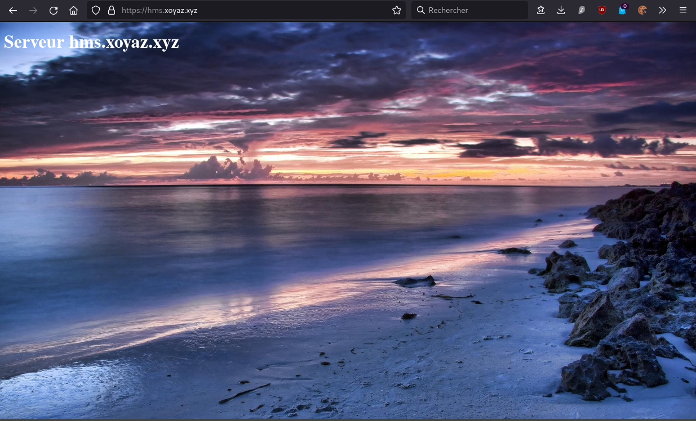{:width="500"}

## Rsync SSHFS Sauvegardes

### Synchro rsync

{:width="50"}  

Synchronisation entre xoyaz.xyz et hms.xoyaz.xyz   
Commande à exécuter sur hms.xoyaz.xyz  

    rsync -avz --progress --stats --human-readable --rsync-path="sudo rsync" -e "ssh -p 55036 -i /home/userhms/.ssh/OVZ-STORAGE-128 -o StrictHostKeyChecking=no -o UserKnownHostsFile=/dev/null" usernl@xoyaz.xyz:/home/usernl/backup/* /home/userhms/sshfs/

### Dossier accessible via sshfs

{:width="50"}  

*On va créer des dossiers qui seront accessibles via le réseau pour les clients SSHFS*

    mkdir ~/sshfs
    mkdir ~/sshfs/yanfi.space

NOTE: Pour que les clients accèdent au dossier , il faut leur fournir une clé privé SSH

**Opérations Coté client (yanfi.space)**  
Le but, créer un accès réseau sur un autre serveur pour les gros volumes de fichiers (musique, livres, etc...)     
Créer dossier local **/opt/hms-sshfs/** : `sudo mkdir -p /opt/hms-sshfs`
Créer une liaison réseau sécurisée SSHFS entre le client et le serveur : `sudo apt install sshfs`   
Autorisations  : `sudo -s; echo "user_allow_other" >> /etc/fuse.conf `  

**Partage avec serveur hms.xoyaz.xyz** : Clé privée **hms-sto-250**   
Droits : `chmod 600 /home/admin/.ssh/hms-sto-250`  

**Montage manuelle** pour authentifier la clé avec utilisateur "debian"

    sudo -s
    sshfs -o allow_other userhms@hms.xoyaz.xyz:/home/userhms/sshfs /opt/hms-sshfs -C -p 55051 -oIdentityFile=/home/admin/.ssh/hms-sto-250

>NOTE: Il faut mettre l'adresse IP du serveur , si les domaines peuvent ne pas être "résolus"

Après vérification , `ls /opt/hms-sshfs` , déconnexion `fusermount -u /opt/hms-sshfs`

**Montage auto**  
Ajouter la ligne suivante au fichier `/etc/fstab`

    userhms@hms.xoyaz.xyz:/home/userhms/sshfs /opt/hms-sshfs fuse.sshfs _netdev,identityfile=/home/admin/.ssh/hms-sto-250,allow_other,port=55051 0 0

### Sauvegardes

{:width="50"}  

**Opérations réalisées sur yanfi.space**

Sauvegarde complète de yunohost yanfi.space sur le serveur hms.xoyaz.xyz via sshfs  

    nano ~/backup-hms.xoyaz.xyz.sh

```bash
#!/bin/sh
# Créer une sauvegarde totale localement
yunohost backup create --debug
# Copier cette sauvegarde sur le distant hms.xoyaz.xyz
rsync -avz --progress --stats --human-readable --rsync-path="sudo rsync" -e "ssh -p 55051 -i /home/admin/.ssh/hms-sto-250 -o StrictHostKeyChecking=no -o UserKnownHostsFile=/dev/null" /home/yunohost.backup/archives/$(date '+%Y%m%d')* userhms@hms.xoyaz.xyz:/home/userhms/sshfs/yanfi.space/ ; \
 if [ $? -eq 0 ]; then \
 echo "Sauvegardes $(date '+%Y%m%d')* -> OK" | systemd-cat -t allsync -p info ; \
 rm /home/yunohost.backup/archives/$(date '+%Y%m%d')* ; \
 else \
 echo "Sauvegardes $(date '+%Y%m%d')* -> ERREUR" | systemd-cat -t allsync -p emerg ; \
 fi
```

Le rendre exécutable

    chmod +x ~/backup-hms.xoyaz.xyz.sh

Le résultat de la commande est dans le journal

    journalctl --no-pager -t allsync --since today

```
-- Logs begin at Wed 2021-09-15 11:48:08 CEST, end at Wed 2021-09-15 18:47:50 CEST. --
Sep 15 18:24:45 yanfi.space allsync[16720]: Sauvegardes 20210915* -> OK
```

Tâche

    sudo crontab -e

```
10 02 * * * /home/admin/backup-hms.xoyaz.xyz.sh > /dev/null
```

## Authentification double facteur 

{:width="50"}  

*Authentification double facteur (2FA) PHP TOTP*  
[PHP - Portail d'authentification web authentification à deux facteurs (2FA).](/posts/PHP_Authentification_2FA(Arno0x)/)

**TwoFactorAuth** utilise PHP et des bibliothèques 

*    php 8.0 pour nginx 
*    La bibliothèque GD 
*    La bibliothèque SQLite3 

Installation

    sudo apt install php8.0-fpm php8.0-gd php8.0-sqlite3
    git clone https://gitea.cinay.eu/yann/twofactorauth.git
    sudo mv twofactorauth /var/www//
    sudo chown www-data.www-data -R /var/www//twofactorauth

Modifier 'QRCODE_TITLE','SESSION_NAME' et 'AUTH_SUCCEED_REDIRECT_URL' dans le fichier de configuration `/var/www//twofactorauth/config.php`   


Ouvrir le lien https://hms.xoyaz.xyz/twofactorauth/index.php  

Créer l'administrateur "xoyaz", son mot de passe et scanner le Qr Code avec une application TOTP    
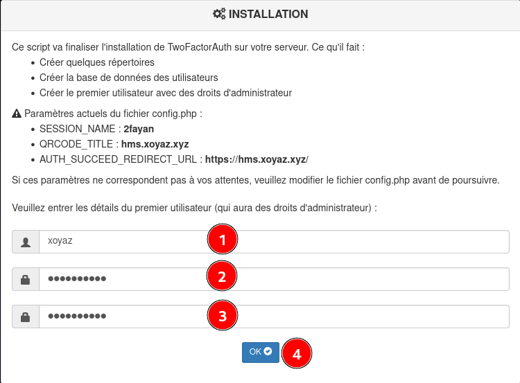{:width="400"}  
Scanner le Qr Code avec une application TOTP  
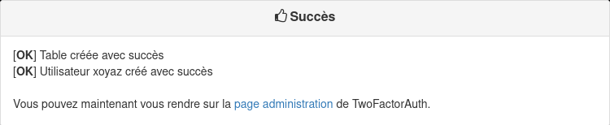{:width="400"}  
Administration : https://hms.xoyaz.xyz/twofactorauth/admin/admin.php

## Applications Web

### Python 

**[Debian Python version 3 par défaut](/posts/Debian-Python-3/)**  
Installer Pip Python 3 

    sudo apt update
    sudo apt install python3-venv python3-pip

Les versions

```
userhms@server85393:~$ python --version
Python 3.7.3
userhms@server85393:~$ pip --version
pip 18.1 from /usr/lib/python3/dist-packages/pip (python 3.7)
```

### Calibre ebook.xoyaz.xyz

Python et Pip version 3 sont installés  
Les outils

    sudo apt install sqlite3 python3-setuptools imagemagick
    pip install wheel

Installation

```
cd $HOME
git clone https://github.com/janeczku/calibre-web.git
cd calibre-web
# installation des prérequis
pip install --system --target vendor -r requirements.txt
cd ..
# déplacer vers /var/www
sudo mv calibre-web /var/www/
# les droits
sudo chown $USER.www-data -R /var/www/calibre-web/
```

Service systemd calibre-web pour le lancement automatique  

	sudo nano /etc/systemd/system/calibre-web.service

Contenu du fichier

```
[Unit]
Description=Service calibre-web
After=network.target

[Service]
Type=simple
User=userhms
ExecStart=/usr/bin/python /var/www/calibre-web/cps.py

[Install]
WantedBy=multi-user.target
```

>**ATTENTION!** , **User** est l'utilisateur connecté ($USER)

Lancer le service calibre-web :

	sudo systemctl start calibre-web

Vérifier:

	sudo systemctl status calibre-web

```
● calibre-web.service - Service calibre-web
   Loaded: loaded (/etc/systemd/system/calibre-web.service; disabled; vendor preset: enabled)
   Active: active (running) since Fri 2021-09-24 17:55:28 CEST; 7s ago
 Main PID: 19781 (python)
    Tasks: 2 (limit: 4718)
   Memory: 63.7M
   CGroup: /system.slice/calibre-web.service
           └─19781 /usr/bin/python /var/www/calibre-web/cps.py

Sep 24 17:55:28 server85393 systemd[1]: Started Service calibre-web.
```

Activation  

	sudo systemctl enable calibre-web

Le domaine "ebook.xoyaz.xyz" est activé avec les certificats let's encrypt  

Le fichier de configuration nginx `/etc/nginx/conf.d/ebook.xoyaz.xyz.conf`

```
server {
    listen 80;
    listen [::]:80;
    server_name ebook.xoyaz.xyz;
    return 301 https://$host$request_uri;
}
server {
    listen 443 ssl http2;
    listen [::]:443 ssl http2;
    server_name ebook.xoyaz.xyz;
    ssl_certificate /etc/ssl/private/xoyaz.xyz-fullchain.pem;
    ssl_certificate_key /etc/ssl/private/xoyaz.xyz-key.pem;

    root /var/www/;
    index index/ index.php;

    # TLS 1.3 only
    ssl_protocols TLSv1.3;
    ssl_prefer_server_ciphers off;
 
    # HSTS (ngx_http_headers_module is required) (63072000 seconds)
    add_header Strict-Transport-Security "max-age=63072000" always;
 
    # OCSP stapling
    ssl_stapling on;
    ssl_stapling_verify on;
 
    # verify chain of trust of OCSP response using Root CA and Intermediate certs
    ssl_trusted_certificate /etc/ssl/private/xoyaz.xyz-fullchain.pem;

    # replace with the IP address of your resolver
    resolver 8.8.8.8;

    location / { 
        proxy_pass              http://127.0.0.1:8083;
    } 

}
```

Vérifier  
`sudo nginx -t`  
Redémarrer nginx  
`sudo systemctl reload nginx`  

accès à la configuration <https://ebook.xoyaz.xyz/config>  
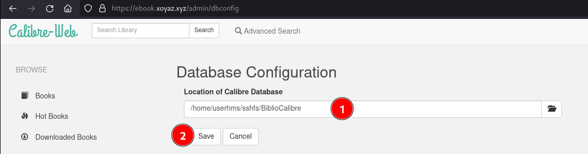{:width="500"}

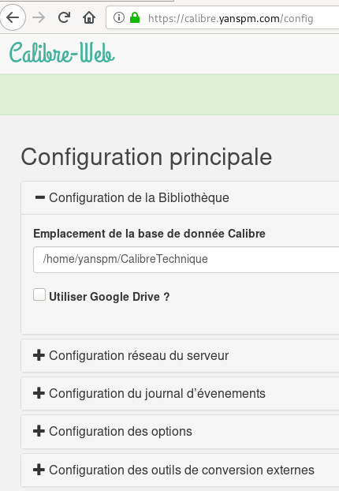{:height="300"}

puis cliquer sur **Connexion**  
Par défaut: *Nom d'utilisateur:* admin , *Mot de passe:* admin123 

Paramétrage , cliquer sur **Admin** (pas sur admin avec le a minuscule)

Cliquer sur **Add new user**  
Username : yannick  
Email address : yannick@yanfi.net  
Password : xxxxxx  
Kindle email:  
Language : français  
Show books with language : Show all  
Admin avec tous les droits  
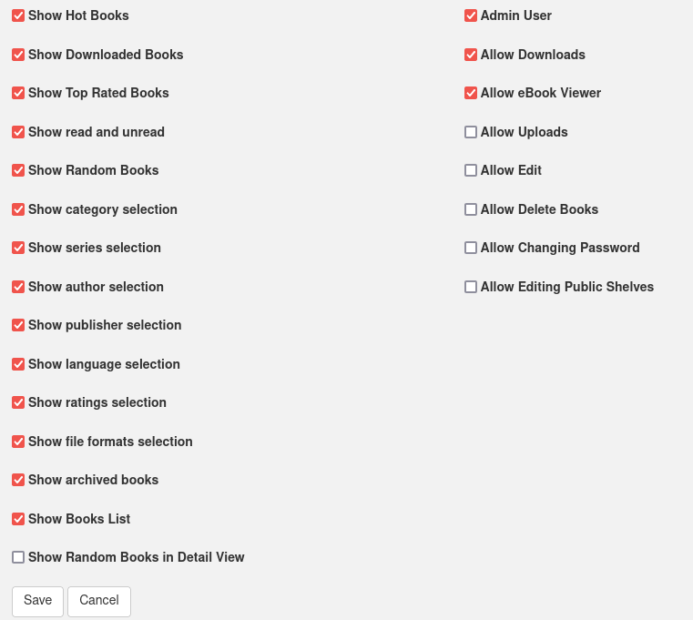{:width="400"}  
Et cliquer sur **Save**

Se reconnecter avec l'utilisateur *yannick*  
Cliquer sur *Administration* et sélectionner *admin* , cocher la case "Supprimer cet utilisateur"  
Il reste l'utilisateur/administrateur **yannick**  

Paramétrage  
Configuration de l’interface utilisateur &rarr; Configuration du mode d’affichage : Thème sombre

Réglages par défaut pour les nouveaux utilisateurs
Mode de visualisation par défaut pour les nouveaux utilisateurs


### Transmission

{:width="50"}  

*Transmission permet le téléchargement et la création de torrents. Ce logiciel supporte les technologies décentralisées sans tracker, tel que PEX, DHT et les liens magnets.*

Pour l'installation suivre ce lien :[Debian Transmission](/posts/debian-transmission-daemon/)  

Ajout utilisateur courant au groupe "debian-transmission"

    sudo usermod -a -G debian-transmission $USER

**Accès sécurisé sur le site hms.xoyaz.xyz/transmission avec login mot de passe et 2FA**

On supprime le fichier de configuration `~/.config/transmission-daemon/settings.json`

    sudo rm ~/.config/transmission-daemon/settings.json

Modification du fichier de configuration `/etc/transmission-daemon/settings.json`

    sudo systemctl stop transmission-daemon.service


Le fichier de configuration "transmission"

```json
{
    "alt-speed-down": 50,
    "alt-speed-enabled": false,
    "alt-speed-time-begin": 540,
    "alt-speed-time-day": 127,
    "alt-speed-time-enabled": false,
    "alt-speed-time-end": 1020,
    "alt-speed-up": 50,
    "bind-address-ipv4": "0.0.0.0",
    "bind-address-ipv6": "::",
    "blocklist-enabled": false,
    "blocklist-url": "http://www.example.com/blocklist",
    "cache-size-mb": 4,
    "dht-enabled": true,
    "download-dir": "/home/userhms/torrent/complet",
    "download-limit": 100,
    "download-limit-enabled": 0,
    "download-queue-enabled": true,
    "download-queue-size": 5,
    "encryption": 1,
    "idle-seeding-limit": 30,
    "idle-seeding-limit-enabled": false,
    "incomplete-dir": "/home/userhms/torrent/encours",
    "incomplete-dir-enabled": false,
    "lpd-enabled": false,
    "max-peers-global": 200,
    "message-level": 1,
    "peer-congestion-algorithm": "",
    "peer-id-ttl-hours": 6,
    "peer-limit-global": 200,
    "peer-limit-per-torrent": 50,
    "peer-port": 51413,
    "peer-port-random-high": 65535,
    "peer-port-random-low": 49152,
    "peer-port-random-on-start": false,
    "peer-socket-tos": "default",
    "pex-enabled": true,
    "port-forwarding-enabled": false,
    "preallocation": 1,
    "prefetch-enabled": true,
    "queue-stalled-enabled": true,
    "queue-stalled-minutes": 30,
    "ratio-limit": 2,
    "ratio-limit-enabled": false,
    "rename-partial-files": true,
    "rpc-authentication-required": false,
    "rpc-bind-address": "0.0.0.0",
    "rpc-enabled": true,
    "rpc-host-whitelist": "",
    "rpc-host-whitelist-enabled": false,
    "rpc-password": "{2f217a20225338209def1c9fa5587751c6a608d8Onz8WkP5",
    "rpc-port": 9091,
    "rpc-url": "/transmission/",
    "rpc-username": "yan",
    "rpc-whitelist": "127.0.0.1",
    "rpc-whitelist-enabled": false,
    "scrape-paused-torrents-enabled": true,
    "script-torrent-done-enabled": false,
    "script-torrent-done-filename": "",
    "seed-queue-enabled": false,
    "seed-queue-size": 10,
    "speed-limit-down": 100,
    "speed-limit-down-enabled": false,
    "speed-limit-up": 100,
    "speed-limit-up-enabled": false,
    "start-added-torrents": true,
    "trash-original-torrent-files": false,
    "umask": 7,
    "upload-limit": 100,
    "upload-limit-enabled": 0,
    "upload-slots-per-torrent": 14,
    "utp-enabled": true
}
```

Création des dossiers et des droits

    mkdir -p ~/torrent/{complet,encours}

Modifier le groupe du dossier completed (remplacer www-data par debian-transmission)

    sudo chown debian-transmission.debian-transmission -R ~/torrent

Ajoutez le nom d’utilisateur au groupe debian-transmission :

    sudo usermod -a -G debian-transmission $USER

Relancer transmission

    sudo systemctl start transmission-daemon


Le fichier de  configuration **/etc/nginx/conf.d/hms.xoyaz.xyz.conf**

```
server {
    listen 80;
    listen [::]:80;
    server_name hms.xoyaz.xyz;
    return 301 https://$host$request_uri;
}
server {
    listen 443 ssl http2;
    listen [::]:443 ssl http2;
    server_name hms.xoyaz.xyz;
    ssl_certificate /etc/ssl/private/xoyaz.xyz-fullchain.pem;
    ssl_certificate_key /etc/ssl/private/xoyaz.xyz-key.pem;

    root /var/www/;
    index index/ index.php;

    # TLS 1.3 only
    ssl_protocols TLSv1.3;
    ssl_prefer_server_ciphers off;
 
    # HSTS (ngx_http_headers_module is required) (63072000 seconds)
    add_header Strict-Transport-Security "max-age=63072000" always;
 
    # OCSP stapling
    ssl_stapling on;
    ssl_stapling_verify on;
 
    # verify chain of trust of OCSP response using Root CA and Intermediate certs
    ssl_trusted_certificate /etc/ssl/private/xoyaz.xyz-fullchain.pem;

    # fichiers de configuration
    include /etc/nginx/conf.d/hms.xoyaz.xyz.d/*.conf;

    location ~ \.php$ {
        include snippets/fastcgi-php.conf;
        fastcgi_pass unix:/run/php/php8.0-fpm.sock;
    }
 
    # replace with the IP address of your resolver
    resolver 8.8.8.8;

	location = /twofactorauth/login/login.php {
	  allow all;
     auth_request off;
     fastcgi_split_path_info ^(.+\.php)(/.+)$;
     fastcgi_pass unix:/run/php/php8.0-fpm.sock;   # PHP8.0
     fastcgi_index index.php;
     include fastcgi_params;
     fastcgi_param SCRIPT_FILENAME $document_root$fastcgi_script_name;
	}

	location = /twofactorauth/nginx/auth.php {
     fastcgi_split_path_info ^(.+\.php)(/.+)$;
     fastcgi_pass unix:/run/php/php8.0-fpm.sock;   # PHP8.0
     fastcgi_index index.php;
     include fastcgi_params;
     fastcgi_param SCRIPT_FILENAME $document_root$fastcgi_script_name;
     fastcgi_param  CONTENT_LENGTH "";
	}

	location /twofactorauth/ {
		index index.php;
	}


	location /twofactorauth/db/ {
	    deny all;
	}

    location /transmission {
	  proxy_pass http://127.0.0.1:9091;
	  auth_request /twofactorauth/nginx/auth.php;
	  error_page 401 =401 $scheme://$host/twofactorauth/login/login.php?from=$uri;
	  proxy_buffering off;
    }	

}
```

recharger nginx

    sudo nginx -t
    sudo systemctl reload nginx

Lien <https://hms.xoyaz.xyz/transmission>  
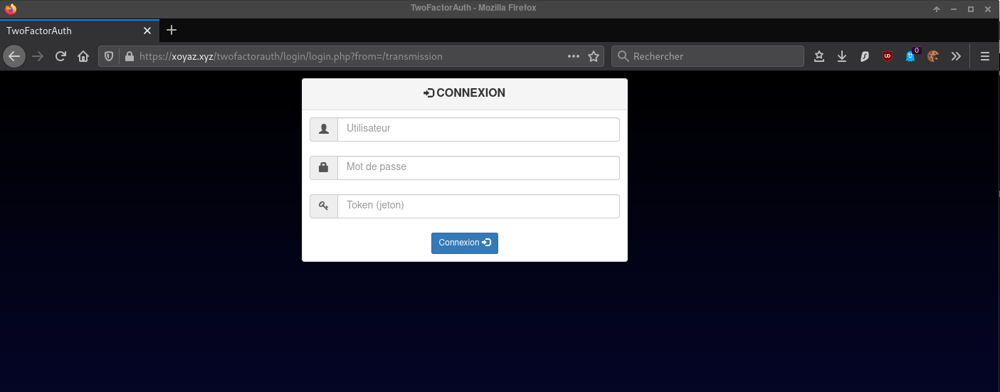{:width="500"}  
saisir utilisateur, mot de passe et le jeton OTP correspondant  

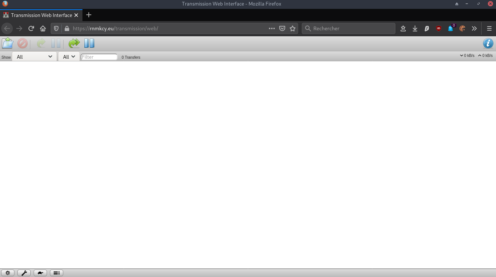{:width="500"}

Pour avoir le lien sur la page d'accueil, ajouter ce qui suite avant la balise `</body>` du fichier `/var/www//index/`

``/
<p><a href="/transmission">Transmission</a>
<em> permet le téléchargement et la création de torrents.<br>Ce logiciel supporte les technologies décentralisées sans tracker, tel que PEX, DHT et les liens magnets.</em>
</p>
```

### Nextcloud

  
[Nextcloud 22 Nginx, PHP8.0, MariaDB et SSL/TLS cloud.xoyaz.xyz](/posts/Nextcloud22_Nginx_PHP8-FPM_MariaDB_SSL-TLS/)

Lien https://cloud.xoyaz.xyz   

[Authentification à deux facteurs](/posts/Nextcloud22_Nginx_PHP8-FPM_MariaDB_SSL-TLS/#authentification-%C3%A0-deux-facteurs)  
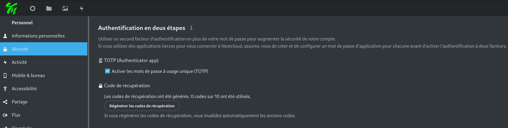{:width="600"}  

Un thème sombre basé sur **Breeze Dark**    
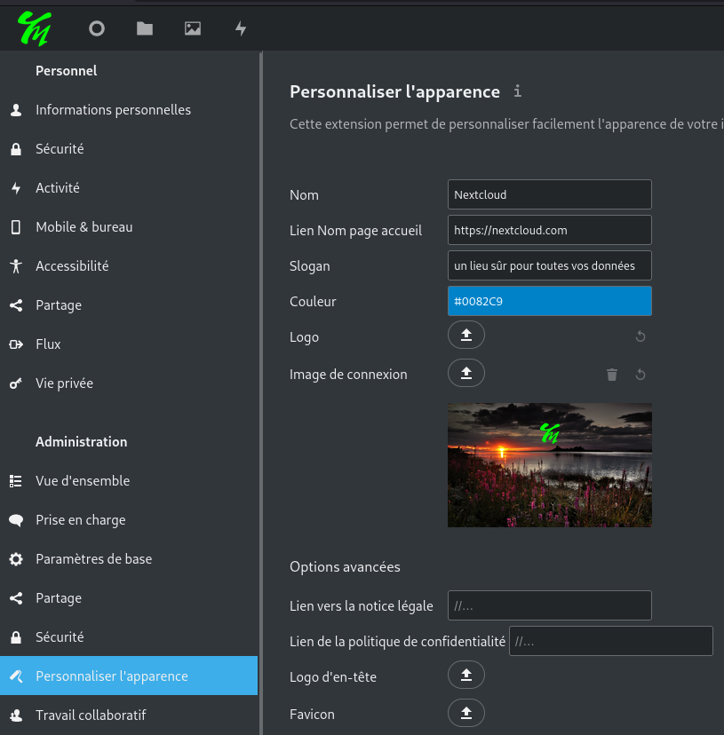{:width="500"}  
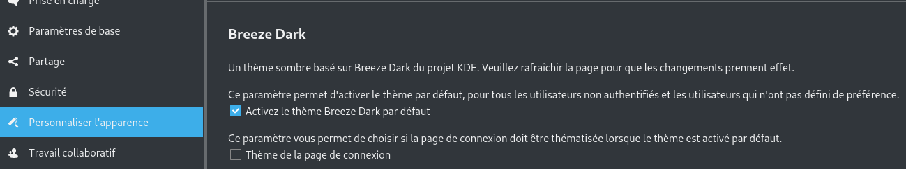{:width="600"}  

Messagerie  
{:width="500"}  
Lancer le test  
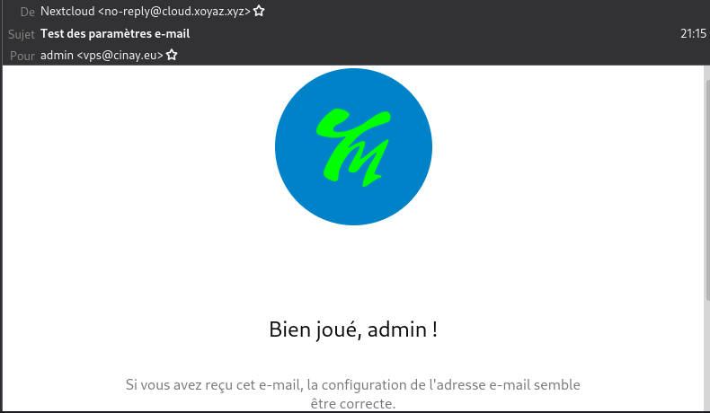{:width="500"}  

Stockage externe (paramétrage en admin)  
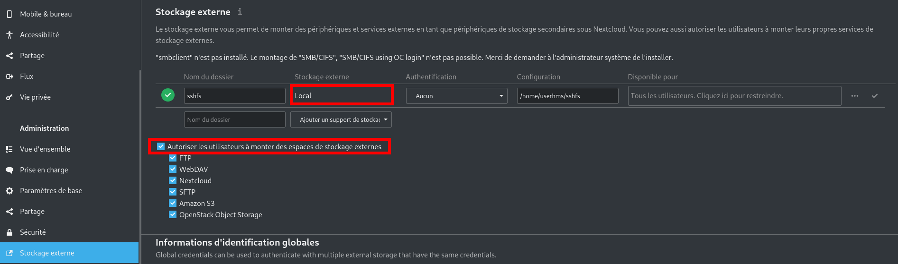{:width="600"}  

Applications

* Notes

### NetData (NON INSTALLE)

<https://github.com/netdata/netdata>

#### Installation

Pour installer Netdata à partir des sources sur la plupart des systèmes Linux (physiques, virtuels, conteneurs, IoT, périphérie), exécutez notre script d'installation en une ligne. Ce script télécharge et construit toutes les dépendances, y compris celles requises pour se connecter à Netdata Cloud si vous le souhaitez, et active les mises à jour nocturnes automatiques et les statistiques anonymes.

    sudo -s
    bash <(curl -Ss https://my-netdata.io/kickstart.sh)

Patienter ...

```
 --- We are done! --- 

  ^
  |.-.   .-.   .-.   .-.   .-.   .  netdata                          .-.   .-
  |   '-'   '-'   '-'   '-'   '-'   is installed and running now!  -'   '-'  
  +----+-----+-----+-----+-----+-----+-----+-----+-----+-----+-----+-----+--->

  enjoy real-time performance and health monitoring...

 OK  
```

Pour afficher le tableau de bord Netdata  
Ouvrir un terminal sur le client linux qui dispose des clés ssh et lancer la commande

    ssh -L 9000:localhost:19999 userhms@45.145.166.51 -p 55051 -i /home/yann/.ssh/hms-sto-250

Ouvrir un navigateur sur le même client et saisir localhost:9000 
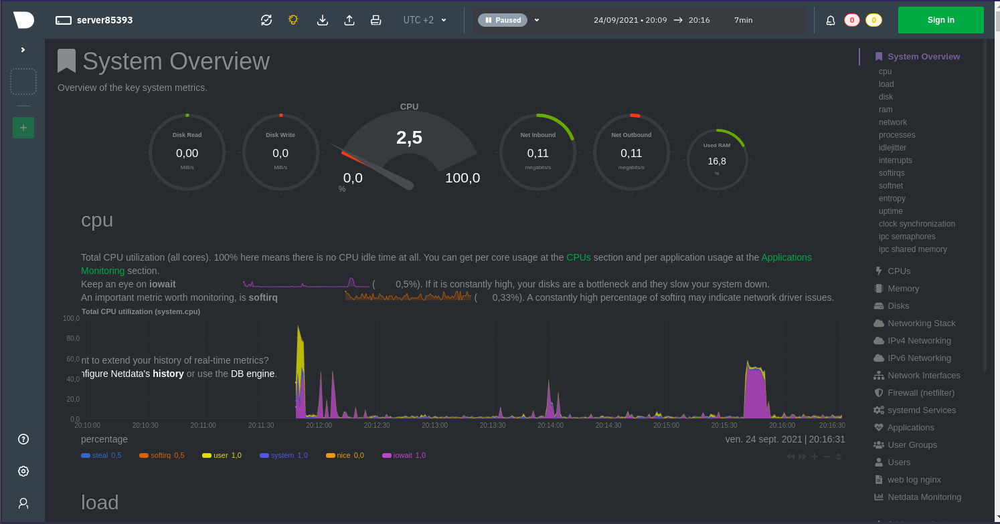{:width="600"}   

#### Désinstallation

```
sudo -s
wget https://raw.githubusercontent.com/netdata/netdata/master/packaging/installer/netdata-uninstaller.sh
chmod +x ./netdata-uninstaller.sh
./netdata-uninstaller.sh --yes --env /etc/netdata/.environment
```

### Audio Navidrome

[Steps to install on Ubuntu Linux (and other Debian based distros)](https://www.navidrome.org/docs/installation/linux/)

Les étapes suivantes ont été testées sur Ubuntu 18.04 et devraient fonctionner sur toutes les versions 16.04 et supérieures ainsi que sur les autres distros basées sur Debian. Tout au long de ces instructions, les commandes auront des espaces réservés pour l'utilisateur (`<user>`) et le groupe (`<group>`) sous lesquels vous souhaitez exécuter Navidrome et le chemin du dossier de musique (`<library_path>`). Si vous utilisez une médiathèque existante, assurez-vous que l'utilisateur a les droits sur la médiathèque.

**Conditions préalables à la mise à jour et à l'installation**  
Assurez-vous que votre système est à jour et installez ffmpeg.

    sudo apt update && sudo apt upgrade
    sudo apt install ffmpeg

Par défaut, la commande useradd ne crée pas de répertoires de base, mais pour un démon, je vous recommande d'utiliser l'option système et de remplacer le shell par un shell inexistant afin que personne ne puisse se connecter à ce compte (sous ssh par exemple):

    sudo useradd -r -s /bin/false navidrome

**Créer une structure de répertoire**  
Créez un répertoire pour stocker l'exécutable Navidrome et un répertoire de travail avec les permissions appropriées.

    sudo install -d -o navidrome -g navidrome /opt/navidrome
    sudo install -d -o navidrome -g navidrome /var/lib/navidrome

**Obtenir Navidrome**  
Téléchargez la dernière version depuis la [page des versions](https://github.com/navidrome/navidrome/releases), extrayez le contenu dans le répertoire exécutable et définissez les autorisations pour les fichiers. (Remplacez l'URL ci-dessous par celle de la page des versions) :

    wget https://github.com/navidrome/navidrome/releases/download/v0.45.1/navidrome_0.45.1_Linux_arm64.tar.gz -O Navidrome.tar.gz
    sudo tar -xvzf Navidrome.tar.gz -C /opt/navidrome/
    sudo chown -R navidrome:navidrome /opt/navidrome

**Créer le fichier de configuration**  

Dans le répertoire de travail, `/var/lib/navidrome` créer un nouveau fichier nommé `navidrome.toml` avec les paramètres suivants.

    MusicFolder = "/home/userhms/sshfs/musique"

Pour d'autres options de configuration, voir la page des [options de configuration](https://www.navidrome.org/docs/usage/configuration-options/).

**Créer une unité Systemd**  
Créez un nouveau fichier sous `/etc/systemd/system/` nommé `navidrome.service` avec les données suivantes.

    /etc/systemd/system/navidrome.service

```
[Unit]
Description=Navidrome Music Server and Streamer compatible with Subsonic/Airsonic
After=remote-fs.target network.target
AssertPathExists=/var/lib/navidrome

[Install]
WantedBy=multi-user.target

[Service]
User=navidrome
Group=navidrome
Type=simple
ExecStart=/opt/navidrome/navidrome --configfile "/var/lib/navidrome/navidrome.toml"
WorkingDirectory=/var/lib/navidrome
TimeoutStopSec=20
KillMode=process
Restart=on-failure

# See https://www.freedesktop.org/software/systemd/man/systemd.exec/
DevicePolicy=closed
NoNewPrivileges=yes
PrivateTmp=yes
PrivateUsers=yes
ProtectControlGroups=yes
ProtectKernelModules=yes
ProtectKernelTunables=yes
RestrictAddressFamilies=AF_UNIX AF_INET AF_INET6
RestrictNamespaces=yes
RestrictRealtime=yes
SystemCallFilter=~@clock @debug @module @mount @obsolete @reboot @setuid @swap
ReadWritePaths=/var/lib/navidrome

# You can uncomment the following line if you're not using the jukebox This
# will prevent navidrome from accessing any real (physical) devices
#PrivateDevices=yes

# You can change the following line to `strict` instead of `full` if you don't
# want navidrome to be able to write anything on your filesystem outside of
# /var/lib/navidrome.
ProtectSystem=full

# You can uncomment the following line if you don't have any media in /home/*.
# This will prevent navidrome from ever reading/writing anything there.
#ProtectHome=true

# You can customize some Navidrome config options by setting environment variables here. Ex:
#Environment=ND_BASEURL="/navidrome"
```

**Démarrez le service Navidrome**  
Rechargez le démon de service, démarrez le service nouvellement créé, et vérifiez qu'il a démarré correctement.

    sudo systemctl daemon-reload
    sudo systemctl start navidrome.service
    sudo systemctl status navidrome.service

Si le service a démarré correctement, vérifiez que vous pouvez accéder à http://localhost:4533.  
Ouvrir un terminal sur le client linux qui dispose des clés ssh et lancer la commande

    ssh -L 9500:localhost:4533 userhms@45.145.166.51 -p 55051 -i /home/yann/.ssh/hms-sto-250

Ouvrir un navigateur sur le client et saisir [localhost:9500](URL) pour afficher le serveur audio  
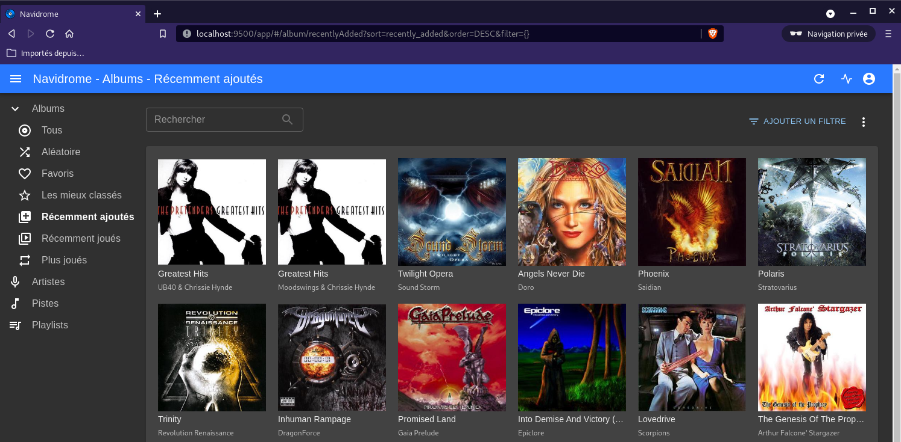{:width="400"}

Démarrez Navidrome au démarrage

    sudo systemctl enable navidrome.service

**Proxy nginx zic.xoyaz.xyz**  
Le domaine “zic.xoyaz.xyz” est activé avec les certificats let’s encrypt

Le fichier de configuration nginx `/etc/nginx/conf.d/zic.xoyaz.xyz.conf`


```
server {
    listen 80;
    listen [::]:80;
    server_name zic.xoyaz.xyz;
    return 301 https://$host$request_uri;
}
server {
    listen 443 ssl http2;
    listen [::]:443 ssl http2;
    server_name zic.xoyaz.xyz;
    ssl_certificate /etc/ssl/private/xoyaz.xyz-fullchain.pem;
    ssl_certificate_key /etc/ssl/private/xoyaz.xyz-key.pem;

    root /var/www/;
    index index/ index.php;

    # TLS 1.3 only
    ssl_protocols TLSv1.3;
    ssl_prefer_server_ciphers off;
 
    # HSTS (ngx_http_headers_module is required) (63072000 seconds)
    add_header Strict-Transport-Security "max-age=63072000" always;
 
    # OCSP stapling
    ssl_stapling on;
    ssl_stapling_verify on;
 
    # verify chain of trust of OCSP response using Root CA and Intermediate certs
    ssl_trusted_certificate /etc/ssl/private/xoyaz.xyz-fullchain.pem;

    # replace with the IP address of your resolver
    resolver 1.1.1.1;

    location / { 
        proxy_pass              http://127.0.0.1:4533;
    } 

}
```

### Serveur de messagerie

* [Mailcow](https://www.bennetrichter.de/en/tutorials/mailcow-dockerized/)
* [Mailcow : installer un serveur mail en moins de 10 minutes](https://www.julienmousqueton.fr/mailcow-installer-un-serveur-mail-en-moins-de-10-minutes/)

**Préparations**

Avant de commencer l'installation de Mailcow, vous devez effectuer quelques préparatifs, qui concernent principalement les paramètres DNS du domaine que vous souhaitez utiliser pour recevoir et envoyer des e-mails. Pour ce faire, suivez les étapes ci-dessous :

1.    Le nom d'hôte de votre serveur doit être "mail", donc le FQDN doit être "mail.xoyaz.xyz".
2.    Ajoutez un enregistrement A pour le sous-domaine "mail" (mail.xoyaz.xyz) et faites en sorte qu'il pointe vers l'adresse IP du serveur de messagerie.
3.    Ajoutez un enregistrement MX pour votre domaine et faites en sorte qu'il pointe vers le sous-domaine "mail" que vous venez de créer (mail.xoyaz.xyz) avec une priorité de 10.
4.    Définissez un enregistrement CNAME pour les sous-domaines "autodiscover" et "autoconfig" et définissez la destination des deux enregistrements CNAME sur le sous-domaine de messagerie (mail.xoyaz.xyz).
5.    Ajoutez un enregistrement TXT pour votre domaine et définissez la valeur de "v=spf1 mx ~all", pour permettre au serveur spécifié dans l'enregistrement MX (le serveur de messagerie où Mailcow sera installé) d'envoyer des e-mails avec votre domaine comme domaine expéditeur. Le "~all" signifie que les autres serveurs ne sont pas autorisés à envoyer des e-mails à partir de votre domaine, mais ces e-mails seront tout de même livrés (softfail).
6.    Définissez un enregistrement PTR (Reverse DNS) pour l'adresse IP de votre serveur et définissez la valeur du FQDN de votre serveur ("mail.xoyaz.xyz"). Vous pouvez définir cet enregistrement PTR directement dans l'interface web de tout bon hébergeur comme Contabo. Pour certains fournisseurs, vous devez écrire un e-mail ou ouvrir un ticket de support.

Ajouter à la configuration dns ovh domaine xoyaz.xyz

```
             IN MX     10 mail.xoyaz.xyz.
                    IN TXT    "v=spf1 mx ~all"
autoconfig          IN CNAME  mail.xoyaz.xyz.
autodiscover        IN CNAME  mail.xoyaz.xyz.
mail         IN A      45.145.166.51
```

