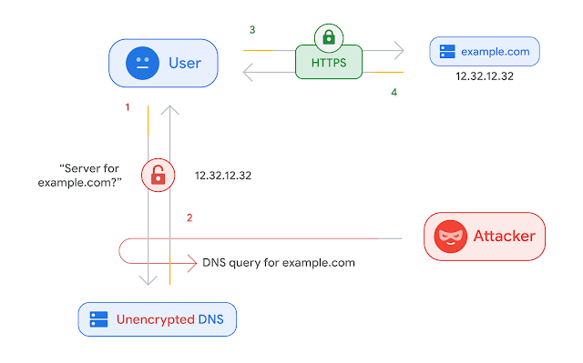
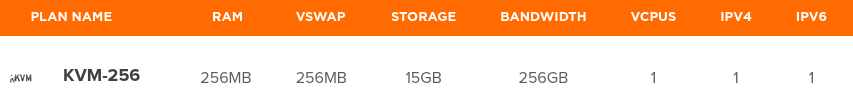
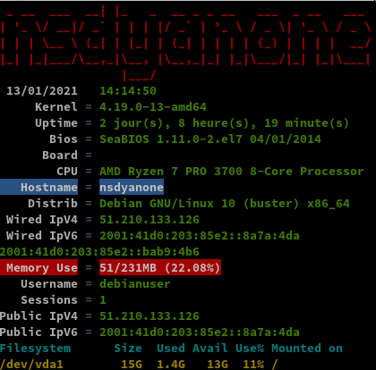
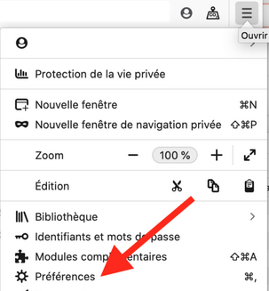
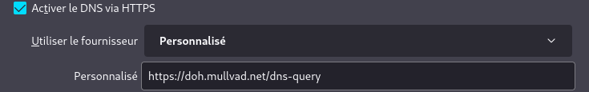
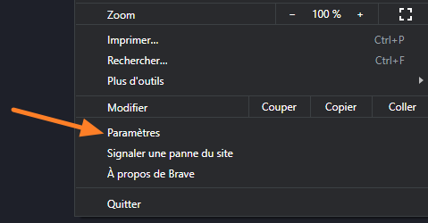
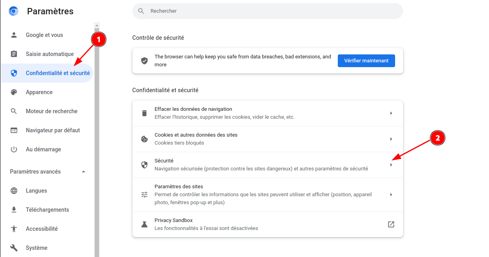
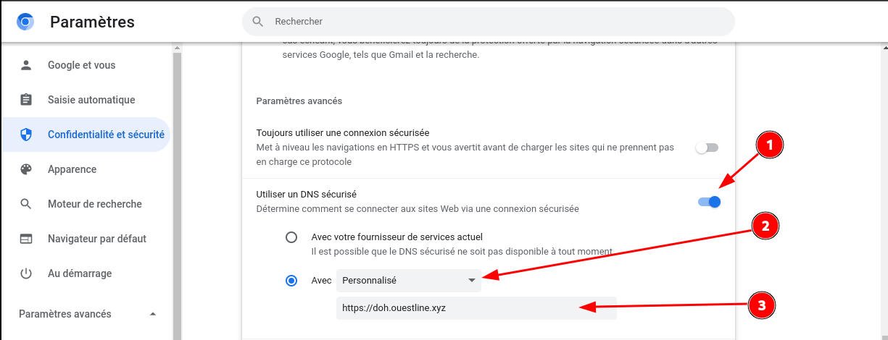

+++
title = 'Hostnamaste VPS KVM-256 debian 10 - résolveur DNS public sur TLS (DoT) et DNS sur HTTPS (DoH)'
date = 2021-11-22 00:00:00 +0100
categories = dns
+++
<div class="item">
  <div class="item__image">
    
  </div>
  <div class="item__content">
    <div class="item__header">
      <h4>Le DNS sur HTTPS et le DNS sur TLS</h4>
    </div>
    <div class="item__description">
      <p>Les requêtes DNS sont envoyées en texte brut, ce qui signifie que tout le monde peut les lire. Le DNS sur HTTPS et le DNS sur TLS chiffrent les requêtes et les réponses du DNS pour que la navigation des utilisateurs reste sécurisée et privée. Cependant, les deux approches ont leurs avantages et leurs inconvénients.</p>
    </div>
  </div>
</div>


**DNS non crypté**  
{:width="350"}

* <u>Le DNS sur TLS et le DNS sur HTTPS</u> sont deux normes développées pour le chiffrement du trafic DNS en texte brut afin d'empêcher les parties malveillantes, les annonceurs, les FAI et autres de pouvoir interpréter les données. Pour poursuivre l'analogie, ces normes visent à enfermer les cartes postales envoyées par courrier dans une enveloppe, pour que quiconque puisse envoyer une carte postale sans craindre les indiscrétions d'un tiers.  
**DNS sur HTTPS**  
{:width="350"}  

## Hostnamate VPS Serveur

[Hostnamate](https://www.hostnamaste.com/kvm-vps.php)   


<div class="item">
   <div class="item__image">
     <br>
   </div>
  <div class="item__content">
    <div class="item__header">
      <h4>Hostnamate : VPS KVM-256</h4>
    </div>
    <div class="item__description">
		<ul>
		  <li>Hostname : nsdyanone</li>
		  <li>256 MB RAM</li>
		  <li>256 vSwap RAM</li>
		  <li>15 GB Storage</li>
		  <li>256 GB Bandwidth</li>
		  <li>1 x vCPU Core</li>
		  <li>1 x IPv4 Address 51.210.133.126</li>
		  <li>1 x IPv6 Address 2001:41d0:203:85e2::bab9:4b6</li>
		  <li>Multiple OSes</li>
		  <li>Complete Root Access</li>
		  <li>KVM + SolusVM Access</li>
		</ul>
    </div>
  </div>
</div>

### Debian 10

{:width="100"} 

Connexion ssh

    ssh root@51.210.133.126

Mise à jour et reboot

    apt update && apt -y upgrade
    apt install sudo
    reboot

Reconnexion via ssh

**Réseau**

    ip a

```
1: lo: <LOOPBACK,UP,LOWER_UP> mtu 65536 qdisc noqueue state UNKNOWN group default qlen 1000
    link/loopback 00:00:00:00:00:00 brd 00:00:00:00:00:00
    inet 127.0.0.1/8 scope host lo
       valid_lft forever preferred_lft forever
    inet6 ::1/128 scope host 
       valid_lft forever preferred_lft forever
2: eth0: <BROADCAST,MULTICAST,UP,LOWER_UP> mtu 1500 qdisc pfifo_fast state UP group default qlen 1000
    link/ether 02:00:00:84:14:59 brd ff:ff:ff:ff:ff:ff
    inet 51.210.133.126/32 brd 51.210.133.126 scope global eth0
       valid_lft forever preferred_lft forever
    inet6 2001:41d0:203:85e2::bab9:4b6/64 scope global 
       valid_lft forever preferred_lft forever
    inet6 fe80::ff:fe84:1459/64 scope link 
       valid_lft forever preferred_lft forever
```

**Disques**

    df -h

```
Filesystem      Size  Used Avail Use% Mounted on
udev            102M     0  102M   0% /dev
tmpfs            24M  840K   23M   4% /run
/dev/vda1        15G  1.3G   13G  10% /
tmpfs           116M     0  116M   0% /dev/shm
tmpfs           5.0M     0  5.0M   0% /run/lock
tmpfs           116M     0  116M   0% /sys/fs/cgroup
tmpfs            24M     0   24M   0% /run/user/0
```

**Versions noyau et debian**  

Linux nsdyanone 4.19.0-13-amd64 #1 SMP Debian 4.19.160-2 (2020-11-28) x86_64 GNU/Linux  
10.7

Mot de passe sur utilisateur existant "debianuser"

    passwd debianuser

Installer sudo  `apt install sudo`  
Visudo pour les accès root via utilisateur **debianuser**  

    echo "debianuser     ALL=(ALL) NOPASSWD: ALL" >> /etc/sudoers

Locales

    dpkg-reconfigure locales

```
Generating locales (this might take a while)...
  en_US.UTF-8... done
  fr_FR.UTF-8... done
Generation complete.
```

Zone et date Europe/Paris

    dpkg-reconfigure tzdata

```
Current default time zone: 'Europe/Paris'
Local time is now:      Fri Nov 19 13:58:05 CET 2021.
Universal Time is now:  Fri Nov 19 12:58:05 UTC 2021.
```

Fermer la connexion root ssh

### {:width=80"} OpenSSH, clé et script

**connexion avec clé**  
<u>sur l'ordinateur de bureau</u>
Générer une paire de clé curve25519-sha256 (ECDH avec Curve25519 et SHA2) nommé **kvm-256-1** pour une liaison SSH avec le serveur KVM.  

    ssh-keygen -t ed25519 -o -a 100 -f ~/.ssh/kvm-256-1

Envoyer la clé publique sur le serveur KVM   

    scp ~/.ssh/kvm-256-1.pub debianuser@51.210.133.126:/home/debianuser/

<u>sur le serveur KVM</u>
On se connecte  

    ssh debianuser@51.210.133.126

Copier le contenu de la clé publique dans /home/$USER/.ssh/authorized_keys  

    cd ~

Sur le KVM ,créer un dossier .ssh  

```bash
mkdir .ssh
cat $HOME/kvm-256-1.pub >> $HOME/.ssh/authorized_keys
chmod 600 $HOME/.ssh/authorized_keys  # donner les droits
rm $HOME/kvm-256-1.pub  # effacer le fichier de la clé  
```

Modifier la configuration serveur SSH  

    sudo nano /etc/ssh/sshd_config  

Modifier

```conf
Port 55126
PermitRootLogin no  
PasswordAuthentication no 
```

<u>session SSH ne se termine pas correctement lors d'un "reboot" à distance</u>  
Si vous tentez de **redémarrer/éteindre** une machine distance par **ssh**, vous pourriez constater que votre session ne se termine pas correctement, vous laissant avec un terminal inactif jusqu'à l'expiration d'un long délai d'inactivité. Il existe un bogue 751636 à ce sujet. Pour l'instant, la solution de contournement à ce problème est d'installer :  

    sudo apt install libpam-systemd  # installé par défaut sur debian buster

cela terminera la session ssh avant que le réseau ne tombe.  
Veuillez noter qu'il est nécessaire que PAM soit activé dans sshd.  

Relancer openSSH  

    sudo systemctl restart sshd

Accès depuis le poste distant avec la clé privée  

    ssh -p 55126 -i ~/.ssh/kvm-256-1 debianuser@51.210.133.126

### Outils, scripts motd et ssh_rc_bash

Installer utilitaires  

    sudo apt install rsync curl tmux jq figlet git dnsutils tree -y


Motd

    sudo rm /etc/motd && sudo nano /etc/motd

```
               _                                         
  _ _   ___ __| | _  _  __ _  _ _   ___  _ _   ___       
 | ' \ (_-</ _` || || |/ _` || ' \ / _ \| ' \ / -_)      
 |_||_|/__/\__,_| \_, |\__,_||_||_|\___/|_||_|\___|      
  ___  _     ___  |__/__     _  ____ ____    _  ___   __ 
 | __|/ |   |_  )/ | /  \   / ||__ /|__ /   / ||_  ) / / 
 |__ \| | _  / / | || () |_ | | |_ \ |_ \ _ | | / / / _ \
 |___/|_|(_)/___||_| \__/(_)|_||___/|___/(_)|_|/___|\___/
```


Script **ssh_rc_bash**  
>**ATTENTION!!! Les scripts sur connexion peuvent poser des problèmes pour des appels externes autres que ssh**

    wget https://static.xoyaz.xyz/files/ssh_rc_bash
    chmod +x ssh_rc_bash # rendre le bash exécutable
    ./ssh_rc_bash        # exécution



### Installer noyau >= 5.6

*A partir du noyau 5.6 le module wireguard est intégré*

    echo "deb http://deb.debian.org/debian/ unstable main" | tee /etc/apt/sources.list.d/unstable-wireguard.list
    printf 'Package: *\nPin: release a=unstable\nPin-Priority: 90\n' | tee /etc/apt/preferences.d/limit-unstable
    apt update && apt upgrade

Rechercher l'image
    
    apt search linux-image-5

```
linux-image-5.10.0-1-amd64/unstable 5.10.4-1 amd64
  Linux 5.10 for 64-bit PCs (signed)
linux-headers-5.10.0-1-amd64/unstable 5.10.4-1 amd64
  Header files for Linux 5.10.0-1-amd64
```

Installer le noyau

    apt install linux-image-5.10.0-1-amd64

>**REDEMARRER `systemctl reboot`**

Connexion SSH 

Vérifications `uname -a`   
*Linux nsdyanone 5.10.0-1-amd64 #1 SMP Debian 5.10.4-1 (2020-12-31) x86_64 GNU/Linux*

Supprimer les images non utilisées

    sudo apt remove 4.19.0-13-amd64 

### {:width="50"} Parefeu

*UFW, ou pare - feu simple , est une interface pour gérer les règles de pare-feu dans Arch Linux, Debian ou Ubuntu. UFW est utilisé via la ligne de commande (bien qu'il dispose d'interfaces graphiques disponibles), et vise à rendre la configuration du pare-feu facile (ou simple).*

Installation **Debian / Ubuntu**

    sudo apt install ufw

*Par défaut, les jeux de règles d'UFW sont vides, de sorte qu'il n'applique aucune règle de pare-feu, même lorsque le démon est en cours d'exécution.*   

Les règles pour ssh dot doh et certbot 

    sudo ufw allow 853/tcp  # dot
    sudo ufw allow 443/tcp  # doh
    sudo ufw allow 80/tcp  # certbot
    sudo ufw allow 55126/tcp  # ssh

Activer le parefeu

    sudo ufw enable

```
Command may disrupt existing ssh connections. Proceed with operation (y|n)? y
Firewall is active and enabled on system startup
```

Status

     sudo ufw status verbose

```
Status: active
Logging: on (low)
Default: deny (incoming), allow (outgoing), disabled (routed)
New profiles: skip

To                         Action      From
--                         ------      ----
55126/tcp                  ALLOW IN    Anywhere                  
853/tcp                    ALLOW IN    Anywhere                  
443/tcp                    ALLOW IN    Anywhere                  
80/tcp                     ALLOW IN    Anywhere                  
55126/tcp (v6)             ALLOW IN    Anywhere (v6)             
853/tcp (v6)               ALLOW IN    Anywhere (v6)             
443/tcp (v6)               ALLOW IN    Anywhere (v6)             
80/tcp (v6)                ALLOW IN    Anywhere (v6)             
```

Assurez vous que les ports 853 (DoT), 443 (DoH) et 80 (challenge Let's encrypt)
sont bien ouverts sur votre machine.

Dans le cadre de la mise en place d'un résolveur public, vous possédez un nom
de domaine auquel sont associés les enregistrement `A` et `AAAA` éventuels
correspondant à l'adresse IP sur laquelle sera installé le résolveur DoT/DoH.


La solution technique retenue ici pour le résolveur DoT/DoH est composée d'un
frontal dnsdist qui assure la terminaison des sessions TLS et HTTPS et transmet
les requêtes vers un résolveur DNS unbound installé en local sur la machine.

## Dns DoT DoH

DNS over TLS (DoT) et DNS over HTTPS (DoH) sont deux protocoles standardisés
par l'IETF dans les [RFC 7858](https://www.rfc-editor.org/rfc/rfc7858) et
[RFC 8484](https://www.rfc-editor.org/rfc/rfc8484) respectivement. Ces deux
protocoles ont pour but de sécuriser les requêtes DNS entre un client et le
résolveur (encapsulation du protocole DNS
dans une session TLS pour DoT ou HTTPS pour DoH.)

### A - Résolveur Unbound

Commençons par installer et configurer le résolveur DNS. Il existe plusieurs
logiciels pour faire de la résolution comme [BIND 9](https://www.isc.org/bind),
[Knot Resolver](https://www.knot-resolver.cz) ou encore
[Unbound](https://nlnetlabs.nl/projects/unbound/about/). Nous avons choisi
d'utiliser Unbound et cette partie documente comment installer et configuer ce
résolveur.

En règle général Unbound est disponible dans les dépôts des distributions, l'installer depuis le gestionnaire de paquet de votre machine.

```
sudo apt-get install unbound
```

Maintenant que Unbound est installé, il ne reste plus qu'à le **configurer** avant
de démarrer le service.

Il s'agit du résolveur DNS, celui ci n'est accessible que depuis la machine
locale via le port 53.  
Modifier le fichier de configuration par défaut
`/etc/unbound/unbound.conf`. 

Sauvegarder la
configuration par défaut :

```
sudo cp /etc/unbound/unbound.conf /etc/unbound/unbound.conf.orig
```

Puis modifier le fichier avec le contenu suivant :

```
server:
    # ne rien enregistrer dans les journaux hormis les erreurs
    verbosity: 0

    # n'écouter que sur l'interface locale en IPv4
    # unbound nécessite d'être relancé si modifié
    interface: 127.0.0.1

    port: 53

    # refuser tout le monde sauf les connexions locales (pas forcément
    # nécessaire vu que le serveur n'écoute que sur la boucle locale en IPv4)
    access-control: 0.0.0.0/0 refuse
    access-control: 127.0.0.1/32 allow

    # par défaut, unbound ne log pas les requêtes ni les réponses
    # on peut le rappeler au cas où
    log-queries: no
    log-replies: no

    # imposer la QNAME minimisation (RFC 7816)
    qname-minimisation: yes
    # même si le serveur faisant autorité ne le veut pas
    #   après discussion, il est possible que cette option ne soit
    #   pas recommandée dans le cadre d'un résolveur ouvert
    qname-minimisation-strict: yes
```

Enregistrer le contenu de ce fichier dans `/etc/unbound/unbound.conf` ,
 vérifier la validité du fichier de configuration avec la commande
suivante :

```
sudo unbound-checkconf /etc/unbound/unbound.conf
#    unbound-checkconf: no errors in /etc/unbound/unbound.conf
```

Toutes les règles disponibles sont détaillées dans le manuel `man 5
unbound.conf` ou [dans le manuel en
ligne](https://nlnetlabs.nl/documentation/unbound/unbound.conf/).

Démarrer le résolveur.

```
sudo systemctl start unbound.service
```

S'assurer que tout fonctionne bien à l'aide de la commande
`dig` disponible dans le paquet `bind9-dnsutils` ou `dnsutils`. Pour cela il
suffit de spécifier l'adresse de notre résolveur, ici `127.0.0.1` ou `::1` et
d'effectuer une requête DNS. Ici on demande à Unbound de récupérer
l'enregistrement `AAAA` associé au nom de domaine `afnic.fr`.

```
sudo apt-get install dnsutils 
dig @127.0.0.1 AAAA afnic.fr
```

Résultat commande 

```
; <<>> DiG 9.11.5-P4-5.1+deb10u5-Debian <<>> @127.0.0.1 AAAA afnic.fr
; (1 server found)
;; global options: +cmd
;; Got answer:
;; ->>HEADER<<- opcode: QUERY, status: NOERROR, id: 35002
;; flags: qr rd ra ad; QUERY: 1, ANSWER: 1, AUTHORITY: 0, ADDITIONAL: 1

;; OPT PSEUDOSECTION:
; EDNS: version: 0, flags:; udp: 4096
;; QUESTION SECTION:
;afnic.fr.			IN	AAAA

;; ANSWER SECTION:
afnic.fr.		600	IN	AAAA	2001:67c:2218:302::51:231

;; Query time: 222 msec
;; SERVER: 127.0.0.1#53(127.0.0.1)
;; WHEN: Thu May 06 15:17:36 EDT 2021
;; MSG SIZE  rcvd: 65
```

Une réponse est bien renvoyée. Le résolveur fonctionne.Vérifier que tout est opérationnel en IPv4, et en utilisant UDP et TCP.

```
$ dig +notcp @127.0.0.1 AAAA afnic.fr  # connexion UDP en IPv4 au résolveur
$ dig +tcp @127.0.0.1 AAAA afnic.fr    # connexion TCP en IPv4 au résolveur
```

À ce stade, un résolveur Unbound est configuré en local et écoute sur le port
`53`. Il peut donc être utilisé pour résoudre toutes les requêtes en provenance
de la machine.


### B - Frontal DNS

Cette section s'attarde sur l'installation et la configuration d'un frontal
DoT/DoH qui transmettra les requêtes DNS à un résolveur local écoutant sur le
port 53 de l'interface local `127.0.0.1` (IPv4).

Ici `dnsdist` se trouve être une très bonne solution pour remplir ce rôle.

Si vous désiriez utiliser la dernière version de dnsdist,
[PowerDNS](https://www.powerdns.com) qui développpe le logiciel propose et
maintient [ses propres dépôts pour Debian, Raspbian, Ubuntu et
CentOS](https://repo.powerdns.com/).

Ainsi, voici comment installer la dernière version de dnsdist, actuellement
`1.6.0`, tel que défini sur [le site de PowerDNS](https://repo.powerdns.com/)

```
# récupération du nom de la distribution et de son ID
# ATTENTION: le fichier /etc/os-release peut être différent selon la distribution
export D_NAME=$(. /etc/os-release; echo ${VERSION_CODENAME})
export D_ID=$(. /etc/os-release; echo ${ID})

# ajout du dépôt aux sources
# Debian / Ubuntu
echo "deb [arch=amd64] http://repo.powerdns.com/${D_ID} ${D_NAME}-dnsdist-16 main" | sudo tee /etc/apt/sources.list.d/pdns.list

# gestion de l'étiquette et de la priorité du nouveau dépôt
sudo tee /etc/apt/preferences.d/dnsdist << EOF
Package: dnsdist*
Pin: origin repo.powerdns.com
Pin-Priority: 600
EOF

# ajout de la clé publique de PowerDNS
curl https://repo.powerdns.com/FD380FBB-pub.asc | sudo apt-key add -

# mise à jour des dépôts
sudo apt-get update

# installation de dnsdist
sudo apt-get install dnsdist
```

Configuration se fait dans le fichier `/etc/dnsdist/dnsdist.conf`.  
Ce fichier utilise une syntaxe très accessible.  
Pensez à modifier les IPs avec celle de l'interface de votre machine.

```
-- le résolveur DoT/DoH est public, on accepte tout le monde en IPv4 et IPv6
setACL({'0.0.0.0/0', '[::]/0'})

-- serveur DNS où transférer les requêtes entrantes
newServer({address='127.0.0.1:53', name='Unbound (local)'})

-- configuration de DoT
-- modifier l'IPv4 et l'IPv6 en conséquence
addTLSLocal('51.210.133.126:853', '/etc/dnsdist/dot-server.crt', '/etc/dnsdist/dot-server.key', {minTLSVersion='tls1.2'})
addTLSLocal('[2001:41d0:203:85e2::bab9:4b6]:853', '/etc/dnsdist/dot-server.crt', '/etc/dnsdist/dot-server.key', {minTLSVersion='tls1.2'})

-- configuration de DoH
-- modifier l'IPv4 et l'IPv6 en conséquence
addDOHLocal('51.210.133.126:443', '/etc/dnsdist/doh-server.crt', '/etc/dnsdist/doh-server.key', '/', {minTLSVersion='tls1.2'})
addDOHLocal('[2001:41d0:203:85e2::bab9:4b6]:443', '/etc/dnsdist/doh-server.crt', '/etc/dnsdist/doh-server.key', '/', {minTLSVersion='tls1.2'})

-- limitation du trafic à 100 requêtes par seconde
-- plus d'info en <https://dnsdist.org/advanced/qpslimits.html>
addAction(MaxQPSIPRule(100), DropAction())
```

L'ensemble des options de configuration est détaillé [sur le site de dnsdist](https://dnsdist.org/index.html).

Vérifier que le fichier de configuration est valide avec la
commande :

```
dnsdist --check-config
# Configuration '/etc/dnsdist/dnsdist.conf' OK!
```

dnsdist est donc configuré pour écouter sur l'interface publique de la machine
sur les ports 443 (DoH) et 853 (DoT). Toutes les requêtes sont ensuite relayées
à un serveur écoutant le port 53 sur l'interface locale.

Pour l'instant les fichiers `dot-server.crt`, `dot-server.key`,
`doh-server.crt` et `doh-server.key` n'existent pas. Il est nécessaire de les
générer. Cela peut se faire avec `openssl` dans le cas de certificats
auto-signés. Il est aussi possible de passer par une autorité de certification,
ceci est le but de la prochaine partie.

>Remarque: attention aux droits des fichiers du certificat et de la clé, l'utilisateur ou le groupe `dnsdist` (parfois `_dnsdist`, vérifier le contenu du fichier `/etc/group` avec la commande

        grep dnsdist /etc/group

`_dnsdist:x:113:`

doit avoir les droits en lecture dessus

    sudo chown -R root:_dnsdist /etc/dnsdist 


>Remarque: par soucis de sécurité les clés ne sont pas lisibles par tout le monde `sudo chmod 640 /etc/dnsdist/do[th]-server.key`

### C - Gestion des certificats

Afin de pouvoir proposer une connexion sécurisée au résolveur, il est
nécessaire de posséder au moins un certificat par service. On peut générer ses propres certificats auto-signés. Cependant pour
augmenter la confiance dans le service proposé, il est intéressant de s'appuyer
sur un tiers de confiance, l'[autorité de
certification](https://fr.wikipedia.org/wiki/Autorit%C3%A9_de_certification).
Nous allons utiliser [Let's Encrypt](https://letsencrypt.org/) comme autorité
de certification. Let's Encrypt propose par ailleurs un petit utilitaire en
ligne de commande [certbot](https://certbot.eff.org) pour générer et gérer ses
certificats.
La génération d'un certificat via cet utilitaire repose sur un challenge que
doit résoudre la machine.

Bien que nous privilégions et recommandons l'utilsation du challenge DNS ;),
nous retenons ici le challenge HTTP. Ce challenge repose sur l'utilisation d'un
serveur web écoutant sur le port 80. Il n'est pas nécessaire d'avoir un tel
serveur installé sur la machine. Dans ce cas, `certbot` se charge de faire
tourner un serveur web temporaire le temps de résoudre le challenge.  Si un
serveur web écoute déjà sur le port `80` comme `apache` ou `nginx`, certbot
peut être configuré pour utiliser ce serveur web. Pour cela référez vous [aux
instructions de certbot](https://certbot.eff.org/instructions).

Nous allons configurer les noms de domaine suivants : `dot.ouestline.xyz` et
`doh.ouestline.xyz`. Les enregistrements suivants sont ajoutés à la zone
`ouestline.xyz.` (pensez à remplacer les IPs avec celles de votre machine) :

```
dot     86400   A       51.210.133.126
            86400   AAAA    2001:41d0:203:85e2::bab9:4b6
doh     86400   A       51.210.133.126
            86400   AAAA    2001:41d0:203:85e2::bab9:4b6
```

Une fois cette étape réalisée, il ne reste plus qu'à installer certbot et à
demander 2 certificats, un pour chaque service.

```
sudo apt-get install certbot
```

Certbot stocke tous les certificats générés dans
`/etc/letsencrypt/archive/nomdedomaine/` et le répertoire
`/etc/letsencrypt/live/nomdedomaine/` contient des liens vers les fichiers du
dossier `archive/nomdedomaine/`. Par défaut tous ces fichiers sont la
propriété de l'utilisateur `root`.  Or nous avons vu que `dnsdist` tourne avec
l'utilisateur `dnsdist` et donc il est nécessaire que cet utilisateur ait la
capacité de lire les certificats.

Pour cela nous allons suivre la procédure suivante :

  1. (re)générer les certificats avec certbot
  2. copier les certificats dans le dossier `/etc/dnsdist/` en utilisant le nom
     utilisé dans la configuration de dnsdist
  3. modifier les droits de ces fichiers
     `sudo chown :dnsdist /etc/dnsdist/do[th]-server.*` (il est possible que le
     nom du groupe diffère, par exemple `_dnsdist`)
  4. relancer dnsdist

Génération d'un certificat pour le nom de domaine `dot.ouestline.xyz` :

```
sudo certbot certonly --standalone -d 'dot.ouestline.xyz' -m 'vps@cinay.eu' --no-eff-email
```

- `-m 'mail@example.com'` : permet de renseigner son mail depuis la ligne de
  commande
- `--no-eff-email` : demander à l'autorité de certification de ne pas
  transmettre le mail à l'EFF

Idem pour le nom de domaine `doh.ouestline.xyz` :

```
sudo certbot certonly --standalone -d 'doh.ouestline.xyz' -m 'vps@cinay.eu' --no-eff-email
```

Les étapes 2 à 4 peuvent être automatisées dans un script comme celui ci, que
nous avons appelé `deploy-cert.sh` :

```
#!/bin/sh

# script de déploiement des certificats
# lancé par certbot via l'option --deploy-hook /chemin/du/script.sh
# ce script doit être lancé avec les droits root

DOMAIN_DOT="dot.ouestline.xyz"
DOMAIN_DOH="doh.ouestline.xyz"

DNSDIST_GROUP="$(grep dnsdist /etc/group | cut -d ':' -f 1)"

# copie du certificat utilisé pour DoT
cp /etc/letsencrypt/live/${DOMAIN_DOT}/fullchain.pem /etc/dnsdist/dot-server.crt
cp /etc/letsencrypt/live/${DOMAIN_DOT}/privkey.pem /etc/dnsdist/dot-server.key

# copie du certificat utilisé pour DoH
cp /etc/letsencrypt/live/${DOMAIN_DOH}/fullchain.pem /etc/dnsdist/doh-server.crt
cp /etc/letsencrypt/live/${DOMAIN_DOH}/privkey.pem /etc/dnsdist/doh-server.key

# modification des droits
chown root:${DNSDIST_GROUP} /etc/dnsdist/dot-server.crt /etc/dnsdist/dot-server.key
chown root:${DNSDIST_GROUP} /etc/dnsdist/doh-server.crt /etc/dnsdist/doh-server.key
chmod 640 /etc/dnsdist/dot-server.key /etc/dnsdist/doh-server.key

# relancer dnsdist pour prendre en compte les changements
# REMARQUE: il est aussi possible d'utiliser la console dnsdist pour recharger
#           les certificats, avec l'option reloadAllCertificates() :
#
#             $ dnsdist -c 127.0.0.1:5199
#             > reloadAllCertificates()
#
#           et en une ligne :
#
#             $ dnsdist -c 127.0.0.1:5199 -e 'reloadAllCertificates()'
#
#           cela nécessite que dnsdist soit configuré de sorte à ce que la
#           console soit accessible
systemctl restart dnsdist
```

Ainsi suite à la génération des certificats, il ne reste plus qu'à lancer ce
script :

```
sudo chmod +x deploy-cert.sh
sudo ./deploy-cert.sh
```

#### Renouvellement des certificats

Les certificats générés par Let's Encrypt ne sont valable que 90 jours. Il
convient de penser à préparer leur renouvellement. Le script `deploy-hook.sh`
s'avère ici très utile pour automatiser le déploiement des certificats, et cela
grâce à l'option `--deploy-hook` de l'utilitaire certbot.

```
$ sudo certbot renew --deploy-hook "/path/to/deploy-cert.sh"
```

Le renouvellement d'un certificat n'a lieu que dans les 30 jours avant son
expiration. Ainsi nous choisissons d'automatiser la demande de renouvellement
toutes les semaines, afin d'être de palier à d'éventuels problèmes (machine qui
redémarre, autorité de certification en panne au moment de la demande...).

**Automatisation avec cron**  
Automatiser cette commande dans une tâche
de type `cron` en ajoutant la ligne suivante à crontab (`sudo crontab -e`) :

```
# se lance toutes les semaines le lundi
0 0 * * 1 certbot renew --deploy-hook "/home/debianuser/deploy-cert.sh"
```

**Automatisation avec un timer systemd (CHOIX PAR DEFAUT)**  
Une autre approche est d'utiliser `systemd` pour automatiser le renouvellement
des certificats. Il s'avère que sur la machine utilisée, `certbot` installe
deux fichiers `systemd` :

- `/lib/systemd/system/certbot.service` : l'unité qui contient la commande à
  lancer pour le renouvellement
- `/lib/systemd/system/certbot.timer` : un minuteur associé au service (ils
  portent le même nom)

Il est alors possible de substituer certaines règles en créant les même
fichiers dans `/etc/systemd/system`. Dans ce cas, systemd retiendra les valeurs
définies dans ces fichiers.

    /etc/systemd/system/certbot.service

```
[Unit]
Description=Certbot renew

[Service]
ExecStart=/usr/bin/certbot renew --deploy-hook "/home/debianuser/deploy-cert.sh"
```

    /etc/systemd/system/certbot.timer

```
[Unit]
Description=Run certbot renew daily

[Timer]
OnCalendar=daily
Persistent=true

[Install]
WantedBy=timers.target
```

Une fois les fichiers créés, il reste à recharger ces règles dans systemd :

    systemctl daemon-reload

Il est alors possible de vérifier les journaux pour s'assurer du bon
renouvellement :

    journalctl -u certbot.service

```
nov. 20 00:02:03 nsdyanone certbot[626]: - - - - - - - - - - - - - - - - - - - - - - - - - - - - - - - - - - - - 
nov. 20 00:02:07 nsdyanone systemd[1]: certbot.service: Succeeded.
nov. 20 14:10:35 nsdyanone systemd[1]: Started Certbot renew.
nov. 20 14:10:36 nsdyanone certbot[1516]: Saving debug log to /var/log/letsencrypt/letsencrypt.log
nov. 20 14:10:36 nsdyanone certbot[1516]: - - - - - - - - - - - - - - - - - - - - - - - - - - - - - - - - - - - -
nov. 20 14:10:36 nsdyanone certbot[1516]: Processing /etc/letsencrypt/renewal/doh.ouestline.xyz.conf
nov. 20 14:10:36 nsdyanone certbot[1516]: - - - - - - - - - - - - - - - - - - - - - - - - - - - - - - - - - - - -
nov. 20 14:10:36 nsdyanone certbot[1516]: Cert not yet due for renewal
nov. 20 14:10:36 nsdyanone certbot[1516]: - - - - - - - - - - - - - - - - - - - - - - - - - - - - - - - - - - - -
nov. 20 14:10:36 nsdyanone certbot[1516]: Processing /etc/letsencrypt/renewal/dot.ouestline.xyz.conf
nov. 20 14:10:36 nsdyanone certbot[1516]: - - - - - - - - - - - - - - - - - - - - - - - - - - - - - - - - - - - -
nov. 20 14:10:36 nsdyanone certbot[1516]: Cert not yet due for renewal
nov. 20 14:10:36 nsdyanone certbot[1516]: - - - - - - - - - - - - - - - - - - - - - - - - - - - - - - - - - - - -
nov. 20 14:10:36 nsdyanone certbot[1516]: The following certs are not due for renewal yet:
nov. 20 14:10:36 nsdyanone certbot[1516]:   /etc/letsencrypt/live/doh.ouestline.xyz/fullchain.pem expires on 2022
nov. 20 14:10:36 nsdyanone certbot[1516]:   /etc/letsencrypt/live/dot.ouestline.xyz/fullchain.pem expires on 2022
nov. 20 14:10:36 nsdyanone certbot[1516]: No renewals were attempted.
nov. 20 14:10:36 nsdyanone certbot[1516]: No hooks were run.
nov. 20 14:10:36 nsdyanone certbot[1516]: - - - - - - - - - - - - - - - - - - - - - - - - - - - - - - - - - - - -
nov. 20 14:10:36 nsdyanone systemd[1]: certbot.service: Succeeded.
```


### D - Test résolveur (outil Homer)

Pour s'assurer que le résolveur fonctionne de manière nominal, on va utiliser Homer.

Homer est un outil développé par l'Afnic, qui permet de tester et débugger un
résolveur DoT/DoH en ligne de commande.

Homer est un logiciel libre et le code est disponible [sur la forge logicielle
Framagit](https://framagit.org/bortzmeyer/homer).

L'outil nécessite python3, et certains modules associés :

```
sudo apt-get install python3 python3-pycurl python3-dnspython python3-openssl python3-netaddr  # debian
yay -S python-pycurl python-dnspython python-pyopenssl python-netaddr # archlinux
```

Il ne reste plus qu'à récupérer Homer

    git clone https://framagit.org/bortzmeyer/homer
    cd homer

et à le lancer 

    ./remoh.py https://doh.ouestline.xyz afnic.fr


```
id 0
opcode QUERY
rcode NOERROR
flags QR RD RA AD
edns 0
payload 4096
option ECS ::/0 scope/0
;QUESTION
afnic.fr. IN AAAA
;ANSWER
afnic.fr. 600 IN AAAA 2001:67c:2218:302::51:231
;AUTHORITY
;ADDITIONAL

Total elapsed time: 0.25 seconds
```

    ./remoh.py --dot dot.ouestline.xyz framagit.org

```
id 45333
opcode QUERY
rcode NOERROR
flags QR RD RA AD
edns 0
payload 4096
option ECS ::/0 scope/0
;QUESTION
framagit.org. IN AAAA
;ANSWER
framagit.org. 3600 IN AAAA 2a01:4f8:231:4c99::75
;AUTHORITY
;ADDITIONAL

Total elapsed time: 0.33 seconds
```

Homer peut aussi être utilisé pour tester la bonne configuration du résolveur :

```
$ ./remoh.py --check --dot dot.ouestline.xyz framasoft.org
OK

$ ./remoh.py --check https://doh.ouestline.xyz chatons.org
OK
```

Dans le cas où votre résolveur est mal configuré, Homer s'arrête est affiche
l'erreur rencontrée. Par exemple pour un certificat non configuré :

```
$ ./remoh.py --dot 198.51.100.19 framasoft.org
198.51.100.19: Certificate error: "198.51.100.19 is not in the certificate
Could not connect to "198.51.100.19"
```

On peut demander à Homer de ne pas vérifier le certificat
avec l'option `-k | --insecure` :

```
$ ./remoh.py --insecure --dot 198.51.100.19 framasoft.org
id 35430
opcode QUERY
rcode NOERROR
flags QR RD RA
edns 0
payload 4096
option ECS ::/0 scope/0
;QUESTION
framasoft.org. IN AAAA
;ANSWER
framasoft.org. 3600 IN AAAA 2a01:4f8:141:3421::212
;AUTHORITY
;ADDITIONAL

Total elapsed time: 0.04 seconds (41.83 ms/request)
```


### E - Utilisez votre résolveur

Vous voilà désormais en possession d'un résolveur DoT/DoH public.

DoT/DoH est supporté par plusieurs navigateurs :  
[Firefox](https://support.mozilla.org/fr/kb/dns-via-https-firefox),
[Chrome](https://blog.chromium.org/2020/05/a-safer-and-more-private-browsing-DoH.html),
Edge et [Opera](https://blogs.opera.com/desktop/2019/10/opera-65-beta/)  
mais également par plusieurs systèmes d'exploitation :  
[Android](https://android-developers.googleblog.com/2018/04/dns-over-tls-support-in-android-p.html)
et prochainement iOS / MacOS et Windows 10.

Les indications pour configurer son navigateur peuvent varier. Nous vous
laissons le soin de vous renseigner selon les outils que vous utilisez.

#### Firefox

1. Activation et désactivation manuelles du DNS via HTTPS
2. Vous pouvez activer et désactiver le DoH dans les paramètres de connexion de Firefox :
    * Cliquez sur le bouton de menu (en haut à droite, symbole 3 traits superposés)  "Ouvrir le menu de l'application" et sélectionnez **Préférences**  
{:width="200"}
    * Dans le panneau Général, descendez jusqu’à la section **Paramètres réseau** et cliquez sur le bouton **Paramètres...**
3. Dans la boîte de dialogue qui s’ouvre, descendez jusqu’à **Activer le DNS via HTTPS**.
    * **Activer** : cocher la case à côté d’**Activer le DNS via HTTPS** pour l’activer. Choisissez un fournisseur ou ajoutez un fournisseur personnalisé.  
{:width="500"}  
Si personnalisé, saisir l'adresse du serveur doh ,ici <https://doh.mullvad.net/dns-query> car le navigateur est connecté via wireguard mullvad ou <https://doh.ouestline.xyz>  
    * **Désactiver** : décocher la case à côté d’**Activer le DNS via HTTPS** pour le désactiver.  
4. Cliquez sur OK pour enregistrer vos modifications et fermer la fenêtre. 

#### Chromium/Brave

Si vous utilisez le navigateur Brave, voici comment activer le DNS over HTTPS. Ouvrez le navigateur et suivez les étapes suivantes :

1 - Ouvrez le menu en haut à droite et cliquez sur "Paramètres".  
{:width="300"}  
2 - 2 - Sur la gauche, cliquez sur "Paramètres supplémentaires", puis "Confidentialité et sécurité" et enfin sur "Sécurité".  
{:width="400"}  
3 - Au sein des paramètres de sécurité, il y a un paramètre nommé "Utiliser un DNS sécurisé" : cochez la case "Avec" et choisissez un fournisseur dans la liste ou alors prenez "Personnalisé" pour en utiliser un autre.  
{:width="400"}  


Liens : https://dns.sb/dot/

## Unbound : Ajout liste de blocage

* [Listes de blocage DNS](https://sebsauvage.net/wiki/doku.php?id=dns-blocklist)
* [Bloquer la publicité grâce au DNS](https://www.shaftinc.fr/blocage-pubs-unbound.html)

Modification pour avoir la liste <https://sebsauvage.net/hosts/hosts> au format suivant (exemple)

    local-zone: "publicite.example" static
    local-zone: "mouchard.domaine.example" static

Bash pour récupérer la liste puis la transformer au format unbound

```bash
cd /etc/unbound/unbound.conf.d
wget -O- https://sebsauvage.net/hosts/hosts | grep '^0\.0\.0\.0' | grep -v '^0\.0\.0\.0 0\.0\.0\.0' | awk '{print "local-zone: \""$2"\" static"}' > adslist

```

On ajoute la prise en charge de cette liste de domaines à bloquer dans notre fichier de configuration d’Unbound

    sudo nano /etc/unbound/unbound.conf

```bash
#Ads blocking
include: "/etc/unbound/unbound.conf.d/adslist"
```

On redémarre le service:

    sudo systemctl restart unbound

Test sous homer

    ./remoh.py https://doh.ouestline.xyz doubleclick.net

```
id 0
opcode QUERY
rcode NXDOMAIN
flags QR AA RD RA
edns 0
payload 4096
;QUESTION
doubleclick.net. IN AAAA
;ANSWER
;AUTHORITY
;ADDITIONAL

Total elapsed time: 0.38 seconds
```

Créer un bash pour la mise à jour de liste

    sudo nano /home/debianuser/adslist.sh

```
#!/bin/sh

# Mise à jour liste  blocage pub et tracker

/usr/bin/wget -O- https://sebsauvage.net/hosts/hosts | grep '^0\.0\.0\.0' | grep -v '^0\.0\.0\.0 0\.0\.0\.0' | awk '{print "local-zone: \""$2"\" static"}' > /etc/unbound/unbound.conf.d/adslist

# relance unbound
systemctl restart unbound
```

Les droits

    sudo chmod +x /home/debianuser/adslist.sh

Mise à jour tous les lundi à 3h00 du matin de la liste 

    sudo crontab -e

```
# Mise à jour tous les lundi à 3h00 du matin de la liste 
0 3 * * 1 /usr/bin/sh /home/debianuser/adslist.sh
```

## Corriger problème DNS privé Android

[Let's Encrypt and DNS over TLS Hell on Android](https://ikarus.sg/lets-encrypt-dot-android/)

*Problèmes avec le DNS privé d'Android sur TLS via Adguard ou PiHole utilisant des certificats TLS Let's Encrypt après la récente expiration du certificat racine.*

Outils à installer sur un poste debian

    sudo apt install knot-dnsutils

Test

    kdig -d @dot.ouestline.xyz +tls-ca google.com

```
;; DEBUG: Querying for owner(google.com.), class(1), type(1), server(dot.ouestline.xyz), port(853), protocol(TCP)
;; DEBUG: TLS, imported 137 system certificates
;; DEBUG: TLS, received certificate hierarchy:
;; DEBUG:  #1, CN=doh.ouestline.xyz
;; DEBUG:      SHA-256 PIN: 9bYkZwIjSa8ReHiELef0yDKGfJgpax84hdtCG7enaNI=
;; DEBUG:  #2, C=US,O=Let's Encrypt,CN=R3
;; DEBUG:      SHA-256 PIN: jQJTbIh0grw0/1TkHSumWb+Fs0Ggogr621gT3PvPKG0=
;; DEBUG: TLS, skipping certificate PIN check
;; DEBUG: TLS, The certificate is trusted. 
;; TLS session (TLS1.3)-(ECDHE-SECP256R1)-(ECDSA-SECP384R1-SHA384)-(AES-256-GCM)
;; ->>HEADER<<- opcode: QUERY; status: NOERROR; id: 35538
;; Flags: qr rd ra; QUERY: 1; ANSWER: 1; AUTHORITY: 0; ADDITIONAL: 1

;; EDNS PSEUDOSECTION:
;; Version: 0; flags: ; UDP size: 4096 B; ext-rcode: NOERROR

;; QUESTION SECTION:
;; google.com.         		IN	A

;; ANSWER SECTION:
google.com.         	212	IN	A	142.250.179.206

;; Received 55 B
;; Time 2021-11-22 18:19:41 CET
;; From 2001:41d0:203:85e2::bab9:4b6@853(TCP) in 61.5 ms
```

Vérification certificats

    openssl s_client -showcerts -servername dot.ouestline.xyz -connect dot.ouestline.xyz:853

```
CONNECTED(00000003)
depth=2 C = US, O = Internet Security Research Group, CN = ISRG Root X1
verify return:1
depth=1 C = US, O = Let's Encrypt, CN = R3
verify return:1
depth=0 CN = dot.ouestline.xyz
verify return:1
---
Certificate chain
 0 s:CN = dot.ouestline.xyz
   i:C = US, O = Let's Encrypt, CN = R3
-----BEGIN CERTIFICATE-----
MIIFJzCCBA+gAwIBAgISAzJ0FUNyKgzA+aVtto8dP1izMA0GCSqGSIb3DQEBCwUA
MDIxCzAJBgNVBAYTAlVTMRYwFAYDVQQKEw1MZXQncyBFbmNyeXB0MQswCQYDVQQD
EwJSMzAeFw0yMTExMjAxMjA4MzFaFw0yMjAyMTgxMjA4MzBaMBwxGjAYBgNVBAMT
EWRvdC5vdWVzdGxpbmUueHl6MIIBIjANBgkqhkiG9w0BAQEFAAOCAQ8AMIIBCgKC
AQEA3VVcEouMrKuIg9u3a874gG5UW32WwLXalLNbCXtNl8pYCpn6cpAqTj4Pe5e2
T/U1rC2LCBALYp6BIwIh5RmKvawI5Z4ZOvERFE41aSSxOuKkK8U3da03sf5e9uQD
AjRvuPzTfyw2FWfPpE1BIMYtq9Y6qtMV9pRDWBLAKHSPS7psppze4FRbuHXAHOXH
o99+iKaHyxGQ/IUSpMFI+XHlHIOFUDTxWby1Fu4+U98NDr16U8yq/uIKq7VA8LZ8
Fpbjxg/WMPP1EJpu05Q3iSzFC5izAqVBnesTpV/L6jMSz3ghnZdMilO6jBazD82q
F2nFXAg7p2gKyWu06ePGVoKRQQIDAQABo4ICSzCCAkcwDgYDVR0PAQH/BAQDAgWg
MB0GA1UdJQQWMBQGCCsGAQUFBwMBBggrBgEFBQcDAjAMBgNVHRMBAf8EAjAAMB0G
A1UdDgQWBBQ3jH3DjWOnpyts3e7G+DWUgLxCLTAfBgNVHSMEGDAWgBQULrMXt1hW
y65QCUDmH6+dixTCxjBVBggrBgEFBQcBAQRJMEcwIQYIKwYBBQUHMAGGFWh0dHA6
Ly9yMy5vLmxlbmNyLm9yZzAiBggrBgEFBQcwAoYWaHR0cDovL3IzLmkubGVuY3Iu
b3JnLzAcBgNVHREEFTATghFkb3Qub3Vlc3RsaW5lLnh5ejBMBgNVHSAERTBDMAgG
BmeBDAECATA3BgsrBgEEAYLfEwEBATAoMCYGCCsGAQUFBwIBFhpodHRwOi8vY3Bz
LmxldHNlbmNyeXB0Lm9yZzCCAQMGCisGAQQB1nkCBAIEgfQEgfEA7wB1AN+lXqto
gk8fbK3uuF9OPlrqzaISpGpejjsSwCBEXCpzAAABfT12cDoAAAQDAEYwRAIgMON6
1oAne0xD7A0NCRABXshgbksSa+BBnBn5LoyMu74CIB0NC27cAnexpQpwxB/qnqiR
aqZYMaCMngbxfgyCovuKAHYAKXm+8J45OSHwVnOfY6V35b5XfZxgCvj5TV0mXCVd
x4QAAAF9PXZwPwAABAMARzBFAiA04uJ+STmeqVuziI/czUOGm5iXNntqFj64eDLT
IX3mOQIhAMeiNFLq5C/r++tJrloYJjdgoBU0Zb3QGGIIFgTStberMA0GCSqGSIb3
DQEBCwUAA4IBAQA0EIT/mkZjF3SHFF/iWFHEyXCKfHQ65lNG+M9XpuULJXzhm/t7
oRjm8yKanwWpehn39RqOemYY5zjgP5H/y+bJHd9e5NeLD5ZgD1aTeA/ACoMmiRp0
Z2xi3CdTfNTbKaMoQAhOkvC2aK7dUg2JwO1bwmVki+vcl/hLh00627Q9kUVr6An0
rD3YnjxXThDcKkrydyMC17+BVcEPYz+Wlv8qA2IzVCiow6NfWkAfUpnt/NyvzsSH
dq56DigEg882w0Uk2gGRThg8d0By8Z7KDF8VWm+Ahjcfz8aB4KVPjC6m3Jry6ed4
wY2dTOr8NhWTAvY77I/cAxxE/Lnij4/gdK4R
-----END CERTIFICATE-----
 1 s:C = US, O = Let's Encrypt, CN = R3
   i:C = US, O = Internet Security Research Group, CN = ISRG Root X1
-----BEGIN CERTIFICATE-----
MIIFFjCCAv6gAwIBAgIRAJErCErPDBinU/bWLiWnX1owDQYJKoZIhvcNAQELBQAw
TzELMAkGA1UEBhMCVVMxKTAnBgNVBAoTIEludGVybmV0IFNlY3VyaXR5IFJlc2Vh
cmNoIEdyb3VwMRUwEwYDVQQDEwxJU1JHIFJvb3QgWDEwHhcNMjAwOTA0MDAwMDAw
WhcNMjUwOTE1MTYwMDAwWjAyMQswCQYDVQQGEwJVUzEWMBQGA1UEChMNTGV0J3Mg
RW5jcnlwdDELMAkGA1UEAxMCUjMwggEiMA0GCSqGSIb3DQEBAQUAA4IBDwAwggEK
AoIBAQC7AhUozPaglNMPEuyNVZLD+ILxmaZ6QoinXSaqtSu5xUyxr45r+XXIo9cP
R5QUVTVXjJ6oojkZ9YI8QqlObvU7wy7bjcCwXPNZOOftz2nwWgsbvsCUJCWH+jdx
sxPnHKzhm+/b5DtFUkWWqcFTzjTIUu61ru2P3mBw4qVUq7ZtDpelQDRrK9O8Zutm
NHz6a4uPVymZ+DAXXbpyb/uBxa3Shlg9F8fnCbvxK/eG3MHacV3URuPMrSXBiLxg
Z3Vms/EY96Jc5lP/Ooi2R6X/ExjqmAl3P51T+c8B5fWmcBcUr2Ok/5mzk53cU6cG
/kiFHaFpriV1uxPMUgP17VGhi9sVAgMBAAGjggEIMIIBBDAOBgNVHQ8BAf8EBAMC
AYYwHQYDVR0lBBYwFAYIKwYBBQUHAwIGCCsGAQUFBwMBMBIGA1UdEwEB/wQIMAYB
Af8CAQAwHQYDVR0OBBYEFBQusxe3WFbLrlAJQOYfr52LFMLGMB8GA1UdIwQYMBaA
FHm0WeZ7tuXkAXOACIjIGlj26ZtuMDIGCCsGAQUFBwEBBCYwJDAiBggrBgEFBQcw
AoYWaHR0cDovL3gxLmkubGVuY3Iub3JnLzAnBgNVHR8EIDAeMBygGqAYhhZodHRw
Oi8veDEuYy5sZW5jci5vcmcvMCIGA1UdIAQbMBkwCAYGZ4EMAQIBMA0GCysGAQQB
gt8TAQEBMA0GCSqGSIb3DQEBCwUAA4ICAQCFyk5HPqP3hUSFvNVneLKYY611TR6W
PTNlclQtgaDqw+34IL9fzLdwALduO/ZelN7kIJ+m74uyA+eitRY8kc607TkC53wl
ikfmZW4/RvTZ8M6UK+5UzhK8jCdLuMGYL6KvzXGRSgi3yLgjewQtCPkIVz6D2QQz
CkcheAmCJ8MqyJu5zlzyZMjAvnnAT45tRAxekrsu94sQ4egdRCnbWSDtY7kh+BIm
lJNXoB1lBMEKIq4QDUOXoRgffuDghje1WrG9ML+Hbisq/yFOGwXD9RiX8F6sw6W4
avAuvDszue5L3sz85K+EC4Y/wFVDNvZo4TYXao6Z0f+lQKc0t8DQYzk1OXVu8rp2
yJMC6alLbBfODALZvYH7n7do1AZls4I9d1P4jnkDrQoxB3UqQ9hVl3LEKQ73xF1O
yK5GhDDX8oVfGKF5u+decIsH4YaTw7mP3GFxJSqv3+0lUFJoi5Lc5da149p90Ids
hCExroL1+7mryIkXPeFM5TgO9r0rvZaBFOvV2z0gp35Z0+L4WPlbuEjN/lxPFin+
HlUjr8gRsI3qfJOQFy/9rKIJR0Y/8Omwt/8oTWgy1mdeHmmjk7j1nYsvC9JSQ6Zv
MldlTTKB3zhThV1+XWYp6rjd5JW1zbVWEkLNxE7GJThEUG3szgBVGP7pSWTUTsqX
nLRbwHOoq7hHwg==
-----END CERTIFICATE-----
 2 s:C = US, O = Internet Security Research Group, CN = ISRG Root X1
   i:O = Digital Signature Trust Co., CN = DST Root CA X3
-----BEGIN CERTIFICATE-----
MIIFYDCCBEigAwIBAgIQQAF3ITfU6UK47naqPGQKtzANBgkqhkiG9w0BAQsFADA/
MSQwIgYDVQQKExtEaWdpdGFsIFNpZ25hdHVyZSBUcnVzdCBDby4xFzAVBgNVBAMT
DkRTVCBSb290IENBIFgzMB4XDTIxMDEyMDE5MTQwM1oXDTI0MDkzMDE4MTQwM1ow
TzELMAkGA1UEBhMCVVMxKTAnBgNVBAoTIEludGVybmV0IFNlY3VyaXR5IFJlc2Vh
cmNoIEdyb3VwMRUwEwYDVQQDEwxJU1JHIFJvb3QgWDEwggIiMA0GCSqGSIb3DQEB
AQUAA4ICDwAwggIKAoICAQCt6CRz9BQ385ueK1coHIe+3LffOJCMbjzmV6B493XC
ov71am72AE8o295ohmxEk7axY/0UEmu/H9LqMZshftEzPLpI9d1537O4/xLxIZpL
wYqGcWlKZmZsj348cL+tKSIG8+TA5oCu4kuPt5l+lAOf00eXfJlII1PoOK5PCm+D
LtFJV4yAdLbaL9A4jXsDcCEbdfIwPPqPrt3aY6vrFk/CjhFLfs8L6P+1dy70sntK
4EwSJQxwjQMpoOFTJOwT2e4ZvxCzSow/iaNhUd6shweU9GNx7C7ib1uYgeGJXDR5
bHbvO5BieebbpJovJsXQEOEO3tkQjhb7t/eo98flAgeYjzYIlefiN5YNNnWe+w5y
sR2bvAP5SQXYgd0FtCrWQemsAXaVCg/Y39W9Eh81LygXbNKYwagJZHduRze6zqxZ
Xmidf3LWicUGQSk+WT7dJvUkyRGnWqNMQB9GoZm1pzpRboY7nn1ypxIFeFntPlF4
FQsDj43QLwWyPntKHEtzBRL8xurgUBN8Q5N0s8p0544fAQjQMNRbcTa0B7rBMDBc
SLeCO5imfWCKoqMpgsy6vYMEG6KDA0Gh1gXxG8K28Kh8hjtGqEgqiNx2mna/H2ql
PRmP6zjzZN7IKw0KKP/32+IVQtQi0Cdd4Xn+GOdwiK1O5tmLOsbdJ1Fu/7xk9TND
TwIDAQABo4IBRjCCAUIwDwYDVR0TAQH/BAUwAwEB/zAOBgNVHQ8BAf8EBAMCAQYw
SwYIKwYBBQUHAQEEPzA9MDsGCCsGAQUFBzAChi9odHRwOi8vYXBwcy5pZGVudHJ1
c3QuY29tL3Jvb3RzL2RzdHJvb3RjYXgzLnA3YzAfBgNVHSMEGDAWgBTEp7Gkeyxx
+tvhS5B1/8QVYIWJEDBUBgNVHSAETTBLMAgGBmeBDAECATA/BgsrBgEEAYLfEwEB
ATAwMC4GCCsGAQUFBwIBFiJodHRwOi8vY3BzLnJvb3QteDEubGV0c2VuY3J5cHQu
b3JnMDwGA1UdHwQ1MDMwMaAvoC2GK2h0dHA6Ly9jcmwuaWRlbnRydXN0LmNvbS9E
U1RST09UQ0FYM0NSTC5jcmwwHQYDVR0OBBYEFHm0WeZ7tuXkAXOACIjIGlj26Ztu
MA0GCSqGSIb3DQEBCwUAA4IBAQAKcwBslm7/DlLQrt2M51oGrS+o44+/yQoDFVDC
5WxCu2+b9LRPwkSICHXM6webFGJueN7sJ7o5XPWioW5WlHAQU7G75K/QosMrAdSW
9MUgNTP52GE24HGNtLi1qoJFlcDyqSMo59ahy2cI2qBDLKobkx/J3vWraV0T9VuG
WCLKTVXkcGdtwlfFRjlBz4pYg1htmf5X6DYO8A4jqv2Il9DjXA6USbW1FzXSLr9O
he8Y4IWS6wY7bCkjCWDcRQJMEhg76fsO3txE+FiYruq9RUWhiF1myv4Q6W+CyBFC
Dfvp7OOGAN6dEOM4+qR9sdjoSYKEBpsr6GtPAQw4dy753ec5
-----END CERTIFICATE-----
---
Server certificate
subject=CN = dot.ouestline.xyz

issuer=C = US, O = Let's Encrypt, CN = R3

---
No client certificate CA names sent
Peer signing digest: SHA256
Peer signature type: RSA-PSS
Server Temp Key: X25519, 253 bits
---
SSL handshake has read 4579 bytes and written 389 bytes
Verification: OK
---
New, TLSv1.3, Cipher is TLS_AES_256_GCM_SHA384
Server public key is 2048 bit
Secure Renegotiation IS NOT supported
Compression: NONE
Expansion: NONE
No ALPN negotiated
Early data was not sent
Verify return code: 0 (ok)
---
---
Post-Handshake New Session Ticket arrived:
SSL-Session:
    Protocol  : TLSv1.3
    Cipher    : TLS_AES_256_GCM_SHA384
    Session-ID: 4D35E0C7916701B4EE18ECD5A16140F7C3C50B30DD04B38612546B208EC4C76B
    Session-ID-ctx: 
    Resumption PSK: 92D6F35721E52EFF92C6BDE056EF19BEFC873EBFB2569BD03D4D8C493764EEC12FA8CE55CE893E4088CC0D3463FEBEB3
    PSK identity: None
    PSK identity hint: None
    SRP username: None
    TLS session ticket lifetime hint: 7200 (seconds)
    TLS session ticket:
    0000 - ee 1f d4 55 0b ce 7f 6c-80 46 70 da b0 11 d7 98   ...U...l.Fp.....
    0010 - ed ff ad f7 05 79 c5 7b-67 ba 6e ea 20 57 51 36   .....y.{g.n. WQ6
    0020 - 51 eb ad 06 4f 96 cc 25-31 18 ff 86 17 cb e5 3f   Q...O..%1......?
    0030 - fb d9 d0 79 2b da c4 46-33 0a 9d 35 3d a1 5d 1f   ...y+..F3..5=.].
    0040 - d9 00 3c 83 03 15 e4 8f-df 4d 5c 3f 35 ac aa 0d   ..<......M\?5...
    0050 - 00 b5 be 4c c7 ce 04 e7-ab 40 a7 10 ec 43 6c 2e   ...L.....@...Cl.
    0060 - 5e 02 64 e1 c3 4d 1f 41-bc 3d 8a f8 b6 0a 82 61   ^.d..M.A.=.....a
    0070 - e5 1a 16 46 2b 24 3b be-93 bc 24 03 b1 ee 90 e0   ...F+$;...$.....
    0080 - 6f 90 a8 bd 8a d2 20 5d-b2 79 a1 64 d8 7d 68 12   o..... ].y.d.}h.
    0090 - 96 1f 07 91 8f c7 8e 9a-7b d3 2e 59 32 f1 05 50   ........{..Y2..P
    00a0 - fb ae 08 43 a4 88 c1 ad-b8 d9 31 aa db ca 12 94   ...C......1.....
    00b0 - 48 36 d8 99 48 da 6c 3d-32 27 69 56 0f 37 05 99   H6..H.l=2'iV.7..
    00c0 - 3a eb 92 8d e4 1c ed 0c-a6 9e 77 22 d7 6e 21 2d   :.........w".n!-
    00d0 - 7e 7f 37 d7 4b f5 08 f3-c9 57 47 a5 81 9d 12 2b   ~.7.K....WG....+

    Start Time: 1637415249
    Timeout   : 7200 (sec)
    Verify return code: 0 (ok)
    Extended master secret: no
    Max Early Data: 0
---
read R BLOCK
---
Post-Handshake New Session Ticket arrived:
SSL-Session:
    Protocol  : TLSv1.3
    Cipher    : TLS_AES_256_GCM_SHA384
    Session-ID: CF39738095773080A8E06D25229B72E384A5301461D020D7CAA9993A23545E1A
    Session-ID-ctx: 
    Resumption PSK: ABF7721BBD15AE6A6DF03DD2C1BCBD22707966B9A0957587A39989D29513D2EA0B43DBD9692E58EB81DBFCC684CD7501
    PSK identity: None
    PSK identity hint: None
    SRP username: None
    TLS session ticket lifetime hint: 7200 (seconds)
    TLS session ticket:
    0000 - ee 1f d4 55 0b ce 7f 6c-80 46 70 da b0 11 d7 98   ...U...l.Fp.....
    0010 - 7e 1d 27 f9 b5 4c 69 91-8c 0c 56 ab 7c e4 6d eb   ~.'..Li...V.|.m.
    0020 - d5 a5 6d 7d c3 e8 15 07-dc 58 bb 32 21 ba cc 23   ..m}.....X.2!..#
    0030 - da bd 7e 94 95 62 31 ad-8f 86 03 2e 57 1e ae 28   ..~..b1.....W..(
    0040 - 96 72 43 f9 32 51 8e e6-2f 59 e3 dc b3 f6 32 b9   .rC.2Q../Y....2.
    0050 - 71 1e 18 3f 8b 83 88 37-6d 7a d0 2a 64 f1 50 73   q..?...7mz.*d.Ps
    0060 - 47 95 d6 25 4b 9b 57 86-2a 03 de 53 51 0d 12 ee   G..%K.W.*..SQ...
    0070 - e7 f4 46 d3 11 4e ef cd-6a 11 42 be 8c e5 57 96   ..F..N..j.B...W.
    0080 - cd 18 ee b5 66 90 7a 6a-c3 9f eb fe 1b 2d b2 bb   ....f.zj.....-..
    0090 - 1d 85 27 98 eb 27 59 01-c8 d4 3c 42 09 45 00 28   ..'..'Y...<B.E.(
    00a0 - 62 d6 14 4d 6b 1d 6a 9c-87 c1 20 09 62 94 00 0a   b..Mk.j... .b...
    00b0 - d8 47 89 a1 26 f9 62 97-0d f2 6b d4 7f 46 81 b9   .G..&.b...k..F..
    00c0 - 7a dc 02 3d 32 0b 9b 9f-05 0b 14 fc 8c 87 61 6f   z..=2.........ao
    00d0 - d5 17 43 4d 29 54 db 15-34 bc 10 89 c0 ca 50 15   ..CM)T..4.....P.

    Start Time: 1637415249
    Timeout   : 7200 (sec)
    Verify return code: 0 (ok)
    Extended master secret: no
    Max Early Data: 0
---
read R BLOCK
closed
```

Voir `i:O = Digital Signature Trust Co., CN = DST Root CA X3`

Il semble que la `DST Root CA X3` soit toujours dans la chaîne de confiance mais elle n'apparaît pas dans la requête DNS sur TLS pour une raison quelconque. Comme je sais que ce certificat a déjà expiré, j'avais le sentiment que cela pouvait être le problème.  

**La solution**

Après une recherche rapide, il s'avère que ce problème est courant chez les utilisateurs d'Adguard Home qui utilisent DNS over TLS, avec des certificats Let's Encrypt demandés avec les paramètres par défaut.  
[[ALL DEVICES] Private DNS broken with Let's Encrypt even on new devices](https://forum.xda-developers.com/t/all-devices-private-dns-broken-with-lets-encrypt-even-on-new-devices.4341355/)

La solution consistait à demander des certificats utilisant la chaîne de confiance "ISRG Root X1" qui ne contient pas le certificat "DST Root CA X3" expiré.

Solution , utiliser acme  
https://github.com/acmesh-official/acme.sh/issues/3723#issuecomment-932143360  
https://github.com/acmesh-official/acme.sh/wiki/Preferred-Chain

### Désactiver certbot

Désinstaller certbot

    sudo apt remove --purge certbot
    sudo apt autoremove
    sudo rm /etc/systemd/system/certbot.service
    sudo rm /etc/systemd/system/certbot.timer
    sudo systemctl daemon-reload

### Configuration dnsdist

Les droits en écriture à l'utilisateur sur le dossier `/etc/dnsdist`

    sudo chown $USER -R /etc/dnsdist

**Configuration fichier ** `/etc/dnsdist/dnsdist.conf` pour une utilisation avec les certificats qui seront générés par **acme** dans le dossier `/etc/dnsdist` 

```
-- le résolveur DoT/DoH est public, on accepte tout le monde en IPv4 et IPv6
setACL({'0.0.0.0/0', '[::]/0'})

-- serveur DNS où transférer les requêtes entrantes
newServer({address='127.0.0.1:53', name='Unbound (local)'})

-- configuration de DoT
-- modifier l'IPv4 et l'IPv6 en conséquence
addTLSLocal('51.210.133.126:853', '/etc/dnsdist/dns-server.crt', '/etc/dnsdist/dns-server.key', {minTLSVersion='tls1.2'})
addTLSLocal('[2001:41d0:203:85e2::bab9:4b6]:853', '/etc/dnsdist/dns-server.crt', '/etc/dnsdist/dns-server.key', {minTLSVersion='tls1.2'})

-- configuration de DoH
-- modifier l'IPv4 et l'IPv6 en conséquence
addDOHLocal('51.210.133.126:443', '/etc/dnsdist/dns-server.crt', '/etc/dnsdist/dns-server.key', '/', {minTLSVersion='tls1.2'})
addDOHLocal('[2001:41d0:203:85e2::bab9:4b6]:443', '/etc/dnsdist/dns-server.crt', '/etc/dnsdist/dns-server.key', '/', {minTLSVersion='tls1.2'})

-- limitation du trafic à 100 requêtes par seconde
-- plus d'info en <https://dnsdist.org/advanced/qpslimits.html>
addAction(MaxQPSIPRule(100), DropAction())
```


### Acme, générer certficats SSL

Installation client acme.sh

```
cd ~
sudo apt install socat -y # prérequis
#git clone https://github.com/Neilpang/acme.sh.git
git clone https://github.com/acmesh-official/acme.sh.git
cd acme.sh
./acme.sh --install 
```

Fermer le terminal, puis le réouvrir et vérifier

    acme -h

Création des certificats

    export OVH_AK="xxxxxxxxxxxxxx"
    export OVH_AS="yyyyyyyyyyyyyyyyyyyyyyyy"

Génération des certificats dans le dossier `/etc/dndist` avec une chaîne préférentielle pour android

    acme.sh --dns dns_ovh --server letsencrypt --issue --keylength ec-384 -d 'doh.ouestline.xyz' -d 'dot.ouestline.xyz' --preferred-chain 'ISRG Root X1' --key-file /etc/dnsdist/dns-server.key --fullchain-file /etc/dnsdist/dns-server.crt

```
[lundi 22 novembre 2021, 16:42:31 (UTC+0100)] Your cert is in: /home/debianuser/.acme.sh/doh.ouestline.xyz_ecc/doh.ouestline.xyz.cer
[lundi 22 novembre 2021, 16:42:31 (UTC+0100)] Your cert key is in: /home/debianuser/.acme.sh/doh.ouestline.xyz_ecc/doh.ouestline.xyz.key
[lundi 22 novembre 2021, 16:42:31 (UTC+0100)] The intermediate CA cert is in: /home/debianuser/.acme.sh/doh.ouestline.xyz_ecc/ca.cer
[lundi 22 novembre 2021, 16:42:31 (UTC+0100)] And the full chain certs is there: /home/debianuser/.acme.sh/doh.ouestline.xyz_ecc/fullchain.cer
[lundi 22 novembre 2021, 16:42:31 (UTC+0100)] Installing key to: /etc/dnsdist/dns-server.key
[lundi 22 novembre 2021, 16:42:31 (UTC+0100)] Installing full chain to: /etc/dnsdist/dns-server.crt
```

A la première création des certificats

    sudo chmod 644 /etc/dnsdist/dns-*

Relancer manuellement le service dnsdist

    sudo systemctl restart dnsdist

**Vérification expiration certificat et mise à jour automatique** dans le dossier `/etc/dndist` + relance service `dnsdist`

Création d'une tâche utilisateur  
$ crontab -e # edite tous les jobs de l’utilisateur en cours  

    18 0 * * * "$HOME/.acme.sh"/acme.sh --cron --home "$HOME/.acme.sh" --renew-hook "$HOME/.acme.sh/acme.sh --ecc --install-cert -d 'doh.ouestline.xyz' -d 'dot.ouestline.xyz' --preferred-chain 'ISRG Root X1' --key-file /etc/dnsdist/dns-server.key --fullchain-file /etc/dnsdist/dns-server.crt --reloadcmd 'sudo systemctl restart dnsdist'" > /dev/null

### Vérifications et tests

Vérifier si la chaîne de confiance utilisée par les certificats de type ISRG pour le serveur dot.ouestline.xyz

    openssl s_client -showcerts -servername dot.ouestline.xyz -connect dot.ouestline.xyz:853 |grep "ISRG"

```
depth=2 C = US, O = Internet Security Research Group, CN = ISRG Root X1
verify return:1
depth=1 C = US, O = Let's Encrypt, CN = R3
verify return:1
depth=0 CN = doh.ouestline.xyz
verify return:1
   i:C = US, O = Internet Security Research Group, CN = ISRG Root X1
```

Outils à installer sur un poste debian : `sudo apt install knot-dnsutils`  
Test dns over tls 

    kdig -d @dot.ouestline.xyz +tls-ca google.com

```
;; DEBUG: Querying for owner(google.com.), class(1), type(1), server(dot.ouestline.xyz), port(853), protocol(TCP)
;; DEBUG: TLS, imported 137 system certificates
;; DEBUG: TLS, received certificate hierarchy:
;; DEBUG:  #1, CN=doh.ouestline.xyz
;; DEBUG:      SHA-256 PIN: 9bYkZwIjSa8ReHiELef0yDKGfJgpax84hdtCG7enaNI=
;; DEBUG:  #2, C=US,O=Let's Encrypt,CN=R3
;; DEBUG:      SHA-256 PIN: jQJTbIh0grw0/1TkHSumWb+Fs0Ggogr621gT3PvPKG0=
;; DEBUG: TLS, skipping certificate PIN check
;; DEBUG: TLS, The certificate is trusted. 
;; TLS session (TLS1.3)-(ECDHE-SECP256R1)-(ECDSA-SECP384R1-SHA384)-(AES-256-GCM)
;; ->>HEADER<<- opcode: QUERY; status: NOERROR; id: 35538
;; Flags: qr rd ra; QUERY: 1; ANSWER: 1; AUTHORITY: 0; ADDITIONAL: 1

;; EDNS PSEUDOSECTION:
;; Version: 0; flags: ; UDP size: 4096 B; ext-rcode: NOERROR

;; QUESTION SECTION:
;; google.com.         		IN	A

;; ANSWER SECTION:
google.com.         	212	IN	A	142.250.179.206

;; Received 55 B
;; Time 2021-11-22 18:19:41 CET
;; From 2001:41d0:203:85e2::bab9:4b6@853(TCP) in 61.5 ms
```

