+++
title = 'OpenWrt - Création d'un routeur 4G à l'aide d'un Raspberry Pi'
date = 2021-11-27 00:00:00 +0100
categories = ['openwrt']
+++
## OpenWrt sur Raspberry Pi

{:width="200"}  
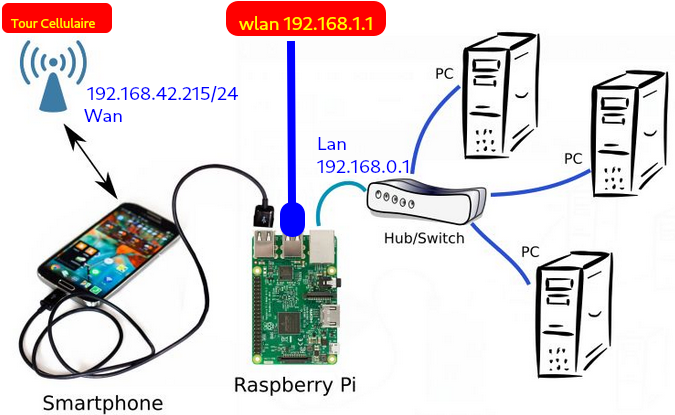{:width="600"}  
*Mettre en place d’OpenWRT sur un Raspberry Pi pour réaliser une box 4G*  

### Flash SDcard avec image RPI OpenWRT

Télécharger une image d’[OpenWRT compatible avec votre version de Raspberry Pi](https://openwrt.org/toh/raspberry_pi_foundation/raspberry_pi) (1, 2, 3, 4, Zero) 

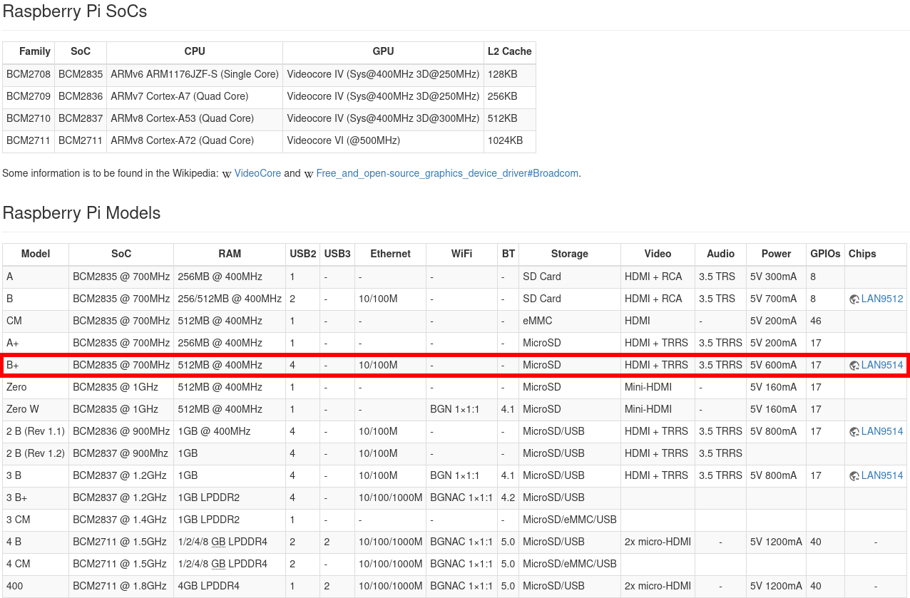{:width="600"}  

**Raspberry PI B+ : https://downloads.openwrt.org/releases/21.02.1/targets/bcm27xx/bcm2708/openwrt-21.02.1-bcm27xx-bcm2708-rpi-ext4-factory.img.gz**  

Insérer une sdcard dans le lecteur USB/SDcard et en mode su `dmesg` pour visualiser les messages du kernel et ainsi connaitre le nom de périphérique de la carte SD (/dev/sdb ou /dev/sdf…etc)  
La carte SD est sur `/dev/sdc` (dans mon cas)  
Flasher la SDcard

    sudo dd if=openwrt-21.02.1-bcm27xx-bcm2708-rpi-ext4-factory.img of=/dev/sdd bs=2M conv=fsync

### OpenWrt/Raspberry PI B+

Insérer la SDcard dans le Raspberry Pi raccordé au réseau et le dongle Wifi USB Ralink RT5370  
On va utiliser un adaptateur USB/Serial et l'application minicom pour se connecter via le port série en utilisant le connecteur GPIO (Pin 6 = Ground, Pin 8 = TX, Pin 10 = RX).
{: .prompt-info }

Il faut paramétrer le routeur OpenWRT pour un accès au réseau existant afin de mettre à jour et installer les applications

* Le routeur freebox est à l'adresse 192.168.0.1  
* OpenWRT esr par défaut à l'adresse 192.168.1.1   

On se met en écoute sur la liaison

    sudo minicom
    # OUsu
    sudo screen /dev/ttyUSB0 115200

Mettre sous tension le rasberry

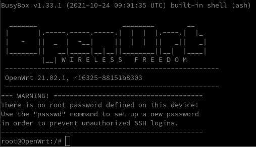{:width="400"}  
Créer le mot de passe root (Par défaut, le mot de passe est vide.) : `passwd`

**Modifier l'adresse IP : 192.168.1.1 &rarr; 192.168.0.1**  
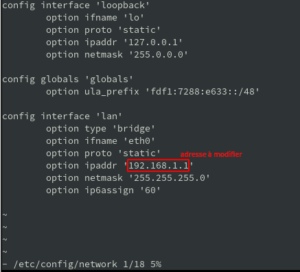{:width="400"}  

    vi /etc/config/network

Appuyez sur la touche "i" de votre clavier pour activer le mode édition, puis modifiez l'adresse IP comme vous le souhaitez.  192.168.1.1 &rarr; 192.168.0.1  

```
config interface 'loopback'
        option ifname 'lo'
        option proto 'static'
        option ipaddr '127.0.0.1'
        option netmask '255.0.0.0'

config globals 'globals'
        option ula_prefix 'fdc4:62ff:57c6::/48'

config interface 'lan'
        option type 'bridge'
        option ifname 'eth0'
        option proto 'static'
        option ipaddr '192.168.0.1'
        option netmask '255.255.255.0'
        option ip6assign '60'
```

Appuyez sur la touche "Esc", tapez :wq (w signifie écrire, q signifie quitter), puis appuyez sur ENTER pour appliquer.   
tapez `reboot` pour redémarrer votre routeur, puis vous pourrez vous connecter à votre routeur avec la nouvelle adresse IP en ssh : `ssh root@192.168.0.1`

Vérification  

    ip a  

```
1: lo: <LOOPBACK,UP,LOWER_UP> mtu 65536 qdisc noqueue state UNKNOWN qlen 1000   
    link/loopback 00:00:00:00:00:00 brd 00:00:00:00:00:00                       
    inet 127.0.0.1/8 scope host lo                                              
       valid_lft forever preferred_lft forever                                  
    inet6 ::1/128 scope host                                                    
       valid_lft forever preferred_lft forever                                  
2: eth0: <BROADCAST,MULTICAST,UP,LOWER_UP> mtu 1500 qdisc fq_codel master br-la0
    link/ether b8:27:eb:66:0e:13 brd ff:ff:ff:ff:ff:ff                          
3: br-lan: <BROADCAST,MULTICAST,UP,LOWER_UP> mtu 1500 qdisc noqueue state UP ql0
    link/ether b8:27:eb:66:0e:13 brd ff:ff:ff:ff:ff:ff                          
    inet 192.168.0.1/24 brd 192.168.0.255 scope global br-lan                   
       valid_lft forever preferred_lft forever                                  
    inet6 fdec:830e:614e::1/60 scope global noprefixroute                       
       valid_lft forever preferred_lft forever                                  
    inet6 fe80::ba27:ebff:fe66:e13/64 scope link                                
       valid_lft forever preferred_lft forever                                  
```

**Ouvrez ensuite un navigateur et accédez à l'IP du Routeur (http://192.168.0.1).  

ATTENTION À UTILISER HTTP ET NON HTTPS
{: .prompt-warning }

Se connecter "root" au WebUI  
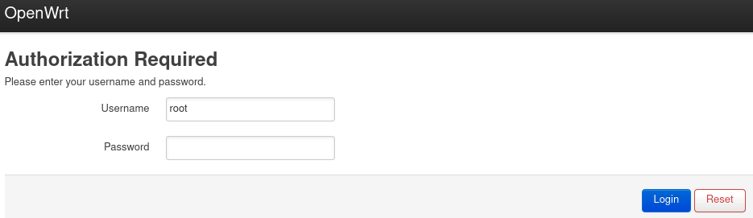{:width="600"}  
Allez sur **Network &rarr; Interfaces**  
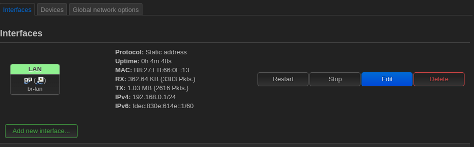{:width="600"}  
Cliquez sur **Edit** et ajoutez un gateway 192.168.0.254 pour  les mises à jour applications  
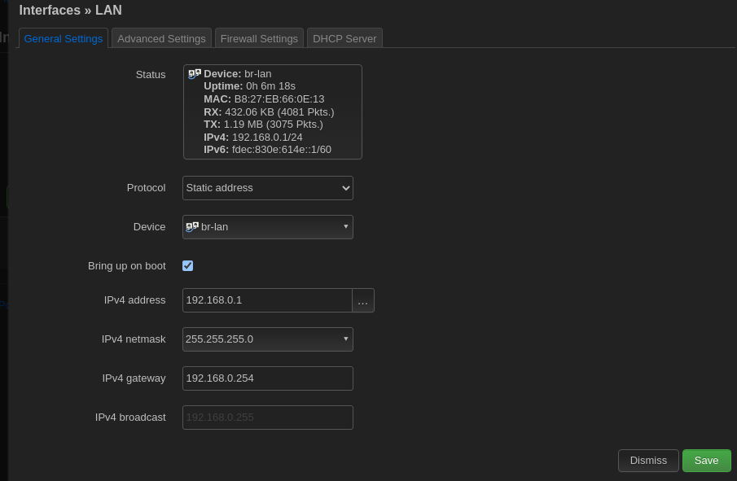{:width="600"}  
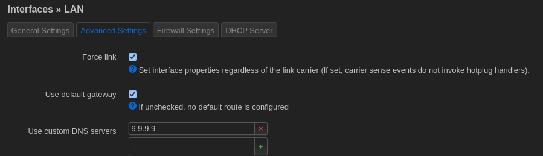{:width="600"}  
Cliquez sur **Save** puis **Save & Apply**  

### Agrandir la taille du disque

La taille actuelle est restreinte

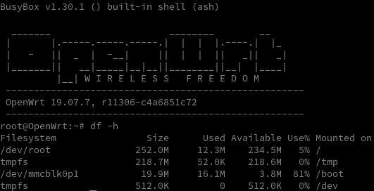

[Plus d'espace pour les paquets avec extroot sur votre routeur OpenWrt](https://samhobbs.co.uk/2013/11/more-space-for-packages-with-extroot-on-your-openwrt-router)

Les [pages du wiki OpenWrt](http://wiki.openwrt.org/doc/howto/extroot) sur ce sujet sont très bonnes. Si vous souhaitez en savoir plus sur les différentes options, jetez-y un coup d'oeil (par exemple, il est possible de monter le disque USB sur /opt et d'installer des extras ici, mais certains paquets s'attendent à être installés en root et ne se comporteront pas correctement).

Au cas où vous voudriez le vérifier plus tard, le type d'extroot dont je parle ici est le root externe (alias pivot root), et non le overlay externe (alias pivot-overlay).

**Traitement**

Cela suppose que vous avez déjà formaté votre disque USB externe avec un système de fichiers de journalisation (comme EXT3 ou EXT4). Si ce n'est pas le cas, faites-le d'abord (les gestionnaires de partition d'Ubuntu et de Kubuntu le font très facilement, faites une recherche google pour un tutoriel si vous n'êtes pas sûr de savoir comment le faire).

Pour utiliser la racine pivot, vous devez utiliser une version d'OpenWrt qui est plus récente que la v12 (donc 12.09 Attitude Adjustment est bien, mais Backfire ne l'est pas).

Tout d'abord, connectez-vous à OpenWrt via ssh ou telnet.

```
BusyBox v1.30.1 () built-in shell (ash)

  _______                     ________        __
 |       |.-----.-----.-----.|  |  |  |.----.|  |_
 |   -   ||  _  |  -__|     ||  |  |  ||   _||   _|
 |_______||   __|_____|__|__||________||__|  |____|
          |__| W I R E L E S S   F R E E D O M
 -----------------------------------------------------
 OpenWrt 19.07.7, r11306-c4a6851c72
 -----------------------------------------------------
```

**Installez les paquets**

Tout d'abord, installez le paquet qui fera passer votre racine de la mémoire flash intégrée du routeur au périphérique flash USB externe :

    opkg update
    opkg install block-mount

**Copiez votre système de fichiers racine actuel sur la clé USB.**

Avant de faire cela, assurez-vous que votre routeur est sécurisé (par exemple, la connexion SSH n'est pas possible depuis le WAN, les interfaces wifi sont protégées par un mot de passe, etc).

>Ceci est important car si quelque chose ne va pas au démarrage de votre routeur, OpenWrt sera incapable de démarrer sur la clé USB, vous laissant avec votre configuration actuelle jusqu'à ce que vous puissiez le faire démarrer correctement sur la clé USB.

Tout d'abord, installez fdisk, un outil qui vous donne des informations sur les périphériques attachés :

    opkg update
    opkg install fdisk

Maintenant, insérez votre clé USB et exécutez la commande suivante pour obtenir quelques détails sur elle :

    fdisk -l

```
[...]
Disk /dev/sda: 14.33 GiB, 15376318464 bytes, 30031872 sectors
Disk model:  SanDisk 3.2Gen1
Units: sectors of 1 * 512 = 512 bytes
Sector size (logical/physical): 512 bytes / 512 bytes
I/O size (minimum/optimal): 512 bytes / 512 bytes
Disklabel type: dos
Disk identifier: 0x00000000

Device     Boot Start      End  Sectors  Size Id Type
/dev/sda1        2048 30031871 30029824 14.3G 83 Linux
```

Vous voyez votre lecteur USB listé sous "Device". Maintenant, créez un point de montage pour le disque. Vous pouvez choisir ce que vous voulez à la place de sda1, rappelez-vous simplement ce que vous avez choisi plus tard !

    mkdir /mnt/sda1

Montez le disque sur le point de montage que vous venez de créer  

    mount /dev/sda1 /mnt/sda1

Maintenant, copiez le système de fichiers racine de la mémoire flash intégrée du routeur vers la clé USB avec ces commandes (si vous avez choisi un nom autre que /mnt/sda1 à l'étape précédente, remplacez /mnt/sda1 à la ligne 3) :

```bash
mkdir -p /tmp/cproot
mount --bind / /tmp/cproot
tar -C /tmp/cproot -cvf - . | tar -C /mnt/sda1 -xf -
umount /tmp/cproot
```

Vous avez maintenant une clé USB avec une copie du système de fichiers de votre routeur. L'étape suivante consiste à faire en sorte qu'elle se monte automatiquement au démarrage, et à l'utiliser en tant que root.

**Configuration de /etc/config/fstab**

Si nano n'est pas installé, vous pouvez utiliser vi (qui est installé par défaut) ou vous pouvez simplement installer nano avec :

    opkg update && opkg install nano

Ouvrez /etc/config/fstab avec votre éditeur de texte préféré :

    nano /etc/config/fstab

Ajoutez ce qui suit au fichier :

```
config 'mount'
        option target        /
        option device        /dev/sda1
        option fstype        ext4
        option options       rw,sync
        option enabled       1
        option enabled_fsck  0
```

**Redémarrage et vérification**

    reboot

Lorsque vous redémarrez, vous devriez maintenant exécuter OpenWrt depuis votre clé USB.

Vérifiez vos montages actuels avec cette commande :

    mount

```
/dev/root on /rom type ext4 (ro,noatime)
proc on /proc type proc (rw,nosuid,nodev,noexec,noatime)
sysfs on /sys type sysfs (rw,nosuid,nodev,noexec,noatime)
tmpfs on /tmp type tmpfs (rw,nosuid,nodev,noatime)
/dev/sda1 on / type ext4 (rw,sync,relatime,data=ordered)
/dev/mmcblk0p1 on /boot type vfat (rw,noatime,fmask=0022,dmask=0022,codepage=437,iocharset=iso8859-1,shortname=mixed,errors=remount-ro)
tmpfs on /dev type tmpfs (rw,nosuid,relatime,size=512k,mode=755)
devpts on /dev/pts type devpts (rw,nosuid,noexec,relatime,mode=600,ptmxmode=000)
debugfs on /sys/kernel/debug type debugfs (rw,noatime)
```

Voyez combien d'espace vous avez créé pour les paquets avec cette commande :

    df -h

```
Filesystem                Size      Used Available Use% Mounted on
/dev/root               252.0M     14.4M    232.4M   6% /rom
tmpfs                   218.7M     76.0K    218.6M   0% /tmp
/dev/sda1                 3.6G     14.4M      3.4G   0% /
/dev/mmcblk0p1           19.9M     16.1M      3.8M  81% /boot
tmpfs                   512.0K         0    512.0K   0% /dev
```

### Wifi USB Ralink RT5370

**Installer les pilotes du dongle Wifi USB Ralink RT5370**  
[RPi 3 + Ralink RT5370 USB wifi adapter [SOLVED]](https://forum.openwrt.org/t/rpi-3-ralink-rt5370-usb-wifi-adapter-solved/87382/2)  
Installer les drivers  

```bash
opkg update && opkg install kmod-rt2800-lib kmod-rt2800-usb kmod-rt2x00-lib kmod-rt2x00-usb
```

Redémarrer le routeur pour la prise en compte `reboot`  
Vérification

```bash
root@OpenWrt:~# ip a
[...]
3: wlan0: <BROADCAST,MULTICAST> mtu 1500 qdisc noop state DOWN qlen 1000
    link/ether 00:0f:00:3b:2e:31 brd ff:ff:ff:ff:ff:ff
[...]
```

Par le web **Network &rarr; Interfaces  LAN**  
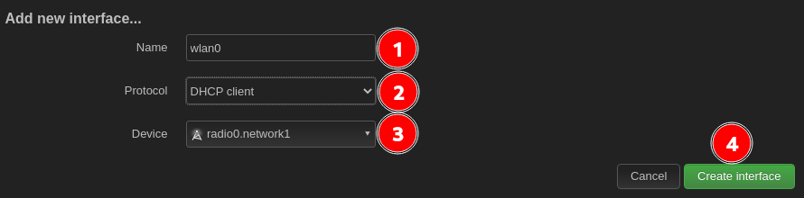{:width="600"}  
Cliquez sur **Edit**, vérifiez ou modifiez    
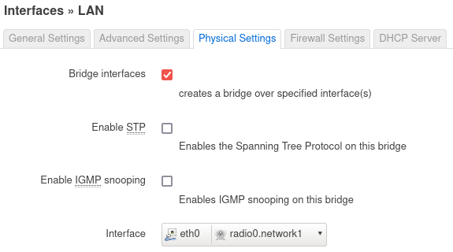{:width="600"}  
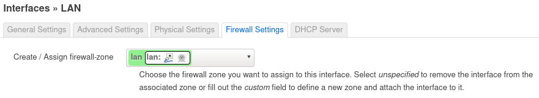{:width="600"}  
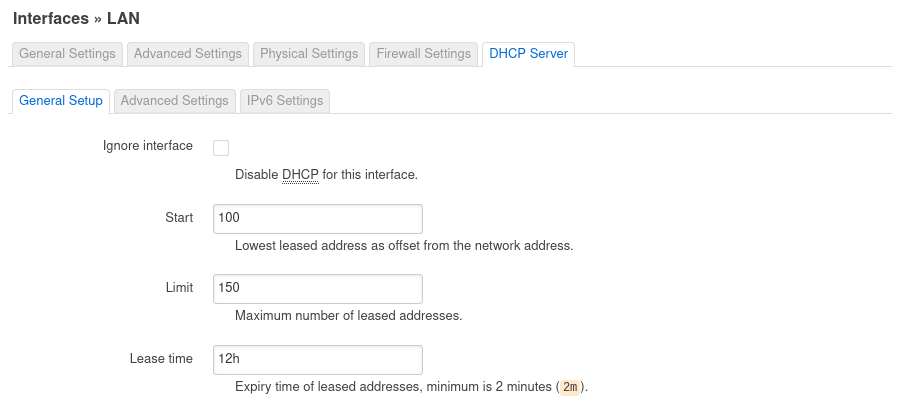{:width="600"}  

## Routeur 4G

### Connexion USB d'un smartphone

* [Smartphone USB tethering](https://openwrt.org/docs/guide-user/network/wan/smartphone.usb.tethering)

Le **tethering** USB est utilisé pour connecter votre routeur OpenWrt à Internet en utilisant votre smartphone. C'est plus pratique et plus performant (latence plus faible) que de transformer votre smartphone en point d'accès et de l'utiliser. Cela représente également une charge CPU moindre pour votre téléphone, recharge votre téléphone et vous permet de faire des choses avec votre routeur OpenWrt que vous ne pouvez pas faire avec votre téléphone, comme connecter facilement plusieurs appareils, avec ou sans fil, les uns aux autres et à Internet. Afin de maximiser les performances, vous devez désactiver le Wi-Fi et le Bluetooth de votre téléphone connecté.

Connexion SSH root

    ssh root@192.168.0.1

Fournir le support du tethering USB pour Android 8/10 avec RNDIS : 

    opkg update && opkg install kmod-usb-net-rndis

**Connecter le smartphone au port USB du routeur** à l'aide du câble USB, puis activez l'option USB Tethering dans les paramètres d'Android. Activez les options de développement du téléphone **Trouvez les informations de construction dans le menu À propos du téléphone, et appuyez rapidement sur 7 x**. Il y a une configuration USB par défaut : USB Tethering.   
Paramètres &rarr; Réseau et Internet  
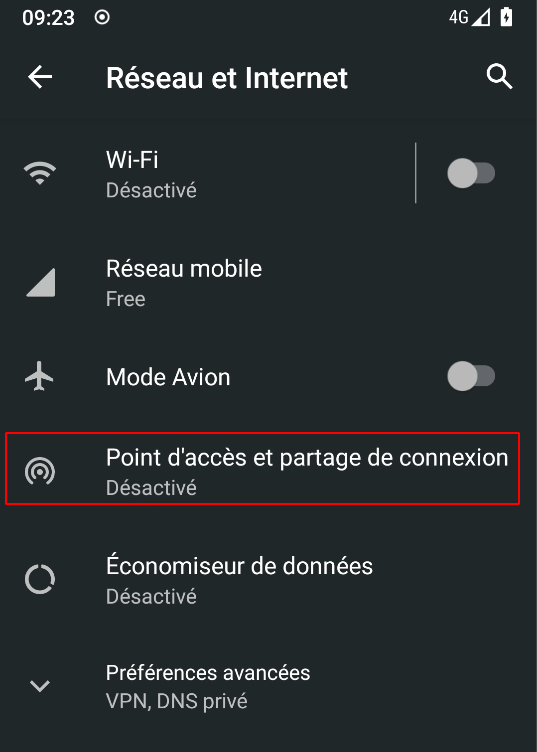{:height="200"} 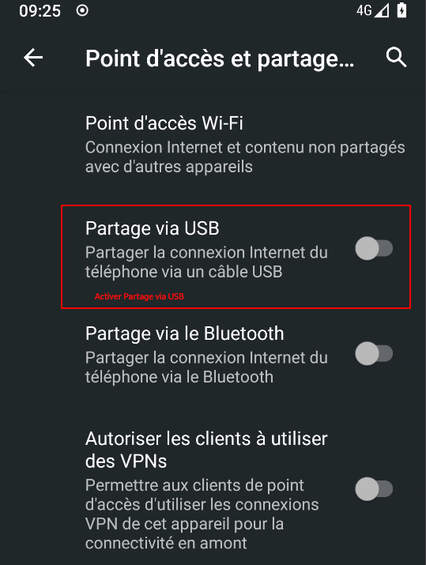{:height="200"}  

Le téléphone activera immédiatement le mode Tethering USB lorsqu'il sera branché sur un routeur ( ou un ordinateur portable) configuré, sans autre commande. Cependant, il est nécessaire d'enlever le verrouillage de l'écran du téléphone. Un téléphone verrouillé ne pourra pas démarrer le mode de connexion USB par lui-même.

Pour les IPhones, vous devrez peut-être désactiver et réactiver le paramètre Personal Hotspot/Allow Others to Join sur l'IPhone pour forcer le client DHCP d'OpenWrt à obtenir une adresse IP de l'interface eth1 de l'IPhone. Désactiver et réactiver le paramètre Personal Hotspot/Allow Others to Join sur l'IPhone est également nécessaire si vous déconnectez l'IPhone du port USB d'OpenWrt et le reconnectez plus tard, à moins que vous ne mettiez en cache les Trust records (voir la section watchdog et/ou le lien github de LeJeko ci-dessous).

### Activer "Tethering" sur le routeur

**En ligne de commande**

Sur le routeur, entrez :

```bash
# Activez le tethering
uci set network.wan.ifname="usb0"
uci set network.wan6.ifname="usb0"
uci commit network
/etc/init.d/network restart
```

>Pour les IPhones, remplacez le nom de l'interface usb* par eth* selon le routeur.

Tout devrait fonctionner à ce stade.  

### Point d'accès Wifi

*Pour activer les connexions sans fil au routeur, allez dans Network, Wireless et définissez puis activez les interfaces.  
Configurer le wifi en point d'accès par le web*  

Allez sur **Network &rarr; Wireless** 

Supprimer l'existant  
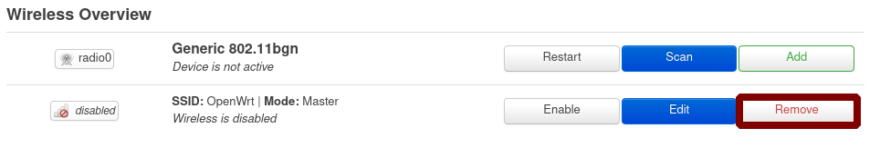{:width="400"}  

ajoutez un nouveau SSID appelé "guest" associé à un réseau appelé "invite" également.   
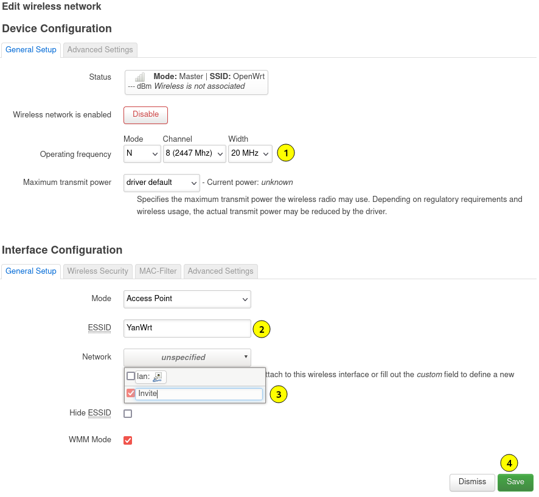{:width="600"}  
Spécifier le code pays (dans mon cas, la France) afin que votre appareil soit conforme aux règles internationales établies (Advanced settings).  
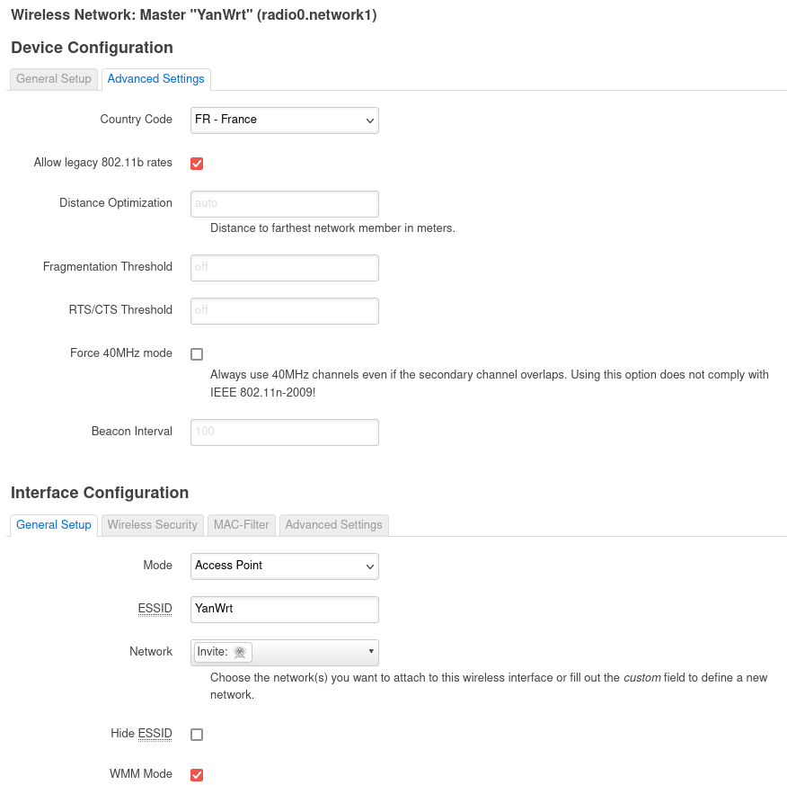{:width="600"}  
Configuer la sécurité wpa2  
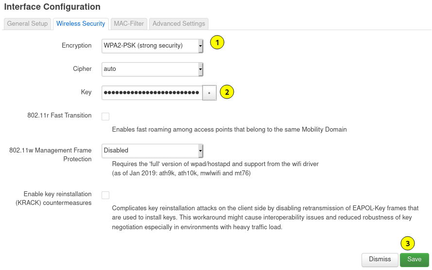{:width="600"}  

Cliquer sur "**Save**" puis "**Save & Apply**" et vous devriez maintenant avoir un tout nouveau SSID (voir ci-dessous).   
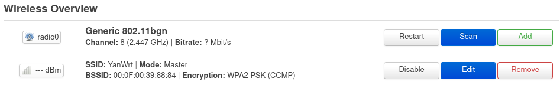{:width="600"}  


**Interface Web (Par défaut)**

Allez dans **Network &rarr; Interfaces**. Créez une nouvelle interface (**Add new interface**) appelée **TetheringWAN**, et associez-y le nouveau périphérique réseau *usb0* (ou dans certains cas '*eth1*, vérifiez ce que le journal indique dans votre cas), définissez le protocole en mode **client DHCP** ou en mode **client DHCPv6** si le FAI attribue l'IPv6, et sous l'onglet Paramètres du pare-feu, placez-le dans la zone WAN. Enregistrez les modifications.

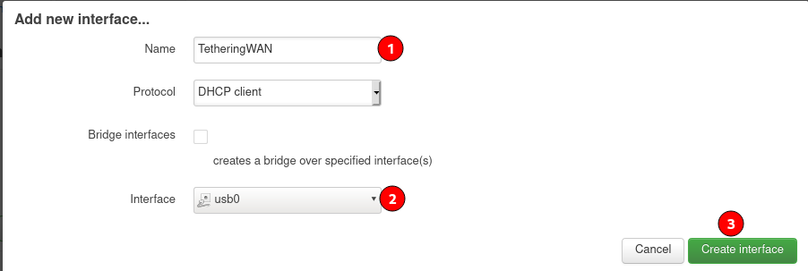{:width="400"}  
Créer l'interface **TetheringWAN**.  
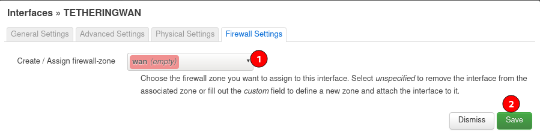{:width="400"}  
onglet **Firewall Settings** de l'assistant de création d'interface. Il est très important de le définir comme **WAN**.  
Cliquez sur **Save** puis  **Save & Apply**  
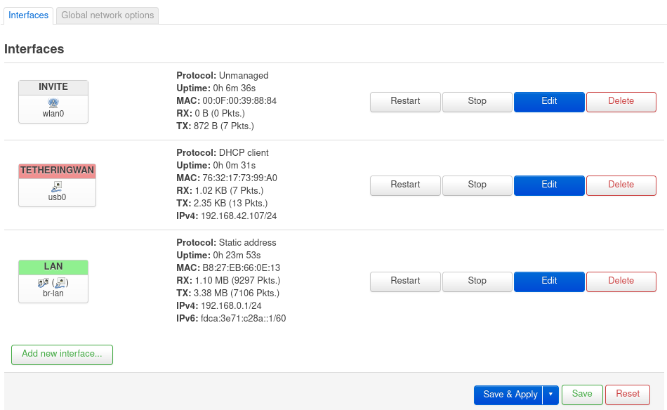{:width="600"}  

**TRES IMPORTANT:**  
Il faut <u>supprimer le gateway et les adresses dns du routeur</u> et vérifier ou passer l'adresse ip fixe en 192.168.0.1 (Static address)    

**Network &rarr; Interfaces Lan Edit &rarr; General Settings**   
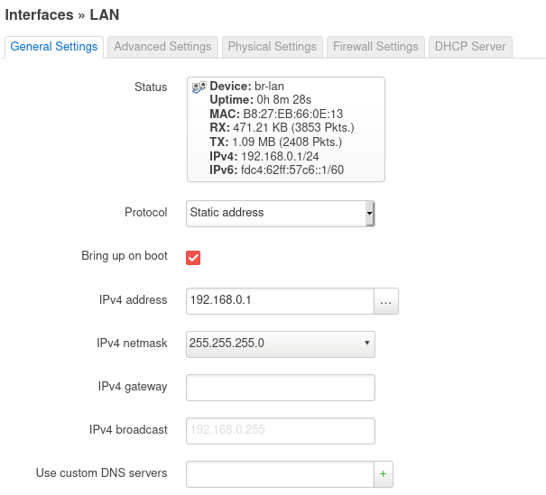{:width="400"}  
"save"  
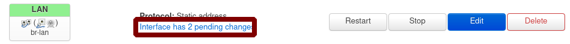{:width="400"}  
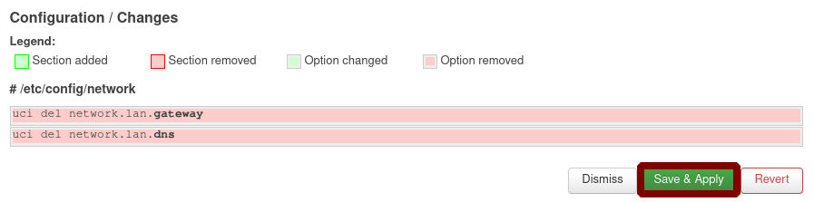{:width="400"}  

Interface **Invite**, allez sur **Network &rarr; Interface &rarr. INVITE Edit**  
{:width="600"}  

Sous **General Settings**, changer the protocol de "Unmanaged" to "Static address"   
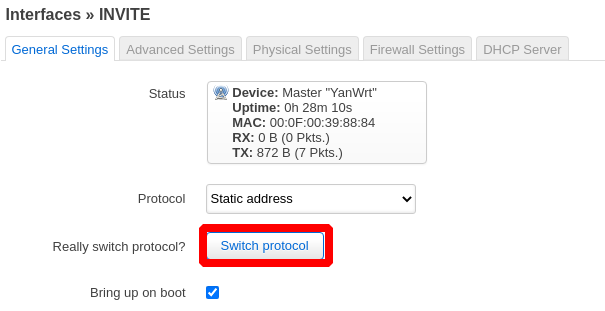{:width="400"}  

Puis cliquer sur "**Switch protocol**" et configurer adresse IP et netmask de l'interface Guest  
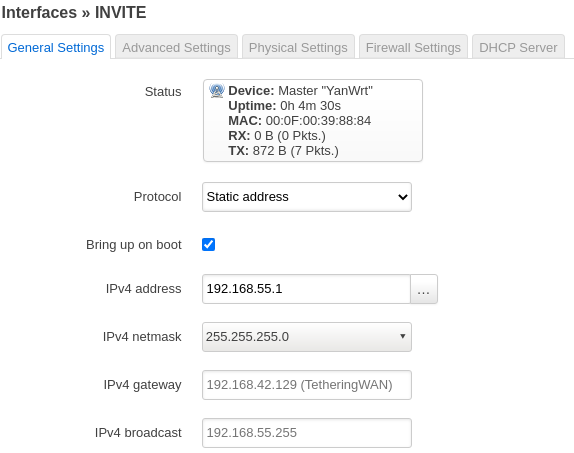{:width="400"}  

ATTENTION !! Il faut un autre réseau que celui du lan :  
LAN &rarr; 192.168.0.1  
INVITE &rarr; 192.168.55.1  
{: .prompt-warning }

Cliquer sur l'onglet **Physical Settings** puis valider Bridge interfaces interface wlan0  
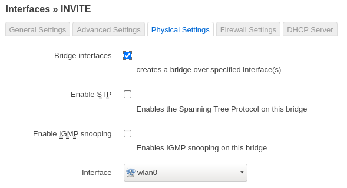{:width="400"}  
Onglet **DHCP Server** , cliquez sur **Setuo DHCP Server** à l'interface   
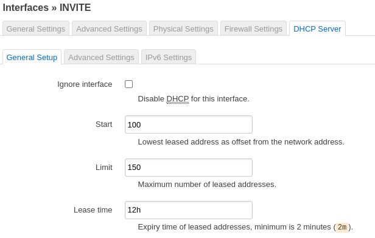{:width="400"}  
Cliquez sur **Save** puis "**Save and Apply**" 

### Network &rarr; Firewall  

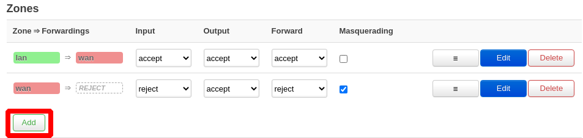{:width="600"}  
Cliquer sur "**Add**" pour ajouter "Invite"  
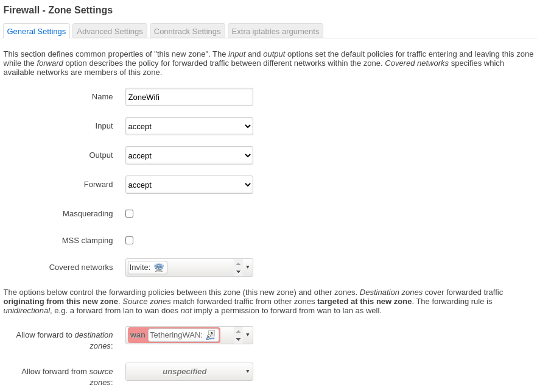{:width="600"}  
Cliquer sur **Save** puis sur ***Save & Apply**  
Vos retrouvez l'équivalent au contexte ci-dessous  
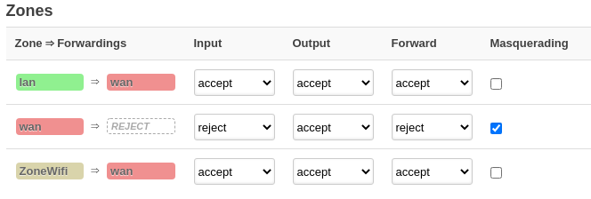{:width="600"}   


**Les options input et output** définissent les politiques par défaut pour le trafic entrant et sortant de cette zone tandis que l'option forward décrit la politique pour le trafic transféré entre les différents réseaux de la zone. Les réseaux couverts spécifient les réseaux disponibles qui sont membres de cette zone.  
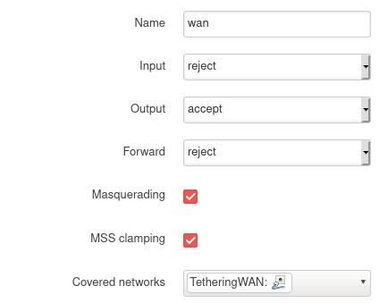{:width="200"} 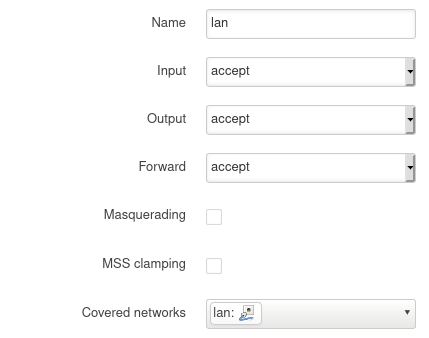{:width="200"} 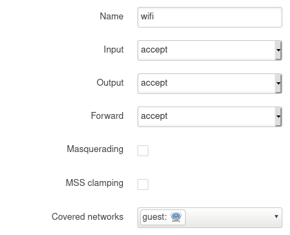{:width="200"}  
**Les options ci-dessous** contrôlent les politiques de transfert entre cette zone (wan) et les autres zones. Les zones de destination couvrent le trafic transféré provenant de wan. Les zones sources correspondent au trafic transféré provenant d'autres zones et destiné à wan. La règle de transfert est unidirectionnelle, c'est-à-dire qu'un transfert de lan vers wan n'implique pas une permission de transfert de wan vers lan également.  
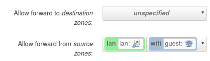{:width="200"} 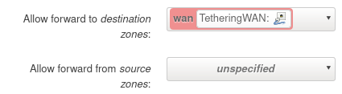{:width="200"} 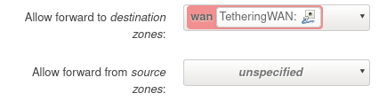{:width="200"}  
{: .prompt-info }


## Fichiers configuration OpenWRT

```
BusyBox v1.30.1 () built-in shell (ash)

  _______                     ________        __
 |       |.-----.-----.-----.|  |  |  |.----.|  |_
 |   -   ||  _  |  -__|     ||  |  |  ||   _||   _|
 |_______||   __|_____|__|__||________||__|  |____|
          |__| W I R E L E S S   F R E E D O M
 -----------------------------------------------------
 OpenWrt 19.07.7, r11306-c4a6851c72
 -----------------------------------------------------
root@OpenWrt:/# ls /etc/config
dhcp      firewall  luci      rpcd      ucitrack  wireless
dropbear  fstab     network   system    uhttpd
```

### Lan eth0 192.168.0.0/24

Situés sous `/etc/config/`  
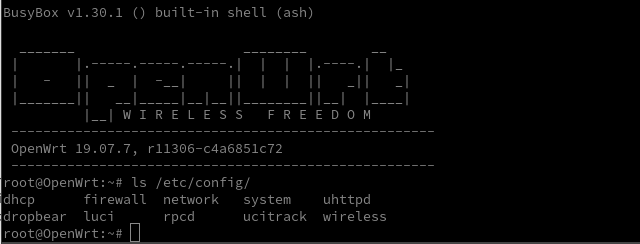{:width="500"}  

    /etc/config/network 

```bash
config interface 'loopback'
	option ifname 'lo'
	option proto 'static'
	option ipaddr '127.0.0.1'
	option netmask '255.0.0.0'

config globals 'globals'
	option ula_prefix 'fdca:3e71:c28a::/48'

config interface 'lan'
	option type 'bridge'
	option ifname 'eth0'
	option proto 'static'
	option ipaddr '192.168.0.1'
	option netmask '255.255.255.0'
	option ip6assign '60'
	option gateway '192.168.0.254'
	list dns '1.1.1.1'

config interface 'Invite'
	option proto 'static'
	option netmask '255.255.255.0'
	option type 'bridge'
	option ipaddr '192.168.55.1'

config interface 'TetheringWAN'
	option ifname 'usb0'
	option proto 'dhcp'
```

    /etc/config/wireless 

```bash
config wifi-device 'radio0'
	option type 'mac80211'
	option hwmode '11g'
	option path 'platform/soc/20980000.usb/usb1/1-1/1-1.2/1-1.2:1.0'
	option htmode 'HT20'
	option channel '8'
	option country 'FR'

config wifi-iface 'wifinet0'
	option device 'radio0'
	option mode 'ap'
	option ssid 'YanWrt'
	option network 'Invite'
	option key 'xxxxxxxxxxxxxxxxxxxx'
	option encryption 'psk2'
```

    /etc/config/dhcp

```bash
config dnsmasq
	option domainneeded '1'
	option boguspriv '1'
	option filterwin2k '0'
	option localise_queries '1'
	option rebind_protection '1'
	option rebind_localhost '1'
	option local '/lan/'
	option domain 'lan'
	option expandhosts '1'
	option nonegcache '0'
	option authoritative '1'
	option readethers '1'
	option leasefile '/tmp/dhcp.leases'
	option resolvfile '/tmp/resolv.conf.auto'
	option nonwildcard '1'
	option localservice '1'

config dhcp 'lan'
	option interface 'lan'
	option start '100'
	option limit '150'
	option leasetime '12h'
	option dhcpv6 'server'
	option ra 'server'
	option ra_management '1'

config dhcp 'wan'
	option interface 'wan'
	option ignore '1'

config odhcpd 'odhcpd'
	option maindhcp '0'
	option leasefile '/tmp/hosts/odhcpd'
	option leasetrigger '/usr/sbin/odhcpd-update'
	option loglevel '4'

config dhcp 'Invite'
	option start '100'
	option leasetime '12h'
	option limit '150'
	option interface 'Invite'
```

    /etc/config/firewall

```bash
config defaults
	option input 'ACCEPT'
	option output 'ACCEPT'
	option forward 'REJECT'
	option synflood_protect '1'

config zone
	option name 'lan'
	list network 'lan'
	option input 'ACCEPT'
	option output 'ACCEPT'
	option forward 'ACCEPT'

config zone
	option name 'wan'
	option input 'REJECT'
	option output 'ACCEPT'
	option forward 'REJECT'
	option masq '1'
	option mtu_fix '1'
	option network 'wan wan6 TetheringWAN'

config forwarding
	option src 'lan'
	option dest 'wan'

config rule
	option name 'Allow-DHCP-Renew'
	option src 'wan'
	option proto 'udp'
	option dest_port '68'
	option target 'ACCEPT'
	option family 'ipv4'

config rule
	option name 'Allow-Ping'
	option src 'wan'
	option proto 'icmp'
	option icmp_type 'echo-request'
	option family 'ipv4'
	option target 'ACCEPT'

config rule
	option name 'Allow-IGMP'
	option src 'wan'
	option proto 'igmp'
	option family 'ipv4'
	option target 'ACCEPT'

config rule
	option name 'Allow-DHCPv6'
	option src 'wan'
	option proto 'udp'
	option src_ip 'fc00::/6'
	option dest_ip 'fc00::/6'
	option dest_port '546'
	option family 'ipv6'
	option target 'ACCEPT'

config rule
	option name 'Allow-MLD'
	option src 'wan'
	option proto 'icmp'
	option src_ip 'fe80::/10'
	list icmp_type '130/0'
	list icmp_type '131/0'
	list icmp_type '132/0'
	list icmp_type '143/0'
	option family 'ipv6'
	option target 'ACCEPT'

config rule
	option name 'Allow-ICMPv6-Input'
	option src 'wan'
	option proto 'icmp'
	list icmp_type 'echo-request'
	list icmp_type 'echo-reply'
	list icmp_type 'destination-unreachable'
	list icmp_type 'packet-too-big'
	list icmp_type 'time-exceeded'
	list icmp_type 'bad-header'
	list icmp_type 'unknown-header-type'
	list icmp_type 'router-solicitation'
	list icmp_type 'neighbour-solicitation'
	list icmp_type 'router-advertisement'
	list icmp_type 'neighbour-advertisement'
	option limit '1000/sec'
	option family 'ipv6'
	option target 'ACCEPT'

config rule
	option name 'Allow-ICMPv6-Forward'
	option src 'wan'
	option dest '*'
	option proto 'icmp'
	list icmp_type 'echo-request'
	list icmp_type 'echo-reply'
	list icmp_type 'destination-unreachable'
	list icmp_type 'packet-too-big'
	list icmp_type 'time-exceeded'
	list icmp_type 'bad-header'
	list icmp_type 'unknown-header-type'
	option limit '1000/sec'
	option family 'ipv6'
	option target 'ACCEPT'

config rule
	option name 'Allow-IPSec-ESP'
	option src 'wan'
	option dest 'lan'
	option proto 'esp'
	option target 'ACCEPT'

config rule
	option name 'Allow-ISAKMP'
	option src 'wan'
	option dest 'lan'
	option dest_port '500'
	option proto 'udp'
	option target 'ACCEPT'

config include
	option path '/etc/firewall.user'

config zone
	option name 'ZoneWifi'
	option input 'ACCEPT'
	option forward 'ACCEPT'
	option network 'Invite'
	option output 'ACCEPT'

config forwarding
	option dest 'wan'
	option src 'ZoneWifi'
```

---

### Lan eth0 192.168.2.0/24

Modifier     /etc/config/network   
Remplacer dans `config interface 'lan'`  :   
`option ipaddr '192.168.0.1'`  &rarr; `option ipaddr '192.168.2.1'`

Redémarrer le routeur

## Wireguard

*Installer wireguard Mullvad sur le routeur*  
[OpenWrt - WireGuard sur un routeur 4G Raspberry Pi](http://lxcdeb:8080/2021/04/16/WireGuard_sur_un_routeur.html)

## Upgrade OpenWRT

[OpenWRT : Gérer correctement le processus de mise à niveau (sysupgrade)](https://doc.huc.fr.eu.org/fr/sys/openwrt/sysupgrade/)

Le procédé suivant explique pas-à-pas la mise à niveau tout en mode CLI ! 

La première chose à laquelle nous veillons est d’installer l’outil curl, car par défaut le binaire wget nativement installé ne supporte pas TLS.

    opkg install curl

Ensuite, nous récupèrons ce script fort utile opkgscript.sh :

    curl -O https://raw.githubusercontent.com/richb-hanover/OpenWrtScripts/master/opkgscript.sh

Et, nous donnons les droits d’exécution nécessaire :

    chmod 0700 opkgscript.sh

on sauvegarde la liste des paquets installés - pour pouvoir restaurer après la mise à niveau système :

    ./opkgscript.sh -v write
    # Saving package list to /etc/config/opkg.installed

Le script écrit la liste dans un fichier /etc/config/opkg.installed.  

Récupèrons la nouvelle version du [firmware pour Raspberry PI B+](https://openwrt.org/toh/raspberry_pi_foundation/raspberry_pi)

    v="21.02.0"
    curl -O http://downloads.openwrt.org/releases/"${v}"/targets/bcm27xx/bcm2708/openwrt-"${v}"-bcm27xx-bcm2708-rpi-ext4-sysupgrade.img.gz

