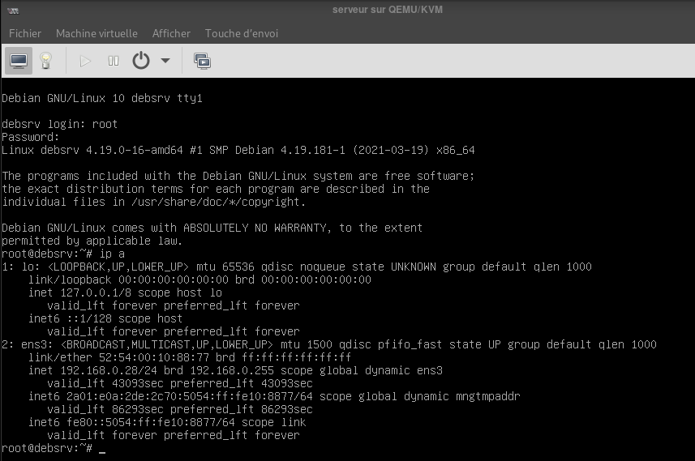
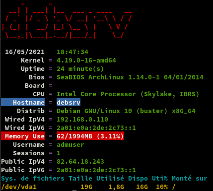

+++
title = 'Installer un serveur debian virtuel (debsrv) sur un poste archlinux'
date = 2021-12-17 00:00:00 +0100
categories = ['virtuel']
+++
*qemu kvm sont installés*  
[Comment installer une image virtuelle KVM sur un serveur Debian Linux 9 Headless (sans affichage)](/posts/Comment-installer-une-image-virtuelle-KVM-sur-un-serveur-Debian-Linux-9-Headless-(sans-affichage)/)  
[15 virt-install examples | KVM virtualization commands cheatsheet](https://www.golinuxcloud.com/virt-install-examples-kvm-virt-commands-linux/#11_virtinstall_graphics_with_VNC_Viewer)


## Serveur debian virtuel 

{:width="100"}

### Installation

Les images de type qcow2 : `/home/yann/virtuel/KVM/`   
Réseau interface bridge **host-bridge**  
Image ISO : `/home/yann/iso/debian/buster/debian-10.9.0-amd64-netinst.iso`  

Création d'un disque virtuel de 20G

    qemu-img create -f qcow2 /home/yann/virtuel/KVM/serveur.qcow2 20G

Le réseau de la machine "host" dispose d'un pont br0

    ip a

```
3: br0: <BROADCAST,MULTICAST,UP,LOWER_UP> mtu 1500 qdisc noqueue state UP group default qlen 1000
    link/ether 02:59:72:85:78:97 brd ff:ff:ff:ff:ff:ff
    inet 192.168.0.43/24 brd 192.168.0.255 scope global dynamic noprefixroute br0
       valid_lft 41046sec preferred_lft 41046sec
    inet6 2a01:e0a:2de:2c70:2ef:8c64:a63a:bf7b/64 scope global dynamic noprefixroute 
       valid_lft 86318sec preferred_lft 86318sec
    inet6 fe80::bcd4:8ecb:cdd6:5d63/64 scope link noprefixroute 
       valid_lft forever preferred_lft forever
```

Configurer un domaine invité KVM sur un réseau ponté.  
Créez un fichier nommé bridge.xml

    sudo nano /root/bridged.xml

Et ajouter la configuration suivante

```xml
<network>
  <name>host-bridge</name>
  <forward mode="bridge"/>
  <bridge name="br0"/>
</network>
```

exécuter

    sudo virsh net-define --file /root/bridged.xml  # Réseau br0 défini depuis /root/bridged.xml
    sudo virsh net-autostart br0                  # Réseau br0 marqué en démarrage automatique
    sudo virsh net-start br0                      # Réseau br0 démarré

Voir le réseau en activité

    sudo virsh net-list --all

```
 Nom           État      Démarrage automatique   Persistent
-------------------------------------------------------------
 default       inactif   no                      Oui
 host-bridge   actif     Oui                     Oui
```


Créer une machine virtuelle 'archlinux' avec 2 Go de RAM, 2 CPU, 1 nic et 20 Go d’espace disque

```
sudo virt-install \
--virt-type=kvm \
--name bustersrv \
--ram 2048 \
--vcpus=2 \
--virt-type=kvm \
--hvm \
--cdrom=/home/yann/iso/debian/buster/debian-10.9.0-amd64-netinst.iso \
--disk path=/home/yann/virtuel/KVM/serveur.qcow2,size=20,bus=virtio,format=qcow2 \
--network bridge=br0,model=virtio \
--graphics vnc \
-v
```

**Installer Serveur Debian**  
langue et clavier : France  
Nom de la machine : debsrv  
Root : xxxxx  
Utilisateur : admuser  
Mot de passe : admuser49  
Partionnement : Disque entier  
Tout dans une seule partition  

Sélection des logiciels : **Serveur SSH** et **Utilitaires usuels du système**  

### Paramétrage

Au premier démarrage, connexion en root   
{:width="600"}  
Relever adresse IP : 192.168.0.28  

Sur un poste du réseau

    sudo nmap -T4 -sP 192.168.0.0/24

```
Nmap scan report for 192.168.0.28
Host is up (0.00017s latency).
MAC Address: 52:54:00:10:88:77 (QEMU virtual NIC)
```

Installer sudo et donner les droits root à admuser  

    apt install sudo
    echo "admuser     ALL=(ALL) NOPASSWD: ALL" >> /etc/sudoers

Les outils

    apt -y install rsync curl tmux jq figlet git dnsutils socat tree imagemagick 

Connexion via SSH

    ssh admuser@192.168.0.28

Adressage IP

    ip a

```
1: lo: <LOOPBACK,UP,LOWER_UP> mtu 65536 qdisc noqueue state UNKNOWN group default qlen 1000
    link/loopback 00:00:00:00:00:00 brd 00:00:00:00:00:00
    inet 127.0.0.1/8 scope host lo
       valid_lft forever preferred_lft forever
    inet6 ::1/128 scope host 
       valid_lft forever preferred_lft forever
2: ens3: <BROADCAST,MULTICAST,UP,LOWER_UP> mtu 1500 qdisc pfifo_fast state UP group default qlen 1000
    link/ether 52:54:00:10:88:77 brd ff:ff:ff:ff:ff:ff
    inet 192.168.0.28/24 brd 192.168.0.255 scope global dynamic ens3
       valid_lft 42484sec preferred_lft 42484sec
    inet6 2a01:e0a:2de:2c70:5054:ff:fe10:8877/64 scope global dynamic mngtmpaddr 
       valid_lft 86224sec preferred_lft 86224sec
    inet6 fe80::5054:ff:fe10:8877/64 scope link 
       valid_lft forever preferred_lft forever
```

{:width="70"}   
Passage en ip statique 192.168.0.110 et 2a01:e0a:2de:2c73::1 (nexthop fe80::5054:ff:fe10:8877) 

    sudo nano /etc/network/interfaces

```
# This file describes the network interfaces available on your system
# and how to activate them. For more information, see interfaces(5).

source /etc/network/interfaces.d/*

# The loopback network interface
auto lo
iface lo inet loopback

# The primary network interface
allow-hotplug ens3
#iface ens3 inet dhcp
iface ens3 inet static
 address 192.168.0.110
 netmask 255.255.255.0
 gateway 192.168.0.254
# This is an autoconfigured IPv6 interface
#iface ens3 inet6 auto
iface ens3 inet6 static
 address 2a01:e0a:2de:2c73::1
 netmask 64
 post-up ip -6 route add default via fe80::8e97:eaff:fe39:66d6 dev ens3

```

reboot : `sudo systemctl reboot`

Connexion : `ssh admuser@192.168.0.110`

Motd

    sudo rm /etc/motd && sudo nano /etc/motd

```
     _       _                                  
  __| | ___ | |__  ___ _ _ __ __                
 / _` |/ -_)| '_ \(_-<| '_|\ V /                
 \__,_|\___||_.__//__/|_|   \_/                 
  _ _  _ _   _ __  | |__ __  _  _     ___  _  _ 
 | '_|| ' \ | '  \ | / // _|| || | _ / -_)| || |
 |_|  |_||_||_|_|_||_\_\\__| \_, |(_)\___| \_,_|
                             |__/               
```            

Script ssh_rc_bash

>ATTENTION!!! Les scripts sur connexion peuvent poser des problèmes pour des appels externes autres que ssh

    wget https://static.xoyaz.xyz/files/ssh_rc_bash
    chmod +x ssh_rc_bash # rendre le bash exécutable
    ./ssh_rc_bash        # exécution




### Parefeu

{:width="50"}  
Installer UFW

    sudo apt-get install ufw

Pour refuser toutes les connexions entrantes et autoriser toutes les connexions sortantes, exécutez:

    sudo ufw default allow outgoing
    sudo ufw default deny incoming

Activer UFW

    sudo ufw enable

Command may disrupt existing ssh connections. Proceed with operation (y|n)? y

Les règles

    sudo ufw allow ssh  # port 22 SSH
    sudo ufw allow http/tcp # port 80
    sudo ufw allow https/tcp # port 443

Status

    sudo ufw status

```
Status: active

To                         Action      From
--                         ------      ----
22/tcp                     ALLOW       Anywhere                  
80/tcp                     ALLOW       Anywhere                  
443/tcp                    ALLOW       Anywhere                  
22/tcp (v6)                ALLOW       Anywhere (v6)             
80/tcp (v6)                ALLOW       Anywhere (v6)             
443/tcp (v6)               ALLOW       Anywhere (v6)             
```

### OVH domaine rnmkcy.eu

{:width="30"}  
*Zone DNS accessible UNIQUEMENT en IPV6*  

```
$TTL 3600
@	IN SOA dns110.ovh.net. tech.ovh.net. (2021050402 86400 3600 3600000 300)
         IN NS     dns110.ovh.net.
         IN NS     ns110.ovh.net.
         IN AAAA   2a01:e0a:2de:2c73::1
*        IN AAAA   2a01:e0a:2de:2c73::1
```

### Certificats Let's Encrypt 

{:width="100"}  
Installer acme 

```
cd ~
sudo apt install socat git -y # prérequis
git clone https://github.com/acmesh-official/acme.sh.git
cd acme.sh
./acme.sh --install 
```

Déconnexion reconnexion 

    export OVH_AK="xxxxxxxxxxxxxxxxx"
    export OVH_AS="xxxxxxxxxxxxxxxxxxxxxxxxxxxxxxxxxxxx"

Domaine rnmkcy.eu

    acme.sh --dns dns_ovh --ocsp --issue --keylength ec-384 -d 'rnmkcy.eu' -d '*.rnmkcy.eu'

Les certificats

```
[mardi 4 mai 2021, 09:31:37 (UTC+0200)] Your cert is in  /home/admuser/.acme.sh/rnmkcy.eu_ecc/rnmkcy.eu.cer 
[mardi 4 mai 2021, 09:31:37 (UTC+0200)] Your cert key is in  /home/admuser/.acme.sh/rnmkcy.eu_ecc/rnmkcy.eu.key 
[mardi 4 mai 2021, 09:31:37 (UTC+0200)] The intermediate CA cert is in  /home/admuser/.acme.sh/rnmkcy.eu_ecc/ca.cer 
[mardi 4 mai 2021, 09:31:37 (UTC+0200)] And the full chain certs is there:  /home/admuser/.acme.sh/rnmkcy.eu_ecc/fullchain.cer 
```

Installation des certificats

```
sudo mkdir -p /etc/ssl/private/
sudo chown $USER -R /etc/ssl/private/
acme.sh --ecc --install-cert -d rnmkcy.eu --key-file /etc/ssl/private/rnmkcy.eu-key.pem --fullchain-file /etc/ssl/private/rnmkcy.eu-fullchain.pem --reloadcmd 'sudo systemctl reload nginx.service'
```

Vérification et mise à jour automatique  
$ `crontab -e`  # edite tous les jobs de l'utilisateur en cours

```
56 8 * * * "/home/admuser/.acme.sh"/acme.sh --cron --home "/home/admuser/.acme.sh" --renew-hook "/home/admuser/.acme.sh/acme.sh --ecc --install-cert -d rnmkcy.eu --key-file /etc/ssl/private/rnmkcy.eu-key.pem --fullchain-file /etc/ssl/private/rnmkcy.eu-fullchain.pem --reloadcmd 'sudo systemctl reload nginx.service'" > /dev/null
```

### Renouvellement Certificats Let's Encrypt

Le serveur **debsrv** n'est pas sous tension 24h/24h. Le renouvellement des certificats doit être testé au démarrage du serveur et une fois par jour. Pour cela on utulise un ervice et un timer systemd utilisateur.
{: .prompt-warning }

Le fonctionnement de systemd impose cependant d’avoir deux fichiers : *service*, qui contient la définition du programme et *timer*, qui dit “quand” le lancer et ils doivent porter le même nom 

Créer le dossier systemd utilisateur

    mkdir -p ~/.config/systemd/user

Si vous gérez déjà vos services via systemd, vous avez déjà utilisé des “unit” systemd de type “service”.  
Ces “unit” permettent de définir un process et son mode d’éxécution.  
Pour implémenter un “timer” sous systemd, il va nous falloir un fichier “service”.  

Pour notre tâche à planifier, nous allons avoir au final 3 fichiers :

* Le fichier “service” qui va dire quel script exécuter
* Le fichier “timer” qui va indiquer quand il doit être exécuté.
* Le script à exécuter

>A noter que par convention, les fichiers service et timer doivent avoir le même nom

Nous devons exécuter ,une fois par jour , un script de renouvellement certificat /home/admuser/renouvcertif sur un ordinateur qui n’est pas sous tension 24/24h.

Pour le fichier service `~/.config/systemd/user/renouvcertif.service`, une base simple

```
[Unit]
Description=renouvellement certificat

[Service]
Type=simple
ExecStart=/bin/bash /home/admuser/renouvcertif.sh
StandardError=journal
Type=oneshot
```

Je fournis une description à mon service, indique que c’est un process de type simple, le chemin vers mon script et je rajoute que le flux d’erreur est envoyé dans le journal.Il ne faut pas de section [Install] car le script va être piloté par le fichier timer.
La ligne Type=oneshot est importante, c’est elle qui dit à systemd de ne pas relancer le service en boucle.

Le fichier “timer” `~/.config/systemd/user/renouvcertif.timer`

```
[Unit]
Description=renouvellement certificat

[Timer]
OnBootSec=15min
OnUnitActiveSec=1d

Unit=renouvcertif.service

[Install]
WantedBy=timers.target
```

>Ceci exécute le fichier .service correspondant 15 minutes après le démarrage et ensuite tous les jours pendant que le système est actif.

Le script `/home/admuser/renouvcertif.sh`

```
#!/bin/bash
flag="/var/tmp/$(basename -- $0).flag"

if [ -e "$flag" ] ;then
  if [ "$(date +%F)" == "$(date +%F -r $flag)" ]; then
   # script déjà exécuté 1 fois aujourd'hui, on sort
   echo "script déjà exécuté ce jour, présence du flag $flag"
   exit 1
  fi
fi
echo "Exécution du script"
touch "$flag"

echo "Exécution de la commande de renouvellement"
"/home/admuser/.acme.sh"/acme.sh --cron --home "/home/admuser/.acme.sh" --renew-hook "/home/admuser/.acme.sh/acme.sh --ecc --install-cert -d rnmkcy.eu --key-file /etc/ssl/private/rnmkcy.eu-key.pem --fullchain-file /etc/ssl/private/rnmkcy.eu-fullchain.pem --reloadcmd 'sudo systemctl reload nginx.service'"
echo "Fin renouvellement certificat"

exit 0
```

Le rendre exécutable

    chmod +x renouvcertif.sh

Activation et démarrage du timer

Il est possible de tester le service avec un simple `systemctl --user start renouvcertif.service`, de regarder les logs avec `journalctl --user -u renouvcertif.service`.

Ensuite, pour qu’il soit actif, il faut prévenir systemd

    systemctl --user enable renouvcertif.timer
    systemctl --user start renouvcertif.timer

Gestion et suivi d’un timer

Pour voir la liste des “timers” actifs et la date de leur dernière et prochaine exécution

    systemctl --user list-timers

```
NEXT                          LEFT     LAST                          PASSED  UNIT               ACTIVATES
Sun 2021-08-29 09:46:19 CEST  23h left Sat 2021-08-28 09:46:19 CEST  13s ago renouvcertif.timer renouvcertif.service

1 timers listed.
Pass --all to see loaded but inactive timers, too.
```

et accéder aux logs de vos “timers” :

journalctl --user -u renouvcertif.service

```
[...]
mai 28 11:05:42 archyan bash[6648]: Fin renouvellement certificat
mai 28 11:05:42 archyan systemd[752]: renouvcertif.service: Deactivated successfully.
mai 28 11:05:42 archyan systemd[752]: Finished renouvellement certificat jour.
mai 28 11:05:42 archyan systemd[752]: renouvcertif.service: Consumed 28.163s CPU time.
```

En cas de modification du *.timer* ou du *.service*, ne pas oublier de faire un `systemctl --user daemon-reload` pour que la version actualisée de vos fichiers soit prise en compte par systemd.  
Il faut donner les droits à l'utilisateur dans le groupe **systemd-journal** : `sudo usermod -a -G systemd-journal $USER`
{: .prompt-info }


### SSH avec clé

{:width="100"}+{:width="40"}

<u>sur l'ordinateur de bureau</u>
Générer une paire de clé curve25519-sha256 (ECDH avec Curve25519 et SHA2) nommé **xoyize** pour une liaison SSH avec le serveur KVM.  
  `ssh-keygen -t ed25519 -o -a 100 -f ~/.ssh/debsrv`  
Envoyer la clé publique sur le serveur KVM   
  `scp ~/.ssh/debsrv.pub admuser@192.168.0.110:/home/admuser/`  

<u>sur le serveur **srvxo**</u>  
Copier le contenu de la clé publique dans $HOME/.ssh/authorized_keys  
  `$ cd ~`  
Sur le KVM ,créer un dossier .ssh  

```
mkdir .ssh
cat $HOME/debsrv.pub >> $HOME/.ssh/authorized_keys
```

et donner les droits  

    chmod 600 $HOME/.ssh/authorized_keys

effacer le fichier de la clé  

    rm $HOME/debsrv.pub

Modifier la configuration serveur SSH  
    sudo nano /etc/ssh/sshd_config

Modifier

```
Port = 55110
PasswordAuthentication no
```

Relancer openSSH  

    sudo systemctl restart sshd

Ajouter le port ssh au parefeu  

    sudo ufw allow 55110/tcp

Accès depuis le poste distant avec la clé privée  

    ssh -p 55110 -i ~/.ssh/debsrv admuser@192.168.0.110

### Python version 3 par défaut

{:width="30"}

    sudo update-alternatives --install /usr/bin/python python /usr/bin/python2.7 1
    sudo update-alternatives --install /usr/bin/python python /usr/bin/python3.7 2
    python --version

Python 3.7.3


### nginx

{:width="50"}  
*On installe la version dans le dépôt ou la version compilée*

**Nginx présent dans le dépôt debian buster**  
En mode su

    sudo -s

Installer nginx

    apt install nginx

Configuration par défaut

    rm /etc/nginx/sites-enabled/default # effacer la config par défaut

**Compilation Nginx**  
[Script de compilation Nginx](/files/debian10-compilation-nginx.sh)  
Après avoir téléchargé le scripts

    sudo -s
    chmod +x debian10-compilation-nginx.sh
    ./debian10-compilation-nginx.sh  # exécution du script, patienter...

La version nginx compilée 1.20.0 est installée
{: .prompt-info }

### rnmkcy.eu

en mode su

Créer un dossier et un fichier de configuration avec le nom du domaine et le dossier racine web

    mkdir -p /etc/nginx/conf.d/rnmkcy.eu.d
    touch /etc/nginx/conf.d/rnmkcy.eu.conf
    mkdir -p /var/www/default

Le fichier de configuration web `rnmkcy.eu.conf`

    nano /etc/nginx/conf.d/rnmkcy.eu.conf

```
server {
    listen 80;
    listen [::]:80;
    server_name rnmkcy.eu;
    return 301 https://$host$request_uri;
}
server {
    listen 443 ssl http2;
    listen [::]:443 ssl http2;
    server_name rnmkcy.eu;
    ssl_certificate /etc/ssl/private/rnmkcy.eu-fullchain.pem;
    ssl_certificate_key /etc/ssl/private/rnmkcy.eu-key.pem;

    root /var/www/default;
    index index/;

    # TLS 1.3 only
    ssl_protocols TLSv1.3;
    ssl_prefer_server_ciphers off;
 
    # HSTS (ngx_http_headers_module is required) (63072000 seconds)
    add_header Strict-Transport-Security "max-age=63072000" always;
 
	# Virtual Host Configs
	include /etc/nginx/conf.d/rnmkcy.eu.d/*.conf;

    # OCSP stapling
    ssl_stapling on;
    ssl_stapling_verify on;
 
    # verify chain of trust of OCSP response using Root CA and Intermediate certs
    ssl_trusted_certificate /etc/ssl/private/rnmkcy.eu-fullchain.pem;
 
    # replace with the IP address of your resolver
    resolver 127.0.0.1;

}
```

Vérification et relance

    nginx -t
    systemctl restart nginx

Image sur la page d'accueil (facultatif)  
Déposer une image (https://unsplash.com) dans le dossier `/var/www/default`  
Créer un fichier `/var/www/default/index/`  

``/
<!DOCTYPE/>
/>
<head>
 <meta charset="UTF-8"> 
 <title>debsrv</title>
<style type="text/css" media="screen" >
html { 
  margin:0;
  padding:0;
  background: url(wallpaper.jpg) no-repeat center fixed; 
  -webkit-background-size: cover; /* pour anciens Chrome et Safari */
  background-size: cover; /* version standardisée */
}
body { color: white; }
a:link {
  color: grey;
  background-color: transparent;
  text-decoration: none;
}
a:hover {
  color: red;
  background-color: transparent;
  text-decoration: underline;
}

</style>

</head>
<body>

<h1>rnmkcy.eu</h1>
<p>Machine virtuelle debian buster.</p>


</body>
</>
```

Lien https://rnmkcy.eu  
{:width="400"}

## Nextcloud

[Nginx, PHP8.0, MariaDB et Nextcloud](/posts/Nextcloud22_Nginx_PHP8-FPM_MariaDB_SSL-TLS/)  

## Devel 

### Partage de fichier via SSHFS

On va utiliser SSHFS pour partager un dossier hôte avec l'invité debian  
Installer sshfs sur l'invité : `sudo apt install sshfs`

Créer un jeu de clé pour se connecter à l'hote en SSH

    ssh-keygen -t ed25519 -o -a 100 -f ~/.ssh/debsrvkey

Le déploiement de la clé publique .pub sur l'hôte

    ssh-copy-id -i .ssh/debsrvkey.pub yann@192.168.0.42

```
Number of key(s) added: 1

Now try logging into the machine, with:   "ssh 'yann@192.168.0.42'"
and check to make sure that only the key(s) you wanted were added.
```

Vérifier la connexion ssh `ssh yann@192.168.0.42`

Pour une connexion avec clé sans mot de passe, modifier le paramètre `PasswordAuthentication no` dans le fichier `/etc/ssh/sshd_config` de l'hôte et relancer le service sshd `sudo systemctl restart sshd`  
Tester la connexion avec clé depuis l'invité

    ssh -i ~/.ssh/debsrvkey yann@192.168.0.42

Création dossier sur l'invité et droits

    sudo mkdir /var/www/devel
    sudo chown $USER.www-data -R /var/www/devel

Montage manuel

    # montage syntaxe: sshfs -oIdentityFile=<clé privée> utilisateur@domaine.tld:<dossier distant> <dossier local> -C -p <port si différent de 22>
    sshfs -oIdentityFile=~/.ssh/debsrvkey yann@192.168.0.42:/home/yann/media/devel /var/www/devel -C 
    # démontage syntaxe: fusermount -u <dossier local>
    fusermount -u /var/www/devel


/etc/fstab

    yann@192.168.0.42:/home/yann/media/devel /var/www/devel fuse.sshfs _netdev,identityfile=/home/admuser/.ssh/debsrvkey,allow_other,port=22 0 0

### nginx devel

Créer le fichier d'accès à devel via nginx

    sudo -s
    nano /etc/nginx/conf.d/devel.rnmkcy.eu.conf

```
server {
    listen 80;
    listen [::]:80;
    server_name devel.rnmkcy.eu;
    return 301 https://$host$request_uri;
}
server {
    #listen 443 ssl http2;
    listen [2a01:e0a:2de:2c73::1]:443 ssl http2;
    server_name devel.rnmkcy.eu;
    ssl_certificate /etc/ssl/private/rnmkcy.eu-fullchain.pem;
    ssl_certificate_key /etc/ssl/private/rnmkcy.eu-key.pem;

    root /var/www/devel;
    index index/ index.php;

    # TLS 1.3 only
    ssl_protocols TLSv1.3;
    ssl_prefer_server_ciphers off;
 
    # HSTS (ngx_http_headers_module is required) (63072000 seconds)
    add_header Strict-Transport-Security "max-age=63072000" always;
 
	# Virtual Host Configs
	include /etc/nginx/conf.d/rnmkcy.eu.d/*.conf;

    fancyindex on;              # Enable fancy indexes.

    # Execute and serve PHP files
    location ~ [^/]\.php(/|$) {
        fastcgi_split_path_info ^(.+?\.php)(/.*)$;
        fastcgi_pass unix:/var/run/php/php7.4-fpm.sock;
        fastcgi_index index.php;
        include fastcgi_params;
        fastcgi_param REMOTE_USER $remote_user;
        fastcgi_param PATH_INFO $fastcgi_path_info;
        fastcgi_param SCRIPT_FILENAME $request_filename;
    }
    
    # OCSP stapling
    ssl_stapling on;
    ssl_stapling_verify on;
 
    # verify chain of trust of OCSP response using Root CA and Intermediate certs
    ssl_trusted_certificate /etc/ssl/private/rnmkcy.eu-fullchain.pem;
 
    # replace with the IP address of your resolver
    resolver 127.0.0.1;

}
```

Vérifier et recharger

    nginx -t
    systemctl reload nginx

Accès par le lien <https://devel.rnmkcy.eu>  

### KVM partage dossiers entre hôte et invité

