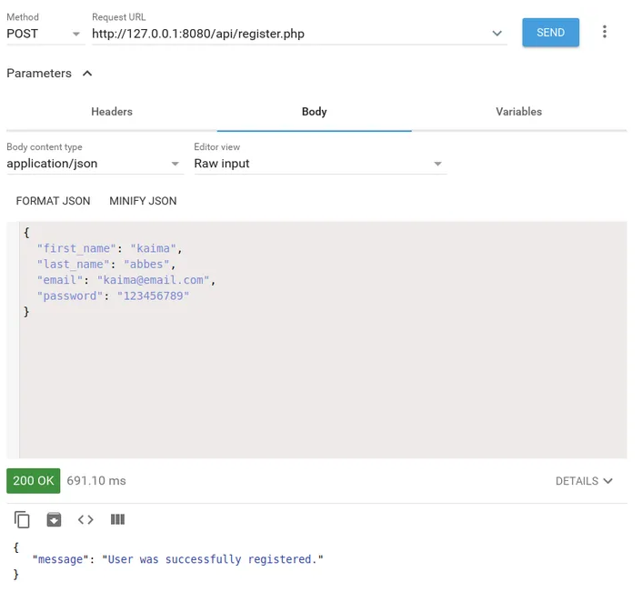
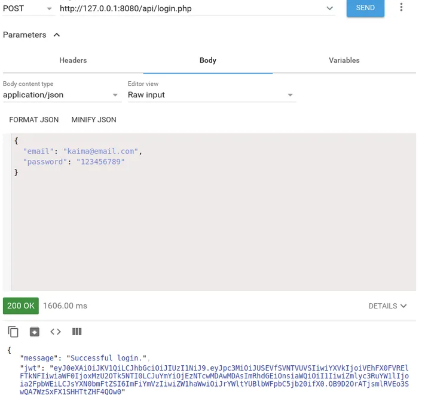
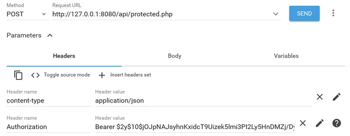

+++
title = 'Tutoriel d'authentification PHP JWT  REST API - Connexion et inscription'
date = 2022-01-04 00:00:00 +0100
categories = ['json', 'authentification']
+++
  - [Tutoriel d'authentification PHP JWT & REST API : connexion et inscription](#tutoriel-dauthentification-php-jwt-rest-api-connexion-et-inscription)
    - [Qu'est-ce que JWT](#quest-ce-que-jwt)
    - [Comment fonctionne JWT](#comment-fonctionne-jwt)
    - [Qu'est-ce que PHP-JWT](#quest-ce-que-php-jwt)
    - [Conditions préalables](#conditions-préalables)
    - [Création de la base de données et des tables MySQL](#création-de-la-base-de-données-et-des-tables-mysql)
    - [Création de la structure du répertoire du projet](#création-de-la-structure-du-répertoire-du-projet)
    - [Connexion à votre base de données MySQL en PHP](#connexion-à-votre-base-de-données-mysql-en-php)
    - [Installation php-jwt](#installation-php-jwt)
    - [Ajout du point de terminaison de l'API d'enregistrement des utilisateurs](#ajout-du-point-de-terminaison-de-lapi-denregistrement-des-utilisateurs)
    - [Ajout du point de terminaison de l'API de connexion utilisateur](#ajout-du-point-de-terminaison-de-lapi-de-connexion-utilisateur)
    - [Protéger un point de terminaison d'API à l'aide de JWT](#protéger-un-point-de-terminaison-dapi-à-laide-de-jwt)
    - [Conclusion](#conclusion)

## Tutoriel d'authentification PHP JWT & REST API : connexion et inscription

Article original : [PHP JWT & REST API Authentication Tutorial: Login and Signup](https://www.techiediaries.com/php-jwt-authentication-tutorial/)

Dans ce tutoriel, nous allons apprendre comment ajouter une authentification JWT à notre application PHP REST API.

Nous verrons ce qu'est JWT et comment il fonctionne. Nous verrons également comment obtenir l'en-tête d'autorisation en PHP.

Nous allons créer des points de terminaison d'API REST pour permettre aux utilisateurs de se connecter et de s'inscrire pour accéder aux ressources protégées.

### Qu'est-ce que JWT

[JWT](https://www.techiediaries.com/php-jwt-authentication-tutorial/jwt.io) signifie JSON Web Token et comprend des informations cryptées par l'utilisateur qui peuvent être utilisées pour authentifier les utilisateurs et échanger des informations entre les clients et les serveurs.

Lors de la création de l'API REST, au lieu des sessions de serveur couramment utilisées dans les applications PHP, nous utilisons des jetons qui sont envoyés avec des en-têtes HTTP du serveur aux clients où ils sont conservés (généralement en utilisant le stockage local) puis attachés à chaque demande sortante provenant du client vers le serveur . Le serveur vérifie le jeton et autorise ou refuse l'accès à la ressource de demande.

Les API RESTful sont sans état (**stateless**) . Cela signifie que les demandes des clients doivent contenir toutes les informations nécessaires requises pour traiter la demande.

Si vous créez une application API REST à l'aide de PHP, vous n'allez pas utiliser la variable `$_SESSION` pour enregistrer des données sur la session du client.

Cela signifie que nous ne pouvons pas accéder à l'état d'un client (comme l'état de connexion). Afin de résoudre le problème, le client est chargé de parcourir l'état localement et de l'envoyer au serveur à chaque demande.

Étant donné que ces informations importantes sont désormais conservées dans le stockage local du client, nous devons le protéger.

Saisissez les JWT. Un jeton JWT est simplement un objet JSON qui contient des informations sur l'utilisateur. Par example:

```json
{
    "user": "bob",
    "email": "bob@email.com",
    "access_token": "at145451sd451sd4e5r4",
    "expire_at"; "11245454"
}
```

Étant donné que ce jeton peut être falsifié pour accéder aux ressources protégées. Par exemple, un utilisateur malveillant peut modifier le jeton précédent comme suit pour accéder uniquement aux ressources d'administration sur le serveur :

```json
{
    "user": "administrator",
    "email": "admin@email.com"
}
```

Pour éviter cette situation, nous, les JWT, devons être signés par le serveur. Si le jeton est modifié côté client, la signature du jeton ne sera plus valide et le serveur refusera l'accès à la ressource demandée.

### Comment fonctionne JWT

Les jetons JWT sont simplement des informations cryptées sur l'utilisateur telles que l'identifiant, le nom d'utilisateur, l'adresse e-mail et le mot de passe.

Lorsque les utilisateurs sont connectés avec succès au serveur, ce dernier produira et renverra un jeton JWT au client.

Ce jeton JWT sera conservé par le client à l'aide du stockage local ou des cookies du navigateur et joint à chaque demande sortante. Ainsi, si l'utilisateur demande l'accès à certaines ressources protégées, le jeton doit d'abord être vérifié par le serveur pour autoriser ou refuser l'accès.

### Qu'est-ce que PHP-JWT

**php-jwt** est une bibliothèque PHP qui permet d'encoder et de décoder des JSON Web Tokens (JWT) en PHP, conformément à la RFC 7519.

### Conditions préalables

Vous devez avoir les prérequis suivants pour pouvoir suivre ce tutoriel à partir de zéro :

*    Vous avez besoin d'un système de base de données **PHP 8**, **Composer** et **MySQL** installé sur votre environnement de développement,
    Vous devez avoir des connaissances de base en PHP et SQL.
*

### Création de la base de données et des tables MySQL

Si vous avez les prérequis, commençons par créer la base de données MySQL. Nous utiliserons le client MySQL installé avec le serveur. Ouvrez un terminal et exécutez la commande suivante pour appeler le client :

    mysql -u root -p

Vous devez entrer votre mot de passe MySQL lorsque vous y êtes invité.

Ensuite, créons une base de données à l'aide de l'instruction SQL suivante :

```sql
mysql> create database db;
```

>Remarque : Ici, nous supposons que vous avez un utilisateur MySQL appelé **root**. Vous devez le remplacer par le nom d'un utilisateur MySQL existant.  
Vous pouvez également utiliser phpMyAdmin ou n'importe quel client MySQL avec lequel vous êtes à l'aise pour créer la base de données et les tables SQL.

Sélectionnons maintenant la base de données **db** et créons une table **users** qui contiendra les utilisateurs de notre application :

```sql
mysql> use db;
mysql> CREATE  TABLE IF NOT EXISTS `Users` (
  `id` INT  AUTO_INCREMENT ,
  `first_name` VARCHAR(150) NOT NULL ,
  `last_name` VARCHAR(150) NOT NULL ,
  `email` VARCHAR(255),
  `password` VARCHAR(255),
  PRIMARY KEY (`id`) );
```

### Création de la structure du répertoire du projet

Créons une structure de répertoire simple pour notre projet. Dans votre terminal, accédez à votre répertoire de travail et créez un dossier pour notre projet :

```bash
mkdir php-jwt-example
cd php-jwt-example
mkdir api && cd api
mkdir config
```

Nous avons d'abord créé le répertoire du projet.  
Ensuite, nous avons créé un apidossier. À l'intérieur, nous avons créé un configdossier.

### Connexion à votre base de données MySQL en PHP

Accédez au dossier **config** et créez un fichier **database.php** avec le code suivant :

```php
<?php
// used to get mysql database connection
class DatabaseService{

    private $db_host = "localhost";
    private $db_name = "mydb";
    private $db_user = "root";
    private $db_password = "";
    private $connection;

    public function getConnection(){

        $this->connection = null;

        try{
            $this->connection = new PDO("mysql:host=" . $this->db_host . ";dbname=" . $this->db_name, $this->db_user, $this->db_password);
        }catch(PDOException $exception){
            echo "Connection failed: " . $exception->getMessage();
        }

        return $this->connection;
    }
}
?>
```

### Installation php-jwt

Procédons maintenant à l'installation de la bibliothèque **php-jwt** à l'aide de **Composer**.  
Dans votre terminal, exécutez la commande suivante depuis la racine du répertoire de votre projet :

    composer require firebase/php-jwt

Cela téléchargera la bibliothèque **php-jwt** dans un dossier **vendor**.

Vous pouvez demander à la bibliothèque **php-jwt** d'encoder et de décoder les jetons JWT à l'aide du code suivant :

```php
<?php 
require "vendor/autoload.php";
use \Firebase\JWT\JWT;
```

### Ajout du point de terminaison de l'API d'enregistrement des utilisateurs

Dans le dossier **api**, créez un fichier **register.php** et ajoutez le code suivant pour créer un nouvel utilisateur dans la base de données MySQL :

```php
<?php
include_once './config/database.php';

header("Access-Control-Allow-Origin: * ");
header("Content-Type: application/json; charset=UTF-8");
header("Access-Control-Allow-Methods: POST");
header("Access-Control-Max-Age: 3600");
header("Access-Control-Allow-Headers: Content-Type, Access-Control-Allow-Headers, Authorization, X-Requested-With");

$firstName = '';
$lastName = '';
$email = '';
$password = '';
$conn = null;

$databaseService = new DatabaseService();
$conn = $databaseService->getConnection();

$data = json_decode(file_get_contents("php://input"));

$firstName = $data->first_name;
$lastName = $data->last_name;
$email = $data->email;
$password = $data->password;

$table_name = 'Users';

$query = "INSERT INTO " . $table_name . "
                SET first_name = :firstname,
                    last_name = :lastname,
                    email = :email,
                    password = :password";

$stmt = $conn->prepare($query);

$stmt->bindParam(':firstname', $firstName);
$stmt->bindParam(':lastname', $lastName);
$stmt->bindParam(':email', $email);

$password_hash = password_hash($password, PASSWORD_BCRYPT);

$stmt->bindParam(':password', $password_hash);


if($stmt->execute()){

    http_response_code(200);
    echo json_encode(array("message" => "User was successfully registered."));
}
else{
    http_response_code(400);

    echo json_encode(array("message" => "Unable to register the user."));
}
?>
```

### Ajout du point de terminaison de l'API de connexion utilisateur

Dans le dossier **api**, créez un fichier **login.php** et ajoutez le code suivant pour vérifier les informations d'identification de l'utilisateur et renvoyer un jeton JWT au client :

```php
<?php
include_once './config/database.php';
require "../vendor/autoload.php";
use \Firebase\JWT\JWT;

header("Access-Control-Allow-Origin: *");
header("Content-Type: application/json; charset=UTF-8");
header("Access-Control-Allow-Methods: POST");
header("Access-Control-Max-Age: 3600");
header("Access-Control-Allow-Headers: Content-Type, Access-Control-Allow-Headers, Authorization, X-Requested-With");


$email = '';
$password = '';

$databaseService = new DatabaseService();
$conn = $databaseService->getConnection();


$data = json_decode(file_get_contents("php://input"));

$email = $data->email;
$password = $data->password;

$table_name = 'Users';

$query = "SELECT id, first_name, last_name, password FROM " . $table_name . " WHERE email = ? LIMIT 0,1";

$stmt = $conn->prepare( $query );
$stmt->bindParam(1, $email);
$stmt->execute();
$num = $stmt->rowCount();

if($num > 0){
    $row = $stmt->fetch(PDO::FETCH_ASSOC);
    $id = $row['id'];
    $firstname = $row['first_name'];
    $lastname = $row['last_name'];
    $password2 = $row['password'];

    if(password_verify($password, $password2))
    {
        $secret_key = "YOUR_SECRET_KEY";
        $issuer_claim = "THE_ISSUER"; // this can be the servername
        $audience_claim = "THE_AUDIENCE";
        $issuedat_claim = time(); // issued at
        $notbefore_claim = $issuedat_claim + 10; //not before in seconds
        $expire_claim = $issuedat_claim + 60; // expire time in seconds
        $token = array(
            "iss" => $issuer_claim,
            "aud" => $audience_claim,
            "iat" => $issuedat_claim,
            "nbf" => $notbefore_claim,
            "exp" => $expire_claim,
            "data" => array(
                "id" => $id,
                "firstname" => $firstname,
                "lastname" => $lastname,
                "email" => $email
        ));

        http_response_code(200);

        $jwt = JWT::encode($token, $secret_key);
        echo json_encode(
            array(
                "message" => "Successful login.",
                "jwt" => $jwt,
                "email" => $email,
                "expireAt" => $expire_claim
            ));
    }
    else{

        http_response_code(401);
        echo json_encode(array("message" => "Login failed.", "password" => $password));
    }
}
?>

```

Vous pouvez définir la structure de données du jeton comme vous le souhaitez, c'est-à-dire (vous pouvez ajouter uniquement l'e-mail ou l'ID de l'utilisateur ou les deux avec des informations supplémentaires telles que le nom de l'utilisateur), mais certaines revendications JWT réservées doivent être définies correctement car elles affectent le validité du jeton JWT, tels que :

*    iat – horodatage de l'émission du jeton.
*    iss – Une chaîne contenant le nom ou l'identifiant de l'application émettrice. Peut être un nom de domaine et peut être utilisé pour supprimer les jetons d'autres applications.
*    nbf – Horodatage du moment où le jeton doit commencer à être considéré comme valide. Doit être égal ou supérieur à iat. Dans ce cas, le token commencera à être valide après 10 secondes après avoir été émis
*    exp - Horodatage du moment où le jeton doit s'arrêter pour être valide. Doit être supérieur à iat et nbf. Dans notre exemple, le jeton expirera 60 secondes après son émission.

Ces revendications ne sont pas obligatoires, mais sont utiles pour déterminer la validité d'un jeton.

Notre charge utile JWT est à l'intérieur de la revendication de données, nous avons ajouté le prénom, le nom, l'adresse e-mail et l'ID utilisateur de la base de données. Vous ne devez pas ajouter d'informations sensibles dans la charge utile JWT.

La méthode `JWT::encode()` transformera le tableau PHP au format JSON et signera la charge utile, puis encodera le jeton JWT final qui sera envoyé au client. Dans notre exemple, nous avons simplement codé la clé secrète qui sera utilisée pour signer la charge utile JWT, mais en production, vous devez vous assurer d'utiliser une clé secrète avec une longue chaîne binaire, la stocker dans un fichier de configuration.

Nous avons maintenant deux points de terminaison RESTful pour l'enregistrement et la connexion des utilisateurs. À ce stade, vous pouvez utiliser un client REST comme Postman pour interagir avec l'API.

Tout d'abord, démarrez votre serveur PHP à l'aide de la commande suivante :

    php -S 127.0.0.1:8080

Un serveur de développement s'exécutera à partir de l'adresse 127.0.0.1:8080

Créons maintenant un utilisateur dans la base de données en envoyant une requête **POST** au point de terminaison **api/register.php** avec un corps JSON qui contient les **first_name**, **last_name**, **email** et **password**:



Vous devriez obtenir une réponse **HTTP 200** avec un message **User was successfully registered**

Ensuite, vous devez envoyer une requête **POST** au point de terminaison **/api/login.php** avec un corps **JSON** qui contient l'**e-mail** et le **mot de passe** utilisés pour enregistrer l'utilisateur :



Vous devriez recevoir un message **Successful login** avec un jeton JWT.

Le jeton JWT doit être conservé dans le stockage local de votre navigateur ou dans des cookies à l'aide de JavaScript, puis attaché à chaque requête HTTP envoyée pour accéder à une ressource protégée sur votre serveur PHP.

### Protéger un point de terminaison d'API à l'aide de JWT

Voyons maintenant comment nous pouvons protéger nos points de terminaison de serveur à l'aide de jetons JWT.

Avant d'accéder à un point de terminaison, un jeton JWT est envoyé avec chaque demande du client. Le serveur doit décoder le JWT et vérifier s'il est valide avant d'autoriser l'accès au point de terminaison.

Dans le dossier **api**, créez un fichier **protected.php** et ajoutez le code suivant :

```php
<?php
include_once './config/database.php';
require "../vendor/autoload.php";
use \Firebase\JWT\JWT;

header("Access-Control-Allow-Origin: *");
header("Content-Type: application/json; charset=UTF-8");
header("Access-Control-Allow-Methods: POST");
header("Access-Control-Max-Age: 3600");
header("Access-Control-Allow-Headers: Content-Type, Access-Control-Allow-Headers, Authorization, X-Requested-With");


$secret_key = "YOUR_SECRET_KEY";
$jwt = null;
$databaseService = new DatabaseService();
$conn = $databaseService->getConnection();

$data = json_decode(file_get_contents("php://input"));


$authHeader = $_SERVER['HTTP_AUTHORIZATION'];

$arr = explode(" ", $authHeader);


/*echo json_encode(array(
    "message" => "sd" .$arr[1]
));*/

$jwt = $arr[1];

if($jwt){

    try {

        $decoded = JWT::decode($jwt, $secret_key, array('HS256'));

        // Access is granted. Add code of the operation here 

        echo json_encode(array(
            "message" => "Access granted:",
            "error" => $e->getMessage()
        ));

    }catch (Exception $e){

    http_response_code(401);

    echo json_encode(array(
        "message" => "Access denied.",
        "error" => $e->getMessage()
    ));
}

}
?>
```

>Remarque : nous supposons que le client envoie le jeton JWT dans un en-tête d'autorisation HTTP aux formats `JWT <token>` ou `Bearer <token>`.  
Vous pouvez également choisir d'inclure le jeton en tant que paramètre dans l'URL de la demande ou dans le cadre de la charge utile de données envoyée par le client si vous ne souhaitez pas traiter les en-têtes HTTP.

Vous pouvez désormais envoyer une requête **POST** avec un en-tête d'autorisation dans les formats suivants :

    JWT <YOUR_JWT_TOKEN_HERE> 

Ou encore en utilisant le format au porteur :

    Bearer <YOUR_JWT_TOKEN_HERE>



### Conclusion

Dans ce tutoriel, nous avons vu comment implémenter l'authentification JWT de l'API REST dans PHP et MySQL.
