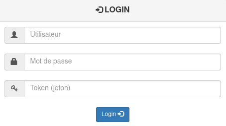
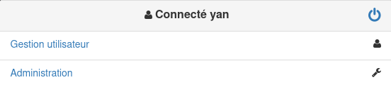
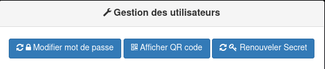
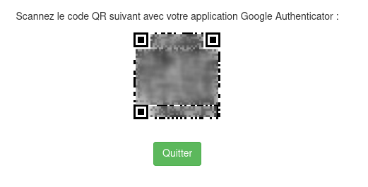
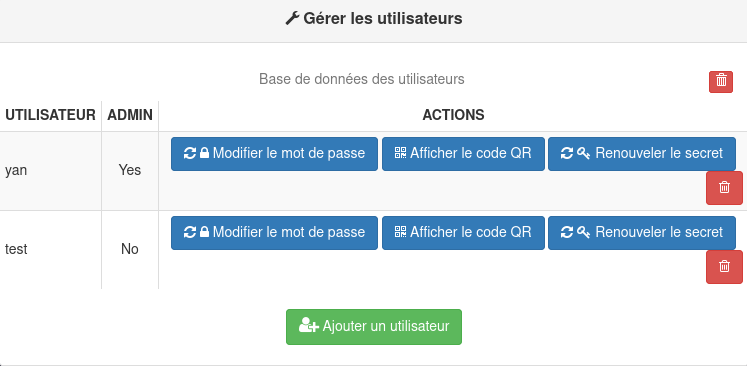
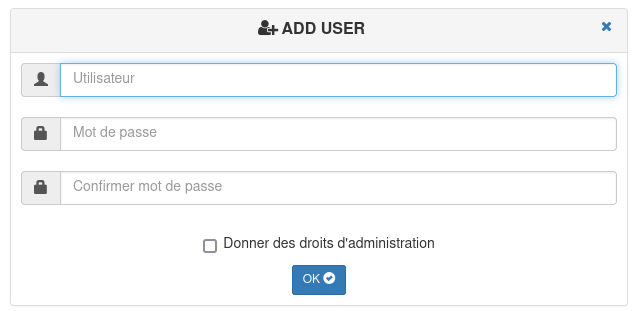
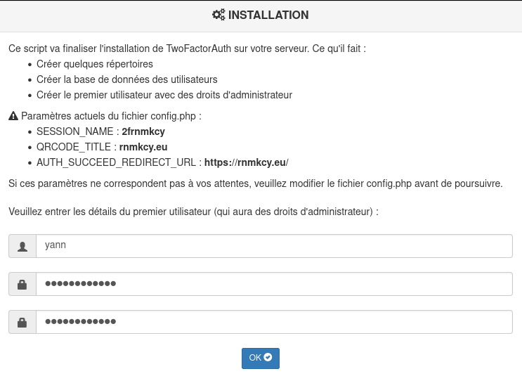
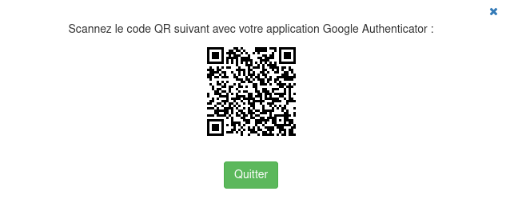
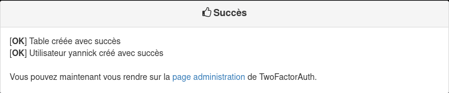
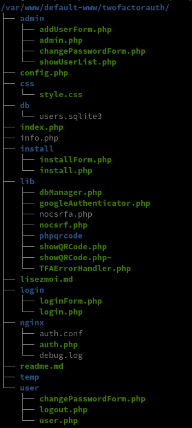

+++
title = 'PHP nginx - Portail d'authentification web authentification à deux facteurs (2FA).'
date = 2022-01-09 00:00:00 +0100
categories = ['php', 'nginx', 'authentification']
+++
{:width="200"}

## Sommaire

  - [Autorisation à 2 facteurs (TwoFactorAuth)](#autorisation-à-2-facteurs-twofactorauth)
    - [Dépendances](#dépendances)
    - [Caractéristiques](#caractéristiques)
    - [Captures d'écran](#captures-décran)
    - [Comment cela fonctionne-t-il ?](#comment-cela-fonctionne-t-il-)
    - [Installation](#installation)
    - [Configuration](#configuration)
    - [Aspects de la sécurité](#aspects-de-la-sécurité)
    - [[OPTIONNEL] Intégration de NGINX auth_request](#optionnel-intégration-de-nginx-auth_request)
  - [2FA xoyize.xyz](#2fa-xoyizexyz)

## Autorisation à 2 facteurs (TwoFactorAuth)


[TwoFactorAuth (article original)](https://github.com/Arno0x/TwoFactorAuth) est un portail d'authentification web fournissant une authentification à deux facteurs (*2FA*). 

* Le premier facteur est un mot de passe
* le second facteur est un OTP (*One Time Password*) généré par une application comme Google Authenticator ou tout autre compatible.

TwoFactorAuth est écrit en PHP et devrait être assez facile à intégrer dans une application PHP existante.  
Il comporte également un script compatible avec le module auth_request de Nginx qui s'intègre facilement. 

Le but de TwoFactorAuth est de fournir une authentification sécurisée (2FA) des utilisateurs et, une fois l'authentification passée, de laisser votre application gérer tout le reste comme les autorisations de l'utilisateur, son profil etc...

L'application est distribuée sous les termes de la licence [GPLv3] (http://www.gnu.org/copyleft/gpl.html).


### Dépendances

TwoFactorAuth nécessite minimum PHP5. Les bibliothèques suivantes sont incluses avec TwoFactorAuth :

- La [classe PHP Google Authenticator](https://github.com/PHPGangsta/GoogleAuthenticator) écrite par Michael Kliewe, pour générer le secret GAuth et la validation OTP. **Beware** que j'ai modifié cette classe pour qu'elle s'appuie sur une bibliothèque locale pour la génération du QRCode plutôt que sur l'URL de GoogleChart, donc n'installez pas la bibliothèque source, utilisez uniquement celle fournie avec TwoFactorAuth.
- La [bibliothèque PHP QRCode](http://phpqrcode.sourceforge.net/) écrite par Dominik Dzienia, pour la génération de QRCodes 2D.
- La bibliothèque [NoSCRF](https://github.com/BKcore/NoCSRF) écrite par Thibaut Despoulain, pour la prévention des attaques CSRF.

>**Ces deux bibliothèques sont incluses** dans le paquet TwoFactorAuth

TwoFactorAuth repose également sur certaines bibliothèques PHP8 que vous devrez installer par vous-même :

- SQLite3 (sur les systèmes similaires à Debian : `sudo apt install sqlite3`)
- php 8.0 pour nginx : `sudo apt install php8.0-fpm`
- La bibliothèque GD (sur les systèmes de type debian : `sudo apt install php8.0-gd`)
- La bibliothèque SQLite3 (sur les systèmes similaires à Debian : `sudo apt install php8.0-sqlite3`)

### Caractéristiques

TwoFactorAuth utilise une base de données SQLite3 pour sa base de données utilisateurs. Le type de base de données peut être facilement modifié en surchargeant la classe **/twofactorauth/lib/DBManager.php** pour utiliser toute autre base de données.

Les principales fonctionnalités sont :

- Gestion de la base de données des utilisateurs (réservée aux utilisateurs ayant le privilège "admin") : 
    - ajouter un utilisateur 
    - supprimer un utilisateur 
    - supprimer toute la base de données
    - changer le mot de passe de n'importe quel utilisateur
    - renouveler le secret GAuth de n'importe quel utilisateur 
    - afficher le secret de n'importe quel utilisateur sous forme de QRCode.
- Chaque utilisateur peut également gérer son propre compte : 
    - changer son mot de passe 
    - renouveler son secret GAuth 
    - afficher son secret actuel sous forme de QRCode.
- Intégration du module **auth_request** de Nginx (*optionnel*)

### Captures d'écran

La page de connexion :



La page d'accueil après la connexion :



La page de gestion de utilisateur :



L'affichage du QRCode :



La page d'administration :



Ajout d'un utilisateur :



### Comment cela fonctionne-t-il ?

Après la création d'un utilisateur, un QRCode s'affiche représentant le secret GAuth aléatoire généré pour cet utilisateur. Ce QRCode doit être scanné avec l'application Google Authenticator. Cela ne doit être fait qu'une seule fois pour chaque utilisateur, sauf si l'utilisateur a perdu/changé son téléphone et doit saisir à nouveau son QRCode.
Une fois que le QRCode a été scanné avec l'application Google Authenticator, un jeton OTP est généré toutes les 30 secondes :


Ce jeton doit être saisi sur la page de connexion avec le mot de passe de l'utilisateur :

Une fois que l'utilisateur s'est connecté, une session PHP est créée, dont le nom peut être configuré (*optionnel*) pour correspondre à celui de votre propre application PHP si nécessaire. Cette session contient les variables suivantes :

- $_SESSION["authenticated"] : un booléen (true ou false) indiquant que l'utilisateur a été authentifié avec succès
- $_SESSION["isAdmin"] : un booléen (true ou false) indiquant si cette utilisation possède ou non des droits d'administration TwoFactorAuth 
- $_SESSION["username"] : une chaîne contenant le nom d'utilisateur authentifié. Ce nom d'utilisateur peut être réutilisé par votre propre application pour des contrôles d'autorisation supplémentaires et la gestion des profils.


### Installation

1. Dézippez le paquetage TwoFactorAuth dans le répertoire de votre serveur web et assurez-vous que tous les fichiers et dossiers ont la propriété utilisateur:groupe appropriée, selon votre installation (*pourrait être quelque chose comme www-data:www-data*).

2. **Editez le fichier de configuration config.php** à la racine du répertoire TwoFactorAuth, et faites le correspondre à vos besoins et paramètres personnels. Voir la section configuration ci-dessous.

3. Ensuite, ouvrez un navigateur et naviguez simplement sur l'url de base de TwoFactorAuth (*le chemin exact varie selon l'endroit où vous avez installé l'application TwoFactorAuth*) :
http://www.example.com/twofactorauth/ . Cette page finalisera le processus d'installation en créant la base de données utilisateur SQLite3, ainsi que le schéma de la table utilisateur et vous permettra de définir le premier utilisateur par défaut avec des droits d'administration.

A partir de là, les principales fonctionnalités sont disponibles sur la page d'accueil 


### Configuration

Modifiez le fichier **/twofactorauth/config.php** en fonction de vos besoins. La plupart des paramètres peuvent être conservés à leurs valeurs par défaut. Cependant, faites attention aux paramètres suivants :

- **QRCODE_TITLE** : Il s'agit du titre qui apparaîtra en haut du jeton OTP dans l'application Google Athenticator. Définissez-le à votre propre nom d'application, ou peut-être le nom du serveur, tout ce qui est pertinent et sensible pour vos utilisateurs.

- **SESSION_NAME** : Il s'agit du nom de la session PHP (*également utilisé pour le cookie de session*). Vous pouvez le définir comme le nom de session de votre propre application si vous prévoyez de le réutiliser pour l'autorisation et le profil des utilisateurs.

- **AUTH\_SUCCEED\_REDIRECT\_URL** : La page de connexion prend en charge un paramètre URL "from" (*ex : "http://www.example.com/twofactorauth/login/login.php?from=/myapp "*). Lorsque la connexion est réussie, la page de connexion redirige l'utilisateur vers le chemin spécifié dans le paramètre "from" (*NB : il ne peut s'agir que d'un chemin local au FQDN, pas de cross-site*). Toutefois, si le paramètre "from" n'est pas présent dans l'URL, la page de connexion redirigera l'utilisateur vers l'URL spécifiée dans AUTH\_SUCCEED\_REDIRECT\_URL.

### Aspects de la sécurité

La base de données des utilisateurs doit être protégée contre l'accès à distance. Pour y parvenir, vous pouvez soit :
- **Avant** l'installation : modifier le paramètre USER_SQL_DATABASE_FILE dans le config.php et le mettre sur un chemin qui n'est pas servi par votre serveur web
ou
- Après l'installation : empêchez l'accès à distance au répertoire db/ en utilisant une directive spécifique au serveur web (.htaccess avec Apache, ou 'deny all;' avec Nginx).


### [OPTIONNEL] Intégration de NGINX auth_request

Le module Nginx auth_request permet l'authentification de chaque requête par rapport à une sous-requête interne spécifiée comme une URL. La sous-requête doit répondre avec le code de statut HTTP approprié :

- HTTP 401 si l'authentification a échoué
- HTTP 200 si l'authentification a réussi

Ce mécanisme remplace parfaitement l'authentification auth_basic et permet de créer des mécanismes personnalisés, écrits dans n'importe quel langage. Il permet également un mécanisme d'authentification pour l'ensemble du site Web (et non par application).

AVERTISSEMENT : Chaque fois que vous enregistrez des changements dans le config.php de TwoFactorAuth, vérifiez toujours les messages d'erreur dans /twofactorauth/login/login.php pour vous assurer que vous n'avez pas fait de fautes de frappe dans le fichier. Si PHP ne peut pas analyser le fichier, Nginx considérera que tous les utilisateurs sont authentifiés !

TwoFactorAuth fournit un tel script : **/twofactorauth/nginx/auth.php**.

Vous devrez modifier votre fichier de configuration Nginx. En supposant que l'application TwoFactorAuth a été déployée dans un emplacement nommé /twofactorauth/ sur votre serveur web, ajoutez la ligne suivante sous la directive "server" :

````php
    auth_request /twofactorauth/nginx/auth.php;

    error_page 401 = @error401;
 
    location @error401 {
		return 302 $scheme://$host/twofactorauth/login/login.php?from=$uri;
    }

    location = /twofactorauth/nginx/auth.php {
                fastcgi_pass unix:/var/run/php5-fpm.sock;
                include fastcgi.conf;
                fastcgi_param  CONTENT_LENGTH "";
    }
 
    location /twofactorauth/db/ {
		deny all;
	}
	
    location /twofactorauth/login/ {
		auth_request off;

		location ~ \.php$ {
				fastcgi_pass unix:/var/run/php8.0-fpm.sock;
				include fastcgi.conf;
		}
    }
````

## 2FA rnmkcy.eu 

*test  authentification à deux facteurs (2FA) avec PHP version 7.3*

Cloner le dépôt git

    cd ~
    git clone https://github.com/Arno0x/TwoFactorAuth.git twofactorauth
    sudo mv twofactorauth /var/www/default/
    sudo chown www-data.www-data -R /var/www/default/twofactorauth

Le fichier de paramétrage config.php

```php
define('QRCODE_TITLE','rnmkcy.eu');
define('SESSION_NAME','2farnmkcy');
define('AUTH_SUCCEED_REDIRECT_URL','https://rnmkcy.eu/');

```

Installation sur le container lxcdeb <https://rnmkcy.eu/twofactorauth/index.php>  

{:width="400"}  

{:width="400"}  

{:width="500"}  

Le dossier `twofactorauth`   
{:height="400"}  

Le fichier de configuration nginx  

    /etc/nginx/conf.d/rnmkcy.eu.conf

```
server {
    listen 80;
    listen [::]:80;
    server_name xoyize.xyz;
    return 301 https://$host$request_uri;
}
server {
    listen 443 ssl http2;
    listen [::]:443 ssl http2;
    server_name xoyize.xyz;
    ssl_certificate /etc/ssl/private/xoyize.xyz-fullchain.pem;
    ssl_certificate_key /etc/ssl/private/xoyize.xyz-key.pem;

    root /var/www/default/;
    index index.html;

    # TLS 1.3 only
    ssl_protocols TLSv1.3;
    ssl_prefer_server_ciphers off;
 
    # HSTS (ngx_http_headers_module is required) (63072000 seconds)
    add_header Strict-Transport-Security "max-age=63072000" always;
 
    location / {
     auth_request /twofactorauth/nginx/auth.php;
     error_page 401 =401 $scheme://$host/twofactorauth/login/login.php?from=$uri;
    }


    location ~ \.php {
	  fastcgi_split_path_info ^(.+\.php)(/.+)$;
	  fastcgi_pass unix:/run/php/php7.3-fpm.sock;   # PHP7.3
	  fastcgi_index index.php;
	  include fastcgi_params;
	  fastcgi_param SCRIPT_FILENAME $document_root$fastcgi_script_name;
    }

	location = /twofactorauth/login/login.php {
	  allow all;
     auth_request off;
     fastcgi_split_path_info ^(.+\.php)(/.+)$;
     fastcgi_pass unix:/run/php/php7.3-fpm.sock;   # PHP7.3
     fastcgi_index index.php;
     include fastcgi_params;
     fastcgi_param SCRIPT_FILENAME $document_root$fastcgi_script_name;
	}

	location = /twofactorauth/nginx/auth.php {
     fastcgi_split_path_info ^(.+\.php)(/.+)$;
     fastcgi_pass unix:/run/php/php7.3-fpm.sock;   # PHP7.3
     fastcgi_index index.php;
     include fastcgi_params;
     fastcgi_param SCRIPT_FILENAME $document_root$fastcgi_script_name;
     fastcgi_param  CONTENT_LENGTH "";
	}

	location /twofactorauth/ {
		index index.php;
	}


	location /twofactorauth/db/ {
	    deny all;
	}

    location /domo/ {
     proxy_pass http://localhost:8080/;
	 auth_request /twofactorauth/nginx/auth.php;
     error_page 401 =401 $scheme://$host/twofactorauth/login/login.php?from=$uri;
    }

    # OCSP stapling
    ssl_stapling on;
    ssl_stapling_verify on;
 
    # verify chain of trust of OCSP response using Root CA and Intermediate certs
    ssl_trusted_certificate /etc/ssl/private/xoyize.xyz-fullchain.pem;
 
    # replace with the IP address of your resolver
    resolver 127.0.0.1;

}
```