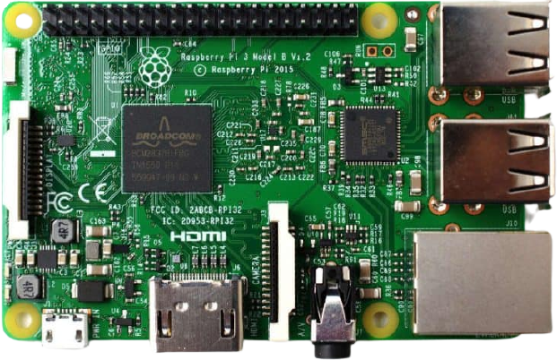
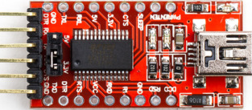
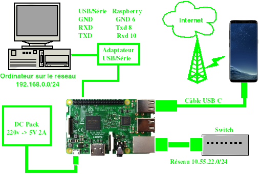
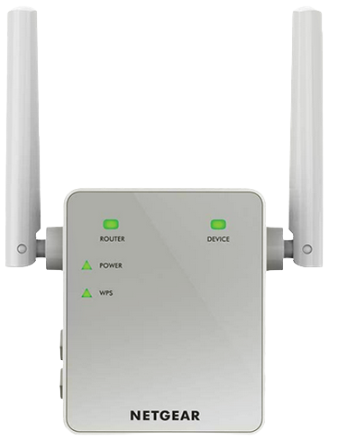
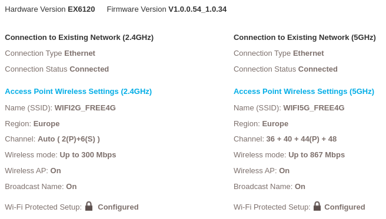

+++
title = 'Partager une connexion 4G de smartphone avec un Raspberry Pi'
date = 2022-01-22 00:00:00 +0100
categories = ['raspberry']
+++
Liens des articles originaux de François MOCQ  
[Partage d’une connexion 4G de smartphone avec un Raspberry Pi](https://www.framboise314.fr/partage-dune-connexion-4g-de-smartphone-avec-un-raspberry-pi/)  
[Partage d’une connexion 4G en Ethernet et en Wifi](https://www.framboise314.fr/partage-dune-connexion-4g-ethernet-wifi/)

*Ce qui suit est tès largement inspiré des articles cités ci-dessus*
{: .prompt-info }

### Matériel

* raspberry PI 3B + PiOs Lite BusterR  
{:width="80"}
* Smartphone  
{:height="80"}
* Switch Ethernet

### PiOs (debian buster)

{:width="80"}

**SDcard**  

Sur un ordinateur , connecté une SDcard via un interface USB et relever son identification par `dmesg`  
[Télécharger le ZIP](https://www.raspberrypi.org/downloads/raspbian/) de la dernière image **Raspbian buster Lite**  

Identifier le périphérique SDcard après insertion

    dmesg

```
[10742.227702] usb 1-7: New USB device found, idVendor=05e3, idProduct=0745, bcdDevice= 9.03
[10742.227708] usb 1-7: New USB device strings: Mfr=0, Product=1, SerialNumber=2
[10742.227712] usb 1-7: Product: USB Storage
[10742.227715] usb 1-7: SerialNumber: 000000000903
[10742.229654] usb-storage 1-7:1.0: USB Mass Storage device detected
[10742.237357] scsi host5: usb-storage 1-7:1.0
[10743.258751] scsi 5:0:0:0: Direct-Access     Generic  STORAGE DEVICE   0903 PQ: 0 ANSI: 6
[10743.259573] sd 5:0:0:0: Attached scsi generic sg4 type 0
[10743.715208] sd 5:0:0:0: [sde] 15564800 512-byte logical blocks: (7.97 GB/7.42 GiB)
[10743.716453] sd 5:0:0:0: [sde] Write Protect is off
[10743.716460] sd 5:0:0:0: [sde] Mode Sense: 21 00 00 00
[10743.717563] sd 5:0:0:0: [sde] Write cache: disabled, read cache: enabled, doesn't support DPO or FUA
[10743.726016]  sde: sde1 
[10743.733076] sd 5:0:0:0: [sde] Attached SCSI removable disk
```

La sdcard est attachée à /dev/sde

Décompresser le fichier zip 

    unzip 2021-01-11-raspios-buster-armhf-lite.zip

"flasher" la SDcard avec le fichier **2021-01-11-raspios-buster-armhf-lite.img**

    sudo dd bs=4M if=2021-01-11-raspios-buster-armhf-lite.img of=/dev/sde && sync

>**ATTENTION !!!** Pas d'accès à la carte raspberry en mode terminal par la liaison série ou SSH  
*Les dernières versions de Raspbian nécessitent un écran et un clavier, car il n'est plus possible de se connecter directement par la liaison série ou en SSH au Raspberry par défaut.  

**Activer la liaison série et SSH**

Cela nécessite 2 opérations

1. Activer le lancement de SSH au boot ,placer dans la partition **boot** de la carte SD un fichier nommé **ssh**, vide et sans extension.  
2. Activer la liaison série ,il faut ajouter `enable_uart=1` à la fin du fichier de configuration **config.txt**  et avant insertion de la SDcard dans le raspberry  

**Pour réaliser ces 2 opérations:**  
Retirer le lecteur USB/SDcard puis le réinsére  
identifier le périphérique SDcard avec la commande `dmesg`

    dmesg

```
[11948.379238]  sdc: sdc1 sdc2
[11948.383312] sd 5:0:0:0: [sdc] Attached SCSI removable disk
```

On identifie 2 partitions sdc1 et sdc2  
Montage de la SDcard (sdc1 qui correspond au **boot**) sur un dossier temporaire

```
mkdir -p temp  # dossier temporaire
sudo mount /dev/sdc1 temp # Montage de la SDcard (sdc1 qui correspond au boot) sur un dossier temporaire
sudo touch temp/ssh # Ajout du fichier ssh pour activer le lancement de SSH au boot
sudo su -c "echo 'enable_uart=1' >> temp/config.txt" # Modifier le fichier config.txt pour activer la liaison série 
sudo umount temp # Démontage et insertion SDcard dans le raspberry 
rm -r temp  # suppression dossier temporaire
```

>Remplacer **sdc** suivant le dmesg (sdb,sdc,sdd,etc...)

**Liaison USB/Série**

**ATTENTION** , il faut utiliser une liaison USB/Série pour l'installation de raspian-lite   
{:width="150"}

|interface USB/Série|Raspberry|
| :----------------- |:-------|
| GND | 6 |
| Rxd | 8 (Txd) |
| Txd | 10 (Rxd) |

Exécuter le logiciel de communication (minicom ou screen)  

    sudo minicom # Débit/Parité/Bits:115200 8N1,Contrôle de flux matériel:Non,Contrôle de flux logiciel:Non
        OU
    sudo screen /dev/ttyUSB0 115200

>**Insérer la SDCard dans le logement du Raspberry ,connecter le cordon réseau et la liaison série**  

**Alimenter la carte raspberry**

brancher la micro-usb d'alimentation  sur la carte raspberry et enfin le DC-Pack sur le secteur  
patienter quelques minutes...  

login/motde passe : pi/raspberry  

Mise à jour 

    sudo apt update && sudo apt upgrade

### Connecter le téléphone

* **Connecter le smartphone au port USB du routeur** à l'aide du câble USB, puis activez l'option USB Tethering dans les paramètres d'Android.  
Paramètres &rarr; Réseau et Internet  
{:height="300"} {:height="300"}   
Le téléphone activera immédiatement le mode Tethering USB lorsqu'il sera branché sur un routeur ( ou un ordinateur portable).  
*Un téléphone verrouillé n'activera pas le mode "Partage via USB" sans une intervention manuelle.*

Vérification

    lsusb

```
Bus 001 Device 005: ID 04e8:6864 Samsung Electronics Co., Ltd GT-I9070 (network tethering, USB debugging enabled)
```

Le réseau

    ip a

```
[...]
4: usb0: <BROADCAST,MULTICAST,UP,LOWER_UP> mtu 1500 qdisc pfifo_fast state UNKNOWN group default qlen 1000
    link/ether 4a:af:43:6b:64:22 brd ff:ff:ff:ff:ff:ff
    inet 192.168.12.45/24 brd 192.168.12.255 scope global dynamic noprefixroute usb0
       valid_lft 3592sec preferred_lft 3142sec
    inet6 fe80::a9a2:2b73:b088:2922/64 scope link 
       valid_lft forever preferred_lft forever
```

Le port usb0 a été créé et qu’il a l’adresse 192.168.12.45/24. Dans ce mode de fonctionnement, on retrouve toujours le téléphone dans le réseau 192.168.12.0  

>Cette adresse n'est pas fixe , elle change à chaque redémarrage

On peut partager la connexion entre le port usb0 et eth0, le port Ethernet du Raspberry Pi.

### Port forwarding

Pour que les paquets de données puissent transiter entre les deux réseaux, il faut activer le routage du noyau.

    sudo nano /etc/sysctl.conf

```
# Uncomment the next line to enable packet forwarding for IPv4
net.ipv4.ip_forward=1 
```

Redémarrez le système pour prendre cette modification en compte et activer le routage

    sudo reboot

Le partage de modem USB sur le téléphone est annulé lors du reboot du système, car la sortie USB est momentanément désactivée. Pensez à revalider le partage de modem USB après chaque reboot !
{: .prompt-warning }




Raspberry Pi va devoir attribuer des adresses IP dans le réseau privé 10.55.22.0/24  aux machines qui seront connectées sur son port Ethernet.  
Un serveur DHCP `isc-dhcp-server` sera utilisé.   
Lorsque les machines connectées sur le port Ethernet voudront accéder à Internet, comme vous saisissez un nom de domaine il faut trouver l’adresse IP correspondante à ce domaine et c’est le rôle du serveur DNS `bind`, le classique des classiques en serveur DNS. Il ira chercher sur les DNS extérieurs les domaines qu’il ne connait pas, mais peut garder dans un cache les adresses des domaines qu’il a déjà récupérées. Pour utiliser bind, il faudra que le port Ethernet du Raspberry Pi ait une adresse fixe, on pourra ainsi passer l’adresse du DNS dans les options de DHCP. 

### Point d'accès WIFI 

Si on souhaite utliser le wifi de la carte RPI en point d'accès

    sudo apt install hostapd

### Configurer eth0 en adresse fixe 10.55.22.1

La modification de l’adresse du port Ethernet se fait dans le fichier dhcpcd.conf ouvrez-le

    sudo nano /etc/dhcpcd.conf

```
# Adresse fixe sur le port Ethernet eth0
interface eth0 
static ip_address=10.55.22.1/24
```

Redémarrer par on/off de l'alimentation  
Vérification `ip a`

```
1: lo: <LOOPBACK,UP,LOWER_UP> mtu 65536 qdisc noqueue state UNKNOWN group default qlen 1000
    link/loopback 00:00:00:00:00:00 brd 00:00:00:00:00:00
    inet 127.0.0.1/8 scope host lo
       valid_lft forever preferred_lft forever
    inet6 ::1/128 scope host 
       valid_lft forever preferred_lft forever
2: eth0: <BROADCAST,MULTICAST,UP,LOWER_UP> mtu 1500 qdisc pfifo_fast state UP group default qlen 1000
    link/ether b8:27:eb:54:7e:6a brd ff:ff:ff:ff:ff:ff
    inet 10.55.22.1/24 brd 10.55.22.255 scope global noprefixroute eth0
       valid_lft forever preferred_lft forever
    inet6 2a01:e0a:2de:2c70:2c8:60b4:3d45:8686/64 scope global dynamic mngtmpaddr noprefixroute 
       valid_lft 86364sec preferred_lft 86364sec
    inet6 fe80::e213:f942:3c09:6c87/64 scope link 
       valid_lft forever preferred_lft forever
3: wlan0: <BROADCAST,MULTICAST> mtu 1500 qdisc noop state DOWN group default qlen 1000
    link/ether b8:27:eb:01:2b:3f brd ff:ff:ff:ff:ff:ff
4: usb0: <BROADCAST,MULTICAST,UP,LOWER_UP> mtu 1500 qdisc pfifo_fast state UNKNOWN group default qlen 1000
    link/ether 7e:c7:c4:52:2c:e2 brd ff:ff:ff:ff:ff:ff
    inet 192.168.4.105/24 brd 192.168.4.255 scope global dynamic noprefixroute usb0
       valid_lft 3584sec preferred_lft 3134sec
    inet6 fe80::643e:7367:f45:24/64 scope link 
       valid_lft forever preferred_lft forever
```

### Configurer wlan0 en adresse fixe 10.55.19.1

Modifier le fichier `/etc/dhcpcd.conf` , y ajouter ce qui suit

    sudo nano /etc/dhcpcd.conf

```
# Adresse fixe sur wlan0
nohook wpa_supplicant
interface wlan0
static ip_address=10.55.19.1/24
```

Le nohook permet de ne pas prendre en compte le wpa_supplicant s’il y en a un.
{: .prompt-info }

### Serveur dhcp (isc-dhcp-server)

Installation

    sudo apt install isc-dhcp-server

Ouvrir le fichier de configuration 

    sudo nano /etc/dhcp/dhcpd.conf

Pour le réseau filaire sur eth0 et wifi wlan0

```
# Reseau 10.55.22.0 sur eth0
subnet 10.55.22.0 netmask 255.255.255.0 {
 interface eth0;
 range 10.55.22.10 10.55.22.100;
 option routers 10.55.22.1;
 option domain-name-servers 10.55.22.1;
}
# Reseau 10.55.19.0 sur wlan0
subnet 10.55.19.0 netmask 255.255.255.0 {
 interface wlan0;
 range 10.55.19.10 10.55.19.100;
 option routers 10.55.19.1;
 option domain-name-servers 10.55.19.1;
}
```

Ceci va créer un réseau (subnet) 10.55.22.0 dans lequel le DHCP va attribuer des adresses comprises (range) entre 10.55.22.10 et 10.55.22.100. Ça devrait suffire pour les besoins courants.  
La ligne options va transmettre aux machines connectées l’adresse de la passerelle qu’elles doivent utiliser, ici 10.55.22.1 soit l’adresse du port eth0 du Raspberry Pi.  
Il faut encore indiquer au DHCP qu’il doit écouter les requêtes qui lui sont destinées sur eth0 à l’adresse IP 10.55.22.1  
Idem pour le réseau wifi 10.55.19.0/24  
Pour que le serveur écoute sur certaines interfaces, il faut les spécifier dans `/etc/default/isc-dhcp-server`

    sudo nano /etc/default/isc-dhcp-server

```
INTERFACESv4="eth0 wlan0"
```

### Hostapd

**Modifier configuration hostapd**

Configuration

    sudo nano /etc/hostapd/hostapd.conf

```
interface=wlan0
driver=nl80211
ssid=Routeur4G
hw_mode=g
channel=6
ieee80211n=1
wmm_enabled=0
ht_capab=[HT40][SHORT-GI-20][DSSS_CCK-40]
macaddr_acl=0
auth_algs=1
ignore_broadcast_ssid=0
wpa=2
wpa_key_mgmt=WPA-PSK
wpa_pairwise=TKIP
wpa_passphrase=FavoriOncleRegardeAndain
rsn_pairwise=CCMP
```

**Modifier la configuration de hostAP au démarrage**

    sudo nano /etc/default/hostapd

```
DAEMON_OPTS="/etc/hostapd/hostapd.conf"
```


### Configuration iptables

On va établir un NAT (translation d’adresse) vers usb0 et wlan0

```bash
sudo iptables -t nat -A POSTROUTING -o usb0 -j MASQUERADE
# eth0
sudo iptables -A FORWARD -i usb0 -o eth0 -m state --state RELATED,ESTABLISHED -j ACCEPT
sudo iptables -A FORWARD -i eth0 -j ACCEPT
# wlan0
sudo iptables -A FORWARD -i usb0 -o wlan0 -m state --state RELATED,ESTABLISHED -j ACCEPT
sudo iptables -A FORWARD -i wlan0 -j ACCEPT
```

`ping 8.8.8.8` doit fonctionner sur le Portable PC => on sort bien sur Internet  
`ping google.fr` ne fonctionne pas. Donc il n’y a pas de résolution de nom. c’est le DNS qui va apporter la solution.

Sauvegarde de la configuration iptables

    sudo iptables-save > iptables

Visualiser

    cat /home/pi/iptables

```
# Generated by xtables-save v1.8.2 on Sat Jan 22 09:46:03 2022
*nat
:PREROUTING ACCEPT [69:6492]
:INPUT ACCEPT [41:4096]
:POSTROUTING ACCEPT [4:355]
:OUTPUT ACCEPT [50:4530]
-A POSTROUTING -o usb0 -j MASQUERADE
-A POSTROUTING -o usb0 -j MASQUERADE
COMMIT
# Completed on Sat Jan 22 09:46:03 2022
# Generated by xtables-save v1.8.2 on Sat Jan 22 09:46:03 2022
*filter
:INPUT ACCEPT [1218:93473]
:FORWARD ACCEPT [0:0]
:OUTPUT ACCEPT [988:129028]
-A FORWARD -i usb0 -o wlan0 -m state --state RELATED,ESTABLISHED -j ACCEPT
-A FORWARD -i usb0 -o eth0 -m state --state RELATED,ESTABLISHED -j ACCEPT
-A FORWARD -i wlan0 -j ACCEPT
-A FORWARD -i eth0 -j ACCEPT
COMMIT
# Completed on Sat Jan 22 09:46:03 2022
```

Il faut recharger ce fichier lors de chaque démarrage du Raspberry Pi avec un service systemd `/etc/systemd/system/load-iptables.service`  

```
[Unit]
Description=Charger iptables
After=network.target

[Service]
Type=oneshot
RemainAfterExit=yes
ExecStart=/bin/sh -c "/sbin/iptables-restore < /home/pi/iptables"


[Install]
WantedBy=multi-user.target
```

Activer le service

    sudo systemctl daemon-reload
    sudo systemctl restart load-iptables.service
    sudo systemctl enable load-iptables.service

Redémarrer le RPI

Vérifier les règles

    sudo iptables -L -t nat

```
Chain PREROUTING (policy ACCEPT)
target     prot opt source               destination         

Chain INPUT (policy ACCEPT)
target     prot opt source               destination         

Chain POSTROUTING (policy ACCEPT)
target     prot opt source               destination         
MASQUERADE  all  --  anywhere             anywhere            
MASQUERADE  all  --  anywhere             anywhere            

Chain OUTPUT (policy ACCEPT)
target     prot opt source               destination         
```

    sudo iptables -L 

```
target     prot opt source               destination         

Chain FORWARD (policy ACCEPT)
target     prot opt source               destination         
ACCEPT     all  --  anywhere             anywhere             state RELATED,ESTABLISHED
ACCEPT     all  --  anywhere             anywhere             state RELATED,ESTABLISHED
ACCEPT     all  --  anywhere             anywhere            
ACCEPT     all  --  anywhere             anywhere            

Chain OUTPUT (policy ACCEPT)
target     prot opt source               destination         
```

### Installer et configurer le DNS

On commence par installer le serveur DNS

    sudo apt-get install bind9 bind9-doc dnsutils

Ouvrir le fichier

    sudo nano /etc/bind/named.conf

```
// This is the primary configuration file for the BIND DNS server named.        
//                                                                              
// Please read /usr/share/doc/bind9/README.Debian.gz for information on the     
// structure of BIND configuration files in Debian, *BEFORE* you customize      
// this configuration file.                                                     
//                                                                              
// If you are just adding zones, please do that in /etc/bind/named.conf.local   
                                                                                
//include "/etc/bind/named.conf.options";                                       
//include "/etc/bind/named.conf.local";                                         
include "/etc/bind/named.conf.default-zones";                                   
acl internals {                                                                 
    127.0.0.0/8;                                                                
    10.55.22.0/24;                                                              
};                                                                              
options {                                                                       
    directory "/var/cache/bind";                                                
    auth-nxdomain no;                                                           
    forwarders {                                                                
        1.1.1.1;                                                                
        9.9.9.9;                                                                
    };                                                                          
    listen-on port 53 {                                                         
        127.0.0.1;                                                              
        10.55.22.1;
        10.55.19.1;                                                             
    };                                                                          
    listen-on-v6 {                                                              
        none;                                                                   
    };                                                                          
    allow-query {                                                               
        internals;                                                              
    };                                                                          
    allow-transfer {                                                            
        none;                                                                   
    };                                                                          
    allow-recursion {                                                           
        internals;                                                              
    };                                                                          
};                                                                              
```

Il faut indiquer au DNS qu’il doit résoudre les noms pour les deux réseaux connectés sur eth0 10.55.22.1 et wlan0 10.55.19.1
{: .prompt-warning }

Une fois que tout est rentré et vérifié, exécutez la commande

    sudo named-checkconf # pour vérifier la syntaxe de votre fichier

Quand la commande passe sans renvoyer de message vous pouvez continuer, redémarrer le service DNS pour prendre les modifications en compte.

    sudo service bind9 restart

### Ajout de l’option DNS au DHCP

Il reste à indiquer aux postes que vous allez connecter sur le switch que le DNS est à l’adresse 10.55.22.1 (l’adresse IP du port eth0 du Raspberry Pi). On retourne dans la config du DHCP pour ajouter l’option DNS `option domain-name-servers 10.55.22.1, 1.1.1.1;`

    sudo nano /etc/dhcp/dhcpd.conf

```
# Reseau 10.55.22.0 sur eth0
subnet 10.55.22.0 netmask 255.255.255.0 {
     range 10.55.22.10 10.55.22.100;
     option routers 10.55.22.1;
     option domain-name-servers 10.55.22.1, 1.1.1.1;
}
```

On a ajouté en secours le DNS 1.1.1.1  
Redémarrer le serveur DHCP

    sudo service isc-dhcp-server restart

et rafraichir le(s) poste(s) connecté(s) au switch pour qu’il(s) prenne(nt) en compte le DNS.

## Tests

### ping et dig

* `ping -c3 1.1.1.1`
* `ping -c3 google.fr`

    dig google.fr

```
                                                                                
; <<>> DiG 9.11.5-P4-5.1+deb10u6-Raspbian <<>> google.fr                        
;; global options: +cmd                                                         
;; Got answer:                                                                  
;; ->>HEADER<<- opcode: QUERY, status: NOERROR, id: 22720                       
;; flags: qr rd ra; QUERY: 1, ANSWER: 1, AUTHORITY: 0, ADDITIONAL: 1            
                                                                                
;; OPT PSEUDOSECTION:                                                           
; EDNS: version: 0, flags:; udp: 1280                                           
;; QUESTION SECTION:                                                            
;google.fr.                     IN      A                                       
                                                                                
;; ANSWER SECTION:                                                              
google.fr.              97      IN      A       216.58.209.227                  
                                                                                
;; Query time: 117 msec                                                         
;; SERVER: 192.168.7.168#53(192.168.7.168)                                      
;; WHEN: Sat Dec 11 11:00:54 GMT 2021                                           
;; MSG SIZE  rcvd: 54                                                           
```

### speedtest-cli

Pour tester la vitesse de la liaison internet

```
wget -O speedtest-cli https://raw.githubusercontent.com/sivel/speedtest-cli/master/speedtest.py
chmod +x speedtest-cli
```

Lancer le test

    ./speedtest-cli

```
Retrieving speedtest.net configuration...
Testing from Free Mobile SAS (37.166.54.161)...
Retrieving speedtest.net server list...
Selecting best server based on ping...
Hosted by Nextmap - LeKloud (Paris) [1.88 km]: 59.687 ms
Testing download speed................................................................................
Download: 26.40 Mbit/s
Testing upload speed................................................................................................
Upload: 1.57 Mbit/s
```

### Journal

Les connexions d'un portable pc et d'un smartphone

    sudo journalctl -f -u isc-dhcp-server

```
-- Logs begin at Tue 2022-01-18 20:17:01 GMT. --
Jan 19 20:00:58 raspberrypi isc-dhcp-server[1359]: Launching IPv4 server only.
Jan 19 20:00:58 raspberrypi dhcpd[1371]: Wrote 9 leases to leases file.
Jan 19 20:00:58 raspberrypi dhcpd[1371]: Server starting service.
Jan 19 20:01:00 raspberrypi isc-dhcp-server[1359]: Starting ISC DHCPv4 server: dhcpd.
Jan 19 20:01:00 raspberrypi systemd[1]: Started LSB: DHCP server.
Jan 19 20:01:14 raspberrypi dhcpd[1371]: DHCPREQUEST for 192.168.0.20 from f0:1f:af:5b:28:b4 via eth0: ignored (not authoritative).
Jan 19 20:01:16 raspberrypi dhcpd[1371]: DHCPDISCOVER from f0:1f:af:5b:28:b4 via eth0
Jan 19 20:01:17 raspberrypi dhcpd[1371]: DHCPOFFER on 10.55.22.10 to f0:1f:af:5b:28:b4 (e6230) via eth0
Jan 19 20:01:17 raspberrypi dhcpd[1371]: DHCPREQUEST for 10.55.22.10 (10.55.22.1) from f0:1f:af:5b:28:b4 (e6230) via eth0
Jan 19 20:01:17 raspberrypi dhcpd[1371]: DHCPACK on 10.55.22.10 to f0:1f:af:5b:28:b4 (e6230) via eth0
Jan 19 20:02:09 raspberrypi dhcpd[1371]: DHCPDISCOVER from 00:0a:f5:cf:c4:48 via eth0
Jan 19 20:02:10 raspberrypi dhcpd[1371]: DHCPOFFER on 10.55.22.14 to 00:0a:f5:cf:c4:48 (Redmi-7) via eth0
Jan 19 20:02:10 raspberrypi dhcpd[1371]: DHCPDISCOVER from 00:0a:f5:cf:c4:48 (Redmi-7) via eth0
Jan 19 20:02:10 raspberrypi dhcpd[1371]: DHCPOFFER on 10.55.22.14 to 00:0a:f5:cf:c4:48 (Redmi-7) via eth0
Jan 19 20:02:10 raspberrypi dhcpd[1371]: DHCPREQUEST for 10.55.22.14 (10.55.22.1) from 00:0a:f5:cf:c4:48 (Redmi-7) via eth0
Jan 19 20:02:10 raspberrypi dhcpd[1371]: DHCPACK on 10.55.22.14 to 00:0a:f5:cf:c4:48 (Redmi-7) via eth0
```

## Liens

* https://doc.ubuntu-fr.org/isc-dhcp-server 
* https://doc.ubuntu-fr.org/routage 
* https://domoticproject.com/configuring-dns-server-raspberry-pi/ 


## Accès via PC1

Accéder au réseau 10.55.22.0/24 par le réseau filaire.  
PC1 dispose d'un port Ethernet supplémentaire  
On dispose d'un ordinateur avec 3 LAN

```bash
[yann@archyan ~]$ ip link |grep enp
2: enp0s31f6: <BROADCAST,MULTICAST,UP,LOWER_UP> mtu 1500 qdisc fq_codel master br0 state UP mode DEFAULT group default qlen 1000
3: enp3s0f0: <NO-CARRIER,BROADCAST,MULTICAST,UP> mtu 1500 qdisc mq state DOWN mode DEFAULT group default qlen 1000
4: enp3s0f1: <BROADCAST,MULTICAST,UP,LOWER_UP> mtu 1500 qdisc mq state UP mode DEFAULT group default qlen 1000
```


Ethernet **enp0s31f6** est configuré sur le réseau 192.168.0.0/24 pour un accès à internet via la box (gateway 192.168.0.254)

### Configuration physique

On va utilisé le port ethernet enp3s0f0   

Avant de commencer à configurer le réseau sous Linux, nous devons connecter physiquement les systèmes. La configuration la plus simple consiste à connecter les deux ordinateurs à l'aide d'un commutateur. Une fois les systèmes physiquement connectés, nous devons confirmer qu'ils fonctionnent comme prévu.

ATTENTION : si le service DHCP est actif sur l'ordinateur à connecter. Il faut UNIQUEMENT , dans un premier temps, connecter la carte réseau au "switch"
{: .prompt-warning }

```bash
# ip link set dev enp3s0f0 up
# ip link show enp3s0f0
3: enp3s0f0: <BROADCAST,MULTICAST,UP,LOWER_UP> mtu 1500 qdisc mq state UP mode DEFAULT group default qlen 1000
    link/ether 6c:b3:11:32:04:c8 brd ff:ff:ff:ff:ff:ff
```

La première commande fait apparaître la carte d'interface réseau (NIC). Cela active l'interface et lui permet de lancer le processus de vérification d'une liaison réseau ou d'une connexion électrique entre les deux systèmes.

Ensuite, la commande show vous donne un certain nombre d'informations sur la liaison. Vous devriez voir un état indiquant UP. S'il s'agit d'un état DOWN, cela signifie que vous avez un problème de liaison. Il peut s'agir d'un câble déconnecté/mauvais, d'un mauvais commutateur ou d'un oubli de l'interface réseau.

### Configuration IPv4

Maintenant que nous avons établi un lien entre les machines, attribuons des adresses IP aux systèmes pour qu'ils puissent communiquer entre eux. Pour l'instant, examinons la possibilité de configurer manuellement les adresses IP plutôt que de les configurer automatiquement via DHCP.
Comment procéder...

Nous devons configurer <u>manuellement et de façon temporaire</u> les adresses IP à l'aide de la commande ip. 

    ip addr add dev enp3s0f0 10.55.22.2/24
    ip addr list enp3s0f0

```bash

2: enp3s0f0: <BROADCAST,MULTICAST,UP,LOWER_UP> mtu 1500 qdisc mq state UP group default qlen 1000
    link/ether 6c:b3:11:32:04:c8 brd ff:ff:ff:ff:ff:ff
    inet 10.55.22.2/24 scope global enp3s0f0
       valid_lft forever preferred_lft forever
```


### Vérifications depuis PC1

Par ping

    ping -c3 10.55.22.1

```
PING 10.55.22.1 (10.55.22.1) 56(84) octets de données.
64 octets de 10.55.22.1 : icmp_seq=1 ttl=64 temps=1.08 ms
64 octets de 10.55.22.1 : icmp_seq=2 ttl=64 temps=0.448 ms
64 octets de 10.55.22.1 : icmp_seq=3 ttl=64 temps=0.468 ms

--- statistiques ping 10.55.22.1 ---
3 paquets transmis, 3 reçus, 0% packet loss, time 2020ms
```

Par nmap

    sudo nmap -T4 -sP 10.55.22.0/24

```bash
Starting Nmap 7.70 ( https://nmap.org ) at 2022-01-19 19:52 GMT
Nmap scan report for 10.55.22.2
Host is up (0.00038s latency).
MAC Address: 6C:B3:11:32:04:C8 (Shenzhen Lianrui Electronics)
Nmap scan report for 10.55.22.13
Host is up (-0.10s latency).
MAC Address: B0:39:56:DE:15:9F (Netgear)
Nmap scan report for 10.55.22.1
Host is up.
Nmap done: 256 IP addresses (3 hosts up) scanned in 6.22 seconds
```

### Wifi avec Netgear ex6120

{:width="100"} 


Configuration accessible à l'adresse 10.55.22.13
foroli@yanfi.net qsdfghjklm

{:width="400"}


### Liaison SSH

{:width="70"}  
**connexion avec clé**  
<u>sur l'ordinateur de bureau</u>
Générer une paire de clé curve25519-sha256 (ECDH avec Curve25519 et SHA2) pour une liaison SSH avec le serveur.  

    ssh-keygen -t ed25519 -o -a 100 -f ~/.ssh/rpi-ed25519

Envoyer les clés publiques sur le serveur KVM   

    ssh-copy-id -i ~/.ssh/rpi-ed25519.pub pi@10.55.22.1

<u>sur le serveur KVM</u>
On se connecte  

    ssh pi@10.55.22.1

Modifier la configuration serveur SSH  

    sudo nano /etc/ssh/sshd_config

Modifier

```conf
Port = 55221
PasswordAuthentication no
```

Relancer le serveur

    sudo systemctl restart sshd

Test connexion

    ssh -p 55221 -i ~/.ssh/rpi-ed25519 pi@10.55.22.1

Effacer et créer motd

    sudo rm /etc/motd && sudo nano /etc/motd

```
  ____                _                       _  _     ____ 
 |  _ \  ___   _   _ | |_  ___  _   _  _ __  | || |   / ___|
 | |_) |/ _ \ | | | || __|/ _ \| | | || '__| | || |_ | |  _ 
 |  _ <| (_) || |_| || |_|  __/| |_| || |    |__   _|| |_| |
 |_| \_\\___/  \__,_| \__|\___| \__,_||_|       |_|   \____|
      _   ___     ____  ____     ____   ____      _         
     / | / _ \   | ___|| ___|   |___ \ |___ \    / |        
     | || | | |  |___ \|___ \     __) |  __) |   | |        
     | || |_| |_  ___) |___) |_  / __/  / __/  _ | |        
     |_| \___/(_)|____/|____/(_)|_____||_____|(_)|_|        
                                                            
```

