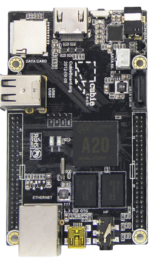
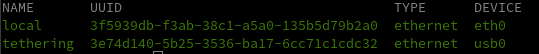
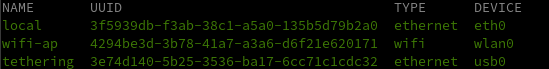

+++
title = 'Routeur ArchLinux arm Cubieboard2 + SSD'
date = 2022-01-26 00:00:00 +0100
categories = ['archlinux']
+++
<div class="item">
  <div class="item__image">
    
  </div>
  <div class="item__content">
    <div class="item__header">
      <h4>Cubieboard2</h4>
    </div>
    <div class="item__description">
      <ul>
          <li>AllWinnerTech SOC A20，ARM® Cortex™-A7 Dual-Core ARM® Mali400 MP2 Complies with OpenGL ES 2.0/1.1</li>
          <li>1GB DDR3 @480M</li>
          <li>3.4GB internal NAND flash, up to 64GB on SD slot, up to 2T on 2.5 SATA disk</li>
          <li>5VDC input 2A or USB otg input</li>
          <li>1x 10/100 ethernet, support usb wifi</li>
          <li>2x USB 2.0 HOST, 1x mini USB 2.0 OTG, 1x micro sd</li>
          <li>1x HDMI 1080P display output</li>
          <li>1x IR, 1x line in, 1x line out</li>
          <li>96 extend pin interface, including I2C, SPI, RGB/LVDS, CSI/TS, FM-IN, ADC, CVBS, VGA, SPDIF-OUT, R-TP, and more</li>
      </ul>
    </div>
  </div>
</div>

## Archlinux arm Cubieboard

Deux alternatives

1. Installation sur SDcard
2. Installtion sud SSD

### 1. Archlinux arm Cubieboard/SDcard

[Archlinux arm cubieboard2](https://archlinuxarm.org/platforms/armv7/allwinner/cubieboard-2)  


#### Préparation du support d'installation

su mode  
Mettre à zéro le début de la carte SD:

	dd if=/dev/zero of=/dev/sdd bs=1M count=8

Démarrer fdisk sur /dev/sdd

    fdisk /dev/sdd

À l'invite fdisk, supprimez les anciennes partitions et créez-en une nouvelle :

1.    Tapez o. Cela effacera toutes les partitions du disque.
*    Tapez p pour lister les partitions. Il ne devrait plus y avoir de partitions.
*    Tapez maintenant n, puis p pour primaire, 1 pour la première partition du disque, 2048 pour le premier secteur, puis appuyez sur ENTRÉE pour accepter le dernier secteur par défaut.
*    Écrivez la table de partition et quittez en tapant w.

Formater et monter la partition d'installation:

```bash
mkfs.ext4 /dev/sdd1
mkdir -p /mnt/tmp
mount /dev/sdd1 /mnt/tmp
```

Télécharger et extraire l'image Arch Linux ARM sur la partition d'installation:

```bash
wget http://os.archlinuxarm.org/os/ArchLinuxARM-armv7-latest.tar.gz
bsdtar -xpf ArchLinuxARM-armv7-latest.tar.gz -C /mnt/tmp
sync
```

Télécharger et installer le bootloader sur la SDcard:

```bash
wget http://os.archlinuxarm.org/os/sunxi/boot/cubieboard2/u-boot-sunxi-with-spl.bin
dd if=u-boot-sunxi-with-spl.bin of=/dev/sdd bs=1024 seek=8
wget http://os.archlinuxarm.org/os/sunxi/boot/cubieboard2/boot.scr -O /mnt/tmp/boot/boot.scr
umount /mnt/tmp
sync
```

#### Insérer la carte dans la carte Cubieboard2 

Insérez la carte micro SD dans la Cubieboard 2, connectez l'ethernet, et appliquez une alimentation 5V.
Utilisez la console série ou SSH à l'adresse IP donnée à la carte par votre routeur.

*    Connectez-vous en tant qu'utilisateur par défaut **alarm** avec le mot de passe **alarm**.
*    Le mot de passe **root** par défaut est **root**.

Initialisez le trousseau de clés pacman et remplissez les clés de signature du paquet Arch Linux ARM :

```bash
pacman-key --init
pacman-key --populate archlinuxarm
```

#### Installer le paquet U-Boot/SDcard

Afin de recevoir les mises à jour du chargeur de démarrage U-Boot, après s'être connecté au système, tapez :

    pacman -Syu uboot-cubieboard2

Lorsque vous êtes invité à le faire, appuyez sur y et appuyez sur entrée pour flasher le chargeur de démarrage sur la carte SD.
    
Fusionnez tous les fichiers pacnew créés par le paquet en écrasant les fichiers du chargeur de démarrage installés manuellement. 


### 2. Archlinux arm Cubieboard/SSD

#### Installation sur USB ou SATA

Remplacez sdd dans les instructions suivantes par le nom de périphérique du lecteur USB ou SATA tel qu'il apparaît sur votre ordinateur.

Remettez à zéro le début de la carte SD :

    dd if=/dev/zero of=/dev/sdd bs=1M count=8

Installez le chargeur de démarrage U-Boot :

```bash
wget http://os.archlinuxarm.org/os/sunxi/boot/cubieboard2/u-boot-sunxi-with-spl.bin
dd if=u-boot-sunxi-with-spl.bin of=/dev/sdd bs=1024 seek=8
sync
```

Lancez fdisk pour partitionner le disque USB ou SATA :

    fdisk /dev/sdd

À l'invite de fdisk, supprimez les anciennes partitions et créez-en une nouvelle :

* Tapez **o**. Cela effacera toutes les partitions sur le lecteur.
* Tapez **p** pour lister les partitions. Il ne devrait plus y avoir de partitions.
* Tapez maintenant **n**, puis **p** pour primaire, 1 pour la première partition du disque, 2048 pour le premier secteur, puis appuyez sur **ENTRÉE** pour accepter le dernier secteur par défaut.
* Ecrivez la table de partition et quittez en tapant **w**.

Créez le système de fichiers ext4 :

    mkfs.ext4 /dev/sdd1

Montez le système de fichiers :

    mkdir -p /mnt/tmp
    mount /dev/sdd1 /mnt/tmp

Téléchargez et extrayez le système de fichiers racine :

    wget http://os.archlinuxarm.org/os/ArchLinuxARM-armv7-latest.tar.gz
    bsdtar -xpf ArchLinuxARM-armv7-latest.tar.gz -C /mnt/tmp

Installez les fichiers de démarrage du chargeur de démarrage U-Boot :

    wget http://os.archlinuxarm.org/os/sunxi/boot/cubieboard2/boot.scr -O /mnt/tmp/boot/boot.scr
    umount /mnt/tmp
    sync

Insérez la carte micro SD dans le Cubieboard 2, connectez le lecteur USB ou SATA, connectez ethernet, et appliquez une alimentation 5V.  
Utilisez la console série ou SSH à l'adresse IP donnée à la carte par votre routeur.  

* Connectez-vous en tant qu'utilisateur par défaut alarm avec le mot de passe alarm.  
* Le mot de passe root par défaut est root.  

Initialisez le trousseau de clés pacman et remplissez les clés de signature du paquet Arch Linux ARM :

    pacman-key --init
    pacman-key --populate archlinuxarm

#### Installer le paquet U-Boot/SDcard

Afin de recevoir les mises à jour du chargeur de démarrage U-Boot, après s'être connecté au système, tapez :

    pacman -Syu uboot-cubieboard2

Lorsque vous êtes invité à le faire, appuyez sur y et appuyez sur entrée pour flasher le chargeur de démarrage sur la carte SD.
    
Fusionnez tous les fichiers pacnew créés par le paquet en écrasant les fichiers du chargeur de démarrage installés manuellement. 

## Compléments d'installation

Modifier le mot de passe root (ytreu)

    psswd root

Je me connecte à Cubieboard2 en utilisant ssh, donc le réseau doit être en place et sshd doit s'exécuter dans la nouvelle installation (openssh est installé par défaut)  
Relever l'adresse IP : `ip a` &rarr; 192.168.0.28 dans mon cas  
Depuis un autre terminal sur le même réseau

	ssh alarm@192.168.0.28

Par dégaut le paquet **base** est installé, on ajoute **base-devel**

	pacman -S base-devel

hostname et fuseau horaire Paris  

	echo 'cubiearch' > /etc/hostname
    timedatectl set-timezone Europe/Paris

```
               Local time: Sun 2022-01-23 15:32:34 CET
           Universal time: Sun 2022-01-23 14:32:34 UTC
                 RTC time: Sun 2022-01-23 14:32:35
                Time zone: Europe/Paris (CET, +0100)
System clock synchronized: yes
              NTP service: active
          RTC in local TZ: no
```

### Utilisateur

créer un utilisateur avec la commande suivante  

	useradd -m -g users -c 'cub cubiearch' -s /bin/bash cub 
	passwd cub  # (cub49)

Déconnexion puis connexion utilisateur via ssh

	ssh cub@192.168.0.28

Modifier sudoers pour accès sudo sans mot de passe à l'utilisateur **cub** (en mode su) 

	echo "cub    ALL=(ALL) NOPASSWD: ALL" >> /etc/sudoers

### yay

On veut avoir accès à l’outil `yay`  (**base-devel** est installé)

```bash
sudo pacman -S --needed git base-devel
cd /tmp && git clone https://aur.archlinux.org/yay.git
cd yay
makepkg -si
```

## Tethering - Partage connexion 4G

*Le tethering offre la possibilité d'utiliser vos données mobiles dans votre tablette ou votre ordinateur portable, donc votre téléphone portable fonctionne comme un modem pour un autre appareil. Il vous permettra d'avoir accès à Internet où que vous soyez.*  


Outils 

    yay -S usbutils dnsutils wget

### Réseau NetworkManager

Basculer le réseau sur NetworkManager  
Désactiver systemd-network

    systemctl disable systemd-networkd.service

Installer et activer NetworkManager

    yay -S networkmanager
    systemctl enable NetworkManager

Installer dnsmasq

    yay -S dnsmasq

Redémarrer

    systemctl reboot 

### Connexion USB du smartphone 

* **Connecter le smartphone au port USB du routeur** à l'aide du câble USB, puis activez l'option USB Tethering dans les paramètres d'Android.  
Paramètres &rarr; Réseau et Internet  
{:height="300"} {:height="300"}   
Le téléphone activera immédiatement le mode Tethering USB lorsqu'il sera branché sur un routeur ( ou un ordinateur portable).  
*Un téléphone verrouillé n'activera pas le mode "Partage via USB" sans une intervention manuelle.*

Vérification

    lsusb

```
Bus 001 Device 005: ID 04e8:6864 Samsung Electronics Co., Ltd GT-I9070 (network tethering, USB debugging enabled)
```

Journal 

```
[ 4368.716945] usb 1-1: new high-speed USB device number 2 using ehci-platform
[ 4368.878620] usb 1-1: New USB device found, idVendor=18d1, idProduct=4ee7, bcdDevice= 4.04
[ 4368.886854] usb 1-1: New USB device strings: Mfr=1, Product=2, SerialNumber=3
[ 4368.894030] usb 1-1: Product: SAMSUNG_Android
[ 4368.898532] usb 1-1: Manufacturer: SAMSUNG
[ 4368.902735] usb 1-1: SerialNumber: ce01182143b18c3403
[ 4394.407755] usb 1-1: USB disconnect, device number 2
[ 4394.827995] usb 1-1: new high-speed USB device number 3 using ehci-platform
[ 4394.990073] usb 1-1: New USB device found, idVendor=04e8, idProduct=6864, bcdDevice= 4.04
[ 4394.998327] usb 1-1: New USB device strings: Mfr=1, Product=2, SerialNumber=3
[ 4395.006804] usb 1-1: Product: SAMSUNG_Android
[ 4395.011421] usb 1-1: Manufacturer: SAMSUNG
[ 4395.015658] usb 1-1: SerialNumber: ce01182143b18c3403
```

Le réseau

    ip a |grep usb0

```
[...]
2: usb0: <BROADCAST,MULTICAST,UP,LOWER_UP> mtu 1500 qdisc fq_codel state UNKNOWN group default qlen 1000
    inet 192.168.233.84/24 brd 192.168.233.255 scope global dynamic noprefixroute usb0
```

Le port usb0 a été créé avec l’adresse 192.168.233.84/24.  
Cette adresse n'est pas fixe , elle change à chaque redémarrage
{: .prompt-warning }

On peut partager la connexion entre le port usb0 et eth0, le port Ethernet du Raspberry Pi.

**Port forwarding**  

Pour que les paquets de données puissent transiter entre les deux réseaux, il faut activer le routage du noyau.

    sudo nano /etc/sysctl.d/30-ipforward.conf

```
net.ipv4.ip_forward=1
net.ipv6.conf.default.forwarding=1
net.ipv6.conf.all.forwarding=1
```

Lancer la commande suivante pour une activation temporaire

    sudo sysctl net.ipv4.ip_forward=1

Cette opération **Port forwarding** est réalisée automatiquement par NetworkManager
{: .prompt-warning }

Redémarrez le système pour prendre cette modification en compte et activer le routage

    sudo systemctl reboot

Le partage de modem USB sur le téléphone est annulé lors du reboot du système, car la sortie USB est momentanément désactivée. Pensez à revalider le partage de modem USB après chaque reboot !
{: .prompt-warning }


### Manipulations sur PC1

On va utiliser un port ethernet libre **enp3s0f1** de PC1 pour communiquer par le réseau filaire avec le cubieboard

```bash
sudo ip link set dev enp3s0f1 up  # activation
sudo ip addr add dev enp3s0f1 10.19.1.2/24  # adresse ip statique
```

Avant de basculer physiquement sur le nouveau  réseau, il faut passer en IP static le cubieboard  

### Cubieboard - Adresse IP statique

[Internet connection sharing with NetworkManager](https://fedoramagazine.org/internet-connection-sharing-networkmanager/)

(en mode su) 

On liste les connexions

    nmcli connection show

```
NAME                    UUID                                  TYPE      DEVICE 
wired connection 1      3e74d140-5b25-3536-ba17-6cc71c1cdc32  ethernet  usb0   
wired connection 2      3f5939db-f3ab-38c1-a5a0-135b5d79b2a0  ethernet  eth0   
```

Pour activer le partage, créez une connexion pour l'interface `eth0` et définissez la propriété `ipv4.method shared`

```bash
# Ajout connexion type ethernet sur eth0 en mode partagée
nmcli connection add type ethernet ifname eth0 ipv4.method shared con-name local
# Définir Adresse 10.19.1.1 , gateway 10.19.1.1 sur eth0
nmcli connection modify "3f5939db-f3ab-38c1-a5a0-135b5d79b2a0" \
ipv4.addresses "10.19.1.1/24" \
ipv4.gateway "10.19.1.1" \
ipv4.method "shared" 
```

Visualiser

    nmcli connection show




La méthode IPv4 partagée (shared) fait plusieurs choses :

*    active le transfert IP pour l'interface ;
*    ajoute des règles de pare-feu et active le masquage ;
*    démarre dnsmasq en tant que serveur DHCP et DNS.

Modification de la plage d'adresses IP partagées

Regardez maintenant comment NetworkManager a configuré l'interface en aval eth0 :

    ip -o addr show eth0

```
2: eth0    inet 10.19.1.1/24 brd 10.19.1.255 scope global noprefixroute eth0\       valid_lft forever preferred_lft forever
2: eth0    inet6 fe80::21ac:1487:4906:d81d/64 scope link noprefixroute \       valid_lft forever preferred_lft forever
```

10.19.1.1/24 est l'adresse définie dans NetworkManager pour un périphérique en mode partagé. Les adresses de cette plage sont également distribuées via DHCP à d'autres ordinateurs. Si la plage entre en conflit avec d'autres réseaux privés de votre environnement, modifiez-la en modifiant la propriété ipv4.addresses :

Si vous souhaitez modifier l'adresse ip local

    nmcli connection modify local ipv4.addresses 192.168.42.1/24

N'oubliez pas de réactiver le profil de connexion après toute modification pour appliquer les nouvelles valeurs :

    nmcli connection up local
    ip -o addr show eth0

```
2: enp1s0 inet 192.168.42.1/24 brd 192.168.42.255 ...
```

Créer motd

    sudo nano /etc/motd

```
   ___       _     _         _             _    
  / __|_  _ | |__ (_) ___   /_\   _ _  __ | |_  
 | (__| || || '_ \| |/ -_) / _ \ | '_|/ _|| ' \ 
  \___|\_,_||_.__/|_|\___|/_/ \_\|_|  \__||_||_|
        _   __     _  ___    _     _            
       / | /  \   / |/ _ \  / |   / |           
       | || () |_ | |\_, /_ | | _ | |           
       |_| \__/(_)|_| /_/(_)|_|(_)|_|           
```


Redémarrer networkManager

    sudo systemctl restart NetworkManager
    journalctl -u NetworkManager

```
Jan 24 09:55:08 cubiearch NetworkManager[354]: <info>  [1643014508.7448] manager: startup complete
Jan 24 09:55:08 cubiearch dnsmasq[386]: compile time options: IPv6 GNU-getopt DBus no-UBus i18n IDN2 DHCP DHCPv6 no-Lua TFTP conntrack ipset auth cryptohash DNSSEC loop-detect inotify dumpfile
Jan 24 09:55:08 cubiearch dnsmasq[386]: chown of PID file /var/run/nm-dnsmasq-eth0.pid failed: Operation not permitted
Jan 24 09:55:08 cubiearch dnsmasq-dhcp[386]: DHCP, IP range 10.19.1.10 -- 10.19.1.254, lease time 1h
Jan 24 09:55:08 cubiearch dnsmasq[386]: reading /etc/resolv.conf
Jan 24 09:55:08 cubiearch dnsmasq[386]: using nameserver 192.168.75.201#53
Jan 24 09:55:08 cubiearch dnsmasq[386]: cleared cache
Jan 24 09:55:10 cubiearch NetworkManager[354]: <warn>  [1643014510.2203] ndisc[0x1a05ef8,"eth0"]: solicit: failure sending router solicitation: Invalid argument (22)
Jan 24 09:58:12 cubiearch dnsmasq[363]: setting upstream servers from DBus
Jan 24 09:58:12 cubiearch dnsmasq[363]: using nameserver 192.168.75.201#53(via usb0)
Jan 24 09:58:12 cubiearch dnsmasq[363]: using nameserver 192.168.75.201#53 for domain 75.168.192.in-addr.arpa
Jan 24 09:58:12 cubiearch dnsmasq[363]: using nameserver 192.168.75.201#53 for domain 84.75.168.192.in-addr.arpa
Jan 24 09:58:12 cubiearch dnsmasq[363]: using nameserver 2a0d:e487:34f:f916::e5#53(via usb0)
Jan 24 09:58:12 cubiearch dnsmasq[363]: using nameserver 2a0d:e487:34f:f916::e5#53 for domain 6.1.9.f.f.4.3.0.7.8.4.e.d.0.a.2.ip6.arpa
Jan 24 09:58:12 cubiearch dnsmasq[363]: using nameserver 2a0d:e487:34f:f916::e5#53 for domain 0.0.0.0.0.0.0.0.0.0.0.0.0.8.e.f.ip6.arpa
Jan 24 09:58:12 cubiearch dnsmasq[363]: using nameserver 2a0d:e487:34f:f916::e5#53 for domain e.e.a.f.d.1.b.4.b.3.0.7.8.4.d.d.6.1.9.f.f.4.3.0.7.8.4.e.d.0.a.2.ip6.arpa
Jan 24 09:58:12 cubiearch dnsmasq[363]: using nameserver 2a0d:e487:34f:f916::e5#53 for domain 4.6.0.7.0.0.b.9.4.1.3.4.0.6.3.4.0.0.0.0.0.0.0.0.0.0.0.0.0.8.e.f.ip6.arpa
Jan 24 09:58:12 cubiearch dnsmasq[363]: cleared cache
Jan 24 09:58:12 cubiearch dnsmasq[386]: reading /etc/resolv.conf
Jan 24 09:58:12 cubiearch dnsmasq[386]: using nameserver 192.168.75.201#53
Jan 24 09:58:12 cubiearch dnsmasq[386]: using nameserver 2a0d:e487:34f:f916::e5#53
Jan 24 09:58:12 cubiearch dnsmasq[386]: cleared cache
```

L'adressage ip

    ip a

```
2: eth0: <BROADCAST,MULTICAST,UP,LOWER_UP> mtu 1500 qdisc mq state UP group default qlen 1000
    link/ether 02:c4:04:40:f0:ff brd ff:ff:ff:ff:ff:ff
    inet 10.19.1.1/24 brd 10.19.1.255 scope global noprefixroute eth0
       valid_lft forever preferred_lft forever
    inet6 fe80::21ac:1487:4906:d81d/64 scope link noprefixroute 
       valid_lft forever preferred_lft forever
3: usb0: <BROADCAST,MULTICAST,UP,LOWER_UP> mtu 1500 qdisc fq_codel state UNKNOWN group default qlen 1000
    link/ether 66:65:ec:2e:bf:b0 brd ff:ff:ff:ff:ff:ff
    inet 192.168.75.84/24 brd 192.168.75.255 scope global dynamic noprefixroute usb0
       valid_lft 2983sec preferred_lft 2983sec
    inet6 2a0d:e487:34f:f916:dd48:703b:4b1d:faee/64 scope global dynamic noprefixroute 
       valid_lft 3170sec preferred_lft 3170sec
    inet6 fe80::4360:4314:9b00:7064/64 scope link noprefixroute 
       valid_lft forever preferred_lft forever
```

L'adresse 192.168.75.201 n'est pas fixe , elle change à chaque redémarrage
{: .prompt-warning }

### speedtest-cli

Pour tester la vitesse de la liaison internet

```
wget -O speedtest-cli https://raw.githubusercontent.com/sivel/speedtest-cli/master/speedtest.py
chmod +x speedtest-cli
```

Lancer le test

    ./speedtest-cli

```
Retrieving speedtest.net configuration...
Testing from Free Mobile SAS (37.166.63.204)...
Retrieving speedtest.net server list...
Selecting best server based on ping...
Hosted by LASOTEL (Lyon) [391.80 km]: 83.351 ms
Testing download speed................................................................................
Download: 18.01 Mbit/s
Testing upload speed......................................................................................................
Upload: 1.63 Mbit/s
```

## Wifi Hotspot

*Les hotspots WiFi (ou bornes WiFi) sont des points d’accès (ou AP, pour Access Points en anglais) au WiFi qui agissent comme relais à un réseau WiFi*

* [Managing WiFi using NetworkManager](https://variwiki.com/index.php?title=Wifi_NetworkManager)

Connecter le dongle usb/wifi TP-LINK RTL8192cu 

Outil wifi

    yay -S iw

Identifier le périphérique du réseau Wi-Fi

    lsusb

```
Bus 002 Device 002: ID 0bda:8178 Realtek Semiconductor Corp. RTL8192CU 802.11n WLAN Adapter
```

Obtenez le nom de l'interface du réseau Wi-Fi

    ip a

```
4: wlan0: <NO-CARRIER,BROADCAST,MULTICAST,UP> mtu 1500 qdisc mq state DOWN group default qlen 1000
    link/ether 56:3a:15:2e:49:95 brd ff:ff:ff:ff:ff:ff permaddr a0:f3:c1:0c:d5:8
```

Vérifier si compatible AP (access point)

    iw

```
	Supported interface modes:
		 * IBSS
		 * managed
		 * AP
		 * AP/VLAN
		 * monitor
		 * mesh point
		 * P2P-client
		 * P2P-GO
```

### nmcli - Profil réseau hotspot wifi

Créez un profil de réseau pour votre Hotspot  
Définit la méthode de connexion comme partagée.  
hotspot pas ouvert au public, alors définissons une phrase de passe   
Affichez la connexion une fois terminé.  

```bash
IFNAME="wlan0"
HOT_NAME="wifi-ap"
nmcli con add type wifi ifname $IFNAME mode ap con-name $HOT_NAME ssid Hotspot4G
nmcli con modify $HOT_NAME 802-11-wireless.band bg
nmcli con modify $HOT_NAME 802-11-wireless.channel 1
nmcli con modify $HOT_NAME 802-11-wireless-security.key-mgmt wpa-psk
nmcli con modify $HOT_NAME 802-11-wireless-security.proto rsn
nmcli con modify $HOT_NAME 802-11-wireless-security.group ccmp
nmcli con modify $HOT_NAME 802-11-wireless-security.pairwise ccmp
nmcli con modify $HOT_NAME 802-11-wireless-security.psk RetenueCouvruPapuleBrade
nmcli con modify $HOT_NAME ipv4.method shared
nmcli con up $HOT_NAME
```

*Connection 'wifi-ap' (4294be3d-3b78-41a7-a3a6-d6f21e620171) successfully added.  
Connection successfully activated (D-Bus active path: /org/freedesktop/NetworkManager/ActiveConnection/7)*

>Un fichier `/etc/NetworkManager/system-connections/Hotspot4G.nmconnection` a été créé

Vérifier une information détaillée sur la connexion.

    nmcli connection show wifi-ap

Vérifier les informations d'interface et d'ip.

    nmcli connection show 



On passe le Hotspot4G en ip fixe 10.19.2.0/24 

    nmcli connection modify wifi-ap ipv4.addresses "10.19.2.1/24" ipv4.gateway "10.19.2.1"

Redémarrer NetworkManager

    systemctl restart NetworkManager

### QrCode Hotspot4G

Générer un code QR pour le wifi

    qrencode "WIFI:T:WPA-PSK;S:Hotspot4G;P:RetenueCouvruPapuleBrade;;" -o Hotspot4G.png


