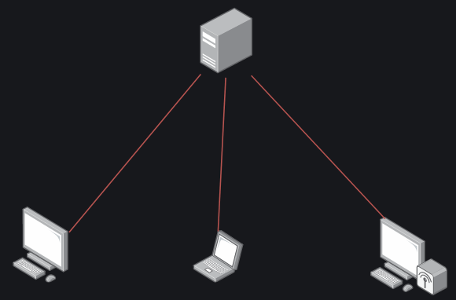
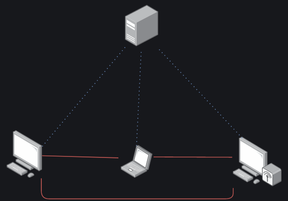
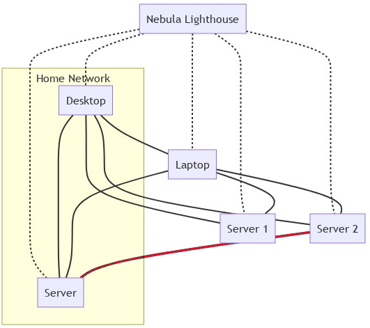

+++
title = 'Nebula est un outil de réseau superposé évolutif peer-to-peer pour connecter de manière transparente des ordinateurs'
date = 2022-02-17 00:00:00 +0100
categories = ['network']
+++
[Nebula](https://github.com/slackhq/nebula) est un outil de réseau superposé évolutif axé sur les performances, la simplicité et la sécurité. Il vous permet de connecter de manière transparente des ordinateurs partout dans le monde. Nebula est portable et fonctionne sous Linux, OSX, Windows, iOS et Android. Il peut être utilisé pour connecter un petit nombre d'ordinateurs, mais est également capable de connecter des dizaines de milliers d'ordinateurs.

Nebula intègre un certain nombre de concepts existants tels que le cryptage, les groupes de sécurité, les certificats et le tunneling, et chacun de ces éléments individuels existait avant Nebula sous diverses formes. Ce qui différencie Nebula des offres existantes, c'est qu'il rassemble toutes ces idées, ce qui donne une somme plus importante que ses parties individuelles.

* Une documentation supplémentaire est disponible [ici (en)](https://www.defined.net/nebula/introduction/).
* Vous pouvez en savoir plus sur Nebula [ici (en)](https://medium.com/p/884110a5579).
* Vous pouvez également rejoindre le groupe Slack NebulaOSS [ici (en)](https://join.slack.com/t/nebulaoss/shared_invite/enQtOTA5MDI4NDg3MTg4LTkwY2EwNTI4NzQyMzc0M2ZlODBjNWI3NTY1MzhiOThiMmZlZjVkMTI0NGY4YTMyNjUwMWEyNzNkZTJmYzQxOGU).

## Le réseau maillé Nebula - une introduction

### Qu'est-ce qu'un réseau maillé ?

[Nebula mesh network - an introduction](https://theorangeone.net/posts/nebula-intro/)

#### VPN traditionnel

Un VPN classique, tel que WireGuard et OpenVPN, fonctionne selon un modèle en étoile, de sorte que tout le trafic passe par le "hub" central, où que se trouvent les autres dispositifs.

   
VPN traditionnel

Ce modèle est simple à maintenir pour les petits déploiements, et c'est généralement ce que vous voulez lorsque vous utilisez un VPN pour permettre l'accès à un réseau d'entreprise privé. C'est également le modèle que vous recherchez lorsque vous pensez à des solutions VPN commerciales telles que Mullvad et PIA, où vous ne voulez pas que les pairs se connectent les uns aux autres, mais simplement qu'ils acheminent leur trafic via le serveur VPN. Cette architecture ne fonctionne pas très bien lorsque les nœuds essaient de communiquer entre eux, car le trafic doit passer par l'hôte. Les nœuds peuvent être des dispositifs individuels ou des réseaux entiers dans le cadre d'un déploiement site à site.

#### VPN maillé

Un réseau maillé est très similaire, mais au lieu de passer par un serveur unique, le trafic circule directement de client à client sans jamais toucher le serveur.

   
VPN maillé

Comme vous pouvez le constater, il y a toujours un nœud central. Il s'agit de l'"introducteur", ou "phare (lighthouse)" dans le jargon de Nebula, et il est chargé de s'assurer que tous les nœuds du réseau peuvent communiquer entre eux efficacement. Le phare est également le seul nœud qui nécessite une IP statique. Comme le trafic n'est plus acheminé par un seul nœud, les besoins en ressources de ce nœud sont considérablement réduits, tout comme les goulets d'étranglement. Le trafic peut emprunter les chemins qu'il souhaite, étant simplement limité par les réseaux situés directement entre lui et le dispositif cible, ce qui constituerait un goulot d'étranglement dans toute configuration de réseau. Dans certaines situations, cela signifie que le trafic ne quittera pas le réseau local et qu'il fonctionnera donc à la vitesse maximale du réseau local.

Nebula interroge et met à jour en permanence les IP utilisables pour les communications vers un nœud, ce qui signifie que les appareils peuvent facilement se déplacer entre les réseaux et être toujours accessibles via la même IP VPN. Si le noeud de destination est sur le LAN, le trafic sera envoyé à travers une interface LAN, sinon il sera envoyé sur Internet, toujours directement vers le dispositif en utilisant le hole punching UDP.

### Que dire de WireGuard

Tout le monde aime **WireGuard**, et pour une bonne raison ! Il est relativement simple, rapide et intégré au noyau Linux. Malheureusement, il ne supporte pas nativement le maillage. Il est possible de faire croire à WireGuard qu'il s'agit d'un maillage, mais il n'est pas vraiment conçu pour cela. [wg-dynamic](https://git.zx2c4.com/wg-dynamic) prévoit de changer cela, mais il est toujours en développement.

Il y a [tailscale](https://tailscale.com/), qui est un VPN maillé qui utilise **WireGuard** sous le capot. Si vous voulez vraiment utiliser **WireGuard**, c'est ce qui s'en rapproche le plus. Cependant, il lui manque les fonctionnalités de pare-feu de **Nebula**, sans compter que le composant serveur (introducer) n'est pas open-source.

## Nebula - Réseau de superposition open source

Nebula est un outil de réseau superposé conçu pour être rapide, sécurisé et évolutif. Connectez n'importe quel nombre d'hôtes avec des tunnels chiffrés à la demande qui fonctionnent sur n'importe quel réseau IP et sans ouvrir de ports de pare-feu.

[Télécharger Nebula sur GitHub](https://github.com/slackhq/nebula)

### Caractéristiques principales

*    Peer-to-peer, couche 3, réseau virtuel (Détails techniques)
*    Supporte le trafic TCP/UDP/ICMP via l'adaptateur TUN avec split-tunneling.
*    Pare-feu de l'hôte avec moteur de règles basé sur des groupes pour le trafic superposé
*    Découverte de routes et traversée NAT assistée par de simples hôtes "lookup".

#### Identité et autorisation

Nebula utilise un modèle PKI pour établir la confiance entre les hôtes et les réseaux.

*    Les certificats des hôtes sont utilisés pour identifier et autoriser les pairs de manière sécurisée.
*    Les hôtes s'authentifient mutuellement en validant les certificats et les AC.
*    Les règles de pare-feu sont appliquées en évaluant les "groupes de sécurité" des certificats.

Les versions incluent l'exécutable `nebula-cert` pour générer les clés, les certificats, les ACs, et pour signer les certificats d'hôtes.

### Compatibilité

Nebula est écrit en Go et est conçu pour la portabilité.

*    Conditionné pour Linux, macOS, Windows, iOS, Android et FreeBSD.
*    Fonctionne efficacement sur du matériel x86, ARM, MIPS, PPC et RISC (32 et 64 bits).
*    Un seul exécutable `nebula` exécute le pare-feu et le service de l'hôte.
*    Le fichier de configuration de l'hôte définit la confiance de l'autorité de certification, le certificat et la clé de l'hôte, ainsi que les règles du pare-feu.
*    Au moins un hôte du réseau superposé doit être un Lighthouse, qui aide les hôtes à découvrir les routes les uns vers les autres et à traverser les NATs.

#### Qu'est-ce qu'un réseau superposé (overlay network) ?

En termes simples, un réseau superposé est un réseau virtuel qui fonctionne au-dessus d'un autre réseau. 

* Un réseau privé virtuel (VPN) est un réseau superposé. 
* Un tunnel SSH peut aider à créer un réseau superposé. 
* Un nuage privé virtuel (VPC) est un réseau superposé proposé par les fournisseurs d'infrastructures en nuage.

Inspiré par un certain nombre d'outils et de projets existants, **Nebula** a été créé pour faciliter la conception, le déploiement et la gestion de réseaux superposés hautement performants, portables et sécurisés.

### Détails techniques

**Nebula** est un réseau défini par logiciel **peer-to-peer** mutuellement authentifié basé sur le **Noise Protocol Framework**. Nebula utilise des certificats pour confirmer l'adresse IP, le nom et l'appartenance d'un nœud à des groupes définis par l'utilisateur. Les groupes définis par l'utilisateur de Nebula permettent de filtrer le trafic entre les nœuds en fonction du fournisseur.

Les nœuds de découverte permettent aux pairs individuels de se trouver les uns les autres et utilisent en option le hole punching UDP pour établir des connexions derrière la plupart des pare-feu ou NAT. Les utilisateurs peuvent déplacer les données entre les nœuds d'un nombre illimité de fournisseurs de services en nuage, de centres de données et de points d'extrémité, sans avoir à maintenir un schéma d'adressage particulier.

Nebula utilise un échange de clés **Diffie-Hellman** à courbe elliptique et **AES-256-GCM** dans sa configuration par défaut.

Nebula a été créé pour fournir un mécanisme permettant aux groupes d'hôtes de communiquer en toute sécurité, même à travers l'Internet, tout en permettant des définitions de pare-feu expressives similaires au style des groupes de sécurité du cloud.
{: .prompt-info }

### Plateformes prises en charge

#### Desktop et Server

Consultez la page [releases](https://github.com/slackhq/nebula/releases/latest) pour les téléchargements ou consultez la section [Distribution Packages](https://github.com/slackhq/nebula#distribution-packages).

- Linux - 64 et 32 bits, arm, et autres
- Windows
- MacOS
- Freebsd

#### Paquets de distribution

- Arch Linux](https://archlinux.org/packages/community/x86_64/nebula/)
    ```
    $ sudo pacman -S nebula
    ```
- [Fedora Linux](https://copr.fedorainfracloud.org/coprs/jdoss/nebula/)
    ```
    $ sudo dnf copr enable jdoss/nebula
    $ sudo dnf install nebula
    ```

#### Mobile

- [iOS](https://apps.apple.com/us/app/mobile-nebula/id1509587936?itsct=apps_box&amp;itscg=30200)
- [Android](https://play.google.com/store/apps/details?id=net.defined.mobile_nebula&pcampaignid=pcampaignidMKT-Other-global-all-co-prtnr-py-PartBadge-Mar2515-1)


### Démarrer avec Nebula

Nebula est écrit en Go, et en tant que tel, il est disponible sous la forme d'un seul binaire. Il existe des versions pour Windows, macOS et Linux. Vous aurez du mal à le trouver dans les dépôts de paquets d'une distro Linux (à part [Arch](https://archlinux.org/packages/community/x86_64/nebula/), bien sûr), donc [télécharger les binaires](https://github.com/slackhq/nebula/releases) directement est la façon la plus simple de commencer. Sur les clients, vous n'aurez besoin que du module binaire `nebula`, mais pour provisionner le réseau, vous aurez également besoin de `nebula-cert`   
De plus, il existe des [clients mobiles](https://medium.com/definednet/mobile-nebula-ios-android-mesh-vpn-1088a7c536ee). Ils ne disposent pas encore de toutes les fonctionnalités, ni ne sont totalement au point, mais ils sont tout à fait fonctionnels.

Guide de démarrage rapide de Nebula ([Nebula Quick Start guide](https://www.defined.net/nebula/quick-start/))

#### Mise en route (rapide)

Pour configurer un réseau Nebula, vous aurez besoin de :

1. Les [binaires Nebula](https://github.com/slackhq/nebula/releases) ou les [paquets de distribution](https://github.com/slackhq/nebula#distribution-packages) pour votre plateforme spécifique. Plus précisément, vous aurez besoin de `nebula-cert` et du binaire spécifique de Nebula pour chaque plateforme que vous utilisez.
2. (Facultatif, mais vous devriez vraiment..) Au moins un noeud de découverte avec une adresse IP routable, que nous appelons un phare **"lighthouse"**.  
Les phares de Nebula permettent aux nœuds de se trouver les uns les autres, partout dans le monde. Un phare est le seul nœud d'un réseau Nebula dont l'IP ne doit pas changer. L'exécution d'un phare nécessite très peu de ressources informatiques, et vous pouvez facilement utiliser l'option la moins chère d'un fournisseur d'hébergement en nuage. Si vous n'êtes pas sûr du fournisseur à utiliser, un certain nombre d'entre nous ont utilisé des droplets à 5 $/mois [DigitalOcean](https://digitalocean.com) comme phares.  
Une fois que vous avez lancé une instance, assurez-vous que le trafic udp de Nebula (port par défaut udp/4242) peut l'atteindre sur Internet.
3. Une autorité de certification Nebula, qui sera la racine de confiance pour un réseau Nebula particulier.  
`./nebula-cert ca -name "Mon organisation, Inc"`  
Ceci créera des fichiers nommés `ca.key` et `ca.cert` dans le répertoire courant. Le fichier `ca.key` est le fichier le plus sensible que vous créerez, car il s'agit de la clé utilisée pour signer les certificats des nœuds/hôtes nebula individuels. Veuillez stocker ce fichier dans un endroit sûr, de préférence avec un cryptage fort.
4. Clés des hôtes Nebula et certificats générés par cette autorité de certification
Ceci suppose que vous avez quatre noeuds, nommés lighthouse1, laptop, server1, host3. Vous pouvez nommer les nœuds comme vous le souhaitez, y compris FQDN. Vous devrez également choisir des adresses IP et le sous-réseau associé. Dans cet exemple, nous créons un réseau nebula qui utilisera 192.168.100.x/24 comme plage réseau. Cet exemple présente également les groupes nebula, qui peuvent être utilisés ultérieurement pour définir les règles de trafic dans un réseau nebula.  
`./nebula-cert sign -name "phare1" -ip "192.168.100.1/24"`  
`./nebula-cert sign -name "laptop" -ip "192.168.100.2/24" -groups "laptop,home,ssh"`  
`./nebula-cert sign -name "server1" -ip "192.168.100.9/24" -groupes "serveurs"`  
`./nebula-cert sign -name "host3" -ip "192.168.100.10/24" -groupes "serveurs"`  
5. Fichiers de configuration pour chaque hôte
Téléchargez une copie de la [configuration d'exemple de nebula](https://github.com/slackhq/nebula/blob/master/examples/config.yml).
    * Sur le noeud lighthouse, vous devez vous assurer que `am_lighthouse : true` est défini.
    * Sur chaque hôte, assurez-vous que le phare est correctement défini dans la section `static_host_map`, et qu'il est ajouté à la section `hosts` du phare.
6. Copiez les informations d'identification, la configuration et les binaires de nebula sur chaque hôte.  
Pour chaque hôte, copiez le binaire **nebula** sur l'hôte, ainsi que le fichier `config.yaml` de l'étape 5, et les fichiers `ca.crt`, `{host}.crt`, et `{host}.key` de l'étape 4.  
**NE PAS COPIER  `ca.key`  SUR LES NODS INDIVIDUELS**  
7. Exécutez nebula sur chaque hôte  
`./nebula -config /path/to/config.yaml`


## Ma configuration Nebula

Exécution du phare **"lighthouse"** sur un VPS Debian 10  
Clients, un ordinateur de bureau Arch, un portable laptop et un autre sur un téléphone Android 10

### Clés et certificats

**Nebula** utilise PKI pour l'authentification sous la forme d'autorités de certification (CA).  
Les clients reçoivent la clé publique de l'autorité de certification, et leur propre paire de clés publique/privée signée par l'autorité de certification. Comme chaque client connaît l'autorité de certification, celle-ci peut facilement vérifier si le client est autorisé, et l'ajout de nouveaux clients ne nécessite pas de modifier les fichiers de configuration.

La première étape consiste à créer les fichiers `ca.keyet ca.crt`, qui constituent les clés privées et publiques de votre **AC**. Veillez à ce que le fichier `ca.key` reste privé.  
Je recommande de stocker le fichier hors ligne, et de le traiter comme vous le feriez pour une clé privée SSH sur vos serveurs.

    nebula-cert ca -name "Mon réseau Nebula"

Avant de le verrouiller, nous avons besoin qu'il crée quelques **certificats clients**, 1 pour chaque client. Lors de la génération d'un certificat client, vous devez avoir décidé quel sous-réseau vous utiliserez pour le réseau VPN.   On va utiliser `10.10.10.0/24` 

    nebula-cert sign -name "lighthouse" -ip "10.10.10.1/24"

Cela créera un `lighthouse.crt` et un `lighthouse.key`, signés en utilisant votre **AC Nebula**.  
Ces fichiers devront ensuite être transférés en toute sécurité à votre client.  
Répétez ce processus pour chaque client que vous devez approvisionner, à l'exception des appareils mobiles - nous y reviendrons plus tard.

    nebula-cert sign -name "desktop" -ip "10.10.10.2/24"
    nebula-cert sign -name "laptop" -ip "10.10.10.3/24"

### Phare - Lighthouse

Comme mentionné précédemment, le client lighthouse est utilisé pour établir un tunnel directement entre les clients afin de leur permettre de communiquer.

Lorsqu'il fonctionne, le démon `nebula` utilise très peu de ressources. Quelques Mo de RAM, et pratiquement aucune unité centrale. Quel que soit le périphérique que vous utilisez, il fonctionnera parfaitement. La seule exigence pour un phare est qu'il soit fiable, et qu'il ait une IP statique.

### Phare sans racine - Rootless lighthouse

Par défaut, un phare sera également accessible sur le réseau Nebula comme n'importe quel autre client, mais il est possible de dire à Nebula de ne pas créer d'interface réseau. Cela signifie qu'il ne sera pas possible de communiquer avec lui sur le réseau Nebula, mais que vous pourrez faire fonctionner votre lighthouse sans root.

### Configuration Nebula

La configuration de Nebula, comme tout ce qui se passe dans le cloud, se fait à l'aide d'un fichier **YAML**. La meilleure façon de commencer est d'utiliser l'[exemple de configuration](https://github.com/slackhq/nebula/blob/master/examples/config.yml). 

    config.yml

```yml
# This is the nebula example configuration file. You must edit, at a minimum, the static_host_map, lighthouse, and firewall sections
# Some options in this file are HUPable, including the pki section. (A HUP will reload credentials from disk without affecting existing tunnels)

# PKI defines the location of credentials for this node. Each of these can also be inlined by using the yaml ": |" syntax.
pki:
  # The CAs that are accepted by this node. Must contain one or more certificates created by 'nebula-cert ca'
  ca: /etc/nebula/ca.crt
  cert: /etc/nebula/host.crt
  key: /etc/nebula/host.key
  # blocklist is a list of certificate fingerprints that we will refuse to talk to
  #blocklist:
  #  - c99d4e650533b92061b09918e838a5a0a6aaee21eed1d12fd937682865936c72
  # disconnect_invalid is a toggle to force a client to be disconnected if the certificate is expired or invalid.
  #disconnect_invalid: false

# The static host map defines a set of hosts with fixed IP addresses on the internet (or any network).
# A host can have multiple fixed IP addresses defined here, and nebula will try each when establishing a tunnel.
# The syntax is:
#   "{nebula ip}": ["{routable ip/dns name}:{routable port}"]
# Example, if your lighthouse has the nebula IP of 192.168.100.1 and has the real ip address of 100.64.22.11 and runs on port 4242:
static_host_map:
  "192.168.100.1": ["100.64.22.11:4242"]


lighthouse:
  # am_lighthouse is used to enable lighthouse functionality for a node. This should ONLY be true on nodes
  # you have configured to be lighthouses in your network
  am_lighthouse: false
  # serve_dns optionally starts a dns listener that responds to various queries and can even be
  # delegated to for resolution
  #serve_dns: false
  #dns:
    # The DNS host defines the IP to bind the dns listener to. This also allows binding to the nebula node IP.
    #host: 0.0.0.0
    #port: 53
  # interval is the number of seconds between updates from this node to a lighthouse.
  # during updates, a node sends information about its current IP addresses to each node.
  interval: 60
  # hosts is a list of lighthouse hosts this node should report to and query from
  # IMPORTANT: THIS SHOULD BE EMPTY ON LIGHTHOUSE NODES
  # IMPORTANT2: THIS SHOULD BE LIGHTHOUSES' NEBULA IPs, NOT LIGHTHOUSES' REAL ROUTABLE IPs
  hosts:
    - "192.168.100.1"

  # remote_allow_list allows you to control ip ranges that this node will
  # consider when handshaking to another node. By default, any remote IPs are
  # allowed. You can provide CIDRs here with `true` to allow and `false` to
  # deny. The most specific CIDR rule applies to each remote. If all rules are
  # "allow", the default will be "deny", and vice-versa. If both "allow" and
  # "deny" rules are present, then you MUST set a rule for "0.0.0.0/0" as the
  # default.
  #remote_allow_list:
    # Example to block IPs from this subnet from being used for remote IPs.
    #"172.16.0.0/12": false

    # A more complicated example, allow public IPs but only private IPs from a specific subnet
    #"0.0.0.0/0": true
    #"10.0.0.0/8": false
    #"10.42.42.0/24": true

  # EXPERIMENTAL: This option my change or disappear in the future.
  # Optionally allows the definition of remote_allow_list blocks
  # specific to an inside VPN IP CIDR.
  #remote_allow_ranges:
    # This rule would only allow only private IPs for this VPN range
    #"10.42.42.0/24":
      #"192.168.0.0/16": true

  # local_allow_list allows you to filter which local IP addresses we advertise
  # to the lighthouses. This uses the same logic as `remote_allow_list`, but
  # additionally, you can specify an `interfaces` map of regular expressions
  # to match against interface names. The regexp must match the entire name.
  # All interface rules must be either true or false (and the default will be
  # the inverse). CIDR rules are matched after interface name rules.
  # Default is all local IP addresses.
  #local_allow_list:
    # Example to block tun0 and all docker interfaces.
    #interfaces:
      #tun0: false
      #'docker.*': false
    # Example to only advertise this subnet to the lighthouse.
    #"10.0.0.0/8": true

# Port Nebula will be listening on. The default here is 4242. For a lighthouse node, the port should be defined,
# however using port 0 will dynamically assign a port and is recommended for roaming nodes.
listen:
  # To listen on both any ipv4 and ipv6 use "[::]"
  host: 0.0.0.0
  port: 4242
  # Sets the max number of packets to pull from the kernel for each syscall (under systems that support recvmmsg)
  # default is 64, does not support reload
  #batch: 64
  # Configure socket buffers for the udp side (outside), leave unset to use the system defaults. Values will be doubled by the kernel
  # Default is net.core.rmem_default and net.core.wmem_default (/proc/sys/net/core/rmem_default and /proc/sys/net/core/rmem_default)
  # Maximum is limited by memory in the system, SO_RCVBUFFORCE and SO_SNDBUFFORCE is used to avoid having to raise the system wide
  # max, net.core.rmem_max and net.core.wmem_max
  #read_buffer: 10485760
  #write_buffer: 10485760

# EXPERIMENTAL: This option is currently only supported on linux and may
# change in future minor releases.
#
# Routines is the number of thread pairs to run that consume from the tun and UDP queues.
# Currently, this defaults to 1 which means we have 1 tun queue reader and 1
# UDP queue reader. Setting this above one will set IFF_MULTI_QUEUE on the tun
# device and SO_REUSEPORT on the UDP socket to allow multiple queues.
#routines: 1

punchy:
  # Continues to punch inbound/outbound at a regular interval to avoid expiration of firewall nat mappings
  punch: true

  # respond means that a node you are trying to reach will connect back out to you if your hole punching fails
  # this is extremely useful if one node is behind a difficult nat, such as a symmetric NAT
  # Default is false
  #respond: true

  # delays a punch response for misbehaving NATs, default is 1 second, respond must be true to take effect
  #delay: 1s

# Cipher allows you to choose between the available ciphers for your network. Options are chachapoly or aes
# IMPORTANT: this value must be identical on ALL NODES/LIGHTHOUSES. We do not/will not support use of different ciphers simultaneously!
#cipher: chachapoly

# Preferred ranges is used to define a hint about the local network ranges, which speeds up discovering the fastest
# path to a network adjacent nebula node.
# NOTE: the previous option "local_range" only allowed definition of a single range
# and has been deprecated for "preferred_ranges"
#preferred_ranges: ["172.16.0.0/24"]

# sshd can expose informational and administrative functions via ssh this is a
#sshd:
  # Toggles the feature
  #enabled: true
  # Host and port to listen on, port 22 is not allowed for your safety
  #listen: 127.0.0.1:2222
  # A file containing the ssh host private key to use
  # A decent way to generate one: ssh-keygen -t ed25519 -f ssh_host_ed25519_key -N "" < /dev/null
  #host_key: ./ssh_host_ed25519_key
  # A file containing a list of authorized public keys
  #authorized_users:
    #- user: steeeeve
      # keys can be an array of strings or single string
      #keys:
        #- "ssh public key string"

# Configure the private interface. Note: addr is baked into the nebula certificate
tun:
  # When tun is disabled, a lighthouse can be started without a local tun interface (and therefore without root)
  disabled: false
  # Name of the device. If not set, a default will be chosen by the OS.
  # For macOS: if set, must be in the form `utun[0-9]+`.
  # For FreeBSD: Required to be set, must be in the form `tun[0-9]+`.
  dev: nebula1
  # Toggles forwarding of local broadcast packets, the address of which depends on the ip/mask encoded in pki.cert
  drop_local_broadcast: false
  # Toggles forwarding of multicast packets
  drop_multicast: false
  # Sets the transmit queue length, if you notice lots of transmit drops on the tun it may help to raise this number. Default is 500
  tx_queue: 500
  # Default MTU for every packet, safe setting is (and the default) 1300 for internet based traffic
  mtu: 1300
  # Route based MTU overrides, you have known vpn ip paths that can support larger MTUs you can increase/decrease them here
  routes:
    #- mtu: 8800
    #  route: 10.0.0.0/16
  # Unsafe routes allows you to route traffic over nebula to non-nebula nodes
  # Unsafe routes should be avoided unless you have hosts/services that cannot run nebula
  # NOTE: The nebula certificate of the "via" node *MUST* have the "route" defined as a subnet in its certificate
  # `mtu` will default to tun mtu if this option is not specified
  # `metric` will default to 0 if this option is not specified
  unsafe_routes:
    #- route: 172.16.1.0/24
    #  via: 192.168.100.99
    #  mtu: 1300
    #  metric: 100


# TODO
# Configure logging level
logging:
  # panic, fatal, error, warning, info, or debug. Default is info
  level: info
  # json or text formats currently available. Default is text
  format: text
  # Disable timestamp logging. useful when output is redirected to logging system that already adds timestamps. Default is false
  #disable_timestamp: true
  # timestamp format is specified in Go time format, see:
  #     https://golang.org/pkg/time/#pkg-constants
  # default when `format: json`: "2006-01-02T15:04:05Z07:00" (RFC3339)
  # default when `format: text`:
  #     when TTY attached: seconds since beginning of execution
  #     otherwise: "2006-01-02T15:04:05Z07:00" (RFC3339)
  # As an example, to log as RFC3339 with millisecond precision, set to:
  #timestamp_format: "2006-01-02T15:04:05.000Z07:00"

#stats:
  #type: graphite
  #prefix: nebula
  #protocol: tcp
  #host: 127.0.0.1:9999
  #interval: 10s

  #type: prometheus
  #listen: 127.0.0.1:8080
  #path: /metrics
  #namespace: prometheusns
  #subsystem: nebula
  #interval: 10s

  # enables counter metrics for meta packets
  #   e.g.: `messages.tx.handshake`
  # NOTE: `message.{tx,rx}.recv_error` is always emitted
  #message_metrics: false

  # enables detailed counter metrics for lighthouse packets
  #   e.g.: `lighthouse.rx.HostQuery`
  #lighthouse_metrics: false

# Handshake Manager Settings
#handshakes:
  # Handshakes are sent to all known addresses at each interval with a linear backoff,
  # Wait try_interval after the 1st attempt, 2 * try_interval after the 2nd, etc, until the handshake is older than timeout
  # A 100ms interval with the default 10 retries will give a handshake 5.5 seconds to resolve before timing out
  #try_interval: 100ms
  #retries: 20
  # trigger_buffer is the size of the buffer channel for quickly sending handshakes
  # after receiving the response for lighthouse queries
  #trigger_buffer: 64


# Nebula security group configuration
firewall:
  conntrack:
    tcp_timeout: 12m
    udp_timeout: 3m
    default_timeout: 10m
    max_connections: 100000

  # The firewall is default deny. There is no way to write a deny rule.
  # Rules are comprised of a protocol, port, and one or more of host, group, or CIDR
  # Logical evaluation is roughly: port AND proto AND (ca_sha OR ca_name) AND (host OR group OR groups OR cidr)
  # - port: Takes `0` or `any` as any, a single number `80`, a range `200-901`, or `fragment` to match second and further fragments of fragmented packets (since there is no port available).
  #   code: same as port but makes more sense when talking about ICMP, TODO: this is not currently implemented in a way that works, use `any`
  #   proto: `any`, `tcp`, `udp`, or `icmp`
  #   host: `any` or a literal hostname, ie `test-host`
  #   group: `any` or a literal group name, ie `default-group`
  #   groups: Same as group but accepts a list of values. Multiple values are AND'd together and a certificate would have to contain all groups to pass
  #   cidr: a CIDR, `0.0.0.0/0` is any.
  #   ca_name: An issuing CA name
  #   ca_sha: An issuing CA shasum

  outbound:
    # Allow all outbound traffic from this node
    - port: any
      proto: any
      host: any

  inbound:
    # Allow icmp between any nebula hosts
    - port: any
      proto: icmp
      host: any

    # Allow tcp/443 from any host with BOTH laptop and home group
    - port: 443
      proto: tcp
      groups:
        - laptop
        - home
```

La configuration d'exemple montre d'excellents exemples sur ce que sont les clés et comment vous pouvez les utiliser. Si vous avez l'intention de déployer Nebula, je vous recommande de la lire en entier. Mais ce sont les choses que vous devez changer pour obtenir un tunnel fonctionnel

#### Spécifiez les clés

Sous la clé pki, spécifiez les chemins vers le ca.crt ainsi que les 2 clés créées pour le client spécifique.

```yml
pki :
  ca : /etc/nebula/ca.crt
  cert : /etc/nebula/host.crt
  key : /etc/nebula/host.key
```

#### Hôtes statiques

Les hôtes statiques définissent une liste de noeuds avec une IP statique pour la communication. Ceci est principalement conçu pour spécifier le phare "lighthouse", mais peut également être utile pour d'autres noeuds qui auront toujours la même IP fixe.

```yml
static_host_map :
  "10.10.10.1" : ["100.64.22.11:4242"]
```

Comme indiqué dans l'exemple de configuration, il doit s'agir d'un mappage de l'IP VPN vers l'IP et le port publics.

#### Configuration du phare "lighthouse"

Pour qu'un noeud soit un phare "lighthouse", vous devez lui dire qu'il est un phare en utilisant la clé `am_lighthouse`. Si le noeud est un phare, rendez-le vrai. S'il ne l'est pas, rendez-la fausse.

```yml
lighthouse:
  am_lighthouse: false
```

En dessous de cela, vous devez spécifier les IP VPN de tous les phares. Si le noeud que vous éditez est un phare, assurez-vous que hosts est vide. Oui, nebula supporte les phares multiples !

```yml
lighthouse:
  hosts:
    - "10.10.10.1"
```

#### Écouter "Listen"

Par défaut, Nebula écoute sur le port 4242 (UDP) pour le trafic de lighthouse. Pour votre lighthouse, ce port doit être défini sur quelque chose de statique, et maintenu en synchronisation avec les hôtes statiques des clients.   
Pour les noeuds qui ne sont pas fixes, tels que les périphériques clients ordinaires, il est recommandé de définir cette valeur à 0, afin que nebula attribue un port aléatoire au démarrage.

```yml
listen:
  host: 0.0.0.0
  port: 0
```

#### Pare-feu

Nebula n'est pas seulement un tunnel, il intègre également un pare-feu. Les noeuds Nebula peuvent être ajoutés à des groupes, et ces groupes peuvent avoir un certain accès aux ports des noeuds.  
Par exemple, vous pouvez vouloir autoriser uniquement les serveurs du groupe "db" à autoriser le trafic sur le port 5432, ou autoriser uniquement les nœuds du groupe "web" à envoyer du trafic sur les ports 443, 80 et 5432.  
L'exemple de configuration montre comment les configurer selon les besoins.

Pour les tests, je recommande d'autoriser tout le trafic vers tous les périphériques. Si vous voulez resserrer les choses une fois que tout fonctionne, il est préférable de le faire après.

```yml
firewall:
  outbound:
    - port: any
      proto: any
      host: any

  inbound:
    - port: any
      proto: any
      host: any
```

#### Configuration mobile

Comme mentionné précédemment, il existe une application mobile pour se connecter à un réseau Nebula. Elle est encore en version bêta, mais elle est disponible dans les magasins d'applications concernés. Malheureusement, sa configuration est un peu plus difficile.

L'application mobile ne permet pas de recevoir une clé privée arbitraire à utiliser. Au lieu de cela, vous devez générer une paire de clés sur l'appareil et copier le composant public de celle-ci pour qu'il soit signé par l'autorité de certification.

    nebula-cert sign -name "mobile" -ip "10.10.10.3/24" -in-pub ./public.key

La configuration ne se fait pas à l'aide d'un fichier YAML, mais à l'aide des contrôles de l'application mobile. Toutes les étapes devraient être les mêmes que ci-dessus, elles sont juste légèrement différentes. Il est possible de voir à quoi ressemblerait le fichier YAML sous `"Advanced > View rendered config"`, ce qui peut être utile pour voir ce que les contrôles modifient.

>Si vous utilisez déjà un VPN, il se peut que cela ne fonctionne pas très bien. Si vous rencontrez des problèmes, essayez de le désactiver.

### Démarrage du tunnel

Avec les clés et la configuration en place, il est temps de démarrer le réseau Nebula ! La commande est la même que vous démarriez un phare ou un client normal.

    sudo nebula -config /etc/nebula/config.yml

Ceci va démarrer le tunnel nebula tel que configuré dans `/etc/nebula/config.yml`  
Une fois démarré sur toutes les machines requises, elles devraient communiquer et établir un tunnel.  
Si un client meurt, nebula le remarquera et fermera le tunnel, et le trafic des autres noeuds rebondira.  
Si le phare tombe en panne, les clients attendront que le phare réapparaisse et reprendront les connexions.  

### Vérifier que tout fonctionne

Une fois tous les clients démarrés, chaque client pourra envoyer un ping à chaque autre client en utilisant son IP VPN, et le faire passer par le tunnel. Cela signifie que vous avez maintenant mis en place un VPN, et que les clients peuvent avoir des IP fixes pour communiquer entre eux, quel que soit le réseau sur lequel ils se trouvent.

```shell
$ ping 10.10.10.1 -c 3
PING 10.10.10.1 (10.10.10.1) 56(84) octets de données.
64 octets provenant de 10.10.10.1 : icmp_seq=1 ttl=53 time=9.69 ms
64 octets provenant de 10.10.10.1 : icmp_seq=2 ttl=53 time=10.2 ms
64 octets provenant de 10.10.10.1 : icmp_seq=3 ttl=53 time=10.6 ms

--- 10.10.10.1 statistiques ping ---
3 paquets transmis, 3 reçus, 0% de perte de paquets, temps 2003ms
rtt min/avg/max/mdev = 9.692/10.139/10.565/0.356 ms
```

**Mais c'est la même chose que si on utilisait WireGuard. Où est la magie de Nebula ?**

Lorsque vous faites des pings, vérifiez les temps de ping. Les pings vers le phare devraient correspondre à ce que vous attendez d'un serveur en nuage, mais les pings entre les deux clients devraient être nettement inférieurs, car le trafic reste sur le réseau local.

```shell
$ ping 10.10.10.3 -c 3
PING 10.10.10.3 (10.10.10.3) 56(84) octets de données.
64 octets provenant de 10.10.10.3 : icmp_seq=1 ttl=64 time=0.274 ms
64 octets provenant de 10.10.10.3 : icmp_seq=2 ttl=64 time=0.379 ms
64 octets provenant de 10.10.10.3 : icmp_seq=3 ttl=64 time=0.255 ms

--- 10.10.10.3 statistiques de ping ---
3 paquets transmis, 3 reçus, 0% de perte de paquets, temps 2037ms
rtt min/avg/max/mdev = 0.255/0.302/0.379/0.054 ms
```

Lors de la première connexion entre les nœuds, vous pouvez remarquer une certaine latence avant le retour du premier paquet. Nebula est paresseux dans la création de tunnels entre les périphériques, et ne les crée que si nécessaire. Les paquets ne sont pas abandonnés pendant ce temps, mais sont mis en mémoire tampon, donc cela ne devrait pas faire de différence, juste quelque chose à surveiller comme quelque chose de connu plutôt qu'un bug.

### Performances

Nebula est toujours assez rapide, et pour une utilisation régulière, il vous sera difficile de remarquer des problèmes.  
Cependant, les paramètres par défaut ne sont pas parfaitement adaptés aux performances. Lors de mes tests, j'ai atteint environ 700 Mo symétriques sur une liaison gigabit.  
Il n'y a pas de quoi faire la fine bouche, mais il y a vraiment matière à amélioration. WireGuard met la barre pour ce que les performances peuvent être pour un VPN.

Ce problème de performance n'est pas un problème avec Nebula. En parlant avec l'un des développeurs originaux de Nebula, Slack a vu des réseaux Nebula saturer complètement des liens de 5/10 gigabits sans sueur.  
On m'a donné quelques suggestions pour améliorer les performances :

1.    Augmenter la taille des tampons de [lecture/écriture - read/write buffer](https://github.com/slackhq/nebula/blob/master/examples/config.yml#L86-L87) à 20000000 (20MB).
2.    Augmenter la longueur de la [file d'attente de transmission - transmit queue](https://github.com/slackhq/nebula/blob/master/examples/config.yml#L136) à 5000
3.    Augmenter le [MTU](https://github.com/slackhq/nebula/blob/master/examples/config.yml#L138)

En appliquant ces mesures, je me rapprochais de 900 Mo. Les valeurs par défaut sont intentionnellement conservatrices, mais si vous savez ce que vous faites et que vous avez le temps de les modifier, il est possible d'obtenir d'excellentes performances.  
J'espère toujours que les valeurs par défaut seront modifiées pour devenir un peu moins conservatrices à l'avenir.

### Application

**C'est bien beau de chanter les louanges de Nebula, et c'est un outil formidable à connaître pour résoudre certaines situations, mais il n'est pas globalement utile partout.**

En ce qui concerne les serveurs VPN plus proches des utilisateurs, ne vous attendez pas à ce que des sociétés comme Mullvad et PIA commencent à proposer des VPN basés sur Nebula. Nebula n'est pas seulement une technologie non-optimale pour cela, c'est la mauvaise technologie. Dans ces cas, le maillage n'est pas utile, et peut même être un obstacle, donc s'en tenir à des technologies comme OpenVPN et WireGuard est une bien meilleure décision.

**Alors, quand devriez-vous utiliser Nebula ? Ou plus précisément, quand vais-je utiliser Nebula ? **

Actuellement, j'ai un VPN WireGuard déployé sur un VPS Vultr qui remplit deux fonctions :

1.    Accès aux ports / périphériques non publics.
2.    [Tunnel de trafic entre le VPS et mon serveur domestique pour acheminer le trafic vers des applications hébergées en interne](https://theorangeone.net/posts/wireguard-haproxy-gateway/).

Pour cette dernière utilisation (2), je ne changerai pas de WireGuard. Alors que je pourrais utiliser Nebula, je n'ai pas d'avantages dans cette utilisation pour un maillage, car il n'y aura jamais que 2 nœuds. WireGuard a très bien fonctionné pour cette utilisation, et je ne vois pas vraiment une raison ou un besoin de changer.
{: .prompt-warning }

Pour le premier cas (1), cependant, Nebula convient très bien. Dans l'intérêt de la sécurité, j'ai certains services qui n'écoutent que sur une interface VPN.  
Pour les serveurs distants, cela signifie que je dois être sur le réseau VPN pour me connecter en SSH.  
Pour les appareils domestiques, je peux simplement utiliser l'adresse IP locale, sauf si je suis à l'extérieur de la maison. Actuellement, je dois utiliser une adresse IP ou un alias SSH différent pour accéder aux services domestiques selon que je suis à la maison ou non, ce qui est assez compliqué. L'alternative est que le trafic passe de mon ordinateur de bureau à mon serveur via un VPS à Londres, même si les deux appareils sont sur un LAN gigabit - quel gaspillage !

**La nature du maillage de Nebula signifie que lorsque je suis à la maison, le trafic circule uniquement sur mon réseau local, et lorsque je ne suis pas là, il circule directement, plutôt que de passer par le serveur.**  
Cela signifie que je peux toujours me connecter facilement aux services hébergés chez moi, mais que lorsque je suis à la maison, ils fonctionnent super rapidement ! Dans un monde idéal, je routerais tout via Traefik, et j'utiliserais simplement des listes blanches d'IP pour restreindre l'accès à certains services web, plutôt que d'utiliser des ports sur les IP VPN. Malheureusement, alors que WireGuard prend en charge le remplacement des DNS, [Nebula ne le fait pas](https://github.com/slackhq/nebula/issues/318).

   
Configuration réseau prévue (les lignes pleines étant Nebula, les lignes rouges étant WireGuard)

Une fois déployé, je n'aurai qu'un seul tunnel WireGuard à 2 pairs, et tout le reste passera par Nebula !

