+++
title = 'Réseau maillé (Mesh networking) avec Wireguard, topologie réseau (filaire et sans fil) où tous les hôtes sont connectés peer-to-peer'
date = 2022-02-17 00:00:00 +0100
categories = ['wireguard']
+++
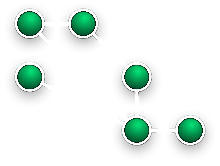 

  - [Réseau maillé (Mesh networking)](#réseau-maillé-mesh-networking)
  - [Réseau maillé privé avec Wireguard](#réseau-maillé-privé-avec-wireguard)
      - [Installer wireguard](#installer-wireguard)
      - [Outil de configuration des réseaux maillés WireGuard](#outil-de-configuration-des-réseaux-maillés-wireguard)
    - [Configuration réseau maillé WireGuard](#configuration-réseau-maillé-wireguard)
      - [Étape 1 : Ajout des informations de base sur les pairs](#étape-1-ajout-des-informations-de-base-sur-les-pairs)
        - [Méthode A : Avec Excel](#méthode-a-avec-excel)
        - [Méthode B : Avec le terminal](#méthode-b-avec-le-terminal)
      - [Étape 2 : Exportation des fichiers de configuration](#étape-2-exportation-des-fichiers-de-configuration)
      - [Étape 3 : Copier les fichiers de configuration vers les pairs](#étape-3-copier-les-fichiers-de-configuration-vers-les-pairs)
      - [Étape 4 : Démarrer les services WireGuard](#étape-4-démarrer-les-services-wireguard)
      - [Étape 5 : Vérifier la connectivité](#étape-5-vérifier-la-connectivité)
    - [Mise à jour des informations sur les pairs](#mise-à-jour-des-informations-sur-les-pairs)
    - [Afficher les informations sur les pairs](#afficher-les-informations-sur-les-pairs)
    - [Suppression de pairs](#suppression-de-pairs)
    - [Fichiers de base de données](#fichiers-de-base-de-données)
    - [Usages détaillés](#usages-détaillés)

## Réseau maillé (Mesh networking)

Le réseau maillé (ou maillage en réseau ) est une topologie de réseau (filaire et sans fil) où tous les hôtes sont connectés **peer-to-peer** ([pair à pair - wikipedia ](https://fr.wikipedia.org/wiki/Pair_%C3%A0_pair)) sans hiérarchie centrale, formant ainsi une structure en forme de filet.  

* Chaque nœud doit recevoir, envoyer et relayer les données. Ceci évite d'avoir des points névralgiques qui, s'ils tombent en panne, isolent une partie du réseau. 
* Si un hôte est hors service, les données empruntent une route alternative. 
* Un réseau en maille peut relayer les données par « inondation » (flood) ou en utilisant des routes (itinéraires) prédéfinis ; dans le second cas, le réseau doit prévoir des connexions sans interruption ou prévoir des déviations (routes alternatives). 

## Réseau maillé privé avec Wireguard

{:height="100"}

Dans une configuration en réseau maillé, chacun des noeuds est à la fois client et serveur.  
Il faut installer Wireguard sur tous les noeuds du cluster 

#### Installer wireguard

Wireguard est dans le noyau 5.6 et + , les dépendances sont inutiles avec ce noyau  

    sudo apt install wireguard-tools # Debian
    sudo pacman -S  wireguard-tools  # Archlinux

#### Outil de configuration des réseaux maillés WireGuard

[wg-meshconf](https://github.com/k4yt3x/wg-meshconf) est un outil qui vous aidera à générer des fichiers de configuration pour les réseaux maillés WireGuard.  
**Vous pouvez facilement et rapidement créer des réseaux maillés WireGuard en utilisant cet outil.**

Prérequis

    sudo apt install git python3-pip -y
    cd /tmp
    git clone https://github.com/k4yt3x/wg-meshconf.git
    pip3 install --user -U wg-meshconf

### Configuration réseau maillé WireGuard 

[Configuration d’un réseau privé virtuel (vpn) maillé avec Wireguard](https://blog.mirabellette.eu/2022/02/configuration-dun-reseau-prive-virtuel-vpn-maille-avec-wireguard/)

Voyons un exemple concret de la façon dont cet outil peut être utilisé. Cette section va démontrer comment créer un réseau maillé simple avec quatre noeuds en utilisant `wg-meshconf` 

Pour cet exemple, supposons que vous ayez quatre serveurs comme indiqué ci-dessous.  
Ces serveurs peuvent se joindre les uns aux autres via l'adresse `Endpoint`.  
Par exemple, le serveur `tokyo1` peut faire un ping au serveur `shanghai1` avec l'adresse `shanghai1.com`.

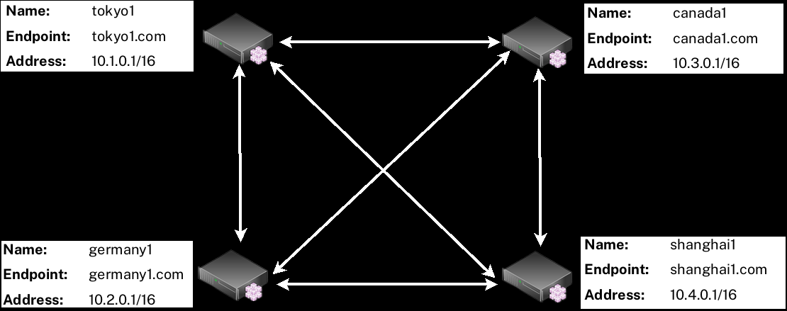

#### Étape 1 : Ajout des informations de base sur les pairs

Vous devrez d'abord ajouter les informations des pairs dans la base de données. Il y a deux façons de le faire : via Excel et via l'interface de ligne de commande.

##### Méthode A : Avec Excel

wg-meshconf a changé le format de sa base de données de JSON à CSV et a ajouté la commande `init` depuis la version 2.4.0. Cela signifie qu'il est maintenant possible pour les utilisateurs de modifier directement le fichier de base de données avec Excel ou d'autres éditeurs compatibles CSV pour créer/lire/mettre à jour/supprimer des informations sur les pairs.


> Exécutez la commande suivante pour initialiser un nouveau fichier de base de données.  
Par défaut, le fichier de base de données est nommé `database.csv`.  
Vous pouvez également spécifier le nom du fichier via `-d`

```shell
wg-meshconf init
```

Ouvrez le fichier CSV de la base de données avec un éditeur comme Excel ou LibreOffice Calc. Vous devriez voir les en-têtes de colonne suivants.

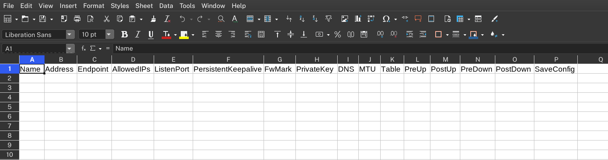

Vous pouvez ensuite remplir les informations sur les pairs.Vous aurez besoin de remplir au moins les valeurs `Name`, `Address`, et `Endpoint` des pairs. Ces valeurs ne peuvent pas être générées automatiquement.

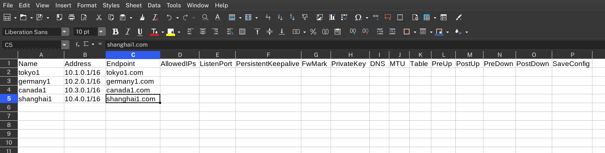

Une fois que vous avez terminé, sauvegardez le fichier et exécutez à nouveau la commande `init` pour générer automatiquement le reste des informations nécessaires telles que les clés privées des pairs.

```shell
wg-meshconf init
```

Si vous vérifiez à nouveau le fichier, vous verrez que les champs nécessaires sont automatiquement remplis.

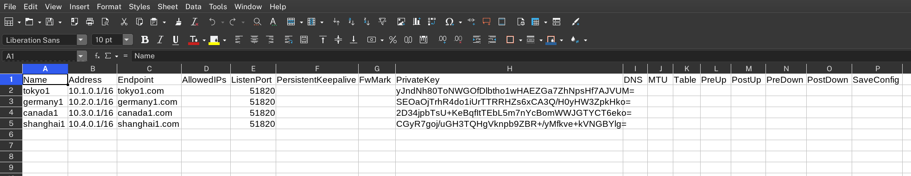

##### Méthode B : Avec le terminal

Si, pour une raison quelconque, vous ne souhaitez pas modifier directement le fichier de la base de données, vous pouvez également utiliser cet outil uniquement via son interface de ligne de commande.

Tout d'abord, nous devons ajouter tous les pairs du réseau maillé dans la base de données. La syntaxe de base pour ajouter de nouveaux pairs est la suivante :

```shell
wg-meshconf addpeer NAME --address IP_ADDRESS --address IP_ADDRESS_2 --endpoint ENDPOINT
```

- La nouvelle clé privée sera générée automatiquement si elle n'est pas spécifiée.
- ListenPort a la valeur par défaut 51820 selon la norme WireGuard.
- Toutes les autres valeurs sont laissées vides par défaut

Il y a plus d'options que vous pouvez spécifier. Utilisez la commande `wg-meshconf addpeer -h` pour plus de détails.

Après avoir ajouté tous les pairs dans la base de données, vous pouvez vérifier qu'ils ont tous été ajoutés correctement via la commande `wg-meshconf showpeers`. Le commutateur `simplify` ici omet toutes les colonnes avec seulement `None`s.

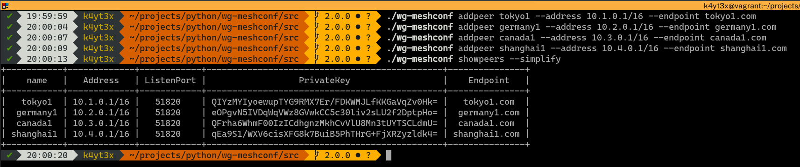

#### Étape 2 : Exportation des fichiers de configuration

Utilisez la commande `genconfig` pour générer des fichiers de configuration pour tous les pairs. Vous pouvez également exporter des configurations pour un seul pair en spécifiant le nom du pair.

Les fichiers de configuration seront nommés d'après les noms des pairs. Par défaut, tous les fichiers de configuration sont exportés dans un sous-répertoire nommé `output`. Vous pouvez changer cela en spécifiant le répertoire de sortie en utilisant l'option `-o` ou l'option `--output`.

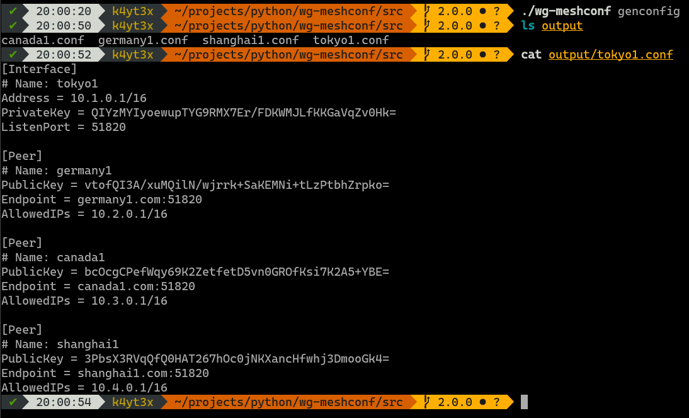

#### Étape 3 : Copier les fichiers de configuration vers les pairs

Copiez chacun des fichiers de configuration vers les pairs correspondants.

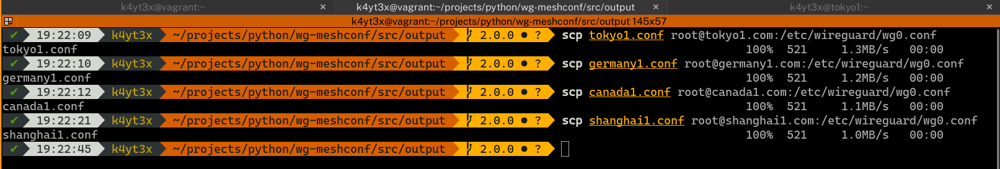

#### Étape 4 : Démarrer les services WireGuard

Démarrez les interfaces WireGuard en utilisant la commande `wg-quick`. Il est également possible de contrôler les interfaces WireGuard via le service systemd `wg-quick@` de WireGuard. Le statut de WireGuard peut être vérifié via la commande `wg` après la configuration des interfaces WireGuard.

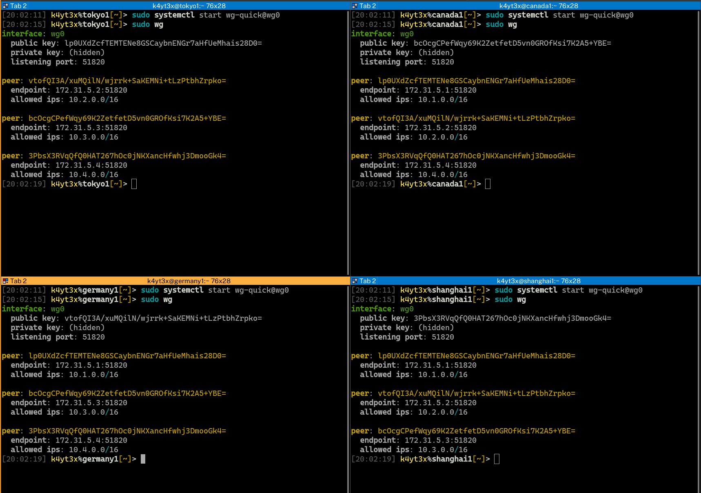

#### Étape 5 : Vérifier la connectivité

Vérifiez que tous les points d'extrémité ont été configurés correctement et peuvent se connecter les uns aux autres.

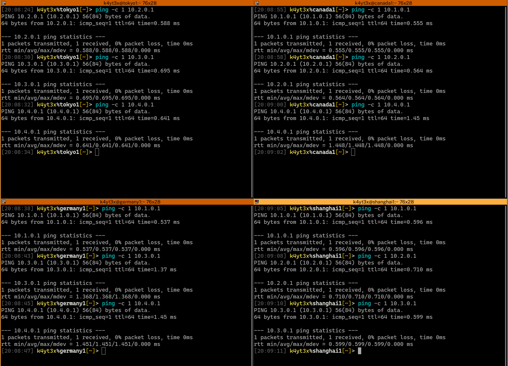

Un réseau maillé a maintenant été créé entre les quatre serveurs.

### Mise à jour des informations sur les pairs

Si vous souhaitez mettre à jour les informations d'un pair, utilisez la commande `updatepeer`. La syntaxe de `updatepeer` est la même que celle de la commande `addpeer`. Au lieu d'ajouter un nouveau pair, cette commande écrase les valeurs des entrées existantes.

Dans l'exemple ci-dessous, supposons que vous souhaitiez mettre à jour l'adresse du point de terminaison de `tokyo1` et la changer en `tokyo321.com`. Utilisez la commande `updatepeer` et spécifiez que le nouveau point de terminaison est `tokyo321.com`. Cela écrasera la valeur existante du point de terminaison de `tokyo1`.

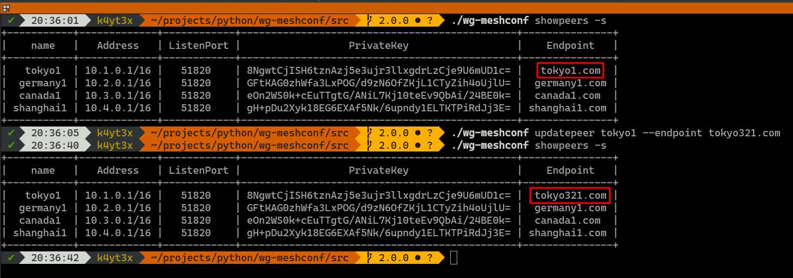

### Afficher les informations sur les pairs

La commande `showpeers` imprime les informations de tous les pairs par défaut.

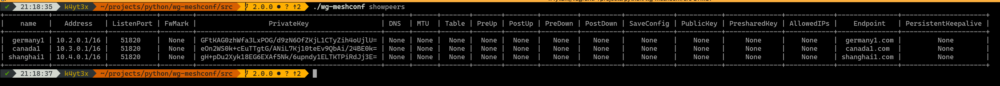

Cela fait beaucoup d'informations et beaucoup de colonnes inutiles qui n'ont que des `None`s. J'ai donc ajouté la commande `-s`/`--simplify` qui omet ces colonnes inutiles.

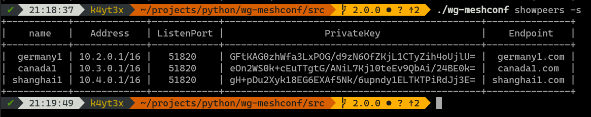

Vous pouvez également demander des informations sur un pair spécifique.

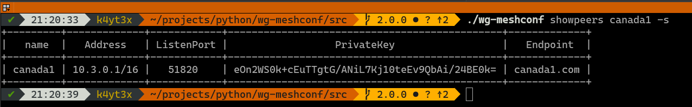

Le mode Plaintext a un usage similaire. Il est juste un peu plus difficile à lire

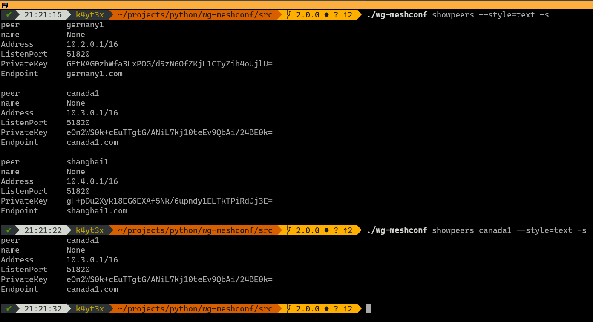

### Suppression de pairs

Utilisez la commande `delpeer` pour supprimer des pairs. La syntaxe est `delpeer PEER_NAME`.

L'exemple ci-dessous montre comment supprimer le peer `tokyo1` de la base de données.

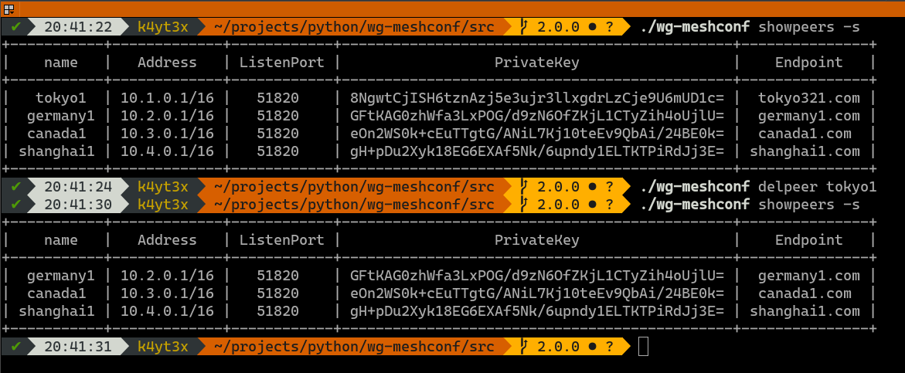

### Fichiers de base de données

Contrairement aux versions 1.x.x de wg-meshconf, la version 2.0.0 ne demande pas à l'utilisateur de sauvegarder ou de charger des profils. Au lieu de cela, toutes les opérations d'ajout de pair, de mise à jour de pair et de suppression de pair sont des opérations de fichier. Les modifications sont immédiatement enregistrées dans le fichier de la base de données. Le fichier de base de données à utiliser peut être spécifié par l'option `-d` ou `--database`. Si aucun fichier de base de données n'est spécifié, `database.csv` sera utilisé.

Les fichiers de base de données sont essentiellement des fichiers CSV (c'était JSON avant la version 2.4.0). Voici un exemple.

```csv
"Name","Address","Endpoint","AllowedIPs","ListenPort","PersistentKeepalive","FwMark","PrivateKey","DNS","MTU","Table","PreUp","PostUp","PreDown","PostDown","SaveConfig"
"tokyo1","10.1.0.1/16","tokyo1.com","","51820","","","yJndNh80ToNWGOfDlbtho1wHAEZGa7ZhNpsHf7AJVUM=","","","","","","","",""
"germany1","10.2.0.1/16","germany1.com","","51820","","","SEOaOjTrhR4do1iUrTTRRHZs6xCA3Q/H0yHW3ZpkHko=","","","","","","","",""
"canada1","10.3.0.1/16","canada1.com","","51820","","","2D34jpbTsU+KeBqfItTEbL5m7nYcBomWWJGTYCT6eko=","","","","","","","",""
"shanghai1","10.4.0.1/16","shanghai1.com","","51820","","","CGyR7goj/uGH3TQHgVknpb9ZBR+/yMfkve+kVNGBYlg=","","","","","","","",""
```

### Usages détaillés

Vous pouvez vous référer à la page d'aide du programme pour les usages. Utilisez le commutateur `-h` ou le commutateur `--help` pour imprimer la page d'aide.

```shell
$ wg-meshconf -h
usage: wg-meshconf [-h] [-d DATABASE] {addpeer,updatepeer,delpeer,showpeers,genconfig} ...

positional arguments:
  {addpeer,updatepeer,delpeer,showpeers,genconfig}

optional arguments:
  -h, --help            show this help message and exit
  -d DATABASE, --database DATABASE
                        path where the database file is stored (default: database.json)
```

Spécifiez `-h` ou `--help` après une commande pour voir les usages de cette commande.

```shell
$ wg-meshconf addpeer -h
usage: wg-meshconf addpeer [-h] --address ADDRESS [--endpoint ENDPOINT] [--privatekey PRIVATEKEY] [--listenport LISTENPORT] [--fwmark FWMARK] [--dns DNS] [--mtu MTU] [--table TABLE] [--preup PREUP] [--postup POSTUP] [--predown PREDOWN] [--postdown POSTDOWN] [--saveconfig] name

arguments positionnels :
  name Nom utilisé pour identifier ce noeud

arguments facultatifs :
  -h, --help afficher ce message d'aide et quitter
  --address ADDRESS adresse du serveur
  --endpoint ENDPOINT adresse du point de terminaison public de l'homologue
  --privatekey PRIVATEKEY
                        clé privée de l'interface du serveur
  --listenport LISTENPORT
                        port sur lequel écouter
  --fwmark FWMARK fwmark pour les paquets sortants
  --dns DNS interface du serveur serveurs DNS
  --mtu MTU MTU de l'interface du serveur
  --table TABLE table de routage du serveur
  --preup Commande PREUP à exécuter avant que l'interface ne soit en service.
  --postup POSTUP commande à exécuter après le démarrage de l'interface
  --predown PREDOWN commande à exécuter avant l'arrêt de l'interface
  --postdown POSTDOWN commande à exécuter après l'arrêt de l'interface
  --saveconfig sauvegarde l'interface du serveur dans la configuration lors de l'arrêt de l'ordinateur
```

