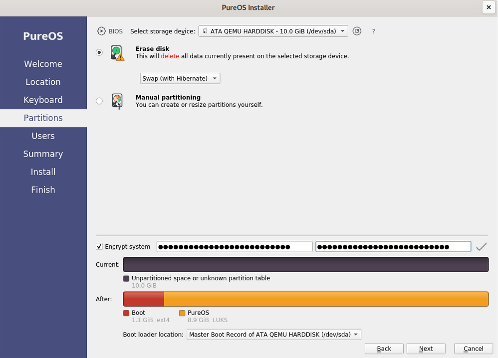
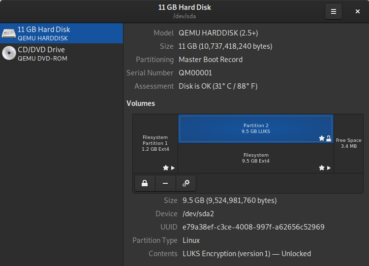
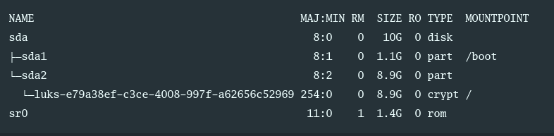
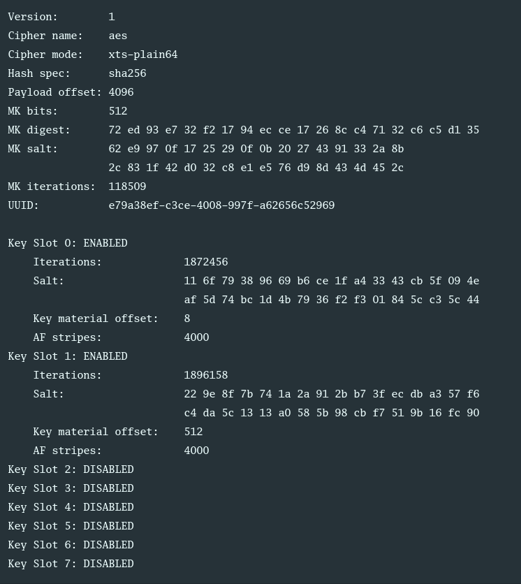
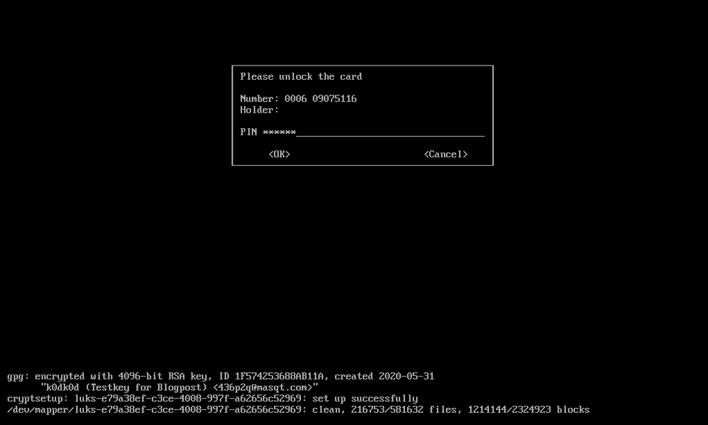

+++
title = 'Chiffrement complet du disque Linux LUKS et déchifrer avec GPG et une carte à puce'
date = 2022-03-05 00:00:00 +0100
categories = ['chiffrement']
+++
  - [Chiffrement complet du disque Linux LUKS](#chiffrement-complet-du-disque-linux-luks)
    - [L'essentiel](#lessentiel)
    - [Introduction](#introduction)
      - [Outil cryptsetup](#outil-cryptsetup)
      - [Choisir une phrase de passe](#choisir-une-phrase-de-passe)
    - [Cryptez votre disque dur](#cryptez-votre-disque-dur)
    - [Vérifiez votre configuration actuelle](#vérifiez-votre-configuration-actuelle)
      - [Vérifiez les disques](#vérifiez-les-disques)
    - [En-tête LUKS](#en-tête-luks)
    - [Gestion des clés LUKS](#gestion-des-clés-luks)
      - [Tester une phrase de passe et déterminer son emplacement de clé](#tester-une-phrase-de-passe-et-déterminer-son-emplacement-de-clé)
      - [Ajouter un mot de passe](#ajouter-un-mot-de-passe)
      - [Supprimer un mot de passe](#supprimer-un-mot-de-passe)
  - [Décryptez votre lecteur LUKS avec GPG et une carte à puce](#décryptez-votre-lecteur-luks-avec-gpg-et-une-carte-à-puce)
    - [Configurez votre carte à puce GPG](#configurez-votre-carte-à-puce-gpg)
      - [Création de clés GPG](#création-de-clés-gpg)
      - [Créez votre propre certificat de révocation](#créez-votre-propre-certificat-de-révocation)
      - [Configuration de votre carte à puce : Modifier les PIN par défaut](#configuration-de-votre-carte-à-puce-modifier-les-pin-par-défaut)
      - [Ajout de sous-clés à votre clé GPG](#ajout-de-sous-clés-à-votre-clé-gpg)
      - [Ajout de clés GPG à votre carte à puce](#ajout-de-clés-gpg-à-votre-carte-à-puce)
      - [Exportation de votre clé publique](#exportation-de-votre-clé-publique)
      - [Sauvegardez votre dossier GPG](#sauvegardez-votre-dossier-gpg)
    - [Configurer le décryptage du disque LUKS avec votre carte à puce](#configurer-le-décryptage-du-disque-luks-avec-votre-carte-à-puce)
      - [Utiliser le script fourni par Purism](#utiliser-le-script-fourni-par-purism)
      - [Est-ce bien sécurisé ?](#est-ce-bien-sécurisé-)
      - [Les coulisses du script de Purism](#les-coulisses-du-script-de-purism)
      - [Où est stocké votre fichier de clé ?](#où-est-stocké-votre-fichier-de-clé-)
    - [Révoquer le cryptage de la carte à puce](#révoquer-le-cryptage-de-la-carte-à-puce)
  - [Urgences](#urgences)
    - [Carte à puce perdue](#carte-à-puce-perdue)
    - [Monter votre lecteur LUKS dans un OS Live](#monter-votre-lecteur-luks-dans-un-os-live)
    - [Débloquer le pin d'une carte à puce](#débloquer-le-pin-dune-carte-à-puce)
    - [Réinitialisation des clés GPG sur la carte à puce](#réinitialisation-des-clés-gpg-sur-la-carte-à-puce)
    - [Sauvegarde et récupération de l'en-tête LUKS](#sauvegarde-et-récupération-de-len-tête-luks)
    - [Que se passe-t-il si vous faites une erreur ?](#que-se-passe-t-il-si-vous-faites-une-erreur-)

## Chiffrement complet du disque Linux LUKS

Article original : [Linux LUKS full disk encryption](https://k0dk0d.xyz/2020/06/07/LUKS-setup.html)

Les disques durs non cryptés sont facilement accessibles en cas de vol ou de perte. Le mot de passe de votre compte n'empêche pas que quelqu'un puisse se connecter lorsque vous n'êtes pas sur votre machine. <u>C'est pourquoi chaque disque dur devrait être entièrement crypté</u>.  
Cet article examine en détail le chiffrement complet du disque dur LUKS sous Linux et fournit des instructions pour configurer le chiffrement, pour déchiffrer avec des cartes à puce GPG et pour savoir quoi faire en cas d'urgence.  
La première partie donne un aperçu de ce que ce cryptage implique et de ce qui est fait. Ensuite, il y aura des instructions étape par étape sur la façon d'installer votre nouvel ordinateur Linux (ici en utilisant PureOS, mais devrait être assez adoptable à Debian en général). Nous verrons ensuite comment configurer un dispositif de carte à puce, par exemple une Librem Key ou une YubiKey avec OpenPGP et comment utiliser cette clé pour décrypter votre disque au démarrage. Enfin, nous aborderons les situations d'urgence, c'est-à-dire ce qui se passe si votre ordinateur meurt, etc.

Important : Il est crucial que vous lisiez cet article avant d'appliquer quoi que ce soit. De plus, si un problème survient pendant le cryptage du disque dur, vous risquez de perdre tout accès à vos données. Vous devez donc effectuer une sauvegarde complète de vos données avant de commencer !
{: .prompt-warning }

Notes : Tout au long de ce tutoriel, /dev/sda2 est utilisé comme le disque crypté. Vous devez bien sûr remplacer ce disque par votre propre périphérique (comme expliqué ci-dessous).
{: .prompt-info }

### L'essentiel

Avant de faire quoi que ce soit de ce qui est décrit ici, vous devez   
(1) avoir une sauvegarde complète de vos données,  
(2) avoir lu toute cette page et compris les procédures et concepts

Donc, pas de résumé pour une fois mais plutôt une table des matières ci-dessus au cas où vous utiliseriez cet article plus tard comme référence.

### Introduction

[LUKS](https://en.wikipedia.org/wiki/Linux_Unified_Key_Setup), **Linux Unified Key Setup**, est une spécification de chiffrement de disque qui met en œuvre une norme sur disque indépendante de la plate-forme et pouvant être utilisée dans divers outils. L'implémentation de référence de LUKS fonctionne sous Linux et est basée sur une version améliorée de cryptsetup utilisant le module DMCrypt Kernel. Cryptsetup, utilisé ici de manière extensive, est un outil qui peut être utilisé pour configurer et gérer de manière pratique le chiffrement des disques.
Aperçu de LUKS

Le format de disque LUKS1 ressemble à peu près au tableau suivant.

<table>
<tr><td>LUKS phdr</td><td>KM1</td><td>KM2</td><td>…</td><td>KM8</td><td>données en vrac</td></tr>
</table>

Tout d'abord, l'en-tête de partition **LUKS (phdr)** est suivi des huit clés (**KM1-8**) et enfin des données de masse cryptées.  
L'en-tête de partition contient des informations sur l'algorithme de cryptage utilisé, la longueur de la clé, la somme de contrôle de la clé principale et des informations sur les emplacements de clé.  
Chaque emplacement de clé a sa section de matériel de clé assignée ; ces huit sections suivent l'en-tête de partition.  
Si un emplacement de clé est actif, une version chiffrée de la clé principale est stockée dans cette zone de matériel de clé. Comme vous l'avez peut-être deviné, le mot de passe que vous avez défini est stocké dans un emplacement de clé et peut être utilisé pour décrypter le matériel de clé correspondant, c'est-à-dire la clé principale.  
La création d'un autre emplacement de clé permet de stocker la clé principale dans ce matériel et de protéger la clé avec la méthode choisie. Vous trouverez [ici une explication détaillée du fonctionnement du format et des différentes actions](https://gitlab.com/cryptsetup/cryptsetup/-/wikis/FrequentlyAskedQuestions).

Par rapport à LUKS1, le [format LUKS2](https://gitlab.com/cryptsetup/LUKS2-docs/blob/master/luks2_doc_wip.pdf) contient deux fois l'en-tête LUKS, ce qui crée une redondance en cas de corruption. Les partitions chiffrées LUKS2 sont donc moins sujettes aux défaillances. Avec une partition LUKS2, vous pouvez utiliser jusqu'à 32 clés (implémentation cryptsetup de LUKS, voir ci-dessous). Alors que la clé principale de LUKS1 est protégée par [PBKDF2](https://en.wikipedia.org/wiki/PBKDF2), LUKS2 utilise Argon2. Les deux sont des fonctions dérivées de la clé qui protègent les mots de passe faibles contre les attaques par force brute.

#### Outil cryptsetup

L'outil [cryptsetup](https://gitlab.com/cryptsetup/cryptsetup) peut être utilisé pour configurer et utiliser de manière pratique les lecteurs LUKS chiffrés. Il fonctionne avec les deux versions de LUKS et fait la plupart du travail pour vous. Jetez un coup d'oeil à la page de manuel de cryptsetup (tapez `man cryptsetup` dans votre terminal) pour avoir un aperçu des fonctions.  
Cryptsetup doit être exécuté en tant que root afin d'effectuer son travail. Les commandes générales de cryptsetup sont les suivantes :

    sudo cryptsetup <CMD> <device>

Cryptsetup est assez silencieux en ce qui concerne le retour d'information lisible par l'homme, c'est donc généralement une bonne idée d'ajouter le drapeau -v verbose. Diverses commandes `<CMD>` sont disponibles qui peuvent être trouvées dans le manuel. Le `<dispositif>` est le lecteur sur lequel vous voulez agir. A titre d'exemple, nous pouvons tester si un périphérique donné (ici `/dev/sda2`) est un périphérique crypté LUKS. Pour ce faire, nous devons exécuter la commande suivante :

    sudo cryptsetup -v isLuks /dev/sda2

Cette commande renvoie `Command successful !` si le périphérique est un périphérique LUKS.

#### Choisir une phrase de passe

Une bonne phrase de passe doit être composée d'une variété de caractères, plus il y en a, mieux c'est. Pour des raisons de compatibilité, il est recommandé dans la section 1.2 de la page FAQ de cryptsetup de n'utiliser que les 95 caractères imprimables de la table ASCII de 128 caractères pour votre phrase de passe.

En ce qui concerne la longueur de votre phrase de passe, la page FAQ de **cryptsetup** présente une comparaison très intéressante dans la section 5. Ils présentent un tableau discutant de ce qu'il en coûterait pour casser un mot de passe en 2017 (lorsque l'article a probablement été écrit). À l'époque, ils estimaient que le craquage d'une partition LUKS1 avec un mot de passe d'une entropie de 70 bits coûterait environ 600 milliards de dollars US. Nous sommes en 2020, donc ce chiffre a sûrement baissé, mais une entropie de 70 bits lors d'une sélection aléatoire parmi 95 caractères est déjà dépassée avec une phrase de passe de 11 caractères. Il n'y a vraiment aucune raison de ne pas choisir plus de caractères et de ne pas rendre votre mot de passe fort. 

Comme nous le verrons plus loin, vous pouvez choisir une phrase de passe très longue et la conserver dans un endroit sûr, puis configurer une carte à puce pour décrypter régulièrement votre disque dur de manière pratique.

### Cryptez votre disque dur

Pendant l'installation du système d'exploitation Linux de votre choix, il devrait vous être demandé, lors de la configuration de la table de partition, si vous souhaitez crypter votre disque. Veillez à activer le cryptage.  
Un exemple de ceci peut être vu sur la capture d'écran ci-dessous lors de l'installation de PureOS 9.0 à partir du système live.



Des instructions complètes sur la façon d'installer PureOS étape par étape peuvent être trouvées [ici](https://tracker.pureos.net/w/installation_guide/) pour les applications générales et [ici](https://tracker.pureos.net/w/installation_guide/live_system_installation/) pour l'installation du CD live.

Notez que le cryptage post-installation devrait également être possible, mais il est assez spécifique à votre configuration requise et ne sera pas abordé ici.

### Vérifiez votre configuration actuelle

#### Vérifiez les disques

Une fois que vous avez réussi à configurer votre système crypté, vous devez vérifier que tout a fonctionné avant de continuer. Un coup d'oeil à l'utilitaire de disque de Gnome devrait vous montrer quelque chose comme ceci :   


Voici la configuration standard qui a été créée par le programme d'installation de PureOS. La partition 1 du disque est la partition de démarrage (non chiffrée) et est montée sur `/boot`. La partition 2 est la partition chiffrée LUKS, qui est montée en tant que `/`. Puisque le système d'exploitation fonctionne, ce disque est déverrouillé et décrypté.

Vous pouvez également vérifier votre configuration depuis la console en invoquant la commande `lsblk` pour lister tous vos périphériques de bloc. Cela vous donnera une sortie qui ressemble à ce qui suit :  


Ici, `sda` est le seul disque principal du système, `sda1` et `sda2` correspondent aux partitions 1 et 2, respectivement.  
L'énumération des périphériques de bloc montre en outre que `sda2` contient le conteneur LUKS que nous avons créé.

Remarque : Vous pouvez utiliser la commande `lsblk` pour trouver le lecteur LUKS sur votre périphérique !
{: .prompt-info }

### En-tête LUKS

En utilisant l'outil **cryptsetup** mentionné dans l'introduction, nous pouvons jeter un coup d'œil aux informations de l'en-tête de la partition chiffrée LUKS. La commande suivante vous montrera l'en-tête :

    sudo cryptsetup luksDump /dev/sda2

Cela produira un résultat similaire à celui-ci ici :

Informations sur l'en-tête LUKS pour /dev/sda2  


Tout d'abord, nous pouvons voir que le disque a été crypté avec LUKS version 1. Ensuite, nous obtenons quelques informations d'en-tête sur le cryptage spécifique. Nous voyons en outre que deux emplacements de clé sont occupés, l'emplacement de clé 0 et l'emplacement de clé 1. Six autres emplacements de clé sont vides et disponibles pour l'utilisation.

On peut se demander pourquoi deux emplacements de clé sont utilisés, d'autant plus que nous n'avons défini qu'un seul mot de passe pendant l'installation. Le mot de passe déchiffre l'emplacement de clé 0 et est utilisé pendant le démarrage. L'emplacement de clé 1 peut être décrypté avec un fichier clé qui est stocké dans `/crypto_keyfile.bin`. Ce fichier clé est utilisé pour le montage de toutes les partitions et remontages ultérieurs. Un bon aperçu et une description plus détaillée peuvent être trouvés ici.

### Gestion des clés LUKS

Dans cette section, divers outils de gestion de clés seront brièvement montrés en action. L'idée de cette section est de donner une courte référence pour les commandes les plus couramment utilisées. Remarque : La configuration de test décrite ci-dessus est utilisée ici, c'est-à-dire que `/dev/sda2` est la partition chiffrée LUKS.

#### Tester une phrase de passe et déterminer son emplacement de clé

Pour tester une phrase de passe et déterminer le slot de clé qu'elle déverrouille, vous pouvez exécuter la commande :

    sudo cryptsetup --verbose open --test-passphrase /dev/sda2

Il vous sera alors demandé de saisir la phrase de passe que vous souhaitez tester. En entrant la phrase de passe qui a été configurée pendant l'installation montrée ci-dessus, vous obtenez une réponse qui dit `Key slot 0 unlocked`  
Cela nous indique que ce mot de passe spécifique est stocké dans le logement de clé 0, une commande pratique à retenir pour plus tard.

#### Ajouter un mot de passe

Comme nous l'avons vu précédemment, LUKS1 permet d'ajouter un total de 8 clés pour décrypter votre disque. Dans LUKS2, le nombre d'emplacements de clés est limité par l'implémentation et dépend de l'espace disponible pour les emplacements de clés. [L'implémentation actuelle de cryptsetup](https://gitlab.com/cryptsetup/cryptsetup/-/blob/master/lib/luks2/luks2.h#L39) permet 32 emplacements de clé. Pour ajouter une phrase de passe à votre dispositif LUKS, tapez ce qui suit dans un terminal :

    sudo cryptsetup luksAddKey /dev/sda2

Vous serez invité à entrer d'abord une phrase de passe existante, puis à entrer deux fois la nouvelle phrase de passe. Rappelez-vous / revoyez les recommandations de la phrase de passe ci-dessus. Si vous réussissez, vous serez simplement renvoyé à l'invite suivante, si vous voulez un message de réussite, choisissez l'option `-v` verbose en plus. Cela vous permettra également de savoir dans quel emplacement de clé votre phrase de passe a été créée.

Maintenant, vous devriez tester le décryptage avec votre nouveau mot de passe pour vous assurer qu'il fonctionne vraiment (voir la section précédente). Ne sautez pas cette étape, surtout si vous supprimez ensuite votre clé originale.

Important : Pour remplacer une phrase de passe, ajoutez d'abord une nouvelle phrase de passe, puis supprimez l'ancienne ! Soyez toujours prudent lorsqu'il s'agit de remplacer une phrase de passe et assurez-vous de tout vérifier deux fois.
{: .prompt-warning }

#### Supprimer un mot de passe

Si vous voulez supprimer une phrase de passe, utilisez la commande :

    sudo cryptsetup luksRemoveKey /dev/sda2

Encore une fois, utilisez l'option `-v` verbose si vous voulez une sortie supplémentaire. Si vous optez pour la sortie verbeuse, LUKS vous dira qu'il a d'abord déverrouillé un emplacement de clé donné, puis l'a sélectionné pour la suppression, et enfin l'a supprimé avec succès. Afin de s'assurer que la phrase de passe a bien été supprimée, vous devriez aller de l'avant et la tester à nouveau avec la commande mentionnée ci-dessus. Bien sûr, vous pouvez aussi extraire l'en-tête LUKS dans le terminal pour faire une double vérification.

Note : Votre mot de passe est supprimé de votre en-tête actuel mais vous pouvez toujours l'avoir défini dans un en-tête de sauvegarde ou dans le cas où vous avez le disque dur entier en miroir quelque part comme sauvegarde. Alors que cryptsetup s'assure en fait que toutes les informations sont correctement détruites dans l'emplacement de clé si vous choisissez de supprimer un emplacement, vous devez vous assurer que toutes vos sauvegardes sont conformes au même standard de sécurité.

## Décryptez votre lecteur LUKS avec GPG et une carte à puce

Une façon pratique et sûre de décrypter votre lecteur pendant le démarrage est d'utiliser une clé GPG stockée sur une carte à puce, par exemple, une [Librem Key](https://puri.sm/products/librem-key/) ou une [YubiKey](https://www.yubico.com/). La carte à puce stocke une clé GPG. Un fichier clé est configuré pour décrypter la partition LUKS avec ce fichier au lieu d'utiliser une phrase de passe. Ce fichier clé est crypté avec votre clé GPG et la version cryptée est stockée. Au démarrage, votre système d'exploitation, au lieu de vous demander la phrase de passe LUKS, vous demandera de brancher votre carte à puce avec votre clé GPG. Cette carte à puce est sécurisée par un code PIN que vous devrez saisir pour déchiffrer le fichier clé, ce qui déverrouillera ensuite votre partition chiffrée LUKS. Le chiffrement GPG peut utiliser une phrase de passe forte, tout comme votre phrase de passe de déchiffrement LUKS. Vous n'aurez besoin de cette dernière qu'en cas d'urgence. Ainsi, tout ce que vous devez retenir est, par exemple, un code PIN à huit chiffres. La carte à puce limite le temps entre les tentatives de saisie du code PIN, ce qui rend les attaques par force brute difficiles. En outre, la clé GPG ne peut pas être récupérée à partir des cartes à puce.

### Configurez votre carte à puce GPG

Des instructions à ce sujet sont fournies par [Purism](https://docs.puri.sm/Librem_Key/Getting_Started/User_Manual.html#managing-gpg-keys) et [Yubico](https://support.yubico.com/support/solutions/articles/15000006420-using-your-yubikey-with-openpgp). Nous allons ici passer en revue un mélange des deux configurations, mais les choses sont assez analogues. N'hésitez pas à utiliser les manuels individuels pour configurer votre clé.

#### Création de clés GPG

Afin d'utiliser votre carte à puce pour déverrouiller votre dispositif LUKS avec GPG, vous devez créer des clés GPG et les charger sur la carte à puce. Une fois sur une carte à puce, les clés GPG ne peuvent être que supprimées, mais pas récupérées. YubiKeys ainsi que Librem Key permettent tous deux de générer des clés GPG directement sur la clé. C'est la méthode la plus sûre, mais elle ne vous permettra pas de conserver une sauvegarde de votre clé. Je recommande ce qui suit : Obtenez un OS Linux vivant, par exemple le disque vivant PureOS et créez vos clés GPG sur l'OS vivant. Bien sûr, n'activez aucune connectivité sur l'OS live. Ajoutez les clés GPG à vos cartes à puce principale et de sauvegarde. Si vous souhaitez conserver les clés GPG dans un endroit sûr, mettez-les dans un conteneur veracrypt et stockez-le dans un endroit sûr. Vous pourrez ainsi recréer la configuration de votre carte à puce si vous le souhaitez ou si vous en avez besoin. N'oubliez pas que vous pouvez toujours vous rabattre sur votre phrase de passe, ce qui n'est pas forcément nécessaire.

Pour créer un type de clé GPG :

    gpg --expert --full-gen-key

Ceci lancera la création de la clé. Lorsque vous y êtes invité, sélectionnez RSA et RSA (par défaut) comme clé à créer. Spécifiez 4096 comme taille de clé et taille de sous-clé. Spécifiez ensuite la durée de validité de votre clé ou sélectionnez 0 pour une validité illimitée. Saisissez le nom, l'adresse électronique (ou une chaîne au format similaire) et le commentaire que vous souhaitez associer à votre clé. La sortie ressemblera à quelque chose comme ceci :

```
gpg: /home/k0dk0d/.gnupg/trustdb.gpg: trustdb created
gpg: key D177E5FAF14074DB marked as ultimately trusted
gpg: directory '/home/k0dk0d/.gnupg/openpgp-revocs.d' created
gpg: revocation certificate stored as '/home/k0dk0d/.gnupg/openpgp-revocs.d/ADC81CF782050A88ACB87320D177E5FAF14074DB.rev'
public and secret key created and signed.

pub   rsa4096 2020-05-09 [SC] [expires: 2021-05-09]
      ADC81CF782050A88ACB87320D177E5FAF14074DB
uid                      k0dk0d (TestKey) <k0d@k0d>
sub   rsa4096 2020-05-09 [E] [expires: 2021-05-09]
```

#### Créez votre propre certificat de révocation

Si vous souhaitez révoquer votre certificat, vous devez créer un certificat de révocation. Pour ce faire, allez dans le dossier dans lequel vous voulez stocker le certificat et tapez :

    gpg --output revocation-certificate.asc --gen-revoke k0dk0d

Il vous posera quelques questions auxquelles vous devrez répondre, comme par exemple s'il a choisi la bonne clé (sélectionnez y si c'est le cas), la raison pour laquelle vous voulez le créer (l'option 1 est généralement bonne), tout commentaire que vous pourriez avoir. Après avoir saisi le mot de passe de votre clé secrète, vous obtiendrez un fichier contenant le certificat de révocation. Conservez-le dans un endroit sûr.

Note : Ici et dans les sections suivantes, le nom de la clé k0dk0d est utilisé. Remplacez-le par votre propre nom de clé.
{: .prompt-info }

#### Configuration de votre carte à puce : Modifier les PIN par défaut

Remarque : de nombreux utilisateurs pensent généralement que les PIN sont uniquement des chiffres. Votre code PIN peut être une combinaison quelconque de chiffres, de lettres et de symboles ! Gardez ceci à l'esprit.
{: .prompt-info }

Si vous n'avez jamais utilisé les fonctions GPG de votre carte à puce, elle est livrée avec des codes PIN standard. Vous devez les modifier avant d'utiliser la clé avec une clé GPG. Pour ce faire, branchez votre carte à puce, puis voyez si vous pouvez la détecter en tapant :

    gpg --card-status

Si votre carte à puce est correctement détectée, vous devriez voir le nom du fabricant et d'autres informations. En bas, si aucune clé GPG n'est chargée, cela devrait ressembler à ceci :

```
PIN retry counter : 3 0 3
Signature counter : 0
Signature key ....: [none]
Encryption key....: [none]
Authentication key: [none]
General key info..: [none]
```

Aucune clé n'est actuellement chargée et les compteurs de tentatives de saisie du code PIN devraient se présenter comme ci-dessus pour une nouvelle clé. Votre compteur de tentatives de saisie du code PIN devrait afficher `3 0 3`. Les chiffres importants ici sont le premier et le dernier. Le premier nombre compte le nombre de tentatives restantes sur le code PIN et le dernier nombre compte les tentatives sur le code PIN de l'administrateur. Le chiffre du milieu est un compteur qui n'est utilisé que lorsqu'un code de réinitialisation est défini. Les codes de réinitialisation sont utiles pour les cartes à puce commerciales, mais nous ne les utiliserons pas ici. Si vous voulez en savoir plus, vous pouvez lire [ici](https://g10code.com/docs/openpgp-card-2.0.pdf).

Pour définir un nouveau code d'administrateur, vous devez entrer dans l'outil d'édition des clés en tapant :

    gpg --card-edit

Une fois que vous avez accédé à l'outil, votre terminal affichera `gpg/card>` devant l'invite. Vous pouvez utiliser la commande `help` pour obtenir les options du menu.  
Pour définir le PIN et le PIN administrateur, vous devez d'abord activer le contrôle administrateur en tapant :

    admin

Cela devrait vous donner une réponse disant que les commandes d'administration sont autorisées. Vous pouvez alors consulter le menu avec l'aide ou taper :

    passwd

Ceci vous amènera au menu pour changer les PINs. Vous pouvez modifier le PIN par défaut (option 1) et le PIN administrateur par défaut (option 3). Vous pouvez également débloquer le PIN (dans le cas où vous l'avez entré trop de fois de manière erronée et que le compteur indique 0) en utilisant l'option (option 2). Vous devez connaître les PIN par défaut de votre appareil, qui sont généralement 123456 pour le PIN et 12345678 pour le Admin PIN (mais vérifiez les descriptions de votre fabricant au cas où ces valeurs par défaut ne fonctionneraient pas).  
Suivez le menu pour modifier les PIN et PIN administrateur.

**Important** : Si vous entrez trois fois de façon erronée votre code PIN d'administrateur, toutes les informations GPG de votre carte à puce deviendront inutiles car votre carte à puce sera complètement verrouillée. Seule une réinitialisation d'usine peut supprimer ce verrouillage, mais les clés ne seront plus là.
{: .prompt-warning }

Une fois que vous avez terminé, vous pouvez quitter le menu de changement de PIN avec Q et ensuite quitter l'outil d'édition de carte avec quit.

#### Ajout de sous-clés à votre clé GPG

Dans l'étape ci-dessus, vous avez créé une clé de chiffrement. Cependant, afin d'utiliser votre carte à puce de manière appropriée, vous devez ajouter une <u>signature</u> et une <u>clé d'authentification</u> à votre carte à puce.

Pour créer ces sous-clés, nous allons utiliser l'outil gpg en mode expert. Vous aurez besoin du nom de votre clé, si vous l'avez oublié, vous pouvez lister toutes les clés gpg avec `gpg --list-secret-keys` (en utilisant simplement `--list-keys`, vous obtiendrez la liste de toutes les clés publiques de votre trousseau, qui contiendra aussi la clé que vous venez de créer, mais elle sera peut-être plus difficile à trouver).

Ensuite, vous entrez dans le menu pour éditer votre clé en tapant :

    gpg --expert --edit-key k0dk0d

Bien sûr, vous devez remplacer `k0dk0d` par le nom de votre clé. Ceci devrait afficher les informations de votre clé et vous amener dans une interface de ligne de commande qui commence par `gpg>`  
Pour ajouter une sous-clé de signature, tapez les commandes suivantes dans le terminal et confirmez avec la touche Entrée (nous les verrons individuellement ci-dessous) :

```
addkey
4
4096
0
```

Nous créons une nouvelle clé en appelant `addkey`  
Le type de clé que nous voulons ajouter est un (4) RSA (signature seulement) (d'où le 4). La clé de cryptage a une longueur de 4096 bits, nous choisissons donc la même longueur pour la clé de signature. Enfin, si vous entrez un 0, vous ne choisirez pas de date d'expiration. Si vous souhaitez que votre clé expire, définissez une date d'expiration appropriée ici. Il est judicieux de choisir ici les mêmes paramètres que ceux que vous avez choisis ci-dessus.

Enfin, vous devez confirmer deux fois par y que vous voulez vraiment créer la clé, puis entrer votre phrase de passe. Vous devrez également entrer le secret de votre clé, par exemple, votre phrase de passe GPG.

```
addkey
8
S
E
A
Q
4096
0
```

Tout d'abord, nous devons ajouter une nouvelle clé avec `addkey`. Ensuite, sélectionnez l'option `(8) RSA (set your own capabilities)` en tapant 8. Vous devriez voir maintenant que la signature et le cryptage sont activés par défaut. Le terminal affichera quelque chose comme ceci :

```
Possible actions for a RSA key: Sign Encrypt Authenticate 
Current allowed actions: Sign Encrypt
```

Gardez un œil sur la deuxième ligne en particulier. Nous voulons donc désactiver la signature (en tapant `S`), désactiver le cryptage (en tapant `E`) et activer l'authentification (en tapant `A`).  
Maintenant, l'action autorisée devrait seulement dire `Authenticate`  
Si c'est le cas, quittez le modificateur en tapant Q. Ensuite, spécifiez la taille de la clé (ici 4096 bits) et définissez l'expiration (ici 0 pour aucune expiration). Encore une fois, vous devrez confirmer la création de la clé en tapant `y` et enfin entrer la phrase de passe pour la clé.

La liste de vos clés avec `list` devrait maintenant vous donner quelque chose comme ceci :

```
sec  rsa4096/F12D2F1C6EF286FE
     created: 2020-05-31  expires: never       usage: SC  
     trust: ultimate      validity: ultimate
ssb  rsa4096/1F574253688AB11A
     created: 2020-05-31  expires: never       usage: E   
ssb  rsa4096/0FD129AD09E14971
     created: 2020-05-31  expires: never       usage: S   
ssb  rsa4096/DBCAD6B6E1B43D08
     created: 2020-06-01  expires: never       usage: A   
[ultimate] (1). k0dk0d (Testkey for Blogpost) <k0d@k0d>
```

Ensuite, nous allons définir le niveau de confiance pour nos propres clés au niveau le plus élevé (nous venons de les créer, nous pouvons leur faire confiance) en tapant :

```
trust
5
```

Encore une fois, confirmez avec `y`. Enfin, sauvegardez votre configuration avec :

    save

Cela vous ramènera au terminal.

#### Ajout de clés GPG à votre carte à puce

Enfin, nous voulons ajouter les clés générées à notre carte à puce. Pour ce faire, nous entrons à nouveau dans le même menu d'édition des clés GPG que ci-dessus. N'oubliez pas de remplacer k0dk0d par le nom de votre clé :

    gpg --expert --edit-key k0dk0d

Le programme devrait afficher toutes vos clés et les sous-clés qui viennent d'être générées. Rappelez-vous : 

- `E` est la clé de chiffrement
- `S` la clé de signature
- `A` la clé d'authentification. 

Pour sélectionner/désélectionner une clé afin de la déplacer vers notre carte à puce, vous pouvez basculer, par exemple, la clé de cryptage en tapant `key 1`. Cela ajoutera un astérisque à côté du ssb et montrera que la clé est activée. Il suffit de taper à nouveau `key 1` pour la désactiver.

Tout d'abord, nous voulons déplacer la clé de cryptage vers la carte à puce. Voici les commandes nécessaires :

```
key 1
keytocard
2
```

D'abord nous voulons basculer la clé de cryptage (#1) et ensuite la déplacer vers la carte. Le seul emplacement possible où vous pouvez placer la clé est l'emplacement de cryptage, qui doit être `(2) Encryption key`  
Vous devez ensuite entrer votre phrase de passe pour la clé GPG et le PIN d'administration pour la carte à puce.

Ensuite, déplaçons la clé de signature (clé 2). Tapez les commandes suivantes :

```
key 1
key 2
keytocard
1
```

Tout d'abord, `key 1` désélectionne la clé de chiffrement. Ensuite, nous sélectionnons la clé de signature en tapant `key 2`, nous la déplaçons sur la carte avec `keytocard`, et nous sélectionnons le slot de signature `(1) Signature key` pour elle. Enfin, confirmons avec la phrase de passe et le PIN admin de la carte à puce.

Enfin, déplaçons la clé d'authentification vers la carte à puce. Séquence de commande :

```
key 2
key 3
keytocard
3
```

Les commandes à ce stade devraient avoir un sens pour vous. **Note :** Si vous sauvegardez votre configuration une fois que vous avez terminé et avant de quitter, vos sous-clés transférées seront remplacées par des stubs vides. Ne sauvegardez donc pas ces paramètres si vous voulez utiliser vos clés pour d'autres cartes à puce ou si vous n'avez pas encore créé une sauvegarde du dossier `.gnupg` et que vous voulez le faire bientôt ! Pour vérifier si tout a fonctionné, nous pouvons quitter l'outil d'édition gpg en quittant et vérifier l'état de la carte avec :

    gpg --card-status

Maintenant la fin de ce menu devrait afficher quelque chose comme ici pour vous montrer que les emplacements de clés sont effectivement remplis.

```
PIN retry counter : 3 0 3
Signature counter : 0
Signature key ....: E722 169E B0CD 5628 AC47  0247 0FD1 29AD 09E1 4971
      created ....: 2020-05-31 23:59:30
Encryption key....: BF55 B501 3307 6936 273F  B823 1F57 4253 688A B11A
      created ....: 2020-05-31 23:47:23
Authentication key: FFE4 670C 7D52 FA3C EF21  C680 DBCA D6B6 E1B4 3D08
      created ....: 2020-06-01 00:00:10
General key info..: sub  rsa4096/0FD129AD09E14971 2020-05-31 k0dk0d (Testkey for Blogpost) <k0d@k0d>
sec   rsa4096/F12D2F1C6EF286FE  created: 2020-05-31  expires: never     
ssb>  rsa4096/1F574253688AB11A  created: 2020-05-31  expires: never     
                                card-no: 0006 09075116
ssb>  rsa4096/0FD129AD09E14971  created: 2020-05-31  expires: never     
                                card-no: 0006 09075116
ssb>  rsa4096/DBCAD6B6E1B43D08  created: 2020-06-01  expires: never     
                                card-no: 0006 09075116
```

#### Exportation de votre clé publique

Enfin, vous voulez exporter votre clé publique GPG, puisque vous en aurez besoin pour crypter plus tard un fichier clé qui est utilisé pour votre partition LUKS avec elle. Exportez votre clé publique en utilisant :

    gpg --armor --export k0dk0d > k0dk0d-public.asc

Encore une fois, vous devez remplacer `k0dk0d` par le nom de votre clé.  
L'option `--armor` est utilisée pour permettre une impression facile de la clé dans un format ASCII. L'option `--export` permet d'exporter la clé publique.   
Enfin, cette fonction imprime généralement la sortie à l'écran. Vous pouvez la rediriger vers un fichier en sélectionnant `> filename.asc`  
Stockez votre clé publique dans un endroit où vous pourrez y accéder depuis le système d'exploitation principal que vous souhaitez chiffrer.

#### Sauvegardez votre dossier GPG

Si vous voulez être sûr de ne pas perdre vos clés, vous devez sauvegarder votre dossier GPG. La façon la plus simple de le faire est de copier l'ensemble du dossier .gnupg dans le répertoire `~` de l'utilisateur. Si vous ne les utilisez que pour décrypter votre disque dur et que vous avez également configuré un mot de passe long, vous pouvez bien sûr détruire les clés après les avoir ajoutées à une ou plusieurs cartes à puce.

### Configurer le décryptage du disque LUKS avec votre carte à puce

Le décryptage de votre lecteur LUKS avec votre carte à puce dépend du système d'exploitation. La procédure suivante a été testée avec PureOS. Je m'attends à ce que les détails soient similaires à ceux des autres systèmes d'exploitation basés sur Debian et je prévois d'écrire des instructions bientôt. Gardez les yeux ouverts pour un post de suivi.

#### Utiliser le script fourni par Purism

Purism fournit un excellent script pour configurer le décryptage des cartes à puce au démarrage. Tout ce dont vous avez besoin pour cela est d'avoir le paquet `scdaemon` installé et d'avoir votre clé publique stockée quelque part. Le script teste également le décryptage avant de le rendre permanent. Une description générale de l'utilisation peut être trouvée [ici](https://source.puri.sm/pureos/packages/smartcard-key-luks), le script mis à jour peut être trouvé [ici](https://source.puri.sm/pureos/packages/smartcard-key-luks).Passons à l'étape suivante.

Tout d'abord, assurons-nous que `scdaemon` est installé en exécutant :

```
sudo apt update
sudo apt install scdaemon
```

Cela montrera très probablement que le paquet est déjà disponible.

Ensuite, téléchargeons la version actuelle de Purism's dans le dossier actuel en téléchargeant le fichier `smartcard-key-luks` depuis leur site web ou en le copiant directement avec wget :

    wget https://source.puri.sm/pureos/packages/smartcard-key-luks/-/raw/master/smartcard-key-luks

Rendez le fichier exécutable en tapant

    chmod +x smartcard-key-luks

En supposant que ce script se trouve dans le même dossier que votre clé publique GPG, et que votre clé publique GPG s'appelle k0dk0d-public.asc (autrement dit : remplacez le nom par celui de votre clé publique), vous pouvez maintenant exécuter le script en tapant ce qui suit. Assurez-vous que votre carte à puce est insérée !

    sudo ./smartcard-key-luks k0dk0d-public.asc

Cette routine devrait d'abord vous demander de déverrouiller votre carte à puce avec le PIN que vous avez défini. Vous devrez ensuite fournir une ancienne phrase de passe (votre phrase de passe actuelle) pour le chiffrement de votre partition LUKS. Le script devrait s'exécuter correctement et tout mettre à jour.

Lorsque vous redémarrez votre ordinateur, vous devrez avoir inséré votre carte GPG. Si une carte n'est pas insérée, vous serez invité à en insérer une. Une fois insérée, vous serez invité à saisir votre code PIN utilisateur pour décrypter le lecteur LUKS. Un décryptage réussi s'affichera comme suit :



Félicitations, tout est maintenant configuré. Mais vous devez continuer à lire !

#### Est-ce bien sécurisé ?

J'ai remarqué une chose intéressante, qui montre également l'importance de ne pas simplement croire, mais de tester réellement : Vous ne pouvez pas vous verrouiller hors de votre carte à puce avec la boîte de dialogue de saisie du PIN LUKS. En fait, le compteur n'arrive jamais à zéro et la carte à puce ne se verrouille donc jamais. Je ne suis pas encore sûr de la raison de cette situation, je vous en dirai plus quand j'en saurai plus. La vraie question est cependant : Est-ce non sécurisé ?

L'invite LUKS est limitée par le taux, ce qui signifie que vous ne pouvez pas brancher, par exemple, un Rubber Ducky et essayer de nombreuses combinaisons de clés. En fait, vous pouvez le faire, mais la limitation de débit empêche tout processus automatisé d'aller trop vite. Je l'ai brièvement "mesuré" en saisissant manuellement 21 codes PIN erronés et en mesurant le temps que cela m'a pris à la main : 34 s. Cela fait 1,6 s par essai. Bien sûr, un processus automatisé pourrait réduire ce temps. Supposons 1 s par essai, un mot de passe de 8 caractères : pour simplifier, nous n'utiliserons que des lettres minuscules et des chiffres. Cela vous donne 36 caractères. Les combinaisons possibles sont donc \(36^8 \approx 2,8 \times 10^{12}\). À raison d'une combinaison par seconde et en supposant qu'il faille deviner la moitié de ces combinaisons avant que le décryptage ne fonctionne, cela prendra encore plus de 44 000 ans. Bien sûr, je préférerais que la carte se verrouille tout simplement, mais la limitation de la vitesse la rend également très sûre.

#### Les coulisses du script de Purism

Jetons un coup d'œil plus détaillé au script fourni par Purism. Comme indiqué plus haut, cet article de blog ne fournira pas une vue détaillée de ce que fait réellement le script, mais décrira principalement ses caractéristiques générales. Le lecteur intéressé peut toujours suivre le script directement. Pour faciliter cela, je vais indiquer les numéros de ligne dans la version actuelle du script, qui a le commit SHA suivant :

    003fe29af978bc6772bf11f2173b0fe40458d116

Laissons de côté la vérification des erreurs et des utilisateurs et entrons dans les détails de ce qu'il fait. Il trouve d'abord l'identifiant de la partition LUKS montée par la racine (ligne 22) en cherchant dans le fichier `/etc/fstab`, qui liste tous les lecteurs actuellement disponibles.

Quelques tests plus tard, un fichier de clé secrète est créé (ligne 84) et crypté avec la clé de cryptage de la carte à puce (ligne 85). Ce fichier est nommé `cryptkey.gpg`. Le décryptage de ce fichier avec la carte à puce est ensuite testé (ligne 94), vous devez donc entrer le code PIN de votre carte à puce pendant ce processus.

En cas de succès, la clé secrète (pas la clé cryptée) est ajoutée à LUKS (ligne 104) comme une nouvelle clé. Par conséquent, cryptsetup vous invite à entrer une phrase de passe de décryptage LUKS. En cas de succès, le secret est maintenant déchiqueté (ligne 111).

Enfin, un nouveau fichier `crypttab` est écrit (ligne 118) et mis en place (ligne 119), le système de démarrage initial est mis à jour (ligne 122), les fichiers de configuration GRUB sont mis à jour (lignes 125 - 131). Puis grub est mis à jour (ligne 133).

#### Où est stocké votre fichier de clé ?

Votre fichier `cryptkey.gpg` (crypté) est stocké dans :

    /etc/cryptsetup-initramfs/cryptkey.gpg

Sauvegardez ce fichier dans un endroit sûr si vous le souhaitez.

### Révoquer le cryptage de la carte à puce

La révocation du cryptage de la carte à puce n'est pas un processus automatisé et doit être effectuée manuellement. Cependant, voici une liste étape par étape sur la façon de le faire. Ne redémarrez pas l'ordinateur pendant que vous suivez ces étapes !

1.    Supprimez le fichier `/etc/cryptsetup-initramfs/cryptkey.gpg`. Bien que cela ne soit pas strictement nécessaire, la réactivation du cryptage avec le script Purism brisera le décryptage avec une clé. Donc supprimez ce fichier en tapant

        sudo rm /etc/cryptsetup-initramfs/cryptkey.gpg

2.    Ouvrez le fichier `/etc/crypttab` dans un éditeur (en tant que root). La première ligne non commentée de ce fichier devrait ressembler à ceci :

        luks-b6285bda-fe1f-4670-936e-e579eeae3752 UUID=b6285bda-fe1f-4670-936e-e579eeae3752 /etc/cryptsetup-initramfs/cryptkey.gpg luks,keyscript=decrypt_gnupg-sc

    La première entrée ici est le nom de la partition chiffrée, la deuxième entrée le nom, suivi du mot de passe (ici le fichier clé) et enfin la manière de le déchiffrer (en utilisant le script `decrypt_gnupg-sc` de cryptsetup). Changez cette ligne de façon à ce qu'elle ressemble à ce qui suit :

        luks-b6285bda-fe1f-4670-936e-e579eeae3752 UUID=b6285bda-fe1f-4670-936e-e579eeae3752 none luks

    Les deux derniers paramètres doivent indiquer `none luks` ici. Enregistrez et quittez ce fichier.

3.    Pour supprimer la clé de décryptage de votre en-tête LUKS, vous devez savoir dans quel slot de clé elle se trouve. Habituellement, le mot de passe que vous avez choisi initialement se trouve dans le slot zéro. Le décryptage avec le fichier `crypto_keyfile.bin` est généralement effectué en utilisant le slot 1. Déterminez l'emplacement de votre mot de passe (qui devrait être l'emplacement 0 si vous ne l'avez jamais changé depuis l'installation) en utilisant la commande donnée plus haut et déterminez l'emplacement de la clé GPG par exclusion. Si le chiffrement GPG est dans le slot 2 alors supprimez-le en tapant :

        sudo cryptsetup luksKillSlot /dev/sda2 2

    Cette commande supprimera le slot 2 (le numéro à la fin de la ligne) de /dev/sda2. Il vous sera demandé de taper une phrase de passe restante dans le champ pour confirmer. Il s'agit de votre mot de passe. Cela garantit également que vous ne pouvez pas supprimer une phrase de passe que vous connaissez.

4.    Ensuite, nous devons mettre à jour l'image initramfs qui est utilisée par défaut. Pour ce faire, tapez

        sudo update-initramfs -u

5.    Enfin, nous devons remettre grub dans sa configuration d'origine. Le contenu de ces fichiers est modifié avec des commandes perl pour effectuer des recherches et des remplacements de motifs donnés. Pour ces commandes, nous pouvons simplement inverser les remplacements. Exécutez les quatre commandes suivantes pour annuler les changements qui ont été appliqués par le script Purism :

        sudo perl -pi -e 's/^GRUB_CMDLINE_LINUX_DEFAULT=(.*) nosplash noresume loglevel=3/GRUB_CMDLINE_LINUX_DEFAULT=\1 splash/' /etc/default/grub
        sudo perl -pi -e 's/GRUB_CMDLINE_LINUX_RECOVERY=\"\$GRUB_CMDLINE_LINUX_RECOVERY recovery\"/GRUB_CMDLINE_LINUX_RECOVERY=recovery/' /etc/grub.d/10_linux
        sudo perl -pi -e 's/GRUB_CMDLINE_LINUX_RECOVERY=\"\$GRUB_CMDLINE_LINUX_RECOVERY single\"/GRUB_CMDLINE_LINUX_RECOVERY=single/' /etc/grub.d/10_linux
        sudo perl -pi -e 's/  GRUB_CMDLINE_LINUX_RECOVERY \\\n//' /usr/sbin/grub-mkconfig

    Enfin, ouvrez le fichier /etc/default/grub et supprimez la dernière ligne du fichier, qui doit ressembler à ceci.

        GRUB_CMDLINE_LINUX_RECOVERY="cryptopts=target=luks-b6285bda-fe1f-4670-936e-e579eeae3752,source=UUID=b6285bda-fe1f-4670-936e-e579eeae3752,luks"

    Cette ligne a été écrite par la commande echo... à la ligne 126 du script Purism.

    Maintenant vous êtes prêt à mettre à jour grub en tapant :

        sudo update-grub

5.    Redémarrez votre ordinateur ! On vous demandera une phrase de passe et vous ne pourrez pas déverrouiller votre ordinateur avec votre carte à puce GPG.

## Urgences

### Carte à puce perdue

Si vous perdez votre carte à puce, vous pouvez toujours démarrer votre système d'exploitation avec votre mot de passe. Entrez dans le menu de démarrage GRUB, sélectionnez `Advanced Options [...]`, et démarrez en mode de récupération. LUKS vous demandera maintenant votre mot de passe pour décrypter le disque. Après avoir entré le mot de passe, vous pouvez soit démarrer en `Maintenance mode` en appuyant sur entrée, soit démarrer régulièrement dans un XServer en appuyant sur Ctrl+d. Ceci va démarrer votre OSX général. Vous pouvez maintenant ajouter une nouvelle carte à puce, retirer l'ancienne, etc.

### Monter votre lecteur LUKS dans un OS Live

Si vous ne pouvez pas accéder à votre compte parce qu'il s'est passé quelque chose, démarrez dans un système d'exploitation en live. De là, vous pouvez monter votre disque dur principal en cliquant dessus depuis l'interface graphique. Vous pouvez taper l'une de vos phrases de passe et LUKS trouvera le logement de clé qui convient et déverrouillera votre disque. Vous avez maintenant un accès complet à vos données et vous pouvez sauvegarder n'importe quoi sur un disque dur externe avant d'essayer de réparer votre système.

Pour monter un lecteur LUKS à partir de la ligne de commande, nous devons d'abord créer un point de montage, c'est-à-dire un endroit où nous allons monter le lecteur. Par exemple, nous pouvons créer un dossier dans `/mnt` appelé `luks-drive` en tapant :

    sudo mkdir /mnt/luks-drive

Ensuite, nous décryptons le disque avec cryptsetup et le rendons disponible comme un périphérique nommé luks-drive dans /dev/mapper.

    sudo cryptsetup luksOpen /dev/sda2 luks-drive

Ceci vous demandera votre mot de passe LUKS pour le décryptage. Enfin, montez le lecteur en exécutant :

    sudo mount /dev/mapper/luks-drive /mnt/luks-drive/

Vous pouvez maintenant accéder au lecteur monté.

### Débloquer le pin d'une carte à puce

Si vous devez réinitialiser le compteur de PIN de l'utilisateur, suivez les étapes décrites dans la section Création de PIN plus haut. Cela réinitialisera le compteur de la carte à puce.

### Réinitialisation des clés GPG sur la carte à puce

Pour réinitialiser les clés GPG de la carte à puce, entrez dans le menu d'édition de carte de l'outil gpg, allez dans le panneau d'administration, et lancez une réinitialisation d'usine. Les commandes sont les suivantes :

```
gpg --edit-card
admin
factory-reset
```

Vous devrez confirmer cette opération. Puis quittez le menu avec `quit`. Vous pouvez vérifier si la réinitialisation a réussi avec `gpg --card-status` 

### Sauvegarde et récupération de l'en-tête LUKS

Comme mentionné précédemment, les en-têtes LUKS, en particulier la version 1, ne fonctionnent plus s'ils sont corrompus. Une façon de s'assurer que vous n'aurez pas d'ennuis si vous corrompez votre en-tête LUKS par accident est de sauvegarder l'en-tête. Vous pouvez le faire en exécutant

    sudo cryptsetup luksHeaderBackup --header-backup-file ~/my_luks_header_backup /dev/sda2

Ceci va sauvegarder votre en-tête LUKS complet dans un fichier nommé `my_luks_header_backup` dans le dossier personnel de l'utilisateur. Ce fichier ne peut être lu que par root. Vous ne voulez pas stocker cet en-tête dans votre dossier personnel, mais idéalement sur un disque externe crypté. De cette façon, vous pourrez restaurer votre en-tête LUKS en utilisant également un système d'exploitation amorçable. Vous devez également vous assurer que votre en-tête LUKS est stocké de manière sécurisée, c'est-à-dire sur un disque dur externe crypté ou dans un conteneur veracrypt. Pour supprimer toute trace de l'en-tête LUKS dans le dossier personnel de votre utilisateur après l'avoir déplacé, nous pouvons exécuter :

    sudo shred -u mon_luks_header_backup 

La restauration d'un en-tête LUKS est tout aussi simple. Note : Si vous n'êtes pas sûr d'avoir saisi le bon en-tête à restaurer, sauvegardez d'abord l'en-tête actuel dans un fichier en utilisant la commande donnée précédemment. Pour restaurer un en-tête, c'est-à-dire à partir du fichier qui vient d'être créé et nommé `my_luks_header_backup` dans le répertoire personnel de l'utilisateur, tapez :

    sudo cryptsetup luksHeaderRestore --header-backup-file ~/my_luks_header_backup /dev/sda2

Vous devrez confirmer cette commande en tapant `YES` en lettres majuscules. L'en-tête LUKS existant sur la partition sera détruit, donc assurez-vous que vous avez une sauvegarde de l'en-tête actuel, que vous avez un en-tête LUKS correct et non corrompu dans le fichier, ou que vous ne vous souciez vraiment pas des données sur ce disque. La restauration d'un en-tête LUKS peut être effectuée à partir de n'importe quel système d'exploitation et sur n'importe quel disque, assurez-vous simplement que vous avez sélectionné le bon périphérique et remplacez `/dev/sda2` par votre configuration.

Note de sécurité : Il est important de sauvegarder les en-têtes, mais n'oubliez pas de détruire vos anciennes sauvegardes d'en-têtes si vous ajoutez ou supprimez des phrases de passe de votre en-tête actuel. Sinon, le changement de phrase de passe peut facilement être annulé par quiconque a accès à votre disque et à votre ancien en-tête LUKS en restaurant simplement cette ancienne version.
{: .prompt-warning }

### Que se passe-t-il si vous faites une erreur ?

**NE PANIQUEZ PAS !** Premièrement, vous avez une sauvegarde (n'est-ce pas ?). Ensuite, si votre disque est actuellement décrypté et que vous pouvez accéder à vos données, ne redémarrez pas.

Il est maintenant temps de faire quelques recherches. Que s'est-il passé ? Où pensez-vous que le problème se situe ? Si c'est avec cryptsetup, allez voir leur section FAQ en ligne. Assurez-vous de bien comprendre les commandes avant de les exécuter.

Si vous avez simplement endommagé votre clé GPG et que vous ne l'avez pas encore ajoutée à votre trousseau, tout va probablement bien. Vous avez probablement créé une nouvelle clé GPG pour cette configuration (ou vous avez une sauvegarde). Vous pouvez refaire des étapes comme celles-ci facilement. 

Autres lectures et références (en)


*    [Cryptsetup](https://gitlab.com/cryptsetup/cryptsetup)
*    [PureOS LUKS decryption script](https://source.puri.sm/pureos/packages/smartcard-key-luks)
*    [DMCrypt](https://gitlab.com/cryptsetup/cryptsetup/-/wikis/DMCrypt)
*    [Librem Key documentation](https://docs.puri.sm/Librem_Key/Getting_Started/User_Manual.html#)
*    [YubiKey OpenPGP instructions](https://support.yubico.com/support/solutions/articles/15000006420-using-your-yubikey-with-openpgp)
*    [OpenPGP card 2.0 manual](https://g10code.com/docs/openpgp-card-2.0.pdf) (very helpful for explanations)
