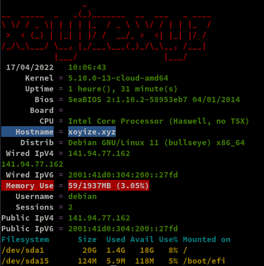
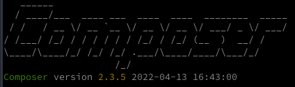
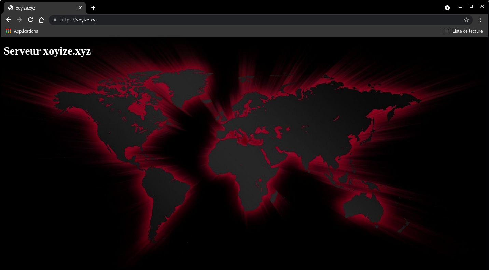
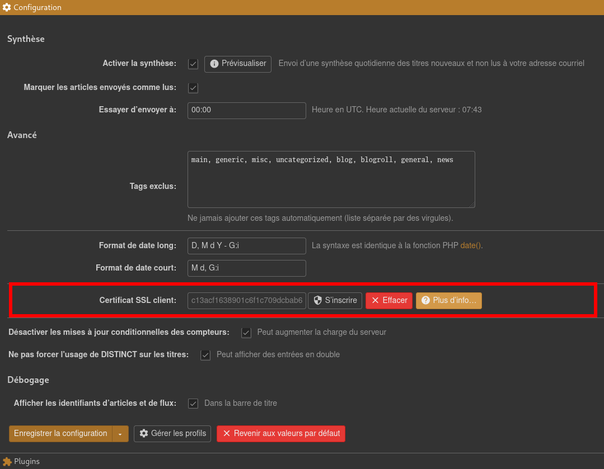

+++
title = 'VPS Starter debian 11 - xoyize.xyz'
date = 2022-04-22 00:00:00 +0100
categories = serveur
+++
<div class="item">
  <div class="item__image">
    
  </div>
  <div class="item__content">
    <div class="item__header">
      <h4>Serveur web debian + nginx + php + mysql</h4>
    </div>
    <div class="item__description">
      <p>VPS Starter OVH vps-732e59e6.vps.ovh.net</p>
		<ul>
		  <li>2 GB RAM</li>
		  <li>20 GB Storage</li>
		  <li>100 Mbit/s Bandwidth</li>
		  <li>1 x vCPU Core</li>
		  <li>1 x IPv4 Address 141.94.77.162</li>
		  <li>1 x IPv6 Address 2001:41d0:304:200::27fd</li>
		</ul>
    </div>
  </div>
</div>

  

### Connexion serveur

Connexion ssh

    ssh debian@141.94.77.162

en mode su

Mise à jour 

    apt update && apt -y upgrade

### Adressage IPV6

Désactiver l'auto génération du réseau

    echo "network: {config: disabled}" > /etc/cloud/cloud.cfg.d/99-disable-network-config.cfg

Créer le fichier réseau

    nano /etc/network/interfaces

```
# Include files from /etc/network/interfaces.d:
#source-directory /etc/network/interfaces.d

# Cloud images dynamically generate config fragments for newly
# attached interfaces. See /etc/udev/rules.d/75-cloud-ifupdown.rules
# and /etc/network/cloud-ifupdown-helper. Dynamically generated
# configuration fragments are stored in /run:
#source-directory /run/network/interfaces.d
# This file describes the network interfaces available on your system
# and how to activate them. For more information, see interfaces(5).

source /etc/network/interfaces.d/*

# The loopback network interface
auto lo
iface lo inet loopback

# The primary network interface
allow-hotplug ens3
# add static settings
iface ens3 inet static
 address 141.94.77.162
 netmask 255.255.255.0
iface ens3 inet6 static
 address 2001:41d0:304:200::27fd
 netmask 128
 post-up /sbin/ip -6 route add 2001:41d0:304:200::1 dev ens3
 post-up /sbin/ip -6 route add default via 2001:41d0:304:200::1 dev ens3
 pre-down /sbin/ip -6 route del default via 2001:41d0:304:200::1 dev ens3
 pre-down /sbin/ip -6 route del 2001:41d0:304:200::1 dev ens3
```

Redémarrer le vps 

    systemctl reboot

Se connecter et vérifier

    ip a

```
1: lo: <LOOPBACK,UP,LOWER_UP> mtu 65536 qdisc noqueue state UNKNOWN group default qlen 1000
    link/loopback 00:00:00:00:00:00 brd 00:00:00:00:00:00
    inet 127.0.0.1/8 scope host lo
       valid_lft forever preferred_lft forever
    inet6 ::1/128 scope host 
       valid_lft forever preferred_lft forever
2: ens3: <BROADCAST,MULTICAST,UP,LOWER_UP> mtu 1500 qdisc pfifo_fast state UP group default qlen 1000
    link/ether fa:16:3e:0c:42:37 brd ff:ff:ff:ff:ff:ff
    altname enp0s3
    inet 141.94.77.162/32 brd 141.94.77.162 scope global dynamic ens3
       valid_lft 86235sec preferred_lft 86235sec
    inet 141.94.77.162/24 brd 141.94.77.255 scope global ens3
       valid_lft forever preferred_lft forever
    inet6 2001:41d0:304:200::27fd/128 scope global 
       valid_lft forever preferred_lft forever
    inet6 fe80::f816:3eff:fe0c:4237/64 scope link 
       valid_lft forever preferred_lft forever
```

Hostname

    sudo hostnamectl set-hostnamectl "xoyize.xyz"
    hostnamectl 

```
   Static hostname: xoyize.xyz
         Icon name: computer-vm
           Chassis: vm
        Machine ID: 1927516e0ce84581b64327cd590d79bc
           Boot ID: 0358c2d0951c40ee997ac330a5ab70a4
    Virtualization: kvm
  Operating System: Debian GNU/Linux 11 (bullseye)
            Kernel: Linux 5.10.0-13-cloud-amd64
      Architecture: x86-64
```

Date et heure UTC

    timedatectl

```
               Local time: Sun 2022-04-17 08:42:50 UTC
           Universal time: Sun 2022-04-17 08:42:50 UTC
                 RTC time: Sun 2022-04-17 08:42:51
                Time zone: Etc/UTC (UTC, +0000)
System clock synchronized: yes
              NTP service: active
          RTC in local TZ: no
```

### OpenSSH, clé et script

{:width="70"}  

**connexion avec clé**  
<u>sur l'ordinateur de bureau</u>
Générer une paire de clé curve25519-sha256 (ECDH avec Curve25519 et SHA2) pour une liaison SSH avec le serveur.  

    ssh-keygen -t ed25519 -o -a 100 -f ~/.ssh/xoyize-ed25519

Envoyer les clés publiques sur le serveur KVM   

    ssh-copy-id -i ~/.ssh/xoyize-ed25519.pub debian@141.94.77.162

<u>sur le serveur KVM</u>  
On se connecte  

    ssh debian@141.94.77.162

Modifier la configuration serveur SSH  

    sudo nano /etc/ssh/sshd_config

Modifier

```conf
Port = 55162
PasswordAuthentication no
```

Relancer le serveur

    sudo systemctl restart sshd

Test connexion

    ssh -p 55162 -i ~/.ssh/xoyize-ed25519 debian@141.94.77.162

### Utilitaires

Installer utilitaires  

    sudo apt install rsync curl tmux jq figlet git

### Motd

Effacer et créer motd

    sudo rm /etc/motd && sudo nano /etc/motd

```
                  _                                  
 __ __ ___  _  _ (_) ___ ___    __ __ _  _  ___      
 \ \ // _ \| || || ||_ // -_) _ \ \ /| || ||_ /      
 /_\_\\___/ \_, ||_|/__|\___|(_)/_\_\ \_, |/__|      
            |__/                      |__/           
  _  _ _   _    ___  _ _    ____  ____   _   __  ___ 
 / || | | / |  / _ \| | |  |__  ||__  | / | / / |_  )
 | ||_  _|| | _\_, /|_  _|_  / /   / /_ | |/ _ \ / / 
 |_|  |_| |_|(_)/_/   |_|(_)/_/   /_/(_)|_|\___//___|
```

Script ssh_rc_bash

>ATTENTION!!! Les scripts sur connexion peuvent poser des problèmes pour des appels externes autres que ssh

```bash
wget https://static.xoyaz.xyz/files/ssh_rc_bash
chmod +x ssh_rc_bash # rendre le bash exécutable
./ssh_rc_bash        # exécution
```



### Zone DNS OVH 

{:width="30"}  


```dns
$TTL 3600
@	IN SOA dns106.ovh.net. tech.ovh.net. (2022041500 86400 3600 3600000 300)
              IN NS     ns106.ovh.net.
              IN NS     dns106.ovh.net.
              IN A      141.94.77.162
              IN AAAA   2001:41d0:304:200::27fd
              IN CAA    128 issue "letsencrypt.org"
*             IN A      141.94.77.162
*             IN AAAA   2001:41d0:304:200::27fd
```

### Parefeu UFW

{:width="50"} 

*UFW, ou pare - feu simple , est une interface pour gérer les règles de pare-feu dans Arch Linux, Debian ou Ubuntu. UFW est utilisé via la ligne de commande (bien qu'il dispose d'interfaces graphiques disponibles), et vise à rendre la configuration du pare-feu facile.*

Installation **Debian / Ubuntu**

    sudo apt install ufw

*Par défaut, les jeux de règles d'UFW sont vides, de sorte qu'il n'applique aucune règle de pare-feu, même lorsque le démon est en cours d'exécution.*   

Les règles 

```bash
sudo ufw allow 55162/tcp  # port SSH
sudo ufw allow http       # port 80
sudo ufw allow https      # port 443
sudo ufw allow DNS        # port 53
```

Activer le parefeu

    sudo ufw enable

```
Command may disrupt existing ssh connections. Proceed with operation (y|n)? y
Firewall is active and enabled on system startup
```

Status

     sudo ufw status verbose

```
Status: active
Logging: on (low)
Default: deny (incoming), allow (outgoing), disabled (routed)
New profiles: skip

To                         Action      From
--                         ------      ----
55162/tcp                  ALLOW IN    Anywhere                  
80/tcp                     ALLOW IN    Anywhere                  
443                        ALLOW IN    Anywhere                  
53 (DNS)                   ALLOW IN    Anywhere                  
55162/tcp (v6)             ALLOW IN    Anywhere (v6)             
80/tcp (v6)                ALLOW IN    Anywhere (v6)             
443 (v6)                   ALLOW IN    Anywhere (v6)             
53 (DNS (v6))              ALLOW IN    Anywhere (v6)             
```


### Nginx compilation, PHP8, MariaDB

#### Nginx compilé

{:width="50"}  

Utilisateur avec droits sudo  

Télécharger le bash

```
wget https://static.xoyaz.xyz/files/compilation-nginx-tls1.3.sh
chmod +x compilation-nginx-tls1.3.sh # rendre le bash exécutable
./compilation-nginx-tls1.3.sh        # exécution
```

A la fin de la compilation

```
Versions Nginx OpenSSL
nginx version: nginx/1.20.2
OpenSSL 1.1.1n  15 Mar 2022
```

#### PHP8 et composer

  

Ajout du dépôt sury.org

    sudo -s

Pour installer la version de 8 de php, ajouter le dépôt sury.

```bash
apt install -y lsb-release apt-transport-https ca-certificates wget
wget -O /etc/apt/trusted.gpg.d/php.gpg https://packages.sury.org/php/apt.gpg
echo "deb https://packages.sury.org/php/ $(lsb_release -sc) main" |tee /etc/apt/sources.list.d/php.list
```

Mise à jour des dépôts :

    apt update && apt upgrade -y

Installation de php8.1, php8.1-fpm, php8.1-sqlite3 et les paquets PHP nécessaires à nextcloud

    apt -y install php8.1 php8.1-fpm php8.1-sqlite3 php8.1-cli php8.1-gd php8.1-imap php8.1-mysql php8.1-soap php8.1-apcu php8.1-common php8.1-gmp  php8.1-intl php8.1-opcache php8.1-xml php8.1-curl php8.1-igbinary php8.1-readline  php8.1-zip php8.1-bcmath php8.1-imagick php8.1-mbstring php8.1-redis imagemagick

Nextcloud n'accepte pas les versions PHP > 8.0
{: .prompt-warning }

Composer

```bash
wget https://getcomposer.org/download/latest-stable/composer.phar
chmod +x composer.phar
mv composer.phar /usr/local/bin/composer
```



#### MariaDB

{:width="50"}  
installer les paquets de MariaDB

    sudo apt install mariadb-server

Une fois que l'installation des composants est terminée, tapez la commande suivante pour finaliser la configuration.

    sudo mysql_secure_installation

Tapez Enter directement à la première question car le mot de passe de l'utilisateur root de MariaDB est vide par défaut après l'installation.  
Puis répondez Y à la question suivante pour spécifier le mot de passe de l'utilisateur root de MariaDB qui, une fois de plus, est différent de l'utilisateur root de votre Debian.  
Cet utilisateur root de la base de données aura tous les droits d'accès. Pour des raisons évidentes de sécurité, je vous recommande d'utiliser un mot de passe complexe !  
Et vous pouvez répondre Y à toutes les questions suivantes: les connexions anonymes seront désactivées, ainsi que les connexions root qui se font depuis un serveur autre que le votre...  

### Certificats Let's Encrypt

{:width="80"}

Installation gestionnaire des certificats Let's Encrypt

```bash
cd ~
sudo apt install socat # installé par défaut sur debian 11
git clone https://github.com/acmesh-official/acme.sh.git
cd acme.sh
./acme.sh --install 
```

Se déconnecter puis se reconnecter utilisateur  

Les clés OVH API   

    export OVH_AK="xxxxxxxxxxxxxxxxxx"
    export OVH_AS="yyyyyyyyyyyyyyyyyyyyyyyyyyyy"

Génération des certificats  

    acme.sh --dns dns_ovh --server letsencrypt --issue --keylength ec-384 -d 'xoyize.xyz' -d '*.xoyize.xyz'

```
[...]
[mar. 22 févr. 2022 15:23:38 CET] Please open this link to do authentication: https://eu.api.ovh.com/auth/?credentialToken=vIuaavkgBGdip2UEPjSev9WhruI2REfzawQy31tV7mkOAVnj5NQUwD0XKUFKbaI1
[...]
```

Après authentification relancer la commande

Résultat de l'installation

```
[Sun Apr 17 11:40:04 UTC 2022] Your cert is in: /home/debian/.acme.sh/xoyize.xyz_ecc/xoyize.xyz.cer
[Sun Apr 17 11:40:04 UTC 2022] Your cert key is in: /home/debian/.acme.sh/xoyize.xyz_ecc/xoyize.xyz.key
[Sun Apr 17 11:40:04 UTC 2022] The intermediate CA cert is in: /home/debian/.acme.sh/xoyize.xyz_ecc/ca.cer
[Sun Apr 17 11:40:04 UTC 2022] And the full chain certs is there: /home/debian/.acme.sh/xoyize.xyz_ecc/fullchain.cer
```

Installation des certificats

```
sudo mkdir -p /etc/ssl/private/
sudo chown $USER -R /etc/ssl/private/
acme.sh --ecc --install-cert -d 'xoyize.xyz' -d '*.xoyize.xyz' --key-file /etc/ssl/private/xoyize.xyz-key.pem --fullchain-file /etc/ssl/private/xoyize.xyz-fullchain.pem  --reloadcmd 'sudo systemctl reload nginx.service'
```

Résultat

```
[Sun Apr 17 11:41:11 UTC 2022] Installing key to: /etc/ssl/private/xoyize.xyz-key.pem
[Sun Apr 17 11:41:11 UTC 2022] Installing full chain to: /etc/ssl/private/xoyize.xyz-fullchain.pem
[Sun Apr 17 11:41:11 UTC 2022] Run reload cmd: sudo systemctl reload nginx.service
[Sun Apr 17 11:41:12 UTC 2022] Reload success
```

Supprimer ` --reloadcmd 'sudo systemctl reload nginx.service'` à la ligne précédente si Nginx n'est pas installé
{: .prompt-warning }

Editer le crontab, supprimer la ligne existante et ajouter ce qui suit

    crontab -e

```bash
2 0 * * * "/home/debian/.acme.sh"/acme.sh --cron --home "/home/debian/.acme.sh" --renew-hook "/home/debian/.acme.sh/acme.sh --ecc --install-cert -d 'xoyize.xyz' -d '*.xoyize.xyz' --key-file /etc/ssl/private/xoyize.xyz-key.pem --fullchain-file /etc/ssl/private/xoyize.xyz-fullchain.pem  --reloadcmd 'sudo systemctl reload nginx.service'" > /dev/null
```

### Configuration nginx

On va regrouper TLS/SSL, HSTS et OCSP dans le fichier de configuration global `/etc/nginx/tls-hsts-ocsp.conf`

```nginx
    # Certificats Let's Encrypt 
    ssl_certificate /etc/ssl/private/xoyize.xyz-fullchain.pem;
    ssl_certificate_key /etc/ssl/private/xoyize.xyz-key.pem;

    # TLS 1.3 only
    ssl_protocols TLSv1.3;
    ssl_prefer_server_ciphers off;
 
    # HSTS (ngx_http_headers_module is required) (63072000 seconds)
    add_header Strict-Transport-Security "max-age=63072000" always;
 
    # OCSP stapling
    ssl_stapling on;
    ssl_stapling_verify on;
 
    # verify chain of trust of OCSP response using Root CA and Intermediate certs
    ssl_trusted_certificate /etc/ssl/private/xoyize.xyz-fullchain.pem;

    # replace with the IP address of your resolver
    resolver 1.1.1.1;
```

**xoyize.xyz.conf**

Créer le fichier `/etc/nginx/conf.d/xoyize.xyz.conf` 

```nginx
server {
    listen 80;
    listen [::]:80;
    server_name xoyize.xyz;
    return 301 https://$host$request_uri;
}
server {
    listen 443 ssl http2;
    listen [::]:443 ssl http2;
    server_name xoyize.xyz;

    root /var/www/default-www;
    index index.html index.php;

    # Certificats Let's Encrypt 
    # TLS 1.3 only
    # HSTS (ngx_http_headers_module is required) (63072000 seconds)
    # OCSP stapling
    # replace with the IP address of your resolver
    include /etc/nginx/tls-hsts-ocsp.conf;

    # fichiers de configuration
    include /etc/nginx/conf.d/xoyize.xyz.d/*.conf;

    location ~ \.php$ {
        include php_fastcgi.conf;
        fastcgi_pass unix:/run/php/php8.1-fpm.sock;
    }
 

}
```

Créer le sous-dossier

    sudo mkdir -p /etc/nginx/conf.d/xoyize.xyz.d/

Vérifier

    sudo nginx -t

```
nginx: the configuration file /etc/nginx/nginx.conf syntax is ok
nginx: configuration file /etc/nginx/nginx.conf test is successful
```

Recharger nginx

    sudo systemctl reload nginx

### Page d'accueil xoyize.xyz

Déposer une image `wallpaper.jpg` dans le dossier `/var/www/default-www`  

Créer un fichier `/var/www/default-www/index.html`  

```html
<!DOCTYPE html>
<html>
<head>
 <meta charset="UTF-8"> 
 <title>xoyize.xyz</title>
<style type="text/css" media="screen" >
html { 
  margin:0;
  padding:0;
  background: url(wallpaper.jpg) no-repeat center fixed; 
  -webkit-background-size: cover; /* pour anciens Chrome et Safari */
  background-size: cover; /* version standardisée */
}
body { color: white; }
a:link {
  color: grey;
  background-color: transparent;
  text-decoration: none;
}

a {
  text-decoration: underline;
  background-color: transparent;
  color: #a00;
}
a:visited {
  color: #844;
}
a:hover, a:focus, a:active {
  text-decoration: none;
  color: white;
  background: #800;
}


</style>

</head>
<body>

<h1>Serveur xoyize.xyz</h1>


</body>
</html>
```

Lien <https://xoyize.xyz>   
{:width="500"}

### Fail2Ban

Le fichier de configuration principal est le jail.conf mais nous n’allons pas l’utiliser directement car ce fichier est souvent altéré après les mises à niveau. Pour cela nous allons faire une copie de ce fichier et le nommer jail.local avec la commande ci-après: cp jail.conf jail.local (en étant dans le répertoire /etc/fail2ban)

    sudo cp /etc/fail2ban/jail.conf /etc/fail2ban/jail.local

Nous allons à présent définir nos options dans le fichier jail.local
Les options à définir sont en dessous de la section `[DEFAULT]` (la section qui vient après `[INCLUDES]` )

    sudo nano /etc/fail2ban/jail.local

```
# "bantime" is the number of seconds that a host is banned.
bantime  = 10m

# A host is banned if it has generated "maxretry" during the last "findtime"
# seconds.
findtime  = 10m

# "maxretry" is the number of failures before a host get banned.
maxretry = 5
```

Et ajouter les lignes suivantes en fin de fichier

```
[ssh]
enabled  = true
port     = 55162
filter   = sshd
logpath  = /var/log/auth.log

[ssh-ddos]
enabled  = true
port     = 55145
filter   = sshd-ddos
logpath  = /var/log/auth.log

#
# HTTP servers
#

[nginx-auth]
enabled = true
filter = nginx-auth
action = iptables-multiport[name=NoAuthFailures, port="http,https"]
logpath = /var/log/nginx/*error*.log

[nginx-login]
enabled = false
filter = nginx-login
action = iptables-multiport[name=NoLoginFailures, port="http,https"]
logpath = /var/log/nginx/*access*.log
 
[nginx-badbots]
enabled  = true
filter = apache-badbots
action = iptables-multiport[name=BadBots, port="http,https"]
logpath = /var/log/nginx/*access*.log
maxretry = 1
 
[nginx-proxy]
enabled = true
action = iptables-multiport[name=NoProxy, port="http,https"]
filter = nginx-proxy
logpath = /var/log/nginx/*access*.log
maxretry = 0

[nginx-dos]
enabled  = true
port     = http
filter   = nginx-dos
logpath  = /var/log/nginx/*access*.log
findtime = 120
maxretry = 200
```

Configuration des filtres

Les fichiers de configuration de filtre sont stockés dans `/etc/fail2ban/filter.d/`

```bash
cat > /etc/fail2ban/filter.d/nginx-auth.conf << EOF
#
# Auth filter /etc/fail2ban/filter.d/nginx-auth.conf:
#
# Blocks IPs that makes too much accesses to the server
#
[Definition]

failregex = ^<HOST> -.*"(GET|POST).*HTTP.*"

ignoreregex =
EOF

cat > /etc/fail2ban/filter.d/nginx-dos.conf << EOF
#
# Ddos filter /etc/fail2ban/filter.d/nginx-dos.conf:
#
# Block IPs trying to ddos the server.
#
#
[Definition]

failregex = ^<HOST> -.*"(GET|POST).*HTTP.*"

ignoreregex =
EOF

cat > /etc/fail2ban/filter.d/nginx-login.conf << EOF
#
# Login filter /etc/fail2ban/filter.d/nginx-login.conf:
#
# Blocks IPs that fail to authenticate using web application's log in page
#
# Scan access log for HTTP 200 + POST /sessions => failed log in
#
[Definition]

failregex = ^<HOST> -.*POST /wp-login.php.* HTTP/1\.." 200

ignoreregex =
EOF

cat > /etc/fail2ban/filter.d/nginx-noscript.conf << EOF
# 
# Noscript filter /etc/fail2ban/filter.d/nginx-noscript.conf:
#
# Block IPs trying to execute scripts such as .php, .pl, .exe and other funny scripts.
#
# Matches e.g.
# 192.168.1.1 - - "GET /something.php
#
[Definition]

failregex = ^<HOST> -.*GET.*(\.php|\.asp|\.exe|\.pl|\.cgi|\scgi)

ignoreregex =
EOF

cat > /etc/fail2ban/filter.d/nginx-proxy.conf << EOF
#
# Proxy filter /etc/fail2ban/filter.d/nginx-proxy.conf:
#
# Block IPs trying to use server as proxy.
#
# Matches e.g.
# 192.168.1.1 - - "GET http://www.something.com/
#
[Definition]

failregex = ^<HOST> -.*GET http.*

ignoreregex =
EOF

cat > /etc/fail2ban/filter.d/sshd-ddos.conf << EOF
[Definition]

# Option:  failregex
# Notes.:  regex to match the password failures messages in the logfile. The
#          host must be matched by a group named "host". The tag "<HOST>" can
#          be used for standard IP/hostname matching and is only an alias for
#          (?:::f{4,6}:)?(?P<host>[\w\-.^_]+)
# Values:  TEXT
#
failregex = sshd(?:\[\d+\])?: Did not receive identification string from <HOST>$

# Option:  ignoreregex
# Notes.:  regex to ignore. If this regex matches, the line is ignored.
# Values:  TEXT
#
ignoreregex = 
EOF
```

Après les modifications, relancer fail2ban

    systemctl restart fail2ban

Tester les règles fail2ban

    fail2ban-client -d

Statut

    systemctl status fail2ban

```
● fail2ban.service - Fail2Ban Service
     Loaded: loaded (/lib/systemd/system/fail2ban.service; enabled; vendor preset: enabled)
     Active: active (running) since Sun 2022-04-17 16:53:00 UTC; 49s ago
       Docs: man:fail2ban(1)
    Process: 47209 ExecStartPre=/bin/mkdir -p /run/fail2ban (code=exited, status=0/SUCCESS)
   Main PID: 47210 (fail2ban-server)
      Tasks: 17 (limit: 2302)
     Memory: 22.8M
        CPU: 331ms
     CGroup: /system.slice/fail2ban.service
             └─47210 /usr/bin/python3 /usr/bin/fail2ban-server -xf start

Apr 17 16:53:00 xoyize.xyz systemd[1]: Starting Fail2Ban Service...
Apr 17 16:53:00 xoyize.xyz systemd[1]: Started Fail2Ban Service.
Apr 17 16:53:00 xoyize.xyz fail2ban-server[47210]: Server ready
```


### Tiny Tiny RSS

[Flux RSS - Tiny Tiny RSS Nginx PHP-FPM MariaDB](/posts/Flux-RSS-Tiny-Tiny-RSS-avec-Nginx-PHP-FPM-et-MariaDB)  
*Côté client, seul un navigateur est nécessaire, côté serveur, Tiny Tiny RSS a besoin d’un serveur web (Nginx), de PHP, d’une interface permettant la communication entre le serveur web et PHP (PHP-FPM) et d’une base de données (MariaDB). Amélioration des performances de tt-rss grâce à OPCache ,sécurisation des échanges grâce à un certificat SSL/TLS.*


PHP8.0 pour **Tiny Tiny RSS**

    sudo apt-get install php8.0-fpm php8.0-cli php8.0-mysql php8.0-xml php8.0-mbstring php8.0-curl php8.0-gd php8.0-intl

Télécharger les sources de tt-rss dans le root du site web :

    sudo -s
    # git clone https://git-gitea.tt-rss.org/schafdog/tt-rss /var/www/ttrss
    git clone https://gitea.cinay.eu/yann/ttrss /var/www/ttrss

Modifier le propriétaire du répertoire /var/www/ttrss et l’attribuer à un nouvel utilisateur dédié ttrss
Nginx est lancé sous l’utilisateur www-data et doit avoir accès en lecture au répertoire /var/www/ttrss pour lire les ressources statiques (HTML, CSS, JS, etc.).
Attribuer le répertoire /var/www/ttrss au groupe www-data.

```bash
useradd ttrss                            # création utilisateur dédié ttrss
chown -R ttrss:www-data /var/www/ttrss   # changement de propriétaire par ttrss et groupe par www-data
```

Retirer toutes les permissions de ce répertoire aux autres utilisateurs.

    chmod -R o-rwx /var/www/ttrss

Création des répertoires spécifiques

    mkdir /var/www/ttrss/cache
    mkdir -p /var/www/ttrss/cache/{export,feeds,images,upload}
    chmod 777 -R /var/www/ttrss/cache # droits complets
    mkdir -p /var/www/ttrss/{lock,feed-icons}
    chmod 777 -R /var/www/ttrss/{lock,feed-icons}

Création du pool php-fpm dédié à Tiny Tiny RSS

    nano /etc/php/8.0/fpm/pool.d/ttrss.conf

```
[ttrss]
listen = /run/php/php8.0-fpm-ttrss.sock
 
listen.owner = ttrss
listen.group = www-data
 
user = ttrss
group = www-data
 
pm = ondemand
pm.max_children = 6
pm.process_idle_timeout = 60s
pm.max_requests = 500
```

PHP - OPcache

Vérifier et/ou activer option opcache

    nano /etc/php/8.0/fpm/php.ini

```
[opcache]
opcache.enable=1
opcache.enable_cli=1
opcache.interned_strings_buffer=8
opcache.max_accelerated_files=10000
opcache.memory_consumption=128
opcache.save_comments=1
opcache.revalidate_freq=1
```

Redémarrer le service php-fpm 

    systemctl restart php8.0-fpm.service

Connexion mariadb et créer la base de données ttrss

    mysql -uroot -e "CREATE DATABASE ttrss;"

à partir d’une sauvegarde

    mysql -uroot < ttrss.sql

Créer un utilisateur MySQL ttrss dédié à la base de données ttrss, renseigner un mot de passe et ensuite lui donner les droits sur cette base de données :

    mysql -uroot -e "CREATE USER 'ttrss'@'localhost'; SET password FOR 'ttrss'@'localhost' = password('mon_password'); GRANT ALL PRIVILEGES ON ttrss.* TO 'ttrss'@'localhost' IDENTIFIED BY 'mon_password_base_ttrss'; FLUSH PRIVILEGES;"


Configuration ttrss

    /var/www/ttrss/config.php

```php
<?php

	// *******************************************
	// *** Database configuration (important!) ***
	// *******************************************

	putenv('TTRSS_DB_TYPE=mysql'); // or mysql
	putenv('TTRSS_DB_HOST=localhost');
	putenv('TTRSS_DB_USER=ttrss');
	putenv('TTRSS_DB_NAME=ttrss');
	putenv('TTRSS_DB_PASS=mon_password_base_ttrss');
	putenv('TTRSS_DB_PORT=3306'); // usually 5432 for PostgreSQL, 3306 for MySQL

	putenv('TTRSS_MYSQL_CHARSET=UTF8');
	// Connection charset for MySQL. If you have a legacy database and/or experience
	// garbage unicode characters with this option, try setting it to a blank string.

	// ***********************************
	// *** Basic settings (important!) ***
	// ***********************************

	putenv('TTRSS_SELF_URL_PATH=https://rss.ouestyan.xyz');
	// Full URL of your tt-rss installation. This should be set to the
	// location of tt-rss directory, e.g. http://example.org/tt-rss/
	// You need to set this option correctly otherwise several features
	// including PUSH, bookmarklets and browser integration will not work properly.

	putenv('TTRSS_SINGLE_USER_MODE=false');
	// Operate in single user mode, disables all functionality related to
	// multiple users and authentication. Enabling this assumes you have
	// your tt-rss directory protected by other means (e.g. http auth).

	putenv('TTRSS_SIMPLE_UPDATE_MODE=false');
	// Enables fallback update mode where tt-rss tries to update feeds in
	// background while tt-rss is open in your browser. 
	// If you don't have a lot of feeds and don't want to or can't run 
	// background processes while not running tt-rss, this method is generally 
	// viable to keep your feeds up to date.
	// Still, there are more robust (and recommended) updating methods 
	// available, you can read about them here: http://tt-rss.org/wiki/UpdatingFeeds

	// *****************************
	// *** Files and directories ***
	// *****************************

	putenv('TTRSS_PHP_EXECUTABLE=/usr/bin/php');
	// Path to PHP *COMMAND LINE* executable, used for various command-line tt-rss 
	// programs and update daemon. Do not try to use CGI binary here, it won't work. 
	// If you see HTTP headers being displayed while running tt-rss scripts, 
	// then most probably you are using the CGI binary. If you are unsure what to 
	// put in here, ask your hosting provider.

	putenv('TTRSS_LOCK_DIRECTORY=lock');
	// Directory for lockfiles, must be writable to the user you run
	// daemon process or cronjobs under.

	putenv('TTRSS_CACHE_DIR=cache');
	// Local cache directory for RSS feed content.

	putenv('TTRSS_ICONS_DIR=feed-icons');
	putenv('TTRSS_ICONS_URL=feed-icons');
	// Local and URL path to the directory, where feed favicons are stored.
	// Unless you really know what you're doing, please keep those relative
	// to tt-rss main directory.

	//putenv('TTRSS_SIMPLE_UPDATE_MODE=true');

	// **********************
	// *** Authentication ***
	// **********************

	// Please see PLUGINS below to configure various authentication modules.

	putenv('TTRSS_AUTH_AUTO_CREATE=true');
	// Allow authentication modules to auto-create users in tt-rss internal
	// database when authenticated successfully.

	putenv('TTRSS_AUTH_AUTO_LOGIN=true');
	// Automatically login user on remote or other kind of externally supplied
	// authentication, otherwise redirect to login form as normal.
	// If set to true, users won't be able to set application language
	// and settings profile.

	// *********************
	// *** Feed settings ***
	// *********************

	putenv('TTRSS_FORCE_ARTICLE_PURGE=0');
	// When this option is not 0, users ability to control feed purging
	// intervals is disabled and all articles (which are not starred) 
	// older than this amount of days are purged.

	// *** PubSubHubbub settings ***

	putenv('TTRSS_PUBSUBHUBBUB_ENABLED=false');
	// Enable client PubSubHubbub support in tt-rss. When disabled, tt-rss
	// won't try to subscribe to PUSH feed updates.

	// ****************************
	// *** Sphinx search plugin ***
	// ****************************

	putenv('TTRSS_SPHINX_SERVER=localhost:9312');
	// Hostname:port combination for the Sphinx server.

	putenv('TTRSS_SPHINX_INDEX=ttrss, delta');
	// Index name in Sphinx configuration. You can specify multiple indexes
	// as a comma-separated string.
	// Example configuration files are available on tt-rss wiki.

	// ***********************************
	// *** Self-registrations by users ***
	// ***********************************

	putenv('TTRSS_ENABLE_REGISTRATION=false');
	// Allow users to register themselves. Please be aware that allowing
	// random people to access your tt-rss installation is a security risk
	// and potentially might lead to data loss or server exploit. Disabled
	// by default.

	putenv('TTRSS_REG_NOTIFY_ADDRESS=user@cinay.eu');
	// Email address to send new user notifications to.

	putenv('TTRSS_REG_MAX_USERS=10');
	// Maximum amount of users which will be allowed to register on this
	// system. 0 - no limit.

	// **********************************
	// *** Cookies and login sessions ***
	// **********************************
	
	putenv('TTRSS_SESSION_COOKIE_LIFETIME='.(86400*30));
	// Default lifetime of a session (e.g. login) cookie. In seconds, 
	// 0 means cookie will be deleted when browser closes.

	// *********************************
	// *** Email and digest settings ***
	// *********************************

	putenv('TTRSS_SMTP_FROM_NAME=Tiny Tiny RSS');
	putenv('TTRSS_SMTP_FROM_ADDRESS=noreply@your.domain.dom');
	// Name, address and subject for sending outgoing mail. This applies
	// to password reset notifications, digest emails and any other mail.

	putenv('TTRSS_DIGEST_SUBJECT=[tt-rss] New headlines for last 24 hours');
	// Subject line for email digests

	putenv('TTRSS_SMTP_SERVER=localhost:25');
	// Hostname:port combination to send outgoing mail (i.e. localhost:25). 
	// Blank - use system MTA.
	
	putenv('TTRSS_SMTP_LOGIN=');
	putenv('TTRSS_SMTP_PASSWORD=');
	// These two options enable SMTP authentication when sending
	// outgoing mail. Only used with SMTP_SERVER.

	putenv('TTRSS_SMTP_SECURE=');
	// Used to select a secure SMTP connection. Allowed values: ssl, tls,
	// or empty.

	// ***************************************
	// *** Other settings (less important) ***
	// ***************************************

	putenv('TTRSS_CHECK_FOR_UPDATES=true');
	// Check for updates automatically if running Git version
 
	putenv('TTRSS_ENABLE_GZIP_OUTPUT=false');
	// Selectively gzip output to improve wire performance. This requires
	// PHP Zlib extension on the server.
	// Enabling this can break tt-rss in several httpd/php configurations,
	// if you experience weird errors and tt-rss failing to start, blank pages
	// after login, or content encoding errors, disable it.

	putenv('TTRSS_PLUGINS=auth_internal, auth_remote, note');
	// Comma-separated list of plugins to load automatically for all users.
	// System plugins have to be specified here. Please enable at least one
	// authentication plugin here (auth_*).
	// Users may enable other user plugins from Preferences/Plugins but may not
	// disable plugins specified in this list.
	// Disabling auth_internal in this list would automatically disable
	// reset password link on the login form.
	
	putenv('TTRSS_LOG_DESTINATION=sql');
	// Log destination to use. Possible values: sql (uses internal logging
	// you can read in Preferences -> System), syslog - logs to system log.
	// Setting this to blank uses PHP logging (usually to http server 
	// error.log).

	putenv('TTRSS_CONFIG_VERSION=26');
	// Expected config version. Please update this option in config.php
	// if necessary (after migrating all new options from this file).

	// vim:ft=php
```

rss.xoyize.xyz

Créer `/etc/nginx/conf.d/rss.xoyize.xyz.conf`

```
server {
    listen 80;
    listen [::]:80;
    server_name rss.xoyize.xyz;
    return 301 https://$host$request_uri;
}
server {
    listen 443 ssl http2;
    listen [::]:443 ssl http2;
    server_name rss.xoyize.xyz;

    # Certificats Let's Encrypt 
    # TLS 1.3 only
    # HSTS (ngx_http_headers_module is required) (63072000 seconds)
    # OCSP stapling
    # replace with the IP address of your resolver
    include /etc/nginx/tls-hsts-ocsp.conf;

    root /var/www/ttrss/ ;
    index index.php;
        location ~ \.php$ {
           fastcgi_split_path_info ^(.+\.php)(/.+)$;
           fastcgi_pass unix:/run/php/php8.0-fpm-ttrss.sock;
           fastcgi_index index.php;
           include fastcgi_params;
	   fastcgi_param SCRIPT_FILENAME $request_filename;
        }


    access_log /var/log/nginx/ttrss-access.log;
    error_log /var/log/nginx/ttrss-error.log;
 
}
```

Vérifier et recharger nginx

    nginx -t
    systemctl reload nginx

Ouvrir le lien https://rss.xoyize.xyz

Mise à jour automatique des flux

Processus en arrière plan, créer un service qui mettra automatiquement à jour les flux.
Créer le service /etc/systemd/system/ttrss-backend.service :

    nano /etc/systemd/system/ttrss-backend.service

```
[Unit]
Description=News feed reader and aggregator
After=network.target mysql.service

[Service]
Type=simple
User=ttrss
Group=ttrss
WorkingDirectory=/var/www/ttrss/
ExecStart=/usr/bin/php8.0 /var/www/ttrss/update_daemon2.php
Restart=always
RestartSec=10

[Install]
WantedBy=multi-user.target
```

Activer et lancer le service ttrss-backend

```bash
systemctl daemon-reload
systemctl enable ttrss-backend
systemctl start ttrss-backend
```


Authentification par certificat client

Il faut ajouter l'autorité de certification `/usr/local/share/ca-certificates/ttrss-ca.crt` au serveur  
Puis mettre à jour `update-ca-certificates`

Modifier le fichier de configuration nginx


```
server {
    listen 80;
    listen [::]:80;
    server_name rss.xoyize.xyz;
    return 301 https://$host$request_uri;
}
server {
    listen 443 ssl http2;
    listen [::]:443 ssl http2;
    server_name rss.xoyize.xyz;

    # Certificats Let's Encrypt 
    # TLS 1.3 only
    # HSTS (ngx_http_headers_module is required) (63072000 seconds)
    # OCSP stapling
    # replace with the IP address of your resolver
    include /etc/nginx/tls-hsts-ocsp.conf;

    root /var/www/ttrss/ ;
    index index.php;

    # Authentification par certificat client
    ssl_client_certificate /etc/ssl/certs/ttrss-ca.pem;
    # Authentification uniquement par certificat
    # ssl_verify_client on;
    # Authentification par certificat ou par mot de passe
    ssl_verify_client optional;

        location ~ \.php$ {
           fastcgi_split_path_info ^(.+\.php)(/.+)$;
           fastcgi_pass unix:/run/php/php8.0-fpm-ttrss.sock;
           fastcgi_index index.php;
           include fastcgi_params;
           fastcgi_param SCRIPT_FILENAME $request_filename;
            # Authentification par certificat client
            fastcgi_param  SSL_CLIENT_M_SERIAL  $ssl_client_serial;
            fastcgi_param  SSL_CLIENT_S_DN      $ssl_client_s_dn;
            fastcgi_param  SSL_CLIENT_V_START   $ssl_client_v_start;
            fastcgi_param  SSL_CLIENT_V_END     $ssl_client_v_end;

        }


    access_log /var/log/nginx/ttrss-access.log;
    error_log /var/log/nginx/ttrss-error.log;

}
```


Il faut ajouter le certificat client aux navigateurs sinon  


Au premier passage, une authentifiaction login mot de passe est demandée  
Ensuite ouvrir le Préférences --> Configuration et descendre vers le bas   
Cliquer sur **s'inscrire** dans la rubrique Certificat SSL client  
  
Valider par Enregistrer la configuration

