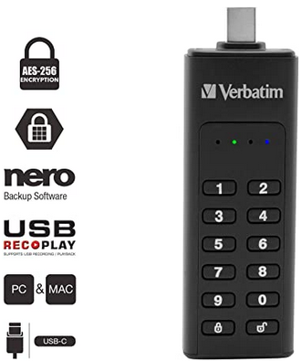
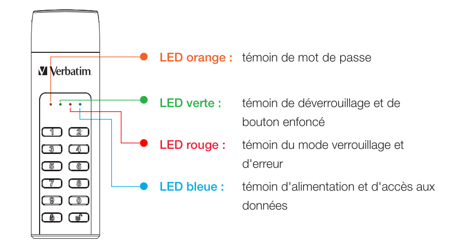
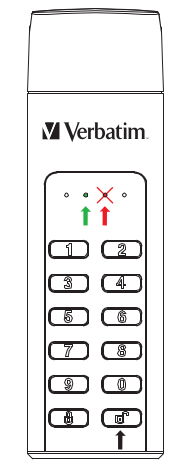
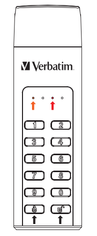
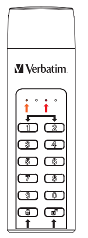

+++
title = 'VERBATIM Clé USB 64Go Type C sécurisée par clavier'
date = 2022-04-29 00:00:00 +0100
categories = ['chiffrement']
+++
  - [Verbatim Keypad Secure USB Drive](#verbatim-keypad-secure-usb-drive)
    - [Instructions d'utilisation](#instructions-dutilisation)
    - [Guide de démarrage rapide](#guide-de-démarrage-rapide)
    - [Changer le mot de passe](#changer-le-mot-de-passe)
    - [Effacer la clé USB et enregistrer un nouveau mot de passe](#effacer-la-clé-usb-et-enregistrer-un-nouveau-mot-de-passe)

## Verbatim Keypad Secure USB Drive

    

Caractéristiques :

 * Prise en charge de l’USB Super-speed (5Gb/s) / High-speed (480Mb/s) / Full-speed 
(12 Mb/s)
 * Prise en charge de Windows 7/8/10, Mac OS X et versions ultérieures
 * Prise en charge du chiffrement matériel AES 256 bits
 * Clavier intégré pour la saisie sécurisée du mot de passe
 * Témoins LED de statut de l'alimentation/du chiffrement
 * Installation et configuration simples

Spécifications :

 * Interfaces : USB 3.1 GEN 1/USB 3.0  
 * Prise en charge du fonctionnement USB SuperSpeed (5Gb/s)
 * Matériau du boîtier : plastique + aluminium
 * Témoin LED : alimentation, activité USB et statut du chiffrement

Environnement :

 * Alimentation électrique : 5V.c.c. fournis par l'ordinateur
 * Température de fonctionnement : de 5°C à 50°C
 * Température de stockage : de -20°C à 70°C
 * Humidité opérationnelle : de 5% à 90%, sans condensation

### Instructions d'utilisation

Significations des LED :

LED orange reste allumée en continu en mode mot de passe (création ou modification
du mot de passe) et s'éteint une fois terminé.

LED verte clignote une fois lorsque le bouton est enfoncé, puis reste allumée en continu
lorsque le disque est déverrouillé.

LED rouge clignote lorsque le mot de passe a été saisi de manière incorrecte ou lors
du fonctionnement anormal et reste allumée en mode verrouillé/s'éteint après
le déverrouillage.

LED bleue reste allumée en continu lorsque l'alimentation est en marche et clignote
en mode d'accès aux données.

### Guide de démarrage rapide

Pour votre sécurité, nous vous recommandons de modifier le mot de passe par défaut.
Le mot de passe doit comporter 5 à 12 chiffres.
{: .prompt-info }

Avertissement  
Au bout de 20 erreurs de mot de passe, l'appareil se verrouille et initialise le disque, ce
qui nécessite un reformatage. Consulter la partie « Lancer et formater votre Clé USB
Verbatim » et suivre les étapes indiquées.
{: .prompt-warning }

1. Connecter le lecteur USB crypté à votre ordinateur
2. Saisir le mot de passe par défaut, puis appuyer sur le bouton 
 pour le confirmer. (Le mot de passe par défaut est « 00000 »)
3. À ce moment, la LED rouge doit rester éteinte et la LED verte doit être allumée.
La clé USB a été déverrouillé avec succès.
4. Ouvrir « My Computer » pour visualiser votre clé USB prêt à l'utilisation.

### Changer le mot de passe

1. Appuyer sur le bouton  et le maintenir enfoncé, puis connectez le lecteur USB à votre
ordinateur, jusqu'à ce que la LED rouge et la LED orange s'allument. Vous pouvez
relâcher le bouton 
2. Saisir le mot de passe actuel (mot de passe par défaut : « 00000 ») et appuyer sur  
pour confirmer. La LED orange s'éteint.
3. Saisir votre nouveau mot de passe et confirmer en appuyant sur la touche 
4. Saisir à nouveau le mot de passe saisi à l'étape 3 et appuyer à nouveau sur  
jusqu'à ce la LED rouge s'éteigne.
5. Votre appareil est à présent redéverrouillé.

### Effacer la clé USB et enregistrer un nouveau mot de passe

Veuillez sauvegarder vos données avant de définir un nouveau mot de passe. Afin de
protéger vos données, l'enregistrement d'un nouveau mot de passe initialise la clé
USB. Pour formater la clé USB, veuillez suivre les étapes indiquées dans le chapitre
« Prêt à l'utilisation ».
{: .prompt-info }

1. Appuyer sur les touches 1 et 2 simultanément et les maintenir enfoncées, puis connectez
le lecteur USB à votre ordinateur. Relâcher les deux touches dès que la LED rouge.
2. À présent, appuyer sur la touche  pendant 5 secondes, jusqu'à ce que la LED orange s'allume.
3. Saisir votre nouveau mot de passe et confirmer en appuyant sur la touche  ,la LED orange s'éteint.
4. Le mot de passe est défini.
5. Saisir à nouveau le mot de passe saisi à l'étape 3. Appuyer sur  .La LED rouge s'éteint. 
6. Votre appareil est à présent déverrouillé.
7. Une fois le nouveau mot de passe défini et le disque initialisé, veuillez suivre les
instructions des pages suivantes concernant le formatage.

