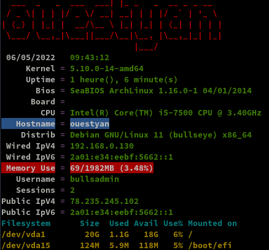
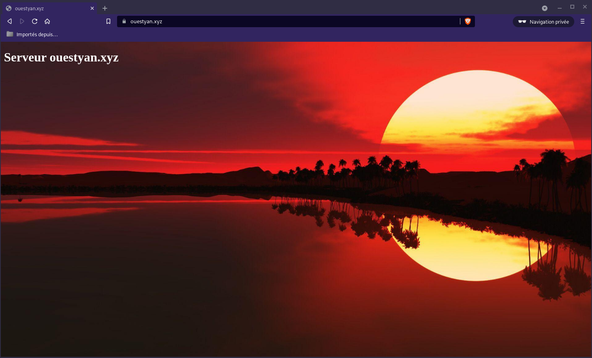
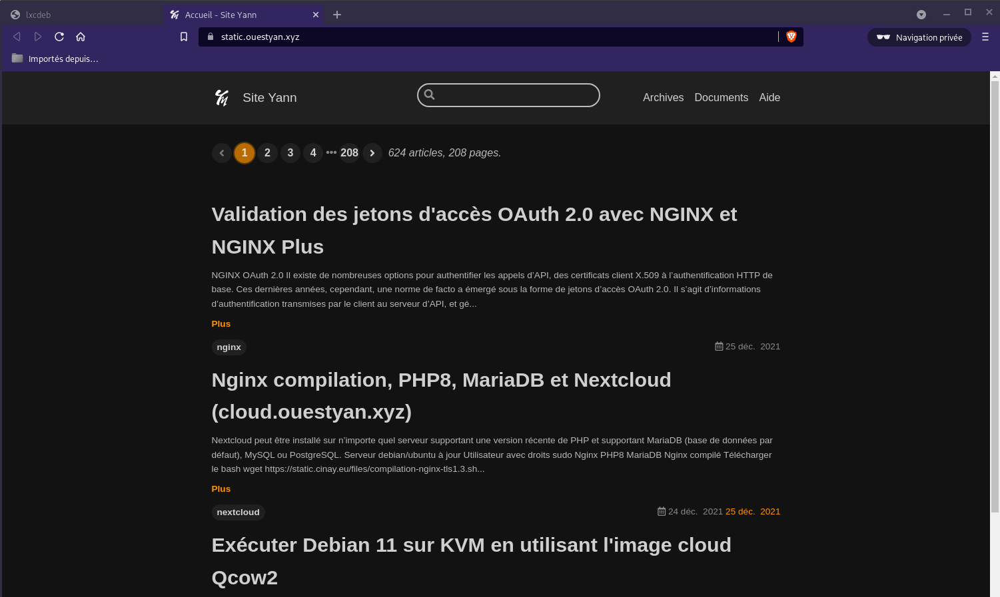
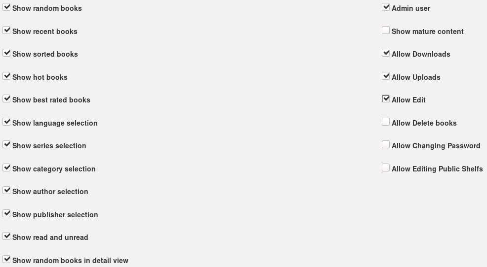
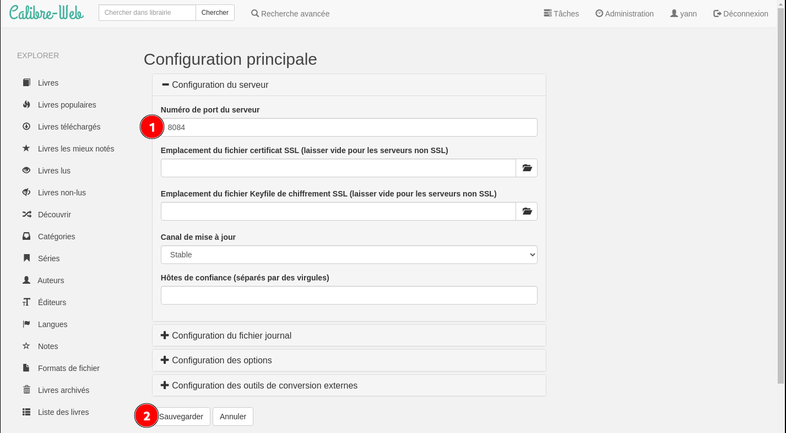
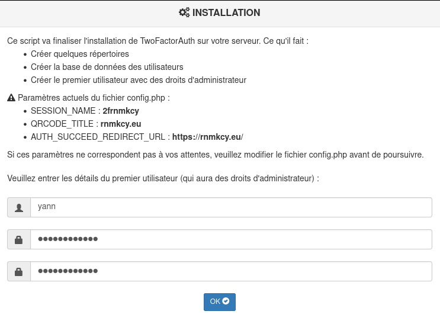
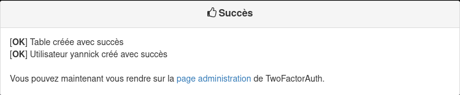
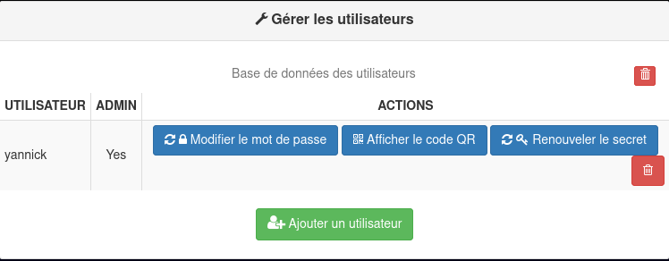
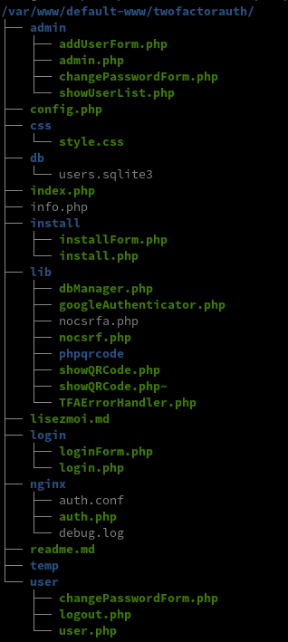

+++
title = 'Qemu/KVM - Serveur ouestyan.xyz debian 11 virtuel avec image cloud Qcow2 sur archlinux'
date = 2022-05-06 00:00:00 +0100
categories = ['virtuel']
+++
{:height=50} / {:height=50}  
*qemu kvm sont installés*  

  - [KVM debian bullseyes virtuel](#kvm-debian-bullseyes-virtuel)
    - [Liens](#liens)
    - [Image Cloud Debian 11](#image-cloud-debian-11)
    - [Créer Debian 11 (bullseyes) sur KVM en utilisant l'image du nuage](#créer-debian-11-bullseyes-sur-kvm-en-utilisant-limage-du-nuage)
    - [Redimensionner le disque à la taille souhaitée.](#redimensionner-le-disque-à-la-taille-souhaitée)
    - [Générer les clés SSH](#générer-les-clés-ssh)
    - [Ip V4 V6 statiques](#ip-v4-v6-statiques)
    - [Ajouter le compte admin d'un utilisateur](#ajouter-le-compte-admin-dun-utilisateur)
    - [OpenSSH, clé et script](#openssh-clé-et-script)
    - [Utilitaires](#utilitaires)
    - [Motd](#motd)
    - [Parefeu UFW](#parefeu-ufw)
    - [Connexion SSH --> PC1](#connexion-ssh----pc1)
    - [Partages](#partages)
      - [Partages virtio-fs (Choix par défaut)](#partages-virtio-fs-choix-par-défaut)
      - [Partages SSHFS](#partages-sshfs)
  - [ouestyan.xyz](#ouestyanxyz)
    - [DNS local](#dns-local)
    - [Zone DNS OVH](#zone-dns-ovh)
    - [Certificats Let's Encrypt](#certificats-lets-encrypt)
    - [Renouvellement Certificats Let's Encrypt](#renouvellement-certificats-lets-encrypt)
    - [Nginx compilation, PHP8, MariaDB et Nextcloud](#nginx-compilation-php8-mariadb-et-nextcloud)
    - [Page d'accueil](#page-daccueil)
  - [Modification configuration nginx](#modification-configuration-nginx)
    - [Accueuil - ouestyan.xyz](#accueuil---ouestyanxyz)
    - [Statique](#statique)
      - [static.ouestyan.xyz](#staticouestyanxyz)
    - [Nextcloud](#nextcloud)
      - [cloud.ouestyan.xyz](#cloudouestyanxyz)
      - [ouestyan.xyz/nextcloud](#ouestyanxyznextcloud)
    - [Développement](#développement)
      - [dev.ouestyan.xyz](#devouestyanxyz)
      - [ouestyan.xyz/devel](#ouestyanxyzdevel)
  - [Authentification 2FA - ouestyan.xyz](#authentification-2fa---ouestyanxyz)
    - [Installer PHP 2FA](#installer-php-2fa)
    - [Sécurité base de données](#sécurité-base-de-données)
    - [Authentification - NGINX auth_request](#authentification---nginx-auth_request)
  - [API RESTful PHP CodeIgniter et JWT](#api-restful-php-codeigniter-et-jwt)


## KVM debian bullseyes virtuel

{:width=150}  
*Si vous exploitez un nuage privé ou une plateforme de virtualisation fonctionnant avec KVM, comme OpenStack et oVirt. La manière la plus idéale de faire tourner une machine virtuelle Debian 11 est d'utiliser une image de nuage. Dans ce blog, nous vous montrons comment télécharger l'image officielle du nuage Debian 11 et créer une instance de machine virtuelle à partir de celle-ci sur l'hyperviseur KVM. Article original [Create Debian 11 (Bullseye) KVM Guest From Cloud Image](https://blog.programster.org/create-debian-11-kvm-guest-from-cloud-image)*

### Liens

* [Manage debian VMs on LVM with cloud-init](https://philpep.org/blog/debian-vm-on-lvm-with-cloud-init/)
* [Run Debian 11 (bullseyes) on KVM using Qcow2 Cloud Image](https://techviewleo.com/run-debian-bullseyes-on-kvm-using-qcow2-cloud-image/) 
* [Comment installer une image virtuelle KVM sur un serveur Debian Linux 9 Headless (sans affichage)](/posts/Comment-installer-une-image-virtuelle-KVM-sur-un-serveur-Debian-Linux-9-Headless-(sans-affichage)/)  
* [15 virt-install examples | KVM virtualization commands cheatsheet](https://www.golinuxcloud.com/virt-install-examples-kvm-virt-commands-linux/#11_virtinstall_graphics_with_VNC_Viewer)


### Image Cloud Debian 11

Toutes les images de Debian 11 Cloud sont disponibles sur la [page officielle de téléchargement des images d'OS](https://cloud.debian.org/images/cloud/). Dans ce guide, nous allons télécharger l'image nocloud qcow2 :

    mkdir -p ~/virtuel/KVM/ && cd ~/virtuel/KVM/
    wget https://cloud.debian.org/images/cloud/bullseye/latest/debian-11-nocloud-amd64.qcow2

Vous pouvez vérifier plus de détails sur le fichier en utilisant la commande file :

    file debian-11-nocloud-amd64.qcow2

*debian-11-nocloud-amd64.qcow2: QEMU QCOW2 Image (v3), 2147483648 bytes*

### Créer Debian 11 (bullseyes) sur KVM en utilisant l'image du nuage

Ensuite, nous créons une machine virtuelle Debian 11 (bullseyes) à partir de notre image du nuage.

Enregistrons quelques variables importantes :

*    USERNAME : Nom d'utilisateur Admin
*    PASSWORD : Mot de passe de l'utilisateur Admin
*    VM_NAME : Nom de la machine virtuelle

Enregistrez les variables comme indiqué, mais assurez-vous de définir les valeurs à votre convenance :

    export VM_NAME="debian-bullseyes"
    export USERNAME=""
    export PASSWORD=""

Une fois les variables exportées, nous créons l'image du disque racine de l'OS à partir de l'image du cloud téléchargée précédemment :

```bash
mkdir -p ~/virtuel/KVM/$VM_NAME \
&& qemu-img convert \
  -f qcow2 \
  -O qcow2 \
  ~/virtuel/KVM/debian-11-nocloud-amd64.qcow2 \
  ~/virtuel/KVM/$VM_NAME/root-disk.qcow2
```

Vérifiez la création du fichier si elle est réussie

    file  ~/virtuel/KVM/$VM_NAME/root-disk.qcow2

*/home/yann/virtuel/KVM/debian-bullseyes/root-disk.qcow2: QEMU QCOW2 Image (v3), 2147483648 bytes*

    sudo du -sh ~/virtuel/KVM/$VM_NAME/root-disk.qcow2

*912M	/home/yann/virtuel/KVM/debian-bullseyes/root-disk.qcow2*

Supprimer l'image cloud

    rm ~/virtuel/KVM/debian-11-nocloud-amd64.qcow2

### Redimensionner le disque à la taille souhaitée.

>Notez que le disque racine que nous avons créé a une petite capacité de disque comme défini dans l'image de nuage par défaut.

Confirmez la taille actuelle avec la commande qemu-img info :

    qemu-img  info ~/virtuel/KVM/$VM_NAME/root-disk.qcow2

```
image: /home/yann/virtuel/KVM/debian-bullseyes/root-disk.qcow2
file format: qcow2
virtual size: 2 GiB (2147483648 bytes)
disk size: 912 MiB
cluster_size: 65536
Format specific information:
    compat: 1.1
    compression type: zlib
    lazy refcounts: false
    refcount bits: 16
    corrupt: false
    extended l2: false
```

Redimensionnons à la taille souhaitée pour le disque racine.


```bash
# 20 GB de disque
export VM_ROOT_DISK_SIZE=20G

# Resize Debian 11 VM disk
qemu-img resize \
  ~/virtuel/KVM/$VM_NAME/root-disk.qcow2 \
  $VM_ROOT_DISK_SIZE
```

*Image resized.*

Confirmez la taille actuelle avec la commande qemu-img info :

    qemu-img  info ~/virtuel/KVM/$VM_NAME/root-disk.qcow2

```
image: /home/yann/virtuel/KVM/debian-bullseyes/root-disk.qcow2
file format: qcow2
virtual size: 20 GiB (21474836480 bytes)
disk size: 912 MiB
cluster_size: 65536
Format specific information:
    compat: 1.1
    compression type: zlib
    lazy refcounts: false
    refcount bits: 16
    corrupt: false
    extended l2: false
```

Créez une nouvelle machine virtuelle Debian 11 à l'aide de la commande `virt-install`.  
Nous utilisons le réseau en pont , remplacer `network=default` par `bridge=br0`


```bash
sudo virt-install \
    --memory 2048 \
    --vcpus 1 \
    --name $VM_NAME \
    --disk ~/virtuel/KVM/$VM_NAME/root-disk.qcow2,device=disk,bus=virtio,format=qcow2 \
    --os-type Linux \
    --os-variant debian11 \
    --network bridge=br0,model=virtio \
    --virt-type kvm \
    --graphics none \
    --import
```


A la fin de l'installation, on arrive sur le login : "root" sans mot de passe  

```
[...]
[  OK  ] Finished Update UTMP about System Runlevel Changes.

Debian GNU/Linux 11 debian ttyS0

debian login: 
```

### Ip V4 V6 statiques

Pour le nexthop IPV6 FreeBox

    ip a |grep "inet6 fe80"

*inet6 fe80::5054:ff:fecb:12ed/64 scope link*

Passage en ip statique 192.168.0.130 et 2a01:e34:eebf:5662::1 (nexthop `fe80::5054:ff:fecb:12ed`) 

    nano /etc/network/interfaces.d/staticv4v6

```
# The primary network interface
allow-hotplug enp1s0
#iface enp1s0 inet dhcp
iface enp1s0 inet static
 address 192.168.0.130
 netmask 255.255.255.0
 gateway 192.168.0.254
# This is an autoconfigured IPv6 interface
#iface enp1s0 inet6 auto
iface enp1s0 inet6 static
 address 2a01:e34:eebf:5662::1
 netmask 64
 post-up ip -6 route add default via fe80::8e97:eaff:fe39:66d6 dev enp1s0

```

Pour éviter l'erreur `ICMPv6: RA: ndisc_router_discovery failed to add default route`  
Correction, désactiver l’annonce des routes ([accept_ra](https://sysctl-explorer.net/net/ipv6/accept_ra/)) :

    nano /etc/sysctl.conf

```
# Uncomment the next line to enable packet forwarding for IPv6
#  Enabling this option disables Stateless Address Autoconfiguration
#  based on Router Advertisements for this host
net.ipv6.conf.all.forwarding=1

# Accept Router Advertisements
net.ipv6.conf.all.accept_ra=0

```

Activer `net.ipv6.conf.all.forwarding=1` et ajouter `net.ipv6.conf.all.accept_ra=0`   
Puis `sysctl -p` pour une validation immédiate  

reboot : `reboot`

Vérifier Adressage IP statique

    ip a

```
1: lo: <LOOPBACK,UP,LOWER_UP> mtu 65536 qdisc noqueue state UNKNOWN group default qlen 1000
    link/loopback 00:00:00:00:00:00 brd 00:00:00:00:00:00
    inet 127.0.0.1/8 scope host lo
       valid_lft forever preferred_lft forever
    inet6 ::1/128 scope host 
       valid_lft forever preferred_lft forever
2: enp1s0: <BROADCAST,MULTICAST,UP,LOWER_UP> mtu 1500 qdisc pfifo_fast state UP group default qlen 1000
    link/ether 52:54:00:cb:12:ed brd ff:ff:ff:ff:ff:ff
    inet 192.168.0.130/24 brd 192.168.0.255 scope global enp1s0
       valid_lft forever preferred_lft forever
    inet6 2a01:e34:eebf:5662::1/64 scope global 
       valid_lft forever preferred_lft forever
    inet6 fe80::5054:ff:fecb:12ed/64 scope link 
       valid_lft forever preferred_lft forever
```

### Générer les clés SSH

Par défaut openssh ne fonctionne pas : `sshd: no hostkeys available -- exiting.`  
Il faut regénérer les clés

    dpkg-reconfigure openssh-server

{:width=500}

Modifier le paramétrage sshd

```bash
# To disable tunneled clear text passwords, change to no here!
PasswordAuthentication yes
```

Relancer le service

    systemctl restart sshd

### Ajouter le compte admin d'un utilisateur

Après s'être connecté en tant qu'utilisateur root, créer le premier utilisateur admin en utilisant la commande adduser :

    adduser bullsadmin

```
Adding user `bullsadmin' ...
Adding new group `bullsadmin' (1000) ...
Adding new user `bullsadmin' (1000) with group `bullsadmin' ...
Creating home directory `/home/bullsadmin' ...
Copying files from `/etc/skel' ...
New password: 
Retype new password: 
passwd: password updated successfully
Changing the user information for bullsadmin
Enter the new value, or press ENTER for the default
	Full Name []: Bullseye admin
	Room Number []: 
	Work Phone []: 
	Home Phone []: 
	Other []: 
Is the information correct? [Y/n] 
```

Vérifiez l'identité de l'utilisateur et le groupe. Il est évident que l'utilisateur n'est pas dans le groupe privilégié sudo.

    id bullsadmin

`uid=1000(bullsadmin) gid=1000(bullsadmin) groups=1000(bullsadmin)`

Ajouter l'utilisateur créé au groupe sudo pour l'escalade des privilèges.

    usermod -aG sudo bullsadmin
    id bullsadmin

`uid=1000(bullsadmin) gid=1000(bullsadmin) groups=1000(bullsadmin),27(sudo)`

Vérifier si l'utilisateur peut se connecter et utiliser la commande sudo.

    su - bullsadmin

```bash
bullsadmin@bullseyes:~$ sudo su -
sudo: unable to resolve host bullseyes: Name or service not known

We trust you have received the usual lecture from the local System
Administrator. It usually boils down to these three things:

    #1) Respect the privacy of others.
    #2) Think before you type.
    #3) With great power comes great responsibility.

[sudo] password for bullsadmin: 
root@bullseyes:~# 
```

Ajout à sudoers

    echo "bullsadmin     ALL=(ALL) NOPASSWD: ALL" >> /etc/sudoers

Modifier Hostname

    hostnamectl set-hostname ouestyan
    hostnamectl

```
   Static hostname: ouestyan
         Icon name: computer-vm
           Chassis: vm
        Machine ID: fbc67e25a91b4e549dd2b91b986252ed
           Boot ID: 8691b7fe24554e10924eb14c6a1b2bc2
    Virtualization: kvm
  Operating System: Debian GNU/Linux 11 (bullseye)
            Kernel: Linux 5.10.0-14-amd64
      Architecture: x86-64
```

Ajout ip au fichier hosts

    nano /etc/hosts

```
127.0.0.1       localhost ouestyan
```

Date et heure GMT

    timedatectl

```
               Local time: Fri 2022-05-06 09:33:52 UTC
           Universal time: Fri 2022-05-06 09:33:52 UTC
                 RTC time: Fri 2022-05-06 09:33:53
                Time zone: Etc/UTC (UTC, +0000)
System clock synchronized: yes
              NTP service: active
          RTC in local TZ: no
```

Mise à jour et reboot

    apt update 

Dans le cas contraire au message **All packages are up to date.**

    apt upgrade -y

Connexion utilisateur

    ssh bullsadmin@192.168.0.130

### OpenSSH, clé et script

{:width="70"}  
**connexion avec clé**  
<u>sur l'ordinateur de bureau</u>
Générer une paire de clé curve25519-sha256 (ECDH avec Curve25519 et SHA2) pour une liaison SSH avec le serveur.  

    ssh-keygen -t ed25519 -o -a 100 -f ~/.ssh/vm-bullseyes

Envoyer les clés publiques sur le serveur KVM   

    ssh-copy-id -i ~/.ssh/vm-bullseyes.pub bullsadmin@192.168.0.130

<u>sur le serveur KVM</u>
On se connecte  

    ssh bullsadmin@192.168.0.130

Modifier la configuration serveur SSH  

    sudo nano /etc/ssh/sshd_config

Modifier

```conf
Port = 55130
PasswordAuthentication no
```

Relancer le serveur

    sudo systemctl restart sshd

Test connexion

    ssh -p 55130 -i ~/.ssh/vm-bullseyes bullsadmin@192.168.0.130

### Utilitaires

Installer utilitaires  

    sudo apt install rsync curl tmux jq figlet git jpegoptim

### Motd

Effacer et créer motd

    sudo rm /etc/motd && sudo nano /etc/motd

```
 __     ____  __   _           _ _                            
 \ \   / |  \/  | | |__  _   _| | |___  ___ _   _  ___ ___    
  \ \ / /| |\/| | | '_ \| | | | | / __|/ _ | | | |/ _ / __|   
   \ V / | |  | | | |_) | |_| | | \__ |  __| |_| |  __\__ \   
    \_/  |_|  |_| |_.___ \__,_|_|_|___/\___|\__, |\___|___/   
   ___  _   _  ___ ___| |_ _   _  __ _ _ __ |___/ ___   _ ____
  / _ \| | | |/ _ / __| __| | | |/ _` | '_ \  \ \/ | | | |_  /
 | (_) | |_| |  __\__ | |_| |_| | (_| | | | |_ >  <| |_| |/ / 
  \___/ \__,_|\___|___/\__|\__, |\__,_|_| |_(_/_/\_\\__, /___|
                           |___/                    |___/     
```

Script ssh_rc_bash

>ATTENTION!!! Les scripts sur connexion peuvent poser des problèmes pour des appels externes autres que ssh

    wget https://static.xoyaz.xyz/files/ssh_rc_bash
    chmod +x ssh_rc_bash # rendre le bash exécutable
    ./ssh_rc_bash        # exécution



### Parefeu UFW

{:width="50"} 

*UFW, ou pare - feu simple , est une interface pour gérer les règles de pare-feu dans Arch Linux, Debian ou Ubuntu. UFW est utilisé via la ligne de commande (bien qu'il dispose d'interfaces graphiques disponibles), et vise à rendre la configuration du pare-feu facile.*

Installation **Debian / Ubuntu**

    sudo apt-get install ufw

*Par défaut, les jeux de règles d'UFW sont vides, de sorte qu'il n'applique aucune règle de pare-feu, même lorsque le démon est en cours d'exécution.*   

Les règles 

    sudo ufw allow 55130/tcp  # port SSH
    sudo ufw allow http       # port 80
    sudo ufw allow https      # port 443
    sudo ufw allow DNS        # port 53

Activer le parefeu

    sudo ufw enable

```
Command may disrupt existing ssh connections. Proceed with operation (y|n)? y
Firewall is active and enabled on system startup
```

Status

     sudo ufw status verbose

```
Status: active
Logging: on (low)
Default: deny (incoming), allow (outgoing), deny (routed)
New profiles: skip

To                         Action      From
--                         ------      ----
55130/tcp                  ALLOW IN    Anywhere                  
80/tcp                     ALLOW IN    Anywhere                  
443                        ALLOW IN    Anywhere                  
53 (DNS)                   ALLOW IN    Anywhere                  
55130/tcp (v6)             ALLOW IN    Anywhere (v6)             
80/tcp (v6)                ALLOW IN    Anywhere (v6)             
443 (v6)                   ALLOW IN    Anywhere (v6)             
53 (DNS (v6))              ALLOW IN    Anywhere (v6)             
```

### Connexion SSH --> PC1

Générer une paire de clé curve25519-sha256 (ECDH avec Curve25519 et SHA2)

    ssh-keygen -t ed25519 -o -a 100 -f ~/.ssh/Ouestyan2PC1

Ajouter la clé publique au fichier `authorized_keys` de PC1

Test connexion

    ssh -p 55042 -i ~/.ssh/Ouestyan2PC1 yann@192.168.0.42

### Partages 

#### Partages virtio-fs (Choix par défaut)

* [Sharing files with Virtiofs](https://libvirt.org/kbase/virtiofs/)  

virtio-fs est conçu pour offrir une sémantique de système de fichiers local et des performances.   
virtio-fs profite de la co-localisation de la machine virtuelle avec l'hyperviseur pour éviter les surcharges associées aux systèmes de fichiers réseau.   
virtio-fs utilise FUSE comme base. Contrairement à FUSE traditionnel où le démon du système de fichiers s'exécute dans l'espace utilisateur, le démon de virtio-fs s'exécute sur l'hôte.   
Un périphérique VIRTIO transporte les messages FUSE et fournit des extensions pour des fonctionnalités avancées non disponibles dans FUSE traditionnel.

**Partage d'un répertoire hôte avec un invité**

Ajoutez les éléments XML de domaine suivants pour partager le répertoire hôte /path avec l'invité

```xml
<domain>
  ...
  <memoryBacking>
    <source type='memfd'/>
    <access mode='shared'/>
  </memoryBacking>
  ...
  <devices>
    ...
    <filesystem type='mount' accessmode='passthrough'>
      <driver type='virtiofs'/>
      <source dir='/srv/media'/>
      <target dir='media_tag'/>
    </filesystem>
    ...
  </devices>
</domain>
```

N'oubliez pas les éléments `<memoryBacking>`. Ils sont nécessaires pour la connexion **vhost-user** avec le démon **virtiofsd**.

Notez que malgré son nom, le `target dir` est une chaîne arbitraire appelée `media_tag` qui est utilisée à l'intérieur de l'invité pour identifier le système de fichiers partagé à monter. Il n'est pas nécessaire qu'elle corresponde au point de montage souhaité dans l'invité.
{: .prompt-info }

répertoire dans lequel va être monté le système de fichiers :

    mkdir -p $HOME/media

Démarrez l'invité et montez le système de fichiers

    sudo mount -t virtiofs media_tag /home/bullsadmin/media

Pour un montage permanent, modifier `/etc/fstab`

    media_tag /home/bullsadmin/media virtiofs rw,_netdev 0 0

Rechargement

    sudo mount -a

Note : ceci nécessite le support de virtiofs dans le noyau de l'invité (Linux v5.4 ou plus).
{: .prompt-warning }

#### Partage SSHFS (NON UTILISE)

installer application sshfs

    sudo apt install sshfs

Monter un répertoire distant 

    sshfs -oIdentityFile=~/.ssh/Virt2PC1 yann@192.168.0.42:/srv/media $HOME/media -C -p 55042

Démontage

    fusermount -u /home/bullsadmin/media/

Modifier  `/etc/fstab`  

```
yann@192.168.0.42:/srv/media /home/bullsadmin/media  fuse.sshfs x-systemd.automount,_netdev,user,idmap=user,transform_symlinks,identityfile=/home/bullsadmin/.ssh/Virt2PC1,allow_other,reconnect,port=55042 0 0
```

Activer le point de montage

    sudo mount -a

Vérifier

    ls media/

```
BiblioCalibre     archives   dplus            lxcdeb   qms
CalibreTechnique  borgmount  gitea            music    statique
Notes             devel      gitea-hors-site  osm-new  temp
_h5ai             diceware   gitlab           partage  yanspm-md-hors-blog
```

## ouestyan.xyz

### DNS local

Sur le poste qui héberge le site virtuel, modifier `/etc/hosts`

    192.168.0.130   ouestyan ouestyan.xyz cloud.ouestyan.xyz static.ouestyan.xyz dev.ouestyan.xyz

### Zone DNS OVH 

{:width="30"}  
*Zone DNS accessible UNIQUEMENT en IPV6*  


```dns
$TTL 3600
@	IN SOA dns106.ovh.net. tech.ovh.net. (2021122201 86400 3600 3600000 60)
                         IN NS     dns106.ovh.net.
                         IN NS     ns106.ovh.net.
                         IN MX     10 ouestyan.xyz.
                         IN AAAA   2a01:e34:eebf:5662::1
                         IN CAA    128 issue "letsencrypt.org"
                         IN TXT    "v=spf1 a mx -all"
*                        IN AAAA   2a01:e34:eebf:5662::1
_dmarc                   IN TXT    "v=DMARC1; p=none"
_xmpp-client._tcp        IN SRV    0 5 5222 ouestyan.xyz.
_xmpp-server._tcp        IN SRV    0 5 5269 ouestyan.xyz.
mail._domainkey          IN TXT    ( "v=DKIM1; h=sha256; k=rsa; p=MIGfMA0GCSqGSIb3DQEBAQUAA4GNADCBiQKBgQDqu/DKk4rJVEbIrtgxrPspyh5PSAU2v/xjqVeosTf30dEiOxrH9FyOQuD2EYPhn5yVOdyvFDKNk9kguyv5td2fVo9RiujmpZMjFESxkhG0rxcDlkx4QkPy6FrNhTwrp8ISyxwnAytTTDLVy0bOVn+JJkU4GorsLs81YAuhQXrntQIDAQAB" )
muc                      IN CNAME  ouestyan.xyz.
pubsub                   IN CNAME  ouestyan.xyz.
vjud                     IN CNAME  ouestyan.xyz.
xmpp-upload              IN CNAME  ouestyan.xyz.
```

### Certificats Let's Encrypt

{:width="80"}

Installation gestionnaire des certificats Let's Encrypt

```bash
cd ~
#sudo apt install socat # installé par défaut sur image cloud debian 11
git clone https://github.com/acmesh-official/acme.sh.git
cd acme.sh
./acme.sh --install 
```

Se reconnecter utilisateur  

Les clés OVH API   

    export OVH_AK="xxxxxxxxxxxxxxxxxx"
    export OVH_AS="yyyyyyyyyyyyyyyyyyyyyyyyyyyy"

Génération des certificats  

    acme.sh --dns dns_ovh --server letsencrypt --issue --keylength ec-384 -d 'ouestyan.xyz' -d '*.ouestyan.xyz'

Résultat de l'installation

```
[Fri May  6 11:26:14 UTC 2022] Your cert is in: /home/bullsadmin/.acme.sh/ouestyan.xyz_ecc/ouestyan.xyz.cer
[Fri May  6 11:26:14 UTC 2022] Your cert key is in: /home/bullsadmin/.acme.sh/ouestyan.xyz_ecc/ouestyan.xyz.key
[Fri May  6 11:26:14 UTC 2022] The intermediate CA cert is in: /home/bullsadmin/.acme.sh/ouestyan.xyz_ecc/ca.cer
[Fri May  6 11:26:14 UTC 2022] And the full chain certs is there: /home/bullsadmin/.acme.sh/ouestyan.xyz_ecc/fullchain.cer
```

Installation des certificats

```
sudo mkdir -p /etc/ssl/private/
sudo chown $USER -R /etc/ssl/private/
acme.sh --ecc --install-cert -d 'ouestyan.xyz' -d '*.ouestyan.xyz' --key-file /etc/ssl/private/ouestyan.xyz-key.pem --fullchain-file /etc/ssl/private/ouestyan.xyz-fullchain.pem  --reloadcmd 'sudo systemctl reload nginx.service'
```

Résultat

```
[Fri May  6 11:27:17 UTC 2022] Installing key to: /etc/ssl/private/ouestyan.xyz-key.pem
[Fri May  6 11:27:17 UTC 2022] Installing full chain to: /etc/ssl/private/ouestyan.xyz-fullchain.pem
```

Supprimer ` --reloadcmd 'sudo systemctl reload nginx.service'` à la ligne précédente si Nginx n'est pas installé
{: .prompt-warning }

Editer le crontab, supprimer la ligen existante et ajouter ce qui suit

    crontab -e

Nginx installé

```bash
56 0 * * * "/home/bullsadmin/.acme.sh"/acme.sh --cron --home "/home/bullsadmin/.acme.sh" --renew-hook "/home/bullsadmin/.acme.sh/acme.sh --ecc --install-cert -d 'ouestyan.xyz' -d '*.ouestyan.xyz' --key-file /etc/ssl/private/ouestyan.xyz-key.pem --fullchain-file /etc/ssl/private/ouestyan.xyz-fullchain.pem  --reloadcmd 'sudo systemctl reload nginx.service'" > /dev/null
```

Nginx non installé

```bash
56 0 * * * "/home/bullsadmin/.acme.sh"/acme.sh --cron --home "/home/bullsadmin/.acme.sh" --renew-hook "/home/bullsadmin/.acme.sh/acme.sh --ecc --install-cert -d 'ouestyan.xyz' -d '*.ouestyan.xyz' --key-file /etc/ssl/private/ouestyan.xyz-key.pem --fullchain-file /etc/ssl/private/ouestyan.xyz-fullchain.pem" > /dev/null
```

### Renouvellement Certificats Let's Encrypt

Le serveur **debian bullseyes** n'est pas sous tension 24h/24h. Le renouvellement des certificats doit être testé au démarrage du serveur et une fois par jour. Pour cela on utulise un ervice et un timer systemd utilisateur.
{: .prompt-warning }

Le fonctionnement de systemd impose cependant d’avoir deux fichiers : *service*, qui contient la définition du programme et *timer*, qui dit “quand” le lancer et ils doivent porter le même nom 

Créer le dossier systemd utilisateur

    mkdir -p ~/.config/systemd/user

Si vous gérez déjà vos services via systemd, vous avez déjà utilisé des “unit” systemd de type “service”.  
Ces “unit” permettent de définir un process et son mode d’éxécution.  
Pour implémenter un “timer” sous systemd, il va nous falloir un fichier “service”.  

Pour notre tâche à planifier, nous allons avoir au final 3 fichiers :

* Le fichier “service” qui va dire quel script exécuter
* Le fichier “timer” qui va indiquer quand il doit être exécuté.
* Le script à exécuter

>A noter que par convention, les fichiers service et timer doivent avoir le même nom

Nous devons exécuter ,une fois par jour , un script de renouvellement certificat /home/bullsadmin/renouvcertif sur un ordinateur qui n’est pas sous tension 24/24h.

Créer le fichier service `~/.config/systemd/user/renouvcertif.service`, une base simple

```ini
[Unit]
Description=renouvellement certificat

[Service]
Type=simple
ExecStart=/bin/bash /home/bullsadmin/renouvcertif.sh
StandardError=journal
Type=oneshot
```

Je fournis une description à mon service, indique que c’est un process de type simple, le chemin vers mon script et je rajoute que le flux d’erreur est envoyé dans le journal.Il ne faut pas de section [Install] car le script va être piloté par le fichier timer.
La ligne Type=oneshot est importante, c’est elle qui dit à systemd de ne pas relancer le service en boucle.

Créer le fichier “timer” `~/.config/systemd/user/renouvcertif.timer`

```ini
[Unit]
Description=renouvellement certificat

[Timer]
OnBootSec=15min
OnUnitActiveSec=1d

Unit=renouvcertif.service

[Install]
WantedBy=timers.target
```

>Ceci exécute le fichier .service correspondant 15 minutes après le démarrage et ensuite tous les jours pendant que le système est actif.

Créer le script `~/renouvcertif.sh`

```bash
#!/bin/bash
flag="/var/tmp/$(basename -- $0).flag"

if [ -e "$flag" ] ;then
  if [ "$(date +%F)" == "$(date +%F -r $flag)" ]; then
   # script déjà exécuté 1 fois aujourd'hui, on sort
   echo "script déjà exécuté ce jour, présence du flag $flag"
   exit 1
  fi
fi
echo "Exécution du script"
touch "$flag"

echo "Exécution de la commande de renouvellement"
"/home/bullsadmin/.acme.sh"/acme.sh --cron --home "/home/bullsadmin/.acme.sh" --renew-hook "/home/bullsadmin/.acme.sh/acme.sh --ecc --install-cert -d 'ouestyan.xyz' -d '*.ouestyan.xyz' --key-file /etc/ssl/private/ouestyan.xyz-key.pem --fullchain-file /etc/ssl/private/ouestyan.xyz-fullchain.pem  --reloadcmd 'sudo systemctl reload nginx.service'"
echo "Fin renouvellement certificat"

exit 0
```

Le rendre exécutable

    chmod +x renouvcertif.sh

Activation et démarrage du timer

Il est possible de tester le service avec un simple `systemctl --user start renouvcertif.service`, de regarder les logs avec `journalctl --user -u renouvcertif.service`.

Ensuite, pour qu’il soit actif, il faut prévenir systemd

    systemctl --user enable renouvcertif.timer
    systemctl --user start renouvcertif.timer

Gestion et suivi d’un timer

Pour voir la liste des “timers” actifs et la date de leur dernière et prochaine exécution

    systemctl --user list-timers

```
NEXT                        LEFT     LAST                        PASSED UNIT               ACTIVATES
Sat 2022-05-07 11:31:41 UTC 23h left Fri 2022-05-06 11:31:41 UTC 8s ago renouvcertif.timer renouvcert>

1 timers listed.
Pass --all to see loaded but inactive timers, too.
```

### Nginx compilation, PHP8, MariaDB et Nextcloud

[Nginx compilation, PHP8, MariaDB et Nextcloud (cloud.ouestyan.xyz)](/posts/Nginx-Compile_PHP8_MariaDB_Nextcloud/)

Nginx

```
Versions Nginx OpenSSL
nginx version: nginx/1.20.2
OpenSSL 1.1.1n  15 Mar 2022
```

PHP

```
PHP 8.0.18 (cli) (built: Apr 21 2022 10:49:51) ( NTS )
Copyright (c) The PHP Group
Zend Engine v4.0.18, Copyright (c) Zend Technologies
    with Zend OPcache v8.0.18, Copyright (c), by Zend Technologies
```

MariaDB

```
mysql  Ver 15.1 Distrib 10.5.15-MariaDB, for debian-linux-gnu (x86_64) using  EditLine wrapper
```

**ouestyan.xyz.conf**

Créer le fichier `/etc/nginx/conf.d/ouestyan.xyz.conf` 

```nginx
server {
    listen 80;
    listen [::]:80;
    server_name ouestyan.xyz;
    return 301 https://$host$request_uri;
}
server {
    listen 443 ssl http2;
    listen [::]:443 ssl http2;
    server_name ouestyan.xyz;
    ssl_certificate /etc/ssl/private/ouestyan.xyz-fullchain.pem;
    ssl_certificate_key /etc/ssl/private/ouestyan.xyz-key.pem;

    root /var/www/default-www;
    index index/ index.php;

    # TLS 1.3 only
    ssl_protocols TLSv1.3;
    ssl_prefer_server_ciphers off;
 
    # HSTS (ngx_http_headers_module is required) (63072000 seconds)
    add_header Strict-Transport-Security "max-age=63072000" always;
 
    # OCSP stapling
    ssl_stapling on;
    ssl_stapling_verify on;
 
    # verify chain of trust of OCSP response using Root CA and Intermediate certs
    ssl_trusted_certificate /etc/ssl/private/ouestyan.xyz-fullchain.pem;

    # fichiers de configuration
    include /etc/nginx/conf.d/ouestyan.xyz.d/*.conf;

    location ~ \.php$ {
        fastcgi_split_path_info ^(.+?\.php)(/.*)$;
        fastcgi_pass unix:/run/php/php8.0-fpm.sock;
        fastcgi_index index.php;
        include fastcgi_params;
        fastcgi_param REMOTE_USER $remote_user;
        fastcgi_param PATH_INFO $fastcgi_path_info;
        fastcgi_param SCRIPT_FILENAME $request_filename;
    }
 
    # replace with the IP address of your resolver
    resolver 1.1.1.1;

}
```

Créer le sous-dossier

    sudo mkdir -p /etc/nginx/conf.d/ouestyan.xyz.d/

Vérifier

    sudo nginx -t

```
nginx: the configuration file /etc/nginx/nginx.conf syntax is ok
nginx: configuration file /etc/nginx/nginx.conf test is successful
```

Recharger nginx

    sudo systemctl reload nginx

Pour tester le php

    echo "<?php phpinfo(); ?>" | sudo tee /var/www/default-www/info.php

https://ouestyan.xyz/info.php

### Page d'accueil 

Déposer une image dans le dossier `/var/www/default-www` 

	sudo cp ~/media/dplus/images/Fonds/coucher-de-soleil-sur-le-lac_1920x1080-1.jpg /var/www/default-www/wallpaper.jpg
 
Créer un fichier `/var/www/default-www/index/`  

``/
<!DOCTYPE/>
/>
<head>
 <meta charset="UTF-8"> 
 <title>ouestyan.xyz</title>
<style type="text/css" media="screen" >
html { 
  margin:0;
  padding:0;
  background: url(wallpaper.jpg) no-repeat center fixed; 
  -webkit-background-size: cover; /* pour anciens Chrome et Safari */
  background-size: cover; /* version standardisée */
}
body { color: white; }
a:link {
  color: grey;
  background-color: transparent;
  text-decoration: none;
}

a {
  text-decoration: underline;
  background-color: transparent;
  color: #a00;
}
a:visited {
  color: #844;
}
a:hover, a:focus, a:active {
  text-decoration: none;
  color: white;
  background: #800;
}


</style>

</head>
<body>

<h1>Serveur ouestyan.xyz</h1>


</body>
</>
```

Lien <https://ouestyan.xyz>   
{:width="500"}

**static.ouestyan.xyz.conf**

Créer le fichier `/etc/nginx/conf.d/static.ouestyan.xyz.conf` 

```nginx
server {
    listen 80;
    listen [::]:80;
    server_name static.ouestyan.xyz;
    return 301 https://$host$request_uri;
}
server {
    listen 443 ssl http2;
    listen [::]:443 ssl http2;
    server_name static.ouestyan.xyz;
    ssl_certificate /etc/ssl/private/ouestyan.xyz-fullchain.pem;
    ssl_certificate_key /etc/ssl/private/ouestyan.xyz-key.pem;

    root /home/bullsadmin/media/lxcdeb/_site;
    index index/;

    # TLS 1.3 only
    ssl_protocols TLSv1.3;
    ssl_prefer_server_ciphers off;
 
    # HSTS (ngx_http_headers_module is required) (63072000 seconds)
    add_header Strict-Transport-Security "max-age=63072000" always;
 
    # OCSP stapling
    ssl_stapling on;
    ssl_stapling_verify on;
 
    # verify chain of trust of OCSP response using Root CA and Intermediate certs
    ssl_trusted_certificate /etc/ssl/private/ouestyan.xyz-fullchain.pem;

    # fichiers de configuration
    include /etc/nginx/conf.d/ouestyan.xyz.d/*.conf;

    location ~ \.php$ {
        fastcgi_split_path_info ^(.+?\.php)(/.*)$;
        fastcgi_pass unix:/run/php/php8.0-fpm.sock;
        fastcgi_index index.php;
        include fastcgi_params;
        fastcgi_param REMOTE_USER $remote_user;
        fastcgi_param PATH_INFO $fastcgi_path_info;
        fastcgi_param SCRIPT_FILENAME $request_filename;
    }
 
    # replace with the IP address of your resolver
    resolver 1.1.1.1;

}
```

Vérifier

    sudo nginx -t

```
nginx: the configuration file /etc/nginx/nginx.conf syntax is ok
nginx: configuration file /etc/nginx/nginx.conf test is successful
```

Recharger nginx

    sudo systemctl reload nginx

Lien <https://static.ouestyan.xyz>   
{:width="500"}

## Modification configuration nginx

On va regrouper TLS/SSL, HSTS et OCSP dans le fichier de configuration global `/etc/nginx/tls-hsts-ocsp.conf`

```nginx
    # Certificats Let's Encrypt 
    ssl_certificate /etc/ssl/private/ouestyan.xyz-fullchain.pem;
    ssl_certificate_key /etc/ssl/private/ouestyan.xyz-key.pem;

    # TLS 1.3 only
    ssl_protocols TLSv1.3;
    ssl_prefer_server_ciphers off;
 
    # HSTS (ngx_http_headers_module is required) (63072000 seconds)
    add_header Strict-Transport-Security "max-age=63072000" always;
 
    # OCSP stapling
    ssl_stapling on;
    ssl_stapling_verify on;
 
    # verify chain of trust of OCSP response using Root CA and Intermediate certs
    ssl_trusted_certificate /etc/ssl/private/ouestyan.xyz-fullchain.pem;

    # replace with the IP address of your resolver
    resolver 1.1.1.1;
```

Modifier les fichiers de configuration existants **ouestyan.xyz.conf**, **static.ouestyan.xyz.conf** et **cloud.ouestyan.xyz.conf**

**supprimer** les lignes suivantes

```nginx
    ssl_certificate /etc/ssl/private/ouestyan.xyz-fullchain.pem;
    ssl_certificate_key /etc/ssl/private/ouestyan.xyz-key.pem;

    # TLS 1.3 only
    ssl_protocols TLSv1.3;
    ssl_prefer_server_ciphers off;

    # HSTS (ngx_http_headers_module is required) (63072000 seconds)
    add_header Strict-Transport-Security "max-age=63072000" always;

    # OCSP stapling
    ssl_stapling on;
    ssl_stapling_verify on;

    # verify chain of trust of OCSP response using Root CA and Intermediate certs
    ssl_trusted_certificate /etc/ssl/private/ouestyan.xyz-fullchain.pem;

    # replace with the IP address of your resolver
    resolver 1.1.1.1;

```

puis **ajouter** `include /etc/nginx/tls-hsts-ocsp.conf;` la ligne avant `# fichiers de configuration` ou `# Virtual Host Configs`  

```nginx
    # Certificats Let's Encrypt 
    # TLS 1.3 only
    # HSTS (ngx_http_headers_module is required) (63072000 seconds)
    # OCSP stapling
    # replace with the IP address of your resolver
    include /etc/nginx/tls-hsts-ocsp.conf;
```

Sauvegarder et vérifier par `sudo nginx -t`

Après la modifications des fichiers de configuration, recharger nginx

    sudo systemctl reload nginx

### Accueuil - ouestyan.xyz

Configuration `/etc/nginx/conf.d/ouestyan.xyz.conf`

```nginx
server {
    listen 80;
    listen [::]:80;
    server_name ouestyan.xyz;
    return 301 https://$host$request_uri;
}
server {
    listen 443 ssl http2;
    listen [::]:443 ssl http2;
    server_name ouestyan.xyz;

    root /var/www/default-www;
    index index/ index.php;

    # Certificats Let's Encrypt 
    # TLS 1.3 only
    # HSTS (ngx_http_headers_module is required) (63072000 seconds)
    # OCSP stapling
    # replace with the IP address of your resolver
    include /etc/nginx/tls-hsts-ocsp.conf;

    # fichiers de configuration
    include /etc/nginx/conf.d/ouestyan.xyz.d/*.conf;

    location ~ \.php$ {
        fastcgi_split_path_info ^(.+?\.php)(/.*)$;
        fastcgi_pass unix:/run/php/php8.0-fpm.sock;
        fastcgi_index index.php;
        include fastcgi_params;
        fastcgi_param REMOTE_USER $remote_user;
        fastcgi_param PATH_INFO $fastcgi_path_info;
        fastcgi_param SCRIPT_FILENAME $request_filename;
    }
 

}
```

### Statique

#### static.ouestyan.xyz

Configuration `/etc/nginx/conf.d/static.ouestyan.xyz.conf`

```nginx
server {
    listen 80;
    listen [::]:80;
    server_name static.ouestyan.xyz;
    return 301 https://$host$request_uri;
}
server {
    listen 443 ssl http2;
    listen [::]:443 ssl http2;
    server_name static.ouestyan.xyz;

    root /home/bullsadmin/media/lxcdeb/_site;
    index index/;

    # Certificats Let's Encrypt 
    # TLS 1.3 only
    # HSTS (ngx_http_headers_module is required) (63072000 seconds)
    # OCSP stapling
    # replace with the IP address of your resolver
    include /etc/nginx/tls-hsts-ocsp.conf;

    # fichiers de configuration
    include /etc/nginx/conf.d/ouestyan.xyz.d/*.conf;

    location ~ \.php$ {
        fastcgi_split_path_info ^(.+?\.php)(/.*)$;
        fastcgi_pass unix:/run/php/php8.0-fpm.sock;
        fastcgi_index index.php;
        include fastcgi_params;
        fastcgi_param REMOTE_USER $remote_user;
        fastcgi_param PATH_INFO $fastcgi_path_info;
        fastcgi_param SCRIPT_FILENAME $request_filename;
    }
 
}
```


### Nextcloud

#### cloud.ouestyan.xyz

[Nextcloud - cloud.ouestyan.xyz](https://static.ouestyan.xyz/2021/12/24/Nginx-Compile_PHP8_MariaDB_Nextcloud/)

Configuration `/etc/nginx/conf.d/cloud.ouestyan.xyz.conf`

```nginx
upstream php-handler {
    server unix:/var/run/php/nextcloud.sock;
}

server {
    listen 80;
    listen [::]:80;
    server_name cloud.ouestyan.xyz;
    # enforce https
    return 301 https://$server_name:443$request_uri;
}

server {
    listen 443 ssl http2;
    listen [::]:443 ssl http2;
    server_name cloud.ouestyan.xyz;

    # Certificats Let's Encrypt 
    # TLS 1.3 only
    # HSTS (ngx_http_headers_module is required) (63072000 seconds)
    # OCSP stapling
    # replace with the IP address of your resolver
    include /etc/nginx/tls-hsts-ocsp.conf;

    # Virtual Host Configs
    include /etc/nginx/conf.d/ouestyan.xyz.d/*.conf;

    # Add headers to serve security related headers
    # Before enabling Strict-Transport-Security headers please read into this
    # topic first.
    #add_header Strict-Transport-Security "max-age=15768000; includeSubDomains; preload;" always;
    #
    # WARNING: Only add the preload option once you read about
    # the consequences in https://hstspreload.org/. This option
    # will add the domain to a hardcoded list that is shipped
    # in all major browsers and getting removed from this list
    # could take several months.
    add_header Referrer-Policy "no-referrer" always;
    add_header X-Content-Type-Options "nosniff" always;
    add_header X-Download-Options "noopen" always;
    add_header X-Frame-Options "SAMEORIGIN" always;
    add_header X-Permitted-Cross-Domain-Policies "none" always;
    add_header X-Robots-Tag "none" always;
    add_header X-XSS-Protection "1; mode=block" always;

    # Remove X-Powered-By, which is an information leak
    fastcgi_hide_header X-Powered-By;

    # Path to the root of your installation
    root /var/www/nextcloud;

    location = /robots.txt {
        allow all;
        log_not_found off;
        access_log off;
    }

    # The following 2 rules are only needed for the user_webfinger app.
    # Uncomment it if you're planning to use this app.
    #rewrite ^/.well-known/host-meta /public.php?service=host-meta last;
    #rewrite ^/.well-known/host-meta.json /public.php?service=host-meta-json last;

    # The following rule is only needed for the Social app.
    # Uncomment it if you're planning to use this app.
    #rewrite ^/.well-known/webfinger /public.php?service=webfinger last;

    location = /.well-known/carddav {
      return 301 $scheme://$host:$server_port/remote.php/dav;
    }
    location = /.well-known/caldav {
      return 301 $scheme://$host:$server_port/remote.php/dav;
    }

    # Anything else is dynamically handled by Nextcloud
    location ^~ /.well-known            { return 301 /index.php$uri; }

    # set max upload size
    client_max_body_size 512M;
    fastcgi_buffers 64 4K;

    # Enable gzip but do not remove ETag headers
    gzip on;
    gzip_vary on;
    gzip_comp_level 4;
    gzip_min_length 256;
    gzip_proxied expired no-cache no-store private no_last_modified no_etag auth;
    gzip_types application/atom+xml application/javascript application/json application/ld+json application/manifest+json application/rss+xml application/vnd.geo+json application/vnd.ms-fontobject application/x-font-ttf application/x-web-app-manifest+json application//+xml application/xml font/opentype image/bmp image/svg+xml image/x-icon text/cache-manifest text/css text/plain text/vcard text/vnd.rim.location.xloc text/vtt text/x-component text/x-cross-domain-policy;

    # Uncomment if your server is build with the ngx_pagespeed module
    # This module is currently not supported.
    #pagespeed off;

    location / {
        rewrite ^ /index.php;
    }

    location ~ ^\/(?:build|tests|config|lib|3rdparty|templates|data)\/ {
        deny all;
    }
    location ~ ^\/(?:\.|autotest|occ|issue|indie|db_|console) {
        deny all;
    }

    location ~ ^\/(?:index|remote|public|cron|core\/ajax\/update|status|ocs\/v[12]|updater\/.+|oc[ms]-provider\/.+|.+\/richdocumentscode\/proxy)\.php(?:$|\/) {
        fastcgi_split_path_info ^(.+?\.php)(\/.*|)$;
        set $path_info $fastcgi_path_info;
        try_files $fastcgi_script_name =404;
        include fastcgi_params;
        fastcgi_param SCRIPT_FILENAME $document_root$fastcgi_script_name;
        fastcgi_param PATH_INFO $path_info;
        fastcgi_param HTTPS on;
        # Avoid sending the security headers twice
        fastcgi_param modHeadersAvailable true;
        # Enable pretty urls
        fastcgi_param front_controller_active true;
        fastcgi_pass php-handler;
        fastcgi_intercept_errors on;
        fastcgi_request_buffering off;
    }

    location ~ ^\/(?:updater|oc[ms]-provider)(?:$|\/) {
        try_files $uri/ =404;
        index index.php;
    }

    # Adding the cache control header for js, css and map files
    # Make sure it is BELOW the PHP block
    location ~ \.(?:css|js|woff2?|svg|gif|map)$ {
        try_files $uri /index.php$request_uri;
        add_header Cache-Control "public, max-age=15778463";
        # Add headers to serve security related headers (It is intended to
        # have those duplicated to the ones above)
        # Before enabling Strict-Transport-Security headers please read into
        # this topic first.
        #add_header Strict-Transport-Security "max-age=15768000; includeSubDomains; preload;" always;
        #
        # WARNING: Only add the preload option once you read about
        # the consequences in https://hstspreload.org/. This option
        # will add the domain to a hardcoded list that is shipped
        # in all major browsers and getting removed from this list
        # could take several months.
        add_header Referrer-Policy "no-referrer" always;
        add_header X-Content-Type-Options "nosniff" always;
        add_header X-Download-Options "noopen" always;
        add_header X-Frame-Options "SAMEORIGIN" always;
        add_header X-Permitted-Cross-Domain-Policies "none" always;
        add_header X-Robots-Tag "none" always;
        add_header X-XSS-Protection "1; mode=block" always;

        # Optional: Don't log access to assets
        access_log off;
    }

    location ~ \.(?:png/|ttf|ico|jpg|jpeg|bcmap|mp4|webm)$ {
        try_files $uri /index.php$request_uri;
        # Optional: Don't log access to other assets
        access_log off;
    }
}
```

#### ouestyan.xyz/nextcloud

Fichier de configuration `/etc/nginx/conf.d/ouestyan.xyz.d/nextcloud.conf`

```nginx
location ^~ /.well-known {
  # The following 6 rules are borrowed from `.htaccess`

  # The following 2 rules are only needed for the user_webfinger app.
  # Uncomment it if you're planning to use this app.
  #rewrite ^/\.well-known/host-meta\.json  /nextcloud/public.php?service=host-meta-json  last;
  #rewrite ^/\.well-known/host-meta        /nextcloud/public.php?service=host-meta       last;

  location = /.well-known/carddav     { return 301 /nextcloud/remote.php/dav/; }
  location = /.well-known/caldav      { return 301 /nextcloud/remote.php/dav/; }
 
  location = /.well-known/webfinger     { return 301 /nextcloud/index.php$uri; }
  location = /.well-known/nodeinfo      { return 301 /nextcloud/index.php$uri; }

  try_files $uri $uri/ =404;
}

 rewrite ^/nextcloud$ /nextcloud/ permanent;
location ^~ /nextcloud/ {

  # Path to source
  alias /var/www/nextcloud/;


  # Set max upload size
  client_max_body_size 10G;
  fastcgi_buffers 64 4K;

  # Enable gzip but do not remove ETag headers
  gzip on;
  gzip_vary on;
  gzip_comp_level 4;
  gzip_min_length 256;
  gzip_proxied expired no-cache no-store private no_last_modified no_etag auth;
  gzip_types application/atom+xml application/javascript application/json application/ld+json application/manifest+json application/rss+xml application/vnd.geo+json application/vnd.ms-fontobject application/x-font-ttf application/x-web-app-manifest+json application//+xml application/xml font/opentype image/bmp image/svg+xml image/x-icon text/cache-manifest text/css text/plain text/vcard text/vnd.rim.location.xloc text/vtt text/x-component text/x-cross-domain-policy;

  # Pagespeed is not supported by Nextcloud, so if your server is built
  # with the `ngx_pagespeed` module, uncomment this line to disable it.
  #pagespeed off;
        # HTTP response headers borrowed from Nextcloud `.htaccess`
        add_header Referrer-Policy                      "no-referrer"   always;
        add_header X-Content-Type-Options               "nosniff"       always;
        add_header X-Download-Options                   "noopen"        always;
        add_header X-Frame-Options                      "SAMEORIGIN"    always;
        add_header X-Permitted-Cross-Domain-Policies    "none"          always;
        add_header X-Robots-Tag                         "none"          always;
        add_header X-XSS-Protection                     "1; mode=block" always;

  # Remove X-Powered-By, which is an information leak
  fastcgi_hide_header X-Powered-By;

  # Specify how to handle directories -- specifying `/nextcloud/index.php$request_uri`
  # here as the fallback means that Nginx always exhibits the desired behaviour
  # when a client requests a path that corresponds to a directory that exists
  # on the server. In particular, if that directory contains an index.php file,
  # that file is correctly served; if it doesn't, then the request is passed to
  # the front-end controller. This consistent behaviour means that we don't need
  # to specify custom rules for certain paths (e.g. images and other assets,
  # `/updater`, `/ocm-provider`, `/ocs-provider`), and thus
  # `try_files $uri $uri/ /nextcloud/index.php$request_uri`
  # always provides the desired behaviour.
  index index.php index/ /nextcloud/index.php$request_uri;

  # Default Cache-Control policy
  expires 1m;

  # Rule borrowed from `.htaccess` to handle Microsoft DAV clients
  location = /nextcloud/ {
      if ( $http_user_agent ~ ^DavClnt ) {
          return 302 /nextcloud/remote.php/webdav/$is_args$args;
      }
  }

  location = /nextcloud/robots.txt {
    allow all;
    log_not_found off;
    access_log off;
  }

  # Rules borrowed from `.htaccess` to hide certain paths from clients
  location ~ ^/nextcloud/(?:build|tests|config|lib|3rdparty|templates|data)(?:$|/)    { return 404; }
  location ~ ^/nextcloud/(?:\.|autotest|occ|issue|indie|db_|console)                { return 404; }

  # Ensure this block, which passes PHP files to the PHP process, is above the blocks
  # which handle static assets (as seen below). If this block is not declared first,
  # then Nginx will encounter an infinite rewriting loop when it prepends
  # `/nextcloud/index.php` to the URI, resulting in a HTTP 500 error response.
  location ~ \.php(?:$|/) {
    # Required for legacy support
    # https://github.com/nextcloud/documentation/pull/2197#issuecomment-721432337
    # This line fix the ldap admin page
    rewrite ^/nextcloud/(?!index|remote|public|cron|core\/ajax\/update|status|ocs\/v[12]|updater\/.+|oc[ms]-provider\/.+|.+\/richdocumentscode\/proxy) /nextcloud/index.php$request_uri;
    fastcgi_split_path_info ^(.+?\.php)(/.*)$;
    set $path_info $fastcgi_path_info;
    try_files $fastcgi_script_name =404;
    include fastcgi_params;

    fastcgi_param SCRIPT_FILENAME $request_filename;
    fastcgi_param PATH_INFO $path_info;
    fastcgi_param HTTPS on;
    fastcgi_param modHeadersAvailable true;         # Avoid sending the security headers twice
    fastcgi_param front_controller_active true;     # Enable pretty urls
    fastcgi_param HTTP_ACCEPT_ENCODING "";          # Disable encoding of nextcloud response to inject ynh scripts
    fastcgi_pass unix:/var/run/php/nextcloud.sock;
    fastcgi_intercept_errors on;
    fastcgi_request_buffering off;
  }

  location ~ \.(?:css|js|svg|gif)$ {
    try_files $uri / /nextcloud/index.php$request_uri;
    expires 6M;         # Cache-Control policy borrowed from `.htaccess`
    access_log off;     # Optional: Don't log access to assets
  }

  location ~ \.woff2?$ {
    try_files $uri / /nextcloud/index.php$request_uri;
    expires 7d;         # Cache-Control policy borrowed from `.htaccess`
    access_log off;     # Optional: Don't log access to assets
  }

  location ~ / {
    if ($request_method ~ ^PUT$) {
        rewrite ^ /nextcloud/index.php$request_uri last;
    }
    if ($request_method ~ ^DELETE$) {
        rewrite ^ /nextcloud/index.php$request_uri last;
    }
    try_files $uri / /nextcloud/index.php$request_uri;
  }

}
```

Si vous passez de cloud.ouestyan.xyz à ouestyan.xyz/nextcloud, il faut renommer cloud.ouestyan.xyz.conf en cloud.ouestyan.xyz.conf.sav   
Modifier le fichier 
{: .prompt-warning }


```php
  'trusted_domains' => 
  array (
    0 => 'ouestyan.xyz',
  ),
```

### Développement

#### dev.ouestyan.xyz

Configuration `/etc/nginx/conf.d/dev.ouestyan.xyz.conf`

```nginx
server {
    listen 80;
    listen [::]:80;
    server_name dev.ouestyan.xyz;
    return 301 https://$host$request_uri;
}
server {
    listen 443 ssl http2;
    listen [::]:443 ssl http2;
    server_name dev.ouestyan.xyz;

    root /home/bullsadmin/media/devel;
    index index/ index.php;

    # Certificats Let's Encrypt 
    # TLS 1.3 only
    # HSTS (ngx_http_headers_module is required) (63072000 seconds)
    # OCSP stapling
    # replace with the IP address of your resolver
    include /etc/nginx/tls-hsts-ocsp.conf;

    # fichiers de configuration
    include /etc/nginx/conf.d/ouestyan.xyz.d/*.conf;

    fancyindex on;              # Enable fancy indexes.

    location ~ \.php$ {
        fastcgi_split_path_info ^(.+?\.php)(/.*)$;
        fastcgi_pass unix:/run/php/php8.0-fpm.sock;
        fastcgi_index index.php;
        include fastcgi_params;
        fastcgi_param REMOTE_USER $remote_user;
        fastcgi_param PATH_INFO $fastcgi_path_info;
        fastcgi_param SCRIPT_FILENAME $request_filename;
    }
 

}
```

#### ouestyan.xyz/devel

Configuration `/etc/nginx/conf.d/ouestyan.xyz.d/devel.conf`

```nginx
location/devel; {
    alias /home/bullsadmin/media/devel;
    index index/ index.php;

    fancyindex on;              # Enable fancy indexes.

}
```

### Calibre-web

[Calibre-Web naviguer, lire et télécharger des livres électroniques](/posts/calibre-web-gestion-livres)* Application Web offrant une interface propre pour naviguer, lire et télécharger des livres électroniques en utilisant une base de donnéesCalibre existante.*

Python3 est installé par défaut sur debian 11

    python3 --version # --> Python 3.9.2

Installer pip3 et sqlite

    sudo apt install python3-pip sqlite3
    pip3 --version # --> pip 20.3.4 from /usr/lib/python3/dist-packages/pip (python 3.9)

Installation application **calibre-web** dans le répertoire `$HOME`

```bash
cd $HOME
# Clonez calibre-web
git clone https://github.com/janeczku/calibre-web calibre-ebook 
# Allez dans le dossier
cd calibre-ebook 
# installation des prérequis
pip3 install --target vendor -r requirements.txt
```

#### ebook.ouestyan.xyz

Lancement automatique par systemd des services web

calibre-ebook.service

    sudo nano /etc/systemd/system/calibre-ebook.service

```
[Unit]
Description=Service calibre-ebook
After=network.target

[Service]
Type=simple
User=bullsadmin
ExecStart=/usr/bin/python3 /home/bullsadmin/calibre-ebook/cps.py
/cps.py

[Install]
WantedBy=multi-user.target
```

Lancer et activer le service

    sudo systemctl start calibre-ebook
    sudo systemctl enable calibre-ebook

Le fichier de configuration nginx

    /etc/nginx/conf.d/ebook.ouestyan.xyz.conf

```
server {
    listen 80;
    listen [::]:80;

    ## redirect http to https ##
    server_name ebook.ouestyan.xyz;
    return  301 https://$server_name$request_uri;
}

server {
    listen 443 ssl http2;
    listen [::]:443 ssl http2;
    server_name ebook.ouestyan.xyz;

    # Certificats Let's Encrypt 
    # TLS 1.3 only
    # HSTS (ngx_http_headers_module is required) (63072000 seconds)
    # OCSP stapling
    # replace with the IP address of your resolver
    include /etc/nginx/tls-hsts-ocsp.conf;

    location / { 
        proxy_pass              http://127.0.0.1:8083;
    } 

    access_log /var/log/nginx/calibre-ebook-access.log;
    error_log /var/log/nginx/calibre-ebook-error.log;
}
```

Vérifier

    sudo nginx -t

Redémarrer nginx

    sudo systemctl reload nginx

Modifier `/etc/hosts` de PC1

    192.168.0.130	ouestyan ouestyan.xyz ebook.ouestyan.xyz tech.ouestyan.xyz rss.ouestyan.xyz cloud.ouestyan.xyz static.ouestyan.xyz dev.ouestyan.xyz

Accès à la configuration <https://ebook.ouestyan.xyz/config>  
Par défaut: *Nom d'utilisateur:* admin , *Mot de passe:* admin123 

Location of Calibre Database : /home/bullsadmin/media/BiblioCalibre/  
Paramétrage , cliquer sur **Admin** (pas sur admin avec le a minuscule)  
Cliquer sur **Add new user**  
Username : yann  
Email address : ebook@ouestyan.xyz  
Password : xxxxxx  
Kindle email:  
Language : français  
Show books with language : Show all  

{:height="300"}

Cliquer sur **Save**  

Se reconnecter avec l'utilisateur *yann*  
Cliquer sur *Admin* et sélectionner *admin* , cocher la case "Supprimer cet utilisateur"  
Cliquer sur **Soumettre**  
Il reste l'utilisateur/administrateur **yann**  

Modifier le port du proxy, le serveur peut devenir momemtanément INACCESSIBLE   
Administration --> Editer la configuration principale  + Configuration serveur  


Modifier le port dans le proxy nginx `/etc/nginx/conf.d/ebook.ouestyan.xyz.conf`  
Remplacer `proxy_pass              http://127.0.0.1:8083;` par `proxy_pass              http://127.0.0.1:8084;`  
Recharger le proxy nginx `sudo systemctl reload nginx`

[Lier le champ “lu” avec calibre-web](/posts/calibre-web-gestion-livres)

---

### Tiny Tiny RSS

[Flux RSS - Tiny Tiny RSS Nginx PHP-FPM MariaDB](/posts/Flux-RSS-Tiny-Tiny-RSS-avec-Nginx-PHP-FPM-et-MariaDB/)

Pour des raisons évidentes de sécurité, il est donc recommandé de cloisonner ces utilisateurs et d’avoir un utilisateur dédié à la gestion du dossier ttrss. Cet utilisateur aura des droits aussi restreints que possible à ce répertoire.

Modifier le propriétaire du répertoire **/var/www/default-www/ttrss** et l’attribuer à un nouvel utilisateur dédié  *ttrss*  
Nginx est lancé sous l’utilisateur *www-data* et doit avoir accès en lecture au répertoire **/var/www/default-www/ttrss** pour lire les ressources statiques (HTML, CSS, JS, etc.).  
Attribuer le répertoire **/var/www/ttrss** au groupe **www-data**.

```bash
useradd ttrss                            # création utilisateur dédié ttrss
chown -R ttrss:www-data /var/www/ttrss   # changement de propriétaire par ttrss et groupe par www-data
```

Retirer toutes les permissions de ce répertoire aux autres utilisateurs.

    chmod -R o-rwx /var/www/ttrss

Connexion mariadb et accès au prompt `MariaDB [(none)]>` et créer la base de données ttrss

    mysql -uroot -e "CREATE DATABASE ttrss;"

à partir d'une sauvegarde

    mysql -uroot < media/temp/ttrss.sql

Créer un utilisateur MySQL ttrss dédié à la base de données ttrss, renseigner un mot de passe et ensuite lui donner les droits sur cette base de données :

    CREATE USER "ttrss"@"localhost";
    SET password FOR "ttrss"@"localhost" = password('mon_password');
    GRANT ALL PRIVILEGES ON ttrss.* TO "ttrss"@"localhost" IDENTIFIED BY "mon_password";
    FLUSH PRIVILEGES;
    EXIT

#### Configuration ttrss

    /var/www/ttrss/config.php

```php
<?php

        // *******************************************
        // *** Database configuration (important!) ***
        // *******************************************

        putenv('TTRSS_DB_TYPE=mysql'); // or mysql
        putenv('TTRSS_DB_HOST=localhost');
        putenv('TTRSS_DB_USER=ttrss');
        putenv('TTRSS_DB_NAME=ttrss');
        putenv('TTRSS_DB_PASS=xxxxxxxxxxxxxxxxxxx');
        putenv('TTRSS_DB_PORT=3306'); // usually 5432 for PostgreSQL, 3306 for MySQL

        putenv('TTRSS_MYSQL_CHARSET=UTF8');
        // Connection charset for MySQL. If you have a legacy database and/or experience
        // garbage unicode characters with this option, try setting it to a blank string.

        // ***********************************
        // *** Basic settings (important!) ***
        // ***********************************

        putenv('TTRSS_SELF_URL_PATH=https://rss.ouestyan.xyz');
        // Full URL of your tt-rss installation. This should be set to the
        // location of tt-rss directory, e.g. http://example.org/tt-rss/
        // You need to set this option correctly otherwise several features
        // including PUSH, bookmarklets and browser integration will not work properly.
```

#### rss.ouestyan.xyz

 Création du pool dédié à Tiny Tiny RSS

    nano /etc/php/8.0/fpm/pool.d/ttrss.conf

```
[ttrss]
listen = /run/php/php8.0-fpm-ttrss.sock
 
listen.owner = ttrss
listen.group = www-data
 
user = ttrss
group = www-data
 
pm = ondemand
pm.max_children = 6
pm.process_idle_timeout = 60s
pm.max_requests = 500
```

Redémarrer le service php-fpm afin d’activer le nouveau pool ttrss :

    systemctl restart php8.0-fpm.service


Configuration `/etc/nginx/conf.d/rss.ouestyan.xyz.conf`

```nginx
server {
    listen 80;
    listen [::]:80;
    server_name rss.ouestyan.xyz;
    return 301 https://$host$request_uri;
}
server {
    listen 443 ssl http2;
    listen [::]:443 ssl http2;
    server_name rss.ouestyan.xyz;

    # Certificats Let's Encrypt 
    # TLS 1.3 only
    # HSTS (ngx_http_headers_module is required) (63072000 seconds)
    # OCSP stapling
    # replace with the IP address of your resolver
    include /etc/nginx/tls-hsts-ocsp.conf;

    root /var/www/ttrss/ ;
    index index.php;
        location ~ \.php$ {
           fastcgi_split_path_info ^(.+\.php)(/.+)$;
           fastcgi_pass unix:/run/php/php8.0-fpm-ttrss.sock;
           fastcgi_index index.php;
           include fastcgi_params;
	   fastcgi_param SCRIPT_FILENAME $request_filename;
        }


    access_log /var/log/nginx/ttrss-access.log;
    error_log /var/log/nginx/ttrss-error.log;
 
}
```

Vérifier et recharger nginx 

    nginx -t
    systemctl reload nginx

/etc/hosts de PC1

    192.168.0.130	ouestyan ouestyan.xyz rss.ouestyan.xyz cloud.ouestyan.xyz static.ouestyan.xyz dev.ouestyan.xyz

Le lien <https://rss.ouestyan.xyz>

#### Mise à jour automatique des flux

Processus en arrière plan, créer un service qui mettra automatiquement à jour les flux.  
Créer le service **/etc/systemd/system/ttrss.service** :

    nano /etc/systemd/system/ttrss.service

```
[Unit]
Description=News feed reader and aggregator
After=network.target mysql.service

[Service]
Type=simple
User=ttrss
Group=ttrss
WorkingDirectory=/var/www/ttrss/
ExecStart=/usr/bin/php8.0 /var/www/ttrss/update_daemon2.php
Restart=always
RestartSec=10

[Install]
WantedBy=multi-user.target
```

Activer et lancer le service **ttrss**

```bash
systemctl daemon-reload
systemctl enable ttrss 
systemctl start ttrss 
```


#### tech.ouestyan.xyz

Création dossier `/opt/calibre-tech` pour un accès documentation technique **tech.ouestyan.xyz**

    sudo cp -a calibre-web /opt/calibre-tech

Lancement automatique par systemd des services web

calibre-tech.service

    sudo nano /etc/systemd/system/calibre-tech.service

```
[Unit]
Description=Service calibre-tech
After=network.target

[Service]
Type=simple
User=bullsadmin
ExecStart=/usr/bin/python3 /opt/calibre-tech/cps.py

[Install]
WantedBy=multi-user.target
```

Lancer et activer le service

    sudo systemctl start calibre-tech
    sudo systemctl enable calibre-tech

Le fichier de configuration nginx

    /etc/nginx/conf.d/tech.ouestyan.xyz.conf

```
server {
    listen 80;
    listen [::]:80;

    ## redirect http to https ##
    server_name tech.ouestyan.xyz;
    return  301 https://$server_name$request_uri;
}

server {
    listen 443 ssl http2;
    listen [::]:443 ssl http2;
    server_name tech.ouestyan.xyz;

    # Certificats Let's Encrypt 
    # TLS 1.3 only
    # HSTS (ngx_http_headers_module is required) (63072000 seconds)
    # OCSP stapling
    # replace with the IP address of your resolver
    include /etc/nginx/tls-hsts-ocsp.conf;

    location / { 
        proxy_pass              http://127.0.0.1:8083;
    } 

    access_log /var/log/nginx/calibre-tech-access.log;
    error_log /var/log/nginx/calibre-tech-error.log;
}
```

Vérifier

    sudo nginx -t

Redémarrer nginx

    sudo systemctl reload nginx

accès à la configuration <https://tech.ouestyan.xyz/config>  
Par défaut: *Nom d'utilisateur:* admin , *Mot de passe:* admin123 

Location of Calibre Database : /home/bullsadmin/media/CalibreTechnique/  
Paramétrage , cliquer sur **Admin** (pas sur admin avec le a minuscule)  
Cliquer sur **Add new user**  
Username : yann  
Email address : ebook@ouestyan.xyz  
Password : xxxxxx  
Kindle email:  
Language : français  
Show books with language : Show all  

{:height="300"}

Cliquer sur **Save**  

Se reconnecter avec l'utilisateur *yann*  
Cliquer sur *Admin* et sélectionner *admin* , cocher la case "Supprimer cet utilisateur"  
Cliquer sur **Soumettre**  
Il reste l'utilisateur/administrateur **yann**  

## Authentification 2FA - ouestyan.xyz 

{:width=100}

*test  authentification à deux facteurs (2FA) avec PHP version 8.0*

### Installer PHP 2FA

Cloner le dépôt git

    cd ~
    git clone https://gitea.cinay.eu/yann/twofactorauth 
    sudo mv twofactorauth /var/www/default-www/
    sudo chown $USER.www-data -R /var/www/default-www/twofactorauth

Modifiez le fichier **/twofactorauth/config.php** en fonction de vos besoins. La plupart des paramètres peuvent être conservés à leurs valeurs par défaut. Cependant, faites attention aux paramètres suivants :

- **QRCODE_TITLE** : Il s'agit du titre qui apparaîtra en haut du jeton OTP dans l'application Google Athenticator. Définissez-le à votre propre nom d'application, ou peut-être le nom du serveur, tout ce qui est pertinent et sensible pour vos utilisateurs.  
`define('QRCODE_TITLE','ouestyan.xyz');`
- **SESSION_NAME** : Il s'agit du nom de la session PHP (*également utilisé pour le cookie de session*). Vous pouvez le définir comme le nom de session de votre propre application si vous prévoyez de le réutiliser pour l'autorisation et le profil des utilisateurs.  
`define('SESSION_NAME','2fa-ouestyan');`
- **AUTH\_SUCCEED\_REDIRECT\_URL** : La page de connexion prend en charge un paramètre URL "from" (*ex : "http://www.example.com/twofactorauth/login/login.php?from=/myapp "*). Lorsque la connexion est réussie, la page de connexion redirige l'utilisateur vers le chemin spécifié dans le paramètre "from" (*NB : il ne peut s'agir que d'un chemin local au FQDN, pas de cross-site*). Toutefois, si le paramètre "from" n'est pas présent dans l'URL, la page de connexion redirigera l'utilisateur vers l'URL spécifiée dans AUTH\_SUCCEED\_REDIRECT\_URL.
`define('AUTH_SUCCEED_REDIRECT_URL','https://ouestyan.xyz/');`


Installation : <https://ouestyan.xyz/twofactorauth/index.php>  

{:width="400"}  

{:width="400"}  

{:width="500"}  

{:width="500"}  

Le dossier `/var/www/default-www`   
{:width="400"}  

### Sécurité base de données 

La base de données des utilisateurs doit être protégée contre l'accès à distance. 

- Après l'installation : empêchez l'accès à distance au répertoire db/ en utilisant une directive spécifique au serveur web (.htaccess avec Apache, ou `deny all;` avec Nginx).

### Authentification - NGINX auth_request

script : `/twofactorauth/nginx/auth.php`

Le module Nginx auth_request permet l'authentification de chaque requête par rapport à une sous-requête interne spécifiée comme une URL. La sous-requête doit répondre avec le code de statut HTTP approprié :

- HTTP 401 si l'authentification a échoué
- HTTP 200 si l'authentification a réussi

Ce mécanisme remplace parfaitement l'authentification auth_basic et permet de créer des mécanismes personnalisés, écrits dans n'importe quel langage. Il permet également un mécanisme d'authentification pour l'ensemble du site Web (et non par application).

AVERTISSEMENT : Chaque fois que vous enregistrez des changements dans le **config.php** de **TwoFactorAuth**, vérifiez toujours les messages d'erreur dans `/twofactorauth/login/login.php` pour vous assurer que vous n'avez pas fait de fautes de frappe dans le fichier. Si PHP ne peut pas analyser le fichier, Nginx considérera que tous les utilisateurs sont authentifiés !
{: .prompt-warning }

Vous devrez modifier votre fichier de configuration Nginx. En supposant que l'application TwoFactorAuth a été déployée dans un emplacement nommé /twofactorauth/ sur votre serveur web, ajoutez la ligne suivante sous la directive "server"

Le fichier de configuration nginx `/etc/nginx/auth2fa.conf`  

```nginx
	location = /twofactorauth/login/login.php {
	  allow all;
     auth_request off;
     fastcgi_split_path_info ^(.+\.php)(/.+)$;
     fastcgi_pass unix:/run/php/php8.0-fpm.sock;   # PHP8.0
     fastcgi_index index.php;
     include fastcgi_params;
     fastcgi_param SCRIPT_FILENAME $document_root$fastcgi_script_name;
	}

	location = /twofactorauth/nginx/auth.php {
     fastcgi_split_path_info ^(.+\.php)(/.+)$;
     fastcgi_pass unix:/run/php/php8.0-fpm.sock;   # PHP8.0
     fastcgi_index index.php;
     include fastcgi_params;
     fastcgi_param SCRIPT_FILENAME $document_root$fastcgi_script_name;
     fastcgi_param  CONTENT_LENGTH "";
	}

	location /twofactorauth/ {
		index index.php;
	}


	location /twofactorauth/db/ {
	    deny all;
	}
```

Fichier

    /etc/nginx/conf.d/ouestyan.xyz.conf


```nginx
server {
    listen 80;
    listen [::]:80;
    server_name ouestyan.xyz;
    return 301 https://$host$request_uri;
}
server {
    listen 443 ssl http2;
    listen [::]:443 ssl http2;
    server_name ouestyan.xyz;

    root /var/www/default-www;
    index index/ index.php;

    # Certificats Let's Encrypt 
    # TLS 1.3 only
    # HSTS (ngx_http_headers_module is required) (63072000 seconds)
    # OCSP stapling
    # replace with the IP address of your resolver
    include /etc/nginx/tls-hsts-ocsp.conf;

    # fichiers de configuration
    include /etc/nginx/conf.d/ouestyan.xyz.d/*.conf;

    location ~ \.php$ {
        fastcgi_split_path_info ^(.+?\.php)(/.*)$;
        fastcgi_pass unix:/run/php/php8.0-fpm.sock;
        fastcgi_index index.php;
        include fastcgi_params;
        fastcgi_param REMOTE_USER $remote_user;
        fastcgi_param PATH_INFO $fastcgi_path_info;
        fastcgi_param SCRIPT_FILENAME $request_filename;
    }
 
   # authentification 2FA
   include /etc/nginx/auth2fa.conf;

    location / {
     auth_request /twofactorauth/nginx/auth.php;
     error_page 401 =401 $scheme://$host/twofactorauth/login/login.php?from=$uri;
    }

}
```

## API RESTful PHP CodeIgniter et JWT

* [Créer une API RESTful sécurisée avec CodeIgniter et des JWT](/posts/Creer_une_API_RESTful_securisee_avec_CodeIgniter_et_des_JWT/)
* [PHP Authorization with JWT (JSON Web Tokens)](https://www.sitepoint.com/php-authorization-jwt-json-web-tokens/)
    * <https://github.com/sitepoint-editors/basic-php-jwt-auth-example>

