+++
title = 'Nginx compilation, PHP8, MariaDB et Nextcloud (cloud.ouestyan.xyz)'
date = 2022-05-06 00:00:00 +0100
categories = ['nextcloud']
+++
*Nextcloud peut être installé sur n'importe quel serveur supportant une version récente de PHP et supportant MariaDB (base de données par défaut), MySQL ou PostgreSQL.*

Serveur debian/ubuntu à jour  
Utilisateur avec droits sudo  

# Nginx PHP8 MariaDB

### Nginx compilé

{:width="50"}  

Télécharger le bash

```
wget https://static.xoyaz.xyz/files/compilation-nginx-tls1.3.sh
chmod +x compilation-nginx-tls1.3.sh # rendre le bash exécutable
./compilation-nginx-tls1.3.sh        # exécution
```

Par défaut :  
`ssl_protocols TLSv1.2 TLSv1.3;`  
`include /etc/nginx/conf.d/*.conf;`  

A la fin de la compilation

```
Versions Nginx OpenSSL
nginx version: nginx/1.20.2
OpenSSL 1.1.1k  25 Mar 2021
```

### PHP8

{:width="50"}  

Ajout du dépôt sury.org

    sudo -s

Pour installer la version de 8 de php, ajouter le dépôt sury.

```bash
apt install -y lsb-release apt-transport-https ca-certificates wget
wget -O /etc/apt/trusted.gpg.d/php.gpg https://packages.sury.org/php/apt.gpg
echo "deb https://packages.sury.org/php/ $(lsb_release -sc) main" |tee /etc/apt/sources.list.d/php.list
```

Mise à jour des dépôts :

    apt update && apt upgrade -y

Installation de php8.0, php8.0-fpm, php8.0-sqlite3 et les paquets PHP nécessaires à nextcloud

    apt install php8.0 php8.0-fpm php8.0-sqlite3 php8.0-cli php8.0-gd php8.0-imap php8.0-mysql php8.0-soap php8.0-apcu php8.0-common php8.0-gmp  php8.0-intl php8.0-opcache php8.0-xml php8.0-curl php8.0-igbinary php8.0-readline  php8.0-zip php8.0-bcmath php8.0-imagick php8.0-mbstring php8.0-redis imagemagick

Nextcloud n'accepte pas les versions PHP > 8.0
{: .prompt-warning }


### MariaDB

{:width="50"}  
installer les paquets de MariaDB

    sudo apt install mariadb-server

Une fois que l'installation des composants est terminée, tapez la commande suivante pour finaliser la configuration.

    sudo mysql_secure_installation

Tapez Enter directement à la première question car le mot de passe de l'utilisateur root de MariaDB est vide par défaut après l'installation.  
Puis répondez Y à la question suivante pour spécifier le mot de passe de l'utilisateur root de MariaDB qui, une fois de plus, est différent de l'utilisateur root de votre Debian.  
Cet utilisateur root de la base de données aura tous les droits d'accès. Pour des raisons évidentes de sécurité, je vous recommande d'utiliser un mot de passe complexe !  
Et vous pouvez répondre Y à toutes les questions suivantes: les connexions anonymes seront désactivées, ainsi que les connexions root qui se font depuis un serveur autre que le votre...  

# Nextcloud

{:width="50"}  

## Installation dernière version

On télécharge la [dernière version nextcloud](https://download.nextcloud.com/server/releases/) 

    wget https://download.nextcloud.com/server/releases/latest.tar.bz2

Télécharger le SHA256 

    wget https://download.nextcloud.com/server/releases/latest.tar.bz2.sha256

Vérifier l'intégrité de l'archive téléchargée 

    sha256sum -c latest.tar.bz2.sha256 < latest.tar.bz2

Doit donner le résultat suivant : **latest.tar.bz2: OK**

Vérifier la signature PGP et la provenance de l'archive téléchargée (FACULTATIF)


    wget https://download.nextcloud.com/server/releases/latest.tar.bz2.asc
    wget https://nextcloud.com/nextcloud.asc
    gpg --import nextcloud.asc

```
gpg: directory '/home/bullsadmin/.gnupg' created
gpg: keybox '/home/bullsadmin/.gnupg/pubring.kbx' created
gpg: /home/bullsadmin/.gnupg/trustdb.gpg: trustdb created
gpg: key D75899B9A724937A: public key "Nextcloud Security <security@nextcloud.com>" imported
gpg: Total number processed: 1
gpg:               imported: 1
```

    gpg --verify latest.tar.bz2.asc latest.tar.bz2


Donne le résultat suivant

```
gpg: Signature made Fri Nov 26 20:59:39 2021 UTC
gpg:                using RSA key 28806A878AE423A28372792ED75899B9A724937A
gpg: Good signature from "Nextcloud Security <security@nextcloud.com>" [unknown]
gpg: WARNING: This key is not certified with a trusted signature!
gpg:          There is no indication that the signature belongs to the owner.
Primary key fingerprint: 2880 6A87 8AE4 23A2 8372  792E D758 99B9 A724 937A
```

Décompresser l'archive Nextcloud :

    tar -xvf latest.tar.bz2

Déplacement

    sudo mv nextcloud /var/www/

Supprimez les fichiers et signatures téléchargés :

    rm latest.tar.bz2* 

## Utilisateur nextcloud

Lors du déploiement basique d’un serveur HTTP, l’utilisateur sous lequel fonctionne ce serveur (Apache, Nginx...) est la plupart du temps www-data, nobody ou apache. Cela signifie que si plusieurs sites existent sous la même instance de Nginx, tous utilisent le même utilisateur. Or si l’un des sites s’avère corrompu par un utilisateur malveillant alors l’assaillant peut profiter pleinement de tous les droits de l’utilisateur sous lequel tourne le serveur web. Tous les sites s'avèrent donc vulnérables.

Pour des raisons évidentes de sécurité, il est donc recommandé de cloisonner ces utilisateurs et d'avoir un utilisateur dédié à la gestion du dossier nextcloud. Cet utilisateur aura des droits aussi restreints que possible à ce répertoire.
Par défaut, les fichiers de Nextcloud possèdent les permissions suivantes :

*    répertoires : 755 (permission de lecture, d'écriture et d'exécution pour le propriétaire et permission de lecture et d'exécution pour le groupe et les autres)
*    fichiers : 644 (permission de lecture et d'écriture pour le propriétaire et permission de lecture uniquement pour le groupe et les autres).

Nous allons donc modifier le propriétaire du répertoire `/var/www/nextcloud` et l'attribuer à un nouvel utilisateur dédié : **nextcloud** 

Par ailleurs, Nginx est lancé sous l'utilisateur **www-data** et doit avoir accès en lecture au répertoire `/var/www/nextcloud` pour lire les ressources statiques (HTML, CSS, JS, etc.). Nous allons donc attribuer le répertoire `/var/www/nextcloud` au groupe **www-data**. Enfin nous retirerons toutes les permissions de ce répertoire aux autres utilisateurs.

Créez un utilisateur nextcloud 

    sudo useradd -r nextcloud

Modifiez le propriétaire et le groupe du répertoire /var/www/nextcloud :

    sudo chown -R nextcloud:www-data /var/www/nextcloud

Retirez toutes les permissions aux autres utilisateurs :

    sudo chmod -R o-rwx /var/www/nextcloud

## MariaDB base de données mysql

Mot de passe base nextcloud

    tr -cd '[:alnum:]' < /dev/urandom | fold -w16 | head -n1 

Tout comme pour la gestion du répertoire nextcloud et pour plus de sécurité, vous allez tout d'abord créer un utilisateur MySQL **nextcloud** dédié à la base de données nextcloud, renseigner un mot de passe et ensuite lui donner les droits sur cette base de données.

```
mysql -uroot -pMp_Root_MySql <<-EOF
CREATE DATABASE nextcloud; 
CREATE USER "nextcloud"@"localhost"; 
SET password FOR "nextcloud"@"localhost" = password('Mp_MySql_Nextcloud'); 
GRANT ALL PRIVILEGES ON nextcloud.* TO "nextcloud"@"localhost" IDENTIFIED BY "Mp_MySql_Nextcloud"; 
FLUSH PRIVILEGES;
EOF
```

# cloud.ouestyan.xyz 

Domaine ouestyan.xyz OVH   
Certificats Let's Encrypt installés sur le domaine cloud.ouestyan.xyz  

## PHP

### PHP pool nextcloud

Création du pool nextcloud `/etc/php/8.0/fpm/pool.d/nextcloud.conf`

    sudo nano /etc/php/8.0/fpm/pool.d/nextcloud.conf 

```conf
[nextcloud]
listen = /run/php/nextcloud.sock

listen.owner = nextcloud
listen.group = www-data

user = nextcloud
group = www-data

pm = ondemand
pm.max_children = 56
pm.process_idle_timeout = 60s
pm.max_requests = 500

env[HOSTNAME] = $HOSTNAME
env[PATH] = /usr/local/bin:/usr/bin:/bin
env[TMP] = /tmp
env[TMPDIR] = /tmp
env[TEMP] = /tmp
```

### mémoire pour PHP

ajouter `memory_limit = 512M`  dans le fichier `/etc/php/8.0/fpm/php.ini`  

    sudo sed -i -e "s/^memory_limit \+= \+.*$/memory_limit = 512M/g" /etc/php/8.0/fpm/php.ini   
    sudo sed -i -e "s/^output_buffering \+= \+.*$/output_buffering = 0/g" /etc/php/8.0/fpm/php.ini

Vérification

    cat /etc/php/8.0/fpm/php.ini |egrep "memory_limit|^output_buffering"

```
output_buffering = 0
memory_limit = 512M
```

### PHP OPcache

*OPcache (qui signifie Optimizer Plus Cache) est introduit depuis la version 5.5.0 de PHP. Il sert à cacher l’opcode de PHP, c’est-à-dire les instructions de bas niveau générées par la machine virtuelle PHP lors de l’exécution d’un script. Autrement dit, le code pré-compilé est stocké en mémoire. Cela évite ainsi l’étape de compilation à chaque requête PHP. De plus, OPcache va optimiser l’exécution du code afin d’en améliorer les performances.*

Alternative A: Éditez le fichier /etc/php/8.0/fpm/php.ini,ajouter les lignes suivantes dans la section [opcache] :

    sudo nano /etc/php/8.0/fpm/php.ini

```ini
[opcache]
opcache.enable = 1
opcache.interned_strings_buffer = 8
opcache.max_accelerated_files = 10000
opcache.memory_consumption = 128
opcache.save_comments = 1
opcache.revalidate_freq = 1
```

Alternative B: Exécuter les instructions suivantes

```
sed -i -e "s/^;* *opcache\.enable *= *.*$/opcache.enable=1/g" /etc/php/8.0/fpm/php.ini
sed -i -e "s/^;* *opcache\.memory_consumption *= *.*$/opcache.memory_consumption=128/g" /etc/php/8.0/fpm/php.ini
sed -i -e "s/^;* *opcache\.interned_strings_buffer *= *.*$/opcache.interned_strings_buffer=8/g" /etc/php/8.0/fpm/php.ini 	 
sed -i -e "s/^;* *opcache\.max_accelerated_files *= *.*$/opcache.max_accelerated_files=10000/g" /etc/php/8.0/fpm/php.ini 	 
sed -i -e "s/^;* *opcache\.revalidate_freq *= *.*$/opcache.revalidate_freq=1/g" /etc/php/8.0/fpm/php.ini
sed -i -e "s/^;* *opcache\.save_comments *= *.*$/opcache.save_comments=1/g" /etc/php/8.0/fpm/php.ini
```

Vérification

    cat /etc/php/8.0/fpm/php.ini | \
	egrep "^;* *opcache\.enable *=|^;* *opcache\.interned_strings_buffer *=\
	|^;* *opcache\.max_accelerated_files *=|^;* *opcache\.memory_consumption *=\
	|^;* *opcache\.save_comments *=|^;* *opcache\.revalidate_freq *="

La nouvelle configuration sera prise en compte après redémarrage du service PHP-FPM :

    sudo systemctl restart php8.0-fpm.service

## Nginx 


NGINX Configuration <https://docs.nextcloud.com/server/23/admin_manual/installation/nginx/>

* Vous devez insérer le code suivant dans votre fichier de configuration Nginx.  
* Ajustez `server_name`, `root`, `ssl_certificate` et `ssl_certificate_key` en fonction de vos besoins.  
* Assurez-vous que vos certificats SSL sont lisibles par le serveur (voir la documentation du module HTTP SSL de nginx).  
* Faites attention aux sauts de ligne si vous copiez les exemples, car les longues lignes peuvent être coupées pour le formatage de la page.  
* Certains environnements peuvent avoir besoin d'une valeur de 1 pour `cgi.fix_pathinfo` dans leur `php.ini`.

### Nextcloud dans le webroot de NGINX

La configuration suivante doit être utilisée lorsque Nextcloud est placé dans le webroot de votre installation nginx. Dans cet exemple, il s'agit de /var/www/nextcloud et on y accède via http(s)://cloud.ouestyan.xyz/

#### cloud.ouestyan.xyz

Le fichier de configuration web `cloud.ouestyan.xyz.conf`

    sudo nano /etc/nginx/conf.d/cloud.ouestyan.xyz.conf

```nginx
upstream php-handler {
    server unix:/var/run/php/nextcloud.sock;
}

server {
    listen 80;
    listen [::]:80;
    server_name cloud.ouestyan.xyz;
    # enforce https
    return 301 https://$server_name:443$request_uri;
}

server {
    listen 443 ssl http2;
    listen [::]:443 ssl http2;
    server_name cloud.ouestyan.xyz;

    # Use Mozilla's guidelines for SSL/TLS settings
    # https://mozilla.github.io/server-side-tls/ssl-config-generator/
    # NOTE: some settings below might be redundant
    ssl_certificate /etc/ssl/private/ouestyan.xyz-fullchain.pem;
    ssl_certificate_key /etc/ssl/private/ouestyan.xyz-key.pem;

    # TLS 1.3 only
    ssl_protocols TLSv1.3;
    ssl_prefer_server_ciphers off;
 
    # HSTS (ngx_http_headers_module is required) (63072000 seconds)
    add_header Strict-Transport-Security "max-age=63072000" always;
 
	# Virtual Host Configs
	include /etc/nginx/conf.d/ouestyan.xyz.d/*.conf;

    # OCSP stapling
    ssl_stapling on;
    ssl_stapling_verify on;
 
    # verify chain of trust of OCSP response using Root CA and Intermediate certs
    ssl_trusted_certificate /etc/ssl/private/ouestyan.xyz-fullchain.pem;
 
    # replace with the IP address of your resolver
    resolver 8.8.8.8;


    # Add headers to serve security related headers
    # Before enabling Strict-Transport-Security headers please read into this
    # topic first.
    #add_header Strict-Transport-Security "max-age=15768000; includeSubDomains; preload;" always;
    #
    # WARNING: Only add the preload option once you read about
    # the consequences in https://hstspreload.org/. This option
    # will add the domain to a hardcoded list that is shipped
    # in all major browsers and getting removed from this list
    # could take several months.
    add_header Referrer-Policy "no-referrer" always;
    add_header X-Content-Type-Options "nosniff" always;
    add_header X-Download-Options "noopen" always;
    add_header X-Frame-Options "SAMEORIGIN" always;
    add_header X-Permitted-Cross-Domain-Policies "none" always;
    add_header X-Robots-Tag "none" always;
    add_header X-XSS-Protection "1; mode=block" always;

    # Remove X-Powered-By, which is an information leak
    fastcgi_hide_header X-Powered-By;

    # Path to the root of your installation
    root /var/www/nextcloud;

    location = /robots.txt {
        allow all;
        log_not_found off;
        access_log off;
    }

    # The following 2 rules are only needed for the user_webfinger app.
    # Uncomment it if you're planning to use this app.
    #rewrite ^/.well-known/host-meta /public.php?service=host-meta last;
    #rewrite ^/.well-known/host-meta.json /public.php?service=host-meta-json last;

    # The following rule is only needed for the Social app.
    # Uncomment it if you're planning to use this app.
    #rewrite ^/.well-known/webfinger /public.php?service=webfinger last;

    location = /.well-known/carddav {
      return 301 $scheme://$host:$server_port/remote.php/dav;
    }
    location = /.well-known/caldav {
      return 301 $scheme://$host:$server_port/remote.php/dav;
    }

    # Anything else is dynamically handled by Nextcloud
    location ^~ /.well-known            { return 301 /index.php$uri; }

    # set max upload size
    client_max_body_size 512M;
    fastcgi_buffers 64 4K;

    # Enable gzip but do not remove ETag headers
    gzip on;
    gzip_vary on;
    gzip_comp_level 4;
    gzip_min_length 256;
    gzip_proxied expired no-cache no-store private no_last_modified no_etag auth;
    gzip_types application/atom+xml application/javascript application/json application/ld+json application/manifest+json application/rss+xml application/vnd.geo+json application/vnd.ms-fontobject application/x-font-ttf application/x-web-app-manifest+json application//+xml application/xml font/opentype image/bmp image/svg+xml image/x-icon text/cache-manifest text/css text/plain text/vcard text/vnd.rim.location.xloc text/vtt text/x-component text/x-cross-domain-policy;

    # Uncomment if your server is build with the ngx_pagespeed module
    # This module is currently not supported.
    #pagespeed off;

    location / {
        rewrite ^ /index.php;
    }

    location ~ ^\/(?:build|tests|config|lib|3rdparty|templates|data)\/ {
        deny all;
    }
    location ~ ^\/(?:\.|autotest|occ|issue|indie|db_|console) {
        deny all;
    }

    location ~ ^\/(?:index|remote|public|cron|core\/ajax\/update|status|ocs\/v[12]|updater\/.+|oc[ms]-provider\/.+|.+\/richdocumentscode\/proxy)\.php(?:$|\/) {
        fastcgi_split_path_info ^(.+?\.php)(\/.*|)$;
        set $path_info $fastcgi_path_info;
        try_files $fastcgi_script_name =404;
        include fastcgi_params;
        fastcgi_param SCRIPT_FILENAME $document_root$fastcgi_script_name;
        fastcgi_param PATH_INFO $path_info;
        fastcgi_param HTTPS on;
        # Avoid sending the security headers twice
        fastcgi_param modHeadersAvailable true;
        # Enable pretty urls
        fastcgi_param front_controller_active true;
        fastcgi_pass php-handler;
        fastcgi_intercept_errors on;
        fastcgi_request_buffering off;
    }

    location ~ ^\/(?:updater|oc[ms]-provider)(?:$|\/) {
        try_files $uri/ =404;
        index index.php;
    }

    # Adding the cache control header for js, css and map files
    # Make sure it is BELOW the PHP block
    location ~ \.(?:css|js|woff2?|svg|gif|map)$ {
        try_files $uri /index.php$request_uri;
        add_header Cache-Control "public, max-age=15778463";
        # Add headers to serve security related headers (It is intended to
        # have those duplicated to the ones above)
        # Before enabling Strict-Transport-Security headers please read into
        # this topic first.
        #add_header Strict-Transport-Security "max-age=15768000; includeSubDomains; preload;" always;
        #
        # WARNING: Only add the preload option once you read about
        # the consequences in https://hstspreload.org/. This option
        # will add the domain to a hardcoded list that is shipped
        # in all major browsers and getting removed from this list
        # could take several months.
        add_header Referrer-Policy "no-referrer" always;
        add_header X-Content-Type-Options "nosniff" always;
        add_header X-Download-Options "noopen" always;
        add_header X-Frame-Options "SAMEORIGIN" always;
        add_header X-Permitted-Cross-Domain-Policies "none" always;
        add_header X-Robots-Tag "none" always;
        add_header X-XSS-Protection "1; mode=block" always;

        # Optional: Don't log access to assets
        access_log off;
    }

    location ~ \.(?:png/|ttf|ico|jpg|jpeg|bcmap|mp4|webm)$ {
        try_files $uri /index.php$request_uri;
        # Optional: Don't log access to other assets
        access_log off;
    }
}
```

### Nextcloud dans un sous-répertoire du webroot de NGINX

La configuration suivante doit être utilisée lorsque Nextcloud est placé dans un sous-répertoire du webroot de votre installation nginx. Dans cet exemple, les fichiers Nextcloud sont situés dans `/var/www/nextcloud` et l'instance Nextcloud est accessible via http(s)://ouestyan.xyz/nextcloud/. Cette configuration diffère de la configuration "Nextcloud dans webroot" ci-dessus de la manière suivante :

*    Toutes les demandes pour `/nextcloud` sont encapsulées dans un seul bloc `location`, à savoir emplacement `^~ /nextcloud`.
*    La chaîne `/nextcloud` est ajoutée au début de tous les chemins de préfixe.
*    La racine du domaine est mappée sur `/var/www/default-www` plutôt que sur `/var/www/nextcloud`, de sorte que l'URI `/nextcloud` est mappé sur le répertoire du serveur `/var/www/nextcloud`.
*    Les blocs qui gèrent les requêtes pour les chemins en dehors de `/nextcloud` (c'est-à-dire `/robots.txt` et `/.well-known`) sont extraits du bloc location `^~ /nextcloud`.
*    Le bloc qui gère `/.well-known` n'a pas besoin d'une exception regex, puisque la règle qui empêche les utilisateurs d'accéder aux dossiers cachés à la racine de l'installation Nextcloud ne correspond plus à ce chemin.

#### ouestyan.xyz/nextcloud

Le fichier de configuration web `cloud.ouestyan.xyz.conf`

    sudo nano /etc/nginx/conf.d/cloud.ouestyan.xyz.conf

```nginx
upstream php-handler {
    server unix:/var/run/php/nextcloud.sock;
}

server {
    listen 80;
    listen [::]:80;
    server_name ouestyan.xyz;

    # Enforce HTTPS just for `/nextcloud`
    location /nextcloud {
        return 301 https://$server_name$request_uri;
    }
}

server {
    listen 443      ssl http2;
    listen [::]:443 ssl http2;
    server_name ouestyan.xyz;

    # Use Mozilla's guidelines for SSL/TLS settings
    # https://mozilla.github.io/server-side-tls/ssl-config-generator/
    # NOTE: some settings below might be redundant
    ssl_certificate /etc/ssl/private/ouestyan.xyz-fullchain.pem;
    ssl_certificate_key /etc/ssl/private/ouestyan.xyz-key.pem;

    # TLS 1.3 only
    ssl_protocols TLSv1.3;
    ssl_prefer_server_ciphers off;
 
    # HSTS (ngx_http_headers_module is required) (63072000 seconds)
    add_header Strict-Transport-Security "max-age=63072000" always;
 
	# Virtual Host Configs
	include /etc/nginx/conf.d/ouestyan.xyz.d/*.conf;

    # OCSP stapling
    ssl_stapling on;
    ssl_stapling_verify on;
 
    # verify chain of trust of OCSP response using Root CA and Intermediate certs
    ssl_trusted_certificate /etc/ssl/private/ouestyan.xyz-fullchain.pem;
 
    # replace with the IP address of your resolver
    resolver 8.8.8.8;


    # Path to the root of the domain
    root /var/www/default-www/;

    location = /robots.txt {
        allow all;
        log_not_found off;
        access_log off;
    }

    location ^~ /.well-known {
        # The rules in this block are an adaptation of the rules
        # in the Nextcloud `.htaccess` that concern `/.well-known`.

        location = /.well-known/carddav { return 301 /nextcloud/remote.php/dav/; }
        location = /.well-known/caldav  { return 301 /nextcloud/remote.php/dav/; }

        location /.well-known/acme-challenge    { try_files $uri $uri/ =404; }
        location /.well-known/pki-validation    { try_files $uri $uri/ =404; }

        # Let Nextcloud's API for `/.well-known` URIs handle all other
        # requests by passing them to the front-end controller.
        return 301 /nextcloud/index.php$request_uri;
    }

    location ^~ /nextcloud {
        # set max upload size and increase upload timeout:
        client_max_body_size 512M;
        client_body_timeout 300s;
        fastcgi_buffers 64 4K;

        # Enable gzip but do not remove ETag headers
        gzip on;
        gzip_vary on;
        gzip_comp_level 4;
        gzip_min_length 256;
        gzip_proxied expired no-cache no-store private no_last_modified no_etag auth;
        gzip_types application/atom+xml application/javascript application/json application/ld+json application/manifest+json application/rss+xml application/vnd.geo+json application/vnd.ms-fontobject application/wasm application/x-font-ttf application/x-web-app-manifest+json application//+xml application/xml font/opentype image/bmp image/svg+xml image/x-icon text/cache-manifest text/css text/plain text/vcard text/vnd.rim.location.xloc text/vtt text/x-component text/x-cross-domain-policy;

        # Pagespeed is not supported by Nextcloud, so if your server is built
        # with the `ngx_pagespeed` module, uncomment this line to disable it.
        #pagespeed off;

        # HTTP response headers borrowed from Nextcloud `.htaccess`
        add_header Referrer-Policy                      "no-referrer"   always;
        add_header X-Content-Type-Options               "nosniff"       always;
        add_header X-Download-Options                   "noopen"        always;
        add_header X-Frame-Options                      "SAMEORIGIN"    always;
        add_header X-Permitted-Cross-Domain-Policies    "none"          always;
        add_header X-Robots-Tag                         "none"          always;
        add_header X-XSS-Protection                     "1; mode=block" always;

        # Remove X-Powered-By, which is an information leak
        fastcgi_hide_header X-Powered-By;

        # Specify how to handle directories -- specifying `/nextcloud/index.php$request_uri`
        # here as the fallback means that Nginx always exhibits the desired behaviour
        # when a client requests a path that corresponds to a directory that exists
        # on the server. In particular, if that directory contains an index.php file,
        # that file is correctly served; if it doesn't, then the request is passed to
        # the front-end controller. This consistent behaviour means that we don't need
        # to specify custom rules for certain paths (e.g. images and other assets,
        # `/updater`, `/ocm-provider`, `/ocs-provider`), and thus
        # `try_files $uri $uri/ /nextcloud/index.php$request_uri`
        # always provides the desired behaviour.
        index index.php index/ /nextcloud/index.php$request_uri;

        # Rule borrowed from `.htaccess` to handle Microsoft DAV clients
        location = /nextcloud {
            if ( $http_user_agent ~ ^DavClnt ) {
                return 302 /nextcloud/remote.php/webdav/$is_args$args;
            }
        }

        # Rules borrowed from `.htaccess` to hide certain paths from clients
        location ~ ^/nextcloud/(?:build|tests|config|lib|3rdparty|templates|data)(?:$|/)    { return 404; }
        location ~ ^/nextcloud/(?:\.|autotest|occ|issue|indie|db_|console)                  { return 404; }

        # Ensure this block, which passes PHP files to the PHP process, is above the blocks
        # which handle static assets (as seen below). If this block is not declared first,
        # then Nginx will encounter an infinite rewriting loop when it prepends
        # `/nextcloud/index.php` to the URI, resulting in a HTTP 500 error response.
        location ~ \.php(?:$|/) {
            # Required for legacy support
            rewrite ^/nextcloud/(?!index|remote|public|cron|core\/ajax\/update|status|ocs\/v[12]|updater\/.+|oc[ms]-provider\/.+|.+\/richdocumentscode\/proxy) /nextcloud/index.php$request_uri;

            fastcgi_split_path_info ^(.+?\.php)(/.*)$;
            set $path_info $fastcgi_path_info;

            try_files $fastcgi_script_name =404;

            include fastcgi_params;
            fastcgi_param SCRIPT_FILENAME $document_root$fastcgi_script_name;
            fastcgi_param PATH_INFO $path_info;
            fastcgi_param HTTPS on;

            fastcgi_param modHeadersAvailable true;         # Avoid sending the security headers twice
            fastcgi_param front_controller_active true;     # Enable pretty urls
            fastcgi_pass php-handler;

            fastcgi_intercept_errors on;
            fastcgi_request_buffering off;
        }

        location ~ \.(?:css|js|svg|gif|png|jpg|ico|wasm|tflite)$ {
            try_files $uri /nextcloud/index.php$request_uri;
            expires 6M;         # Cache-Control policy borrowed from `.htaccess`
            access_log off;     # Optional: Don't log access to assets

            location ~ \.wasm$ {
                default_type application/wasm;
            }
        }

        location ~ \.woff2?$ {
            try_files $uri /nextcloud/index.php$request_uri;
            expires 7d;         # Cache-Control policy borrowed from `.htaccess`
            access_log off;     # Optional: Don't log access to assets
        }

        # Rule borrowed from `.htaccess`
        location /nextcloud/remote {
            return 301 /nextcloud/remote.php$request_uri;
        }

        location /nextcloud {
            try_files $uri $uri/ /nextcloud/index.php$request_uri;
        }
    }
}

```

Vérifier et recharger nginx

    sudo nginx -t
    sudo systemctl reload nginx

Recharger php-fpm

    sudo systemctl reload php8.0-fpm

## Paramétrer Nextcloud

Lancer  <https://cloud.ouestyan.xyz>  

### Compte administrateur

Créer un compte administrateur et son mot de passe
admin 
Saisir les informations sur la base , utilisateur et mot de passe   
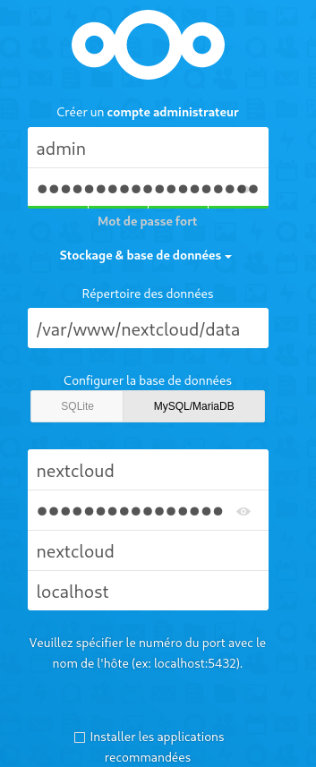{:width="200"} {:width="200"}  

Ne pas installer les applications recommandées  

INFO : Pour réinitialiser le mot de passe admin nextcloud

    sudo -u nextcloud php /var/www/nextcloud/occ user:resetpassword admin

### Configuration de la région 


**Votre installation n’a pas de préfixe de région par défaut.** , ajouter `'default_phone_region' => 'FR',` dans le  le fichier `/var/www/nextcloud/config/config.php` ou exécuter la commande suivante   
Configuration de la région par défaut pour les numéros de téléphone

    sudo -u nextcloud php /var/www/nextcloud/occ config:system:set default_phone_region --value="FR"

*System config value default_phone_region set to string FR*

### Authentification 2FA

[Authentification à deux facteurs](/posts/Nextcloud22_Nginx_PHP8-FPM_MariaDB_SSL-TLS/#authentification-%C3%A0-deux-facteurs)  
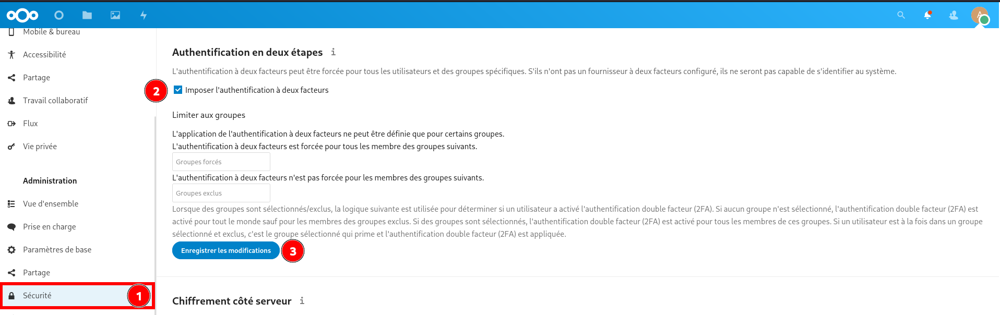  
Aller ensuite dans "Paramètres &rarr; Applications Sécurité"  
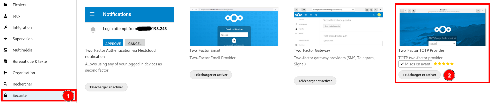  
Aller ensuite dans "Paramètres &rarr; Personnel Sécurité" et **Activer les mots de passe à usage unique (TOTP)** 
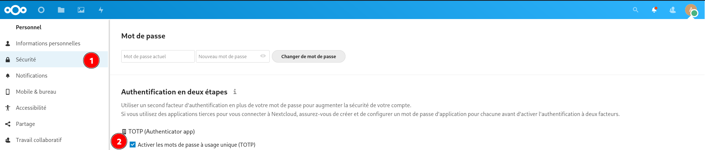  
Ensuite saisr la "clé secrète" dans le générateur de code TOTP (andOTP, keepass, etc...) et valider l'activation 2FA  
Pour terminer , **Générer des codes de récupération** .Veuillez les sauvegarder et/ou les imprimer car vous ne pourrez plus y avoir accès ultérieurement  


### Thème, Apparence, Messagerie et Stockage

Un thème sombre basé sur **Breeze Dark**    
Aller dans "Applications &rarr; Personnalisation"  
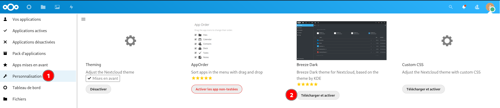  
Aller ensuite dans "Paramètres Administration &rarr; Personnaliser l'apparence"  

Logo : ym.png  
Image de connexion : coucher-de-soleil-sur-le-lac_1920x1080-optim.jpg  
Logo d'entête : ym01.png  
Favicon : yannick-white.svg  
  

**Thème**  
Activer Breeze-dark au préalable dans Paramètres -> Applications  
  

Personnel &rarr; Informations personnelles  
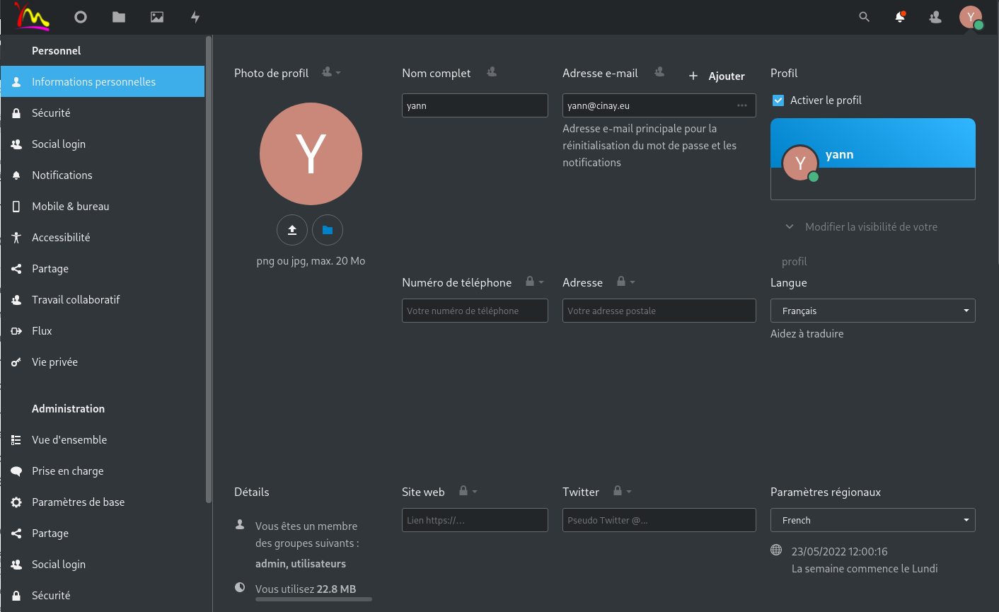  

**Messagerie**  
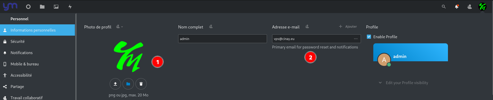  


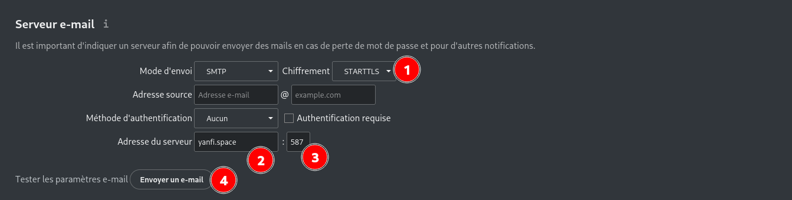  
Lancer le test  
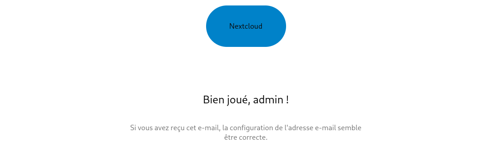  

**Stockage externe** (paramétrage en admin)  
Applications , activer external storage support  
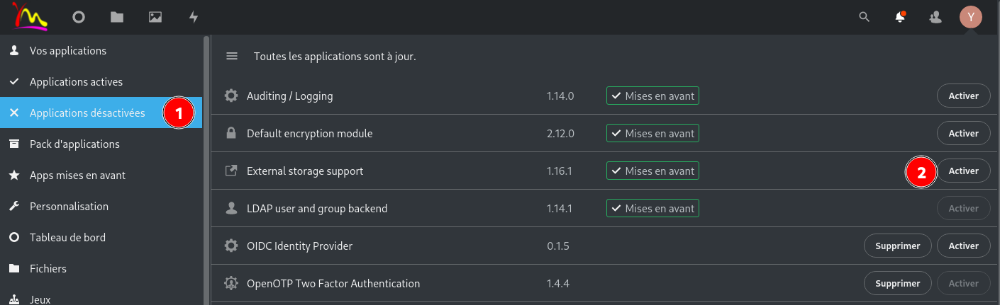  

Paramètres &rarr; Administration Stockage externe  
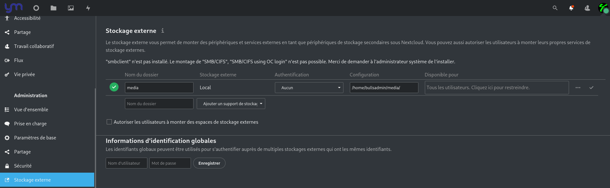  


### Cache de données : APCu & Redis 

*APCu permet notamment de mettre en cache les variables PHP et de les stocker en mémoire vive. Redis est un système de gestion de base de données NoSQL avec un système de clef-valeur scalable (s’adapte à la charge). Une des principales caractéristiques de Redis est de conserver l’intégralité des données en RAM. Cela permet d’obtenir d’excellentes performances en évitant les accès disques, particulièrement coûteux.*  
[How To Install and Secure Redis on Ubuntu 18.04](https://www.digitalocean.com/community/tutorials/how-to-install-and-secure-redis-on-ubuntu-18-04)

Installez les paquets APCu et Redis :

	sudo apt install php8.0-apcu redis-server php8.0-redis 

Il faut ajouter `apc.enable_cli=1` au fichier `/etc/php/8.0/mods-available/apcu.ini` 

```
extension=apcu.so
apc.enable_cli=1
```

Ajoutez les lignes suivantes dans le fichier /var/www/nextcloud/config/config.php :

	sudo nano /var/www/nextcloud/config/config.php

```
  'memcache.local' => '\OC\Memcache\APCu',
  'memcache.locking' => '\OC\Memcache\Redis',
  'memcache.local' => '\OC\Memcache\Redis',
  'redis' => array(
     'host' => 'localhost',
     'port' => 6379,
     'timeout' => 0.0,
     'password' => '',
  ),
```


*    La directive filelocking.enabled sert à activer le verrouillage de fichier transactionnel, et nous précisons ensuite que c'est Redis qui assure cette fonction au travers de la directive memcache.locking.
*    La directive memcache.local sert à préciser que Redis gère le cache
*    Le bloc de configuration "redis" avec les directives host, port, timeout et password sert à indiquer la configuration de notre redis. Pour passer en mode socket, il faudrait indiquer le chemin vers le socket à la place de localhost. Pour le moment, laissez la valeur mot de passe vide.

La nouvelle configuration sera prise en compte après redémarrage du service PHP-FPM :

	sudo systemctl restart php8.0-fpm.service

Se connecter "admin" &rarr; Paramétrage &rarr; Administration : Vue d'ensemble
Si tout est bien paramétré , voici le message   
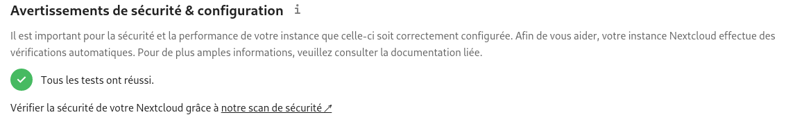{:width="600"}


### Travaux cron

Vous pouvez programmer des tâches cron de trois façons : en utilisant **AJAX**, **Webcron** ou **cron**. La méthode par défaut consiste à utiliser AJAX. <u>Cependant, la méthode recommandée est d'utiliser **cron**</u>. 

Si systemd est installé sur le système, un timer systemd peut être une alternative à un cronjob.

Cette approche nécessite deux fichiers : `nextcloudcron.service` et `nextcloudcron.timer`  
Créez ces deux fichiers dans `/etc/systemd/system/` 

`/etc/systemd/system/nextcloudcron.service` doit ressembler à ceci :

```
[Unit]
Description=Nextcloud cron.php job

[Service]
User=nextcloud
ExecStart=/usr/bin/php -f /var/www/nextcloud/cron.php
KillMode=process
```

Remplacez l'utilisateur `User` par l'utilisateur de votre serveur http (**www-data** si ce n'est pas **nextcloud**) et `/var/www/nextcloud/cron.php` par l'emplacement de cron.php dans votre répertoire nextcloud.

Le paramètre `KillMode=process` est nécessaire pour que les programmes externes qui sont lancés par la tâche cron continuent à fonctionner après la fin de la tâche cron.

Notez que le fichier **.service** unit n'a pas besoin d'une section `[Install]`. Veuillez vérifier votre installation car nous l'avons recommandé dans les versions précédentes de ce manuel d'administration.

Le fichier `/etc/systemd/system/nextcloudcron.timer` devrait ressembler à ceci :

```
[Unit]
Description=Run Nextcloud cron.php every 5 minutes

[Timer]
OnBootSec=5min
OnUnitActiveSec=5min
Unit=nextcloudcron.service

[Install]
WantedBy=timers.target
```

Les parties importantes de l'unité de minuterie sont **OnBootSec** et **OnUnitActiveSec**. **OnBootSec** démarre la minuterie 5 minutes après le démarrage, sinon vous devriez la démarrer manuellement après chaque démarrage. **OnUnitActiveSec** déclenchera une minuterie de 5 minutes après la dernière activation de l'unité de service.

Maintenant, tout ce qui reste à faire est de démarrer et d'activer le minuteur en exécutant cette commande :

    systemctl enable --now nextcloudcron.timer

Lorsque l'option `--now` est utilisée avec enable, l'unité respective sera également démarrée.

Note : Il n'est pas obligatoire de sélectionner l'option Cron dans le menu d'administration pour les travaux en arrière-plan, car une fois que cron.php est exécuté à partir de la ligne de commande ou du service cron, il sera automatiquement réglé sur Cron.  
{:width="600"}
{: .prompt-info }

Vérifier

    systemctl list-timers

```
NEXT                        LEFT           LAST                        PASSED       UNIT                         ACTIVATES
Fri 2021-12-24 15:53:31 UTC 4min 5s left   Fri 2021-12-24 15:48:31 UTC 54s ago      nextcloudcron.timer          nextcloudcron.service
```

### Stockage externe

{:width="600"}  
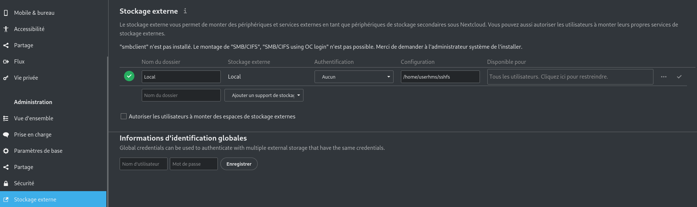{:width="600"}

### Optimiser MariaDB (Facultatif)

Edition du fichier mysql.cnf 

    sudo nano /etc/mysql/mariadb.conf.d/50-server.cnf

section mysqld

```
[mysqld]
innodb_buffer_pool_size=512M
innodb_io_capacity=4000


transaction_isolation = READ-COMMITTED
binlog_format = ROW
```

Redémarrer MariaDB 

    sudo systemctl restart mariadb.service

### Changement mot de passe

**Nouveau mot de passe utilisateur en ligne de commande**   

    php occ user:resetpassword NOM_UTILISATEUR

Exemple, changer le mot de passe administrateur

    php occ user:resetpassword admin

### Documentation

* [Configuring a MySQL or MariaDB database](https://docs.nextcloud.com/server/latest/admin_manual/configuration_database/linux_database_configuration/#configuring-a-mysql-or-mariadb-database)
* [Enable PHP OPcache](https://docs.nextcloud.com/server/latest/admin_manual/installation/server_tuning/#enable-php-opcache)
* [Memory Caching](https://docs.nextcloud.com/server/latest/admin_manual/configuration_server/caching_configuration/)
* [uploading big files > 512MB](https://docs.nextcloud.com/server/latest/admin_manual/configuration_files/big_file_upload_configuration/)


