+++
title = 'Nginx compilé, PHP8.1, MariaDB, Nextcloud Hub et certificats Let's Encrypt'
date = 2022-05-19 00:00:00 +0100
categories = ['nextcloud']
+++
*Nextcloud est un logiciel libre de site d'hébergement de fichiers et une plateforme de collaboration ([Wikipédia](https://fr.wikipedia.org/wiki/Nextcloud))*

- [Nginx PHP8.1 MariaDb](#nginx-php81-mariadb)
    - [Nginx compilé](#nginx-compilé)
    - [PHP8.1](#php81)
    - [MariaDB](#mariadb)
- [Certificats Let's Encrypt](#certificats-lets-encrypt)
    - [acme.sh](#acmesh)
    - [Générer certificats xoyize.xy](#générer-certificats-xoyizexy)
    - [Installation des certificats](#installation-des-certificats)
    - [Renouvellement des certificats](#renouvellement-des-certificats)
- [Nextcloud](#nextcloud)
    - [Base de données mysql](#base-de-données-mysql)
        - [Création base nextcloud](#création-base-nextcloud)
    - [Installer nextcloud](#installer-nextcloud)
        - [Téléchargement](#téléchargement)
        - [Utilisateur nextcloud et droits](#utilisateur-nextcloud-et-droits)
        - [PHP8.1 - Pool php-fpm](#php81---pool-php-fpm)
        - [cloud.xoyize.xyz](#cloudxoyizexyz)
    - [Paramétrage](#paramétrage)
        - [Créer compte administrateur](#créer-compte-administrateur)
        - [Cache PHP (OPcache)](#cache-php-opcache)
        - [PHP Cache de données (APCu & Redis)](#php-cache-de-données-apcu-redis)
        - [Tâches de fond Nextcloud](#tâches-de-fond-nextcloud)
        - [Ajouter un utilisateur](#ajouter-un-utilisateur)
        - [Thème, Apparence et Stockage](#thème-apparence-et-stockage)
    - [Authentification](#authentification)
        - [OIDC Identity Provider](#oidc-identity-provider)
        - [Deux facteurs par email (NON UTILISEE)](#deux-facteurs-par-email-non-utilisee)

Nextcloud

* Stockage sécurisé (chiffrage des fichiers) et ajout de services externes (Amazon, Google, Dropbox, NFS, FTP, SFTP, WebDAV...)
* Authentification LDAP/Active Directory, Kerberos et Shibboleth/SAML 2.0
* Partage de fichiers entre utilisateurs ou publiquement
* Éditeur de documents en ligne avec la suite Collabora Online (basée sur OpenOffice)
* Visionneuse de documents en ligne (PDF, Open document...)
* Gestion de différents workflows
* Calendrier (CalDAV) et gestionnaire de contacts (CardDAV)
* Conférences audio et vidéo sécurisées (WebRTC) avec possibilité de partage d'écran
* Galerie d'images
* ... et de nombreuses fonctionnalités supplémentaires grâce aux applications Nextcloud.  
* [Ubuntu 22.04 - Installation de Nextcloud 24 (Hub II) avec Nginx, PHP7-FPM, MariaDB et SSL/TLS ](https://ubuntu.self-hosted.fr/installation-nextcloud-nginx-php7-mariadb/#5_-_Les_modules_PHP)*

Nextcloud Hub 24 (Nouveautés) 

* Migration des utilisateurs
    * La migration des utilisateurs vous permet d’exporter vos données de Nextcloud via une archive unique pour les exporter dans une autre instance de Nextcloud, même si elle est auto-hébergée. Tout y est, des paramètres aux fichiers en passant par les favoris et les calendriers.
* Sécurité des fichiers
    * Le gestionnaire des fichiers propose de spécifier les autorisations de modification, de suppression et de téléchargement dans les dossiers partagés. Le partage par e-mail avec un mot de passe peut être configuré pour ne pas s’appuyer sur un mot de passe prédéfini, avec un jeton temporaire.  
Enfin, Nextcloud Files introduit une API de recherche d’entreprise, qui permet au contenu de Nextcloud d’être indexé par un outil de recherche tiers.
* Mail et agenda plus à la page
    * C’était un peu le parent pauvre des versions antérieures, Nextcloud Groupware propose un grand nombre d’améliorations dans cette version, notamment au niveau du gestionnaire de courrier électronique : on peut annuler un envoi ou encore définir le moment de l’envoi du message (Send Later), deux fonctions très utilisées dans Gmail.  
    * L’application Calendrier affiche désormais une mention "accepter/refuser" pour les invitations pour pouvoir modifier votre statut directement dans l’interface Web.
    * Nextcloud Talk améliore nettement ses performances et introdouit de fonctionnalités interactives comme les réactions (notamment grâce aux emojis). Un onglet médias permet de rechercher et de voir tous les fichiers médias partagés dans une discussion.
* NextCloud Office : des onglets  
    * La suite Nextcloud Office, développée avec Collabora (sur base de LibreOffice), fait un grand pas en avant dans cette version, en introduisant une nouvelle interface de menu à onglets. Pour faciliter la collaboration, la fonction de verrouillage des fichiers existante autorise désormais le verrouillage automatique par les applications Office (Text, Collabora Online) pendant l’édition.
* Une importante mise à jour de Nextcloud Text, l’éditeur de texte collaboratif, introduit des tableaux, des "Infoboxes", le téléchargement direct d’images et l’autocomplétion des emojis.

## Nginx PHP8.1 MariaDb

### Nginx compilé

  

Utilisateur avec droits sudo  

Télécharger le bash

```
wget https://static.xoyaz.xyz/files/compilation-nginx-tls1.3.sh
chmod +x compilation-nginx-tls1.3.sh # rendre le bash exécutable
./compilation-nginx-tls1.3.sh        # exécution
```

A la fin de la compilation

```
Versions Nginx OpenSSL
nginx version: nginx/1.20.2
OpenSSL 1.1.1n  15 Mar 2022
```

### PHP8.1

  

Ajout du dépôt sury.org

    sudo -s

Pour installer la version de 8 de php, ajouter le dépôt sury.

```bash
apt install -y lsb-release apt-transport-https ca-certificates wget
wget -O /etc/apt/trusted.gpg.d/php.gpg https://packages.sury.org/php/apt.gpg
echo "deb https://packages.sury.org/php/ $(lsb_release -sc) main" |tee /etc/apt/sources.list.d/php.list
```

Mise à jour des dépôts :

    apt update && apt upgrade -y

Installation de php8.1, php8.1-fpm, php8.1-sqlite3 et les paquets PHP nécessaires à nextcloud

    apt -y install php8.1 php8.1-fpm php8.1-sqlite3 php8.1-cli php8.1-gd php8.1-imap php8.1-mysql php8.1-soap php8.1-apcu php8.1-common php8.1-gmp  php8.1-intl php8.1-opcache php8.1-xml php8.1-curl php8.1-igbinary php8.1-readline  php8.1-zip php8.1-bcmath php8.1-imagick php8.1-mbstring php8.1-redis imagemagick libmagickcore-6.q16-6-extra

>**libmagickcore-6.q16-6-extra** pour le SVG

### MariaDB

  
installer les paquets de MariaDB

    sudo apt install mariadb-server

Une fois que l'installation des composants est terminée, tapez la commande suivante pour finaliser la configuration.

    sudo mysql_secure_installation

Tapez Enter directement à la première question car le mot de passe de l'utilisateur root de MariaDB est vide par défaut après l'installation.  
Puis répondez Y à la question suivante pour spécifier le mot de passe de l'utilisateur root de MariaDB qui, une fois de plus, est différent de l'utilisateur root de votre Debian.  
Cet utilisateur root de la base de données aura tous les droits d'accès. Pour des raisons évidentes de sécurité, je vous recommande d'utiliser un mot de passe complexe !  
Et vous pouvez répondre Y à toutes les questions suivantes: les connexions anonymes seront désactivées, ainsi que les connexions root qui se font depuis un serveur autre que le votre...  

## Certificats Let's Encrypt 


### acme.sh

Installation gestionnaire des certificats Let's Encrypt domaine xoyize.xyz

```bash
cd ~
sudo apt install socat # installé par défaut sur debian 11
git clone https://github.com/acmesh-official/acme.sh.git
cd acme.sh
./acme.sh --install 
```

Se déconnecter puis se reconnecter utilisateur  

Les clés OVH API   

    export OVH_AK="xxxxxxxxxxxxxxxxxx"
    export OVH_AS="yyyyyyyyyyyyyyyyyyyyyyyyyyyy"

### Générer certificats xoyize.xy  

    acme.sh --dns dns_ovh --server letsencrypt --issue --keylength ec-384 -d 'xoyize.xyz' -d '*.xoyize.xyz'

```
[...]
[mar. 22 févr. 2022 15:23:38 CET] Please open this link to do authentication: https://eu.api.ovh.com/auth/?credentialToken=vIuaavkgBGdip2UEPjSev9WhruI2REfzawQy31tV7mkOAVnj5NQUwD0XKUFKbaI1
[...]
```

Après authentification relancer la commande

Résultat de l'installation

```
[Thu 12 May 2022 10:34:09 PM CEST] Your cert is in: /home/xoyan//.acme.sh/xoyize.xyz_ecc/xoyize.xyz.cer
[Thu 12 May 2022 10:34:09 PM CEST] Your cert key is in: /home/xoyan//.acme.sh/xoyize.xyz_ecc/xoyize.xyz.key
[Thu 12 May 2022 10:34:09 PM CEST] The intermediate CA cert is in: /home/xoyan//.acme.sh/xoyize.xyz_ecc/ca.cer
[Thu 12 May 2022 10:34:09 PM CEST] And the full chain certs is there: /home/xoyan//.acme.sh/xoyize.xyz_ecc/fullchain.cer
```

### Installation des certificats

```
sudo mkdir -p /etc/ssl/private/
sudo chown $USER -R /etc/ssl/private/
acme.sh --ecc --install-cert -d 'xoyize.xyz' -d '*.xoyize.xyz' --key-file /etc/ssl/private/xoyize.xyz-key.pem --fullchain-file /etc/ssl/private/xoyize.xyz-fullchain.pem  --reloadcmd 'sudo systemctl reload nginx.service'
```

Résultat

```
[Thu 12 May 2022 10:34:47 PM CEST] Installing key to: /etc/ssl/private/xoyize.xyz-key.pem
[Thu 12 May 2022 10:34:47 PM CEST] Installing full chain to: /etc/ssl/private/xoyize.xyz-fullchain.pem
[Thu 12 May 2022 10:34:47 PM CEST] Run reload cmd: sudo systemctl reload nginx.service
[Thu 12 May 2022 10:34:47 PM CEST] Reload success
```

Supprimer ` --reloadcmd 'sudo systemctl reload nginx.service'` à la ligne précédente si Nginx n'est pas installé
{: .prompt-warning }

### Renouvellement des certificats

Editer le crontab, supprimer la ligne existante et ajouter ce qui suit

    crontab -e

```bash
2 0 * * * "/home/xoyan/.acme.sh"/acme.sh --cron --home "/home/xoyan/.acme.sh" --renew-hook "/home/xoyan/.acme.sh/acme.sh --ecc --install-cert -d 'xoyize.xyz' -d '*.xoyize.xyz' --key-file /etc/ssl/private/xoyize.xyz-key.pem --fullchain-file /etc/ssl/private/xoyize.xyz-fullchain.pem  --reloadcmd 'sudo systemctl reload nginx.service'" > /dev/null
```

## Nextcloud

  

### Base de données mysql

Mot de passe base nextcloud

    tr -cd '[:alnum:]' < /dev/urandom | fold -w16 | head -n1 

#### Création base nextcloud

Tout comme pour la gestion du répertoire nextcloud et pour plus de sécurité, vous allez tout d'abord créer un utilisateur MySQL **nextcloud** dédié à la base de données nextcloud, renseigner un mot de passe et ensuite lui donner les droits sur cette base de données.

```bash
sudo mysql -uroot -e 'CREATE DATABASE nextcloud; CREATE USER "nextcloud"@"localhost"; SET password FOR "nextcloud"@"localhost" = password("mot_passe_base_nextcloud"); GRANT ALL PRIVILEGES ON nextcloud.* TO "nextcloud"@"localhost" IDENTIFIED BY "mot_passe_base_nextcloud"; FLUSH PRIVILEGES;'
```

### Installer nextcloud

#### Téléchargement 

On télécharge Nextcloud 

    cd /var/www
    sudo wget https://download.nextcloud.com/server/releases/latest.tar.bz2

Télécharger le SHA256 

    sudo wget https://download.nextcloud.com/server/releases/latest.tar.bz2.sha256

Vérifier l'intégrité de l'archive téléchargée 

    sha256sum -c latest.tar.bz2.sha256 < latest.tar.bz2

Doit donner le résultat suivant : **latest.tar.bz2: OK**

Décompresser l'archive Nextcloud :

    sudo tar -xvf latest.tar.bz2

Supprimez les fichiers et signatures téléchargés :

    sudo rm latest.tar.bz2*

#### Utilisateur nextcloud et droits

Lors du déploiement basique d’un serveur HTTP, l’utilisateur sous lequel fonctionne ce serveur (Apache, Nginx...) est la plupart du temps www-data, nobody ou apache. Cela signifie que si plusieurs sites existent sous la même instance de Nginx, tous utilisent le même utilisateur. Or si l’un des sites s’avère corrompu par un utilisateur malveillant alors l’assaillant peut profiter pleinement de tous les droits de l’utilisateur sous lequel tourne le serveur web. Tous les sites s'avèrent donc vulnérables.

Pour des raisons évidentes de sécurité, il est donc recommandé de cloisonner ces utilisateurs et d'avoir un utilisateur dédié à la gestion du dossier nextcloud. Cet utilisateur aura des droits aussi restreints que possible à ce répertoire.
Par défaut, les fichiers de Nextcloud possèdent les permissions suivantes :

*    répertoires : 755 (permission de lecture, d'écriture et d'exécution pour le propriétaire et permission de lecture et d'exécution pour le groupe et les autres)
*    fichiers : 644 (permission de lecture et d'écriture pour le propriétaire et permission de lecture uniquement pour le groupe et les autres).

Nous allons donc modifier le propriétaire du répertoire `/var/www/nextcloud` et l'attribuer à un nouvel utilisateur dédié : **nextcloud** 

Par ailleurs, Nginx est lancé sous l'utilisateur **www-data** et doit avoir accès en lecture au répertoire `/var/www/nextcloud` pour lire les ressources statiques (HTML, CSS, JS, etc.). Nous allons donc attribuer le répertoire `/var/www/nextcloud` au groupe **www-data**. Enfin nous retirerons toutes les permissions de ce répertoire aux autres utilisateurs.

Créez un utilisateur nextcloud 

    sudo useradd -r nextcloud

Modifiez le propriétaire et le groupe du répertoire /var/www/nextcloud :

    sudo chown -R nextcloud:www-data /var/www/nextcloud

Retirez toutes les permissions aux autres utilisateurs :

    sudo chmod -R o-rwx /var/www/nextcloud

#### PHP8.1 - Pool php-fpm

*Le module PHP-FPM permet la communication entre le serveur Nginx et PHP*

Création du pool nextcloud `/etc/php/7.4/fpm/pool.d/nextcloud.conf`

    sudo nano /etc/php/8.1/fpm/pool.d/nextcloud.conf 

```
[nextcloud]
listen = /run/php/nextcloud.sock

listen.owner = nextcloud
listen.group = www-data

user = nextcloud
group = www-data

pm = ondemand
pm.max_children = 40
pm.process_idle_timeout = 60s
pm.max_requests = 500

env[HOSTNAME] = $HOSTNAME
env[PATH] = /usr/local/bin:/usr/bin:/bin
env[TMP] = /tmp
env[TMPDIR] = /tmp
env[TEMP] = /tmp
```

Lancer ou redémarrer le service php-fpm

    sudo systemctl start php8.1-fpm
    sudo systemctl restart php8.1-fpm

#### cloud.xoyize.xyz 

Nexcloud sur le domaine cloud.xoyize.xyz avec certificats Let's Encrypt

Le fichier de configuration web `cloud.xoyize.xyz.conf`

    sudo nano /etc/nginx/conf.d/cloud.xoyize.xyz.conf

```
upstream php-handler {
    server unix:/var/run/php/nextcloud.sock;
}

server {
    listen 80;
    listen [::]:80;
    server_name cloud.xoyize.xyz;
    # enforce https
    return 301 https://$server_name:443$request_uri;
}

server {
    listen 443 ssl http2;
    listen [::]:443 ssl http2;
    server_name cloud.xoyize.xyz;

    # Use Mozilla's guidelines for SSL/TLS settings
    # https://mozilla.github.io/server-side-tls/ssl-config-generator/
    # NOTE: some settings below might be redundant
    ssl_certificate /etc/ssl/private/xoyize.xyz-fullchain.pem;
    ssl_certificate_key /etc/ssl/private/xoyize.xyz-key.pem;

    # TLS 1.3 only
    ssl_protocols TLSv1.3;
    ssl_prefer_server_ciphers off;
 
    # HSTS (ngx_http_headers_module is required) (63072000 seconds)
    add_header Strict-Transport-Security "max-age=63072000" always;
 
	# Virtual Host Configs
	include /etc/nginx/conf.d/xoyize.xyz.d/*.conf;

    # OCSP stapling
    ssl_stapling on;
    ssl_stapling_verify on;
 
    # verify chain of trust of OCSP response using Root CA and Intermediate certs
    ssl_trusted_certificate /etc/ssl/private/xoyize.xyz-fullchain.pem;
 
    # replace with the IP address of your resolver
    resolver 127.0.0.1;


    # Add headers to serve security related headers
    # Before enabling Strict-Transport-Security headers please read into this
    # topic first.
    #add_header Strict-Transport-Security "max-age=15768000; includeSubDomains; preload;" always;
    #
    # WARNING: Only add the preload option once you read about
    # the consequences in https://hstspreload.org/. This option
    # will add the domain to a hardcoded list that is shipped
    # in all major browsers and getting removed from this list
    # could take several months.
    add_header Referrer-Policy "no-referrer" always;
    add_header X-Content-Type-Options "nosniff" always;
    add_header X-Download-Options "noopen" always;
    add_header X-Frame-Options "SAMEORIGIN" always;
    add_header X-Permitted-Cross-Domain-Policies "none" always;
    add_header X-Robots-Tag "none" always;
    add_header X-XSS-Protection "1; mode=block" always;

    # Remove X-Powered-By, which is an information leak
    fastcgi_hide_header X-Powered-By;

    # Path to the root of your installation
    root /var/www/nextcloud;

    location = /robots.txt {
        allow all;
        log_not_found off;
        access_log off;
    }

    # The following 2 rules are only needed for the user_webfinger app.
    # Uncomment it if you're planning to use this app.
    #rewrite ^/.well-known/host-meta /public.php?service=host-meta last;
    #rewrite ^/.well-known/host-meta.json /public.php?service=host-meta-json last;

    # The following rule is only needed for the Social app.
    # Uncomment it if you're planning to use this app.
    #rewrite ^/.well-known/webfinger /public.php?service=webfinger last;

    location = /.well-known/carddav {
      return 301 $scheme://$host:$server_port/remote.php/dav;
    }
    location = /.well-known/caldav {
      return 301 $scheme://$host:$server_port/remote.php/dav;
    }

    # Anything else is dynamically handled by Nextcloud
    location ^~ /.well-known            { return 301 /index.php$uri; }

    # set max upload size
    client_max_body_size 512M;
    fastcgi_buffers 64 4K;

    # Enable gzip but do not remove ETag headers
    gzip on;
    gzip_vary on;
    gzip_comp_level 4;
    gzip_min_length 256;
    gzip_proxied expired no-cache no-store private no_last_modified no_etag auth;
    gzip_types application/atom+xml application/javascript application/json application/ld+json application/manifest+json application/rss+xml application/vnd.geo+json application/vnd.ms-fontobject application/x-font-ttf application/x-web-app-manifest+json application/xhtml+xml application/xml font/opentype image/bmp image/svg+xml image/x-icon text/cache-manifest text/css text/plain text/vcard text/vnd.rim.location.xloc text/vtt text/x-component text/x-cross-domain-policy;

    # Uncomment if your server is build with the ngx_pagespeed module
    # This module is currently not supported.
    #pagespeed off;

    location / {
        rewrite ^ /index.php;
    }

    location ~ ^\/(?:build|tests|config|lib|3rdparty|templates|data)\/ {
        deny all;
    }
    location ~ ^\/(?:\.|autotest|occ|issue|indie|db_|console) {
        deny all;
    }

    location ~ ^\/(?:index|remote|public|cron|core\/ajax\/update|status|ocs\/v[12]|updater\/.+|oc[ms]-provider\/.+|.+\/richdocumentscode\/proxy)\.php(?:$|\/) {
        fastcgi_split_path_info ^(.+?\.php)(\/.*|)$;
        set $path_info $fastcgi_path_info;
        try_files $fastcgi_script_name =404;
        include fastcgi_params;
        fastcgi_param SCRIPT_FILENAME $document_root$fastcgi_script_name;
        fastcgi_param PATH_INFO $path_info;
        fastcgi_param HTTPS on;
        # Avoid sending the security headers twice
        fastcgi_param modHeadersAvailable true;
        # Enable pretty urls
        fastcgi_param front_controller_active true;
        fastcgi_pass php-handler;
        fastcgi_intercept_errors on;
        fastcgi_request_buffering off;
    }

    location ~ ^\/(?:updater|oc[ms]-provider)(?:$|\/) {
        try_files $uri/ =404;
        index index.php;
    }

    # Adding the cache control header for js, css and map files
    # Make sure it is BELOW the PHP block
    location ~ \.(?:css|js|woff2?|svg|gif|map)$ {
        try_files $uri /index.php$request_uri;
        add_header Cache-Control "public, max-age=15778463";
        # Add headers to serve security related headers (It is intended to
        # have those duplicated to the ones above)
        # Before enabling Strict-Transport-Security headers please read into
        # this topic first.
        #add_header Strict-Transport-Security "max-age=15768000; includeSubDomains; preload;" always;
        #
        # WARNING: Only add the preload option once you read about
        # the consequences in https://hstspreload.org/. This option
        # will add the domain to a hardcoded list that is shipped
        # in all major browsers and getting removed from this list
        # could take several months.
        add_header Referrer-Policy "no-referrer" always;
        add_header X-Content-Type-Options "nosniff" always;
        add_header X-Download-Options "noopen" always;
        add_header X-Frame-Options "SAMEORIGIN" always;
        add_header X-Permitted-Cross-Domain-Policies "none" always;
        add_header X-Robots-Tag "none" always;
        add_header X-XSS-Protection "1; mode=block" always;

        # Optional: Don't log access to assets
        access_log off;
    }

    location ~ \.(?:png|html|ttf|ico|jpg|jpeg|bcmap|mp4|webm)$ {
        try_files $uri /index.php$request_uri;
        # Optional: Don't log access to other assets
        access_log off;
    }
}

```

Vérifier et recharger nginx

    sudo nginx -t
    sudo systemctl reload nginx

### Paramétrage

Ouvrir le lien  <https://cloud.xoyize.xyz> dans un navigateur  

#### Créer compte administrateur

Créer un compte administrateur et son mot de passe
admin 
Saisir les informations sur la base , utilisateur et mot de passe   
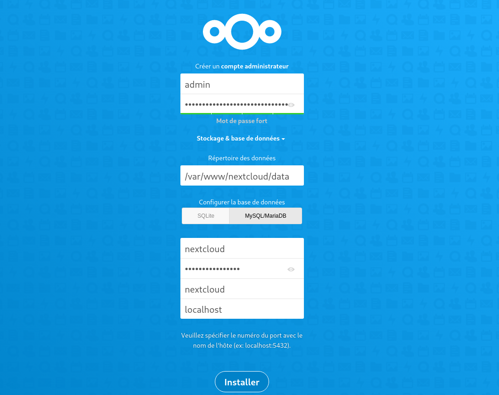{:width="500"}  
Ne pas installer les applications recommandées  
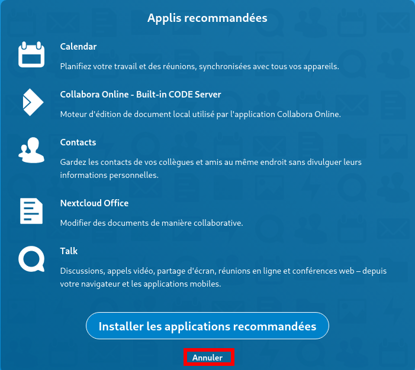{:width="400"}  
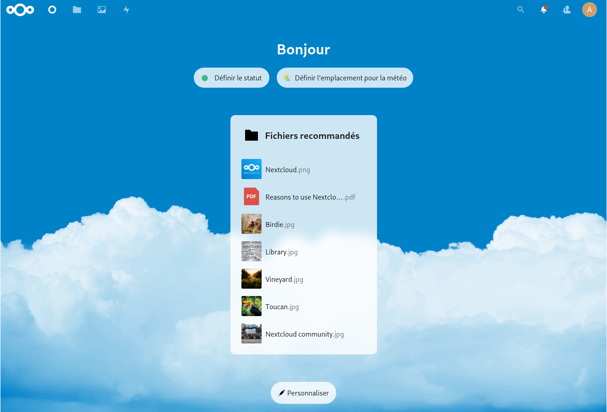  


Cliquer sur le A en haut à droite puis "Paramètres"  et "Vue d'ensemble"
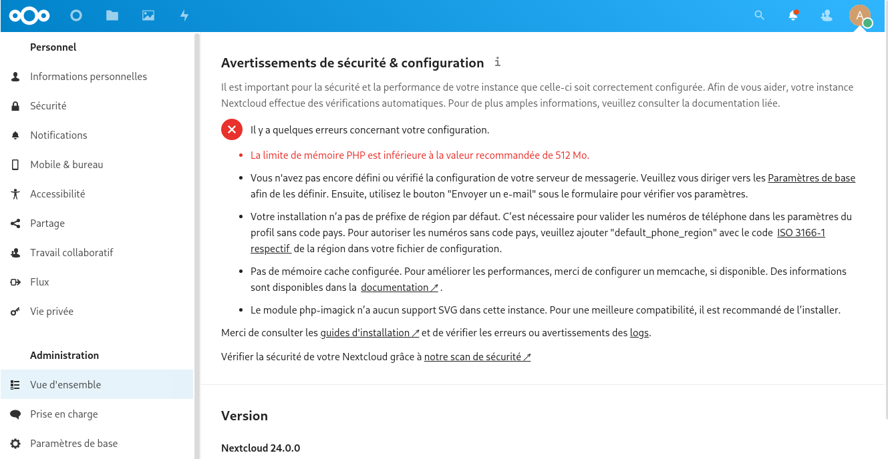  

**Votre installation n’a pas de préfixe de région par défaut.**  
ajouter `'default_phone_region' => 'FR',` dans le  le fichier `/var/www/nextcloud/config/config.php`   

**mémoire pour PHP**  
ajouter `memory_limit = 512M`  dans le fichier `/etc/php/8.1/fpm/php.ini`  

**Le module php-imagick n’a aucun support SVG dans cette instance.**  
installer la librairie `sudo apt install libmagickcore-6.q16-6-extra`

#### Cache PHP (OPcache)

OPcache (qui signifie Optimizer Plus Cache) est introduit depuis la version 5.5.0 de PHP. Il sert à cacher l’opcode de PHP, c’est-à-dire les instructions de bas niveau générées par la machine virtuelle PHP lors de l’exécution d’un script. Autrement dit, le code pré-compilé est stocké en mémoire. Cela évite ainsi l’étape de compilation à chaque requête PHP. De plus, OPcache va optimiser l’exécution du code afin d’en améliorer les performances.

Éditez le fichier /etc/php/8.1/fpm/php.ini,ajouter les lignes suivantes dans la section [opcache] :

sudo nano /etc/php/8.1/fpm/php.ini

Config avant modification

```
[opcache]
opcache.enable=1
opcache.enable_cli=1
opcache.interned_strings_buffer=8
opcache.max_accelerated_files=10000
opcache.memory_consumption=128
opcache.save_comments=1
opcache.revalidate_freq=1
```

Modifier le 23 mai 2022

```
[opcache]
opcache.enable=1
opcache.enable_cli=1
opcache.interned_strings_buffer=32
opcache.save_comments=1
opcache.max_wasted_percentage = 15
opcache.validate_timestamps = 1
opcache.revalidate_freq=1
```

La nouvelle configuration sera prise en compte après redémarrage du service PHP-FPM :

    sudo systemctl restart php8.1-fpm.service

#### PHP Cache de données (APCu & Redis) 

*APCu permet notamment de mettre en cache les variables PHP et de les stocker en mémoire vive. Redis est un système de gestion de base de données NoSQL avec un système de clef-valeur scalable (s’adapte à la charge). Une des principales caractéristiques de Redis est de conserver l’intégralité des données en RAM. Cela permet d’obtenir d’excellentes performances en évitant les accès disques, particulièrement coûteux.*

Installez les paquets APCu et Redis :

    sudo apt install php8.1-apcu redis-server php8.1-redis 

Il faut ajouter `apc.enable_cli=1` au fichier `/etc/php/8.1/mods-available/apcu.ini`

```
extension=apcu.so
apc.enable_cli=1
```

Ajoutez les lignes suivantes dans le fichier /var/www/nextcloud/config/config.php :

    sudo nano /var/www/nextcloud/config/config.php

```
  'filelocking.enabled' => true,
  'memcache.locking' => '\OC\Memcache\Redis',
  'memcache.local' => '\\OC\\Memcache\\APCu',
  'redis' => array(
    'host' => 'localhost',
    'port' => 6379,
    'timeout' => 0.0,
    'password' => '',
  ),
```

*    La directive filelocking.enabled sert à activer le verrouillage de fichier transactionnel, et nous précisons ensuite que c’est Redis qui assure cette fonction au travers de la directive memcache.locking.
*    La directive memcache.local sert à préciser que Redis gère le cache
*    Le bloc de configuration “redis” avec les directives host, port, timeout et password sert à indiquer la configuration de notre redis. Pour passer en mode socket, il faudrait indiquer le chemin vers le socket à la place de localhost. Pour le moment, laissez la valeur mot de passe vide.

La nouvelle configuration sera prise en compte après redémarrage du service PHP-FPM :

    sudo systemctl restart php8.1-fpm.service

**Configurer l'envoi de message par nextcloud**  
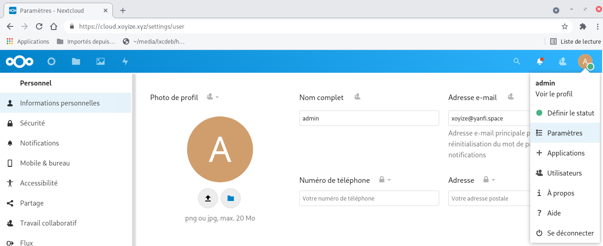  

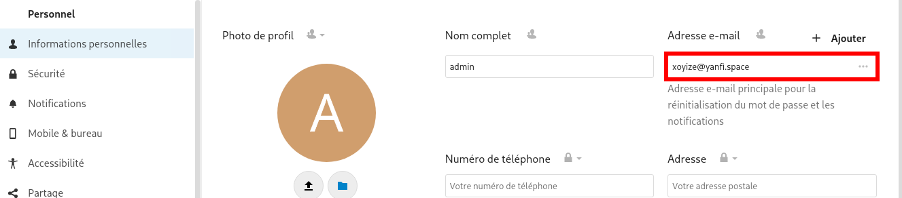  

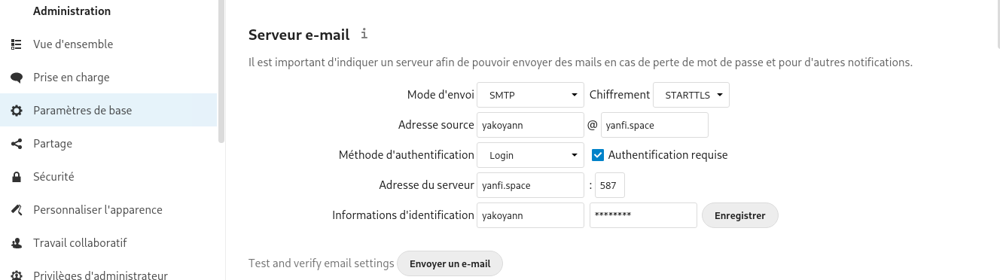  


#### Tâches de fond Nextcloud

Vous pouvez programmer des tâches cron de trois façons : en utilisant **AJAX**, **Webcron** ou **cron**. La méthode par défaut consiste à utiliser AJAX. <u>Cependant, la méthode recommandée est d'utiliser **cron**</u>. 

Si systemd est installé sur le système, un timer systemd peut être une alternative à un cronjob.

Cette approche nécessite deux fichiers : `nextcloudcron.service` et `nextcloudcron.timer`  
Créez ces deux fichiers dans `/etc/systemd/system/` 

`/etc/systemd/system/nextcloudcron.service` doit ressembler à ceci :

```
[Unit]
Description=Nextcloud cron.php job

[Service]
User=nextcloud
ExecStart=/usr/bin/php -f /var/www/nextcloud/cron.php
KillMode=process
```

Remplacez l'utilisateur `User` par l'utilisateur de votre serveur http (**www-data** si ce n'est pas **nextcloud**) et `/var/www/nextcloud/cron.php` par l'emplacement de cron.php dans votre répertoire nextcloud.

Le paramètre `KillMode=process` est nécessaire pour que les programmes externes qui sont lancés par la tâche cron continuent à fonctionner après la fin de la tâche cron.

Notez que le fichier **.service** unit n'a pas besoin d'une section `[Install]`. Veuillez vérifier votre installation car nous l'avons recommandé dans les versions précédentes de ce manuel d'administration.

Le fichier `/etc/systemd/system/nextcloudcron.timer` devrait ressembler à ceci :

```
[Unit]
Description=Run Nextcloud cron.php every 5 minutes

[Timer]
OnBootSec=5min
OnUnitActiveSec=5min
Unit=nextcloudcron.service

[Install]
WantedBy=timers.target
```

Les parties importantes de l'unité de minuterie sont **OnBootSec** et **OnUnitActiveSec**. **OnBootSec** démarre la minuterie 5 minutes après le démarrage, sinon vous devriez la démarrer manuellement après chaque démarrage. **OnUnitActiveSec** déclenchera une minuterie de 5 minutes après la dernière activation de l'unité de service.

Maintenant, tout ce qui reste à faire est de démarrer et d'activer le minuteur en exécutant cette commande :

    systemctl enable --now nextcloudcron.timer

Lorsque l'option `--now` est utilisée avec enable, l'unité respective sera également démarrée.

Note : Il n'est pas obligatoire de sélectionner l'option Cron dans le menu d'administration pour les travaux en arrière-plan, car une fois que cron.php est exécuté à partir de la ligne de commande ou du service cron, il sera automatiquement réglé sur Cron.  

{: .prompt-info }

Vérifier

    systemctl list-timers

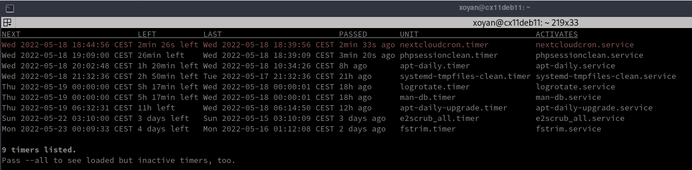

#### Ajouter un utilisateur

Se connecter en administrateur   
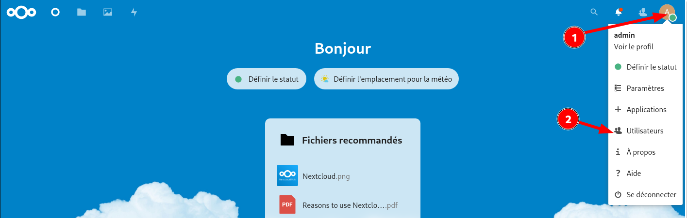  
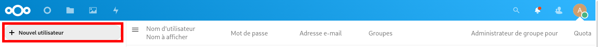  

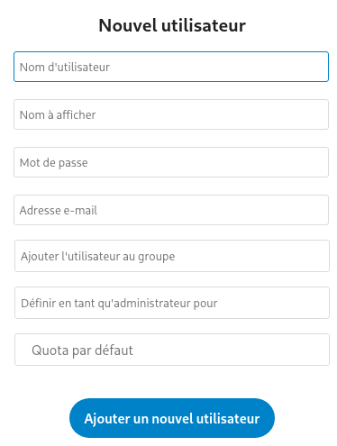{:width="300"}  
Renseigner les champs et cliquer sur "Ajouter un nouvel utilisateur"  

Se reconnecter avec l'utilisateur  
Il faut configurer via "Settings"  
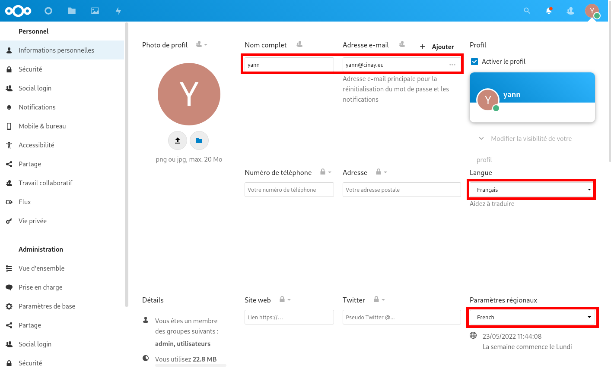  

#### Thème, Apparence et Stockage

Un thème sombre basé sur **Breeze Dark**    
Aller dans "Applications &rarr; Personnalisation"  
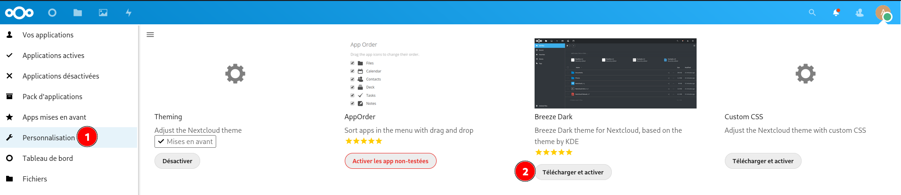  
Aller ensuite dans "Paramètres (Administration) &rarr; Personnaliser l'apparence"  

Logo : ym.png  
Image de connexion : coucher-de-soleil-sur-le-lac_1920x1080-optim.jpg  
Logo d'entête : ym01.png  
Favicon : yannick-white.svg  
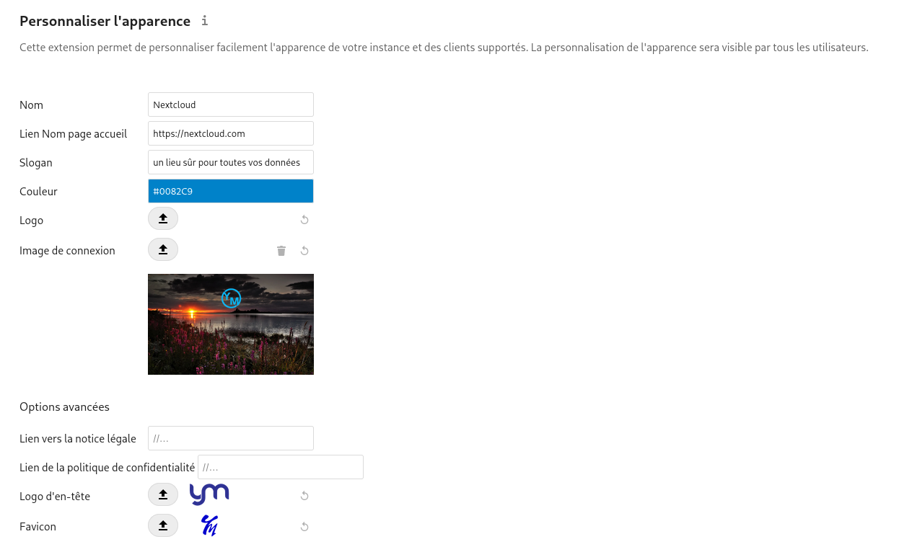  

**Thème**  
Activer Breeze-dark au préalable dans Paramètres -> Applications  
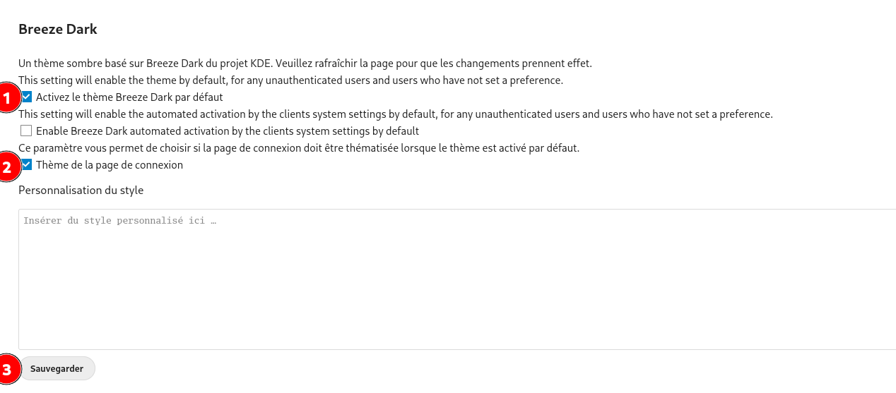  
Rafraîchir l'écran  

Personnel &rarr; Informations personnelles  
  

**Stockage externe** (paramétrage en admin)  
Applications , activer external storage support  
  

Paramètres &rarr; Administration Stockage externe  
  

### Authentification

#### OIDC Identity Provider

Nextcloud comme fournisseur d'identité OpenID Connect

Avec cette application, vous pouvez utiliser Nextcloud comme fournisseur d'identité OpenID Connect. Si d'autres services sont configurés correctement, vous êtes en mesure d'accéder à ces services avec votre login Nextcloud.

"Paramètres" --> "Applications" --> "Sécurité"  , installer et activer l' application **OIDC Identity Provider** 

Ensuite "Paramètres" --> "Sécurité"  
  

#### Deux facteurs par email (NON UTILISEE)

Il s'agit d'une application à installer sur un serveur Nextcloud. Cette application permet aux utilisateurs de configurer l'email comme second facteur pour les connexions web. <u>Elle nécessite qu'une adresse e-mail soit définie dans les paramètres personnels</u>. 

Elle ne peut actuellement pas être utilisée lors de la première connexion lorsque l'authentification à deux facteurs est appliquée (pas encore implémentée).

"Paramètres" --> "Applications" --> "Sécurité"  
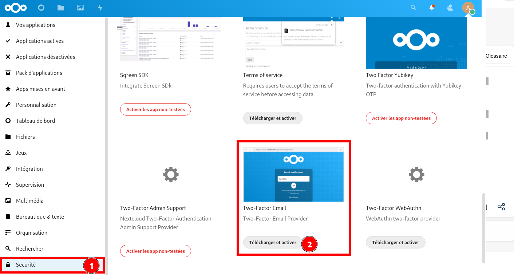  

**Activation**  
"Paramètres" --> --> "Sécurité" (rubrique Administration)  
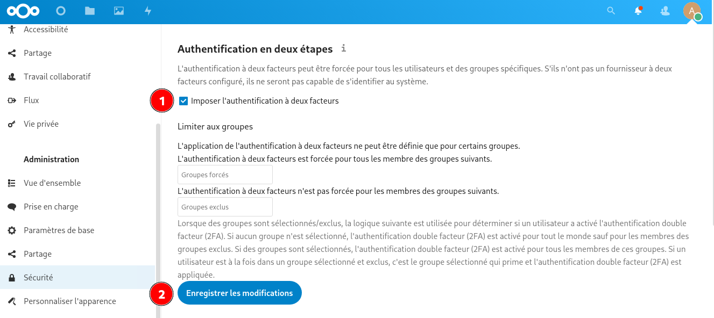  

"Paramètres" --> --> "Sécurité" (rubrique Personnel)  
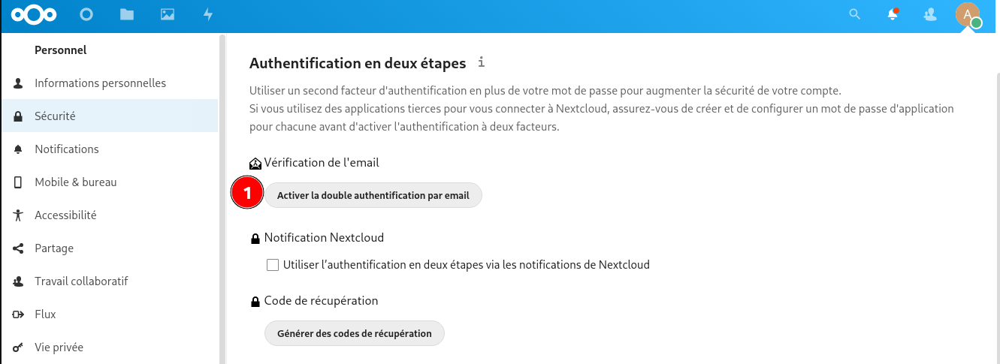  

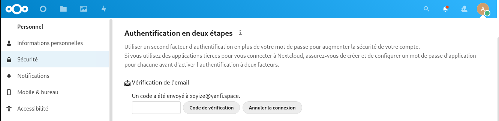  
Saisir le code et cliquer sur "Code vérification"

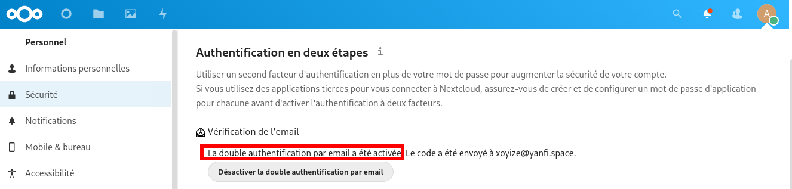  

NE PAS OUBLIER de générer des codes de récupération (messagerie HS)


