+++
title = 'Nextcloud authentification Keycloak'
date = 2022-05-21 00:00:00 +0100
categories = nextcloud authentification
+++
  
*[Keycloak](https://www.keycloak.org/) est un logiciel à code source ouvert permettant d'instaurer une méthode d'authentification unique à travers la gestion par identité et par accès.*

Keycloack est un projet OpenSource sponsorisé par RedHat. Il joue le rôle d’IAM (Identification And Access Management) pour permettre la mise en place de portail SSO par exemple.  
Keycloak est compatible avec les principaux standards d'authentification (dont OpenID-Connect, ce qui signifie qu'il est relativement simple d'intégration et d'installation). Il est également possible de l'intégrer à un domaine LDAP (interne ou externe).

## Keycloak

*Installation sur un serveur Debian 10 ou 11*

### Prérequis 

Ces conditions préalables existent pour l'installation du serveur Keycloak :

*    Peut fonctionner sur tout système d'exploitation qui exécute Java
*    Java 8 JRE ou Java 11 JRE
*    zip ou gzip et tar
*    Au moins 512M de RAM
*    Au moins 1G d'espace disque
* Une base de données externe partagée comme PostgreSQL, MySQL, Oracle, etc. Keycloak nécessite une base de données externe partagée pour un fonctionnement en cluster.
* Support de la multidiffusion réseau sur votre machine pour un fonctionnement en cluster.
*   Sous Linux, il est recommandé d'utiliser `/dev/urandom` comme source de données aléatoires pour éviter que Keycloak ne se bloque par manque d'entropie disponible, à moins que l'utilisation de `/dev/random` ne soit imposée par votre politique de sécurité. Pour cela, sous Oracle JDK 8 et OpenJDK 8, définissez la propriété système `java.security.egd` au démarrage sur `file:/dev/urandom`.

Préalable, un run time java

    sudo apt install openjdk-17-jre # ou default-jre
    java --version

```
openjdk 17.0.3 2022-04-19
OpenJDK Runtime Environment (build 17.0.3+7-Debian-1deb11u1)
OpenJDK 64-Bit Server VM (build 17.0.3+7-Debian-1deb11u1, mixed mode, sharing)
```

### Installer 

Commençons par le téléchargement de la distribution Keycloak.

```bash
export KC_VERSION=11.0.0
curl https://downloads.jboss.org/keycloak/${KC_VERSION}/keycloak-${KC_VERSION}.zip --output keycloak-${KC_VERSION}.zip
```

Nous continuons avec la décompression de l'archive.

    unzip keycloak-${KC_VERSION}.zip

Passer en mode sudo

    sudo -s

Ensuite, déplacez le répertoire extrait vers le répertoire /opt avec la commande suivante :

    mv keycloak-${KC_VERSION} /opt/keycloak

Ensuite, créez un utilisateur et un groupe dédiés à Keycloak avec la commande suivante :

    groupadd keycloak
    useradd -r -g keycloak -d /opt/keycloak -s /sbin/nologin keycloak

Ensuite, attribuez la propriété du répertoire /opt/keycloak à keycloak :

    chown -R keycloak : /opt/keycloak
    chmod o+x /opt/keycloak/bin/*.sh

### Configurer 

Ensuite, vous devrez créer un répertoire de configuration de Keycloak et copier le fichier de configuration type. Vous pouvez le créer dans le répertoire /etc :

    mkdir /etc/keycloak

Copier les fichiers de configuration d'exemple du répertoire `/opt/keycloak`  

    cp /opt/keycloak/docs/contrib/scripts/systemd/wildfly.conf /etc/keycloak/keycloak.conf
    cp /opt/keycloak/docs/contrib/scripts/systemd/launch.sh /opt/keycloak/bin/

Ensuite, définir la propriété appropriée 

    chown keycloak: /opt/keycloak/bin/launch.sh

Ensuite, éditer le fichier launch.sh et définir votre chemin Keycloak 

    nano /opt/keycloak/bin/launch.sh

```bash
#!/bin/bash

if [ "x$WILDFLY_HOME" = "x" ]; then
    WILDFLY_HOME="/opt/keycloak"
fi

if [[ "$1" == "domain" ]]; then
    $WILDFLY_HOME/bin/domain.sh -c $2 -b $3
else
    $WILDFLY_HOME/bin/standalone.sh -c $2 -b $3
fi
```

### Service Systemd

Créer un fichier de service systemd pour gérer le service Keycloak. 

    nano /etc/systemd/system/keycloak.service

```
[Unit]
Description=The Keycloak Server
After=syslog.target network.target
Before=httpd.service

[Service]
Environment=LAUNCH_JBOSS_IN_BACKGROUND=1
EnvironmentFile=/etc/keycloak/keycloak.conf
User=keycloak
Group=keycloak
LimitNOFILE=102642
PIDFile=/var/run/keycloak/keycloak.pid
ExecStart=/opt/keycloak/bin/launch.sh $WILDFLY_MODE $WILDFLY_CONFIG $WILDFLY_BIND
StandardOutput=null

[Install]
WantedBy=multi-user.target
```

Recharger le démon systemd pour appliquer les changements 

    systemctl daemon-reload

Ensuite, démarrez le service Keycloak et activez-le pour qu'il démarre au redémarrage du système 

    systemctl start keycloak
    systemctl enable keycloak

Vous pouvez vérifier l'état du service Keycloak  

    systemctl status keycloak

```
● keycloak.service - The Keycloak Server
     Loaded: loaded (/etc/systemd/system/keycloak.service; enabled; vendor preset: enabled)
     Active: active (running) since Fri 2022-05-20 09:38:25 UTC; 38s ago
   Main PID: 3465 (launch.sh)
      Tasks: 106 (limit: 2340)
     Memory: 398.6M
        CPU: 21.011s
     CGroup: /system.slice/keycloak.service
             ├─3465 /bin/bash /opt/keycloak/bin/launch.sh standalone standalone.xml 0.0.0.0
             ├─3466 /bin/sh /opt/keycloak/bin/standalone.sh -c standalone.xml -b 0.0.0.0
             └─3550 java -D[Standalone] -server -Xms64m -Xmx512m -XX:MetaspaceSize=96M -XX:MaxMetaspace>

May 20 09:38:25 ouestyan systemd[1]: Started The Keycloak Server.
May 20 09:39:01 ouestyan systemd[1]: /etc/systemd/system/keycloak.service:12: PIDFile= references a pat>
```

A ce stade, le serveur Keycloak est démarré et écoute sur le port 8080. Vous pouvez le vérifier 

    ss -antpl | grep 8080

Vous obtiendrez la sortie suivante 

    LISTEN 0      4096         0.0.0.0:8080       0.0.0.0:*    users:(("java",pid=3550,fd=355))             

Vous pouvez également vérifier le journal du serveur Keycloak en utilisant la commande suivante :

    tail -f /opt/keycloak/standalone/log/server.log

```
[...]
2022-05-20 09:38:46,755 INFO  [org.jboss.as] (Controller Boot Thread) WFLYSRV0025: Keycloak 11.0.0 (WildFly Core 12.0.3.Final) started in 20546ms - Started 588 of 886 services (601 services are lazy, passive or on-demand)
2022-05-20 09:38:46,759 INFO  [org.jboss.as] (Controller Boot Thread) WFLYSRV0060: Http management interface listening on http://127.0.0.1:9990/management
2022-05-20 09:38:46,759 INFO  [org.jboss.as] (Controller Boot Thread) WFLYSRV0051: Admin console listening on http://127.0.0.1:9990
```

### Créer un utilisateur Admin 

Créer un utilisateur administrateur pour accéder à l'interface web de Keycloak. 

    /opt/keycloak/bin/add-user-keycloak.sh -u admin

Définissez votre mot de passe comme indiqué ci-dessous (mp admin49600)

```
Press ctrl-d (Unix) or ctrl-z (Windows) to exit
Password: 
Added 'admin' to '/opt/keycloak/standalone/configuration/keycloak-add-user.json', restart server to load user
```

Redémarrez le service Keycloak pour appliquer les changements :

    systemctl restart keycloak

Vous devrez désactiver le HTTPS pour Keycloak. Vous pouvez le désactiver avec la commande suivante :

    /opt/keycloak/bin/kcadm.sh config credentials --server http://localhost:8080/auth --realm master --user admin

Il vous sera demandé de fournir le mot de passe admin 

```
Logging into http://localhost:8080/auth as user admin of realm master
Enter password: **********
```

Et exécutez la commande suivante pour désactiver le HTTPS :

    /opt/keycloak/bin/kcadm.sh update realms/master -s sslRequired=NONE

### Nginx reverse proxy 

Configurer le fichier `/opt/keycloak/standalone/configuration/standalone.xml` pour activer le proxy  

la ligne contenant `http-listener name="default"` et remplacée par

    <http-listener name="default" socket-binding="http" redirect-socket="proxy-https" enable-http2="true" proxy-address-forwarding="true"/>

Dans le groupe `socket-binding-group name="standard-sockets"` il faut ajouter une ligne

    <socket-binding name="proxy-https" port="443"/>

Redémarrer le service keycloak

    systemctl restart keycloak

Le fichier de configuration nginx

    /etc/nginx/conf.d/keycloak.ouestyan.xyz.conf 

```nginx
server {
    listen 80;
    listen [::]:80;

    ## redirect http to https ##
    server_name keycloak.ouestyan.xyz;
    return  301 https://$server_name$request_uri;
}

server {
    listen 443 ssl http2;
    listen [::]:443 ssl http2;
    server_name keycloak.ouestyan.xyz;

    # Certificats Let's Encrypt 
    # TLS 1.3 only
    # HSTS (ngx_http_headers_module is required) (63072000 seconds)
    # OCSP stapling
    # replace with the IP address of your resolver
    include /etc/nginx/tls-hsts-ocsp.conf;

        location / {
            proxy_pass http://localhost:8080; # keycloak runs on port 8080 by default
            proxy_http_version 1.1;
            proxy_set_header Upgrade $http_upgrade;
            proxy_set_header Connection 'upgrade';
            proxy_set_header X-Forwarded-For $proxy_protocol_addr;
            proxy_set_header X-Forwarded-Proto $scheme;
            proxy_set_header Host $host;
            proxy_cache_bypass $http_upgrade;

        }
}
```

Vérifier et relancer nginx

    sudo nginx -t
    sudo systemctl reload nginx

## Keycloak web

Ouvrir le lien <https://keycloak.ouestyan.xyz/auth/>  
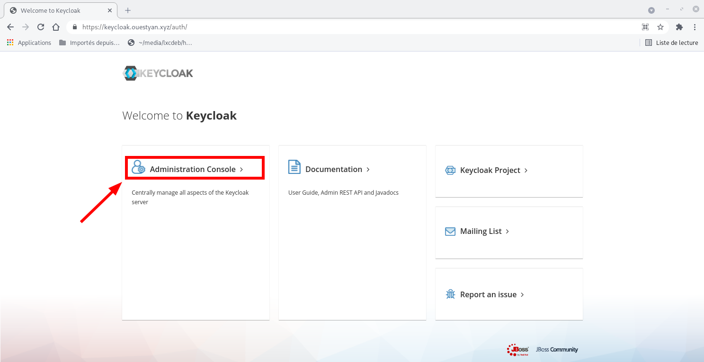  
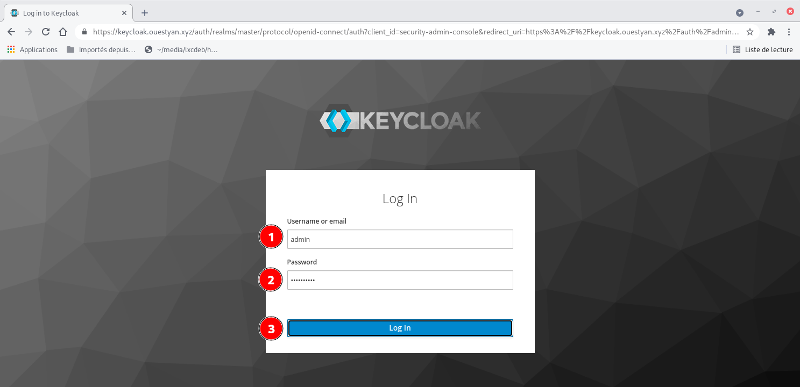  

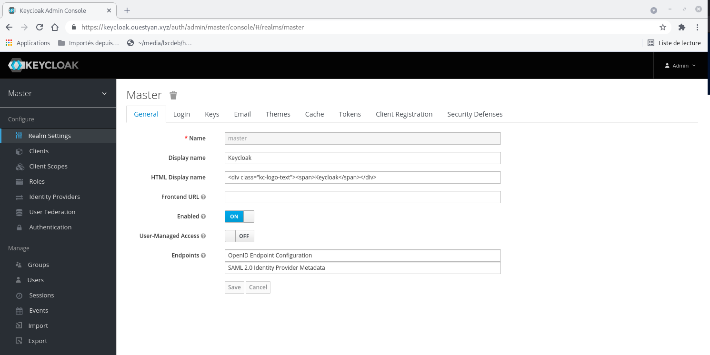  

### Clients

Créer notre client, qui sera donc notre serveur Nextcloud. Pour ce faire, on se rend sur l’onglet **Clients** puis **Create**  
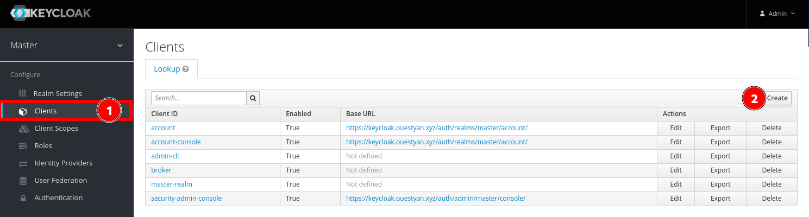  

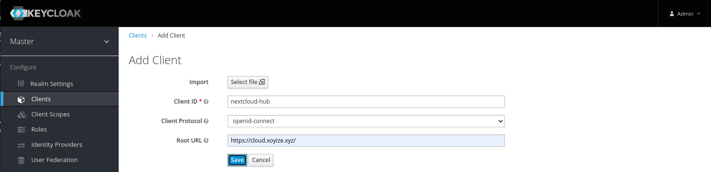   
On lui renseigne un nom (Client ID), on choisi le type de protocole utilisé, ici ce sera OpenID-Connect, et enfin l’URL de notre serveur. Nextcloud hébergé https://cloud.xoyize.xyz. Cliquer sur **Save**  
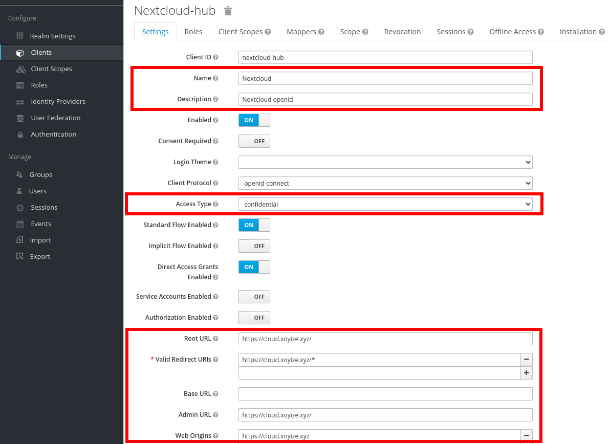   
on renseigne un nom, une description, on choisi l’**Access Type** à **Confidential**, car notre client doit renseigner un **secret** pour initier la connexion  
On laisse les différentes options par défaut, et on vérifie les URLs   
On clique sur **Save** pour terminer.

Dans la partie **Clients**, puis **Nextcloud-hub** on se rend sur l’onglet Roles et on peut y créer nos groupes. Ici, je vais créer un groupe nommé **Utilisateurs** via "Add Role"  
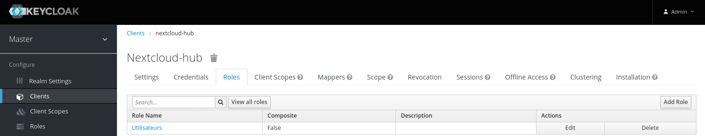   

Puis ensuite il faut rajouter un **Mapper**, en se rendant dans l’onglet correspondant. Ici, on clique sur **Add builtin**, puis on sélectionne la case à cocher **client roles** et on clique sur "Add selected"  
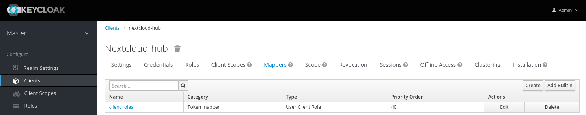   

Ensuite il convient de modifier le nom du claim qui sera intégré au token. On remplace la valeur **Token Claim Name** par **roles**   
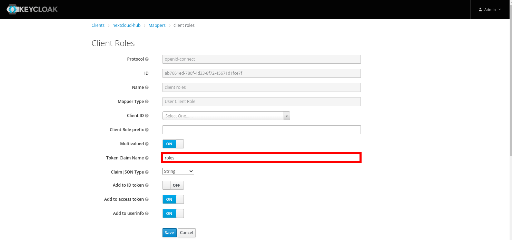   

### Users

Il faut créer un utilisateur sur notre Keycloack   
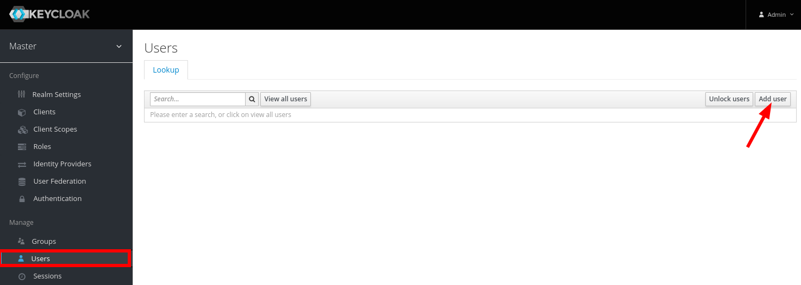   

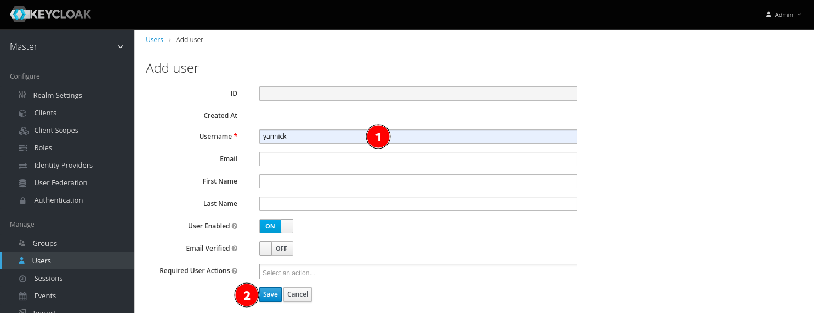   
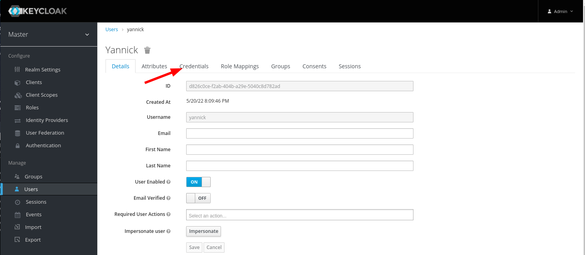   
Une fois notre user créé, on lui setup un mot de passe en nous rendant dans **Credentials**
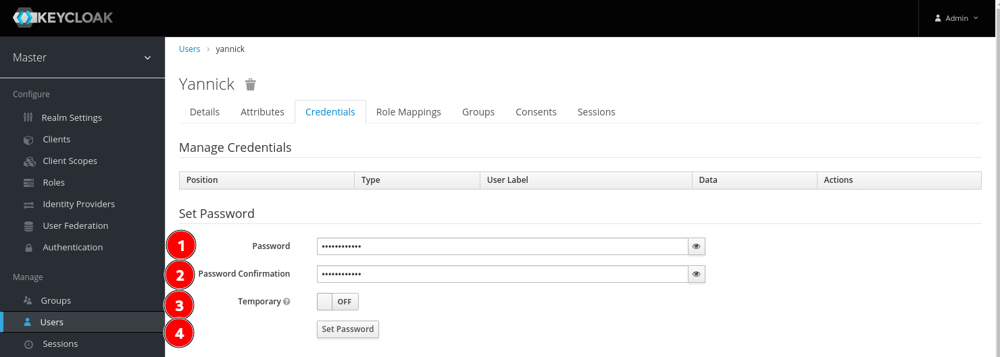   
Et enfin, après avoir créé notre user (yannick) on se rend sur **Role Mappings**, et dans **Client Roles** on peut choisir notre instance Nextcloud, puis lui assigné le nom du role (du groupe) voulu   
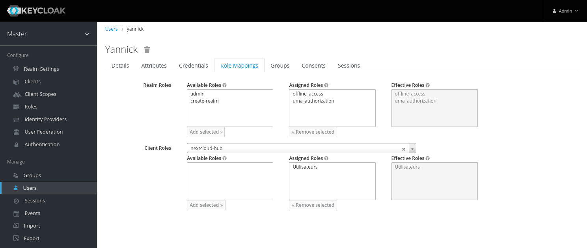   

## Nextcloud

### Configurer extension "Social Login"

ON ajoute un groupe (facultatif)  
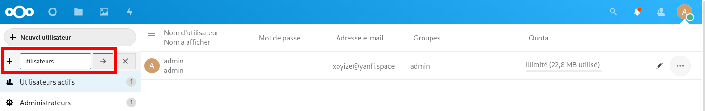  
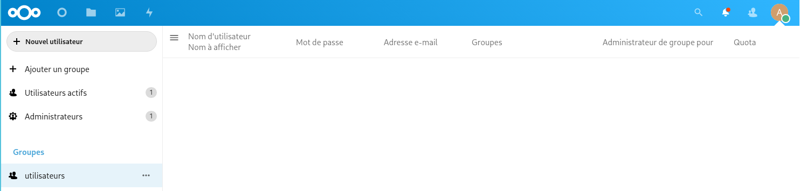  

La première étape est d’installer l’extension **Social Login** dans **Applications** :  
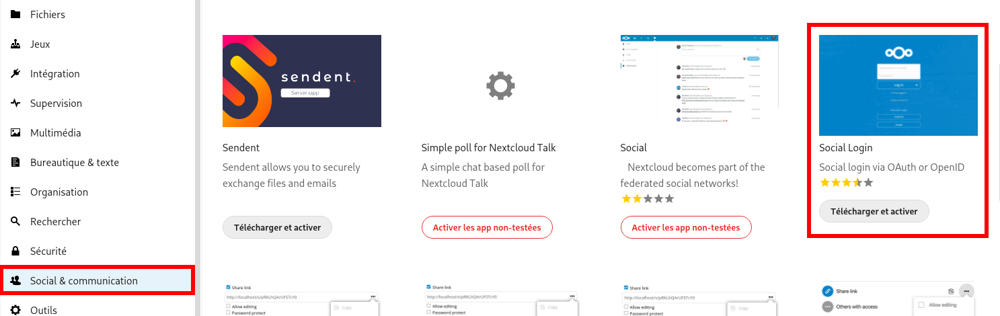  
Cliquer sur "Télécharger et activer"  

Puis en nous rendant dans les "Paramètres" &rarr; "Social login" (rubrique Administration). Cliquez en premier lieu sur **Sauvegarder** après avoir (ou pas) coché certaines options désirées :  
  
Modifier la configuration du plugin **Social Login** , cliquer sur **Sauvegarder**
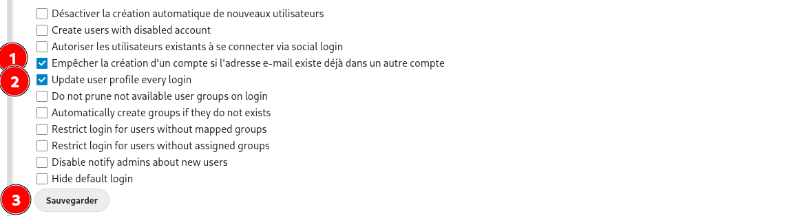  

* Empêcher la création d'un compte si l'adresse e-mail existe dans un autre compte : coché
* Update user profile every login: coché pour que les changements d'utilisateur sur Keycloak se propagent lors de la prochaine utilisation

On clique ensuite sur "Custom OpenID Connect", et on rempli les champs adéquats  
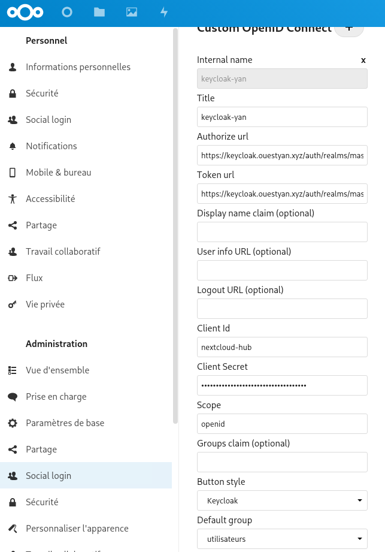  

*    **Internal name**: keycloak-yan 
*    **Title** : keycloak-yan 
*    **Authorize URL** : <https://keycloak.ouestyan.xyz/auth/realms/master/protocol/openid-connect/auth>, vous mettez donc votre URL en rajoutant le `/realms/master/protocol/openid-connect/auth`, où `/master/` est le nom de votre realm, ici via l’instance de test de Keycloack celui-ci est nommé master 
*    **Token URL** : <https://keycloak.ouestyan.xyz/auth/realms/master/protocol/openid-connect/token>, comme pour l’Authorize URL, vous avez compris l’idée  
*    **User info URL** (optional) : https://keycloak.ouestyan.xyz/realms/master/protocol/openid-connect/userinfo  
*    **Client ID**: l’id du client créé sur notre Keycloack, il s’agissait de nextcloud-hub  
*    **Client Secret** : pour l’obtenir retournez sur la console admin de Keycloack, sur les paramètres de votre client, et allez dans Credentials puis Secret  
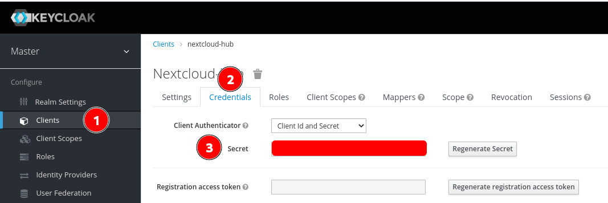  
*    **Scope** : openid 
*    **Button style** : optionnel, mais vous pouvez choisir Keycloack  
*  **Default group** : utilisateurs

On peut valider le tout en cliquant sur **Sauvegarder** en bas de page.

### Authentification via keycloak

Et si l’on essaie de se connecter avec cet utilisateur "yannick"  
   
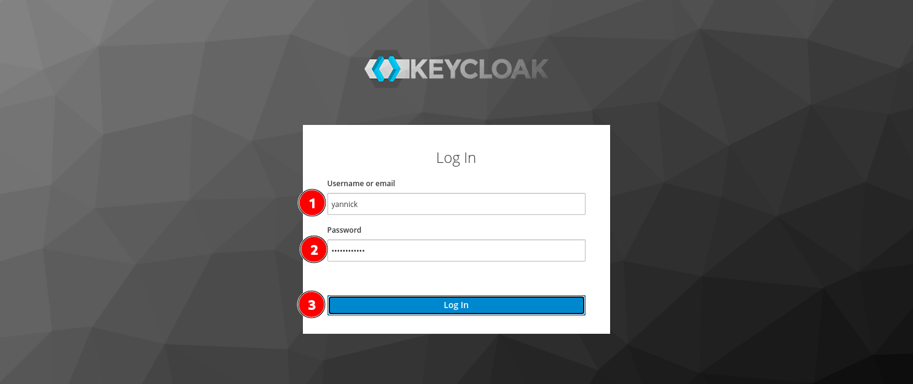   

Tout fonctionne !  
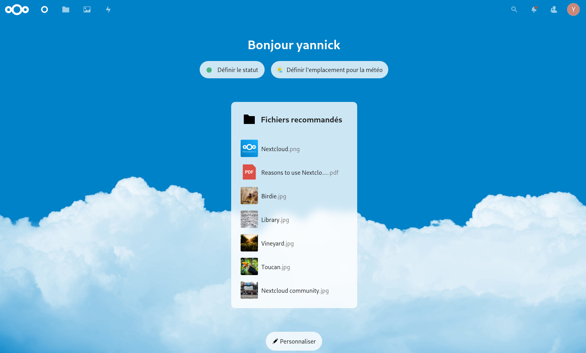   

### CLI - Token + info utilisateur

En ligne de commande , vérification du Token avec affichage  des infos de l'utilisateur "yannick"

```bash
# Paramètres
KEYCLOAK_HOST=keycloak.ouestyan.xyz
KEYCLOAK_USERNAME=yannick
KEYCLOAK_PASSWORD=yannick49600
KEYCLOAK_REALM=master
# console admin Keycloack, paramètres de votre client, Credentials puis Secret
KEYCLOAK_CLIENT_SECRET=3a6f48bef-d214-ed56-49ab-cd230fa
CLIENT_ID=nextcloud-hub

# Obtenir le jeton (token)
TOKEN=$(curl -s \
-d "client_id=$CLIENT_ID" \
-d "client_secret=$KEYCLOAK_CLIENT_SECRET" \
-d "username=$KEYCLOAK_USERNAME" \
-d "password=$KEYCLOAK_PASSWORD" \
-d "grant_type=password" \
"https://$KEYCLOAK_HOST/auth/realms/$KEYCLOAK_REALM/protocol/openid-connect/token" | jq -r '.access_token')

# Utiliser le jeton pour obtenir des informations sur l'utilisateur
curl \
-H "Authorization: bearer $TOKEN" \
https://$KEYCLOAK_HOST/auth/realms/$KEYCLOAK_REALM/protocol/openid-connect/userinfo | jq
```

vous obtenez une réponse au format JSON

```json
{
  "sub": "d826c0ce-f2ab-404b-a29e-5040c8d782ad",
  "email_verified": false,
  "preferred_username": "yannick",
  "email": "yannick@yanfi.space",
  "roles": [
    "manage-account",
    "manage-account-links",
    "view-profile",
    "Utilisateurs"
  ]
}
```

## Liens

* [Installer et exécuter Keycloak](https://keycloak.ch/keycloak-tutorials/tutorial-1-installing-and-running-keycloak/)
* [How to Install KeyCloak SSO on Ubuntu 20.04 (Tutorial)](https://cloudinfrastructureservices.co.uk/install-keycloak-sso-on-ubuntu-20-04/)
* [Installing and running Keycloak standalone on Ubuntu 20.04](https://learning.minamirnd.work/keycloak-install-ubuntu/)
* [Authenticating Nextcloud with Keycloak using OpenID Connect](https://blog.w3asel.com/2019/10/authenticating-nextcloud-with-keycloak-using-openid-connect/)
* [Keycloak with 2FA as Nextcloud backend](https://blog.laubacher.io/keycloak-with-2fa-as-nextcloud-backend)
* [Comment nous avons créé une architecture SSO : Nextcloud + Keycloak + YubiKey](https://www.aukfood.fr/comment-nous-avons-cree-une-architecture-sso-nextcloud-keycloak-yubikey/)
* [SSO with Keycloak](https://heiswayi.nrird.com/sso-with-keycloak)
* [OpenID Connect with Nextcloud and Keycloak](https://janikvonrotz.ch/2020/10/20/openid-connect-with-nextcloud-and-keycloak/)


