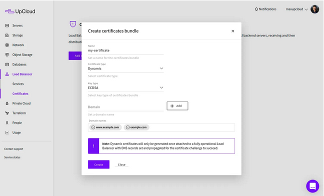
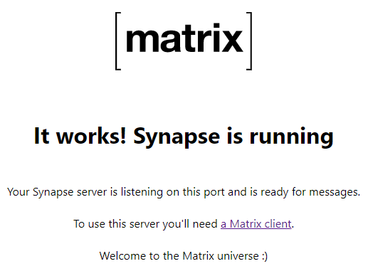
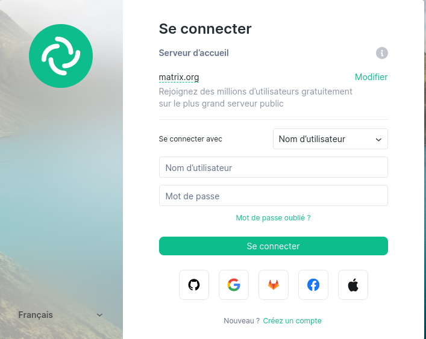
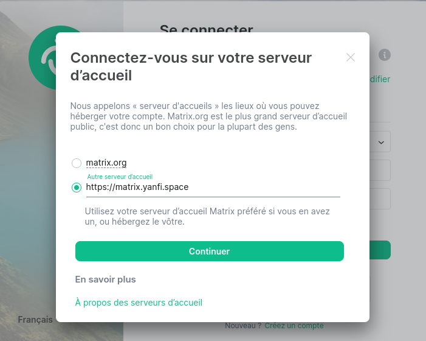
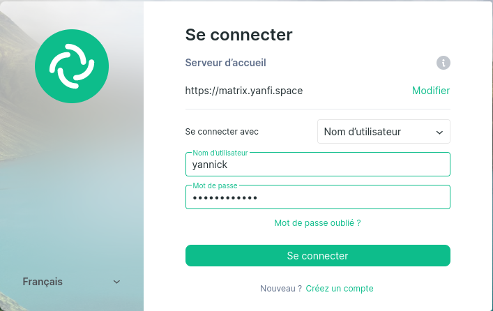
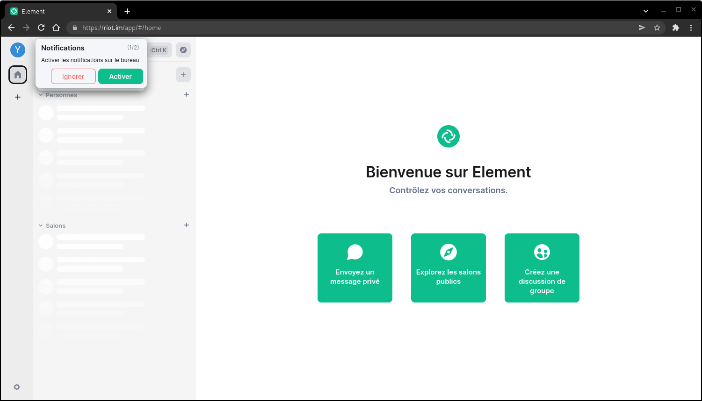
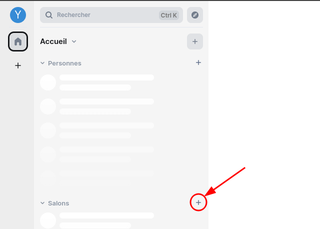
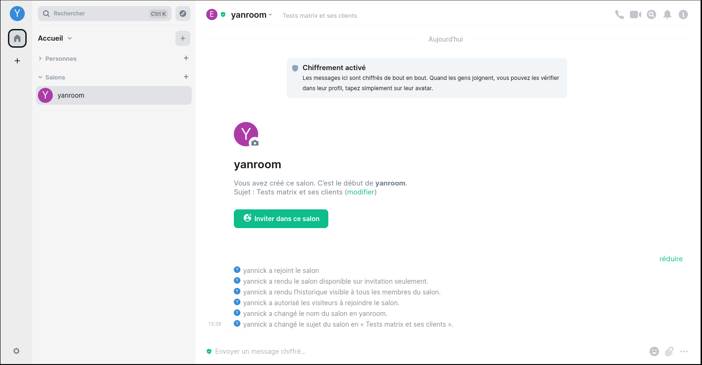

+++
title = 'Matrix Synapse Home Server'
date = 2022-07-27 00:00:00 +0100
categories = ['vps']
+++
## Matrix Synapse Home Server

<u>Article original</u> : [How to install Matrix Synapse Home Server](https://upcloud.com/resources/tutorials/install-matrix-synapse/)


Ce guide vous aidera à installer et à démarrer avec Matrix et son serveur domestique de référence, Synapse. Les instructions et les exemples de commandes contenus dans ce guide vous aideront à configurer Matrix Synapse sur un serveur cloud fonctionnant sous CentOS 8, Debian 10 ou Ubuntu 18

### Qu'est-ce que Matrix ?

Matrix est une norme ouverte pour la communication décentralisée, qui distribue de manière sécurisée les salons de discussion persistants sur une fédération ouverte de serveurs, évitant ainsi tout point de contrôle ou de défaillance unique.

Matrix fournit des API HTTP simples et des implémentations de référence open-source pour créer un tissu commun permettant d'interconnecter les îlots de communication existants. Parmi les cas d'utilisation, citons la création et la gestion de conversations entièrement distribuées, l'activation d'appels VoIP et vidéo WebRTC à l'aide de la signalisation Matrix, et la synchronisation de l'historique sur tous les clients en temps réel.

### 1. Déployer un serveur en nuage

Si vous n'êtes pas encore inscrit à UpCloud, vous devez [commencer ici](https://signup.upcloud.com/%20/?promo=matrix) pour bénéficier de 25 $ de crédits en vous inscrivant aujourd'hui.  
Une fois que vous vous êtes inscrit, connectez-vous à votre [panneau de contrôle UpCloud](https://hub.upcloud.com/deploy) et déployez un serveur.

**Synapse** nécessite un système compatible POSIX, tel que les distributions Linux susmentionnées, Python 3.6 ou plus récent installé, et au moins 1 Go de RAM libre pour pouvoir rejoindre de grands espaces publics tels que le `#matrix:matrix.org`.

Déployez une nouvelle instance de cloud pour héberger le serveur domestique Matrix en utilisant l'un des systèmes d'exploitation Linux testés vers une zone de disponibilité de votre choix. Vous trouverez des instructions détaillées sur toutes les options de configuration dans le guide de déploiement d'un serveur.

### 2. Installation des prérequis

Lorsque votre serveur est opérationnel, utilisez les commandes ci-dessous appropriées à votre système pour installer les paquets et les bibliothèques nécessaires.

Pour le système Debian 10, installez les prérequis à l'aide de la commande suivante.

    sudo apt install build-essential python3-dev libffi-dev \
    python-pip python-setuptools sqlite3 \
    libssl-dev python-virtualenv libjpeg-dev libxslt1-dev

Pour le système Debian 11 , seul python3 est installé

    sudo apt install build-essential python3-dev libffi-dev \
    python3-pip python3-setuptools sqlite3 \
    libssl-dev python3-virtualenv libjpeg-dev libxslt1-dev

### 3. Installation du serveur domestique Synapse

**Synapse** est l'implémentation de référence Matrix d'un "serveur domestique" écrit par l'équipe de développement de base de Matrix. Il est conçu comme une vitrine du concept Matrix pour démontrer la spécification dans le contexte d'une base de code. Il vous permet d'exécuter facilement votre propre serveur domestique et contribue généralement à l'amorçage de l'écosystème Matrix.

Les serveurs domestiques sont utilisés comme point d'accès pour les clients qui se connectent au réseau Matrix. Ils stockent l'historique de chat personnel et les informations de compte des utilisateurs de la même manière que le ferait un serveur IMAP/SMTP. Comme pour la messagerie électronique, vous pouvez utiliser votre propre serveur domestique Matrix pour garder le contrôle et la propriété de vos communications et de votre historique ou utiliser l'un des services hébergés de Matrix. Matrix n'a pas de point de contrôle unique ni de fournisseur de services obligatoire.



Pour préparer le système, configurez un nouvel environnement virtuel sous ~/synapse à l'aide des commandes ci-dessous ou choisissez un autre répertoire en remplaçant le ~/synapse dans les commandes par le dossier dans lequel vous souhaitez stocker les fichiers du serveur.

    mkdir -p ~/synapse
    virtualenv -p python3 ~/synapse/env
    source ~/synapse/env/bin/activate

Le prompt suivant apparaît : `(env) hmsuser@server32771:~$`

Vérifiez que les paquets suivants sont installés et à jour.

    pip install --upgrade pip virtualenv six packaging appdirs

Utilisez ensuite pip pour installer et mettre à jour les outils d'installation ainsi que le serveur Synapse lui-même.

    pip install --upgrade setuptools
    pip install matrix-synapse

Ceci installe le serveur domestique Synapse ainsi que ses bibliothèques.

Si vous rencontrez des problèmes lors de l'installation du serveur domestique Synapse, Matrix vous donne quelques conseils de dépannage sur la [page GitHub de Synapse (en)](https://github.com/matrix-org/synapse/blob/master/README.rst#id3).

### 4. Configuration de Synapse

Avant de pouvoir démarrer Synapse, vous devez générer un fichier de configuration qui définit les paramètres du serveur.

Exécutez les commandes suivantes dans votre environnement virtuel Synapse.  
Remplacez le nom du serveur **matrix.yanfi.space** par votre propre domaine, mais notez que le nom ne pourra pas être modifié ultérieurement sans réinstaller le serveur domestique.  
Choisissez également si vous souhaitez autoriser Synapse à établir des rapports statistiques en saisissant `--report-stats=yes ou no`.

```
source ~/synapse/env/bin/activate 
pip install -U matrix-synapse
cd ~/synapse
python -m synapse.app.homeserver --generate-config -H matrix.yanfi.space --report-stats yes -c homeserver.yaml
```

Réponse 

```
Generating config file homeserver.yaml
Generating log config file /home/hmsuser/synapse/matrix.yanfi.space.log.config which will log to /home/hmsuser/synapse/homeserver.log
Generating signing key file /home/hmsuser/synapse/matrix.yanfi.space.signing.key
A config file has been generated in 'homeserver.yaml' for server name 'matrix.yanfi.space'. Please review this file and customise it to your needs.
```

Une fois que Synapse a fini de générer les paramètres requis, vous devriez voir une confirmation comme dans l'exemple ci-dessus.

### 5. Activation de TLS

Matrix Synapse requiert maintenant l'activation de TLS par défaut pour permettre l'utilisation sécurisée du serveur. La façon la plus simple de configurer TLS est d'obtenir des certificats SSL auprès d'une autorité de certification de confiance telle que **Let's Encrypt**.

On peut générer les certificats par **Certbot** ou **acme.sh**

#### Certbot

Le client Certbot de Let's Encrypt est principalement distribué via les paquets Snap. Consultez ci-dessous les instructions pour installer Snap et le client Certbot pour votre système d'exploitation.

Les modèles d'OS pour Ubuntu 18 et 20 sur UpCloud ont Snap installé par défaut. Vérifiez simplement que Snap est à sa dernière version et utilisez ensuite Snap pour installer Certbot.

```bash
sudo apt install snapd -y
sudo snap install core; sudo snap refresh core
sudo snap install --classic certbot
sudo ln -s /snap/bin/certbot /usr/bin/certbot
```

Vous devrez également disposer d'un serveur web que Certbot pourra utiliser pour valider le certificat. Installez **nginx** en suivant les instructions ci-dessous en fonction de votre système d'exploitation.

Sur les systèmes Debian et Ubuntu, exécutez simplement la commande suivante.

    sudo apt install nginx

Lorsque le client **Certbot** et **Nginx** sont installés, vous pouvez obtenir des certificats en utilisant la commande `certonly` avec le plugin `--nginx`.  
Incluez au moins un nom de domaine en remplaçant la matrice.exemple.com par la vôtre.

    sudo certbot certonly --nginx -d matrix.yanfi.space

Cette commande lance un script de configuration interactif qui pose quelques questions pour faciliter la gestion des certificats.

1.    Lors de la première installation sur un hôte spécifique, vous devrez entrer une adresse électronique de contact
2. puis lire les conditions d'utilisation de Let's Encrypt et sélectionner Accepter si vous acceptez les conditions et souhaitez utiliser le service
3. choisir si vous souhaitez partager votre adresse électronique avec l'Electronic Frontier Foundation (EFF) pour recevoir des mises à jour sur leur travail.

Si le client a réussi à obtenir un certificat, vous trouverez une confirmation et la date d'expiration du certificat à la fin de la sortie du client.

Si vous rencontrez des problèmes avec le client, assurez-vous que vous essayez d'enregistrer un domaine ou un sous-domaine qui se résout actuellement sur votre serveur, car les configurations DNS peuvent prendre un certain temps à se propager. Vérifiez également que vous exécutez la commande avec des privilèges d'administrateur.

Lorsque les certificats ont été émis avec succès, vous devez les activer pour le serveur domestique Synapse.

Vous pouvez en savoir plus sur le client Let's Encrypt, y compris sur la manière d'automatiser le renouvellement des certificats, dans notre [article sur l'installation de Let's Encrypt sur nginx](https://upcloud.com/community/tutorials/%20/install-lets-encrypt-nginx/).

#### acme.sh

1-Installation gestionnaire des certificats Let's Encrypt

```
cd ~
git clone https://github.com/acmesh-official/acme.sh.git
cd acme.sh
./acme.sh --install 
```

2-Se reconnecter

3-Exporter les clés OVH API  

 
4-Génération des certificats  

    acme.sh --dns dns_ovh --server letsencrypt --issue --keylength ec-384 -d 'yanfi.space' -d 'matrix.yanfi.space'
    
Ouvrir le  lien d'authentification et relancer la commande précédente après le message "OVH authentication Success !" et patienter...

5-Installation des certificats

```
sudo mkdir -p /etc/ssl/private/
sudo chown $USER -R /etc/ssl/private/
acme.sh --ecc --install-cert -d 'yanfi.space' -d '*.yanfi.space' --key-file /etc/ssl/private/yanfi.space-key.pem --fullchain-file /etc/ssl/private/yanfi.space-fullchain.pem  --reloadcmd 'sudo systemctl reload nginx.service'
```

Editer le crontab

    crontab -e

```
13 0 * * * "/home/userhms/.acme.sh"/acme.sh --cron --home "/home/userhms/.acme.sh" --renew-hook "/home/userhms/.acme.sh/acme.sh --ecc --install-cert -d 'yanfi.space' -d '*.yanfi.space' --key-file /etc/ssl/private/yanfi.space-key.pem --fullchain-file /etc/ssl/private/yanfi.space-fullchain.pem  --reloadcmd 'sudo systemctl reload nginx.service'" > /dev/null
```

### 6. Configuration du reverse proxy avec nginx

Matrix recommande de configurer un proxy inverse, tel que nginx, Apache ou HAProxy, en amont de votre serveur Synapse. L'objectif est de simplifier les connexions client en permettant à Matrix d'utiliser le port HTTPS commun 443 tout en conservant les connexions serveur à serveur sur le port 8448.

Modifiez la configuration par défaut du serveur domestique pour qu'il écoute uniquement l'adresse localhost pour le port 8008. Ouvrez le fichier homeserver.yaml pour le modifier.

    nano ~/synapse/homeserver.yaml

Trouvez le segment suivant et définissez le bind only sur l'adresse 127.0.0.1 et vérifiez que le drapeau forward est défini sur true comme indiqué ci-dessous. Vous pouvez laisser le reste tel quel, nous allons terminer le SSL au niveau du proxy afin que Matrix n'ait pas à se soucier des paramètres TLS.

```
  - port: 8008
    tls: false
    bind_addresses: ['127.0.0.1']
    type: http
    x_forwarded: true
```

Sauvegardez le fichier et quittez.

Ensuite, permettez à nginx d'agir en tant que proxy inverse en créant un fichier de configuration pour la fonctionnalité de proxy.

    sudo nano /etc/nginx/conf.d/matrix.conf

Ensuite, entrez ce qui suit pour activer le proxy avec la terminaison SSL. Remplacez matrix.yanfi.space par votre domaine dans le nom du serveur. 

Les certificats émis par Let's Encrypt sont enregistrés dans le répertoire indiqué dans la sortie de **Certbot**, généralement sous `/etc/letsencrypt/live/`:  
/etc/letsencrypt/live/matrix.yanfi.space/fullchain.pem  
/etc/letsencrypt/live/matrix.yanfi.space/privkey.pem 

ou pour **acme.sh**, `/etc/ssl/private/`:   
/etc/ssl/private/yanfi.space-fullchain.pem  
/etc/ssl/private/yanfi.space-key.pem

Encore une fois, remplacez matrix.yanfi.space par le nom de domaine pour lequel les certificats ont été émis.

```
server {
    listen 80;
	listen [::]:80;
    server_name matrix.yanfi.space;
    return 301 https://$host$request_uri;
}

server {
    listen 443 http2;
    listen [::]:443 http2;
    server_name matrix.yanfi.space;

    ssl_certificate /etc/ssl/private/yanfi.space-fullchain.pem;
    ssl_certificate_key /etc/ssl/private/yanfi.space-key.pem;

    location / {
        proxy_pass http://localhost:8008;
        proxy_set_header X-Forwarded-For $remote_addr;
    }
}

server {
    listen 8448 ssl default_server;
    listen [::]:8448 ssl default_server;
    server_name matrix.yanfi.space;

    ssl_certificate /etc/ssl/private/yanfi.space-fullchain.pem;
    ssl_certificate_key /etc/ssl/private/yanfi.space-key.pem;
    location / {
        proxy_pass http://localhost:8008;
        proxy_set_header X-Forwarded-For $remote_addr;
    }
}
```

La configuration nginx ci-dessus comprend trois parties pour faciliter au maximum l'utilisation de votre serveur domestique Matrix Synapse. Il écoute les connexions sécurisées sur les ports 443 pour HTTPS et 8448 pour la communication entre serveurs de la fédération Matrix. Les connexions au port HTTP 80 non sécurisé sont redirigées pour utiliser HTTPS à la place.

Une fois que vous avez terminé, enregistrez le fichier et quittez l'éditeur.

Ensuite, démarrez et activez nginx.

    sudo systemctl restart nginx
    sudo systemctl enable nginx

C'est tout ce dont vous avez besoin pour configurer un serveur domestique Synapse. Continuez ci-dessous pour démarrer le serveur et créer votre premier utilisateur.

### 7. Enregistrement d'un nouvel utilisateur

Maintenant que Synapse est installé, vous devez ajouter un nouvel utilisateur en tant qu'administrateur pour pouvoir configurer les salles de chat et les paramètres du client Web. Tout d'abord, assurez-vous que vous êtes dans l'environnement virtuel du serveur domestique et démarrez le serveur.

    cd ~/synapse
    source env/bin/activate
    synctl start

Résultat de la commande précédente

```
This server is configured to use 'matrix.org' as its trusted key server via the
'trusted_key_servers' config option. 'matrix.org' is a good choice for a key
server since it is long-lived, stable and trusted. However, some admins may
wish to use another server for this purpose.

To suppress this warning and continue using 'matrix.org', admins should set
'suppress_key_server_warning' to 'true' in homeserver.yaml.
--------------------------------------------------------------------------------
started synapse.app.homeserver(homeserver.yaml)
```

Ensuite, enregistrez un nouvel utilisateur sur le localhost.

    register_new_matrix_user -c homeserver.yaml http://localhost:8008

Ceci démarre une configuration interactive de l'utilisateur, entrez le nom d'utilisateur et le mot de passe désirés, puis sélectionnez yes pour activer les privilèges d'administration.

```
New user localpart [root]: username
Password: password
Confirm password: password
Make admin [no]: yes
Sending registration request...
Success.
```

Voilà, vous devriez maintenant être en mesure de vous connecter à votre serveur domestique Synapse avec les informations d'identification de l'utilisateur que vous venez de créer.

### 8. Connexion à Matrix

Les utilisateurs ont la possibilité de se connecter à un serveur domestique Matric en utilisant un ou plusieurs clients Matrix. Tout d'abord, vérifiez que le serveur Matrix fonctionne et qu'il est joignable en ouvrant votre domaine sur un navigateur Web.

https://matrix.yanfi.space

Vous devriez voir une page telle que celle ci-dessous.  
{:width="400"}

Le serveur domestique ne comprend pas de client Matrix par défaut, mais vous pouvez utiliser le client Web Riot. Il possède une interface utilisateur soignée et facile à utiliser, et après avoir installé des certificats de confiance à l'aide de Let's Encrypt, vous pouvez vous connecter à votre serveur domestique à l'aide d'un client public tel que Riot.

Allez à l'URL suivante sur votre navigateur web <https://riot.im/app/#/login>

Vous devriez voir une page de connexion comme dans l'image d'exemple ci-dessous. Tout d'abord, cliquez sur le lien "Modifier" pour choisir d'utiliser votre serveur Matrix personnalisé.  
{:width="400"}  
Entrez le nom de domaine de votre serveur Matrix comme URL de votre serveur d'accueil et cliquez sur le bouton **Continuer**.  
{:width="400"}  
Riot effectuera alors une vérification rapide de la connexion à votre serveur cloud. Si vous voyez un message d'erreur, vérifiez le domaine de votre serveur et que vous l'avez entré en utilisant HTTPS.

Ensuite, connectez-vous avec le nom d'utilisateur et le mot de passe que vous venez de créer dans la section précédente pour votre propre serveur domestique.  
{:width="400"}  

Après quelques instants  
{:width="600"}  
L'application Web Riot est un moyen pratique de tester votre serveur Matrix Synapse personnalisé, mais ce n'est certainement pas le seul client disponible. D'autres applications clientes sont disponibles sur la [page de documentation de Matrix](https://matrix.org/docs/projects/try-matrix-now/#clients).

### 9. Création d'une pièce

Ensuite, vous souhaiterez peut-être créer une nouvelle salle. Dans Matrix, tout se passe dans des salles qui sont distribuées et n'existent pas sur un seul serveur. Les salles peuvent être identifiées et localisées en utilisant des alias tels que #matrix:matrix.org ou #test:localhost:8008.

Cliquez sur l'icône "+" de "Salons" et choisir "Nouveau salon"  
{:width="400"}  

Donnez un nom à votre espace et, avec le client Synapse, vous pouvez également rendre l'espace public si vous le souhaitez.  
{:width="400"}  
Appuyez ensuite sur la touche Entrée pour enregistrer le nom et rejoindre la nouvelle pièce.
{:width="600"}  
Les salles peuvent être utilisées comme n'importe quel canal de communication, mais Matrix est conçu pour être beaucoup plus performant qu'un simple chat textuel. La mise en œuvre de base du serveur domestique et du client Web Synapse n'est qu'un exemple de la manière dont le réseau Matrix peut être utilisé. Il existe déjà un certain nombre d'autres options pour les serveurs domestiques avec de nombreux cas d'utilisation différents. Vous trouverez d'autres [serveurs d'application accessibles au public](https://matrix.org/docs/projects/try-matrix-now.html#servers) dans la documentation des projets Matrix.

### 10. Synapse systemd

Fichier de configuration systemd pour synapse.  
Synapse a été installé par un utilisateur nommé **hmsuser** dans une virtualenv dans le répertoire personnel de l'utilisateur : `/home/hmsuser/synapse/env`

Fichier `/etc/systemd/system/matrix-synapse.service`

```
[Unit]
Description=Synapse Matrix homeserver
# If you are using postgresql to persist data, uncomment this line to make sure
# synapse starts after the postgresql service.
# After=postgresql.service

[Service]
Type=notify
NotifyAccess=main
ExecReload=/bin/kill -HUP $MAINPID
Restart=on-abort

User=hmsuser
Group=nogroup

WorkingDirectory=/home/hmsuser/synapse
ExecStart=/home/hmsuser/synapse/env/bin/python -m synapse.app.homeserver --config-path=/home/hmsuser/synapse/homeserver.yaml
SyslogIdentifier=matrix-synapse

# adjust the cache factor if necessary
# Environment=SYNAPSE_CACHE_FACTOR=2.0

[Install]
WantedBy=multi-user.target
```

Lancer et activer

    sudo systemctl enable matrix-synapse
    sudo systemctl start matrix-synapse

### C'est fait !

Félicitations, vous avez maintenant déployé et configuré avec succès votre premier serveur domestique Matrix à l'aide de Synapse.

Si vous souhaitez essayer d'autres clients, le plugin Weechat Matrix permet de se connecter même en ligne de commande, tandis que Riot est également disponible sur Android et iOS. Enfin, ceux qui ont le savoir-faire technique peuvent toujours écrire leur propre client à l'aide de l'un des SDK de Matrix.

Matrix présente un potentiel énorme en matière de communication sécurisée, qu'il s'agisse de salons de discussion de groupe, d'appels VoIP et vidéo ou d'échange de données persistantes entre appareils et services dans l'Internet des objets. N'hésitez pas à expérimenter avec les serveurs et les clients existants ou à développer les vôtres !
