+++
title = 'uMap (Debian 11 + Python + PostgreSQL + PostGIS)'
date = 2022-08-02 00:00:00 +0100
categories = ['cartographie']
+++
*[uMap](https://github.com/umap-project/umap/) est un outil en ligne d'édition et de partage de cartes. Il permet de créer des itinéraires, de marquer des points d'intérets, de délimiter des zones, de choisir le fond de carte le plus approprié, etc...  
Il est  proposé sur [Framacarte](https://framacarte.org/) en partenariat avec OpenStreetMap France.([Framalibre uMap](https://framalibre.org/content/umap))*

* Installation serveur uMap basée sur le tutoriel [Framacarte/uMap](https://framacloud.org/fr/cultiver-son-jardin/umap.html#)  
* [uMap site documentation officielle](https://umap-project.readthedocs.io/en/latest/install/)  
* [uMap - Ubuntu from scratch](https://umap-project.readthedocs.io/en/latest/ubuntu/)
* https://github.com/umap-project/umap/blob/master/docs/ubuntu.md

## Prérequis

Un serveur debian avec nginx avec un domaine et certificats.

```
   Static hostname: server32771
         Icon name: computer-vm
           Chassis: vm
        Machine ID: 0e0cc9839fc64a049ba55e3248fab176
           Boot ID: fc9dee6d430a4ad582844d08643f1bb0
    Virtualization: kvm
  Operating System: Debian GNU/Linux 11 (bullseye)
            Kernel: Linux 5.10.0-16-cloud-amd64
      Architecture: x86-64
```

nginx version: nginx/1.20.2  
OpenSSL 1.1.1n  15 Mar 2022

Installer les différents paquets Python , PostgreSQL, PostGIS, Git, etc..

```bash
sudo apt install postgresql postgresql-server-dev-13 postgis \
python3-pip git python3-virtualenv virtualenvwrapper python3-dev python3-setuptools \
libtiff5-dev libjpeg62-turbo-dev zlib1g-dev libfreetype6-dev liblcms2-dev libwebp-dev \
tcl8.6-dev tk8.6-dev python3-tk 
```

Build Packages From Source in Debian (ex build-dep )

    sudo apt install devscripts

Python3 imaging library Pillow (ex python-imaging)

    sudo apt install python3-pil

Pour éviter l'erreur `nginx + uwsgi: -- unavailable modifier requested: 0 --`   
Pour Python 3 , installer le plugin python pour uWSGI

    sudo apt install uwsgi-plugin-python3 

si vous utilisez un fichier ini pour configurer votre application uWSGI, ajoutez `plugins = python` à la section `[uwsgi]` et cela devrait résoudre ce problème.


### Utilisateur umap

En tant que **root** sur votre serveur, créer un compte utilisateur **umap** et son dossier** /home/umap** dans lequel seront copiés les fichiers avec les droits d'accès correspondants.


```bash
useradd -N umap -m
usermod -s /bin/bash umap
```

### Environnement python

Se connecter en utilisateur umap 

    su umap 
    cd /home/umap

Création environnement virtuel Python :

```bash
virtualenv -p python3 /home/umap
source /home/umap/bin/activate
```

Le prompt  : `(umap) umap@server32771:~$`

Installation des librairies requises

```bash
pip install django-appconf
exit # sortir environnement
```

### PostgreSQL

Création base de données  
Ajoutez tout d’abord un utilisateur umap et sa base de données associée dans PostgreSQL :

```bash
sudo -u postgres createuser umap
sudo -u postgres createdb umap -O umap
```

Puis crée l'extension PostGis

```bash
sudo -u postgres psql umap
CREATE EXTENSION postgis;

(\q pour sortir de psql)
```

## uMap

### Installation serveur

Se connecter en utilisateur umap et dans l'environnement

```bash
su umap
cd /home/umap
source /home/umap/bin/activate
```

Installer le projet umap

    pip install umap-project 


Créer le fichier de configuration local

    wget https://raw.githubusercontent.com/umap-project/umap/master/umap/settings/local.py.sample -O local.py

Référencer le dans env 

    export UMAP_SETTINGS=`pwd`/local.py

Configuration uMap, édition fichier `local.py` 

```bash
cp umap/settings/local.py.sample umap/settings/local.py
nano umap/settings/local.py
```

Dans ce fichier, il est important de définir les paramètres :

*    SECRET_KEY : une longue chaîne de caractères aléatoires
*    DEBUG = False
*    ADMINS avec vos identifiants et adresse email
*    SOCIAL_AUTH_OPENSTREETMAP_KEY, SOCIAL_AUTH_OPENSTREETMAP_SECRET et AUTHENTICATION_BACKENDS si vous voulez proposer à vos utilisateurs d’avoir un compte pour gérer leurs cartes (nous recommandons OpenStreetMap ici mais vous pouvez aussi utiliser Twitter, Github ou Bitbucket)
*    UMAP_DEMO_SITE = False
*    SITE_URL = "https://votre-site.org"
*    SHORT_SITE_URL = "https://votre-site.org" (vous pouvez utiliser un nom de domaine plus court s’il est configuré comme un alias du nom de domaine principal)
*    MAPQUEST_KEY pour permettre la recherche de lieu

Les paramètres à modifier dans la configuration uMap `local.py`

```
SECRET_KEY = 'TemplePoutureSavonAconageNormeRibaudGoutteLunule'

DEBUG = False

ADMINS = (
    ('umap', 'map@cinay.eu'),
)

UMAP_DEMO_SITE = False

SITE_URL = "https://umap.yanfi.space"
SHORT_SITE_URL = "https://umap.yanfi.space"

# For static deployment
STATIC_ROOT = '/home/umap/var/static'

# For users' statics (geojson mainly)
MEDIA_ROOT = '/home/umap/var/data'

MAPQUEST_KEY = 'UatCgkjev5zvaR4uWEdNivx63tXDOno7'
```

remplir la base de données

    umap migrate

importer en cache les fichiers statiques

    umap collectstatic

```
Loaded local config from /home/umap/local.py

336 static files copied to '/home/umap/var/static'.
```

créer le compte administrateur uMap

    umap createsuperuser  

```
Loaded local config from /home/umap/local.py
Username (leave blank to use 'umap'): 
Email address: umap@lxcyan.local
Password: 
Password (again): 
Superuser created successfully
```

Démarrer le serveur pour test

    umap runserver 0.0.0.0:8000

```
Loaded local config from /home/umap/local.py
Loaded local config from /home/umap/local.py
Watching for file changes with StatReloader
Performing system checks...

System check identified no issues (0 silenced).
July 30, 2022 - 10:26:24
Django version 2.2.17, using settings 'umap.settings'
Starting development server at http://0.0.0.0:8000/
Quit the server with CONTROL-C.
```

Saisir l'adresse dans un navigateur : <http://45.145.166.178:8000>
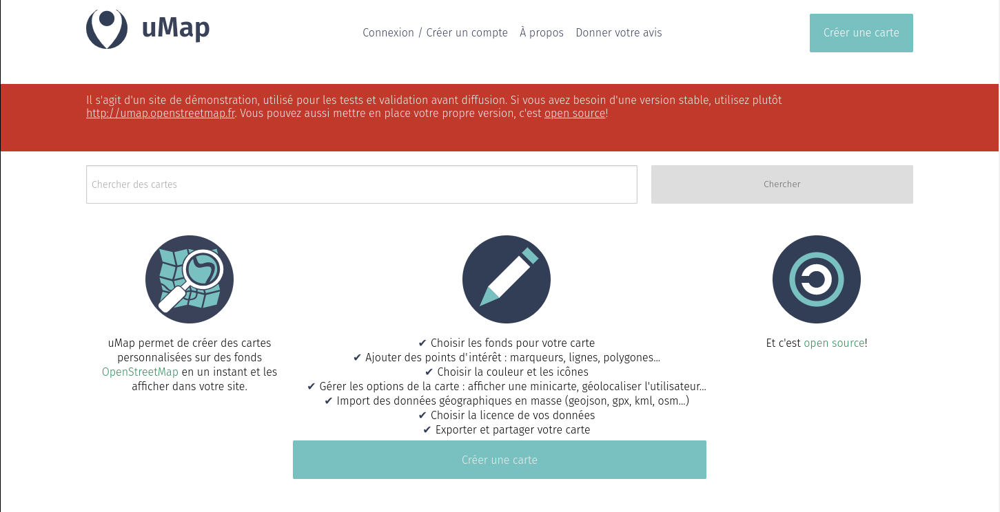{:width="600"}  
uMap est fonctionnel. La page d’accueil sur l'URL <http://45.145.166.178:8000/> tourne mais il ne sera pas encore possible de créer des cartes tant qu’on aura pas ajouté des fonds de carte.

### Fonds de carte

Pour cela, se connecter avec le compte admin précédemment créé sur <http://45.145.166.178:8000/admin> et cliquez sur « Tile layers → Ajouter ».  
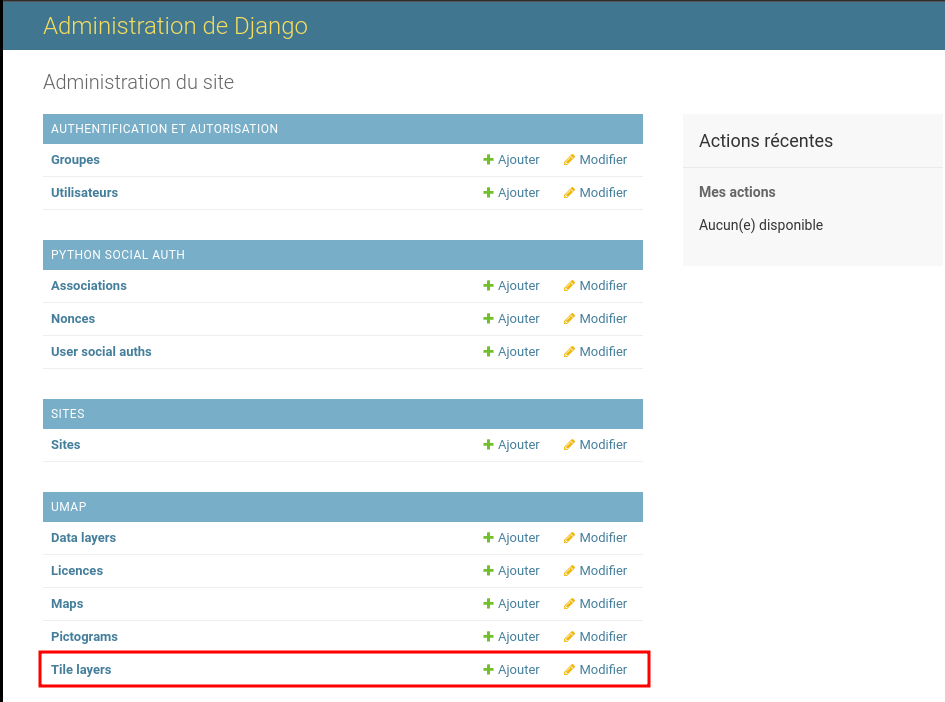{:width="600"}  

OpenTopoMap   
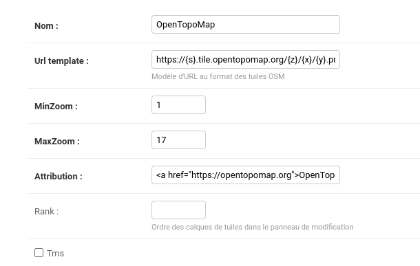{:width="400"}  

IGN Topo  
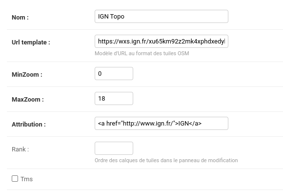{:width="400"}  

OSM Fr  
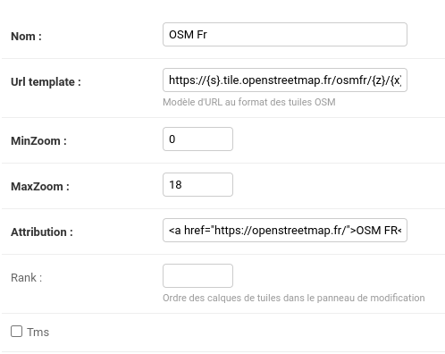{:width="400"}  


### Configurer HTTP API

Se connecter en utilisateur umap et dans l'environnement

```bash
su umap
cd /home/umap
source /home/umap/bin/activate
```

Créez un fichier nommé `/home/umap/uwsgi_params`, avec ce contenu (sans y apporter de modification)  

```
uwsgi_param  QUERY_STRING       $query_string;
uwsgi_param  REQUEST_METHOD     $request_method;
uwsgi_param  CONTENT_TYPE       $content_type;
uwsgi_param  CONTENT_LENGTH     $content_length;

uwsgi_param  REQUEST_URI        $request_uri;
uwsgi_param  PATH_INFO          $document_uri;
uwsgi_param  DOCUMENT_ROOT      $document_root;
uwsgi_param  SERVER_PROTOCOL    $server_protocol;
uwsgi_param  REQUEST_SCHEME     $scheme;
uwsgi_param  HTTPS              $https if_not_empty;

uwsgi_param  REMOTE_ADDR        $remote_addr;
uwsgi_param  REMOTE_PORT        $remote_port;
uwsgi_param  SERVER_PORT        $server_port;
uwsgi_param  SERVER_NAME        $server_name;
```

Créez ensuite un fichier de configuration pour uWSGI 

    nano /home/umap/uwsgi.ini

Et collez ce contenu. Vérifiez les chemins et le nom d'utilisateur au cas où vous auriez personnalisé certains d'entre eux pendant ce tutoriel. Si vous avez suivi toutes les étapes du tutoriel sans faire aucun changement, vous pouvez l'utiliser tel quel  

```
[uwsgi]
uid = umap
gid = users
# Python related settings
# the base directory (full path)
chdir           = /home/umap/
# umap's wsgi module
module          = umap.wsgi
# the virtualenv (full path)
home            = /home/umap 

# process-related settings
# master
master          = true
# maximum number of worker processes
processes       = 4
# the socket (use the full path to be safe
socket          = /home/umap/uwsgi.sock
# ... with appropriate permissions - may be needed
chmod-socket    = 666
stats           = /home/umap/stats.sock
# clear environment on exit
vacuum          = true
plugins         = python3
```

### Nginx umap.yanfi.space

Nous allons maintenant configurer uMap pour le rendre accessible depuis un nom de domaine avec Nginx.  
Installez nginx 

    sudo apt-get install nginx

Créer un fichier de configuration

    nano /home/umap/uwsgi-nginx.conf

```
# the upstream component nginx needs to connect to
upstream umap {
    server unix:///home/umap/uwsgi.sock;
}

# configuration of the server
server {
    listen 80;
    listen [::]:80;
    server_name umap.yanfi.space;
    return 301 https://$host$request_uri;
}

server {
    # the port your site will be served on
    listen      443 http2;
    listen   [::]:443 http2;
    # the domain name it will serve for
    server_name umap.yanfi.space ;

    ssl_certificate /etc/ssl/private/yanfi.space-fullchain.pem;
    ssl_certificate_key /etc/ssl/private/yanfi.space-key.pem;

    # TLS 1.3 only
    ssl_protocols TLSv1.3;
    ssl_prefer_server_ciphers off;

    # OCSP stapling
    ssl_stapling on;
    ssl_stapling_verify on;
 
    # verify chain of trust of OCSP response using Root CA and Intermediate certs
    ssl_trusted_certificate /etc/ssl/private/yanfi.space-fullchain.pem;
    resolver 1.1.1.1 valid=300s;

    # STS conf
    add_header Strict-Transport-Security max-age=15768000; # six months

    # max upload size
    client_max_body_size 25M;   # adjust to taste

    # Finally, send all non-media requests to the Django server.
    location / {
        uwsgi_pass  umap;
        include     /home/umap/uwsgi_params;
    }
}
```

#### Certificats

Vérifier

    openssl s_client -servername umap.yanfi.space -connect umap.yanfi.space:443 2>/dev/null | openssl x509 -noout -dates

```
notBefore=Jul 30 12:21:44 2022 GMT
notAfter=Oct 28 12:21:43 2022 GMT
```

#### Activer et redémarrer les services  

Quitter la session umap, simplement en tapant `ctrl+D` (Vous devriez maintenant être connecté en tant que votre utilisateur normal)

Activer le fichier de configuration de Nginx :

    sudo ln -s /home/umap/uwsgi-nginx.conf /etc/nginx/conf.d/umap.conf

Activer le fichier de configuration de uWSGI :

    sudo ln -s /home/umap/uwsgi.ini /etc/uwsgi/apps-enabled/umap.ini

Vérifier nginx et relancer 

```bash
sudo nginx -t
sudo systemctl restart uwsgi nginx
```

Maintenant vous devriez accéder à votre serveur via votre url et créer des maps  
Lien <https://umap.yanfi.space/>  
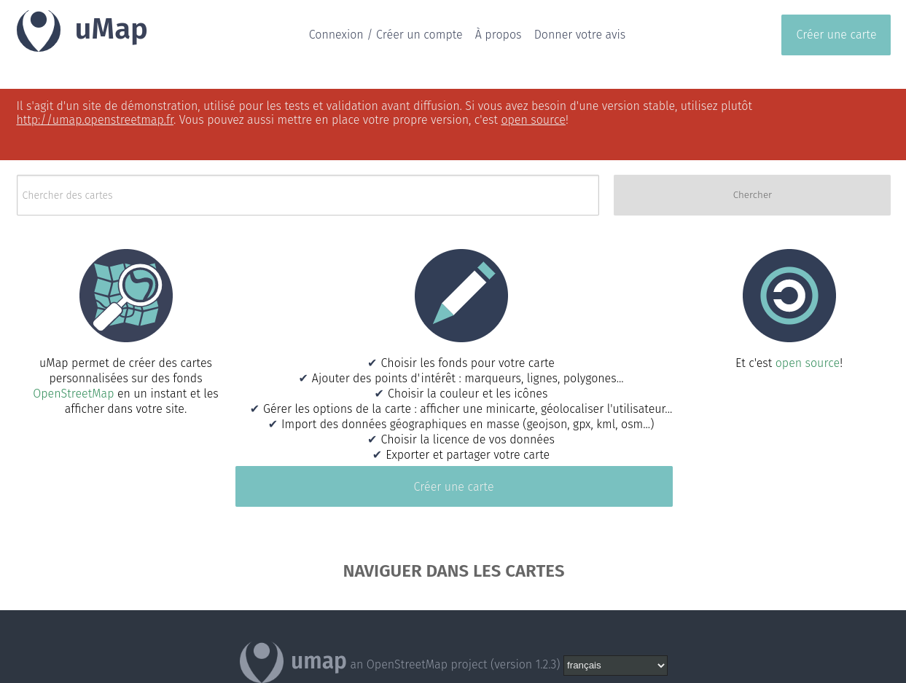{:width="600"}  


## Annexe

### Clé OpenStreetMap 

Pour obtenir les clés OpenStreetMap, il faut que vous ayez enregistré un compte sur [openstreetmap.org](https://openstreetmap.org/).  
Dans « Mes options »  
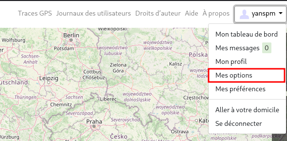{:width="400"}
« paramètres OAuth » ajoutez une « application cliente ».  
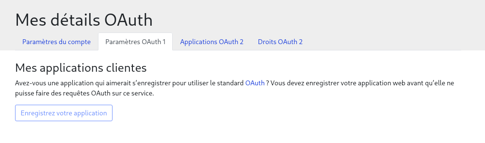{:width="400"}  
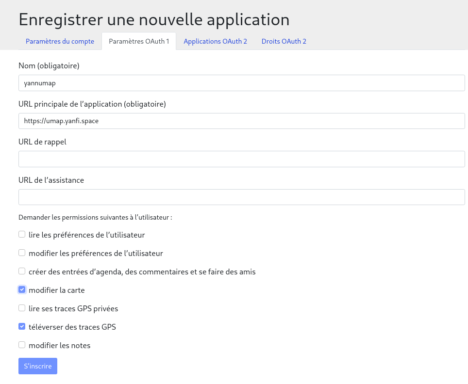{:width="400"}  
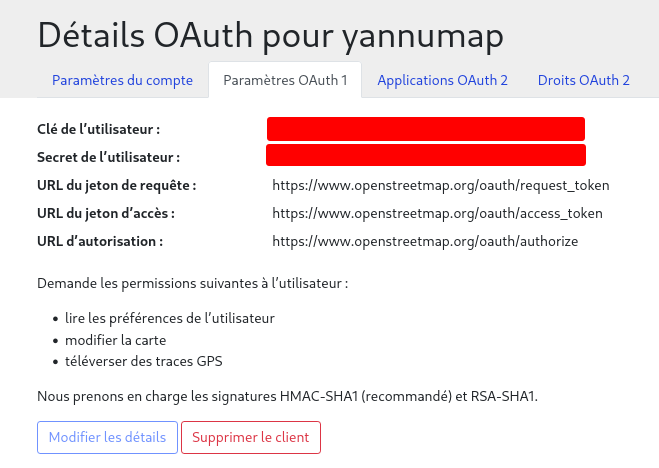{:width="400"}  

### Clé MapQuest

Pour obtenir la clé MapQuest, rendez-vous sur [developer.mapquest.com](https://developer.mapquest.com/plan_purchase/steps/business_edition/business_edition_free/register) et remplissez le formulaire pour obtenir votre clé d’API.  
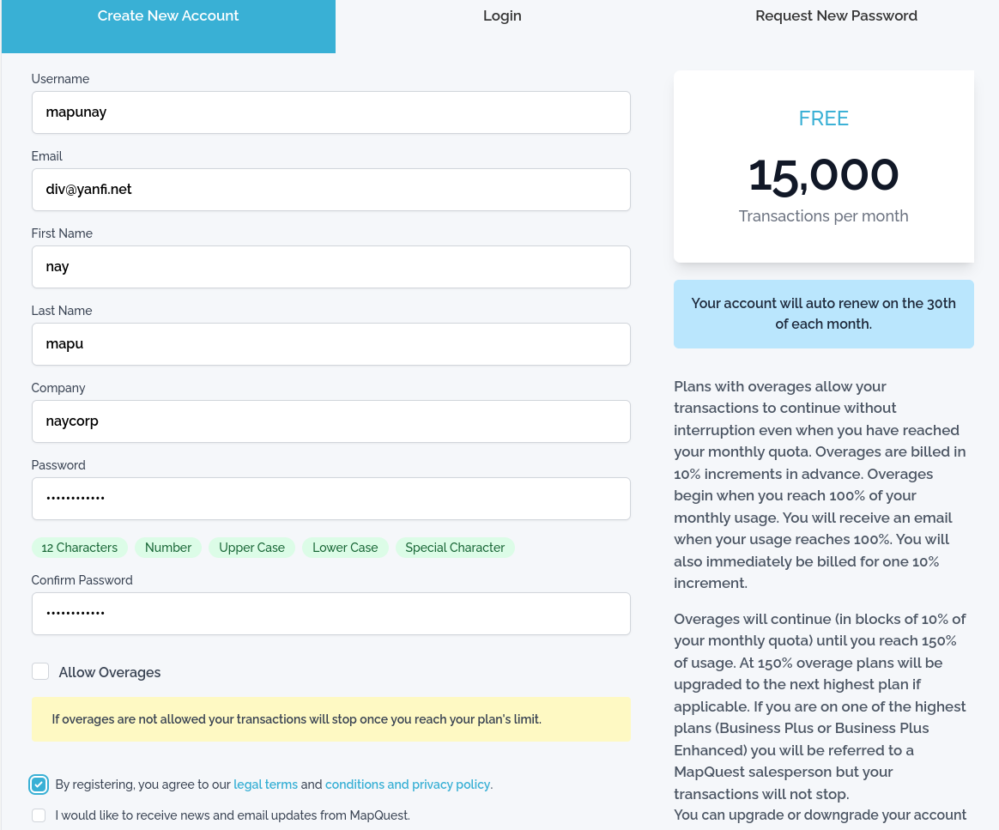{:width="600"}  
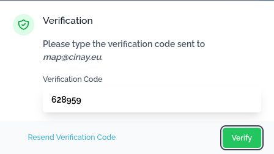{:width="300"}  
Se connecter sur le compte et éditer la clé   
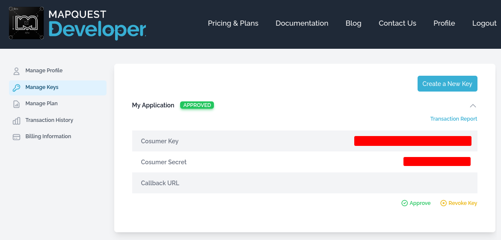{:width="600"}  

