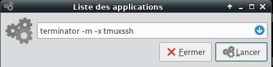
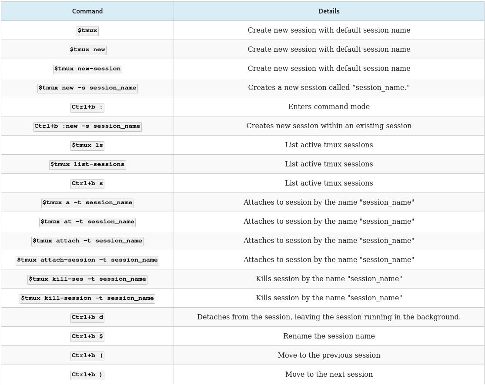
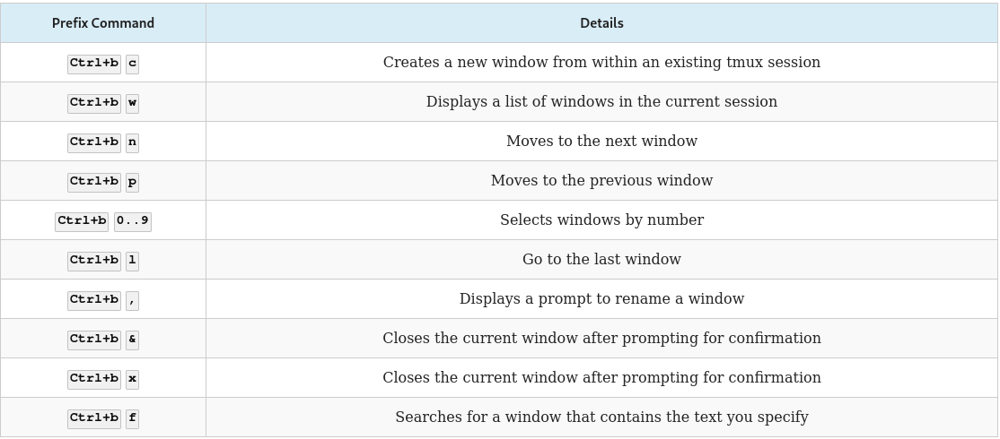
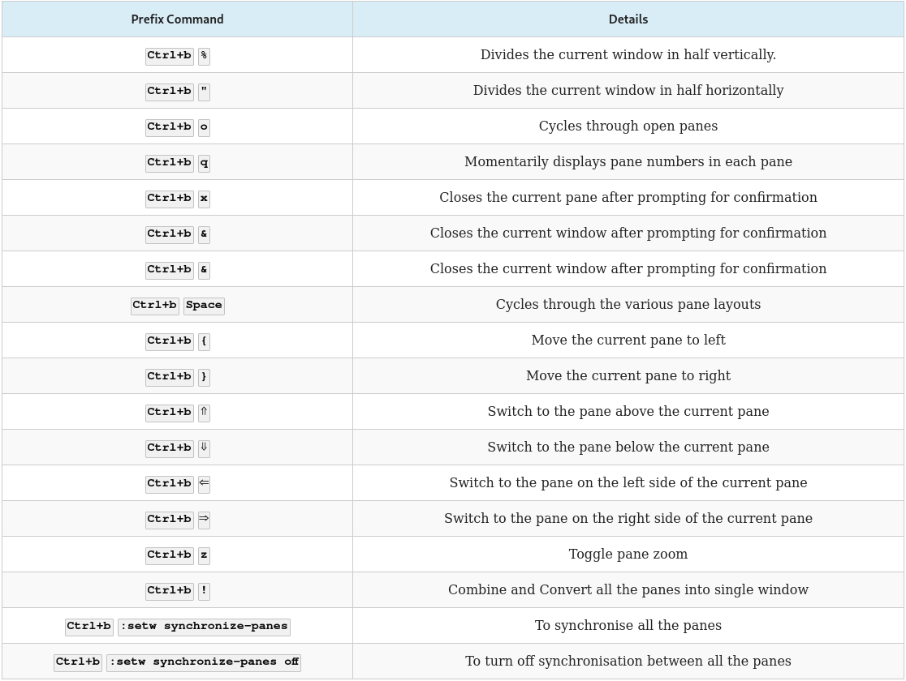

+++
title = 'Tmux , multiplexeur de terminaux'
date = 2022-08-03 00:00:00 +0100
categories = ['cli']
+++


***Tmux**, à l'instar de **screen**, est un multiplexeur de terminaux, outil permettant d'exploiter plusieurs terminaux au sein d'un seul et même affichage.*  

### Installation   

Debian ,installer avec  apt-get install ou apt install (Jessie) depuis un terminal :  
`sudo apt-get install tmux`  
Archlinux/Manjaro ,installer avec  pacman -S  depuis un terminal :  
`sudo pacman -S tmux`  

### Utilisation de tmux 

Depuis le tableau de bord , un terminal ou encore une console saisissez la commande suivante :  
`tmux`  

### Les principaux raccourcis 

**Tmux** fait appel à l'ensemble de touches `<Ctrl> + <b>`   


### Raccourcis de base

  * `<Ctrl> + <b> suivi de <c>` : Créer un nouveau terminal dans la session tmux active
  * `<Ctrl> + <b> suivi de <n>` : Switcher entre les différents terminaux de la session
  * `<Ctrl> + <b> suivi de <X>` : Choisir un terminal spécifique (ou X est le numéro du terminal)
  * `<Ctrl> + <b> suivi de <d>` : Se détacher de la session tmux (lancer `tmux a` pour s'y rattacher)
  * `<Ctrl> + <b> suivi de <,>` : Permet de renommer un terminal
  * `<Ctrl> + <b> suivi de <w>` : Affiche la liste des terminaux disponibles
  * `<Ctrl> + <b> suivi de <t>` : Afficher l’heure dans un terminal
  * `<Ctrl> + <b> suivi de <|>` : Permet de scroller ligne/ligne (avec les fleches du clavier ou la souris) ou même page/page avec PgnUP et PgnDOWN, tapez "q" pour quiter ce mode

### Commandes dans un Split 

  * `<Ctrl> + <b> suivi de <">`  : Split vertical du terminal courant en deux + ouverture d’un terminal dans le nouveau panel
  * `<Ctrl> + <b> suivi de <%>` : Split horizontal du terminal courant en deux + ouverture d’un terminal dans le nouveau panel
  * `<Ctrl> + <b> suivi de <o>` : Switcher entre les terminaux splittés
  * `<Ctrl> + <b> suivi de <espace>` : Changer l’organisation visuelle des terminaux splittés
  * `<Ctrl> + <b> suivi de <Alt> + (flèches directionnelles)` : Reduire, agrandir fenêtre du split
  * `<Ctrl> + <b> suivi de <!>` : Convertir un split en terminal seul
  * `<Ctrl> + <b> suivi de <q>` : Afficher les numéros des terminaux splittés
  * `<Ctrl> + <b>` puis saisissez `:join` : permet de joindre un terminal seul dans un split

Par exemple, après avoir tapé le combo `<Ctrl>+<b>` si vous saisissez  
`:join -v -s 3.0 -p 50`  
Où :
  * `-h ou -v` : pour horizontalement ou verticalement
  * `-s 3.0` : terminal 3 et volet 0 (volet si écran splitté)
  * `-p 50` : occupation à 50% de la fenêtre
Ici donc vous ajouterez verticalement, un terminal numéroté 3 et qui prendra 50% de l’espace total.


### Configuration 

Le fichier tmux.conf permet de rajouter quelques fonctionnalités utiles :  

```
# Permet de définir le shell utilisé par défaut
set-option -g default-shell /usr/bin/zsh
# Permet d'utiliser la souris dans un terminal virtuel 
setw -g mode-mouse on
set -g mouse-resize-pane on
set -g mouse-select-pane on
set -g mouse-select-window on
```

Voir aussi  
  * [Le site officiel de Tmux](http://tmux.sourceforge.net/)  
  * [Se créer des modèles Tmux pour un gain en production](http://tmuxp.readthedocs.org/en/latest/)  
  * [Cette page](http://denisrosenkranz.com/tuto-introduction-a-tmux-terminal-multiplexer/) et [celle-ci](http://denisrosenkranz.com/tuto-personnalisation-de-tmux-via-son-fichier-de-configuration/)  
  * [Mémo tmux en français](http://www.chtiland.fr/page.php?id=informatique:linux:start) + commandes Linux  


### Personnalisation

>Il faut installer l'utilitaire 'xclip' (`sudo pacman -S xclip`) pour la copie du texte sélectionné dans le presse-papier.

Création dans son "home" d'un fichier de configuration  
`nano ~/.tmux.conf`  

```bash
#Configuration de tmux
#Origine : http://denisrosenkranz.com
#Yannick juin 2017
# Copier/Coller par la souris se fait avec la touche "Shift" appuyée
 
##################################
#Changements des raccourcis claviers
##################################
#On change Control +b par Control +x
#set -g prefix C-x
#unbind C-b
#bind C-x send-prefix
 
#On utilise control + flèches pour naviguer entre les terminaux
bind-key -n C-right next
bind-key -n C-left prev
 
#on utilise alt + flèches our naviguer entre les panels
bind-key -n M-left select-pane -L
bind-key -n M-right select-pane -R
bind-key -n M-up select-pane -U
bind-key -n M-down select-pane -D
 
#On change les raccourcis pour faire du split vertical et horizontal
#On utilise la touche "|" (pipe) pour faire un split vertical
bind | split-window -h
#Et la touche "-" pour faire un split horizontal
bind - split-window -v
 
##################################
#Changements pratiques
##################################
#On permet l'utilisation de la souris pour changer de terminal et de panel
set -g mouse on

# Sélection zone par clic gauche souris (texte sélectionné sur fond jaune)
# Après relachement du clic , le texte sélectionné est copié dans le presse-papier 
# Le fond jaune disparaît
set-option -s set-clipboard off
# For emacs copy mode bindings
# Il faut installer l'utilitaire 'xclip' (sudo pacman -S xclip)
bind-key -T copy-mode MouseDragEnd1Pane send-keys -X copy-pipe-and-cancel "xclip -selection clipboard -i"

#Les fenêtres commencent par 1 et non par 0
set -g base-index 1
 
##################################
#Changements visuels
##################################
#On met les panneaux non actif en gris
#set -g pane-border-fg colour244
#set -g pane-border-bg default
 
#On met le panneau actif en rouge
#set -g pane-active-border-fg colour124
#set -g pane-active-border-bg default
 
#On met la barre de status en gris
set -g status-fg colour235
set -g status-bg colour250
#set -g status-attr dim
 
# On surligne les fenêtres actives dans la barre de status en gris foncés
#set-window-option -g window-status-current-fg colour15
#set-window-option -g window-status-current-bg colour0
```

fichier de conf, les changements:  
  * On peut utiliser `ctrl + flèches droite/gauche/haut/bas` pour switcher entre les terminaux
  * On peut utiliser `alt + flèches haut/bas/droite/gauche` pour switcher entre les différents terminaux splittés
  * On peut utiliser la souris pour changer de terminal ou de panneau
  * On peut créer des split verticaux et horizontaux avec les touches | et –

### Synthèse

Lancement:`tmux`  
Ouvrir une nouvelle fenêtre:`[Ctrl+b]+c`  
Afficher la liste des codes touche et leur signification:`[Ctrl+b]+?`  
Passer à la fenêtre suivante:`[Ctrl+b]+n`  
Sélectionner la fenêtre n°2:`[Ctrl+b]+2`  
Choisir la fenêtre dans une liste:`[Ctrl+b]+w` 
Diviser la fenêtre verticalement:`[Ctrl+b]+%`  
Diviser la fenêtre horizontalement:`[Ctrl+b]+"`  
Casser la division:`[Ctrl+b]+!` Notez que tmux transformera alors vos divisions en fenêtres vous ne perdrez donc pas leur contenu  
Sélectionner une division (pane):`[Ctrl+b]+up (down, left or right)`  

Exécuter la même commande dans toutes les fenêtres  
`[Ctrl+b]` puis `:setw synchronize-panes`  
Désactivation  
`[Ctrl+b]` puis `:setw synchronize-panes off`  

### Utilisation à distance via ssh

Il peut être intéressant de se rattacher rapidement à un Tmux sur une machine distant à travers ssh.  

Pour cela, ouvrez le fichier **~/.bash_aliases** pour y ajouter la ligne suivante :  
`function ssh_tmux() { ssh -t "$1" tmux a || ssh -t "$1" tmux; }`  

Utilisation  
`ssh_tmux user@servername`  

Où :  

    * user est votre login  
    * servername l'adresse de la machine à contacter.  

Si vous perdez la connexion réseau, relancer la commande et retrouvez votre terminal Tmux.  

```
# ouvrir session tmux sur le distant
ssh -p 55022 -i /home/yannick/.ssh/shuttle -t yann@yanspm.com tmux
# accès session tmux ouverte
ssh -p 55022 -i /home/yannick/.ssh/shuttle -t yann@yanspm.com tmux a
```

Avec le bash sshm  
`sshm shuttle exe '-t tmux a'`  


## Astuces

* Copier coller avec la souris  
Il faut garder la **touche shift** du clavier enfoncée pour effectuer les opérations de copier/coller avec le clic-droit de la souris.
* [Question Faire défiler la sortie du shell avec la souris dans tmux](http://cooky-web.com/questions/18/faire-defiler-la-sortie-du-shell-avec-la-souris-dans-tmux)
* Supprimer toutes les sessions  
`tmux list-sessions | awk 'BEGIN{FS=":"}{print $1}' | xargs -n 1 tmux kill-session -t`  

## Exemple

On se connecte à plusieurs serveurs distants par SSH. Le terminal divisé en plusieurs fenêtres affiche chaque connexion. On veut lancer la commande depuis le bureau Xfce

Prérequis

* terminator
* tmux

Le script shell **tmuxssh**

```
#!/bin/bash    
# On supprime la session "tmuxServersSSH" si existante                         
sessionTmux=`tmux list-sessions | awk 'BEGIN{FS=":"}{print $1}'`
tmuxServersSSHactif=`echo ${sessionTmux} | grep "tmuxServersSSH" | wc -l`
if [[ ${tmuxServersSSHactif} != 0 ]]
   then  
       # On ferme la session active
       tmux kill-session -t tmuxServersSSH
fi
# Créer session + terminal 
tmux new  -d -s tmuxServersSSH -n TermSSH
# Séparation verticale en 2 du terminal
tmux split-window -h
# Sélection terminal de GAUCHE
tmux selectp -t 0
# Séparation horizontale en 2 fenêtres de taille identique du terminal de GAUCHE
tmux splitw -v -p 50
# Sélection terminal de DROITE
tmux selectp -t 2
# Séparation horizontale en 2 fenêtres de taille identique du terminal de DROITE
tmux splitw -v -p 50
#
# les connexions SSH
tmux selectp -t 0
tmux send-keys -t tmuxServersSSH 'ssh admin@server1.com' C-m
tmux selectp -t 1
tmux send-keys -t tmuxServersSSH 'ssh admin@server2.com' C-m
tmux selectp -t 2
tmux send-keys -t tmuxServersSSH 'ssh admin@server3.com' C-m
tmux selectp -t 3
tmux send-keys -t tmuxServersSSH 'ssh admin@server4.com' C-m
# Afficher la session 
tmux -2 attach-session -d
```

Donner les droits en exécution, puis faire un lien pour une saisie sans le chemin 

    chmod +x tmuxssh
    sudo ln -s tmuxssh /usr/local/bin/tmuxssh

Lancement manuel , Alt F2

  
**-m**  ouvre le terminal taille écran maximun  
**-x ** exécute "tmuxssh"

Le fichier **tmuxssh.desktop** pour lancement depuis le bureau XFCE  
Il doit être placé dans le dossier **~/.local/share/applications/**

```
[Desktop Entry]
Version=1.1
Type=Application
Name=TmuxSSH
Comment=Visualisation serveurs distants
Icon=terminator
TryExec=terminator
Exec=terminator -m -x /usr/local/bin/tmuxssh
Actions=NewWindow;
Categories=GNOME;GTK;System;TerminalEmulator;Utility;
Keywords=terminal;shell;prompt;command;commandline;
StartupNotify=true
```

>Pour le fichier "desktop" , il est préférable de mettre le chemin complet pour le fichier **tmuxssh**

## Tmux cheat sheet

### tmux cheatsheet for sessions



### tmux cheatsheet for windows



### tmux cheatsheet for panes


