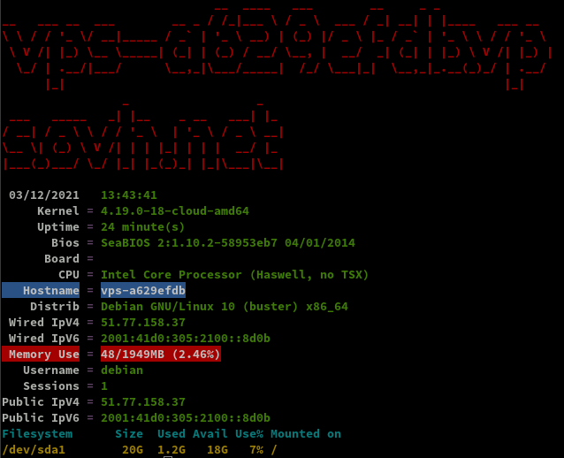
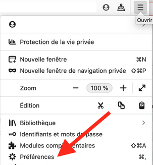
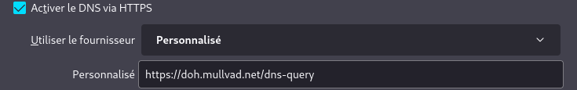
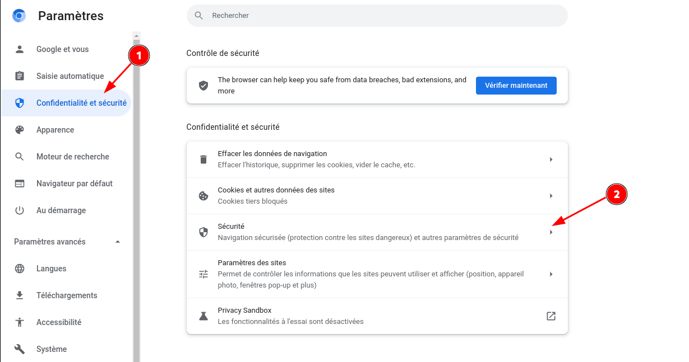

+++
title = 'OVH vps-a629efdb debian 10 - résolveur DNS public sur TLS (DoT) et HTTPS (DoH)'
date = 2022-08-09 00:00:00 +0100
categories = dns
+++
<div class="item">
  <div class="item__image">
    
  </div>
  <div class="item__content">
    <div class="item__header">
      <h4>Le DNS</h4>
    </div>
    <div class="item__description">
      <p>Les requêtes DNS sont envoyées en texte brut, ce qui signifie que tout le monde peut les lire. Le DNS sur HTTPS et le DNS sur TLS chiffrent les requêtes et les réponses du DNS pour que la navigation des utilisateurs reste sécurisée et privée. Cependant, les deux approches ont leurs avantages et leurs inconvénients.</p>
    </div>
  </div>
</div>
<br>
<div class="item">
  <div class="item__image">
    
  </div>
  <div class="item__content">
    <div class="item__header">
      <h4>Le DNS sur HTTPS et le DNS sur TLS</h4>
    </div>
    <div class="item__description">
      <p><u>Le DNS sur TLS et le DNS sur HTTPS</u> sont deux normes développées pour le chiffrement du trafic DNS en texte brut afin d'empêcher les parties malveillantes, les annonceurs, les FAI et autres de pouvoir interpréter les données. Pour poursuivre l'analogie, ces normes visent à enfermer les cartes postales envoyées par courrier dans une enveloppe, pour que quiconque puisse envoyer une carte postale sans craindre les indiscrétions d'un tiers.</p>
    </div>
  </div>
</div>

- [OVH VPS Serveur](#ovh-vps-serveur)
    - [Debian 10](#debian-10)
    - [OpenSSH, clé et script](#openssh-clé-et-script)
    - [Outils, scripts motd et ssh_rc_bash](#outils-scripts-motd-et-ssh_rc_bash)
    - [Parefeu](#parefeu)
- [Dns DoT DoH](#dns-dot-doh)
    - [A - Résolveur Unbound](#a---résolveur-unbound)
    - [B - Frontal DNS](#b---frontal-dns)
    - [C - Gestion des certificats (Acme)](#c---gestion-des-certificats-acme)
    - [D - Test résolveur (outil Homer)](#d---test-résolveur-outil-homer)
    - [E - Unbound : Ajout liste de blocage](#e---unbound-ajout-liste-de-blocage)
    - [F - Utilisez votre résolveur](#f---utilisez-votre-résolveur)
        - [Firefox](#firefox)
        - [Chromium/Brave/Iridium](#chromiumbraveiridium)
- [Annexe](#annexe)
    - [Corriger problème DNS privé Android](#corriger-problème-dns-privé-android)
    - [Vérifications](#vérifications)

## OVH VPS Serveur


<div class="item">
   <div class="item__image">
     <br>
   </div>
  <div class="item__content">
    <div class="item__header">
      <h4>OVH : VPS KVM-256</h4>
    </div>
    <div class="item__description">
		<ul>
		  <li>Hostname : nsdyanone</li>
		  <li>2 GB RAM</li>
		  <li>20 GB Storage</li>
		  <li>100 Mbit/s Bandwidth</li>
		  <li>1 x vCPU Core</li>
		  <li>1 x IPv4 Address 51.77.158.37</li>
		  <li>1 x IPv6 Address 2001:41d0:305:2100::8d0b</li>
		</ul>
    </div>
  </div>
</div>

### Debian 10

{:height="80"}

Connexion ssh

    ssh debian@51.77.158.37

Mise à jour et reboot

    sudo apt update && sudo apt -y upgrade
    sudo reboot

Reconnexion via ssh

**Réseau**

    ip a

```
1: lo: <LOOPBACK,UP,LOWER_UP> mtu 65536 qdisc noqueue state UNKNOWN group default qlen 1000
    link/loopback 00:00:00:00:00:00 brd 00:00:00:00:00:00
    inet 127.0.0.1/8 scope host lo
       valid_lft forever preferred_lft forever
    inet6 ::1/128 scope host 
       valid_lft forever preferred_lft forever
2: eth0: <BROADCAST,MULTICAST,UP,LOWER_UP> mtu 1500 qdisc pfifo_fast state UP group default qlen 1000
    link/ether fa:16:3e:53:eb:05 brd ff:ff:ff:ff:ff:ff
    inet 51.77.158.37/32 brd 51.77.158.37 scope global dynamic eth0
       valid_lft 86384sec preferred_lft 86384sec
    inet6 2001:41d0:305:2100::8d0b/56 scope global 
       valid_lft forever preferred_lft forever
    inet6 fe80::f816:3eff:fe53:eb05/64 scope link 
       valid_lft forever preferred_lft forever
```

**Disques**

    df -h

```
Filesystem      Size  Used Avail Use% Mounted on
udev            967M     0  967M   0% /dev
tmpfs           195M  2.8M  193M   2% /run
/dev/sda1        20G  1.1G   18G   6% /
tmpfs           975M     0  975M   0% /dev/shm
tmpfs           5.0M     0  5.0M   0% /run/lock
tmpfs           975M     0  975M   0% /sys/fs/cgroup
tmpfs           195M     0  195M   0% /run/user/1000

```

**Versions noyau et debian**  

    uname -a && cat /etc/debian_version

Linux vps-a629efdb 4.19.0-18-cloud-amd64 #1 SMP Debian 4.19.208-1 (2021-09-29) x86_64 GNU/Linux  
10.11

Modifier mot de passe sur utilisateur existant "debian"

    passwd debian

Locales : `locales-all installed`

Zone et date Europe/Paris

    sudo dpkg-reconfigure tzdata

```
Current default time zone: 'Europe/Paris'
Local time is now:      Fri Dec  3 13:24:30 CET 2021.
Universal Time is now:  Fri Dec  3 12:24:30 UTC 2021.
```

Fermer la connexion ssh

### OpenSSH, clé et script

{:height="80"}  
**connexion avec clé**  
<u>sur l'ordinateur de bureau</u>
Générer une paire de clé curve25519-sha256 (ECDH avec Curve25519 et SHA2) nommé **ovh-vps-a629efdb** pour une liaison SSH avec le serveur KVM.  

    ssh-keygen -t ed25519 -o -a 100 -f ~/.ssh/ovh-vps-a629efdb

Envoyer la clé publique sur le serveur KVM   

    ssh-copy-id -i ~/.ssh/ovh-vps-a629efdb.pub debian@51.77.158.37

<u>sur le serveur KVM</u>
On se connecte  

    ssh debian@51.77.158.37

Vérifier le contenu de la clé publique dans /home/$USER/.ssh/authorized_keys  

    cat .ssh/authorized_keys

Modifier la configuration serveur SSH pour la prise en charge de la clé  

    sudo nano /etc/ssh/sshd_config  

Modifier

```conf
Port 55037
PasswordAuthentication no 
```

Relancer openSSH  

    sudo systemctl restart sshd

Accès depuis le poste distant avec la clé privée  

    ssh -p 55037 -i ~/.ssh/ovh-vps-a629efdb debian@51.77.158.37

### Outils, scripts motd et ssh_rc_bash

Installer utilitaires  

    sudo apt install rsync curl tmux jq figlet git dnsutils tree -y


Motd

    sudo rm /etc/motd && sudo nano /etc/motd

```
                             __  ___  ___        __     _  _    
 __ __ _ __  ___ ___  __ _  / / |_  )/ _ \ ___  / _| __| || |__ 
 \ V /| '_ \(_-<|___|/ _` |/ _ \ / / \_, // -_)|  _|/ _` || '_ \
  \_/ | .__//__/     \__,_|\___//___| /_/ \___||_|  \__,_||_.__/
    __|_| _ __  ___    ___ __ __| |_      _ _   ___ | |_        
   _\ V /| '_ \(_-< _ / _ \\ V /| ' \  _ | ' \ / -_)|  _|       
  (_)\_/ | .__//__/(_)\___/ \_/ |_||_|(_)|_||_|\___| \__|       
     ___ |_|   ____  ____   _  ___  ___     ____ ____           
    | __|/ |  |__  ||__  | / || __|( _ )   |__ /|__  |          
    |__ \| | _  / /   / /_ | ||__ \/ _ \ _  |_ \  / /           
    |___/|_|(_)/_/   /_/(_)|_||___/\___/(_)|___/ /_/            
                                                                
```


Script **ssh_rc_bash**  
>**ATTENTION!!! Les scripts sur connexion peuvent poser des problèmes pour des appels externes autres que ssh**

    wget https://static.xoyaz.xyz/files/ssh_rc_bash
    chmod +x ssh_rc_bash # rendre le bash exécutable
    ./ssh_rc_bash        # exécution



### Parefeu

{:height="80"}  
*UFW, ou pare - feu simple , est une interface pour gérer les règles de pare-feu dans Arch Linux, Debian ou Ubuntu. UFW est utilisé via la ligne de commande (bien qu'il dispose d'interfaces graphiques disponibles), et vise à rendre la configuration du pare-feu facile (ou simple).*

Installation **Debian / Ubuntu**

    sudo apt install ufw

*Par défaut, les jeux de règles d'UFW sont vides, de sorte qu'il n'applique aucune règle de pare-feu, même lorsque le démon est en cours d'exécution.*   

Les règles pour ssh dot doh et certbot 

    sudo ufw allow 853/tcp  # dot
    sudo ufw allow 443/tcp  # doh
    sudo ufw allow 80/tcp  # acme/certbot
    sudo ufw allow 55037/tcp  # ssh

Activer le parefeu

    sudo ufw enable

```
Command may disrupt existing ssh connections. Proceed with operation (y|n)? y
Firewall is active and enabled on system startup
```

Status

     sudo ufw status verbose

```
Status: active
Logging: on (low)
Default: deny (incoming), allow (outgoing), disabled (routed)
New profiles: skip

To                         Action      From
--                         ------      ----
853/tcp                    ALLOW IN    Anywhere                  
443/tcp                    ALLOW IN    Anywhere                  
55037/tcp                  ALLOW IN    Anywhere                  
80/tcp                     ALLOW IN    Anywhere                  
853/tcp (v6)               ALLOW IN    Anywhere (v6)             
443/tcp (v6)               ALLOW IN    Anywhere (v6)             
55037/tcp (v6)             ALLOW IN    Anywhere (v6)             
80/tcp (v6)                ALLOW IN    Anywhere (v6)             
```

Assurez vous que les ports 853 (DoT), 443 (DoH) et 80 (génération certificats) sont bien ouverts sur votre machine.

Dans le cadre de la mise en place d'un résolveur public, vous possédez un nom
de domaine auquel sont associés les enregistrement `A` et `AAAA` éventuels
correspondant à l'adresse IP sur laquelle sera installé le résolveur DoT/DoH.


La solution technique retenue ici pour le résolveur DoT/DoH est composée d'un
frontal dnsdist qui assure la terminaison des sessions TLS et HTTPS et transmet
les requêtes vers un résolveur DNS unbound installé en local sur la machine.

## Dns DoT DoH

DNS over TLS (DoT) et DNS over HTTPS (DoH) sont deux protocoles standardisés
par l'IETF dans les [RFC 7858](https://www.rfc-editor.org/rfc/rfc7858) et
[RFC 8484](https://www.rfc-editor.org/rfc/rfc8484) respectivement. Ces deux
protocoles ont pour but de sécuriser les requêtes DNS entre un client et le
résolveur (encapsulation du protocole DNS
dans une session TLS pour DoT ou HTTPS pour DoH.)

### A - Résolveur Unbound

{:height="80"}  
Commençons par installer et configurer le résolveur DNS. Il existe plusieurs
logiciels pour faire de la résolution comme [BIND 9](https://www.isc.org/bind),
[Knot Resolver](https://www.knot-resolver.cz) ou encore
[Unbound](https://nlnetlabs.nl/projects/unbound/about/). Nous avons choisi
d'utiliser Unbound et cette partie documente comment installer et configuer ce
résolveur.

En règle général Unbound est disponible dans les dépôts des distributions, l'installer depuis le gestionnaire de paquet de votre machine.

```
sudo apt-get install unbound
```

Maintenant que Unbound est installé, il ne reste plus qu'à le **configurer** avant
de démarrer le service.

Il s'agit du résolveur DNS, celui ci n'est accessible que depuis la machine
locale via le port 53.  
Modifier le fichier de configuration par défaut
`/etc/unbound/unbound.conf`. 

Sauvegarder la
configuration par défaut :

```
sudo cp /etc/unbound/unbound.conf /etc/unbound/unbound.conf.orig
```

Puis modifier le fichier `/etc/unbound/unbound.conf` avec le contenu suivant :

```
server:
    # ne rien enregistrer dans les journaux hormis les erreurs
    verbosity: 0

    # n'écouter que sur l'interface locale en IPv4
    # unbound nécessite d'être relancé si modifié
    interface: 127.0.0.1

    port: 53

    # refuser tout le monde sauf les connexions locales (pas forcément
    # nécessaire vu que le serveur n'écoute que sur la boucle locale en IPv4)
    access-control: 0.0.0.0/0 refuse
    access-control: 127.0.0.1/32 allow

    # par défaut, unbound ne log pas les requêtes ni les réponses
    # on peut le rappeler au cas où
    log-queries: no
    log-replies: no

    # imposer la QNAME minimisation (RFC 7816)
    qname-minimisation: yes
    # même si le serveur faisant autorité ne le veut pas
    #   après discussion, il est possible que cette option ne soit
    #   pas recommandée dans le cadre d'un résolveur ouvert
    qname-minimisation-strict: yes
```

Enregistrer le contenu de ce fichier dans `/etc/unbound/unbound.conf` ,
 vérifier la validité du fichier de configuration avec la commande
suivante :

```
sudo unbound-checkconf /etc/unbound/unbound.conf
#    unbound-checkconf: no errors in /etc/unbound/unbound.conf
```

Toutes les règles disponibles sont détaillées dans le manuel `man 5
unbound.conf` ou [dans le manuel en
ligne](https://nlnetlabs.nl/documentation/unbound/unbound.conf/).

Démarrer le résolveur.

```
sudo systemctl start unbound.service
```

S'assurer que tout fonctionne bien à l'aide de la commande
`dig` disponible dans le paquet `bind9-dnsutils` ou `dnsutils`. Pour cela il
suffit de spécifier l'adresse de notre résolveur, ici `127.0.0.1` ou `::1` et
d'effectuer une requête DNS. Ici on demande à Unbound de récupérer
l'enregistrement `AAAA` associé au nom de domaine `afnic.fr`.

```
sudo apt-get install dnsutils # les outils si non installés
dig @127.0.0.1 AAAA afnic.fr
```

Résultat commande 

```
; <<>> DiG 9.11.5-P4-5.1+deb10u6-Debian <<>> @127.0.0.1 AAAA afnic.fr
; (1 server found)
;; global options: +cmd
;; Got answer:
;; ->>HEADER<<- opcode: QUERY, status: NOERROR, id: 63150
;; flags: qr rd ra ad; QUERY: 1, ANSWER: 1, AUTHORITY: 0, ADDITIONAL: 1

;; OPT PSEUDOSECTION:
; EDNS: version: 0, flags:; udp: 4096
;; QUESTION SECTION:
;afnic.fr.			IN	AAAA

;; ANSWER SECTION:
afnic.fr.		600	IN	AAAA	2001:67c:2218:302::51:231

;; Query time: 564 msec
;; SERVER: 127.0.0.1#53(127.0.0.1)
;; WHEN: Fri Dec 03 13:52:40 CET 2021
;; MSG SIZE  rcvd: 65
```

Une réponse est bien renvoyée. Le résolveur fonctionne.Vérifier que tout est opérationnel en IPv4, et en utilisant UDP et TCP.

```
$ dig +notcp @127.0.0.1 AAAA afnic.fr  # connexion UDP en IPv4 au résolveur
$ dig +tcp @127.0.0.1 AAAA afnic.fr    # connexion TCP en IPv4 au résolveur
```

À ce stade, un résolveur Unbound est configuré en local et écoute sur le port
`53`. Il peut donc être utilisé pour résoudre toutes les requêtes en provenance
de la machine.


### B - Frontal DNS

Cette section s'attarde sur l'installation et la configuration d'un frontal
DoT/DoH qui transmettra les requêtes DNS à un résolveur local écoutant sur le
port 53 de l'interface local `127.0.0.1` (IPv4).

Ici `dnsdist` se trouve être une très bonne solution pour remplir ce rôle.

Si vous désiriez utiliser la dernière version de dnsdist,
[PowerDNS](https://www.powerdns.com) qui développpe le logiciel propose et
maintient [ses propres dépôts pour Debian, Raspbian, Ubuntu et
CentOS](https://repo.powerdns.com/).

Ainsi, voici comment installer la dernière version de dnsdist, actuellement
`1.6.0`, tel que défini sur [le site de PowerDNS](https://repo.powerdns.com/)

```
# récupération du nom de la distribution et de son ID
# ATTENTION: le fichier /etc/os-release peut être différent selon la distribution
export D_NAME=$(. /etc/os-release; echo ${VERSION_CODENAME})
export D_ID=$(. /etc/os-release; echo ${ID})

# ajout du dépôt aux sources
# Debian / Ubuntu
echo "deb [arch=amd64] http://repo.powerdns.com/${D_ID} ${D_NAME}-dnsdist-16 main" | sudo tee /etc/apt/sources.list.d/pdns.list

# gestion de l'étiquette et de la priorité du nouveau dépôt
sudo tee /etc/apt/preferences.d/dnsdist << EOF
Package: dnsdist*
Pin: origin repo.powerdns.com
Pin-Priority: 600
EOF

# ajout de la clé publique de PowerDNS
curl https://repo.powerdns.com/FD380FBB-pub.asc | sudo apt-key add -

# mise à jour des dépôts
sudo apt-get update

# installation de dnsdist
sudo apt-get install dnsdist
```


**Configuration fichier ** `/etc/dnsdist/dnsdist.conf` pour une utilisation avec les certificats qui seront générés par **acme** dans le dossier `/etc/dnsdist` 

```
-- le résolveur DoT/DoH est public, on accepte tout le monde en IPv4 et IPv6
setACL({'0.0.0.0/0', '[::]/0'})

-- serveur DNS où transférer les requêtes entrantes
newServer({address='127.0.0.1:53', name='Unbound (local)'})

-- configuration de DoT
-- modifier l'IPv4 et l'IPv6 en conséquence
addTLSLocal('51.77.158.37:853', '/etc/dnsdist/dns-server.crt', '/etc/dnsdist/dns-server.key', {minTLSVersion='tls1.2'})
addTLSLocal('[2001:41d0:305:2100::8d0b]:853', '/etc/dnsdist/dns-server.crt', '/etc/dnsdist/dns-server.key', {minTLSVersion='tls1.2'})

-- configuration de DoH
-- modifier l'IPv4 et l'IPv6 en conséquence
addDOHLocal('51.77.158.37:443', '/etc/dnsdist/dns-server.crt', '/etc/dnsdist/dns-server.key', '/', {minTLSVersion='tls1.2'})
addDOHLocal('[2001:41d0:305:2100::8d0b]:443', '/etc/dnsdist/dns-server.crt', '/etc/dnsdist/dns-server.key', '/', {minTLSVersion='tls1.2'})

-- limitation du trafic à 100 requêtes par seconde
-- plus d'info en <https://dnsdist.org/advanced/qpslimits.html>
addAction(MaxQPSIPRule(100), DropAction())
```

L'ensemble des options de configuration est détaillé [sur le site de dnsdist](https://dnsdist.org/index.html).

Vérifier que le fichier de configuration est valide avec la
commande :

```
dnsdist --check-config
# Configuration '/etc/dnsdist/dnsdist.conf' OK!
```

dnsdist est donc configuré pour écouter sur l'interface publique de la machine
sur les ports 443 (DoH) et 853 (DoT). Toutes les requêtes sont ensuite relayées
à un serveur écoutant le port 53 sur l'interface locale.

Pour l'instant les fichiers `dot-server.crt`, `dot-server.key`,
`doh-server.crt` et `doh-server.key` n'existent pas. Il est nécessaire de les
générer. Cela peut se faire avec `openssl` dans le cas de certificats
auto-signés. Il est aussi possible de passer par une autorité de certification,
ceci est le but de la prochaine partie.

>Remarque: attention aux droits des fichiers du certificat et de la clé, l'utilisateur ou le groupe `dnsdist` (parfois `_dnsdist`, vérifier le contenu du fichier `/etc/group` avec la commande

        grep dnsdist /etc/group

`_dnsdist:x:115:`

Certboot : doit avoir les droits en lecture dessus

    sudo chown -R root:_dnsdist /etc/dnsdist 

Acme : Les droits en écriture à l'utilisateur sur le dossier `/etc/dnsdist`

    sudo chown $USER -R /etc/dnsdist


### C - Gestion des certificats (Acme)

{:height="50"}

Afin de pouvoir proposer une connexion sécurisée au résolveur, il est
nécessaire de posséder au moins un certificat par service. On peut générer ses propres certificats auto-signés. Cependant pour
augmenter la confiance dans le service proposé, il est intéressant de s'appuyer
sur un tiers de confiance, l'[autorité de
certification](https://fr.wikipedia.org/wiki/Autorit%C3%A9_de_certification).
Nous allons utiliser [Let's Encrypt](https://letsencrypt.org/) comme autorité
de certification. Let's Encrypt propose par ailleurs un petit utilitaire en
ligne de commande [certbot](https://certbot.eff.org) pour générer et gérer ses
certificats.
La génération d'un certificat via cet utilitaire repose sur un challenge que
doit résoudre la machine.

Installation client acme.sh

```
cd ~
sudo apt install socat -y # prérequis
git clone https://github.com/acmesh-official/acme.sh.git
cd acme.sh
./acme.sh --install 
```

Fermer le terminal, puis le réouvrir et vérifier

    acme -h

Création des certificats

    export OVH_AK="xxxxxxxxxxxxxx"
    export OVH_AS="yyyyyyyyyyyyyyyyyyyyyyyy"

Génération des certificats dans le dossier `/etc/dndist` avec une chaîne préférentielle pour android

    acme.sh --dns dns_ovh --server letsencrypt --issue --keylength ec-384 -d 'doh.ouestline.xyz' -d 'dot.ouestline.xyz' --preferred-chain 'ISRG Root X1' --key-file /etc/dnsdist/dns-server.key --fullchain-file /etc/dnsdist/dns-server.crt

```
[vendredi 3 décembre 2021, 14:25:41 (UTC+0100)] Your cert is in: /home/debian/.acme.sh/doh.ouestline.xyz_ecc/doh.ouestline.xyz.cer
[vendredi 3 décembre 2021, 14:25:41 (UTC+0100)] Your cert key is in: /home/debian/.acme.sh/doh.ouestline.xyz_ecc/doh.ouestline.xyz.key
[vendredi 3 décembre 2021, 14:25:41 (UTC+0100)] The intermediate CA cert is in: /home/debian/.acme.sh/doh.ouestline.xyz_ecc/ca.cer
[vendredi 3 décembre 2021, 14:25:41 (UTC+0100)] And the full chain certs is there: /home/debian/.acme.sh/doh.ouestline.xyz_ecc/fullchain.cer
[vendredi 3 décembre 2021, 14:25:41 (UTC+0100)] Installing key to: /etc/dnsdist/dns-server.key
[vendredi 3 décembre 2021, 14:25:41 (UTC+0100)] Installing full chain to: /etc/dnsdist/dns-server.crt
```

A la première création des certificats

    sudo chmod 644 /etc/dnsdist/dns-*

Relancer manuellement le service dnsdist

    sudo systemctl restart dnsdist

**Vérification expiration certificat et mise à jour automatique** dans le dossier `/etc/dndist` + relance service `dnsdist`

Remplacer la tâche utilisateur 
$ crontab -e # edite tous les jobs de l’utilisateur en cours  

    18 0 * * * "$HOME/.acme.sh"/acme.sh --cron --home "$HOME/.acme.sh" --renew-hook "$HOME/.acme.sh/acme.sh --ecc --install-cert -d 'doh.ouestline.xyz' -d 'dot.ouestline.xyz' --preferred-chain 'ISRG Root X1' --key-file /etc/dnsdist/dns-server.key --fullchain-file /etc/dnsdist/dns-server.crt --reloadcmd 'sudo systemctl restart dnsdist'" > /dev/null

### D - Test résolveur (outil Homer)

Pour s'assurer que le résolveur fonctionne de manière nominal, on va utiliser Homer.

Homer est un outil développé par l'Afnic, qui permet de tester et débugger un
résolveur DoT/DoH en ligne de commande.

Homer est un logiciel libre et le code est disponible [sur la forge logicielle
Framagit](https://framagit.org/bortzmeyer/homer).

L'outil nécessite python3, et certains modules associés :

```
sudo apt-get install python3 python3-pycurl python3-dnspython python3-openssl python3-netaddr  # debian
yay -S python-pycurl python-dnspython python-pyopenssl python-netaddr # archlinux
```

Il ne reste plus qu'à récupérer Homer

    git clone https://framagit.org/bortzmeyer/homer
    cd homer

et à le lancer 

    ./remoh.py https://doh.ouestline.xyz afnic.fr


```
id 0
opcode QUERY
rcode NOERROR
flags QR RD RA AD
edns 0
payload 4096
option ECS ::/0 scope/0
;QUESTION
afnic.fr. IN AAAA
;ANSWER
afnic.fr. 600 IN AAAA 2001:67c:2218:302::51:231
;AUTHORITY
;ADDITIONAL

Total elapsed time: 0.06 seconds
```

    ./remoh.py --dot dot.ouestline.xyz framagit.org

```
id 33407
opcode QUERY
rcode NOERROR
flags QR RD RA AD
edns 0
payload 4096
option ECS ::/0 scope/0
;QUESTION
framagit.org. IN AAAA
;ANSWER
framagit.org. 3600 IN AAAA 2a01:4f8:231:4c99::75
;AUTHORITY
;ADDITIONAL

Total elapsed time: 0.15 seconds
```

Homer peut aussi être utilisé pour tester la bonne configuration du résolveur :

```
$ ./remoh.py --check --dot dot.ouestline.xyz framasoft.org
OK

$ ./remoh.py --check https://doh.ouestline.xyz chatons.org
OK
```

Dans le cas où votre résolveur est mal configuré, Homer s'arrête est affiche
l'erreur rencontrée. Par exemple pour un certificat non configuré :

```
$ ./remoh.py --dot 198.51.100.19 framasoft.org
198.51.100.19: Certificate error: "198.51.100.19 is not in the certificate
Could not connect to "198.51.100.19"
```

On peut demander à Homer de ne pas vérifier le certificat
avec l'option `-k | --insecure` :

```
$ ./remoh.py --insecure --dot 198.51.100.19 framasoft.org
id 35430
opcode QUERY
rcode NOERROR
flags QR RD RA
edns 0
payload 4096
option ECS ::/0 scope/0
;QUESTION
framasoft.org. IN AAAA
;ANSWER
framasoft.org. 3600 IN AAAA 2a01:4f8:141:3421::212
;AUTHORITY
;ADDITIONAL

Total elapsed time: 0.04 seconds (41.83 ms/request)
```

### E - Unbound : Ajout liste de blocage

* [Listes de blocage DNS](https://sebsauvage.net/wiki/doku.php?id=dns-blocklist)
* [Bloquer la publicité grâce au DNS](https://www.shaftinc.fr/blocage-pubs-unbound.html)

Modification pour avoir la liste <https://sebsauvage.net/hosts/hosts> au format suivant (exemple)

    local-zone: "publicite.example" static
    local-zone: "mouchard.domaine.example" static

Bash pour récupérer la liste puis la transformer au format unbound

```bash
sudo -s
cd /etc/unbound/unbound.conf.d
wget -O- https://sebsauvage.net/hosts/hosts | grep '^0\.0\.0\.0' | grep -v '^0\.0\.0\.0 0\.0\.0\.0' | awk '{print "local-zone: \""$2"\" static"}' > adslist

```

On ajoute la prise en charge de cette liste de domaines à bloquer dans notre fichier de configuration d’Unbound

    sudo nano /etc/unbound/unbound.conf

```bash
#Ads blocking
include: "/etc/unbound/unbound.conf.d/adslist"
```

On redémarre le service:

    sudo systemctl restart unbound

Test sous homer

    ./remoh.py https://doh.ouestline.xyz doubleclick.net

```
id 0
opcode QUERY
rcode NXDOMAIN
flags QR AA RD RA
edns 0
payload 4096
;QUESTION
doubleclick.net. IN AAAA
;ANSWER
;AUTHORITY
;ADDITIONAL

Total elapsed time: 0.05 seconds
```

Créer un bash pour la mise à jour de liste

    sudo nano /home/debian/adslist.sh

```
#!/bin/sh

# Mise à jour liste  blocage pub et tracker

/usr/bin/wget -O- https://sebsauvage.net/hosts/hosts | grep '^0\.0\.0\.0' | grep -v '^0\.0\.0\.0 0\.0\.0\.0' | awk '{print "local-zone: \""$2"\" static"}' > /etc/unbound/unbound.conf.d/adslist

# relance unbound
systemctl restart unbound
```

Les droits

    sudo chmod +x /home/debian/adslist.sh

Mise à jour tous les lundi à 3h00 du matin de la liste 

    sudo crontab -e

```
# Mise à jour tous les lundi à 3h00 du matin de la liste 
0 3 * * 1 /usr/bin/sh /home/debian/adslist.sh
```

### F - Utilisez votre résolveur

Vous voilà désormais en possession d'un résolveur DoT/DoH public.

DoT/DoH est supporté par plusieurs navigateurs :  
[Firefox](https://support.mozilla.org/fr/kb/dns-via-https-firefox),
[Chrome](https://blog.chromium.org/2020/05/a-safer-and-more-private-browsing-DoH.html),
Edge et [Opera](https://blogs.opera.com/desktop/2019/10/opera-65-beta/)  
mais également par plusieurs systèmes d'exploitation :  
[Android](https://android-developers.googleblog.com/2018/04/dns-over-tls-support-in-android-p.html)
et prochainement iOS / MacOS et Windows 10.

Les indications pour configurer son navigateur peuvent varier. Nous vous
laissons le soin de vous renseigner selon les outils que vous utilisez.

#### Firefox

1. Activation et désactivation manuelles du DNS via HTTPS
2. Vous pouvez activer et désactiver le DoH dans les paramètres de connexion de Firefox :
    * Cliquez sur le bouton de menu (en haut à droite, symbole 3 traits superposés)  "Ouvrir le menu de l'application" et sélectionnez **Préférences**  
{:width="200"}
    * Dans le panneau Général, descendez jusqu’à la section **Paramètres réseau** et cliquez sur le bouton **Paramètres...**
3. Dans la boîte de dialogue qui s’ouvre, descendez jusqu’à **Activer le DNS via HTTPS**.
    * **Activer** : cocher la case à côté d’**Activer le DNS via HTTPS** pour l’activer. Choisissez un fournisseur ou ajoutez un fournisseur personnalisé.  
{:width="500"}  
Si personnalisé, saisir l'adresse du serveur doh ,ici <https://doh.mullvad.net/dns-query> car le navigateur est connecté via wireguard mullvad ou <https://doh.ouestline.xyz>  
    * **Désactiver** : décocher la case à côté d’**Activer le DNS via HTTPS** pour le désactiver.  
4. Cliquez sur OK pour enregistrer vos modifications et fermer la fenêtre. 

#### Chromium/Brave/Iridium

Si vous utilisez le navigateur Brave, voici comment activer le DNS over HTTPS. Ouvrez le navigateur et suivez les étapes suivantes :

1 - Ouvrez le menu en haut à droite et cliquez sur "Paramètres".  
{:width="300"}  
2 - 2 - Sur la gauche, cliquez sur "Confidentialité et sécurité" et enfin sur "Sécurité".  
  
3 - Au sein des paramètres de sécurité, il y a un paramètre nommé "Utiliser un DNS sécurisé" : cochez la case "Avec" et choisissez un fournisseur dans la liste ou alors prenez "Personnalisé" pour en utiliser un autre.  
  

## Annexe

### Corriger problème DNS privé Android

[Let's Encrypt and DNS over TLS Hell on Android](https://ikarus.sg/lets-encrypt-dot-android/)

***Problèmes** avec le DNS privé d'Android sur TLS via Adguard ou PiHole utilisant des certificats TLS Let's Encrypt après la récente expiration du certificat racine.*

Outils à installer sur un poste debian

    sudo apt install knot-dnsutils

Test

    kdig -d @dot.ouestline.xyz +tls-ca google.com

Rechercher `i:O = Digital Signature Trust Co., CN = DST Root CA X3`

Il semble que la `DST Root CA X3` soit toujours dans la chaîne de confiance mais elle n'apparaît pas dans la requête DNS sur TLS pour une raison quelconque et ce certificat a déjà expiré.

**La solution**

Après une recherche rapide, il s'avère que ce problème est courant chez les utilisateurs d'Adguard Home qui utilisent DNS over TLS, avec des certificats Let's Encrypt demandés avec les paramètres par défaut.  
[[ALL DEVICES] Private DNS broken with Let's Encrypt even on new devices](https://forum.xda-developers.com/t/all-devices-private-dns-broken-with-lets-encrypt-even-on-new-devices.4341355/)

La solution consistait à demander des certificats utilisant la chaîne de confiance "ISRG Root X1" qui ne contient pas le certificat "DST Root CA X3" expiré.

Solution , utiliser acme  
https://github.com/acmesh-official/acme.sh/issues/3723#issuecomment-932143360  
https://github.com/acmesh-official/acme.sh/wiki/Preferred-Chain


### Vérifications 

**Vérifier la chaîne de confiance** utilisée par les certificats de type ISRG pour le serveur **dot.ouestline.xyz**

    openssl s_client -showcerts -servername dot.ouestline.xyz -connect dot.ouestline.xyz:853 |grep "ISRG"

```
depth=2 C = US, O = Internet Security Research Group, CN = ISRG Root X1
verify return:1
depth=1 C = US, O = Let's Encrypt, CN = R3
verify return:1
depth=0 CN = doh.ouestline.xyz
verify return:1
   i:C = US, O = Internet Security Research Group, CN = ISRG Root X1
```

Outils à installer sur un poste debian : `sudo apt install knot-dnsutils`  
Test dns over tls 

    kdig -d @dot.ouestline.xyz +tls-ca google.com

```
;; DEBUG: Querying for owner(google.com.), class(1), type(1), server(dot.ouestline.xyz), port(853), protocol(TCP)
;; DEBUG: TLS, imported 137 system certificates
;; DEBUG: TLS, received certificate hierarchy:
;; DEBUG:  #1, CN=doh.ouestline.xyz
;; DEBUG:      SHA-256 PIN: 9bYkZwIjSa8ReHiELef0yDKGfJgpax84hdtCG7enaNI=
;; DEBUG:  #2, C=US,O=Let's Encrypt,CN=R3
;; DEBUG:      SHA-256 PIN: jQJTbIh0grw0/1TkHSumWb+Fs0Ggogr621gT3PvPKG0=
;; DEBUG: TLS, skipping certificate PIN check
;; DEBUG: TLS, The certificate is trusted. 
;; TLS session (TLS1.3)-(ECDHE-SECP256R1)-(ECDSA-SECP384R1-SHA384)-(AES-256-GCM)
;; ->>HEADER<<- opcode: QUERY; status: NOERROR; id: 35538
;; Flags: qr rd ra; QUERY: 1; ANSWER: 1; AUTHORITY: 0; ADDITIONAL: 1

;; EDNS PSEUDOSECTION:
;; Version: 0; flags: ; UDP size: 4096 B; ext-rcode: NOERROR

;; QUESTION SECTION:
;; google.com.         		IN	A

;; ANSWER SECTION:
google.com.         	212	IN	A	142.250.179.206

;; Received 55 B
;; Time 2021-11-22 18:19:41 CET
;; From 2001:41d0:305:2100::8d0b@853(TCP) in 61.5 ms
```

**Vérifier le blocage DNS**

Sans blocage

    dig doubleclick.net

```
; <<>> DiG 9.11.5-P4-5.1+deb10u6-Debian <<>> doubleclick.net
;; global options: +cmd
;; Got answer:
;; ->>HEADER<<- opcode: QUERY, status: NOERROR, id: 59492
;; flags: qr rd ra; QUERY: 1, ANSWER: 1, AUTHORITY: 0, ADDITIONAL: 1

;; OPT PSEUDOSECTION:
; EDNS: version: 0, flags:; udp: 1472
;; QUESTION SECTION:
;doubleclick.net.		IN	A

;; ANSWER SECTION:
doubleclick.net.	69	IN	A	216.58.206.238

;; Query time: 23 msec
;; SERVER: 192.168.0.254#53(192.168.0.254)
;; WHEN: ven. déc. 03 17:48:16 CET 2021
;; MSG SIZE  rcvd: 60
```

Avec blocage par le serveur DNS over TLS **dot.ouestline.xyz**

    kdig -d @dot.ouestline.xyz +tls-ca doubleclick.net

```
;; DEBUG: Querying for owner(doubleclick.net.), class(1), type(1), server(dot.ouestline.xyz), port(853), protocol(TCP)
;; DEBUG: TLS, imported 137 system certificates
;; DEBUG: TLS, received certificate hierarchy:
;; DEBUG:  #1, CN=doh.ouestline.xyz
;; DEBUG:      SHA-256 PIN: MvnSnm8+1clmMEe9OSKwEnrsJ1eIKGsfopWVYcuBEzY=
;; DEBUG:  #2, C=US,O=Let's Encrypt,CN=R3
;; DEBUG:      SHA-256 PIN: jQJTbIh0grw0/1TkHSumWb+Fs0Ggogr621gT3PvPKG0=
;; DEBUG: TLS, skipping certificate PIN check
;; DEBUG: TLS, The certificate is trusted. 
;; TLS session (TLS1.3)-(ECDHE-SECP256R1)-(ECDSA-SECP384R1-SHA384)-(AES-256-GCM)
;; ->>HEADER<<- opcode: QUERY; status: NXDOMAIN; id: 42346
;; Flags: qr aa rd ra; QUERY: 1; ANSWER: 0; AUTHORITY: 0; ADDITIONAL: 1

;; EDNS PSEUDOSECTION:
;; Version: 0; flags: ; UDP size: 4096 B; ext-rcode: NOERROR

;; QUESTION SECTION:
;; doubleclick.net.    		IN	A

;; Received 44 B
;; Time 2021-12-03 17:47:28 CET
;; From 2001:41d0:305:2100::8d0b@853(TCP) in 168.3 ms
```
