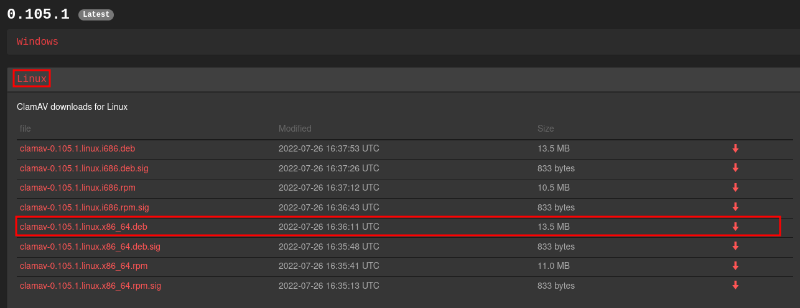
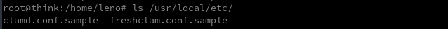
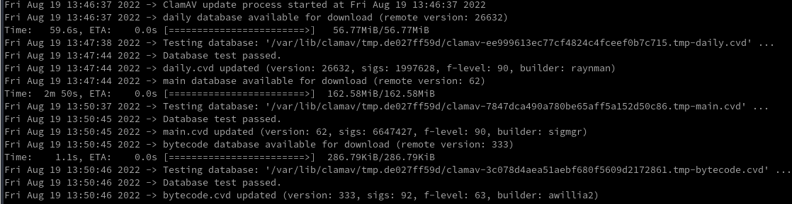
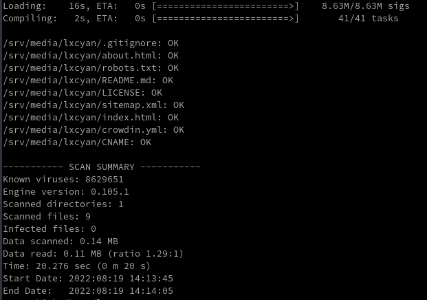

+++
title = 'ClamAV antivirus linux'
date = 2022-08-19 00:00:00 +0100
categories = ['antivirus']
+++


## Antivirus ClamAV

*ClamAV est un logiciel antivirus qui permet à ces utilisateurs de scanner tous les fichiers présents sur l'appareil. Il permet d'exécuter des programmes en arrière plan de manière rapide et efficace. ClamAV met également à jour les différentes signatures des virus présents sur la toile. ClamAV dispose d'une base de signature extraordinaire avec plus de 150 000 signatures référencées, rendant la protection contre les virus bien plus efficace.*

### Installation

Créer un compte de service ClamAV

    useradd -r -M -d /var/lib/clamav -s /bin/false -c "Clam Antivirus" clamav

[Installation sur debian](https://docs.clamav.net/manual/Installing.html#deb-packages-for-debian-ubuntu-mint-etc) , liste des applications compilées <https://www.clamav.net/downloads>  
  
Téléchargement du deb

    wget https://www.clamav.net/downloads/production/clamav-0.105.1.linux.x86_64.deb
    sudo dpkg -i clamav-0.105.1.linux.x86_64.deb

Vérification paquet installé

    sudo apt info clamav

```
Package: clamav
Version: 0.105.1-1
Status: install ok installed
Priority: optional
Section: devel
Maintainer: https://www.clamav.net/
Installed-Size: 80.0 MB
Download-Size: unknown
APT-Manual-Installed: yes
APT-Sources: /var/lib/dpkg/status
Description: ClamAV open source email, web, and end-point anti-virus toolkit.

Package: clamav
Version: 0.103.6+dfsg-0+deb11u1
Priority: optional
Section: utils
Maintainer: ClamAV Team <pkg-clamav-devel@lists.alioth.debian.org>
Installed-Size: 794 kB
Depends: clamav-freshclam (>= 0.103.6+dfsg) | clamav-data, libc6 (>= 2.28), libclamav9 (>= 0.103.6), libcurl4 (>= 7.16.2), libjson-c5 (>= 0.15), libssl1.1 (>= 1.1.0), zlib1g (>= 1:1.2.3.3)
Recommends: clamav-base
Suggests: libclamunrar, clamav-docs
Homepage: https://www.clamav.net/
Tag: implemented-in::c, interface::commandline, role::program,
 scope::utility, security::antivirus, use::scanning, works-with::file,
 works-with::mail
Download-Size: 181 kB
APT-Sources: http://debian.mirror.serveriai.lt/debian bullseye/main amd64 Packages
Description: anti-virus utility for Unix - command-line interface
 Clam AntiVirus is an anti-virus toolkit for Unix. The main purpose of
 this software is the integration with mail servers (attachment
 scanning). The package provides a flexible and scalable
 multi-threaded daemon in the clamav-daemon package, a command-line
 scanner in the clamav package, and a tool for automatic updating via
 the Internet in the clamav-freshclam package. The programs are based
 on libclamav, which can be used by other software.
 .
 This package contains the command line interface. Features:
  - built-in support for various archive formats, including Zip, Tar,
    Gzip, Bzip2, OLE2, Cabinet, CHM, BinHex, SIS and others;
  - built-in support for almost all mail file formats;
  - built-in support for ELF executables and Portable Executable files
    compressed with UPX, FSG, Petite, NsPack, wwpack32, MEW, Upack and
    obfuscated with SUE, Y0da Cryptor and others;
  - built-in support for popular document formats including Microsoft
    Office and Mac Office files, HTML, RTF and PDF.
 .
 For scanning to work, a virus database is needed. There are two options
 for getting it:
  - clamav-freshclam: updates the database from Internet. This is
    recommended with Internet access.
  - clamav-data: for users without Internet access. The package is
    not updated once installed. The clamav-getfiles package allows
    creating custom packages from an Internet-connected computer.
```

Une installation par défaut à partir des sources placera les exemples de configuration dans `/usr/local/etc/` sur les systèmes Unix/Linux  
  

### Configuration de ClamAV

Une fois l'installation terminée, vous devez configurer ClamAV.

*    **freshclam.conf** nécessaire pour FreshClam
*    **clamd.conf** requis par ClamD

ClamAV stocke les configurations dans [/usr/local/etc/](URL)  
**/usr/local/etc/freshclam.conf**  

```bash
cat > /usr/local/etc/freshclam.conf << 'EOL'
DatabaseOwner clamav
UpdateLogFile /var/log/clamav/freshclam.log
LogVerbose false
LogSyslog false
LogFacility LOG_LOCAL6
LogFileMaxSize 0
LogRotate true
LogTime true
Foreground false
Debug false
MaxAttempts 5
DatabaseDirectory /var/lib/clamav
DNSDatabaseInfo current.cvd.clamav.net
ConnectTimeout 30
ReceiveTimeout 0
TestDatabases yes
ScriptedUpdates yes
CompressLocalDatabase no
Bytecode true
NotifyClamd /usr/local/etc/clamd.conf
Checks 24
DatabaseMirror db.local.clamav.net
DatabaseMirror database.clamav.net
EOL
```

**/usr/local/etc/clamd.conf**

```bash
cat > /usr/local/etc/clamd.conf << 'EOL'
LocalSocket /var/run/clamav/clamd.ctl
FixStaleSocket true
LocalSocketGroup clamav
LocalSocketMode 666
User clamav
ScanMail true
ScanArchive true
ArchiveBlockEncrypted false
MaxDirectoryRecursion 15
FollowDirectorySymlinks false
FollowFileSymlinks false
ReadTimeout 180
MaxThreads 12
MaxConnectionQueueLength 15
LogSyslog false
LogRotate true
LogFacility LOG_LOCAL6
LogClean false
LogVerbose false
PreludeEnable no
PreludeAnalyzerName ClamAV
DatabaseDirectory /var/lib/clamav
OfficialDatabaseOnly false
SelfCheck 3600
Foreground false
Debug false
ScanPE true
MaxEmbeddedPE 10M
ScanOLE2 true
ScanPDF true
ScanHTML true
MaxHTMLNormalize 10M
MaxHTMLNoTags 2M
MaxScriptNormalize 5M
MaxZipTypeRcg 1M
ScanSWF true
ExitOnOOM false
LeaveTemporaryFiles false
AlgorithmicDetection true
ScanELF true
IdleTimeout 30
CrossFilesystems true
PhishingSignatures true
PhishingScanURLs true
PhishingAlwaysBlockSSLMismatch false
PhishingAlwaysBlockCloak false
PartitionIntersection false
DetectPUA false
ScanPartialMessages false
HeuristicScanPrecedence false
StructuredDataDetection false
CommandReadTimeout 30
SendBufTimeout 200
MaxQueue 100
ExtendedDetectionInfo true
OLE2BlockMacros false
AllowAllMatchScan true
ForceToDisk false
DisableCertCheck false
DisableCache false
MaxScanTime 120000
MaxScanSize 100M
MaxFileSize 25M
MaxRecursion 16
MaxFiles 10000
MaxPartitions 50
MaxIconsPE 100
PCREMatchLimit 10000
PCRERecMatchLimit 5000
PCREMaxFileSize 25M
ScanXMLDOCS true
ScanHWP3 true
MaxRecHWP3 16
StreamMaxLength 25M
LogFile /var/log/clamav/clamav.log
LogTime true
LogFileUnlock false
LogFileMaxSize 0
Bytecode true
BytecodeSecurity TrustSigned
BytecodeTimeout 60000
OnAccessMaxFileSize 5M
EOL
```

Créer les répertoires log, database et socket pour **FreshClam**

    mkdir -p /var/log/clamav/ /var/lib/clamav /var/run/clamav/

Définir la propriété du journal, de la base de données et des répertoires de socket à l'utilisateur *clamav*

    chown clamav: /var/log/clamav/ /var/lib/clamav /var/run/clamav/

### Bases antivirales ClamAV

Pour que l'analyse fonctionne, vous avez besoin d'une base de données ClamAV virale à jour.  
**clamav-freshclam** met à jour la base de données depuis Internet.

Mise à jour de la base de données des signatures avec **clamav-freshclam**  
Si vous disposez d'un accès à Internet, vous pouvez utiliser **clamav-freshclam** pour mettre à jour la base de données des signatures de virus ClamAV.  

    sudo -u clamav freshclam

La commande tirera les mises à jour de la base de données et vous pourriez obtenir une sortie similaire à celle ci-dessous.   
  
**freshclam** télécharge les bases de données ClamAV, CVDs, et les place sous, `/var/lib/clamav/`

    ls -1 /var/lib/clamav/

```
bytecode.cvd
daily.cvd
freshclam.dat
main.cvd
```

Créer le service FreshClam

```bash
cat > /etc/systemd/system/clamav-freshclam.service << EOL
[Unit]
Description=ClamAV virus database updater
Documentation=man:freshclam(1) man:freshclam.conf(5) https://www.clamav.net/documents
# If user wants it run from cron, don't start the daemon.
ConditionPathExists=!/etc/cron.d/clamav-freshclam
Wants=network-online.target
After=network-online.target

[Service]
User=clamav
Group=clamav
ExecStart=/usr/local/bin/freshclam -d --foreground=true
StandardOutput=syslog

[Install]
WantedBy=multi-user.target
EOL
```

Créer et démarrer le service ClamAV daemon

```bash
cat > /etc/systemd/system/clamav-daemon.service << EOL
[Unit]
Description=Clam AntiVirus userspace daemon
Documentation=man:clamd(8) man:clamd.conf(5) https://www.clamav.net/documents/
# Check for database existence
ConditionPathExistsGlob=/var/lib/clamav/main.{c[vl]d,inc}
ConditionPathExistsGlob=/var/lib/clamav/daily.{c[vl]d,inc}

[Service]
User=clamav
Group=clamav
ExecStart=/usr/local/sbin/clamd --foreground=true
# Reload the database
ExecReload=/bin/kill -USR2 $MAINPID
StandardOutput=syslog
TimeoutStartSec=420

[Install]
WantedBy=multi-user.target
EOL
```

Rechargez le démon systemd et assurez-vous que les services sont activés pour être exécutés au démarrage du système.

```bash
systemctl daemon-reload
systemctl enable --now clamav-daemon
systemctl enable --now clamav-freshclam
```

Modifier la période de mise à jour des bases antivirales dans le fichier de config **/usr/local/etc/freshclam.conf**  
La ligne à modifier

    Checks 24

Le nombre correspond aux nombres de mises à jour quotidien. Dans la config de base, 24 fois par jour soit une fois toutes les heures.  
Vous pouvez réduire à 5 fois par jour soit une fois toutes les 6 heures.

    Checks 5

### ClamAV scan antivirus manuel

Options de l'interface CLI Clamscan et exemples d'utilisation

Clamscan est utilisé pour analyser les fichiers et les répertoires à la recherche de virus. D'après les pages du manuel, la syntaxe de la commande clamscan est la suivante :

    clamscan [options] [file/directory/-]

Certaines des options de la commande clamscan et leur exemple d'utilisation sont illustrés ci-dessous  
Afficher des informations d'aide en utilisant l'option -h ou --help  

    clamscan -h

>Note : Les options marquées avec [=yes/no(*)] peuvent être optionnellement suivies par =yes ou =no. Si elles sont appelées sans l'argument booléen, l'analyseur supposera 'yes'. L'astérisque indique le paramètre interne par défaut pour une option donnée.

Analyser un répertoire ou un fichier spécifique ;

clamscan /home/

&rarr; résultats  
  

Ne pas afficher de résumé à la fin de l'analyse.

    clamscan --no-summary /home/

Afficher uniquement les fichiers infectés (-i, --infected);

    clamscan -i /

Ignorer affichage des fichiers OK (-o, --suppress-ok-results);

    clamscan -o /home/

Déclencher un son lors de la détection d'un virus (--bell);

    clamscan --bell -i /home

Analyse récursivement les répertoires (-r, --recursive).

    clamscan --bell -i -r /home

Enregistrer le rapport d'analyse dans un  FICHIER (-l FICHIER, --log=FICHIER);

    clamscan --bell -i -r /home -l home-scan.txt

Analyse les fichiers listés ligne par ligne dans le FICHIER (-f FICHIER, --file-list=FICHIER).

    clamscan -i -f /tmp/scan

Suppression des fichiers infectés (--remove[=yes/no(*)]). PRUDENCE car cela supprime complètement le fichier.

    clamscan -r --remove /home/USER

Déplacer les fichiers infectés dans le DIRECTORY (--move=DIRECTORY). Le répertoire doit être accessible en écriture pour l'utilisateur ou l'utilisateur non privilégié qui exécute clamscan.

    clamscan -r -i --move=/home/USER/infected /home/

Copie les fichiers infectés dans le DIRECTORY (–copy=DIRECTORY).  Le répertoire doit être accessible en écriture pour l'utilisateur ou l'utilisateur non privilégié qui exécute clamscan.

    clamscan -r -i --copy=/home/USER/infected /home/

### ClamAV scan antivirus automatique

Pour mettre en place un scan automatique, configuration via cron (Cron étant les taches planifiées de votre serveur).

    crontab -e # en mode root

Pour configurer, par exemple, un scan quotidien à 23H00 sur le home de l’utilisateur debian , ajoutez à la fin du fichier la ligne suivante

    00 23 * * * clamscan -i -r /home/debian

### Codes de retour ClamAV

Voici les codes de retour de sortie de ClamAV.

*    0 : Aucun virus trouvé.
*    1 : Virus trouvé(s).
*    2 : Une ou plusieurs erreurs se sont produites.

### Limiter utilisation processeur  par Clamscan

clamscan peut être gourmand en ressources CPU, surtout s'il analyse un grand répertoire.  
Pour limiter le temps CPU de clamscan à certains niveaux, vous pouvez utiliser deux outils 

1.    **nice** : réduit la priorité de clamscan (limite le temps CPU relatif).
2.    **cpulimit** : limite le temps processeur absolu.

Pour utiliser la commande **nice** 

    nice -n 15 clamscan && clamscan -ir /

Tant qu'aucun autre processus ne demande de temps cpu, clamscan le maximisera. Mais dès qu'un autre processus avec une priorité plus élevée aura besoin de cputime, clamscan le perdra.

En utilisant **cpulimit** 

    cpulimit -z -e clamscan -l 20 & clamscan -ir /

Limite le temps cpu de clamscan à 15% lors de l'analyse du répertoire racine entier.
