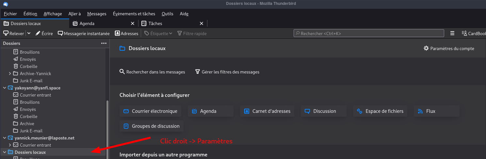
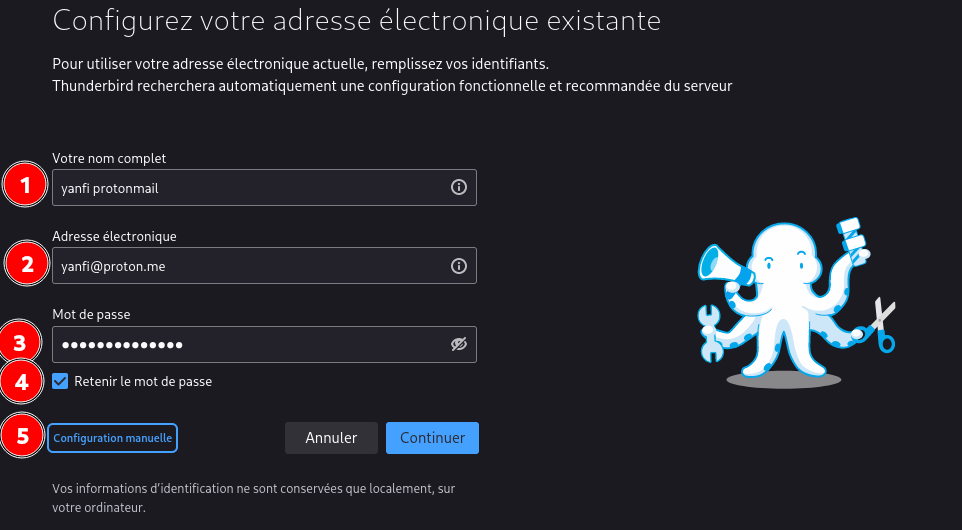
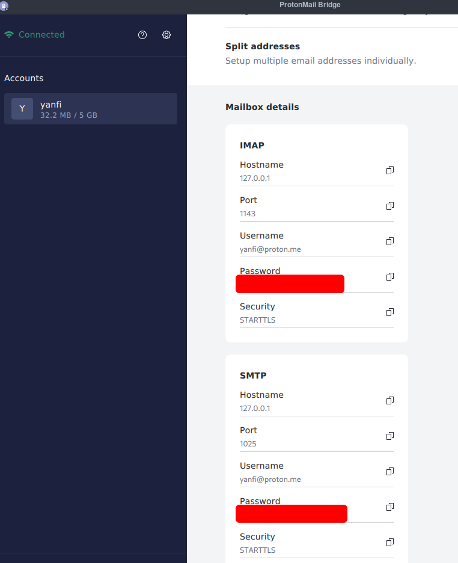
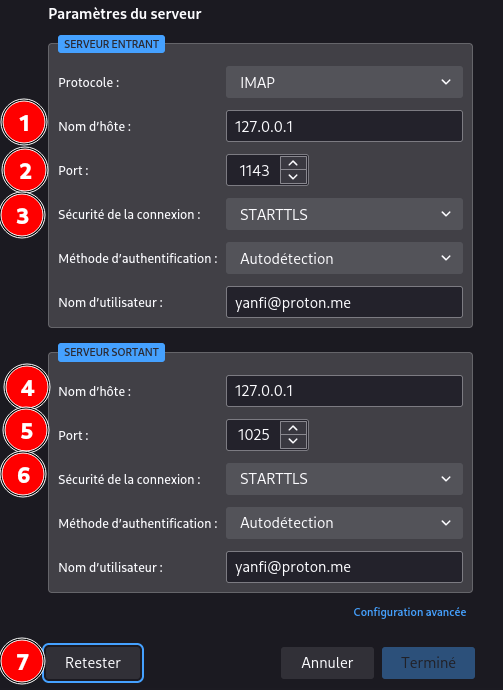
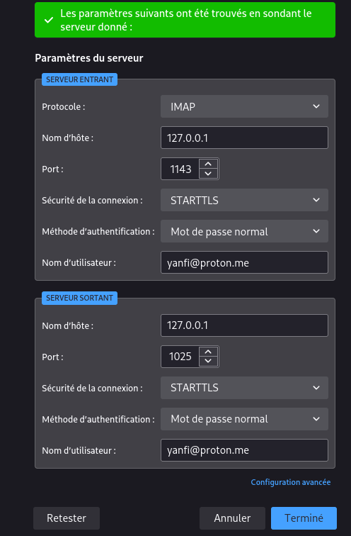
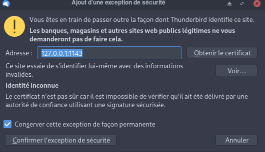
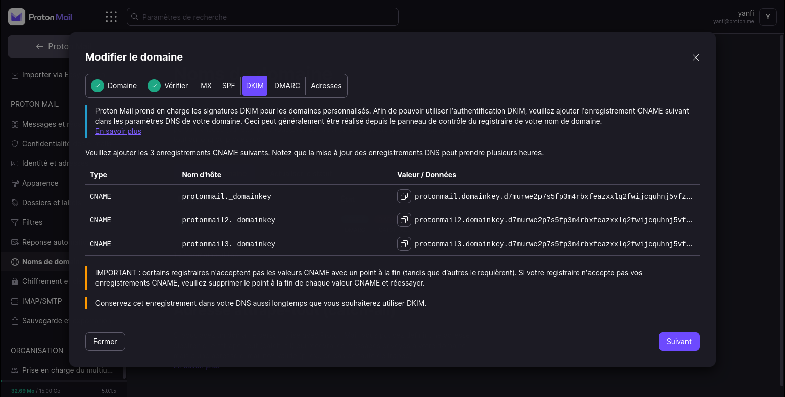
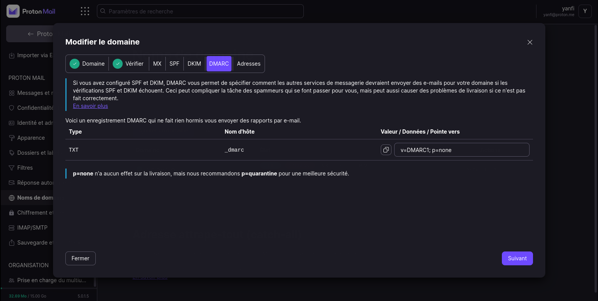
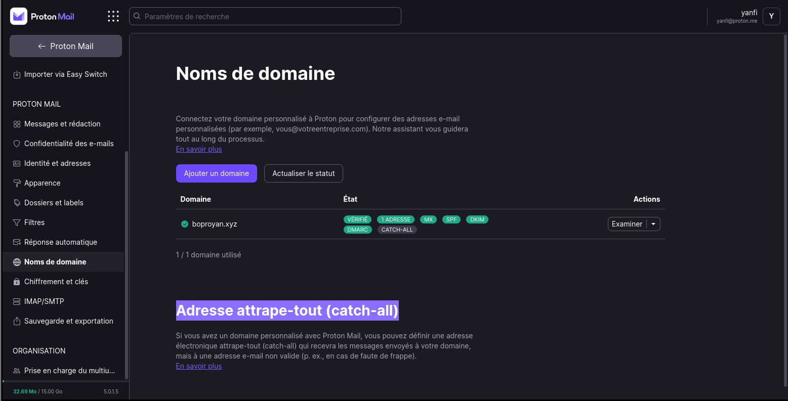

+++
title = 'Proton Mail'
date = 2022-08-25 00:00:00 +0100
categories = ['messagerie']
+++


## Proton Mail

*Basé en Suisse, Protonmail est un webmail open source au design léché qui propose différents niveaux de chiffrement. Entre les utilisateurs Protonmail, les messages sont automatiquement chiffrés de bout en bout (contenu et pièces jointes). Il est également possible d’envoyer des messages chiffrés de bout en bout aux utilisateurs d’autres messageries, soit en OpenPGP après avoir importé la clé du destinataire, soit avec un chiffrement symétrique. Dans ce cas, le mot de passe de déchiffrement doit être envoyé par un autre moyen. Seuls les utilisateurs payants peuvent profiter d’un carnet d’adresses complet dont les données sont alors chiffrées de bout en bout. Il existe une option d’authentification forte. Le service est également disponible au travers d’une application iOS ou Android.  
Proton Mail est géré par Proton Technologies AG, société domiciliée dans le canton de Genève en Suisse. Ses serveurs sont situés en Suisse, hors de la juridiction des États-Unis et de l'Union européenne* 

* Offre payante à 4€/mois 
    * ProtonMail Plus
    * 1 utilisateur
    * 5 adresses électroniques
    * 1 domaine personnalisé

### Proton Mail Bridge

*Applicable pour les comptes payants*

[Proton Mail Bridge](https://proton.me/mail/bridge) est une application open-source qui vous permet d'intégrer complètement votre compte Proton Mail à tout programme prenant en charge IMAP et SMTP. Cela inclut Microsoft Outlook, Mozilla Thunderbird et Apple Mail.

Il fonctionne en arrière-plan sur votre ordinateur et crypte et décrypte de manière transparente votre courrier lorsqu'il entre et sort de votre ordinateur.  


Pour utiliser Proton Mail Bridge, vous devez :

1. Télécharger l'application Proton Mail Bridge ([How to install ProtonMail Bridge](https://protonmail.com/support/knowledge-base/protonmail-bridge-install/))
2. Ajouter votre ou vos comptes à Proton Mail Bridge.
3. Configurer votre client de messagerie (Outlook, Thunderbird, Apple Mail) pour utiliser Proton Mail Bridge.

#### Création et installation paquet 

Télécharger Proton Mail Bridge pour votre plateforme  [Linux (PKGBUILD)](https://proton.me/download/bridge/PKGBUILD)

Dans le dossier qui contient le PKGBUILD , exécuter

    makepkg 

```
==> Création du paquet protonmail-bridge-bin 2.2.2-1 (sam. 06 août 2022 16:26:30)
==> Vérification des dépendances pour l’exécution…
==> Dépendances manquantes :
  -> qt5-multimedia
  -> qt5-quickcontrols
==> Vérification des dépendances pour la compilation…
==> ERREUR : Échec de résolution des dépendances.
```

Il manque des dépendances

    sudo pacman -S qt5-multimedia qt5-quickcontrols

Relancer `makepkg` 

```
[yann@archyan temp]$ makepkg
==> Création du paquet protonmail-bridge-bin 2.2.2-1 (sam. 06 août 2022 16:36:15)
==> Vérification des dépendances pour l’exécution…
==> Vérification des dépendances pour la compilation…
==> Récupération des sources…
  -> Téléchargement de protonmail-bridge_2.2.2-1_amd64.deb…
  % Total    % Received % Xferd  Average Speed   Time    Time     Time  Current
                                 Dload  Upload   Total   Spent    Left  Speed
100 61.2M  100 61.2M    0     0  1342k      0  0:00:46  0:00:46 --:--:-- 1769k
==> Validation des fichiers source avec sha256sums…
    protonmail-bridge_2.2.2-1_amd64.deb ... Réussite
==> Extraction des sources…
  -> Extraction de protonmail-bridge_2.2.2-1_amd64.deb avec bsdtar
==> Entre dans l’environnement fakeroot…
==> Lancement de package()…
==> Nettoyage de l’installation…
  -> Suppression des fichiers libtool…
  -> Suppression des fichiers indésirables…
  -> Suppression des fichiers de bibliothèques statiques…
  -> Nettoyage des symboles inutiles dans les fichiers binaires et les bibliothèques…
  -> Compression des pages de man/info…
==> Recherche des erreurs d’empaquetage…
==> Création du paquet « protonmail-bridge-bin »…
  -> Génération du fichier .PKGINFO…
  -> Génération du fichier .BUILDINFO…
  -> Génération du fichier .MTREE…
  -> Compression du paquet…
==> Quitte l’environnement fakeroot.
==> Création terminée : protonmail-bridge-bin 2.2.2-1 (sam. 06 août 2022 16:37:19)
```

Les paquets générés :   
protonmail-bridge-bin-2.2.2-1-x86_64.pkg.tar.zst  # archlinux  
protonmail-bridge_2.2.2-1_amd64.deb               # debian     

Installer protonmail-bridge, on utilise le ZST

    sudo pacman -U protonmail-bridge-bin-2.2.2-1-x86_64.pkg.tar.zst

### Configurer protonmail bridge

Ouvrir le menu 

  

  
Paramérage IMAP

  
Paramérage SMTP

Si tout est ok  
  

 Icône dans la barre des tâches 


### Thunderbird ProtonMail Bridge

[ProtonMail Bridge Thunderbird setup guide for Windows, macOS, and Linux](https://protonmail.com/support/knowledge-base/protonmail-bridge-clients-windows-thunderbird/)

Ouvrir **Thunderbird &rarr; Edition &rarr; Paramètres des comptes**  
Sélectionner "Dossiers locaux" puis dans la fenêtre déroulante "Gestion des comptes" , sélectionner "Ajouter un compte de messagerie"  
  
ATTENTION, le mot de passe `yanfi@proton.me` est celui fourni par le "bridge"

  
Cliquer sur "Terminé"  
Il vous sera demandé de confirmer une exception de sécurité pour le port 1143 sur le nom d'hôte du serveur 127.0.0.1. Il s'agit du port de votre hôte local, ce qui signifie que le certificat que nous fournissons doit être auto-signé et n'est donc pas reconnu par défaut par Thunderbird.

{:width="400"}  


Thunderbird va maintenant récupérer vos courriels, ce qui peut prendre jusqu'à cinq minutes. Vous pouvez envoyer des courriels immédiatement.

