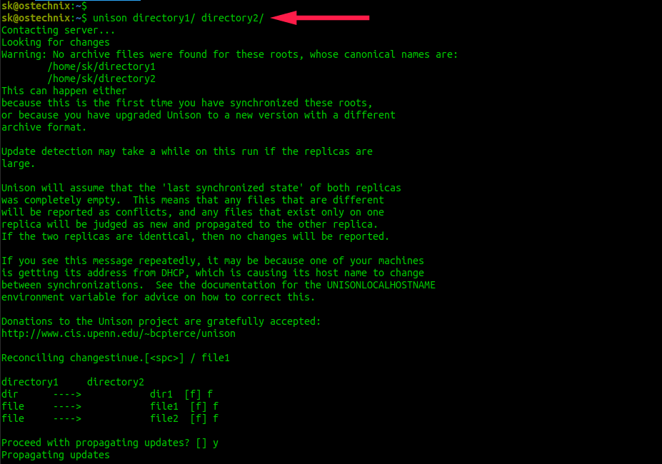
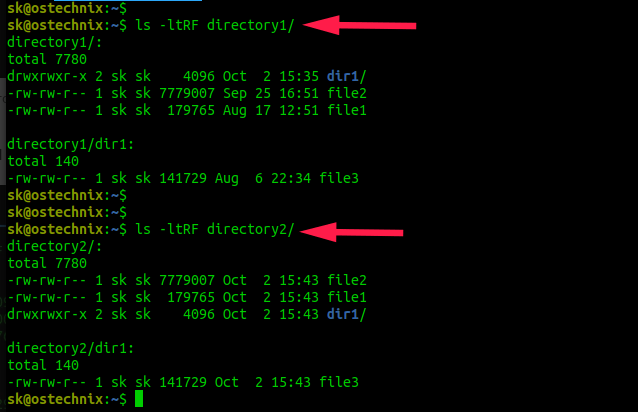
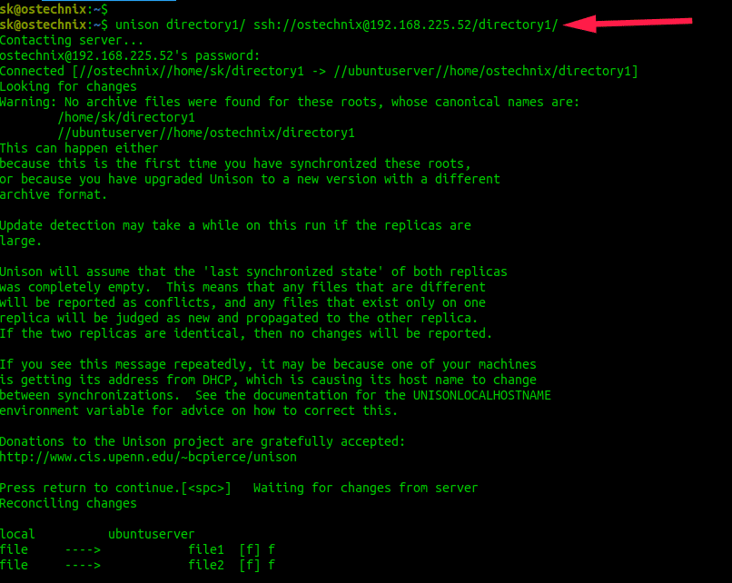

+++
title = 'Synchronisation fichiers avec Unison sous Linux'
date = 2022-09-20 00:00:00 +0100
categories = rsync
+++
**Unison** est un outil de synchronisation de fichiers gratuit, open source, multiplateforme et bidirectionnel . Il est utilisé pour stocker deux répliques de fichiers et de répertoires sur deux systèmes différents ou sur des disques différents sur le même système.

Les répliques de fichiers et de répertoires sont modifiées séparément puis mises à jour en propageant les modifications de chaque réplique à l'autre.

Pour le dire en termes simples, toute modification apportée à un emplacement sera répliquée à un autre emplacement et vice versa.

Comme il s'agit d'une application multiplateforme, vous pouvez synchroniser des fichiers et des répertoires entre des ordinateurs fonctionnant avec différents systèmes d'exploitation.

Par exemple, vous pouvez synchroniser des fichiers stockés sur une machine Linux avec une machine Windows ou Unix et vice versa. Non seulement le contenu du fichier, même la propriété du fichier et les autorisations seront également synchronisées.

Si le contenu est différent sur les deux répliques, cela provoque un conflit. Unison détectera et affichera de tels conflits. Dans ce cas, vous devez indiquer à Unison quelle réplique doit remplacer l'autre. Les mises à jour qui n'entrent pas en conflit seront propagées automatiquement.
{: .prompt-warning }

Unison fonctionne bien avec n'importe quelle paire d'ordinateurs connectés à un réseau local ou à Internet. Les fichiers sont synchronisés avec un système distant via une connexion ssh cryptée  . 

Une autre caractéristique notable d'Unison est qu'il fonctionne bien sur des liaisons lentes telles que les connexions PPP. Semblable à rsync , Unison ne transférera que les parties d'un fichier qui ont été modifiées.

L'implémentation intégrée d'Unison de l'algorithme rsync accélère le transfert des mises à jour vers les fichiers existants. 

Unison est un programme de niveau utilisateur, il n'est donc pas nécessaire de modifier le noyau ou d'avoir des privilèges de superutilisateur sur l'un ou l'autre hôte.

**Le programme Unison est créé par Benjamin C. Pierce et est publié sous licence GPL**. Il fonctionne sous les plateformes GNU/Linux, Windows et Unix.  

Traduction de l'article [How To Synchronize Files With Unison On Linux](https://ostechnix.com/how-to-synchronize-files-with-unison-on-linux/)

## Sommaire

- [Installer Unison sous Linux](#installer-unison-sous-linux)
- [Synchroniser des fichiers avec Unison sous Linux](#synchroniser-des-fichiers-avec-unison-sous-linux)
    - [Synchroniser les fichiers stockés dans différents répertoires sur la même machine](#synchroniser-les-fichiers-stockés-dans-différents-répertoires-sur-la-même-machine)
        - [Profils unison](#profils-unison)
        - [Ignorer les fichiers de la synchronisation](#ignorer-les-fichiers-de-la-synchronisation)
        - [Synchroniser les fichiers et répertoires locaux avec unison-gtk](#synchroniser-les-fichiers-et-répertoires-locaux-avec-unison-gtk)
    - [Synchroniser les fichiers et répertoires stockés sur différents disques sur la même machine](#synchroniser-les-fichiers-et-répertoires-stockés-sur-différents-disques-sur-la-même-machine)
    - [Synchroniser les fichiers et répertoires entre les machines locales et distantes](#synchroniser-les-fichiers-et-répertoires-entre-les-machines-locales-et-distantes)
        - [Synchronisez les fichiers et les répertoires entre les machines locales et distantes à partir de la ligne de commande](#synchronisez-les-fichiers-et-les-répertoires-entre-les-machines-locales-et-distantes-à-partir-de-la-ligne-de-commande)
        - [Configurer l'authentification basée sur la clé SSH (facultatif)](#configurer-lauthentification-basée-sur-la-clé-ssh-facultatif)
        - [Configurer la tâche cron (facultatif)](#configurer-la-tâche-cron-facultatif)


## Installer Unison sous Linux

Unison est disponible dans les référentiels par défaut des référentiels officiels de nombreux systèmes d'exploitation Linux.

Pour installer Unison sur Alpine Linux, exécutez :

    $ sudo apk add unison

Installez Unison sur Arch Linux et ses variantes comme EndeavourOS et Manjaro Linux :

    $ sudo pacman -S unison

Debian, Ubuntu, Linux Mint :

    $ sudo apt install unison

Fedora:

    $ sudo dnf install unison

openSUSE :

    $ sudo zypper install unison

Une interface graphique simple nommée **unison-gtk** est également disponible pour ceux qui préfèrent l'interface graphique à la CLI. Il est disponible dans les référentiels par défaut de quelques distributions Linux.

Sur Alpine Linux, vous pouvez installer Unison-gtk à l'aide de la commande :

    $ sudo apk add unison-gui

Sur Arch Linux et ses variantes, installez Unison-gtk à l'aide de la commande :

    $ sudo pacman -S unison-gtk2

Si vous êtes sur un système basé sur Debian, installez-le à l'aide de la commande suivante :

    $ sudo apt install unison-gtk

Veuillez noter que si vous souhaitez synchroniser des fichiers entre deux systèmes différents, vous devez installer **Unison** sur tous les systèmes que vous souhaitez conserver synchronisés. De plus, <u>la même version sur les deux systèmes est recommandée</u>.
{: .prompt-info }

## Synchroniser des fichiers avec Unison sous Linux

Nous pouvons utiliser Unison dans les trois modes différents suivants :

*    Synchroniser les fichiers stockés dans différents répertoires sur la même machine,
*    Synchroniser les fichiers et répertoires stockés sur différents disques sur la même machine,
*    Synchronisez les fichiers et les répertoires entre les machines locales et distantes :
      *  Synchroniser des fichiers avec une machine distante via une connexion socket directe,
      *  Synchronisez les fichiers avec la machine distante à l'aide de SSH.

### Synchroniser les fichiers stockés dans différents répertoires sur la même machine

Pour les besoins de ce guide, je vais créer deux répertoires racine (c'est-à-dire des répliques) à savoir directory1 et directory2.

```
$ mkdir ~/répertoire1
$ mkdir ~/répertoire2
```

Placez du contenu dans l'un des répertoires ci-dessus. J'ai stocké des fichiers et des répertoires à l'intérieur directory1.

Voyons le contenu de directory1:

    $ ls -ltRF répertoire1/

Exemple de sortie :

```
directory1/:
total 7780
drwxrwxr-x 2 sk sk    4096 Oct  2 15:35 dir1/
-rw-rw-r-- 1 sk sk 7779007 Sep 25 16:51 file2
-rw-rw-r-- 1 sk sk  179765 Aug 17 12:51 file1

directory1/dir1:
total 140
-rw-rw-r-- 1 sk sk 141729 Aug  6 22:34 file3
```

Comme vous pouvez le voir, j'ai un dossier appelé **dir1** et deux autres fichiers à savoir **file1** et **file2** à la racine de **directory1**.  
A l'intérieur du **dir1**, il y a un autre fichier appelé **file3**.

Et la réplique **directory2** n'a aucun contenu.

    $ ls -ltRF directory2/

```
directory2/:
total 0
```
Synchronisons ces deux répertoires avec la commande  `unison` :

    $ unison directory1/ directory2/

Vous serez invité à indiquer si vous souhaitez continuer à synchroniser le contenu de **directory1** avec **directory2**. Appuyez simplement sur la touche **ENTER**.   
Ensuite, Unison vous demandera de confirmer les fichiers et répertoires à synchroniser.  
Appuyez sur **ENTER** ou appuyez sur la touche **f** pour confirmer les fichiers et dossiers que vous souhaitez synchroniser.  
Enfin, appuyez sur **y** et appuyez sur la touche **ENTER** pour procéder à la propagation des mises à jour.

```
Contacting server...
Looking for changes
Warning: No archive files were found for these roots, whose canonical names are:
	/home/sk/directory1
	/home/sk/directory2
This can happen either
because this is the first time you have synchronized these roots, 
or because you have upgraded Unison to a new version with a different
archive format.  

Update detection may take a while on this run if the replicas are 
large.

Unison will assume that the 'last synchronized state' of both replicas
was completely empty.  This means that any files that are different
will be reported as conflicts, and any files that exist only on one
replica will be judged as new and propagated to the other replica.
If the two replicas are identical, then no changes will be reported.

If you see this message repeatedly, it may be because one of your machines
is getting its address from DHCP, which is causing its host name to change
between synchronizations.  See the documentation for the UNISONLOCALHOSTNAME
environment variable for advice on how to correct this.

Donations to the Unison project are gratefully accepted: 
http://www.cis.upenn.edu/~bcpierce/unison

Reconciling changestinue.[<spc>] / file1

directory1     directory2         
dir      ---->            dir1  [f] f
file     ---->            file1  [f] f
file     ---->            file2  [f] f

Proceed with propagating updates? [] y
Propagating updates


UNISON 2.48.4 started propagating changes at 15:43:29.75 on 02 Oct 2020
[BGN] Copying dir1 from /home/sk/directory1 to /home/sk/directory2
[END] Copying dir1
[BGN] Copying file1 from /home/sk/directory1 to /home/sk/directory2
[END] Copying file1
[BGN] Copying file2 from /home/sk/directory1 to /home/sk/directory2
[END] Copying file2
UNISON 2.48.4 finished propagating changes at 15:43:29.81 on 02 Oct 2020


Saving synchronizer state
Synchronization complete at 15:43:29  (3 items transferred, 0 skipped, 0 failed)
```



Désormais, tout le contenu de **directory1** sera répliqué dans **directory2**. Vous pouvez le vérifier en utilisant la commande `ls` :  


Voir? Le contenu des deux répliques est identique. Comme je l'ai déjà mentionné, les autorisations de fichiers et les numéros d'inode des fichiers et des dossiers sur les deux emplacements sont également synchronisés. Vous pouvez voir que les autorisations et les inodes sont également identiques dans la sortie ci-dessus.

Avez-vous remarqué les flèches dans la sortie lors de la synchronisation des répertoires ? Par exemple, vous devriez avoir remarqué les lignes suivantes au milieu de la sortie :

```
directory1     directory2         
dir      ---->            dir1  [f] f
file     ---->            file1  [f] f
file     ---->            file2  [f] f
```

Les flèches indiquent la direction dans laquelle la modification doit être propagée. Dans notre cas, les flèches pointent de gauche à droite. Signification - les dir1, file1 et file2 sont propagés à la deuxième réplique, c'est-à-dire directory2.

Créez maintenant un nouveau fichier dans la réplique directory2 et voyez ce qui se passe.

    $ touch directory2/file4

Synchronisez les deux instances dupliquées à l'aide de la commande :

    $ unison directory1/ directory2/

Vous verrez maintenant qu'une flèche pointe de droite à gauche. Cela signifie que les modifications apportées au deuxième réplica sont propagées au premier réplica. En d'autres termes, le contenu de directory2 est répliqué dans directory1.

```
Contacting server...
Looking for changes
Reconciling changes

directory1     directory2         
         <---- new file   file4  [f] f

Proceed with propagating updates? [] y
Propagating updates


UNISON 2.48.4 started propagating changes at 16:04:08.78 on 02 Oct 2020
[BGN] Copying file4 from /home/sk/directory2 to /home/sk/directory1
[END] Copying file4
UNISON 2.48.4 finished propagating changes at 16:04:08.78 on 02 Oct 2020


Saving synchronizer state
Synchronization complete at 16:04:08  (1 item transferred, 0 skipped, 0 failed)
```

Unison reconnaîtra automatiquement quels fichiers doivent être mis à jour dans les deux répliques. Lorsque vous exécutez Unison pour la première fois, il prend note de l'horodatage de modification, des autorisations, de la propriété et du numéro d'inode de tous les fichiers et dossiers dans les deux emplacements. Sur la base de ces informations, Unison décidera quels fichiers doivent être mis à jour lorsque vous exécuterez à nouveau la même commande. Comme indiqué précédemment, toutes les informations seront conservées dans un répertoire **~/.unison** 

Pour le vérifier vous-même, modifiez le contenu d'un fichier existant. Je vais modifier le contenu de file4 dans le replica directory1

    $ echo "Welcome to OSTechNix" > directory1/file4

Relancez maintenant la synchronisation :

    $ unison directory1/ directory2/

Cette fois, Unison synchronisera le(s) fichier(s) modifié(s).

```
Contacting server...
Looking for changes
Reconciling changes

directory1     directory2         
changed  ---->            file4  [f] f

Proceed with propagating updates? [] y
Propagating updates


UNISON 2.48.4 started propagating changes at 16:05:27.13 on 02 Oct 2020
[BGN] Updating file file4 from /home/sk/directory1 to /home/sk/directory2
[END] Updating file file4
UNISON 2.48.4 finished propagating changes at 16:05:27.14 on 02 Oct 2020


Saving synchronizer state
Synchronization complete at 16:05:27  (1 item transferred, 0 skipped, 0 failed)
```

Comme vous pouvez le voir dans la sortie ci-dessus, Unison a détecté qui file4 a été modifié dans le premier réplica et l'a synchronisé avec le deuxième réplica.

Si les deux répliques sont modifiées et que leur contenu est différent, les modifications sont en conflit. Dans de tels cas, Unison demandera à l'utilisateur comment propager les mises à jour des deux côtés. Les conflits seront affichés avec des flèches gauche et droite comme ci-dessous.

```
directory1     directory2         
new file <-?-> new file   file6  [] 
```

Si une action par défaut est indiquée par une flèche, appuyez simplement sur la touche ENTER pour passer au fichier modifié suivant. Si vous voulez faire quelque chose de différent avec ce fichier, vous pouvez appuyer sur "`<`" ou "`>`" pour forcer la propagation du changement de droite à gauche ou de gauche à droite.

```
directory1     directory2         
new file <==== new file   file6  [] <
```

Si vous ne souhaitez apporter aucune modification, appuyez simplement sur "`/`" pour ignorer ce fichier et laisser les deux répliques seules.

#### Profils unison

Unison utilise des profils pour synchroniser des fichiers et des dossiers entre deux répertoires sur la même machine ou sur deux machines différentes. Un profil n'est rien d'autre qu'un fichier texte dans lequel nous définissons le chemin réel des répertoires racine et les préférences de chemin qui doivent être synchronisées. Tous les profils seront stockés dans le répertoire de `.unison` votre répertoire `$HOME`.

Lorsque vous exécutez Unison pour la première fois, un profil par défaut nommé `default.prf` est créé sous le répertoire `~/.unison`. Le profil par défaut n'a pas de préférences définies. Ainsi, tout ce qui est stocké dans une réplique sera synchronisé avec une autre réplique.

Nous pouvons également créer des profils personnalisés avec la liste des préférences de chemin. Cela vous évitera de synchroniser l'ensemble des deux répliques.

En utilisant les profils personnalisés, nous pouvons demander à Unison :

*    pour synchroniser des fichiers et dossiers spécifiques,
*    pour ignorer un fichier spécifique ou un type spécifique de fichiers de la synchronisation.

Voyons un exemple.

Créez deux répliques et enregistrez certains fichiers et dossiers dans une réplique et laissez l'autre vide.

    $ mkdir ~/directory1
    $ mkdir ~/directory2

Ensuite, créez un nouveau profil nommé **dir_profile.prf**:

    $ nano .unison/dir_profile.prf

Définissez les répertoires racine et les chemins des fichiers et répertoires que vous souhaitez synchroniser :

```
# Roots of the synchronization
root = /home/sk/directory1
root = /home/sk/directory2 

# Paths to synchronize 
path = dir1
path = file2
```

Les deux racines peuvent être données dans n'importe quel ordre. Unison les triera dans un ordre canonique avant de faire quoi que ce soit d'autre. Si vous ne spécifiez aucun chemin, Unison synchronisera simplement les deux répliques entières, en commençant par la paire de racines donnée. Si une ou plusieurs préférences de chemin sont données, Unison synchronisera uniquement ces chemins et leurs enfants.

Dans l'exemple ci-dessus, j'ai défini que dir1 et file2 doivent être synchronisés avec un autre répertoire racine. Enregistrez et fermez le fichier.

Après avoir créé le profil, démarrez le processus de synchronisation à l'aide de la commande :

    $ unison dir_profile.prf

Vous serez invité à indiquer si vous souhaitez continuer à synchroniser le contenu de directory1 avec directory2. Appuyez simplement sur la touche ENTER puis appuyez sur la touche f pour confirmer les chemins à synchroniser. Enfin, appuyez sur y et appuyez sur la touche ENTER pour procéder à la propagation des mises à jour.

```
Contacting server...
Looking for changes
Warning: No archive files were found for these roots, whose canonical names are:
	/home/sk/directory1
	/home/sk/directory2
This can happen either
because this is the first time you have synchronized these roots, 
or because you have upgraded Unison to a new version with a different
archive format.  

Update detection may take a while on this run if the replicas are 
large.

Unison will assume that the 'last synchronized state' of both replicas
was completely empty.  This means that any files that are different
will be reported as conflicts, and any files that exist only on one
replica will be judged as new and propagated to the other replica.
If the two replicas are identical, then no changes will be reported.

If you see this message repeatedly, it may be because one of your machines
is getting its address from DHCP, which is causing its host name to change
between synchronizations.  See the documentation for the UNISONLOCALHOSTNAME
environment variable for advice on how to correct this.

Donations to the Unison project are gratefully accepted: 
http://www.cis.upenn.edu/~bcpierce/unison

Reconciling changestinue.[<spc>] | dir1

directory1     directory2         
dir      ---->            dir1  [f] 
file     ---->            file2  [f] 

Proceed with propagating updates? [] y
Propagating updates


UNISON 2.48.4 started propagating changes at 15:42:32.99 on 01 Oct 2020
[BGN] Copying dir1 from /home/sk/directory1 to /home/sk/directory2
[END] Copying dir1
[BGN] Copying file2 from /home/sk/directory1 to /home/sk/directory2
[END] Copying file2
UNISON 2.48.4 finished propagating changes at 15:42:33.04 on 01 Oct 2020


Saving synchronizer state
Synchronization complete at 15:42:33  (2 items transferred, 0 skipped, 0 failed)
```


Allez maintenant au deuxième réplica directory2 et voyez si le contenu est synchronisé.

#### Ignorer les fichiers de la synchronisation

Parfois, vous ne souhaitez peut-être pas synchroniser un fichier spécifique ou un type de fichiers spécifique. Si tel est le cas, vous pouvez définir les fichiers à ignorer dans le profil comme ci-dessous.

```
ignore=Name text.*
ignore=Name .*~
ignore=Name *.pdf
```

Pour plus d'exemples de profils, reportez-vous [ici](https://www.cis.upenn.edu/~bcpierce/unison/download/releases/stable/unison-manual.html#profileegs) 

#### Synchroniser les fichiers et répertoires locaux avec unison-gtk

Certains d'entre vous ne sont peut-être pas à l'aise avec la ligne de commande. Heureusement, Unison possède une interface graphique simple qui permet aux utilisateurs de créer facilement des profils et de synchroniser des fichiers basés sur les profils via une fenêtre graphique.

Assurez-vous d'avoir installé le package **unison-gtk** comme indiqué dans la section d'installation ci-dessus.

### Synchroniser les fichiers et répertoires stockés sur différents disques sur la même machine

Les fichiers de synchronisation entre deux disques sont exactement les mêmes que ci-dessus. Assurez-vous simplement que vous avez mentionné le chemin correct du répertoire racine dans le lecteur externe.

Vous savez maintenant comment synchroniser des fichiers entre deux répertoires sur le même disque dur et un disque différent sur un système local. La section suivante explique comment synchroniser des fichiers entre deux systèmes différents.

### Synchroniser les fichiers et répertoires entre les machines locales et distantes

Comme indiqué précédemment, Unison peut synchroniser des fichiers entre des systèmes locaux et distants via une connexion socket directe et via une connexion SSH cryptée. Comme vous le savez déjà, SSH est bien meilleur et plus sécurisé que la méthode socket. Pour les besoins de ce guide, j'utiliserai la méthode SSH pour synchroniser les fichiers.

Assurez-vous d'avoir **installé openSSH et Unison sur les deux systèmes** . Assurez-vous également que les deux systèmes peuvent communiquer via SSH. Veuillez noter que **vos systèmes locaux et distants doivent avoir la même version d'Unison** 

Pour vérifier la version d'Unison, exécutez la commande suivante sur votre système local et distant :

```
$ unisson -version
unisson version 2.48.4
```

Étant donné que les fichiers seront synchronisés via SSH, peu importe que le système distant ait unison-gtk ou non. L'interface de ligne de commande Unison est juste suffisante sur une machine distante ! Sur votre ordinateur local, vous pouvez utiliser une interface textuelle ou graphique pour unison

#### Synchronisez les fichiers et les répertoires entre les machines locales et distantes à partir de la ligne de commande

Maintenant, synchronisons le directory1 depuis notre système local vers le système directory1 distant à l'aide de l'unisson en exécutant la commande suivante :

    $ unison directory1/ ssh://ostechnix@192.168.225.52/directory1/

`ostechnix@192.168.225.52` avec le nom d'utilisateur et l'adresse IP de mon système distant.

Vous serez invité à entrer le mot de passe de votre utilisateur distant. Appuyez ensuite sur ENTER pour accepter de synchroniser le contenu de directory1 de la machine locale  avec directory1 de la machine distante. Appuyez ensuite sur la touche f pour confirmer les chemins à synchroniser. Enfin, appuyez sur y et appuyez sur la touche ENTER pour procéder à la propagation des mises à jour.

```
Contacting server...
ostechnix@192.168.225.52's password: 
Connected [//ostechnix//home/sk/directory1 -> //ubuntuserver//home/ostechnix/directory1]
Looking for changes
Warning: No archive files were found for these roots, whose canonical names are:
	/home/sk/directory1
	//ubuntuserver//home/ostechnix/directory1
This can happen either
because this is the first time you have synchronized these roots, 
or because you have upgraded Unison to a new version with a different
archive format.  

Update detection may take a while on this run if the replicas are 
large.

Unison will assume that the 'last synchronized state' of both replicas
was completely empty.  This means that any files that are different
will be reported as conflicts, and any files that exist only on one
replica will be judged as new and propagated to the other replica.
If the two replicas are identical, then no changes will be reported.

If you see this message repeatedly, it may be because one of your machines
is getting its address from DHCP, which is causing its host name to change
between synchronizations.  See the documentation for the UNISONLOCALHOSTNAME
environment variable for advice on how to correct this.

Donations to the Unison project are gratefully accepted: 
http://www.cis.upenn.edu/~bcpierce/unison

Press return to continue.[<spc>]   Waiting for changes from server
Reconciling changes

local          ubuntuserver       
file     ---->            file1  [f] f
file     ---->            file2  [f] f

Proceed with propagating updates? [] y
Propagating updates


UNISON 2.48.4 started propagating changes at 14:49:18.44 on 03 Oct 2020
[BGN] Copying file1 from /home/sk/directory1 to //ubuntuserver//home/ostechnix/directory1
[BGN] Copying file2 from /home/sk/directory1 to //ubuntuserver//home/ostechnix/directory1
[END] Copying file1
[END] Copying file2
UNISON 2.48.4 finished propagating changes at 14:49:18.45 on 03 Oct 2020


Saving synchronizer state
Synchronization complete at 14:49:18  (2 items transferred, 0 skipped, 0 failed)
```



La commande ci-dessus répliquera le contenu de directory1 du système local vers le directory1 sur le système distant. Ajoutez maintenant un nouveau fichier ou mettez à jour un fichier existant et essayez de synchroniser à nouveau. Vous devriez voir des résultats similaires des deux côtés.

Si vous souhaitez synchroniser le contenu ailleurs que dans le répertoire personnel du système distant, vous devez spécifier le chemin absolu du répertoire distant en **ajoutant une barre oblique supplémentaire entre le nom d'hôte distant et le début du chemin** comme ci-dessous :

    $ unison directory1/ ssh://ostechnix@192.168.225.52//sync/the/files/here/

#### Configurer l'authentification basée sur la clé SSH (facultatif)

Chaque fois que vous synchronisez des fichiers entre deux systèmes différents via SSH, vous devez entrer le mot de passe de l'utilisateur distant. Si vous ne souhaitez pas saisir le mot de passe à chaque fois, vous pouvez configurer l'authentification SSH sans mot de passe comme décrit dans le lien ci-dessous. Ne générez pas de paire de clés SSH avec la phrase secrète. Sinon, vous devez toujours entrer le mot de passe lors de la synchronisation des fichiers entre les systèmes.  
[How To Configure SSH Key-based Authentication In Linux](https://ostechnix.com/configure-ssh-key-based-authentication-linux/)

#### Configurer la tâche cron (facultatif)

Nous pouvons synchroniser automatiquement les fichiers à un intervalle de temps spécifique à l'aide de tâches cron.

Par exemple, ajoutez l'entrée suivante dans votre crontabfichier pour exécuter la synchronisation  tous les jours  (elle s'exécutera à 00h00) :

```
0 0 * * * unison directory1/ ssh://ostechnix@192.168.225.52//home/ostechnix/directory1/
```

Pour plus de détails sur la configuration des tâches cron, consultez le guide suivant  
[A Beginners Guide To Cron Jobs](https://ostechnix.com/a-beginners-guide-to-cron-jobs/)
