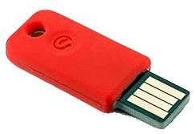
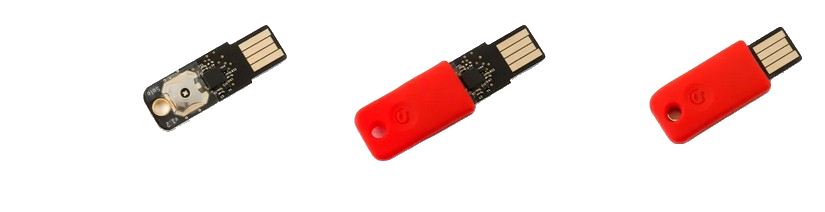

+++
title = 'Solo Tap - Clé de sécurité NFC, authentification à deux facteurs, U2F et FIDO2 - USB-A + NFC'
date = 2022-09-22 00:00:00 +0100
categories = ['chiffrement']
+++
<div class="item">
  <div class="item__image">
    
  </div>
  <div class="item__content">
    <div class="item__header">
      <h4>SoloKeys</h4>
    </div>
    <div class="item__description">
      <ul>
        <li>Protocoles pris en charge : FIDO2, FIDO U2F</li>
        <li>Systèmes d'exploitation : Microsoft Windows, Mac OS X, Linux, Chrome OS</li>
        <li>Navigateurs : Chrome, Firefox, Edge, et soon Safari</li>
        <li>Commencez : https://solokeys.com/start</li>
      </ul>
<i>Solo dispose d'un bouton tactile facile à appuyer et fournit un retour physique, et d'une lumière LED multicolore pour indiquer une connexion sécurisée. Solo n'a pas de batterie, il est donc toujours disponible et prêt à l'emploi.</i>
    </div>
  </div>
</div>
<div class="item">
  <div class="item__image">
    
  </div>
  <div class="item__content">
    <div class="item__header">
      <h4>Votre Solo </h4>
    </div>
    <div class="item__description">
      <ul>
        <li>Solo: La première clé de sécurité FIDO2 open source. Accès sécurisé, ouvert facile. </li>
        <li>Solo Tap: Solo sans contact optimisé pour les dispositifs mobiles afin d’avoir un accès sécurisé en posant Solo sur votre téléphone. Solo Tap utilise NFC pour communiquer et fonctionne avec la plupart des dispositifs Android. Bien évidemment il supporte l’USB aussi.</li>
        <li>Solo for Advanced Protection: un lot exclusif avec Digipass SecureClick by OneSpan et Solo pour utiliser avec l’Advanced Protection Program de Google.</li>
        <li>Solo for Hackers: C’est open source, et bien sûr vous pouvez le modifier! Solo et Solo Tap sont complètement open source, de façon à ce que vous puissiez personnaliser et le hardware et le firmware. Cette édition est fournie avec un bootloader débloqué, pour vous laisser flasher facilement des firmwares non officiels. </li>
      </ul>
<i>Nos clés de sécurité marchent de façon transparente avec plusieurs services, incluant Google, Facebook, Twitter, Dropbox, Github et beaucoup d’autres. Du fait que Solo supporte le nouveau standard FIDO2, vous aurez le meilleur accès sécurisé, avec protection contre le phishing, l’usurpation de compte et autres attaques en ligne. C’est incroyablement facile à utiliser, et de façon consistante à travers de tous les sites: quand vous y accédez, après avoir saisi le nom d’utilisateur et le mot de passe, vous connectez Solo à votre ordinateur et vous appuyez sur son bouton pour vous authentifier.</i>
    </div>
  </div>
</div>


Choisissez votre couleur et installez le manchon rouge ou noir.  
Le bouton doit être aligné avec le 'S' imprimé.  
{:width="300"}  
Étirez le manchon si nécessaire pour envelopper complètement le PCB (carte noire).  

* [Authentification avec clés FIDO2 / Webauthn](https://homepages.laas.fr/matthieu/talks/token-capitoul-2021.pdf)
* [Yubikey et Authentication à 2 facteurs (https://mesangebleue.github.io/utilisation_zeromq)](URL) 
* [Nextcloud Passwordless test](https://github.com/sosandroid/Nextcloud-Passwordless)
     * [Fido2/Webauthn => Nextcloud 21 => Users are constantly logged out automatically after a short time #26806](https://github.com/nextcloud/server/issues/26806)

## Utiliser SoloKey pour la connexion Linux

* [Security keys – everyone should have at least one!](https://schulz.dk/2019/08/22/security-keys-for-everyone/)
* [Using SoloKey for Linux Login](https://schulz.dk/2019/08/23/using-solokey-for-linux-login/)
* [Using Solo for passwordless or second factor login on Linux](https://docs.solokeys.dev/application-ideas/)

Alors hier, j'ai parlé des clés de sécurité que j'utilise et aujourd'hui, j'ai pensé que je raconterais un peu comment j'utilise la SoloKey comme précaution de sécurité supplémentaire sur mes ordinateurs Linux.

Tout d'abord, une première chose : Cela ne serait pas (encore) possible sans un travail de fond effectué par l'équipe de Yubico. Ils ont créé le module PAM (Plugable Authentication Module) nécessaire à l'authentification U2F. C'est aussi la raison pour laquelle ils nous fournissent le logiciel ([disponible sur github](https://github.com/Yubico/pam-u2f)).

### Applications u2f

Arch Linux

    sudo pacman -S pam-u2f  

Debian Ubuntu

    sudo add-apt-repository ppa:yubico/stable && sudo apt update
    sudi apt install libpam-u2f

### SoloKey USB-A + NFC (U2F + FIDO2)

Outils et bibliothèque Python pour SoloKeys. 

```bash
yay -S solo-python
# En cas d'erreur à l'installation
yay -S solo1
```

Pour que votre SoloKey soit reconnue par le système udev sous Linux, vous devez ajouter une règle pour elle à `udev`  
Créer un nouveau fichier de règles udev 

    sudo nano /etc/udev/rules.d/70-solokeys.rules

Ajoutez les lignes suivantes au fichier

```
ACTION!="add|change", GOTO="solokeys_end"

# SoloKeys rule
KERNEL=="hidraw*", SUBSYSTEM=="hidraw", ATTRS{idVendor}=="0483", ATTRS{idProduct}=="a2ca", TAG+="uaccess"

LABEL="solokeys_end"
```

Rechargez udev pour que la nouvelle règle soit active

    sudo udevadm control --reload-rules

Maintenant vous êtes prêt à utiliser votre solokey sous Linux et vous pouvez passer à la configuration de pam.  

Insertion clé , le voyant est vert mais avec un clignotement lent...

    sudo dmesg

```
[ 2832.728746] usb 1-4: new full-speed USB device number 8 using xhci_hcd
[ 2832.870159] usb 1-4: New USB device found, idVendor=0483, idProduct=a2ca, bcdDevice= 1.00
[ 2832.870170] usb 1-4: New USB device strings: Mfr=1, Product=2, SerialNumber=3
[ 2832.870175] usb 1-4: Product: Solo 3.1.2
[ 2832.870179] usb 1-4: Manufacturer: SoloKeys
[ 2832.870182] usb 1-4: SerialNumber: 205E378C324B
[ 2832.872560] hid-generic 0003:0483:A2CA.0007: hiddev96,hidraw4: USB HID v1.11 Device [SoloKeys Solo 3.1.2] on usb-0000:00:14.0-4/input0
```

Vérification avec homectl

    homectl --fido2-device=list

```
PATH         MANUFACTURER PRODUCT   
/dev/hidraw4 SoloKeys     Solo 3.1.2
```

Mise à jour firmware

    solo key update

```
Wrote temporary copy of firmware-4.1.2.json to /tmp/tmpcdde0wew.json
sha256sums coincide: 22b2efdc75a716641d4555cbeff4d53b026ddf816689ccadf340b3b87634adaa
Switching into bootloader mode...
using signature version >2.5.3
erasing firmware...
updated firmware 100%             
time: 14.03 s
bootloader is verifying signature...
...pass!

Congratulations, your key was updated to the latest firmware version: 4.1.2
```

    homectl --fido2-device=list

```
PATH         MANUFACTURER PRODUCT   
/dev/hidraw2 SoloKeys     Solo 4.1.5
```


### Configuration

* [Two-factor auth for local logins in Debian using U2F keys](https://blog.liw.fi/posts/u2f-pam/)

Maintenant que nous avons installé le module pam, il est temps d'y ajouter votre SoloKey. J'ai choisi d'avoir ma configuration pour mon utilisateur comme une configuration personnelle dans mon dossier personnel. Cela peut également être fait via /etc mais je ne le ferai pas cette fois-ci.

Créez le dossier de configuration pour le stockage des clés

    mkdir ~/.config/Yubico

Il est important qu'il s'appelle **Yubico** exactement comme ici, car le module pam est codé en dur pour utiliser cet emplacement.

Le module pam est livré avec un outil de configration qui peut être utilisé pour créer les chaînes de touches dans la configration pour vos SoloKeys.  
Brancher votre SoloKeys dans le port USB puis dans un terminal exécuter la commande suivante 

    pamu2fcfg -u$USER > ~/.config/Yubico/u2f_keys  # -u$USER facultatif car vous êtes déjà dans le répertoire utilisateur
    pamu2fcfg > ~/.config/Yubico/u2f_keys  

et appuyez sur le bouton de votre clé U2F lorsque la clé clignote.

Il est fortement recommandé d'avoir une clé de secours car vous serez complètement verrouillé si votre seule clé est volée, cassée ou autre.

Si vous ajoutez une autre clé, il est très important que vous n'utilisiez pas la commande précédente pour la nouvelle clé mais plutôt la suivante (elle ajoute une nouvelle ligne au fichier au lieu de l'écraser)

    pamu2fcfg -n >> ~/.config/Yubico/u2f_keys

`info`{: .prompt-info } `pamu2fcfg` lit le jeton matériel et écrit ses données d'identification sous une forme que le module PAM comprend , voir la [documentation de pam-u2f](https://developers.yubico.com/pam-u2f/) pour plus de détails. Les données peuvent être stockées dans le répertoire personnel de l'utilisateur ou dans `/etc/u2f_mappings` 

### SoloKeys et sudo

Votre clé est maintenant enregistrée et prête à être utilisée par PAM. La meilleure façon de la tester est de changer le schéma d'autorisation pour la commande sudo. Avant de le faire, pensez à ouvrir un terminal supplémentaire et à vous transformer en root avec la commande "sudo su" ou "sudo /bin/bash". De cette façon, vous aurez un moyen d'entrer et de désactiver vos modifications si quelque chose ne va pas.

Maintenant vous pouvez modifier le fichier de configuration de pam pour sudo 

    sudo nano /etc/pam.d/sudo

Trouvez une ligne près du début du fichier qui ressemble à ceci :

    @include common-auth

et ajoutez la ligne suivante juste après :

    auth       required   pam_u2f.so

Ceci indique qu'après le login commun (votre demande normale de mot de passe sudo), il vous sera demandé d'utiliser pam_u2f (votre solokey).

Sauvegardez le fichier et essayez ensuite quelque chose de simple comme :

    sudo echo "SoloKeys rock"

si aucune SoloKey n'est insérée dans le port usb, l'opération échouera après l'écriture du mot de passe. Si la SoloKey est insérée, elle commencera à clignoter et vous aurez alors environ 10 secondes pour appuyer sur le bouton de la SoloKey.  
Encore une fois, il se peut que vous deviez maintenir le bouton pendant une seconde ou plus pour qu'il soit enregistré.  

Si tout s'est déroulé comme prévu, vous verrez le terminal afficher "SoloKeys Rock".

### Se connecter à Linux (lightdm)

Sans mot de passe

Pour vous connecter sans mot de passe à votre système Linux, vous devez éditer le fichier lightdm (ou gdm ou le gestionnaire d'affichage que vous préférez). Dans le cas de lightdm 

    sudo nano /etc/pam.d/lightdm

Sur Ubuntu, cherchez l'entrée suivante : `@include common-auth` et ajoutez

    auth    sufficient      pam_u2f.so 

avant `@include common-auth` 

Sur Manjaro, cherchez l'entrée suivante : `auth include system-login` et ajoutez

    auth    sufficient      pam_u2f.so

avant `auth include system-login` 

Insérez la Solo dans votre port USB et déconnectez-vous. Maintenant vous devriez être capable de vous connecter à Linux sans mot de passe, seulement en appuyant sur le bouton de la clé Solo et en appuyant sur entrée.

Pourquoi `sufficient` ?  
La différence entre le mot "sufficient" et "require" est que si vous n'avez pas votre Solo à disposition, vous pouvez également vous connecter, car le système revient au mode mot de passe.

Le mécanisme de connexion peut également être utilisé pour des fonctionnalités supplémentaires telles que :

*    Connexion après dépassement du temps d'affichage - modifier /etc/pam.d/mate-screensaver (ou kde-screensaver, ...)
*    sudo sans mot de passe - modifier /etc/pam.d/sudo

Vérifiez votre dossier `/etc/pam.d/` et faites quelques essais.

>Mais n'oubliez pas :  
La connexion sans mot de passe ne rendra pas votre système plus sûr, mais peut-être plus confortable. Si quelqu'un a accès à votre Solo, cette personne sera également capable de se connecter à votre système.

## OpenSSH

La version OpenSSH 8.1 contient quelques nouvelles fonctionnalités importantes.

### Support FIDO/U2F

Cette version ajoute le support pour les authentificateurs matériels **FIDO/U2F** à OpenSSH.  
U2F/FIDO sont des standards ouverts pour des matériels d'authentification à deux facteurs peu coûteux qui sont largement utilisés pour l'authentification des sites web.  
Dans **OpenSSH**, les dispositifs **FIDO** sont supportés par de nouveaux types de clés publics "*ecdsa-sk*" et "*ed25519-sk*", ainsi que les types de certificats correspondants.  

`ssh-keygen` peut être utilisé pour générer une clé adossée à un jeton FIDO après quoi elles peuvent être utilisées comme tout autre type de clé supporté par OpenSSH, tant que le jeton matériel est attaché lorsque les clés sont utilisées.  
Les jetons FIDO requièrent aussi généralement que l'utilisateur autorise explicitement les opérations en appuyant sur une touche généralement.

### Générer une clé FIDO

Génération de la paire de clés publique/privée ecdsa-sk

Pour générer une clé FIDO, il faut que le jeton soit attaché et il faut généralement que l'utilisateur valide le jeton par appui sur une touche pour confirmer l'opération :

   $ ssh-keygen -t ecdsa-sk -f ~/.ssh/id_ecdsa_sk

```
You may need to touch your authenticator to authorize key generation. # Appuyer sur le bouton présent sur la clé
Enter passphrase (empty for no passphrase): 
Enter same passphrase again: 
Your identification has been saved in /home/yann/.ssh/id_ecdsa_sk
Your public key has been saved in /home/yann/.ssh/id_ecdsa_sk.pub
The key fingerprint is:
SHA256:llkjgdfteryjj144+LUaQyBM3IGVNw yann@archyan
The key's randomart image is:
+-[ECDSA-SK 256]--+
|oooo*=o*o        |
|. *+ E=o+. .     |
| + o..o .oo      |
| . . + ...       |
|o o * o S. .     |
| + o . ..oo .    |
|  .     o+.+     |
|        . o.= .  |
|         ..=++   |
+----[SHA256]-----+

```

Le fichier de clé privée devrait être inutile pour un attaquant qui n'a pas accès au jeton physique.  
Après la génération, cette clé peut être utilisée comme n'importe quelle autre clé supportée par OpenSSH et peut être listée dans `authorized_keys`, ajouté à à ssh-agent, etc...  
La seule stipulation supplémentaire est que le jeton FIDO à laquelle la clé appartient doit être attachée lorsque la clé est utilisée.

Les jetons FIDO sont le plus souvent connectés par USB, mais peuvent être attachés par d'autres moyens tels que Bluetooth ou NFC.  
Dans OpenSSH, la communication avec le jeton est gérée par une bibliothèque middleware, spécifiée par la directive
SecurityKeyProvider dans ssh/sshd_config(5) ou la directive
variable d'environnement $SSH_SK_PROVIDER pour ssh-keygen(1) et
ssh-add(1). L'API de cet intergiciel est documentée dans les fichiers sk-api.h
et PROTOCOL.u2f dans la distribution des sources.

OpenSSH inclut un intergiciel ("SecurityKeyProvider=internal") avec le support des jetons USB.  
Il est automatiquement activé sous OpenBSD et peut être activé dans OpenSSH portable via l'option configure
`--with-security-key-builtin`  
Si l'intergiciel interne est activé alors il est automatiquement utilisé par défaut.   
Cet intergiciel interne nécessite l'installation de `libfido2` (https://github.com/Yubico/libfido2) et ses dépendances. Nous recommandons aux empaqueteurs d'OpenSSH portable d'activer l'intergiciel intégré, car il fournit l'expérience la moins restrictive pour les utilisateurs.

Note : Les jetons FIDO/U2F sont nécessaires pour implémenter la clé ECDSA-P256 "ecdsa-sk", mais le support matériel pour Ed25519 "ed25519-sk" est moins courant. De même, les jetons matériels ne supportent pas tous certaines des caractéristiques optionnelles telles que les clés résidentes.

### Clés résidentes FIDO2

Les clés FIDO/U2F OpenSSH sont composées de deux parties : une partie "key handle" stockée dans le fichier de la clé privée sur le disque, et une clé privée par dispositif unique à chaque jeton FIDO/U2F et qui ne peut pas être exportée depuis le matériel du jeton.  
Ces clés sont combinées par le matériel au moment de l'authentification
d'authentification pour obtenir la clé réelle utilisée pour signer les défis d'authentification.
d'authentification.

Pour les jetons qui doivent être déplacés d'un ordinateur à l'autre, il peut être fastidieux 
d'avoir à déplacer le fichier de la clé privée en premier.  
Pour éviter cette exigence, les jetons mettant en œuvre la nouvelle norme FIDO2 prennent en charge 
les "clés résidentes", où il est possible de récupérer effectivement la partie "clé" de la clé à partir du matériel.

OpenSSH supporte cette fonctionnalité, permettant aux clés résidentes d'être générées
en utilisant l'indicateur "`-O resident`" de `ssh-keygen`  
Cela produira une paire de clés publique/privée comme d'habitude, mais il sera possible de récupérer la partie clé privée du jeton plus tard.  
Cela peut être fait en utilisant "`ssh-keygen -K`", qui téléchargera toutes les clés résidentes disponibles des jetons attachés à l'hôte et écrira des fichiers de clés publiques/privées pour elles. Il est également possible de télécharger et d'ajouter des clés résidentes directement dans `ssh-agent` sans écrire de fichiers dans le système de fichiers en utilisant "`ssh-add -K`".

Les clés résidentes sont indexées sur le jeton par la chaîne de l'application et l'ID de l'utilisateur.  
Par défaut, OpenSSH utilise une chaîne d'application "`ssh :`" et un ID utilisateur vide  
Si plusieurs clés résidentes sont souhaitées sur un seul jeton , il peut être nécessaire de remplacer l'une ou les deux par défaut en utilisant les options "`-O application=`" ou "`-O user=`" de `ssh-keygen`

>Note : OpenSSH ne téléchargera et n'utilisera que les clés résidentes dont le dont la chaîne d'application commence par "ssh :".

Le stockage des deux parties d'une clé sur un jeton FIDO augmente la probabilité qu'un attaquant soit en mesure d'utiliser un dispositif de jeton volé. Pour cette raison, les jetons doivent imposer l'authentification par PIN avant d'autoriser le téléchargement de clés, et les utilisateurs doivent définir un code PIN sur leurs jetons avant de créer des clés résidentes.

### Test utilisation

[Implement FIDO U2F in OpenSSH with SoloKeys](https://opensourcelibs.com/lib/openssh-u2f-solokeys)

Insérer la SoloKeys dans un port USB de l'ordinateur, le voyant est vert avec clignotement lent

Ouvrir un termeinal et créer une clé

    ssh-keygen -t ecdsa-sk -f ~/.ssh/id_ecdsa_sk

Le voyant de la SoloKeys passe au rouge

```
Generating public/private ecdsa-sk key pair.
You may need to touch your authenticator to authorize key generation.
```

Appuyer sur la touce S de la SoloKeys

```
Enter passphrase (empty for no passphrase): 
Enter same passphrase again: 
Your identification has been saved in /home/yann/.ssh/id_ecdsa_sk
Your public key has been saved in /home/yann/.ssh/id_ecdsa_sk.pub
The key fingerprint is:
SHA256:dUkYGC8Zln+y0GBoqMyAA++9+Lwyr9QTNqav2HmcMAM yann@archyan
The key's randomart image is:
+-[ECDSA-SK 256]--+
|+    . .++.o.    |
|+.  . o.=+.. .   |
| =.. . .o+o o    |
|E.+.    .o+..    |
| .. *   S. +     |
|  +* +    .      |
|  +=+.           |
| +o=+.           |
|. =B*.           |
+----[SHA256]-----+
```

Le voyant repasse au vert sur la SoloKeys  
Ajouter la clé publique générée (pubkey) au fichier `authorized_keys`

    cat .ssh/id_ecdsa_sk.pub >> .ssh/authorized_keys

Dans un premier terminal, exécuter le démon sshd en avant-plan (-D) avec le mode débogage activé (-d) et lié à un port alternatif (-p 2222)

    /usr/bin/sshd -d -D -p 2222 -h /home/yann/.ssh/id_ecdsa_sk

```
debug1: sshd version OpenSSH_8.6, OpenSSL 1.1.1k  25 Mar 2021
debug1: host key /home/yann/.ssh/id_ecdsa_sk requires user presence, ignoring
debug1: private host key #0: sk-ecdsa-sha2-nistp256@openssh.com SHA256:lYhFDL6C0vJlmf3Zf+pjhPZ4Kg0RA+LUaQyBM3IGVNw
debug1: setgroups() failed: Operation not permitted
debug1: rexec_argv[0]='/usr/bin/sshd'
debug1: rexec_argv[1]='-d'
debug1: rexec_argv[2]='-D'
debug1: rexec_argv[3]='-p'
debug1: rexec_argv[4]='2222'
debug1: rexec_argv[5]='-h'
debug1: rexec_argv[6]='/home/yann/.ssh/id_ecdsa_sk'
debug1: Set /proc/self/oom_score_adj from 0 to -1000
debug1: Bind to port 2222 on 0.0.0.0.
Server listening on 0.0.0.0 port 2222.
debug1: Bind to port 2222 on ::.
Server listening on :: port 2222.
```

Ouvrez un second terminal et essayez de vous connecter

    /usr/bin/ssh -l yann -p 2222 -i .ssh/id_ecdsa_sk localhost

Le voyant de la SoloKeys passe au rouge

<u>AU PREMIER PASSAGE UNIQUEMENT</u> 

```
The authenticity of host '[localhost]:2222 ([::1]:2222)' can't be established.
ECDSA-SK key fingerprint is SHA256:lYhFDL6C0vJlmf3Zf+pjhPZ4Kg0RA+LUaQyBM3IGVNw.
This key is not known by any other names
Are you sure you want to continue connecting (yes/no/[fingerprint])? 
```

Saisir 'yes' au clavier

Lors de chaque connexion 

```
Confirm user presence for key ECDSA-SK SHA256:dUkYGC8Zln+y0GBoqMyAA++9+Lwyr9QTNqav2HmcMAM
```

appuyer sur le bouton `S` pour ouvrir la session SSH  
Le voyant de la SoloKeys passe au vert, la connexion est établie , `exit` pour sortir  


