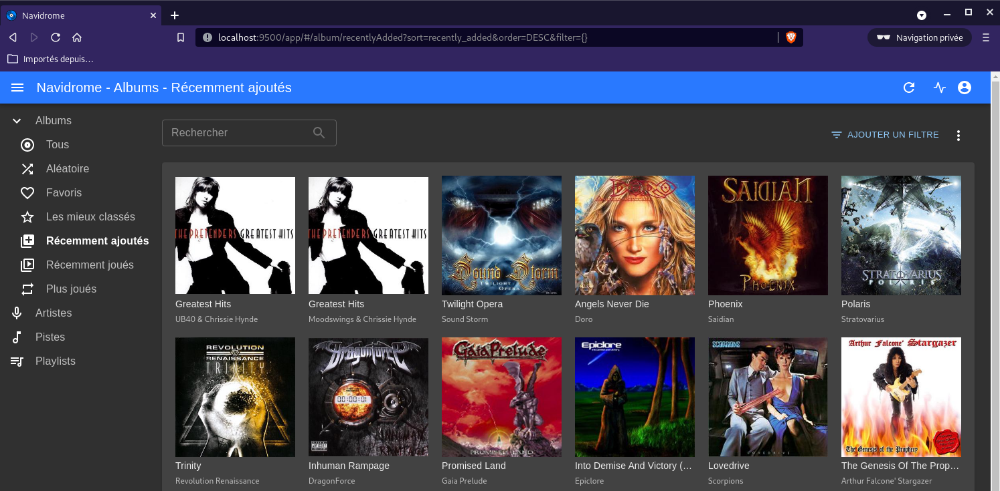

+++
title = 'Archlinux Debian - Compilation go Audio Navidrome'
date = 2022-09-24 00:00:00 +0100
categories = ['go']
+++
*Ces opérations sont exécutées dans un container Debian sur Archlinux*

## Navidrome compilation

[Development Environment](https://www.navidrome.org/docs/developers/dev-environment/)

### Prérequis

* GoLang [Debian - Installer Go](/posts/Debian_installer_Go+Node/#-go) 
* Node [NVM - Node Version Manager (Gérer les versions node.js)](/posts/Archlinux-Debian-Node.js-Nvm-Npm-Yarn/#nvm---node-version-manager-g%C3%A9rer-les-versions-nodejs)
* TagLib et compléments Debian : `sudo apt install libtag1-dev build-essential pkg-config ffmpeg`

**IMPORTANT** : Si vous changez la version "go" installée, il faut supprimer le dossier `/usr/local/go` avant l'installation d'une nouvelle version "go"
Répertoire
{: .prompt-warning }

    mkdir -p $HOME/media/devel/go_projects

Pour connaitre les versions **go** et **node** à utiliser dans la compilation **navidrome**, voir le lien <https://www.navidrome.org/docs/installation/build-from-source/> 

Par exemple au 24/09/2022 : *First, you will need to install Go 1.18 and Node 16*  
Installer go 1.18

```bash
sudo rm -r /usr/local/go
wget https://go.dev/dl/go1.18.6.linux-amd64.tar.gz
sudo tar -C /usr/local -xzf go1.18.6.linux-amd64.tar.gz
go version # go version go1.18.6 linux/amd64
```

Installer Node 16

```bash
nvm list # v16.14.2 est présent dans la liste
nvm use 16.14  # Now using node v16.14.2 (npm v8.5.0)
```

### Projet navidrome (français)

Cloner le projet from <https://github.com/navidrome/navidrome>

    cd ~
    git clone https://github.com/navidrome/navidrome $HOME/media/devel/go_projects/navidrome-lxc
    cd $HOME/media/devel/go_projects/navidrome-lxc  # Aller dans le dossier de développement

**Le language Français**  

*Le language par défaut est anglais, modification pour avoir le français*

Copier le fichier language français

	cp $HOME/media/devel/go_projects/navidrome-lxc/resources/i18n/fr.json $HOME/media/devel/go_projects/navidrome-lxc/ui/src/i18n/

Modifier les fichiers `provider.js` et `useGetLanguageChoice.js` dans le dossier `$HOME/media/devel/go_projects/navidrome-lxc/ui/src/i18n/`

```bash
sed -i "s/en\.json/fr\.json/g" $HOME/media/devel/go_projects/navidrome-lxc/ui/src/i18n/provider.js
sed -i "s/'en'/'fr'/g" $HOME/media/devel/go_projects/navidrome-lxc/ui/src/i18n/provider.js
sed -i "s/'en'/'fr'/g" $HOME/media/devel/go_projects/navidrome-lxc/ui/src/i18n/useGetLanguageChoices.js
sed -i "s/'English'/'Français'/g" $HOME/media/devel/go_projects/navidrome-lxc/ui/src/i18n/useGetLanguageChoices.js
```

### Construire binaire production

Aller dans le dossier

    cd $HOME/media/devel/go_projects/navidrome-lxc/

Installer les outils de développement

    make setup-dev  

Construire le binaire de production

    make buildall # Cette commande doit créer un exécutable `navidrome` dans le dossier du projet

Créez un fichier de configuration `navidrome.toml` dans le dossier du projet avec les options suivantes :

    $HOME/media/devel/go_projects/navidrome-lxc/navidrome.toml

```
# Définissez votre dossier musical, de préférence une bibliothèque musicale de développement spécifique avec peu de chansons,
# pour rendre le scan rapide
MusicFolder = "/home/lxcdeb/media/music"

# Rendre le débogage plus verbeux
LogLevel = "debug" 

# Cela créera toujours un utilisateur "admin" avec le mot de passe spécifié, donc vous n'avez pas à 
# créer un utilisateur à chaque fois que vous supprimez votre base de données de développement
DevAutoCreateAdminPassword = "navi49600"

# Déplacer le dossier data/DB vers un autre endroit
DataFolder = "./data"

# Si vous développez dans macOS avec le pare-feu activé, cela évite d'avoir à accepter les 
# connexions réseau à chaque fois que le serveur redémarre
Address = "localhost"
```

### Lancement manuel

Lancement manuel du binaire

    ./navidrome

```
[...]
INFO[0000] Configuring Media Folder                      name="Music Library" path=/home/lxcdeb/media/music
INFO[0000] Creating Image cache                          maxSize="100 MB" path=cache/images
INFO[0000] Finished initializing cache                   cache=Image elapsedTime="154.311µs" maxSize=100MB
INFO[0000] Found ffmpeg                                  path=/usr/bin/ffmpeg
INFO[0000] Last.FM integration not available: missing ApiKey/Secret 
INFO[0000] Spotify integration is not enabled: artist images will not be available 
INFO[0000] Creating Transcoding cache                    maxSize="100 MB" path=cache/transcoding
INFO[0000] Finished initializing cache                   cache=Transcoding elapsedTime="80.321µs" maxSize=100MB
INFO[0000] Mounting routes                               path=/rest
INFO[0000] Mounting routes                               path=/app
INFO[0000] Login rate limit set                          requestLimit=5 windowLength=20s
INFO[0000] Navidrome server is accepting requests        address="0.0.0.0:4533"
```

Le lien http://localhost:4533  
Au premier lancement saisir un mot de passe admin  

### Lancement via systemd

Lancement auto du binaire via systemd

Créer le service navidrome `/etc/systemd/system/navidrome.service`

    sudo nano /etc/systemd/system/navidrome.service

```
[Unit]
Description=Navidrome Music Server and Streamer compatible with Subsonic/Airsonic
After= network.target

[Service]
Type=simple
User=lxcdeb
WorkingDirectory=/home/lxcdeb/media/devel/go_projects/navidrome-lxc
ExecStart=/home/lxcdeb/media/devel/go_projects/navidrome-lxc/navidrome --configfile "/home/lxcdeb/media/devel/go_projects/navidrome-cfg/navidrome.toml"
Restart=on-failure

[Install]
WantedBy=multi-user.target
```

Activer, démarrer et vérifier le service navidrome

    sudo systemctl daemon-reload
    sudo systemctl start navidrome.service
    sudo systemctl status navidrome.service

Modifier la page d'accueil, fichier `/var/www//index/`

```
<p><a href="http://lxcdeb:4533">music</a>
<em> Navidrome</em>
</p>
```

Accès depuis PC1 si `/etc/hosts` contient `192.168.0.200	lxcdeb`  
<http://lxcdeb:4533>

## Navidrome développement

Pour lancer Navidrome en mode développement

    make dev

```
[...]
16:47:46 JS.1   |  Starting the development server...
16:47:48 GO.1   |  [00] DEBU[0002] Scanning folder                               folder=/home/lxcdeb/media/music lastModifiedSince="2021-03-08 16:46:41.61 +0100 CET"
16:47:48 GO.1   |  [00] DEBU[0002] Directory tree loaded from DB                 elapsed=23.2ms total=281
16:47:48 GO.1   |  [00] DEBU[0002] Finished reading directories from filesystem  elapsed=22.3ms
16:47:48 GO.1   |  [00] DEBU[0002] Finished deleted folders check                elapsed="102.263µs" total=0
16:47:48 GO.1   |  [00] DEBU[0002] No changes found in Music Folder              elapsed=45.6ms folder=/home/lxcdeb/media/music
16:47:55 JS.1   |  Compiled successfully!
16:47:55 JS.1   |  You can now view navidrome-ui in the browser.
16:47:55 JS.1   |    Local:            http://localhost:4533
16:47:55 JS.1   |    On Your Network:  http://192.168.0.200:4533
16:47:55 JS.1   |  Note that the development build is not optimized.
16:47:55 JS.1   |  To create a production build, use npm run build.

```
    
Cela démarrera à la fois le backend et le frontend en mode "watch", donc tout changement sera automatiquement rechargé.

>Si vous rencontrez des erreurs lors de l'une de ces étapes, [rejoignez notre "chat"] (https://www.navidrome.org/community/) pour obtenir de l'aide.


## Navidrome web

[Steps to install on Ubuntu Linux (and other Debian based distros)](https://www.navidrome.org/docs/installation/linux/)

Les étapes suivantes ont été testées sur Ubuntu 18.04 et devraient fonctionner sur toutes les versions 16.04 et supérieures ainsi que sur les autres distros basées sur Debian. Tout au long de ces instructions, les commandes auront des espaces réservés pour l'utilisateur (`<user>`) et le groupe (`<group>`) sous lesquels vous souhaitez exécuter Navidrome et le chemin du dossier de musique (`<library_path>`). Si vous utilisez une médiathèque existante, assurez-vous que l'utilisateur a les droits sur la médiathèque.

### Préalables

**Conditions préalables à la mise à jour et à l'installation**  
Assurez-vous que votre système est à jour et installez ffmpeg.

    sudo apt update && sudo apt upgrade
    sudo apt install ffmpeg

Par défaut, la commande useradd ne crée pas de répertoires de base, mais pour un démon, je vous recommande d'utiliser l'option système et de remplacer le shell par un shell inexistant afin que personne ne puisse se connecter à ce compte (sous ssh par exemple):

    sudo useradd -r -s /bin/false navidrome

**Créer une structure de répertoire**  
Créez un répertoire pour stocker l'exécutable Navidrome et un répertoire de travail avec les permissions appropriées.

    sudo install -d -o navidrome -g navidrome /opt/navidrome
    sudo install -d -o navidrome -g navidrome /var/lib/navidrome

### Exécutable navidrome

**Alternative A - Navidrome depuis le site**  
Téléchargez la dernière version depuis la [page des versions](https://github.com/navidrome/navidrome/releases), extrayez le contenu dans le répertoire exécutable et définissez les autorisations pour les fichiers. (Remplacez l'URL ci-dessous par celle de la page des versions) :

    wget https://github.com/navidrome/navidrome/releases/download/v0.45.1/navidrome_0.45.1_Linux_arm64.tar.gz -O Navidrome.tar.gz
    sudo tar -xvzf Navidrome.tar.gz -C /opt/navidrome/
    sudo chown -R navidrome:navidrome /opt/navidrome

**Alternative B - [Navidrome par compilation](#navidrome-par-compilation)**   
Copier l'exécutable `navidrome` dans le dossier `/opt/navidrome`

    sudo cp $HOME/media/devel/go_projects/navidrome-lxc/navidrome /opt/navidrome/
    sudo chown -R navidrome:navidrome /opt/navidrome

### Configuration navidrome.toml

Dans le répertoire de travail, `/var/lib/navidrome` créer un nouveau fichier nommé `navidrome.toml` avec les paramètres suivants.

    MusicFolder = "/home/userhms/sshfs/musique"

Pour d'autres options de configuration, voir la page des [options de configuration](https://www.navidrome.org/docs/usage/configuration-options/).

### Systemd navidrome.service

Créez un nouveau fichier sous `/etc/systemd/system/` nommé `navidrome.service` avec les données suivantes.

    /etc/systemd/system/navidrome.service

```
[Unit]
Description=Navidrome Music Server and Streamer compatible with Subsonic/Airsonic
After=remote-fs.target network.target
AssertPathExists=/var/lib/navidrome

[Install]
WantedBy=multi-user.target

[Service]
User=navidrome
Group=navidrome
Type=simple
ExecStart=/opt/navidrome/navidrome --configfile "/var/lib/navidrome/navidrome.toml"
WorkingDirectory=/var/lib/navidrome
TimeoutStopSec=20
KillMode=process
Restart=on-failure

# See https://www.freedesktop.org/software/systemd/man/systemd.exec/
DevicePolicy=closed
NoNewPrivileges=yes
PrivateTmp=yes
PrivateUsers=yes
ProtectControlGroups=yes
ProtectKernelModules=yes
ProtectKernelTunables=yes
RestrictAddressFamilies=AF_UNIX AF_INET AF_INET6
RestrictNamespaces=yes
RestrictRealtime=yes
SystemCallFilter=~@clock @debug @module @mount @obsolete @reboot @setuid @swap
ReadWritePaths=/var/lib/navidrome

# You can uncomment the following line if you're not using the jukebox This
# will prevent navidrome from accessing any real (physical) devices
#PrivateDevices=yes

# You can change the following line to `strict` instead of `full` if you don't
# want navidrome to be able to write anything on your filesystem outside of
# /var/lib/navidrome.
ProtectSystem=full

# You can uncomment the following line if you don't have any media in /home/*.
# This will prevent navidrome from ever reading/writing anything there.
#ProtectHome=true

# You can customize some Navidrome config options by setting environment variables here. Ex:
#Environment=ND_BASEURL="/navidrome"
```

**Démarrez le service Navidrome**  
Rechargez le démon de service, démarrez le service nouvellement créé, et vérifiez qu'il a démarré correctement.

    sudo systemctl daemon-reload
    sudo systemctl start navidrome.service
    sudo systemctl status navidrome.service

### SSH Port Forwarding

Si le service a démarré correctement, vérifiez que vous pouvez accéder à http://localhost:4533.  
Ouvrir un terminal sur le client linux qui dispose des clés ssh et lancer la commande

    ssh -L 9500:localhost:4533 userhms@45.145.166.51 -p 55051 -i /home/yann/.ssh/hms-sto-250

Ouvrir un navigateur sur le client et saisir [localhost:9500](URL) pour afficher le serveur audio  
{:width="400"}

Démarrez Navidrome au démarrage

    sudo systemctl enable navidrome.service

### Proxy web nginx

**Proxy nginx zic.xoyaz.xyz**  
Le domaine “zic.xoyaz.xyz” est activé avec les certificats let’s encrypt

Le fichier de configuration nginx `/etc/nginx/conf.d/zic.xoyaz.xyz.conf`


```
server {
    listen 80;
    listen [::]:80;
    server_name zic.xoyaz.xyz;
    return 301 https://$host$request_uri;
}
server {
    listen 443 ssl http2;
    listen [::]:443 ssl http2;
    server_name zic.xoyaz.xyz;
    ssl_certificate /etc/ssl/private/xoyaz.xyz-fullchain.pem;
    ssl_certificate_key /etc/ssl/private/xoyaz.xyz-key.pem;

    root /var/www/;
    index index/ index.php;

    # TLS 1.3 only
    ssl_protocols TLSv1.3;
    ssl_prefer_server_ciphers off;
 
    # HSTS (ngx_http_headers_module is required) (63072000 seconds)
    add_header Strict-Transport-Security "max-age=63072000" always;
 
    # OCSP stapling
    ssl_stapling on;
    ssl_stapling_verify on;
 
    # verify chain of trust of OCSP response using Root CA and Intermediate certs
    ssl_trusted_certificate /etc/ssl/private/xoyaz.xyz-fullchain.pem;

    # replace with the IP address of your resolver
    resolver 1.1.1.1;

    location / { 
        proxy_pass              http://127.0.0.1:4533;
    } 

}
```

