+++
title = 'Serveur Lenovo Thinkcentre M700 Tiny M.2 SSD 500Go + HDD Mobile 1.7To'
date = 2022-10-07 00:00:00 +0100
categories = ['debian']
+++
{:height="100"} 
{:height=100}  
**ThinkCentre M700 Tiny**  

Intel Core i3-6100T 2.20Ghz  
8 Go RAM DDR4  
SSD M.2 2280 500 Go  
{:height="50"}  
HDD Mobile 1.8 To  
Gigabit LAN  
M.2 slots	M.2 2280/2242 M-key (SATA); M.2 2230 (WiFi/BT);  
Dimensions (L x P x H) (mm) : 34,5 x 182,9 x 179 mm  
Ports d'E/S (entrées/sorties)	

* Avant : 
    * 2 USB 3.0 (dont un avec technologie Fast Charge)
    * 2 audio
* Arrière : 
    * Jusqu'à 4 USB 3.0
    * DisplayPort™ + DisplayPort™ 1 série par retrait de cache (VGA / HDMI™ DisplayPort™ / Série)
    * 1 LAN
    * 1 audio
* WiFi et Bluetooth®	
    * 1 x 1 802.11 a/c WLAN + Bluetooth® 4.0
    * 2 x 2 802.11 a/c WLAN + Bluetooth® 4.0

## Sommaire

- [Sommaire](#sommaire)
    - [Mise à jour BIOS](#mise-à-jour-bios)
- [Debian 11 bullseye](#debian-11-bullseye)
    - [Ip V4 V6 statiques](#ip-v4-v6-statiques)
    - [OpenSSH, clé et script](#openssh-clé-et-script)
        - [Connexion SSH PC1 --> Lenovo](#connexion-ssh-pc1----lenovo)
        - [Connexion SSH Lenovo --> PC1](#connexion-ssh-lenovo----pc1)
        - [Envoi notification vers PC1 via SSH](#envoi-notification-vers-pc1-via-ssh)
    - [Utilitaires](#utilitaires)
    - [Motd](#motd)
    - [Parefeu UFW](#parefeu-ufw)
    - [Wake on Lan](#wake-on-lan)
    - [Notification - script au boot](#notification---script-au-boot)
    - [Modification Grub](#modification-grub)
    - [Journalctl](#journalctl)
    - [Historique ligne de commande](#historique-ligne-de-commande)
    - [Docker + docker compose](#docker--docker-compose)
    - [Disques, fstab](#disques-fstab)
- [Nginx compilation, PHP8, MariaDB](#nginx-compilation-php8-mariadb)
    - [Nginx compilé](#nginx-compilé)
    - [Nouvelles configurations nginx](#nouvelles-configurations-nginx)
    - [PHP8 et composer](#php8-et-composer)
    - [MariaDB](#mariadb)
- [rnmkcy.eu](#rnmkcyeu)
    - [Zone DNS OVH](#zone-dns-ovh)
    - [Certificats Let's Encrypt](#certificats-lets-encrypt)
    - [Renouvellement Certificats Let's Encrypt](#renouvellement-certificats-lets-encrypt)
    - [Configuration nginx](#configuration-nginx)
    - [Page d'accueil rnmkcy.eu](#page-daccueil-rnmkcyeu)
    - [Site statique static.rnmkcy.eu](#site-statique-staticrnmkcyeu)
    - [FreshRSS](#freshrss)
        - [Prérequis](#prérequis)
        - [Installer FreshRSS](#installer-freshrss)
        - [Création d'une base de données pour FreshRSS](#création-dune-base-de-données-pour-freshrss)
        - [Configuration de Nginx](#configuration-de-nginx)
        - [Configuration web](#configuration-web)
        - [Configuration de la mise à jour automatique des flux](#configuration-de-la-mise-à-jour-automatique-des-flux)
    - [Mediawiki](#mediawiki)
    - [gpx.rnmkcy.eu](#gpxrnmkcyeu)
- [Sécurisation serveur avec fail2ban](#sécurisation-serveur-avec-fail2ban)
- [Accès partage Freebox](#accès-partage-freebox)
- [BorgBackup](#borgbackup)
    - [Créer volume sauvegardes](#créer-volume-sauvegardes)
    - [Borgbackup serveur lenovo](#borgbackup-serveur-lenovo)
- [Virtualisation KVM](#virtualisation-kvm)

### Mise à jour BIOS

Télécharger le fichier iso sur le site [Flash BIOS Update - Intel B150 for ThinkCentre M700 Tiny, ThinkCentre M800, M900, M900x Tiny](https://support.lenovo.com/de/en/downloads/ds105487-flash-bios-update-intel-b150-for-thinkcentre-m700-tiny-thinkcentre-m800-m900-m900x-tiny)

    wget https://download.lenovo.com/pccbbs/thinkcentre_bios/fwj9bcusa.iso  # Version FWKTBCA27 Jan 2022

```
    Checksum Tips

    SHA256: 7a0e889d697c225f73bdc27df7830e0a89a41ccc1bdb1c3ede60d872412b5c01
    SHA1: 59256372e3e785ba7d0807a9e990340d870d07f2
    MD5: d3fc782a415fb9c9a06ad25782ae5876
```

[How to update Lenovo BIOS from Linux without using Windows](https://www.cyberciti.biz/faq/update-lenovo-bios-from-linux-usb-stick-pen/)

Installer utilitaire

```
sudo -s
cd /usr/local/bin
wget https://userpages.uni-koblenz.de/~krienke/ftp/noarch/geteltorito/geteltorito/geteltorito
chmod +x geteltorito
exit
```

Extraire l'image

    geteltorito -o m700.img fwj9bcusa.iso

```
Booting catalog starts at sector: 18 
Manufacturer of CD: FWJTBCA
Image architecture: x86
Boot media type is: harddisk
El Torito image starts at sector 28 and has 32130 sector(s) of 512 Bytes

Image has been written to file "m700.img".
```

Identifier la clé USB : `sudo dmesg` , /dev/sdc dans notre cas  
Exécutez la commande suivante pour écrire l'image nommée m700.img sur la clé USB 

    sudo dd if=m700.img of=/dev/sdc bs=64K status=progress

Installation du paquet

1.  Veuillez prendre note de tous les paramètres que vous avez modifiés dans l'utilitaire BIOS
    de l'utilitaire de configuration. Il se peut que vous deviez les saisir à nouveau après la mise à jour du BIOS. 
    le BIOS.                                                    
2.  Utilisez le programme de mise à jour flash en le plaçant dans une clé USB amorçable.  
    Tout d'abord, interrompez le processus de démarrage en appuyant sur la touche ENTER. Appuyez ensuite sur la touche F12 et sélectionnez le périphérique de stockage de masse USB comme source de démarrage. Assurez-vous que l'alimentation de votre ordinateur portable est branchée. Dans certains cas, la batterie doit être chargée à 80-100%. Assurez-vous de suivre les instructions à l'écran pour mettre à jour le BIOS.
3.  Le niveau actuel du BIOS de l'ordinateur est comparé à celui de la mise à jour flash.
    la mise à jour flash. Si les niveaux sont identiques, ou si le niveau de la mise à jour
    mise à jour est plus ancien que celui de la ROM, un message s'affiche, indiquant que
    "Le fichier de la ROM du BIOS est plus ancien que (ou identique à) l'image de la ROM du BIOS.    
    Continuer quand même ? (y/n)", tapez 'y'.                        
4.  La mise à jour peut prendre jusqu'à 2 minutes. N'éteignez pas et ne redémarrez pas le
    système pendant cette procédure !                                
5.  Une fois la mise à jour flash terminée, le système redémarre automatiquement.
    N'oubliez pas de retirer le dispositif flash, sinon vous risquez d'être
    obtenir une nouvelle mise à jour de votre BIOS. 


## Debian 11 bullseye

{:height="100"} 

Installer avec clé USB contenant image ISO **firmware-11.2.0-amd64-netinst.iso** (pour les pilotes carte wifi/bluetooth)  

Machine : think  
root : root49600  
leno : leno49600  

Disque SSD 500Go M.2  
Partition 1 : EFI de 512 Mo  
Partition 2 : LVM sur le reste du disque  

Volume : vg-wd
Volumes logiques : lv-root de 60 Go ext4, lv-home de 40 Go ext4

Partitions LVM avec home séparé et 50Go utilisé  

La machine reboot à la fin de l'installation  
Se connecter avec l'utilisateur "leno"  
Relever l'adresse ip : `ip a` , exemple 192.168.0.11

On peut également se connecter via ssh : `ssh leno@192.168.0.11`  


Passer en `su` , installer sudo

    su
    apt install sudo
    echo "leno     ALL=(ALL) NOPASSWD: ALL" >> /etc/sudoers


### Ip V4 V6 statiques

Pour le nexthop IPV6 FreeBox

    ip a |grep "inet6 fe80"

*inet6 fe80::223:24ff:fec9:686/64 scope link*

Passage en ip statique 192.168.0.145 et 2a01:e0a:2de:2c71::1 (nexthop `fe80::223:24ff:fec9:686`)   	
lien local box : fe80::8e97:eaff:fe39:66d6

    nano /etc/network/interfaces

```
# This file describes the network interfaces available on your system
# and how to activate them. For more information, see interfaces(5).

source /etc/network/interfaces.d/*

# The loopback network interface
auto lo
iface lo inet loopback
# The primary network interface
allow-hotplug eno1
iface eno1 inet static
 address 192.168.0.145
 netmask 255.255.255.0
 gateway 192.168.0.254
# IPv6 interface
iface eno1 inet6 static
 address 2a01:e0a:2de:2c71::1
 netmask 64
 post-up ip -6 route add default via fe80::8e97:eaff:fe39:66d6 dev eno1

# utiliser SLAAC pour obtenir l'adresse IPv6 globale du routeur
# nous ne devons pas activer le forwarding IPv6, sinon SLAAC sera désactivé.
 autoconf 1
 accept_ra 2

```

Vérifier le dns

    etc/resolv.conf 

```
domain lan
search lan
nameserver 192.168.0.254
```

Un redémarrage de la machine pour la prise en compte : `systemctl reboot`

Connexion sur l'adresse ip fixe

    ssh leno@2a01:e0a:2de:2c71::1  # IPV4 -> ssh leno@192.168.0.145

Vérification des adresses IP

    ip a

```
1: lo: <LOOPBACK,UP,LOWER_UP> mtu 65536 qdisc noqueue state UNKNOWN group default qlen 1000
    link/loopback 00:00:00:00:00:00 brd 00:00:00:00:00:00
    inet 127.0.0.1/8 scope host lo
       valid_lft forever preferred_lft forever
    inet6 ::1/128 scope host 
       valid_lft forever preferred_lft forever
2: eno1: <BROADCAST,MULTICAST,UP,LOWER_UP> mtu 1500 qdisc pfifo_fast state UP group default qlen 1000
    link/ether 00:23:24:c9:06:86 brd ff:ff:ff:ff:ff:ff
    altname enp0s31f6
    inet 192.168.0.145/24 brd 192.168.0.255 scope global eno1
       valid_lft forever preferred_lft forever
    inet6 2a01:e0a:2de:2c71::1/64 scope global 
       valid_lft forever preferred_lft forever
    inet6 fe80::223:24ff:fec9:686/64 scope link 
       valid_lft forever preferred_lft forever
```

Hostname

    hostnamectl

```
   Static hostname: think
         Icon name: computer-desktop
           Chassis: desktop
        Machine ID: 8803de6335af485cb4a977653612d936
           Boot ID: 367ff70df3db42e88d44ad8c1edf492f
  Operating System: Debian GNU/Linux 11 (bullseye)
            Kernel: Linux 5.10.0-11-amd64
      Architecture: x86-64
```

Date et heure

    timedatectl

```
               Local time: mar. 2022-02-22 15:10:27 CET
           Universal time: mar. 2022-02-22 14:10:27 UTC
                 RTC time: mar. 2022-02-22 14:10:27
                Time zone: Europe/Paris (CET, +0100)
System clock synchronized: yes
              NTP service: active
          RTC in local TZ: no
```

Vérifier si utilsateur appartient au groupe "users" : `id leno`  
Si non appartenance, exécuter : `sudo usermod -a -G users leno`

### OpenSSH, clé et script

{:width="70"}  

#### Connexion SSH PC1 --> Lenovo

**connexion avec clé**  
<u>sur l'ordinateur de bureau</u>
Générer une paire de clé curve25519-sha256 (ECDH avec Curve25519 et SHA2) pour une liaison SSH avec le serveur.  

    ssh-keygen -t ed25519 -o -a 100 -f ~/.ssh/lenovo-ed25519

Envoyer les clés publiques sur le serveur KVM   

    ssh-copy-id -i ~/.ssh/lenovo-ed25519.pub leno@192.168.0.145

<u>sur le serveur KVM</u>  
On se connecte  

    ssh leno@192.168.0.145

Modifier la configuration serveur SSH  

    sudo nano /etc/ssh/sshd_config

Modifier

```conf
Port = 55145
PasswordAuthentication no
```

Relancer le serveur

    sudo systemctl restart sshd

Test connexion

    ssh -p 55145 -i ~/.ssh/leno-ed25519 leno@192.168.0.145

#### Connexion SSH Lenovo --> PC1

Générer une paire de clé curve25519-sha256 (ECDH avec Curve25519 et SHA2) pour une liaison SSH avec PC1  

    ssh-keygen -t ed25519 -o -a 100 -f ~/.ssh/PC1-ed25519

Envoyer les clés publiques sur PC1  

    ssh-copy-id -i ~/.ssh/PC1-ed25519.pub yann@192.168.0.42

On se connecte sur PC1

    ssh yann@192.168.0.42

Modifier la configuration SSH PC1

    sudo nano /etc/ssh/sshd_config

Modifier

```conf
Port = 55042
PasswordAuthentication no
```

Relancer le service

    sudo systemctl restart sshd

Test connexion depuis Lenovo M700

    ssh -p 55042 -i ~/.ssh/PC1-ed25519 yann@192.168.0.42

#### Envoi notification vers PC1 via SSH

notify-send via ssh

    ssh -p 55042 -i ~/.ssh/PC1-ed25519 yann@192.168.0.42 'DISPLAY=:0 notify-send "Lenovo M700" "Test notification à distance" -i /home/yann/media/statique/images/information.png -t 10000'

`-i /home/yann/media/statique/images/information.png` : Image présente sur le distant  
`-t 10000` : durée affichage en ms soit 10 s dans l'exemple  

### Utilitaires

Installer utilitaires  

    sudo apt install rsync curl tmux jq figlet git

### Motd

Effacer et créer motd

    sudo rm /etc/motd && sudo nano /etc/motd

```
  _                                __  __  ____  __    __  
 | |    ___  _ _   ___ __ __ ___  |  \/  ||__  |/  \  /  \ 
 | |__ / -_)| ' \ / _ \\ V // _ \ | |\/| |  / /| () || () |
 |____|\___||_||_|\___/ \_/ \___/ |_|  |_| /_/  \__/  \__/ 
  _  ___  ___     _   __  ___     __     _  _ _   ___      
 / |/ _ \|_  )   / | / / ( _ )   /  \   / || | | | __|     
 | |\_, / / /  _ | |/ _ \/ _ \ _| () |_ | ||_  _||__ \     
 |_| /_/ /___|(_)|_|\___/\___/(_)\__/(_)|_|  |_| |___/     
```

Script ssh_rc_bash

>ATTENTION!!! Les scripts sur connexion peuvent poser des problèmes pour des appels externes autres que ssh

```bash
wget https://static.xoyaz.xyz/files/ssh_rc_bash
chmod +x ssh_rc_bash # rendre le bash exécutable
./ssh_rc_bash        # exécution
```

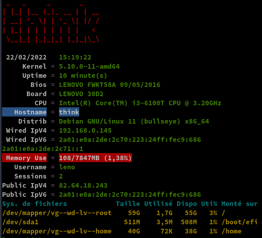

### Parefeu UFW

{:width="50"} 

*UFW, ou pare - feu simple , est une interface pour gérer les règles de pare-feu dans Arch Linux, Debian ou Ubuntu. UFW est utilisé via la ligne de commande (bien qu'il dispose d'interfaces graphiques disponibles), et vise à rendre la configuration du pare-feu facile.*

Installation **Debian / Ubuntu**

    sudo apt install ufw

*Par défaut, les jeux de règles d'UFW sont vides, de sorte qu'il n'applique aucune règle de pare-feu, même lorsque le démon est en cours d'exécution.*   

Les règles 

```bash
sudo ufw allow 55145/tcp  # port SSH
sudo ufw allow http       # port 80
sudo ufw allow https      # port 443
sudo ufw allow DNS        # port 53
```

Activer le parefeu

    sudo ufw enable

```
Command may disrupt existing ssh connections. Proceed with operation (y|n)? y
Firewall is active and enabled on system startup
```

Status

     sudo ufw status verbose

```
Status: active
Logging: on (low)
Default: deny (incoming), allow (outgoing), disabled (routed)
New profiles: skip

To                         Action      From
--                         ------      ----
55145/tcp                  ALLOW IN    Anywhere                  
80/tcp                     ALLOW IN    Anywhere                  
443                        ALLOW IN    Anywhere                  
53 (DNS)                   ALLOW IN    Anywhere                  
55145/tcp (v6)             ALLOW IN    Anywhere (v6)             
80/tcp (v6)                ALLOW IN    Anywhere (v6)             
443 (v6)                   ALLOW IN    Anywhere (v6)             
53 (DNS (v6))              ALLOW IN    Anywhere (v6)             
```

### Wake on Lan

[How To Wake Up Computers Using Linux Command [ Wake-on-LAN ( WOL ) ] By Sending Magic Packets](https://www.cyberciti.biz/tips/linux-send-wake-on-lan-wol-magic-packets/)  
wake-on-LAN (WOL) est une norme de réseau Ethernet qui permet d'allumer un serveur par un message réseau. Vous devez envoyer des "paquets magiques" aux adaptateurs Ethernet et aux cartes mères compatibles avec le WOL pour allumer les systèmes concernés. Assurez-vous de connecter la carte réseau (eth0 ou eth1) à la carte mère et d'activer la fonction WOL du BIOS. Voici un guide rapide pour activer la fonction WOL sous RHEL / Fedora / CentOS / Debian / Ubuntu Linux.

Dans le bios du lenovo M700, le paramètre "wake on lan" est sur automatique.  
Lorsque le Lenovo M700 eest éteint, on peut le rallumer avec un outil logiciel et l'adresse mac de la machine

Il faut utiliser un logiciel client pour envoyer les "paquets magiques" WoL (Wake-on-LAN) au système cible. Vous trouverez divers outils pour tous les systèmes d'exploitation modernes, notamment MS-Windows 8/10, Apple macOS & OS X, toutes les distros Linux modernes, FreeBSD, OpenBSD, NetBSD et de nombreux smartphones.Il existe également un script Perl pour réveiller les ordinateurs. Nous pouvons l'installer comme suit

    sudo apt install wakeonlan # Debian/Ubuntu 
    yay -S wakeonlan # archlinux

Vous pouvez obtenir l'adresse MAC en combinant la commande ping et la commande arp.

    ping -c 4 rnmkcy.eu && arp -n

```
PING rnmkcy (192.168.0.145) 56(84) octets de données.
64 octets de rnmkcy (192.168.0.145) : icmp_seq=1 ttl=64 temps=0.587 ms
64 octets de rnmkcy (192.168.0.145) : icmp_seq=2 ttl=64 temps=0.520 ms
64 octets de rnmkcy (192.168.0.145) : icmp_seq=3 ttl=64 temps=0.562 ms
64 octets de rnmkcy (192.168.0.145) : icmp_seq=4 ttl=64 temps=0.559 ms

--- statistiques ping rnmkcy ---
4 paquets transmis, 4 reçus, 0% packet loss, time 3031ms
rtt min/avg/max/mdev = 0.520/0.557/0.587/0.023 ms
Address                  HWtype  HWaddress           Flags Mask            Iface
192.168.0.145            ether   00:23:24:c9:06:86   C                     br0
```

Utilisation d'une adresse de diffusion de sous-réseau :

    wakeonlan -i 192.168.0.255 00:23:24:c9:06:86

```
Sending magic packet to 192.168.0.255:9 with payload 00:23:24:c9:06:86
Hardware addresses: <total=1, valid=1, invalid=0>
Magic packets: <sent=1>
```

Patienter 2 à 3 minutes avant d'accéder à la machine...

### Notification - script au boot

La machine Lenovo M700 Debian 11 peut être mise hors tension depuis PC1   

    ssh leno@192.168.0.145 -p 55145 -i /home/yann/.ssh/lenovo-ed25519 'sudo systemctl poweroff'

Le réveil de la machine se fait avec la fonction "wakeonlan" depuis PC1

    wakeonlan -i 192.168.0.255 00:23:24:c9:06:86

On veut envoyer une notification à PC1 lorsque la machine est totalement opérationnel

    sudo nano /usr/local/bin/startup_script.sh

```shell
#!/bin/bash
SCRIPT_NAME=$(basename -- "$0")
ssh -p 55042 -i /home/leno/.ssh/PC1-ed25519 yann@192.168.0.42 'DISPLAY=:0 notify-send "Lenovo M700" "Machine fonctionnelle" -i /home/yann/media/statique/images/information.png -t 10000'
#wall $SCRIPT_NAME: COMPLETELY FINISHED
```

MODIFICATION : En plus du message, on lance l'exécution du script de sauvegarde  

```shell
#!/bin/bash
SCRIPT_NAME=$(basename -- "$0")
ssh -p 55042 -i /home/leno/.ssh/PC1-ed25519 yann@192.168.0.42 'DISPLAY=:0 notify-send "Lenovo M700" "Machine fonctionnelle + lancement script de sauvegarde" -i /home/yann/media/statique/images/information.png -t 10000'
# exécution du script 
ssh -p 55042 -i /home/leno/.ssh/PC1-ed25519 yann@192.168.0.42 '/bin/bash /home/yann/scripts/sav-yann-media.sh'
```

`Si on opte pour le bash avec exécution de la sauvegarde, il faut désactiver le timer local sur la machine PC1`{: .prompt-warning }
 

Fournir la permission d'exécuter le script

    sudo chmod +x /usr/local/bin/startup_script.sh

Exécuter le script au démarrage après que tous les services systemd soient chargés.

    sudo nano /etc/systemd/system/run-at-startup.service

```
[Unit]
Description=Run script at startup after all systemd services are loaded
After=default.target

[Service]
Type=simple
RemainAfterExit=yes
ExecStart=/usr/local/bin/startup_script.sh
TimeoutStartSec=0

[Install]
WantedBy=default.target
```

Rafraîchir les fichiers de configuration de systemd et activer le service

    sudo systemctl daemon-reload
    sudo systemctl enable run-at-startup.service

### Modification Grub

On ne veut pas avoir plusieurs OS , suppression de os-prober

    sudo apt remove os-prober

Modifier le time-out de grub

    sudo nano /etc/default/grub

```
GRUB_TIMEOUT=0
```

Regénérer le grub

    sudo grub-mkconfig -o /boot/grub/grub.cfg

### Journalctl

Ajout utilisateur courant au groupe systemd-journal et adm

	sudo gpasswd -a $USER systemd-journal
	sudo gpasswd -a $USER adm

Lignes non tronquées ,ajouter au fichier **~/.bashrc**  

    echo "export SYSTEMD_LESS=FRXMK journalctl" >> /home/$USER/.bashrc

Prise en compte après déconnexion/reconnexion ou `source .bashrc`

**Rendre persistant journalctl**  
Par défaut `journalctl` affiche les logs du dernier boot. En cas de freeze de votre serveur, il peut être intéressant de comprendre ce qui s’est passé juste avant le plantage…Du coup nous allons rendre journalctl persistant. 

    sudo nano /etc/systemd/journald.conf

Oter le commentaire (#) à la ligne Storage=auto et remplacer *auto* par *persistent* 

Réinitialiser le journal

```
sudo mkdir /var/log/journal
sudo systemd-tmpfiles --create --prefix /var/log/journal
sudo systemctl restart systemd-journald
```

Maintenant vous pouvez voir les différents boots

    sudo journalctl --list-boots

```
 0 518f818d328145f692098062be9056cb Thu 2019-08-29 11:07:55 CEST—Thu 2019-08-29 12:03:50 CEST
```

### Historique ligne de commande

Ajoutez la recherche d’historique de la ligne de commande au terminal.
Tapez un début de commande précédent, puis utilisez shift + up (flèche haut) pour rechercher l’historique filtré avec le début de la commande.

```
# Global, tout utilisateur
echo '"\e[1;2A": history-search-backward' | sudo tee -a /etc/inputrc
echo '"\e[1;2B": history-search-forward' | sudo tee -a /etc/inputrc
```

### Docker + docker compose

["Docker" + "Docker Compose" sur Debian Buster, installation et utilisation](/posts/Docker-Debian-Buster/)

Utilisateur

    sudo usermod -a -G docker $USER

Versions 

```
leno@think:~$ docker -v
Docker version 20.10.14, build a224086
leno@think:~$ docker-compose --version
docker-compose version 1.25.3, build d4d1b42b
```

## Nginx compilation, PHP8, MariaDB

### Nginx compilé

{:width="50"}  

Utilisateur avec droits sudo  

Télécharger le bash

```
wget https://static.xoyaz.xyz/files/compilation-nginx-tls1.3.sh
chmod +x compilation-nginx-tls1.3.sh # rendre le bash exécutable
./compilation-nginx-tls1.3.sh        # exécution
```

A la fin de la compilation

```
Versions Nginx OpenSSL
nginx version: nginx/1.20.2
OpenSSL 1.1.1k  25 Mar 2021
```

### Nouvelles configurations nginx

Tout ce qui suit sera pris en compte sur le bash de compilation
{: .prompt-info }

Créer le dossier log nginx

    sudo mkdir -p /var/log/nginx

Créer un fichier de configuration php fastcgi

    sudo nano /etc/nginx/php_fastcgi.conf

```nginx
# regex to split $uri to $fastcgi_script_name and $fastcgi_path
fastcgi_split_path_info ^(.+?\.php)(/.*)$;

# Check that the PHP script exists before passing it
try_files $fastcgi_script_name =404;

# Bypass the fact that try_files resets $fastcgi_path_info
# see: http://trac.nginx.org/nginx/ticket/321
set $path_info $fastcgi_path_info;
fastcgi_param PATH_INFO $path_info;

fastcgi_param REMOTE_USER $remote_user;
fastcgi_param SCRIPT_FILENAME $request_filename;
fastcgi_index index.php;
include fastcgi.conf;
```

Dans les fichiers de configuration 

REMPLACER

```nginx
    location ~ \.php$ {
        fastcgi_split_path_info ^(.+?\.php)(/.*)$;
        fastcgi_index index.php;
        include fastcgi_params;
        fastcgi_param REMOTE_USER $remote_user;
        fastcgi_param PATH_INFO $fastcgi_path_info;
        fastcgi_param SCRIPT_FILENAME $request_filename;
        fastcgi_pass unix:/run/php/php8.0-fpm.sock;
    }
```

PAR

```nginx
    location ~ \.php$ {
        include php_fastcgi.conf;
        fastcgi_pass unix:/run/php/php8.0-fpm.sock;
    }
```


### PHP8 et composer

{:width="50"}  

Ajout du dépôt sury.org

    sudo -s

Pour installer la version de 8 de php, ajouter le dépôt sury.

```bash
apt install -y lsb-release apt-transport-https ca-certificates wget
wget -O /etc/apt/trusted.gpg.d/php.gpg https://packages.sury.org/php/apt.gpg
echo "deb https://packages.sury.org/php/ $(lsb_release -sc) main" |tee /etc/apt/sources.list.d/php.list
```

Mise à jour des dépôts :

    apt update && apt upgrade -y

Installation de php8.0, php8.0-fpm, php8.0-sqlite3 et les paquets PHP nécessaires à nextcloud

    apt install php8.0 php8.0-fpm php8.0-sqlite3 php8.0-cli php8.0-gd php8.0-imap php8.0-mysql php8.0-soap php8.0-apcu php8.0-common php8.0-gmp  php8.0-intl php8.0-opcache php8.0-xml php8.0-curl php8.0-igbinary php8.0-readline  php8.0-zip php8.0-bcmath php8.0-imagick php8.0-mbstring php8.0-redis imagemagick

Nextcloud n'accepte pas les versions PHP > 8.0
{: .prompt-warning }

Composer

    wget https://getcomposer.org/download/latest-stable/composer.phar
    chmod +x composer.phar
    sudo mv composer.phar /usr/local/bin/composer

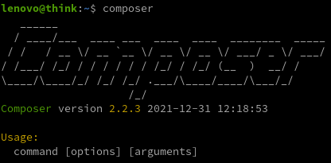

### MariaDB

{:width="50"}  
installer les paquets de MariaDB

    sudo apt install mariadb-server

Une fois que l'installation des composants est terminée, tapez la commande suivante pour finaliser la configuration.

    sudo mysql_secure_installation

Tapez Enter directement à la première question car le mot de passe de l'utilisateur root de MariaDB est vide par défaut après l'installation.  
Puis répondez Y à la question suivante pour spécifier le mot de passe de l'utilisateur root de MariaDB qui, une fois de plus, est différent de l'utilisateur root de votre Debian.  
Cet utilisateur root de la base de données aura tous les droits d'accès. Pour des raisons évidentes de sécurité, je vous recommande d'utiliser un mot de passe complexe !  
Et vous pouvez répondre Y à toutes les questions suivantes: les connexions anonymes seront désactivées, ainsi que les connexions root qui se font depuis un serveur autre que le votre...  

## rnmkcy.eu

### Zone DNS OVH 

{:width="30"}  
*Zone DNS accessible UNIQUEMENT en IPV6*  


```dns
$TTL 3600
@	IN SOA dns110.ovh.net. tech.ovh.net. (2022010102 86400 3600 3600000 300)
         IN NS     dns110.ovh.net.
         IN NS     ns110.ovh.net.
         IN AAAA   2a01:e0a:2de:2c71::1
         IN CAA    128 issue "letsencrypt.org"
*        IN AAAA   2a01:e0a:2de:2c71::1
```

### Certificats Let's Encrypt

{:width="80"}

Installation gestionnaire des certificats Let's Encrypt

```bash
cd ~
sudo apt install socat # prérequis
git clone https://github.com/acmesh-official/acme.sh.git
cd acme.sh
./acme.sh --install 
```

Se déconnecter puis se reconnecter utilisateur  

Les clés OVH API   

    export OVH_AK="xxxxxxxxxxxxxxxxxx"
    export OVH_AS="yyyyyyyyyyyyyyyyyyyyyyyyyyyy"

Génération des certificats  

    acme.sh --dns dns_ovh --server letsencrypt --issue --keylength ec-384 -d 'rnmkcy.eu' -d '*.rnmkcy.eu'

```
[...]
[mar. 22 févr. 2022 15:23:38 CET] Please open this link to do authentication: https://eu.api.ovh.com/auth/?credentialToken=vIuaavkgBGdip2UEPjSev9WhruI2REfzawQy31tV7mkOAVnj5NQUwD0XKUFKbaI1
[...]
```

Après authentification relancer la commande

Résultat de l'installation

```
[mar. 22 févr. 2022 15:28:58 CET] Your cert is in: /home/leno/.acme.sh/rnmkcy.eu_ecc/rnmkcy.eu.cer
[mar. 22 févr. 2022 15:28:58 CET] Your cert key is in: /home/leno/.acme.sh/rnmkcy.eu_ecc/rnmkcy.eu.key
[mar. 22 févr. 2022 15:28:58 CET] The intermediate CA cert is in: /home/leno/.acme.sh/rnmkcy.eu_ecc/ca.cer
[mar. 22 févr. 2022 15:28:58 CET] And the full chain certs is there: /home/leno/.acme.sh/rnmkcy.eu_ecc/fullchain.cer
```

Installation des certificats

```
sudo mkdir -p /etc/ssl/private/
sudo chown $USER -R /etc/ssl/private/
acme.sh --ecc --install-cert -d 'rnmkcy.eu' -d '*.rnmkcy.eu' --key-file /etc/ssl/private/rnmkcy.eu-key.pem --fullchain-file /etc/ssl/private/rnmkcy.eu-fullchain.pem  --reloadcmd 'sudo systemctl reload nginx.service'
```

Résultat

```
[mar. 22 févr. 2022 15:30:00 CET] Installing key to: /etc/ssl/private/rnmkcy.eu-key.pem
[mar. 22 févr. 2022 15:30:00 CET] Installing full chain to: /etc/ssl/private/rnmkcy.eu-ful
```

Supprimer ` --reloadcmd 'sudo systemctl reload nginx.service'` à la ligne précédente si Nginx n'est pas installé
{: .prompt-warning }

Editer le crontab, supprimer la ligne existante et ajouter ce qui suit

    crontab -e

```bash
35 0 * * * "/home/leno/.acme.sh"/acme.sh --cron --home "/home/leno/.acme.sh" --renew-hook "/home/leno/.acme.sh/acme.sh --ecc --install-cert -d 'rnmkcy.eu' -d '*.rnmkcy.eu' --key-file /etc/ssl/private/rnmkcy.eu-key.pem --fullchain-file /etc/ssl/private/rnmkcy.eu-fullchain.pem  --reloadcmd 'sudo systemctl reload nginx.service'" > /dev/null
```

### Renouvellement Certificats Let's Encrypt

Le serveur **debsrv** n'est pas sous tension 24h/24h. Le renouvellement des certificats doit être testé au démarrage du serveur et une fois par jour. Pour cela on utulise un ervice et un timer systemd utilisateur.
{: .prompt-warning }

Le fonctionnement de systemd impose cependant d’avoir deux fichiers : *service*, qui contient la définition du programme et *timer*, qui dit “quand” le lancer et ils doivent porter le même nom 

Créer le dossier systemd utilisateur

    mkdir -p ~/.config/systemd/user

Si vous gérez déjà vos services via systemd, vous avez déjà utilisé des “unit” systemd de type “service”.  
Ces “unit” permettent de définir un process et son mode d’éxécution.  
Pour implémenter un “timer” sous systemd, il va nous falloir un fichier “service”.  

Pour notre tâche à planifier, nous allons avoir au final 3 fichiers :

* Le fichier “service” qui va dire quel script exécuter
* Le fichier “timer” qui va indiquer quand il doit être exécuté.
* Le script à exécuter

>A noter que par convention, les fichiers service et timer doivent avoir le même nom

Nous devons exécuter ,une fois par jour , un script de renouvellement certificat /home/leno/renouvcertif sur un ordinateur qui n’est pas sous tension 24/24h.

Pour le fichier service `~/.config/systemd/user/renouvcertif.service`, une base simple

```
[Unit]
Description=renouvellement certificat

[Service]
Type=simple
ExecStart=/bin/bash /home/leno/renouvcertif.sh
StandardError=journal
Type=oneshot
```

Je fournis une description à mon service, indique que c’est un process de type simple, le chemin vers mon script et je rajoute que le flux d’erreur est envoyé dans le journal.Il ne faut pas de section [Install] car le script va être piloté par le fichier timer.
La ligne Type=oneshot est importante, c’est elle qui dit à systemd de ne pas relancer le service en boucle.

Le fichier “timer” `~/.config/systemd/user/renouvcertif.timer`

```
[Unit]
Description=renouvellement certificat

[Timer]
OnBootSec=3min
OnUnitActiveSec=1d

Unit=renouvcertif.service

[Install]
WantedBy=timers.target
```

>Ceci exécute le fichier .service correspondant 3 minutes après le démarrage et ensuite tous les jours pendant que le système est actif.

Envoi mail par msmtp après exécution du renouvellement

export MAIL_FROM="yakoyann@yanfi.space" # or "Xxx Xxx <xxx@xxx.com>", currently works only with sendmail
export MAIL_TO="yakoyann@yanfi.space"   # your account e-mail will be used as default if available
export MAIL_MSMTP_ACCOUNT="account"

ajouter ` --set-notify  --notify-hook mail` à la commande `acme.sh`


Le script `/home/leno/renouvcertif.sh`

```
#!/bin/bash
flag="/var/tmp/$(basename -- $0).flag"

if [ -e "$flag" ] ;then
  if [ "$(date +%F)" == "$(date +%F -r $flag)" ]; then
   # script déjà exécuté 1 fois aujourd'hui, on sort
   echo "script déjà exécuté ce jour, présence du flag $flag"
   exit 1
  fi
fi
echo "Exécution du script"
touch "$flag"

echo "Exécution de la commande de renouvellement"
"/home/leno/.acme.sh"/acme.sh --set-notify  --notify-hook mail --cron --home "/home/leno/.acme.sh" --renew-hook "/home/leno/.acme.sh/acme.sh --ecc --install-cert -d 'rnmkcy.eu' -d '*.rnmkcy.eu' --key-file /etc/ssl/private/rnmkcy.eu-key.pem --fullchain-file /etc/ssl/private/rnmkcy.eu-fullchain.pem  --reloadcmd 'sudo systemctl reload nginx.service'"
echo "Fin renouvellement certificat"

exit 0
```

Le rendre exécutable

    chmod +x renouvcertif.sh

Activation et démarrage du timer

Il est possible de tester le service avec un simple `systemctl --user start renouvcertif.service`, de regarder les logs avec `journalctl --user -u renouvcertif.service`.

Ensuite, pour qu’il soit actif, il faut prévenir systemd

    systemctl --user enable renouvcertif.timer
    systemctl --user start renouvcertif.timer

Gestion et suivi d’un timer

Pour voir la liste des “timers” actifs et la date de leur dernière et prochaine exécution

    systemctl --user list-timers

```
NEXT                          LEFT     LAST                          PASSED  UNIT               ACTIVATES
Sun 2021-08-29 09:46:19 CEST  23h left Sat 2021-08-28 09:46:19 CEST  13s ago renouvcertif.timer renouvcertif.service

1 timers listed.
Pass --all to see loaded but inactive timers, too.
```

et accéder aux logs de vos “timers” :

journalctl --user -u renouvcertif.service

```
[...]
mai 28 11:05:42 archyan bash[6648]: Fin renouvellement certificat
mai 28 11:05:42 archyan systemd[752]: renouvcertif.service: Deactivated successfully.
mai 28 11:05:42 archyan systemd[752]: Finished renouvellement certificat jour.
mai 28 11:05:42 archyan systemd[752]: renouvcertif.service: Consumed 28.163s CPU time.
```

En cas de modification du *.timer* ou du *.service*, ne pas oublier de faire un `systemctl --user daemon-reload` pour que la version actualisée de vos fichiers soit prise en compte par systemd.  
Il faut donner les droits à l'utilisateur dans le groupe **systemd-journal** : `sudo usermod -a -G systemd-journal $USER`
{: .prompt-info }


### Configuration nginx

On va regrouper TLS/SSL, HSTS et OCSP dans le fichier de configuration global `/etc/nginx/tls-hsts-ocsp.conf`

```nginx
    # Certificats Let's Encrypt 
    ssl_certificate /etc/ssl/private/rnmkcy.eu-fullchain.pem;
    ssl_certificate_key /etc/ssl/private/rnmkcy.eu-key.pem;

    # TLS 1.3 only
    ssl_protocols TLSv1.3;
    ssl_prefer_server_ciphers off;
 
    # HSTS (ngx_http_headers_module is required) (63072000 seconds)
    add_header Strict-Transport-Security "max-age=63072000" always;
 
    # OCSP stapling
    ssl_stapling on;
    ssl_stapling_verify on;
 
    # verify chain of trust of OCSP response using Root CA and Intermediate certs
    ssl_trusted_certificate /etc/ssl/private/rnmkcy.eu-fullchain.pem;

    # replace with the IP address of your resolver
    resolver 1.1.1.1;
```

**rnmkcy.eu.conf**

Créer le fichier `/etc/nginx/conf.d/rnmkcy.eu.conf` 

```nginx
server {
    listen 80;
    listen [::]:80;
    server_name rnmkcy.eu;
    return 301 https://$host$request_uri;
}
server {
    listen 443 ssl http2;
    listen [::]:443 ssl http2;
    server_name rnmkcy.eu;

    root /var/www/default-www;
    index index/ index.php;

    # Certificats Let's Encrypt 
    # TLS 1.3 only
    # HSTS (ngx_http_headers_module is required) (63072000 seconds)
    # OCSP stapling
    # replace with the IP address of your resolver
    #include /etc/nginx/tls-hsts-ocsp.conf;

    # fichiers de configuration
    include /etc/nginx/conf.d/rnmkcy.eu.d/*.conf;

    location ~ \.php$ {
        include php_fastcgi.conf;
        fastcgi_pass unix:/run/php/php8.0-fpm.sock;
    }
 

}
```

Créer le sous-dossier

    sudo mkdir -p /etc/nginx/conf.d/rnmkcy.eu.d/

Vérifier

    sudo nginx -t

```
nginx: the configuration file /etc/nginx/nginx.conf syntax is ok
nginx: configuration file /etc/nginx/nginx.conf test is successful
```

Recharger nginx

    sudo systemctl reload nginx

### Page d'accueil rnmkcy.eu

Déposer une image `wallpaper.jpg` dans le dossier `/var/www/default-www`  

Créer un fichier `/var/www/default-www/index/`  

``/
<!DOCTYPE/>
/>
<head>
 <meta charset="UTF-8"> 
 <title>rnmkcy.eu</title>
<style type="text/css" media="screen" >
html { 
  margin:0;
  padding:0;
  background: url(wallpaper.jpg) no-repeat center fixed; 
  -webkit-background-size: cover; /* pour anciens Chrome et Safari */
  background-size: cover; /* version standardisée */
}
body { color: white; }
a:link {
  color: grey;
  background-color: transparent;
  text-decoration: none;
}

a {
  text-decoration: underline;
  background-color: transparent;
  color: #a00;
}
a:visited {
  color: #844;
}
a:hover, a:focus, a:active {
  text-decoration: none;
  color: white;
  background: #800;
}


</style>

</head>
<body>

<h1>Serveur rnmkcy.eu</h1>


</body>
</>
```

Lien <https://rnmkcy.eu>   
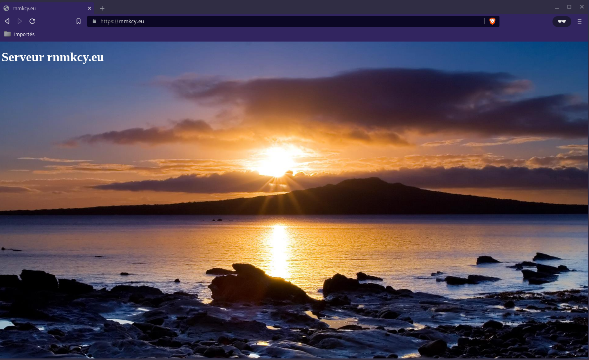{:width="500"}

### Site statique static.rnmkcy.eu

Le dossier `/srv/media/lxcdeb/_site` est mis à jour par le générateur jekyll sur le serveur debian lxcdeb hébergé par PC1/Archlinux

Configuration `/etc/nginx/conf.d/static.rnmkcy.eu.conf`

```nginx
server {
    listen 80;
    listen [::]:80;
    server_name static.rnmkcy.eu;
    return 301 https://$host$request_uri;
}
server {
    listen 443 ssl http2;
    listen [::]:443 ssl http2;
    server_name static.rnmkcy.eu;

    root /srv/media/lxcdeb/_site;
    index index/;

    # Certificats Let's Encrypt 
    # TLS 1.3 only
    # HSTS (ngx_http_headers_module is required) (63072000 seconds)
    # OCSP stapling
    # replace with the IP address of your resolver
    include /etc/nginx/tls-hsts-ocsp.conf;

    # fichiers de configuration
    include /etc/nginx/conf.d/rnmkcy.eu.d/*.conf;

    location ~ \.php$ {
        include php_fastcgi.conf;
        fastcgi_pass unix:/run/php/php8.0-fpm.sock;
    }
 
}
```

Vérifier et recharger nginx

    sudo nginx -t
    sudo systemctl reload nginx

Lien <https://static.rnmkcy.eu>   
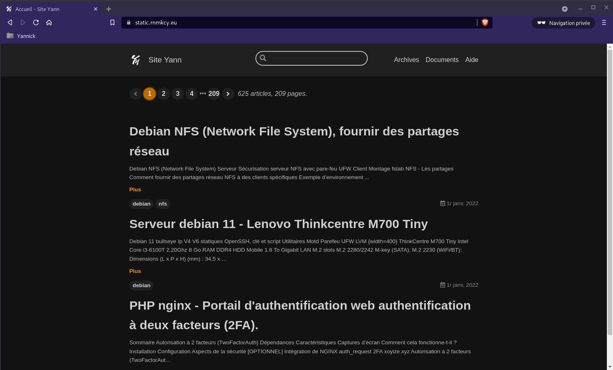{:width="500"}

### FreshRSS

{:height="50"}  
*FreshRSS est un agrégateur et lecteur de flux RSS. Il permet de regrouper l’actualité de plusieurs sites différents dans un endroit unique pour que vous puissiez la lire sans devoir aller de site en site.*

#### Prérequis

* Serveur web nginx
* Mysql/MariaDb serveur

#### Installer FreshRSS

Passage en mode su

Commencez par installer git, si vous ne l'avez pas déjà installé.

    apt install git

Ensuite, passez dans le répertoire d'installation et téléchargez FreshRSS à l'aide de git

    cd /usr/share/
    git clone https://github.com/FreshRSS/FreshRSS.git

Accédez au nouveau répertoire FreshRSS et définissez les autorisations afin que votre serveur Web puisse accéder aux fichiers.

    cd FreshRSS
    chown -R :www-data .
    sudo chmod -R g+r .

Nous devrons également autoriser l'écriture dans le dossier de données, comme suit :

    chmod -R g+w ./data/

Autoriser les mises à jour à partir de l'interface Web, définissez des droits d'écriture

    chmod -R g+w .

Enfin, établissez un lien symbolique entre le dossier public et la racine de votre répertoire Web

    ln -s /usr/share/FreshRSS/p /var/www/default-www/freshrss

#### Création d'une base de données pour FreshRSS

Lancez une session MySQL. L'exécution de cette commande vous demandera le mot de passe MySQL que vous avez défini précédemment, puis vous placera dans une invite qui devrait ressembler à `MariaDB [(none)]>` 

    mysql -u root -p

À partir de l'invite MySQL `(MariaDB [(none)]>)`, exécutez les commandes suivantes, en remplaçant `<nom d'utilisateur>, <mot de passe> et <nom de la base de données>` par des valeurs réelles.

```
CREATE USER 'freshuser'@'localhost' IDENTIFIED BY 'ModiqueBiffureLaquageSchlich';
CREATE DATABASE `freshrss`;
GRANT ALL privileges ON `freshrss`.* TO 'freshuser'@localhost;
FLUSH PRIVILEGES;
QUIT;
```

#### Configuration de Nginx

Configuration `/etc/nginx/conf.d/rss.rnmkcy.eu.conf`

```nginx
server {
    listen 80;
    listen [::]:80;
    server_name rss.rnmkcy.eu;
    return 301 https://$host$request_uri;
}
server {
    listen 443 ssl http2;
    listen [::]:443 ssl http2;
    server_name rss.rnmkcy.eu;

    # Certificats Let's Encrypt 
    # TLS 1.3 only
    # HSTS (ngx_http_headers_module is required) (63072000 seconds)
    # OCSP stapling
    # replace with the IP address of your resolver
    include /etc/nginx/tls-hsts-ocsp.conf;

	# the folder p of your FreshRSS installation
	root /var/www/default-www/freshrss/;

	index index.php index/ index.htm;

	# nginx log files
	access_log /var/log/nginx/rss.access.log;
	error_log /var/log/nginx/rss.error.log;

	# php files handling
	# this regex is mandatory because of the API
	location ~ ^.+?\.php(/.*)?$ {
		fastcgi_pass unix:/var/run/php/php8.0-fpm.sock;
		fastcgi_split_path_info ^(.+\.php)(/.*)$;
		# By default, the variable PATH_INFO is not set under PHP-FPM
		# But FreshRSS API greader.php need it. If you have a “Bad Request” error, double check this var!
		# NOTE: the separate $path_info variable is required. For more details, see:
		# https://trac.nginx.org/nginx/ticket/321
		set $path_info $fastcgi_path_info;
		fastcgi_param PATH_INFO $path_info;
		include fastcgi_params;
		fastcgi_param SCRIPT_FILENAME $document_root$fastcgi_script_name;
	}

	location / {
		try_files $uri $uri/ index.php;
	}

}
```

#### Configuration web

Le lien <https://rss.rnmkcy.eu> et suivre les étapes  
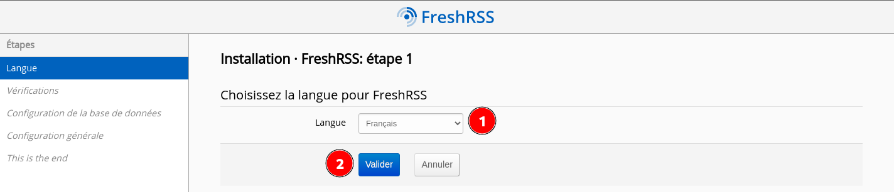   

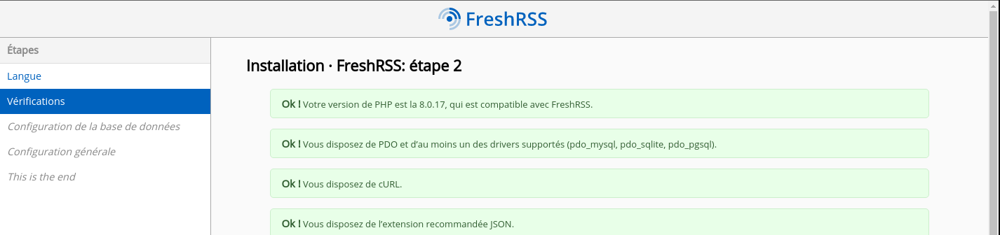   
   

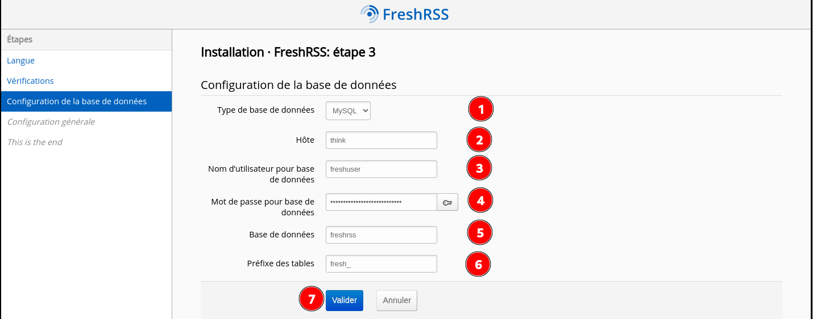   
En cas d'erreur, remplacer en 2, "think" par "localhost"

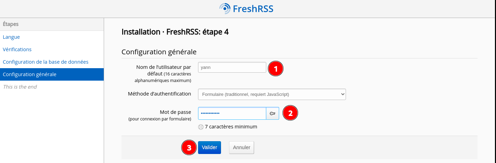   
Créer un utilisateur  

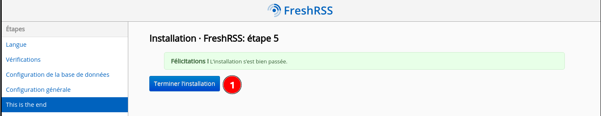   

Après installation , page de connexion  
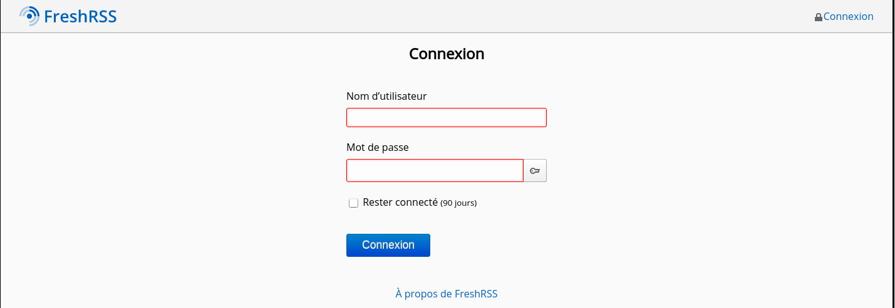   

#### Configuration de la mise à jour automatique des flux

FreshRSS est mis à jour par le script `./app/actualize_script.php`. Sachant cela, nous pouvons le déclencher périodiquement pour garantir des flux à jour.

>Remarque : le script de mise à jour ne mettra pas à jour un flux particulier plus d'une fois toutes les vingt minutes, il n'est donc pas utile de le déclencher beaucoup plus fréquemment que cela.

Systemd comme déclencheur

Certains systèmes ne peuvent pas utiliser une tâche Cron, mais ils peuvent utiliser systemd. Il est facile de le configurer pour imiter les fonctionnalités de Cron.

Tout d'abord, vous devez ajouter un fichier `/etc/systemd/system/freshrss.timer` avec le contenu suivant 

```
[Unit]
Description=FreshRSS get new content

[Timer]
OnBootSec=30s
OnCalendar=*:0/20

[Install]
WantedBy=timers.target
```

Cette minuterie démarre 30 secondes après le démarrage et déclenche le service toutes les 20 minutes. N'hésitez pas à modifier la configuration pour mieux répondre à vos besoins.

Ensuite, vous devez ajouter un fichier `freshrss.service` dans le même répertoire. Ce sera la description du service déclenché par le timer mentionné ci-dessus.

```
[Unit]
Description=FreshRSS get new content
Wants=freshrss.timer

[Service]
User=www-data
Type=simple
ExecStart=/usr/bin/php /usr/share/FreshRSS/app/actualize_script.php
```

Enfin, vous devez activer le timer avec `systemctl enable freshrss.timer` et recharger la configuration de systemd avec `systemctl daemon-reload`.

### Mediawiki

* [How to Install MediaWiki with NGINX in Ubuntu](https://fedingo.com/how-to-install-mediawiki-with-nginx-in-ubuntu/)
* [Installer MediaWiki avec Nginx, php7 et MariaDB sous debian 8](https://memo-linux.com/installer-mediawiki-avec-nginx-php7-et-mariadb-sous-debian-8/)


Serveur nginx et php 7.4  
Installez PHP et PHP-FPM, ainsi que leurs extensions.

    sudo apt install imagemagick php7.4-fpm php7.4-intl php7.4-xml php7.4-curl php7.4-gd php7.4-mbstring php7.4-mysql php-apcu

Augmenter la taille maximale de téléchargement en PHP pour permettre des téléchargements plus importants sur notre site MediaWiki.

    sudo nano /etc/php/7.4/fpm/php.ini

Augmenter les variables max_upload_size et memory_limit à 20M et 128M respectivement

```
upload_max_filesize = 20M
memory_limit = 128M
```

Redémarrez le service PHP-FPM 

    sudo systemctl restart php7.4-fpm
    systemctl status php7.4-fpm

```
● php7.4-fpm.service - The PHP 7.4 FastCGI Process Manager
     Loaded: loaded (/lib/systemd/system/php7.4-fpm.service; enabled; vendor preset: enabled)
     Active: active (running) since Fri 2022-07-08 12:17:36 CEST; 54min ago
       Docs: man:php-fpm7.4(8)
    Process: 13261 ExecStartPost=/usr/lib/php/php-fpm-socket-helper install /run/php/php-fpm.sock /etc/php/7.4/fpm/pool.d/www.conf 74 (code=exited, status=0/SUCCESS)
   Main PID: 13258 (php-fpm7.4)
     Status: "Processes active: 0, idle: 2, Requests: 0, slow: 0, Traffic: 0req/sec"
      Tasks: 3 (limit: 9370)
     Memory: 12.3M
        CPU: 267ms
     CGroup: /system.slice/php7.4-fpm.service
             ├─13258 php-fpm: master process (/etc/php/7.4/fpm/php-fpm.conf)
             ├─13259 php-fpm: pool www
             └─13260 php-fpm: pool www

juil. 08 12:17:36 think systemd[1]: Starting The PHP 7.4 FastCGI Process Manager...
juil. 08 12:17:36 think systemd[1]: Started The PHP 7.4 FastCGI Process Manager.
```

Activation

    sudo systemctl enable php7.4-fpm    # si non activé 

Installer [MariaDB](#mariadb)  
Ensuite, nous allons créer la base de données MediaWiki, ainsi qu'un utilisateur et un mot de passe pour la base de données. Nous allons créer la base de données **mediawikidb**, le nom d'utilisateur **mediawiki**, et le mot de passe **mypass**. Vous pouvez le modifier en fonction de vos besoins.

Connectez-vous en tant qu'utilisateur root.

    sudo -s    
    mysql -e "create database mediawikidb; grant all privileges on mediawikidb.* to mediawiki@'localhost' identified by 'PenneBusardJoujouBoche'; flush privileges;"

Télécharger la dernière version en date de l’archive du MediaWiki <https://releases.wikimedia.org/mediawiki/>

    wget https://releases.wikimedia.org/mediawiki/1.38/mediawiki-1.38.2.tar.gz  # au 7 juillet 2022

Décompresser et déplacer le dossier

    tar xzvf mediawiki-1.38.2.tar.gz
    sudo mv mediawiki-1.38.2 /var/www/mediawiki

Enfin, nous allons changer la propriété des fichiers et dossiers installés afin que MediaWiki puisse facilement les mettre à jour. Nous utilisons l'utilisateur www-data qui est l'utilisateur standard utilisé par les serveurs web pour travailler avec les fichiers et les répertoires.

    sudo chown -R www-data:www-data /var/www/mediawiki

La dernière version de MediaWiki sera désormais présente dans /var/www/mediawiki.

Configurer nginx

    sudo nano /etc/nginx/conf.d/wiki.rnmkcy.eu.conf

```
server {
    listen 80;
    listen [::]:80;
    server_name wiki.rnmkcy.eu;
    return 301 https://$host$request_uri;
}
server {
    listen 443 ssl http2;
    listen [::]:443 ssl http2;
    server_name wiki.rnmkcy.eu;

    # Certificats Let's Encrypt 
    # TLS 1.3 only
    # HSTS (ngx_http_headers_module is required) (63072000 seconds)
    # OCSP stapling
    # replace with the IP address of your resolver
    include /etc/nginx/tls-hsts-ocsp.conf;

    root /var/www/mediawiki;
    index  index.php;

    client_max_body_size 5m;
    client_body_timeout 60;

    location / {
        try_files $uri $uri/ @rewrite;
    }

    location @rewrite {
        rewrite ^/(.*)$ /index.php?title=$1&$args;
    }

    location ^~ /maintenance/ {
        return 403;
    }

     location /rest.php {
        try_files $uri $uri/ /rest.php?$args;
    }

    location ~ \.php$ {
        include fastcgi_params;
        fastcgi_pass unix:/var/run/php/php7.4-fpm.sock;
        fastcgi_param SCRIPT_FILENAME $request_filename;


    }

    location ~* \.(js|css|png|jpg|jpeg|gif|ico)$ {
        try_files $uri /index.php;
        expires max;
        log_not_found off;
    }

    location = /_.gif {
        expires max;
        empty_gif;
    }

    location ^~ /cache/ {
        deny all;
    }

    location /dumps {
        root /var/www/mediawiki/local;
        autoindex on;
    }
}
```

Vérification et rechargement nginx

    sudo nginx -t
    sudo systemctl reload nginx

Installation mediawiki : <https://wiki.rnmkcy.eu>  
  
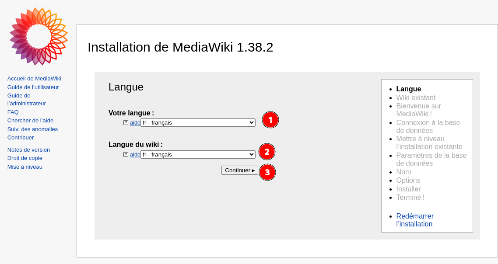  
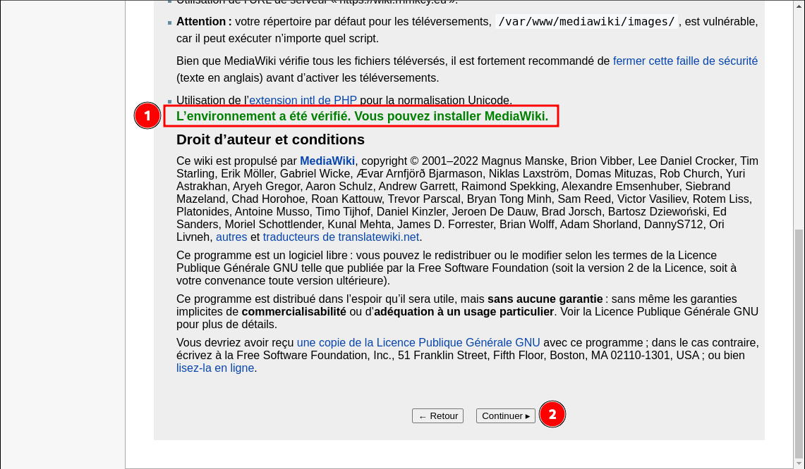  
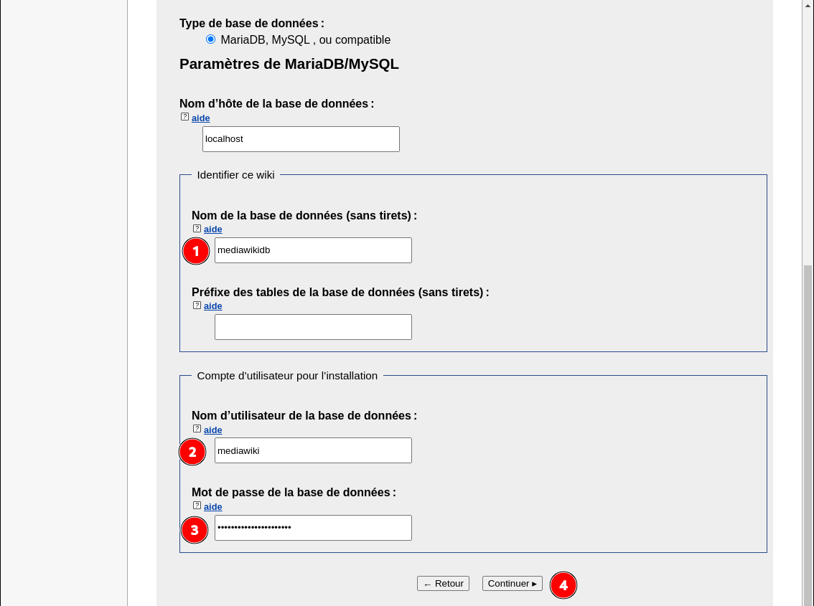  

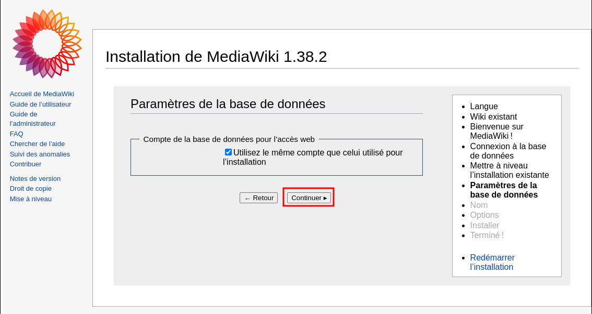  
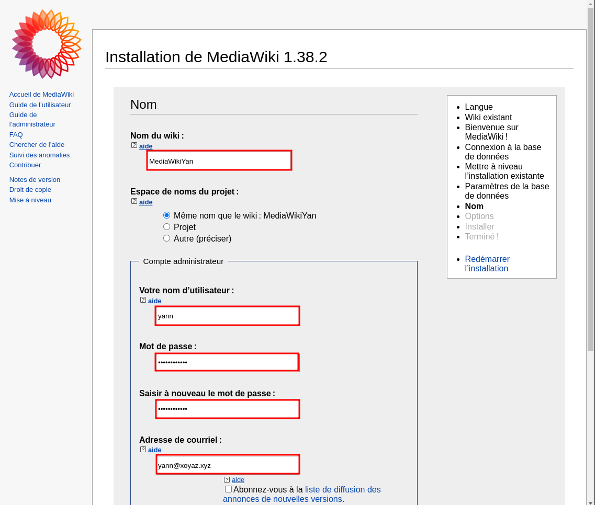  
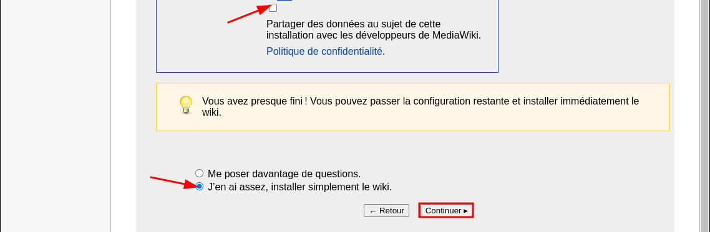  
  

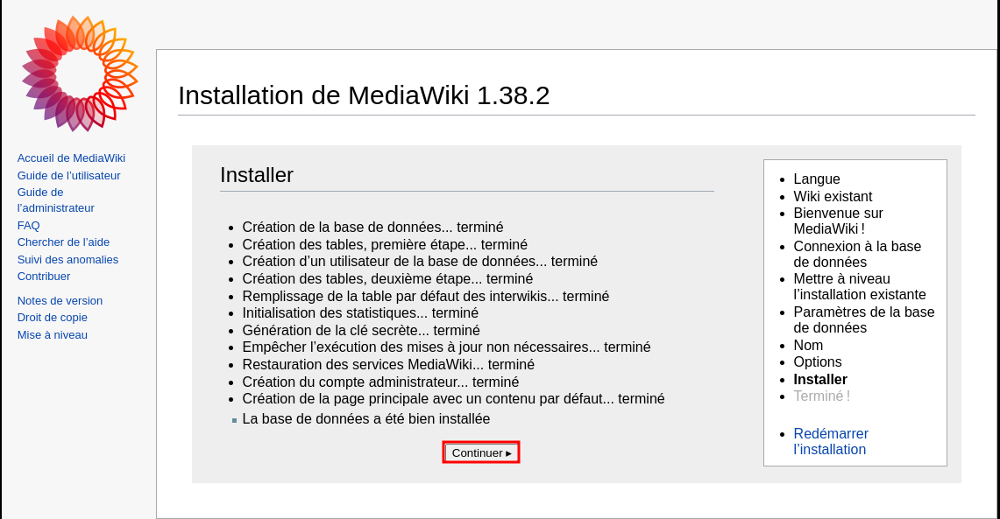  
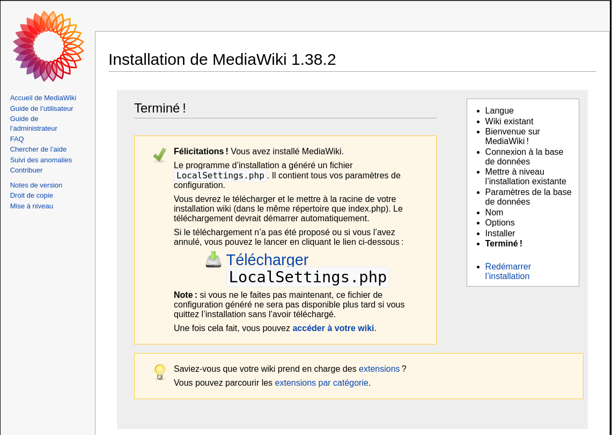  
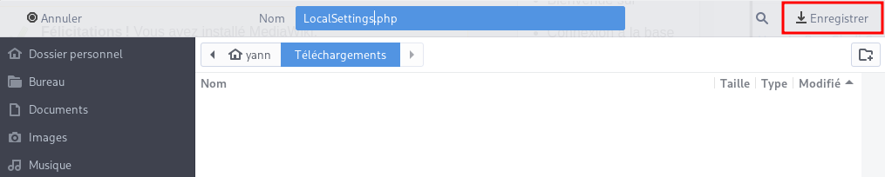  

Ouvrir un nouveau fichier `/var/www/mediawiki/LocalSettings.php` et y copier le contenu télécharger de **LocalSettings.php**    
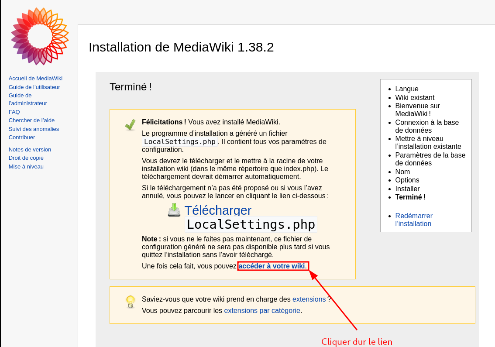  
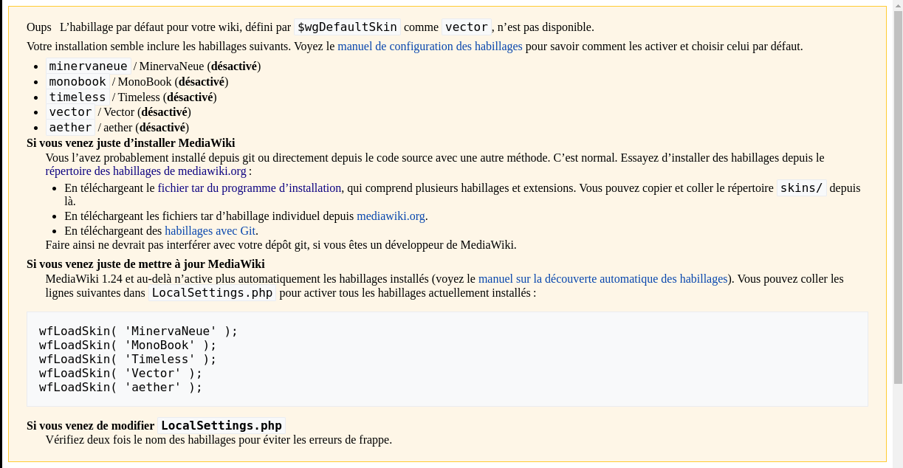  

Configurer les skins  
Ouvrir LocalSettings.php 

    nano /var/www/mediawiki/LocalSettings.php

Ajouter les lignes suivantes

```
wfLoadSkin( 'MinervaNeue' );
wfLoadSkin( 'MonoBook' );
wfLoadSkin( 'Timeless' );
wfLoadSkin( 'Vector' );
wfLoadSkin( 'aether' );
```

Sauvegardez et fermez le fichier. Maintenant, lorsque vous ouvrez le navigateur et allez à l'URL hébergeant le site MediaWiki, vous verrez la page principale avec le style par défaut trouvé sur le site Wikipedia.  
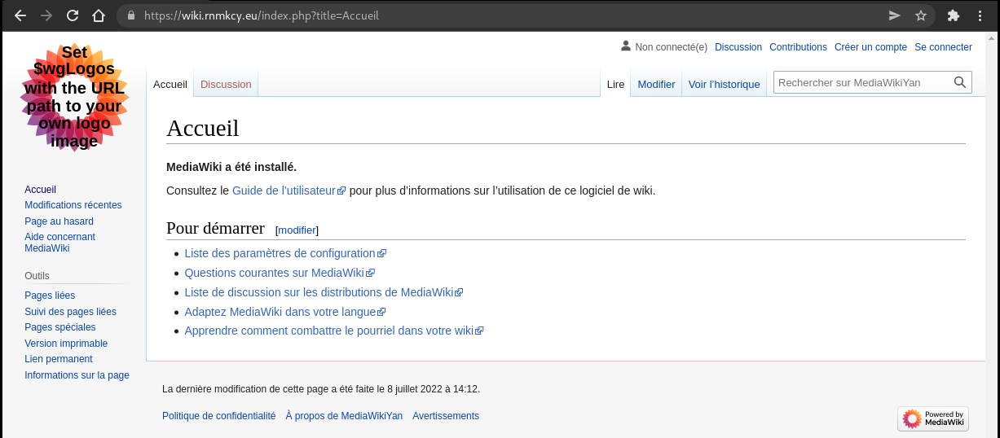  
<https://wiki.rnmkcy.eu>  

Téléchargez le fichier de votre logo sur votre serveur (/var/www/mediawiki/resources/assets/
/ym135x135.png). Vous pouvez ensuite l'utiliser comme logo de votre site en modifiant les lignes à **LocalSettings.php** :

```php
$wgLogos = [
        '1x' => "$wgResourceBasePath/resources/assets/ym135x135.png",
        

        'icon' => "$wgResourceBasePath/resources/assets/ym135x135.png",
];
```

Après modification  
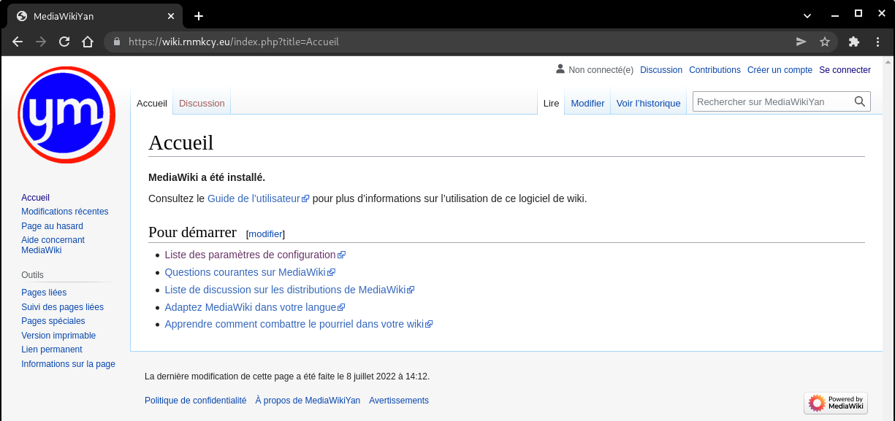  
<https://wiki.rnmkcy.eu>  

### gpx.rnmkcy.eu

*Editer modifier des traces gpx*

Création dossier web et clonage gpxstudio

    sudo mkdir -p /srv/media/lxcyan
    sudo chown $USER:users -R /srv/media/lxcyan
    git clone https://github.com/gpxstudio/gpxstudio.github.io.git /srv/media/lxcyan/

Configuration `/etc/nginx/conf.d/gpx.rnmkcy.eu.conf`

```nginx
server {
    listen 80;
    listen [::]:80;
    server_name gpx.rnmkcy.eu;
    return 301 https://$host$request_uri;
}
server {
    listen 443 ssl http2;
    listen [::]:443 ssl http2;
    server_name gpx.rnmkcy.eu;

    root /srv/media/lxcyan;
    index index/;

    # Certificats Let's Encrypt 
    # TLS 1.3 only
    # HSTS (ngx_http_headers_module is required) (63072000 seconds)
    # OCSP stapling
    # replace with the IP address of your resolver
    include /etc/nginx/tls-hsts-ocsp.conf;
 
}
```

Vérifier et recharger nginx

    sudo nginx -t
    sudo systemctl reload nginx

Lien <https://gpx.rnmkcy.eu>   

## Sécurisation serveur avec fail2ban

* [Comment sécuriser un serveur nginx avec Fail2Ban](/posts/Comment_securiser_un_serveur_nginx_avec_Fail2Ban/)

## Accès partage Freebox

* [Partage disque externe USB sur Freebox](https://static.lxcdeb.local/2022/08/03/Partage_disque_externe_USB_sur_Freebox/)

Installation paquet cifs-utils

    sudo apt install cifs-utils

Créer un point de montage

    sudo mkdir /mnt/freebox

Les autorisations

    nano /home/leno/.smbcredentials

```
username=yannfreebox
password=xxxxxxxxxxxxxxxxxxx
```

Montage manuel

    sudo mount -t cifs -o credentials=/home/leno/.smbcredentials,iocharset=utf8,uid=1000,gid=100,sec=ntlmv2,file_mode=0770,dir_mode=0775,vers=2.0 //192.168.0.254/Disque\ 1/ /mnt/freebox

Montage permanent du partage freebox

    sudo nano /etc/fstab

```
#mount freebox
#//192.168.0.254/Disque\0401/ /mnt/freebox cifs credentials=/home/leno/.smbcredentials,iocharset=utf8,uid=1000,gid=100,sec=ntlmv2,file_mode=0770,dir_mode=0775,vers=2.0
//192.168.0.254/hdd500g/ /mnt/freebox cifs credentials=/home/leno/.smbcredentials,iocharset=utf8,uid=1000,gid=100,sec=ntlmv2,file_mode=0770,dir_mode=0775,vers=2.0
```

## Virtualisation KVM

### Installer KVM sur un serveur

[Comment installer KVM sur un serveur Debian](/posts/Installer_QEMU-KVM_sur_un_serveur_Debian/)

### Pont réseau (br0)

Configuration réseau `/etc/network/interfaces`

```
# /etc/network/interfaces
# Fichier de configuration des interfaces réseau
# pour faire un bridge
# Formation Debian GNU/Linux par Alexis de Lattre
# http://formation-debian.via.ecp.fr/

# Plus d'informations dans "man interfaces", "man bridge-utils-interfaces" et
# dans "/usr/share/doc/bridge-utils/README.Debian.gz"

# D'abord l'interface "loopback"
auto lo
iface lo inet loopback

# Ensuite l'interface bridge "br0" qui se configure par DHCP
auto br0
iface br0 inet static
 address 192.168.0.145
 netmask 255.255.255.0
 gateway 192.168.0.254
    # Liste des interfaces qui participent au bridge
    # ATTENTION :
    # Il faut mettre l'interface dont la MAC est la plus petite d'abord !
    # Sinon, cela peut perturber les outils de surveillance du réseau.
    # bridge_ports eno1 eth0 eth1 eth2
    bridge_ports eno1 
    # Je désactive le Spanning tree
    bridge_stp off
    # Temps en secondes entre "learning state" et "forwarding state"
    bridge_fd 2
    # Temps maximum en secondes où le script de lancement du bridge
    # attendra lors du démarrage que le bridge passe en mode "forwarding
    # state" pour passer la main et laisser les autres services démarrer.
    bridge_maxwait 0

iface br0 inet6 static
    address 2a01:e0a:2de:2c71::1
    netmask 64
    gateway fe80::8e97:eaff:fe39:66d6
```

Visualisation

    sudo virsh net-list --all

```
 Nom       État      Démarrage automatique   Persistent
---------------------------------------------------------
 br0       actif     Oui                     Oui
 default   inactif   no                      Oui
```

### Créer un point de montage pour le virtuel

On part d'un disque hdd 2to sur /dev/sdb partitionner LVM sur lequel on va créer un volume logique de 300G nommé "lv-virtuel"

```
# Volume physique
pvcreate /dev/sdb1
# Groupe de volumes
vgcreate hdd-2to /dev/sdb1
# Volume logique
lvcreate -n lv-virtuel -L 300G hdd-2to
# Système de fichiers
mkfs.ext4 /dev/hdd-2to/lv-virtuel 
```

Créer un point de montage

    sudo mkdir /mnt/virtuel

Relever UUID du volume logique `/dev/mapper/hdd--2to-lv--virtuel` en exécutant `blkid` :  

    /dev/mapper/hdd--2to-lv--virtuel: UUID="ba6274f3-390f-4fe3-b1b7-845387da049a" BLOCK_SIZE="4096" TYPE="ext4"

Modifier le fichier `/etc/fstab` en y ajoutant les 2 lignes suivantes   

```
# /dev/mapper/hdd--2to-lv--virtuel
UUID=ba6274f3-390f-4fe3-b1b7-845387da049a /mnt/virtuel     ext4    defaults        0       2
```

Montage manuel : `sudo mount -a`  
Droits en lecture/écriture pour utilisateur  : `sudo chown $USER:users -R /mnt/virtuel/` 

### Modifier dossier par défaut libvirt

[Modifier emplacement pool stockage par défaut](/posts/Installer_QEMU-KVM_sur_un_serveur_Debian/#modifier-emplacement-pool-stockage-par-d%C3%A9faut)  
Création dossier pour les images virtuelles `/mnt/virtuel/libvirt/images`  
Modifier le dossier par défaut des images virtuelles: `/mnt/virtuel/libvirt/images`  

### Connexion avec un poste graphique via SSH

Se connecter sur les machines virtuelles depuis un poste client en mode graphique avec virt manager &rarr; [virt-manager qemu+ssh](/posts/Installer_QEMU-KVM_sur_un_serveur_Debian/#virt-manager-qemussh)

### VM Linux Alpine

Installer une machine virtuelle Alpine Linux ([Install Alpine in QEMU](https://wiki.alpinelinux.org/wiki/Install_Alpine_in_QEMU))

Télécharger une image ISO  de type **Virtual** (Similaire au standard. Noyau allégé. Optimisé pour les systèmes virtuels.)  

    wget -O /mnt/virtuel/alpine-virt-3.16.2-x86_64.iso https://dl-cdn.alpinelinux.org/alpine/v3.16/releases/x86_64/alpine-virt-3.16.2-x86_64.iso

Passer en mode utilisateur (prompt $)  

    cd /mnt/virtuel/libvirt/images/

Créez une image disque Alpine Linux.

    qemu-img create -f qcow2 alpine.qcow2 8G

La commande suivante démarre QEMU avec l'image ISO Alpine comme CD-ROM, la configuration réseau par défaut, 512 Mo de RAM, l'image disque créée à l'étape précédente et le CD-ROM comme périphérique de démarrage.

    qemu-system-x86_64 -m 512 -net nic,model=virtio,macaddr=00:00:00:00:00:01 -net bridge,ifname=br0 -boot d -cdrom alpine-virt-3.16.2-x86_64.iso -hda alpine.qcow2

En mode su

```
virt-install \
  --name alpine \
  --os-variant=alpinelinux3.13 \
  --ram=512 \
  --disk /mnt/virtuel/libvirt/images/alpine.qcow2,device=disk,bus=virtio,size=20,format=qcow2 \
  --vcpus 1 \
  --network bridge=br0 \
  --cdrom=/mnt/virtuel/alpine-standard-3.16.2-x86_64.iso \
  --console pty,target_type=serial \ 
  --graphics vnc  
```

Connectez-vous en tant que root(sans mot de passe) et exécutez :

    setup-alpine

Suivez les étapes d'installation de setup-alpine .

Exécuter poweroff pour arrêter la machine.
