+++
title = 'Paramétrage , mise à jour et erreurs Nextcloud'
date = 2022-10-10 00:00:00 +0100
categories = ['nextcloud']
+++
  

## Sommaire

- [Paramétrer Nextcloud](#paramétrer-nextcloud)
    - [Créer compte administrateur](#créer-compte-administrateur)
    - [Cache PHP (OPcache)](#cache-php-opcache)
    - [PHP Cache de données (APCu & Redis)](#php-cache-de-données-apcu-redis)
    - [Tâches de fond Nextcloud](#tâches-de-fond-nextcloud)
    - [Ajouter un utilisateur](#ajouter-un-utilisateur)
    - [Thème, Apparence et Stockage](#thème-apparence-et-stockage)
    - [Authentification](#authentification)
        - [Authentification 2FA](#authentification-2fa)
        - [Deux facteurs par email (NON UTILISEE)](#deux-facteurs-par-email-non-utilisee)
        - [OIDC Identity Provider](#oidc-identity-provider)

## Paramétrer Nextcloud

### Créer compte administrateur

Créer un compte administrateur et son mot de passe
admin 
Saisir les informations sur la base , utilisateur et mot de passe   
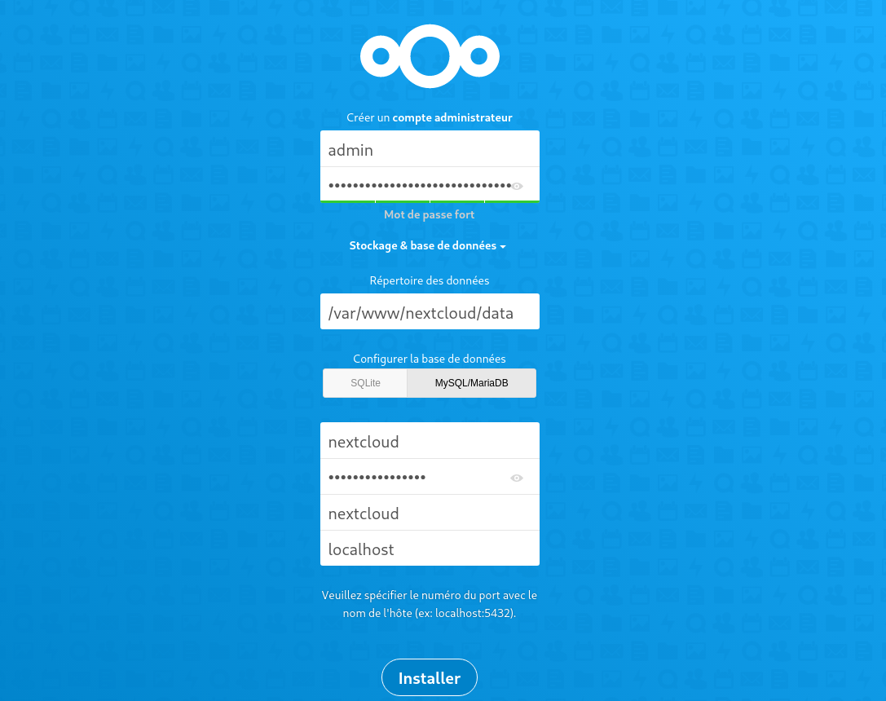{:width="500"}  
Ne pas installer les applications recommandées  
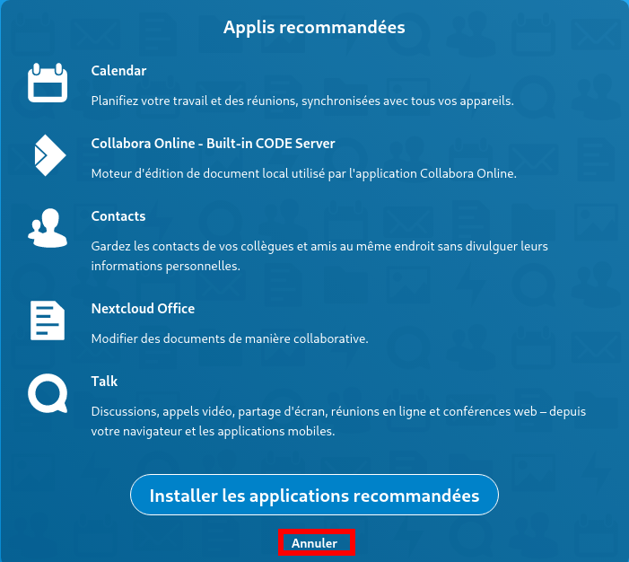{:width="400"}  
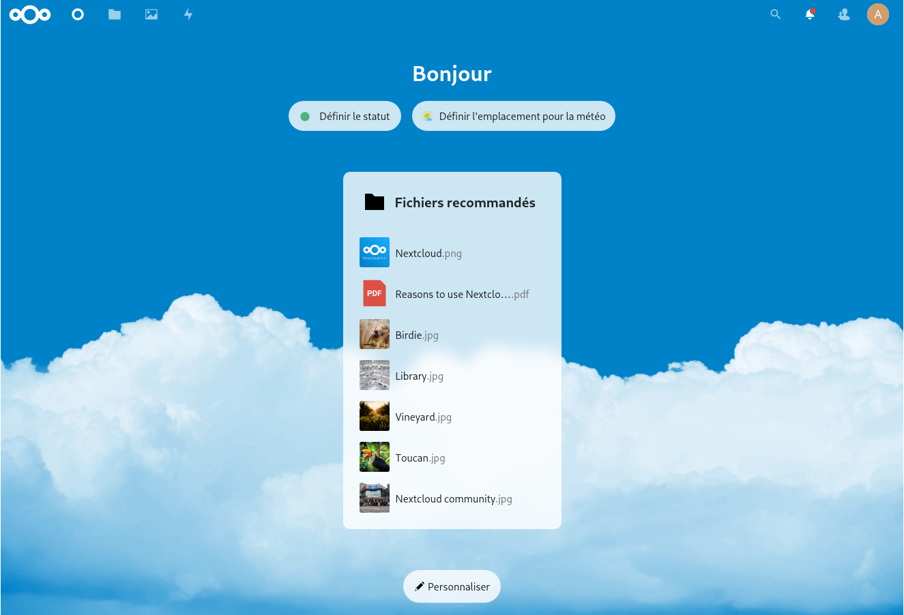  


Cliquer sur le A en haut à droite puis "Paramètres"  et "Vue d'ensemble"
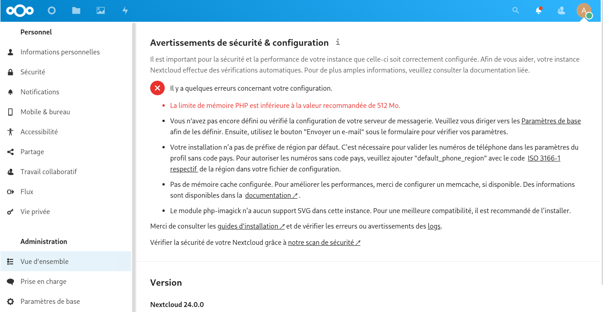  

**Votre installation n’a pas de préfixe de région par défaut.**  
ajouter `'default_phone_region' => 'FR',` dans le  le fichier `/var/www/nextcloud/config/config.php`   

**mémoire pour PHP**  
ajouter `memory_limit = 512M`  dans le fichier `/etc/php/8.1/fpm/php.ini`  

**Le module php-imagick n’a aucun support SVG dans cette instance.**  
installer la librairie `sudo apt install libmagickcore-6.q16-6-extra`

### Cache PHP (OPcache)

OPcache (qui signifie Optimizer Plus Cache) est introduit depuis la version 5.5.0 de PHP. Il sert à cacher l’opcode de PHP, c’est-à-dire les instructions de bas niveau générées par la machine virtuelle PHP lors de l’exécution d’un script. Autrement dit, le code pré-compilé est stocké en mémoire. Cela évite ainsi l’étape de compilation à chaque requête PHP. De plus, OPcache va optimiser l’exécution du code afin d’en améliorer les performances.

Éditez le fichier /etc/php/8.1/fpm/php.ini,ajouter les lignes suivantes dans la section [opcache] :

sudo nano /etc/php/8.1/fpm/php.ini

Config avant modification

```
[opcache]
opcache.enable=1
opcache.enable_cli=1
opcache.interned_strings_buffer=8
opcache.max_accelerated_files=10000
opcache.memory_consumption=128
opcache.save_comments=1
opcache.revalidate_freq=1
```

Modifier le 23 mai 2022

```
[opcache]
opcache.enable=1
opcache.enable_cli=1
opcache.interned_strings_buffer=32
opcache.save_comments=1
opcache.max_wasted_percentage = 15
opcache.validate_timestamps = 1
opcache.revalidate_freq=1
```

La nouvelle configuration sera prise en compte après redémarrage du service PHP-FPM :

    sudo systemctl restart php8.1-fpm.service

### PHP Cache de données (APCu & Redis) 

*APCu permet notamment de mettre en cache les variables PHP et de les stocker en mémoire vive. Redis est un système de gestion de base de données NoSQL avec un système de clef-valeur scalable (s’adapte à la charge). Une des principales caractéristiques de Redis est de conserver l’intégralité des données en RAM. Cela permet d’obtenir d’excellentes performances en évitant les accès disques, particulièrement coûteux.*

Installez les paquets APCu et Redis :

    sudo apt install php8.1-apcu redis-server php8.1-redis 

Il faut ajouter `apc.enable_cli=1` au fichier `/etc/php/8.1/mods-available/apcu.ini`

```
extension=apcu.so
apc.enable_cli=1
```

Ajoutez les lignes suivantes dans le fichier /var/www/nextcloud/config/config.php :

    sudo nano /var/www/nextcloud/config/config.php

```
  'filelocking.enabled' => true,
  'memcache.locking' => '\OC\Memcache\Redis',
  'memcache.local' => '\\OC\\Memcache\\APCu',
  'redis' => array(
    'host' => 'localhost',
    'port' => 6379,
    'timeout' => 0.0,
    'password' => '',
  ),
```

*    La directive filelocking.enabled sert à activer le verrouillage de fichier transactionnel, et nous précisons ensuite que c’est Redis qui assure cette fonction au travers de la directive memcache.locking.
*    La directive memcache.local sert à préciser que Redis gère le cache
*    Le bloc de configuration “redis” avec les directives host, port, timeout et password sert à indiquer la configuration de notre redis. Pour passer en mode socket, il faudrait indiquer le chemin vers le socket à la place de localhost. Pour le moment, laissez la valeur mot de passe vide.

La nouvelle configuration sera prise en compte après redémarrage du service PHP-FPM :

    sudo systemctl restart php8.1-fpm.service

**Configurer l'envoi de message par nextcloud**  
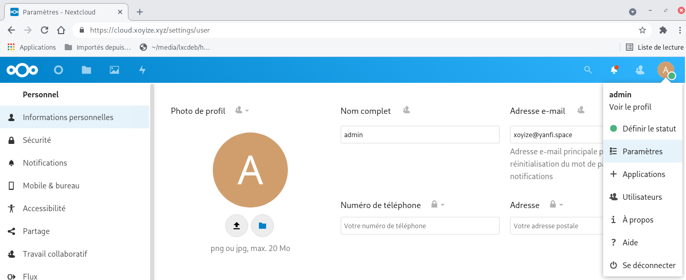  

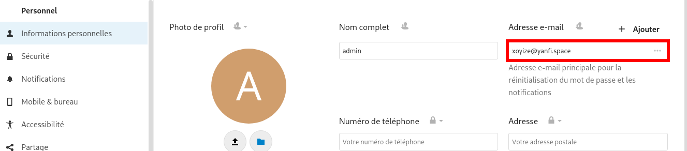  

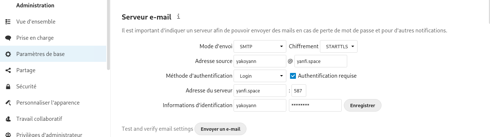  


### Tâches de fond Nextcloud

Vous pouvez programmer des tâches cron de trois façons : en utilisant **AJAX**, **Webcron** ou **cron**. La méthode par défaut consiste à utiliser AJAX. <u>Cependant, la méthode recommandée est d'utiliser **cron**</u>. 

Si systemd est installé sur le système, un timer systemd peut être une alternative à un cronjob.

Cette approche nécessite deux fichiers : `nextcloudcron.service` et `nextcloudcron.timer`  
Créez ces deux fichiers dans `/etc/systemd/system/` 

`/etc/systemd/system/nextcloudcron.service` doit ressembler à ceci :

```
[Unit]
Description=Nextcloud cron.php job

[Service]
User=nextcloud
ExecStart=/usr/bin/php -f /var/www/nextcloud/cron.php
KillMode=process
```

Remplacez l'utilisateur `User` par l'utilisateur de votre serveur http (**www-data** si ce n'est pas **nextcloud**) et `/var/www/nextcloud/cron.php` par l'emplacement de cron.php dans votre répertoire nextcloud.

Le paramètre `KillMode=process` est nécessaire pour que les programmes externes qui sont lancés par la tâche cron continuent à fonctionner après la fin de la tâche cron.

Notez que le fichier **.service** unit n'a pas besoin d'une section `[Install]`. Veuillez vérifier votre installation car nous l'avons recommandé dans les versions précédentes de ce manuel d'administration.

Le fichier `/etc/systemd/system/nextcloudcron.timer` devrait ressembler à ceci :

```
[Unit]
Description=Run Nextcloud cron.php every 5 minutes

[Timer]
OnBootSec=5min
OnUnitActiveSec=5min
Unit=nextcloudcron.service

[Install]
WantedBy=timers.target
```

Les parties importantes de l'unité de minuterie sont **OnBootSec** et **OnUnitActiveSec**. **OnBootSec** démarre la minuterie 5 minutes après le démarrage, sinon vous devriez la démarrer manuellement après chaque démarrage. **OnUnitActiveSec** déclenchera une minuterie de 5 minutes après la dernière activation de l'unité de service.

Maintenant, tout ce qui reste à faire est de démarrer et d'activer le minuteur en exécutant cette commande :

    systemctl enable --now nextcloudcron.timer

Lorsque l'option `--now` est utilisée avec enable, l'unité respective sera également démarrée.

Note : Il n'est pas obligatoire de sélectionner l'option Cron dans le menu d'administration pour les travaux en arrière-plan, car une fois que cron.php est exécuté à partir de la ligne de commande ou du service cron, il sera automatiquement réglé sur Cron.  
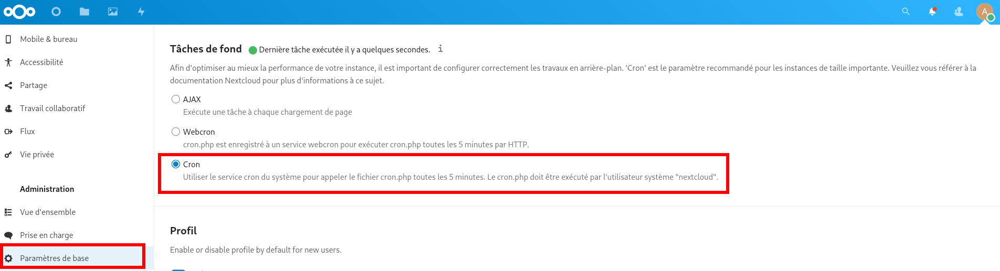
{: .prompt-info }

Vérifier

    systemctl list-timers

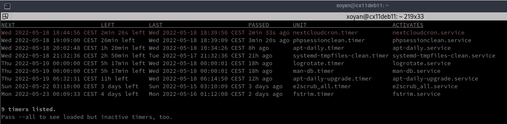

### Ajouter un utilisateur

Se connecter en administrateur   
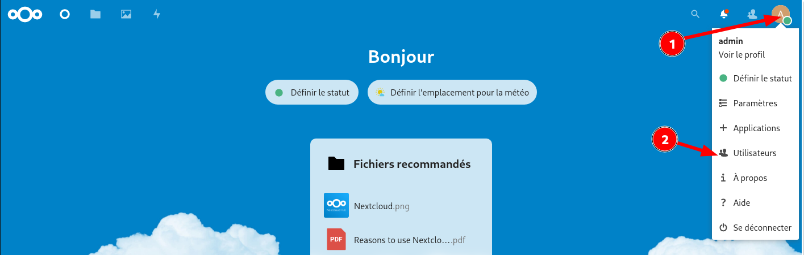  
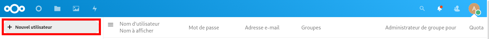  

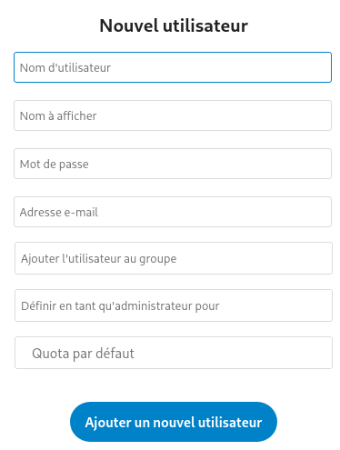{:width="300"}  
Renseigner les champs et cliquer sur "Ajouter un nouvel utilisateur"  

Se reconnecter avec l'utilisateur  
Il faut configurer via "Settings"  
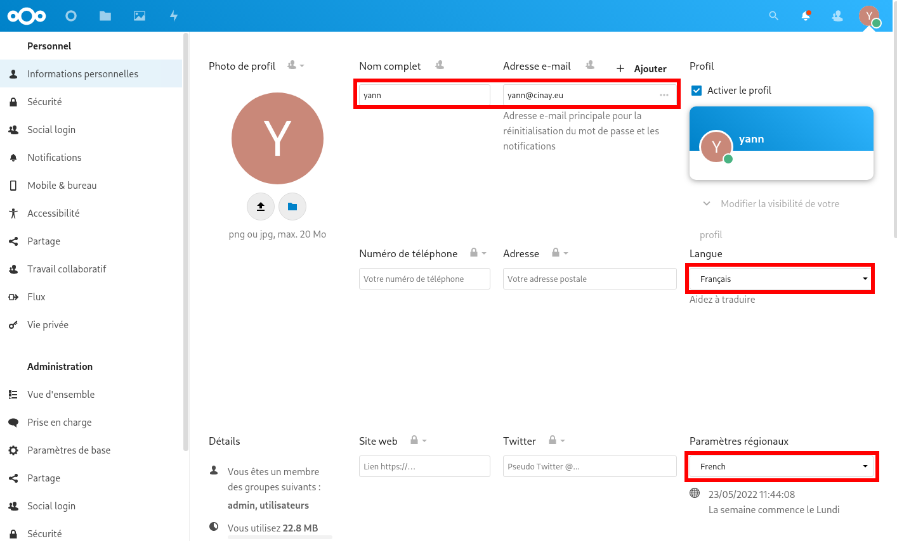  

### Thème, Apparence et Stockage

Un thème sombre basé sur **Breeze Dark**    
Aller dans "Applications &rarr; Personnalisation"  
  
Aller ensuite dans "Paramètres (Administration) &rarr; Personnaliser l'apparence"  

Logo : ym.png  
Image de connexion : coucher-de-soleil-sur-le-lac_1920x1080-optim.jpg  
Logo d'entête : ym01.png  
Favicon : yannick-white.svg  
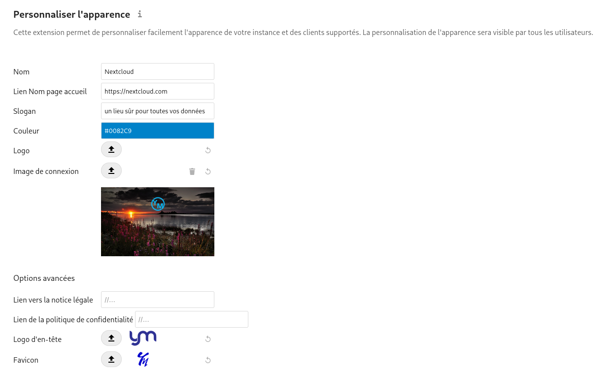  

**Thème**  
Activer Breeze-dark au préalable dans Paramètres -> Applications  
  
Rafraîchir l'écran  

Personnel &rarr; Informations personnelles  
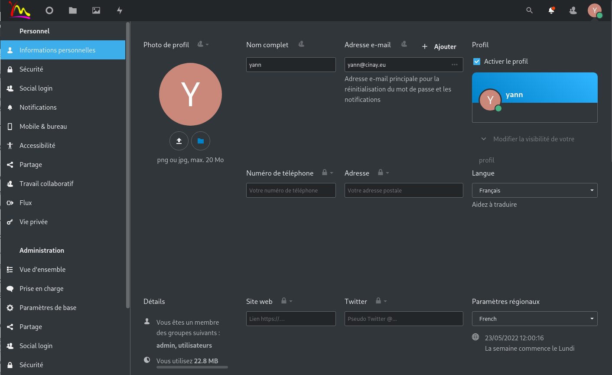  

**Stockage externe** (paramétrage en admin)  
Applications , activer external storage support  
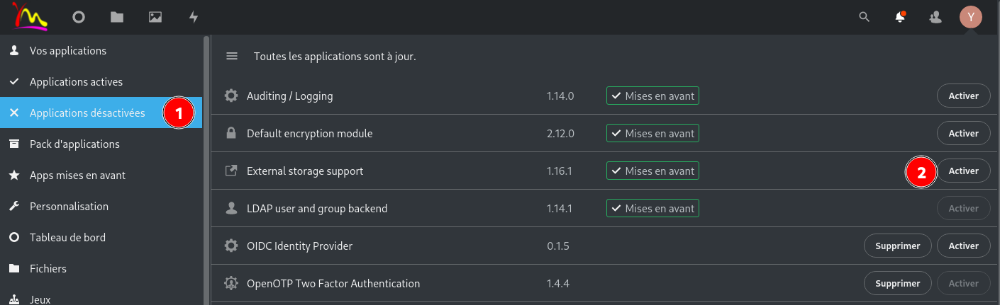  

Paramètres &rarr; Administration Stockage externe  
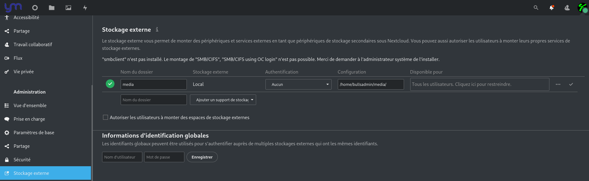  

### Authentification

#### Authentification 2FA

[Authentification à deux facteurs](/posts/Nextcloud22_Nginx_PHP8-FPM_MariaDB_SSL-TLS/#authentification-%C3%A0-deux-facteurs)  
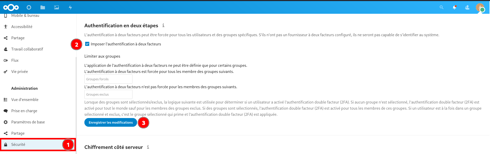  
Aller ensuite dans "Paramètres &rarr; Applications Sécurité"  
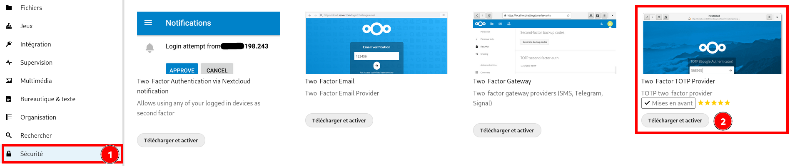  
Aller ensuite dans "Paramètres &rarr; Personnel Sécurité" et **Activer les mots de passe à usage unique (TOTP)** 
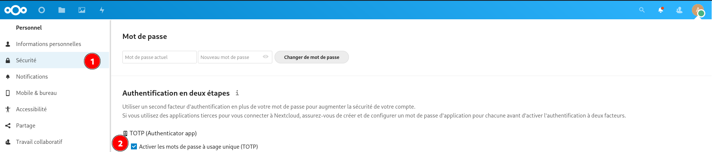  
Ensuite saisr la "clé secrète" dans le générateur de code TOTP (andOTP, keepass, etc...) et valider l'activation 2FA  
Pour terminer , **Générer des codes de récupération** .Veuillez les sauvegarder et/ou les imprimer car vous ne pourrez plus y avoir accès ultérieurement  


#### Deux facteurs par email (NON UTILISEE)

Il s'agit d'une application à installer sur un serveur Nextcloud. Cette application permet aux utilisateurs de configurer l'email comme second facteur pour les connexions web. <u>Elle nécessite qu'une adresse e-mail soit définie dans les paramètres personnels</u>. 

Elle ne peut actuellement pas être utilisée lors de la première connexion lorsque l'authentification à deux facteurs est appliquée (pas encore implémentée).

"Paramètres" --> "Applications" --> "Sécurité"  
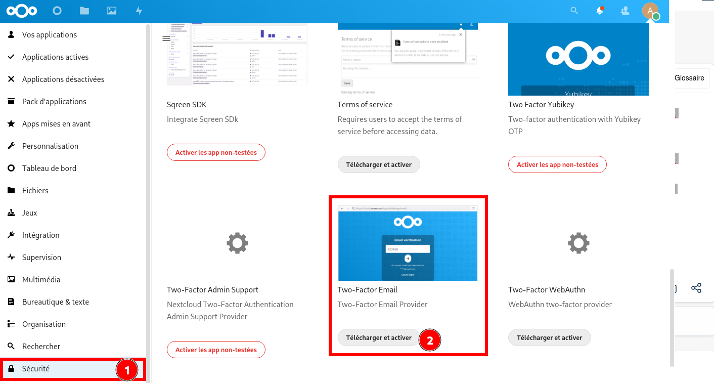  

**Activation**  
"Paramètres" --> --> "Sécurité" (rubrique Administration)  
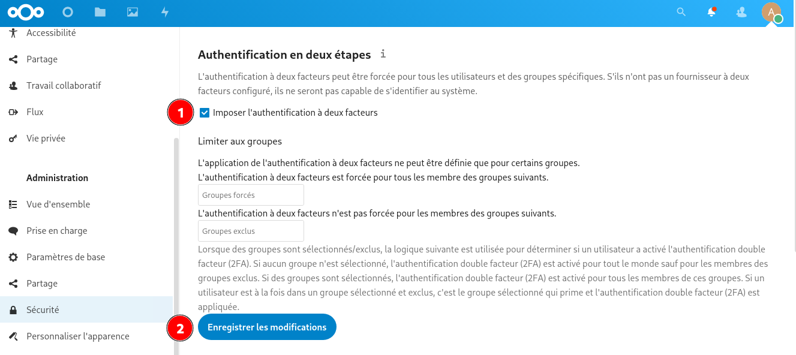  

"Paramètres" --> --> "Sécurité" (rubrique Personnel)  
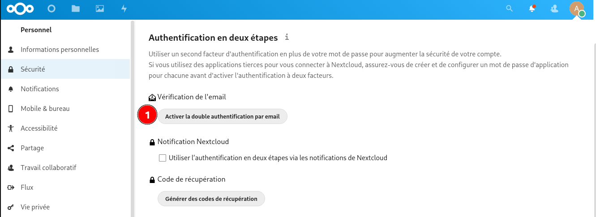  

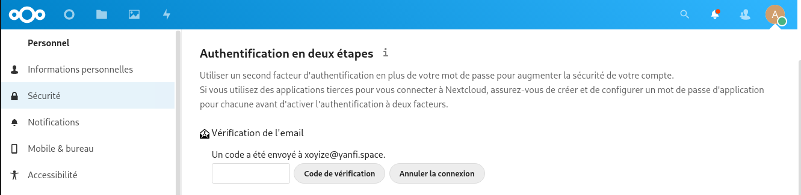  
Saisir le code et cliquer sur "Code vérification"

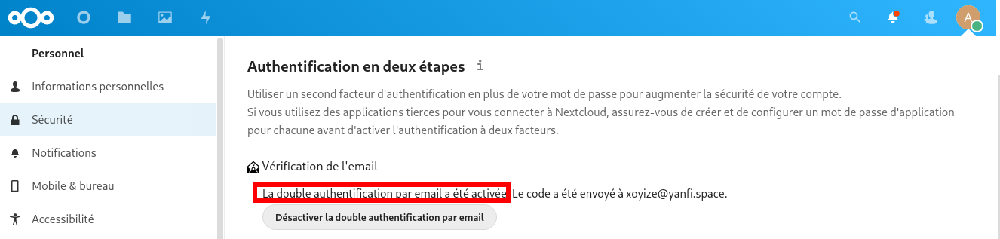  

NE PAS OUBLIER de générer des codes de récupération (messagerie HS)


#### OIDC Identity Provider

Nextcloud comme fournisseur d'identité OpenID Connect

Avec cette application, vous pouvez utiliser Nextcloud comme fournisseur d'identité OpenID Connect. Si d'autres services sont configurés correctement, vous êtes en mesure d'accéder à ces services avec votre login Nextcloud.

"Paramètres" --> "Applications" --> "Sécurité"  , installer et activer l' application **OIDC Identity Provider** 

Ensuite "Paramètres" --> "Sécurité"  
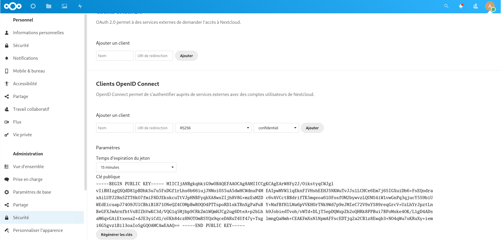  

## Mise à jour

Ouvrir nextcloud avec un compte administrateur, Paramètres &rarr; Vue d'ensemble  
Si une mise à jour est affichée, cliquer sur le bouton de **Mise à jour**  
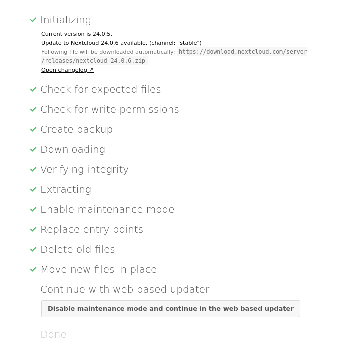{:width="400"}   
Cliquer ensuite sur **Disable...**  
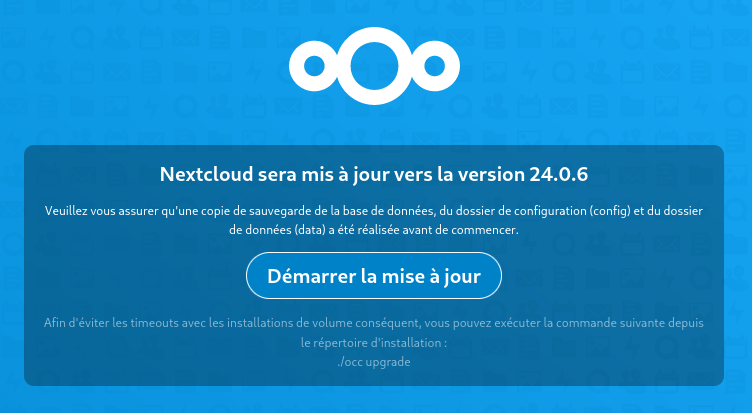{:width="400"}   
puis sur **"Démarrer la mise à jour"** et le processus se lance  

## Erreurs

<u>**Le problème**</u>   
Lors de la mise à niveau/mise à jour de Nextcloud, nous pouvons rencontrer l'erreur suivante  
**"Step 4 is currently in process. Please reload this page later."**

<u>**La correction**</u>  
Si nous avons attendu assez longtemps (Si le serveur a une connexion très lente ou la connexion entre le serveur et le serveur de mise à jour Nextcloud est très lente etc. nous pouvons avoir à attendre un peu plus longtemps), l'erreur est toujours là, nous pouvons avoir à supprimer l'erreur manuellement afin d'essayer le processus de mise à niveau / mise à jour à nouveau.

1. Naviguez vers le dossier de données Nextcloud (Note : La configuration Nextcloud de chacun peut être différente, ici nous utilisons /var/www/nextcloud/data comme exemple)
2. Supprimez tous les fichiers se terminant par ".step" dans le dossier /var/www/nextcloud/data/updater-xxxxxxxxxxxx/ 
3. Réessayez, l'erreur devrait disparaître

Note : Alternativement, si nous sommes toujours bloqués à l'étape de téléchargement, nous pouvons essayer cette solution :  [How to Fix Nextcloud Server upgrade/update slow/stuck issue (& 504 Gateway Timeout error)](https://dannyda.com/2021/01/17/how-to-fix-nextcloud-server-upgrade-update-slow-stuck-issue-504-gateway-timeout-error)

