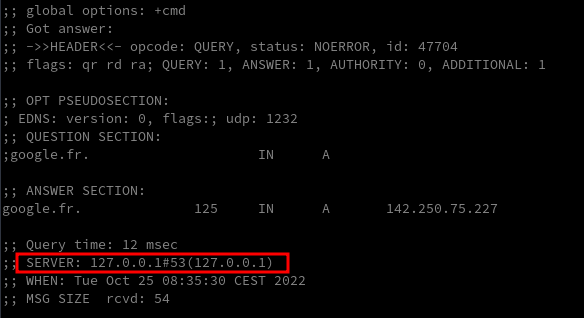

+++
title = 'DNSmasq'
date = 2022-10-25 00:00:00 +0100
categories = dns
+++
*Dnsmasq fournit une infrastructure de réseau pour les petits réseaux : DNS, DHCP, annonce de routeur et démarrage de réseau. Il est conçu pour être léger et avoir une faible empreinte, ce qui convient aux routeurs et aux pare-feu à ressources limitées. Il a également été largement utilisé pour le tethering sur les smartphones et les hotspots portables, et pour supporter les réseaux virtuels dans les cadres de virtualisation. Les plateformes prises en charge sont Linux (avec glibc et uclibc), Android, *BSD et Mac OS X. Dnsmasq est inclus dans la plupart des distributions Linux et dans les systèmes de ports de FreeBSD, OpenBSD et NetBSD. Dnsmasq offre un support IPv6 complet.*


## Installer dnsmasq

    sudo apt install dnsmasq

## DnsMasq sans Resolvconf

Si le paquet **resolvconf** est installé (par défaut sur debian 11), dnsmasq utilisera sa sortie  plutôt que le contenu de `/etc/resolv.conf` pour trouver les serveurs de noms en amont.  
Décommenter la ligne `#IGNORE_RESOLVCONF=yes` empêche ce comportement dans le fichier `/etc/default/dnsmasq`  


    sudo nano /etc/default/dnsmasq

```
# If the resolvconf package is installed, dnsmasq will use its output
# rather than the contents of /etc/resolv.conf to find upstream
# nameservers. Uncommenting this line inhibits this behaviour.
# Note that including a "resolv-file=<filename>" line in
# /etc/dnsmasq.conf is not enough to override resolvconf if it is
# installed: the line below must be uncommented.
IGNORE_RESOLVCONF=yes
```

Notez que l'inclusion d'une ligne `resolv-file=<filename>` dans `/etc/dnsmasq.conf` n'est pas suffisante pour remplacer **resolvconf** si celui-ci est installé : la ligne `#IGNORE_RESOLVCONF=yes` doit être décommentée.
{: .prompt-info }

Configuration de dnsmasq avec le fichier /etc/resolv.conf

Faire en sorte que toutes les requêtes soient envoyées à dnsmasq en ajoutant les adresses localhost comme seul serveur de nom dans le fichier `/etc/resolv.conf` 

```
#     DO NOT EDIT THIS FILE BY HAND -- YOUR CHANGES WILL BE OVERWRITTEN
# 127.0.0.53 is the systemd-resolved stub resolver.
# run "resolvectl status" to see details about the actual nameservers.

nameserver 127.0.0.1
```


La configuration de DnsMasq se déroule via le fichier /etc/dnsmasq.conf. L’exemple fournit par le paquet Debian contient de nombreux commentaires pour expliquer en détails les différents paramètres de la configuration de DnsMasq.

    sudo nano /etc/dnsmasq.conf

```
domain-needed
expand-hosts
localise-queries

interface=lo

resolv-file=/etc/resolv.dnsmasq.conf
```

* **domain-needed** : Ne transmet pas les requêtes ne contenant pas un nom de domaine complet. Par exemple une requête pour machine ne sera pas transmise aux serveurs DNS de votre FAI, alors qu’une requête pour machine.domain.com le sera.
* **expand-hosts** : Ajoute automatiquement le domain définit dans la configuration aux noms de machines présents dans /etc/hosts.
* **localise-queries** : Retourne des réponses aux requêtes DNS dépendantes de l’interface sur laquelle la requête a été reçue, à partir du fichier /etc/hosts. Si un nom dans /etc/hosts a plus d’une adresse associée avec lui, et qu’une des adresses au moins est dans le même sous-réseau que l’interface sur laquelle la requête a été reçue, alors ne retourne que la(les) adresse(s) du sous-réseau considéré. Cela permet d’avoir dans /etc/hosts un serveur avec de multiples adresses, une pour chacune de ses interfaces, et de fournir aux hôtes l’adresse correcte (basée sur le réseau auquel ils sont attachés). Cette possibilité est actuellement limitée à IPv4. 


Pour lutter contre la censure sur Internet, [FDN](https://www.fdn.fr/actions/dns/) fait le choix de mettre à disposition de toutes et tous des résolveurs DNS récursifs ouverts.  
Le fichier des dns `/etc/resolv.dnsmasq.conf`

```
nameserver 80.67.169.12
nameserver 2001:910:800::12
nameserver 80.67.169.40
nameserver 2001:910:800::40
```

Relancer le service dnsmasq

    sudo systemctl restart dnsmasq

Status

    systemctl status dnsmasq

```
● dnsmasq.service - dnsmasq - A lightweight DHCP and caching DNS server
     Loaded: loaded (/lib/systemd/system/dnsmasq.service; enabled; vendor preset: enabled)
     Active: active (running) since Mon 2022-10-24 15:13:28 CEST; 17h ago
   Main PID: 812 (dnsmasq)
      Tasks: 1 (limit: 4694)
     Memory: 48.2M
        CPU: 336ms
     CGroup: /system.slice/dnsmasq.service
             └─812 /usr/sbin/dnsmasq -x /run/dnsmasq/dnsmasq.pid -u dnsmasq -7 /etc/dnsmasq.d,.dpkg>
```

## DnsMasq avec Resolvconf

**Resolvconf** est un programme présent dans la distibution GNU/Linux Debian qui permet de faciliter la maintenance du fichier `/etc/resolv.conf`. Il agit comme une interface entre les programmes qui définissent l’adresse des serveurs de noms (client DCHP, démon PPP…) et les programmes qui utilisent ces informations (résolveur de noms, cache DNS…).

Ce programme évite ainsi l’édition directe du fichier `/etc/resolv.conf` par les programmes en question : les programmes qui ont à ajouter un serveur de nom fournissent son adresse à Resolvconf qui, selon la configuration de l’utilisateur, choisit de l’inclure ou non dans le fichier `/etc/resolv.conf`.

Fonctionnement avec DnsMasq

**Resolvconf** offre un avantage particulier avec **DnsMasq** :  

* il permet de ne fournir à DnsMasq que les DNS externes. 
* Resolvconf va générer un fichier spécifique (‘’/var/run/dnsmasq/resolv.conf’‘) qui contient l’ensemble des adresses des serveurs de noms sauf celle de DnsMasq. 
* D’autre part, à chaque changement de DNS externes, l’information sera automatiquement mise à jour dans le fichier en question. DnsMasq va utiliser automatiquement ce fichier à la place du classique `/etc/resolv.conf` 
* Si on utilise **resolvconf** qui est installé par défaut sur debian 11, dnsmasq utilisera sa sortie.  

La ligne `#IGNORE_RESOLVCONF=yes` doit être commentée dans le fichier `/etc/default/dnsmasq`
{: .prompt-warning }

## Vérifications

installer dnsutils au préalable (`sudo apt install dnsutils`)

    dig google.fr



## Liens

* [Comment configurer un serveur léger dns et dhcp alias Dnsmasq ?](https://doc.ubuntu-fr.org/configuration_serveur_dns_dhcp)
* [Configuration de Dnsmasq](https://www.drazzib.com/docs/admin/dnsmasq.html)
* [How to Use Linux dig Command (DNS Lookup)](https://phoenixnap.com/kb/linux-dig-command-examples)


