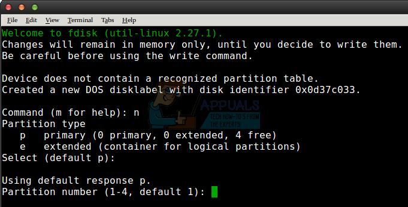
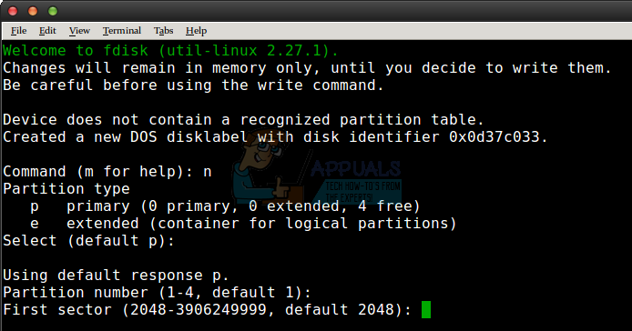
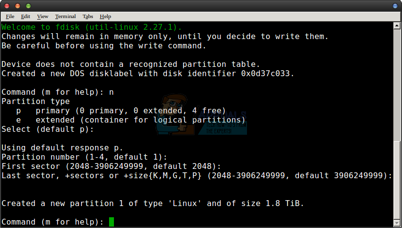
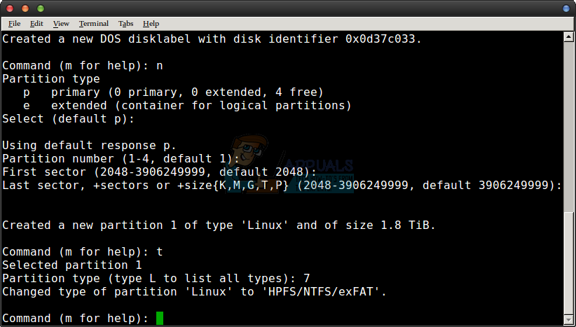
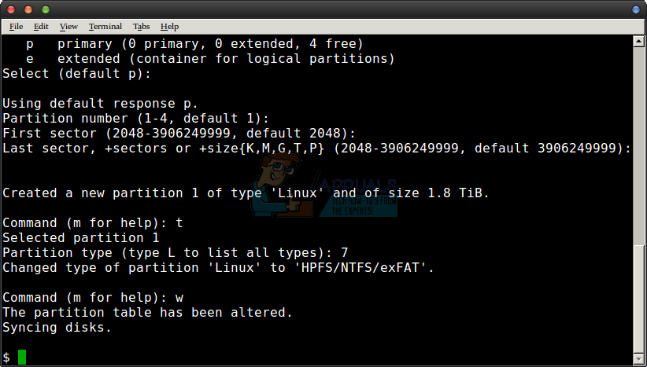

+++
title = 'Linux gestion de volumes (Sata ,USB,etc...) avec Udisks et sytème de fichier ExFAT'
date = 2022-10-25 00:00:00 +0100
categories = ['outils']
+++
## Gestion de volumes avec udisks

* [Gestion de volumes avec udisks (Archlinux FR)](https://wiki.archlinux.fr/Gestion_de_volumes_avec_udisks)
* [Udisks (Archlinux EN)](https://wiki.archlinux.org/index.php/Udisks)

### Montage sur /media (udisks)

*udisks fournit un démon udisksd, qui implémente les interfaces D-Bus utilisées pour interroger et manipuler les périphériques de stockage, et un outil en ligne de commande **udisksctl**, utilisé pour interroger et utiliser le démon*

    udisksctl status

```
MODEL                     REVISION  SERIAL               DEVICE
--------------------------------------------------------------------------
C300-CTFDDAC064MAG        0006      00000000111003043433 sda     
Crucial_CT512MX100SSD1    MU01      15100EE439E5         sdb     
WDC WD40EFRX-68WT0N0      82.00A82  WD-WCC4E4RXRNAV      sdc     
WDC WD5000AACS-00ZUB0     01.01B01  WD-WCASU3356449      sdd     
ST2000LM007-1R8174        SBK2      WDZGGVZA             sde     
```

Par défaut, udisks2 monte les disques amovibles (sde dans la liste) sous le répertoire contrôlé par ACL /run/media/$USER/. Si vous souhaitez monter sur /media à la place, utilisez cette règle :

    sudo nano /etc/udev/rules.d/99-udisks2.rules

```
# UDISKS_FILESYSTEM_SHARED
# ==1: mount filesystem to a shared directory (/media/VolumeName)
# ==0: mount filesystem to a private directory (/run/media/$USER/VolumeName)
# See udisks(8)
ENV{ID_FS_USAGE}=="filesystem|other|crypto", ENV{UDISKS_FILESYSTEM_SHARED}="1"
```

Puisque /media, contrairement à /run, n'est pas monté par défaut en tmpfs, vous pouvez également créer un extrait de tmpfiles.d pour nettoyer les points de montage obsolètes à chaque démarrage :

    sudo nano /etc/tmpfiles.d/media.conf

```
D /media 0755 root root 0 -
```

## Format exfat

*L'exFAT (ou FAT64) est le dernier système de fichier de Microsoft (donc propriétaire) pour les mémoires flash.
Il a surtout permis de dépasser la limite de 4 Gio par fichier du FAT32*

Pour la portabilité d'une unité de stockage amovible la plus universelle possible , il faut choisir le bon système de fichiers

Système de fichiers |Windows XP |Windows 7/8/10 |macOS (10.6.4 et antérieures) |macOS (10.6.5 et ultérieures) |Linux |Playstation 4 |Xbox 360/One
------|----|----|----------|----------|----|---|------
NTFS  |Oui |Oui |Lecture Seul |Lecture Seul |Oui |Non |Non/Oui
FAT32 |Oui |Oui |Oui |Oui |Oui |Oui |Oui/Oui
exFAT |Oui |Oui |Non |Oui |Oui (avec paquet ExFAT) |Oui (avec MBR, pas GUID) |Non/Oui
HFS+ |Non |(Lecture Seul avec Boot Camp) |Oui |Oui |Oui |Non |Oui
APFS |Non |Non |Non |Oui (macOS 10.13 ou sup) |Non |Non |Non
EXT 2, 3, 4 |Non |Oui (avec logiciel tierce) |Non |Non |Oui |Non |Oui

L'unité externe présente , disque USB3/2 To système de fichiers exfat   
Installer l'utilitaire pour autoriser le formatage avec ce type

    yay -S exfat-utils

`dmesg` # relever l'unité amovible /dev/sdx (ex: /dev/sde)  

    sudo fdisk /dev/sde
    o   # créer une nouvelle table vide de partitions DOS

{:width="500"}  
Touche clavier "Entrée"  

{:width="500"}  
Touche clavier "Entrée"  

{:width="500"}  
Touche clavier "t" puis "7" 

{:width="500"}  
Touche clavier "w"  

{:width="500"}  

Format partition exfat

    sudo mkexfatfs -n hardDisk /dev/sde1 # format avec système de fichiers exfat

Vérifier un volume exFAT

    sudo fsck.exfat /dev/sde1

```
exfatfsck 1.3.0
Checking file system on /dev/sde1.
File system version           1.0
Sector size                 512 bytes
Cluster size                128 KB
Volume size                 115 GB
Used space                 4224 KB
Available space             115 GB
Totally 0 directories and 0 files.
File system checking finished. No errors found.
```


