+++
title = 'Comment configurer le client VPN WireGuard avec l'interface graphique de NetworkManager'
date = 2022-11-07 00:00:00 +0100
categories = ['wireguard']
+++
{:width="50"}  
[WireGuard](https://www.xmodulo.com/wireguard.html) est une implémentation de protocole VPN open source qui gagne rapidement en popularité parmi les utilisateurs de VPN en raison de sa vitesse, de sa facilité d'utilisation et de sa base de code bien conçue. Le module de noyau WireGuard est livré avec le noyau Linux principal 5.6 ou une version ultérieure, et ses outils utilisateur sont déjà intégrés dans les référentiels de base de toutes les distributions Linux modernes. Si vous cherchez à configurer un routeur VPN DIY sur un VPS public sous votre contrôle, il n'y a vraiment aucune raison de ne pas essayer WireGuard.

La configuration d'un routeur VPN WireGuard ne nécessite aucune connaissance approfondie du protocole VPN sous-jacent, ni n'implique l'apprentissage d'un langage de configuration cryptique ou l'exploration d'un vaste espace de configuration. Il existe également diverses interfaces conviviales en cours d'élaboration qui simplifient la configuration VPN côté client.

Ce didacticiel se concentre sur la configuration du client VPN WireGuard à l'aide d'un outil de gestion de réseau populaire de choix : l'interface graphique **NetworkManager**.

**Dans ce didacticiel, vous avez un serveur VPN WireGuard (mullvad ou autre)  **

### I vérifier l'exigence

Pour que vous puissiez configurer le client VPN WireGuard avec l'interface graphique de NetworkManager, vous avez besoin de NetworkManager avec la version 1.26.2 ou supérieure. Donc avant de continuer, vérifiez d'abord la version de votre NetworkManager. Ubuntu 20.10, Fedora 33 et Arch Linux 2020.09.01 ou version ultérieure répondent à cette exigence. Ce tutoriel n'est donc applicable qu'à l'un de ces environnements de bureau Linux.

### II installer WireGuard

Allez-y et installez WireGuard avec le gestionnaire de packages par défaut.

Pour Ubuntu :

    sudo apt installer wireguard

Pour Fedora :

    sudo dnf installer wireguard-tools

Pour Arch Linux :

    sudo pacman -S wireguard-tools

### III créer une paire de clés cryptographiques

Ensuite, créez une paire de clés publique/privée pour le client VPN WireGuard. Pour cela, passons d'abord à la racine. Le reste des étapes du didacticiel sera effectué en tant que root.

    sudo -s

Utilisez la commande wg pour créer une paire de clés et les stocker dans /etc/wireguard.

    cd /etc/wireguard
    umask 077
    wg genkey | tee /etc/wireguard/privatekey | wg pubkey | tee /etc/wireguard/publickey

### IV ajouter la clé publique du client au serveur VPN WireGuard

Pour que le client WireGuard puisse parler au serveur VPN WireGuard, vous devez ajouter explicitement la clé publique du client au serveur VPN. Après tout, WireGuard est un VPN peer-to-peer. Connectez-vous donc à l'hôte du serveur VPN WireGuard et exécutez la commande suivante.

    wg set wg0 peer &lt;client-public-key&gt; allow-ips &lt;client-VPN-address&gt;

Notez que dans cet exemple, l'adresse IP VPN du client est 10.0.0.2.

### V créer une connexion réseau avec l'interface graphique de l'éditeur de connexion de NetworkManager

Ensuite, exécutez nm-connection-editor à partir de la ligne de commande et ajoutez une nouvelle connexion réseau pour WireGuard VPN. Assurez-vous de lancer nm-connection-editor en tant que root car il doit créer un fichier de configuration dans /etc/NetworkManager/system-connections.

    nm-connection-editor

Accéder par  à l'interface graphique des connexions réseau, cliquez sur le bouton +  
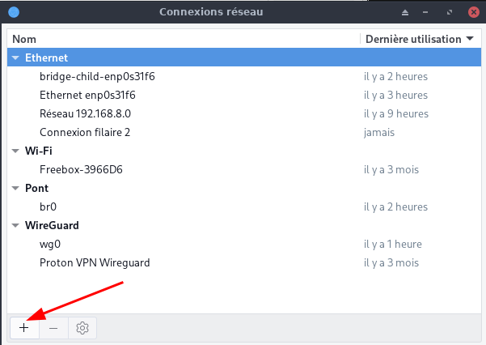  

NetworkManager version 1.26.2 et supérieure, vous permet de créer une connexion de type WireGuard. Alors allez-y et choisissez WireGuard comme type de connexion.  
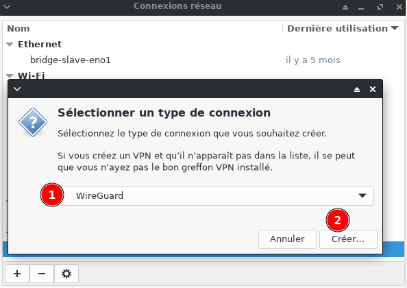  
Cela ouvrira une fenêtre d'éditeur de connexion comme suit. Dans l'onglet WireGuard, définissez le nom de l'interface sur wg0 et remplissez la clé privée. La clé privée doit provenir du contenu de /etc/wireguard/privatekey que vous venez de créer à l'étape 3. Cliquez ensuite sur le bouton Ajouter en bas, ce qui vous permet de spécifier un serveur VPN WireGuard en tant qu'homologue.  
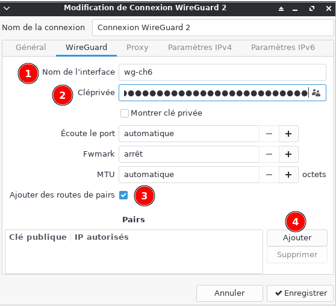  
Sur l'interface graphique de l'éditeur d'homologues WireGuard, remplissez les champs Clé publique, IP autorisées et Point de terminaison. La clé publique doit provenir du serveur WireGuard. Le point de terminaison se compose de l'adresse IP WAN du serveur VPN et du port UDP sur lequel le serveur écoute. Après les avoir remplis, cliquez sur le bouton **Appliquer**.  
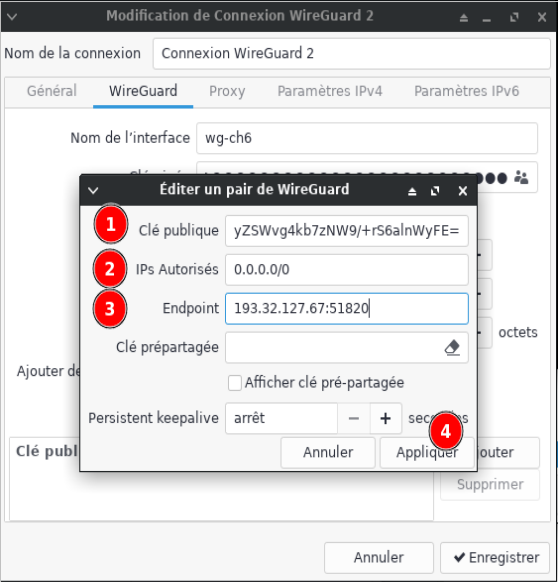  
À ce stade, vous verrez le serveur VPN ajouté en tant que peer :  
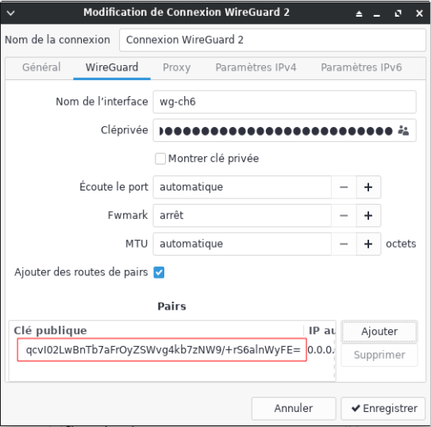  
Ensuite, accédez à l'onglet **Paramètres IPv4** et configurez une adresse IP VPN privée à attribuer au client VPN WireGuard, qui est 10.0.0.2/24. En tant que passerelle, spécifiez l'adresse IP VPN du serveur VPN WireGuard, qui est 10.0.0.1/24. Pour les serveurs DNS, vous pouvez choisir n'importe quel serveur DNS public (par exemple, 8.8.8.8).   
Idem pour **Paramètres IPv6**  
Cliquez sur le bouton Enregistrer.  
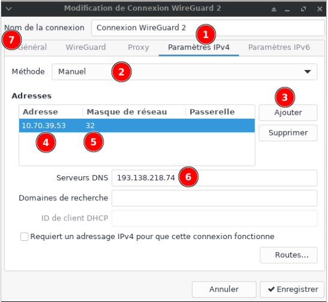  
Passez maintenant à l'onglet Général et cochez la case à côté de Se connecter automatiquement avec priorité. Cela activera automatiquement cette connexion WireGuard et établira une connexion VPN avec le serveur VPN WireGuard. Cliquez sur le bouton Enregistrer pour finaliser.  
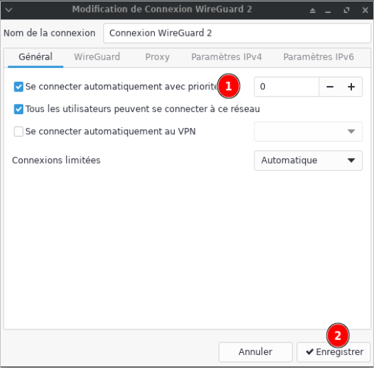  

### VI vérifier la connectivité VPN WireGuard

À ce stade, une connexion VPN WireGuard doit être établie et tout le trafic sortant du client doit être acheminé via le serveur VPN WireGuard.
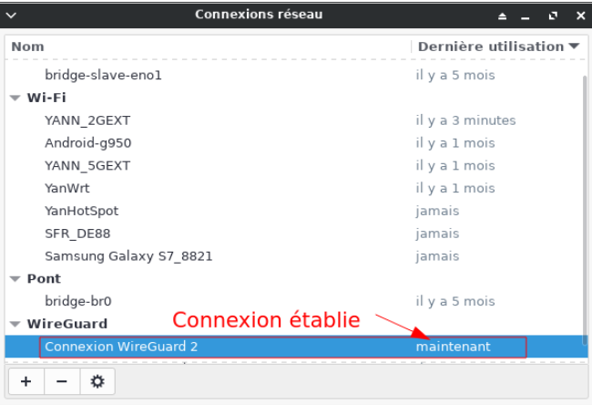  
Pour vérifier la connectivité VPN WireGuard côté client, vous pouvez essayer de pinger un hôte externe (par exemple, 8.8.8.8) à partir de l'hôte du client. Pour vérifier que le trafic ping est acheminé via le serveur VPN WireGuard, utilisez la commande ip.

    ping  -c2 1.1.1.1 
    ip route get  1.1.1.1 

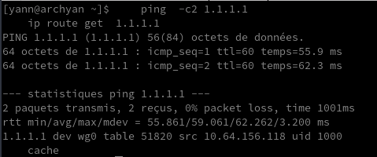   
La commande `ip route get <destination>` affiche la route utilisée pour atteindre la destination spécifiée. La sortie de la commande ci-dessus confirme que le trafic destiné à 1.1.1.1 est acheminé via l'interface wg0, pas l'interface WAN ou LAN de l'hôte.

Une autre façon de vérifier la connectivité VPN consiste à exécuter tcpdump sur l'interface virtuelle wg0 de WireGuard et à vérifier si l'interface voit le trafic de requête et de réponse ICMP généré par la commande ping.

    tcpdump -i wg0

### Facultatif : gérer une connexion WireGuard à partir de la ligne de commande

[WireGuard in NetworkManager](https://blogs.gnome.org/thaller/2019/03/15/wireguard-in-networkmanager/)

Une fois qu'une connexion WireGuard est créée avec succès avec l'interface graphique de Network Manager, vous pouvez gérer la connexion à partir de la ligne de commande avec nmcli comme suit.

Exécutez simplement nmcli pour voir l'état de la connexion VPN.

    nmcli

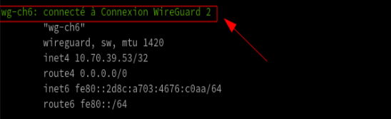   
Pour voir les propriétés de connexion détaillées de WireGuard VPN :

    nmcli --overview connection show 'Connexion WireGuard 2'

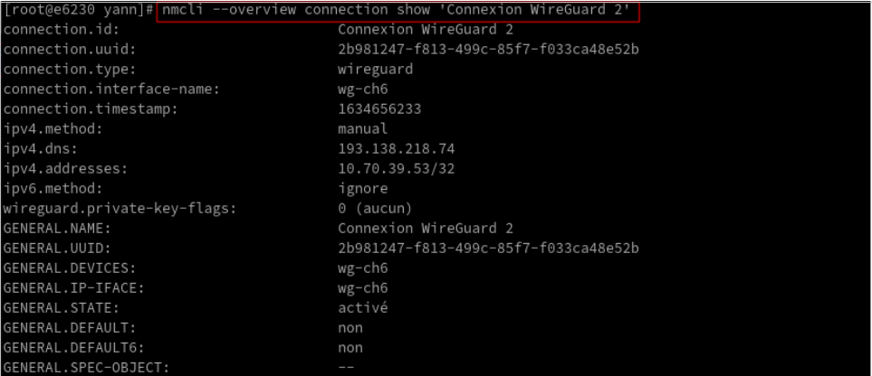   
Pour démarrer ou arrêter WireGuard VPN :

    nmcli connection *down* 'Connexion WireGuard 2'

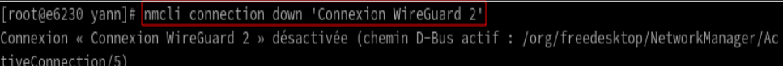   

    nmcli connection *up* 'Connexion WireGuard 2'

   
Pour vérifier l'état de démarrage automatique de WireGuard VPN :

    nmcli connection show 'Connexion WireGuard 2' | grep autoconnect

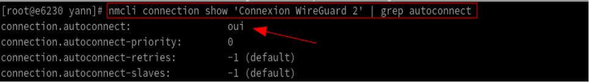   
Pour activer/désactiver le démarrage automatique de WireGuard VPN :

    nmcli connection modify 'Connexion WireGuard 2' connection.autoconnect yes
    nmcli connection modify 'Connexion WireGuard 2' connection.autoconnect no

Pour supprimer la connexion VPN WireGuard :

    nmcli connection delete 'Connexion WireGuard 2'

Pour ajouter une connexion à partir d'un fichier de configuration

    nmcli connection import type wireguard file "wg0.conf"

>Note les clés PreUp, PostUp, PreDown, et PostDown sont ignorées

### Dépannage VPN WireGuard

Symptôme : vous ne pouvez pas cingler l'adresse IP privée du serveur VPN WireGuard (10.0.0.1).

Solution 1 : vérifier l'accessibilité du port UDP

Assurez-vous que le port d'écoute UDP du serveur VPN est accessible au client. Pour vérifier si c'est le cas, utilisez la commande nc.

    nc -zvu &lt;VPN-server's-WAN-address&gt; &lt;UDP-port&gt;

Dans notre exemple :

    nc -zvu 192.168.122.104 51820

    Connection to 192.168.122.240 51820 port \[udp/\*\] succeeded!

Si vous ne pouvez pas atteindre le port UDP, c'est probablement le pare-feu côté serveur qui bloque le trafic entrant vers le port UDP. Assurez-vous d'ouvrir le port dans le pare-feu côté serveur.

Solution 2 : vérifiez si la clé publique du client est ajoutée au serveur VPN

Une autre possibilité est que vous ayez oublié d'ajouter la clé publique du client au serveur VPN WireGuard. Comme décrit à l'étape 4 de ce didacticiel, utilisez la commande wg pour le faire :

    wg set wg0 peer allowed-ips
