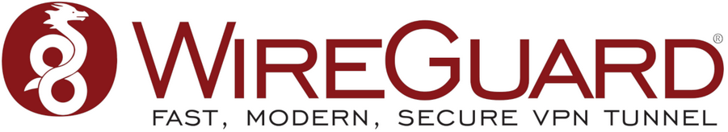

+++
title = 'Wireguard (Mullvad) sur terminal Linux (avancé)'
date = 2022-11-07 00:00:00 +0100
categories = wireguard
+++


Article original [WireGuard on Linux terminal (advanced)](https://mullvad.net/fr/help/wireguard-and-mullvad-vpn/)  

*Ce guide avancé pour terminal uniquement vous apprendra à utiliser le protocole WireGuard® pour vous connecter à Mullvad en utilisant Linux.*

Nous avons également un guide de [configuration plus simple (en)](https://mullvad.net/en/guides/easy-wireguard-mullvad-setup-linux/) qui utilise notre générateur de configuration basé sur un navigateur.

### 1. Installez WireGuard

```shell
# Debian
sudo apt-get update && sudo apt-get install curl jq openresolv wireguard
# Archlinux
sudo pacman -S wireguard-tools
```

Pour les distributions non basées sur Debian, suivez les [instructions d'installation officielles de WireGuard (en)](https://www.wireguard.com/install/).

### 2. Exécutez notre script de configuration

    curl -LO https://mullvad.net/media/files/mullvad-wg.sh && chmod +x ./mullvad-wg.sh && ./mullvad-wg.sh

Si vous exécutez WireGuard sur plusieurs appareils, générez une paire de clés distincte pour chaque appareil. Sinon, vous rencontrerez probablement des problèmes de connectivité.

### 3. Activez WireGuard

    wg-quick up mullvad-se4

Vous pouvez remplacer "se4" par l'une des autres régions présentes sur notre page de serveur .

### Déconnecter

    wg-quick down mullvad- se4

Comme précédemment, vous pouvez remplacer "se4" par la région actuellement utilisée.

### Vérifiez votre connexion

Pour vérifier que WireGuard fonctionne, utilisez notre outil en ligne [Vérification de connexion](https://mullvad.net/fr/check/) pour vérifier votre IP.

### Multihop avec WireGuard

Multihop peut être utilisé pour de nombreuses raisons différentes, par exemple, en augmentant votre confidentialité ou en améliorant la latence / les performances en raison de l'homologation FAI sous-optimale.

Chaque serveur WireGuard est connecté à tous les autres serveurs WireGuard via des tunnels WireGuard. Cela signifie que vous pouvez effectuer des sauts multiples d'un serveur à un autre. Pour ce faire, vous pouvez vous connecter à un port spécifique d'un serveur WireGuard qui se connectera ensuite à l'autre serveur WireGuard via le tunnel.

Par exemple, supposons que vous souhaitiez vous connecter à nl1 via se4. Pour ce faire, vous devez vous connecter à se4-wireguard.mullvad.net:3004 et utiliser la clé publique du serveur nl1.

Choisissez une adresse multihop sur [notre page serveur](https://mullvad.net/servers/#wireguard) . Ajoutez ensuite un nouveau fichier de configuration multihop en modifiant un fichier existant:

    sudo sh -c "umask 077; sed 's/^Endpoint.*/Endpoint = se4-wireguard.mullvad.net:3004/' /etc/wireguard/mullvad-nl1.conf > /etc/wireguard/wireguard-se4nl1.conf"

### Multihop via les proxys SOCKS5

Notre guide du proxy SOCKS5 comprend les étapes de configuration de votre navigateur ou d'autres programmes pour effectuer un multihop à l'aide de nos proxys WireGuard SOCKS5 ([multihop using our WireGuard SOCKS5 proxies](http://mullvad.net/guides/socks5-proxy/#wireguard-socks5)) .

### Dépannage

Si vous rencontrez des problèmes lors du test de WireGuard, veuillez nous contacter à support@mullvad.net et faites-nous savoir ce que vous vivez.

En raison d'un [bogue Debian](http://bugs.debian.org/cgi-bin/bugreport.cgi?bug=860564) , les utilisateurs Debian/Ubuntu peuvent souhaiter installer **openresolv** plutôt que resolvconf cassé de Debian, afin d'éviter les fuites DNS.

    DNS leaking Ubuntu 18.04 or newer (or other systems that use systemd-resolved)

Dans le fichier de configuration WireGuard, remplacez la ligne 'DNS=' par: `PostUp = systemd-resolve -i %i --set-dns=193.138.218.74 --set-domain=~`

## FAQ

### Comment activer un kill switch?

Ajoutez les lignes suivantes sous la section [Interface] des fichiers de configuration WireGuard trouvés dans **/etc/wireguard/** :

```
PostUp  =  iptables -I OUTPUT ! -o %i -m mark ! --mark $(wg show %i fwmark) -m addrtype ! --dst-type LOCAL -j REJECT && ip6tables -I OUTPUT ! -o %i -m mark ! --mark $(wg show %i fwmark) -m addrtype ! --dst-type LOCAL -j REJECT
PreDown = iptables -D OUTPUT ! -o %i -m mark ! --mark $(wg show  %i fwmark) -m addrtype ! --dst-type LOCAL -j REJECT && ip6tables -D OUTPUT ! -o %i -m mark ! --mark $(wg show  %i fwmark) -m addrtype ! --dst-type LOCAL -j REJECT
```

`man wg-quick` pour plus d'informations.

### Comment faire pour que WireGuard démarre automatiquement au boot?

Exécutez la commande suivante, en remplaçant **mullvad-se4** par le serveur WireGuard que vous souhaitez utiliser.

    systemctl enable wg-quick@mullvad-se4

### Comment activer la redirection de port?

Connectez-vous avec votre compte sur notre site Web, puis ajoutez les ports à partir de la page de votre compte, vous pouvez déplacer les ports vers différentes pubkeys.

## Ressources externes (en)

*    [Page d'accueil de WireGuard](https://www.wireguard.com/)
*    [Livre blanc WireGuard (PDF)](https://www.wireguard.com/papers/wireguard.pdf)
*    [instructions d'installation](https://www.wireguard.com/install/)
*    [Instructions de démarrage rapide](https://www.wireguard.com/quickstart/)
*    [Faire un don au développement en amont de WireGuard](https://www.wireguard.com/donations/)
*    [Vérification formelle du protocole WireGuard](https://www.wireguard.com/formal-verification/)
*    [page de manuel wg (8)](https://git.zx2c4.com/WireGuard/about/src/tools/wg.8)
*    [Page de manuel de wg-quick (8)](https://git.zx2c4.com/WireGuard/about/src/tools/wg-quick.8) 

**"WireGuard" est une marque déposée de Jason A. Donenfeld.** 