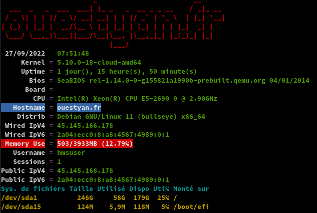
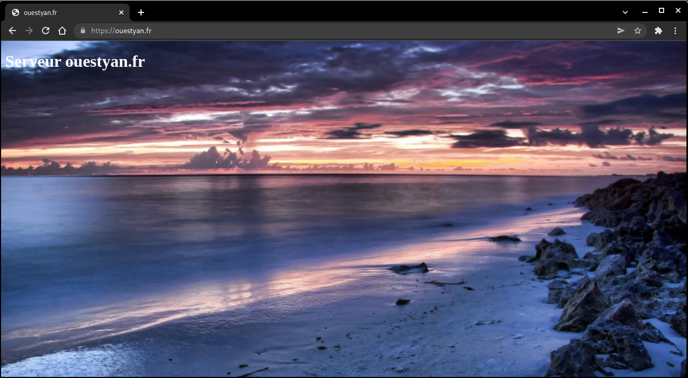
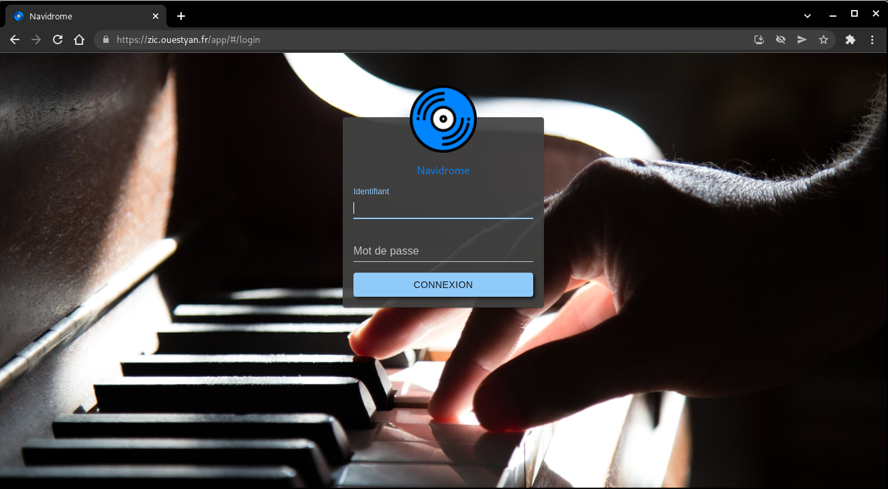
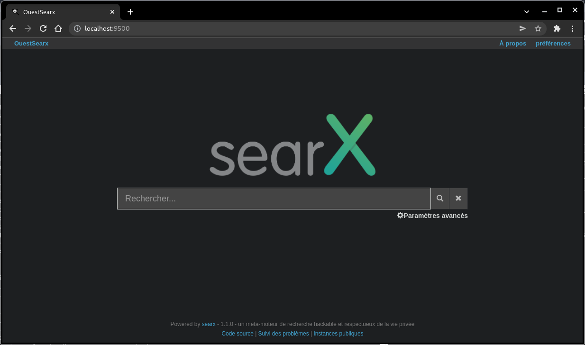
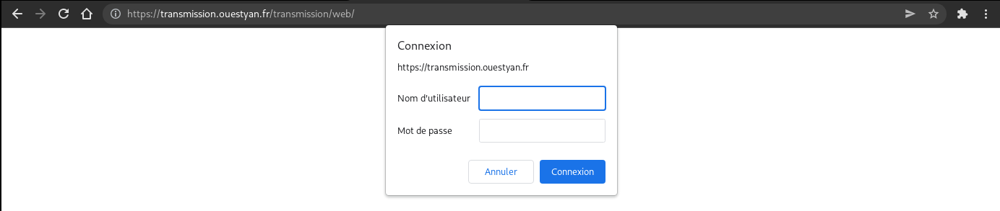
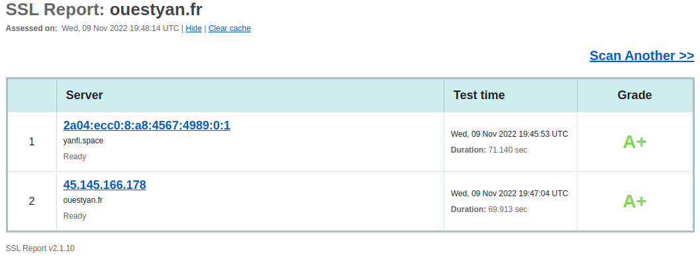
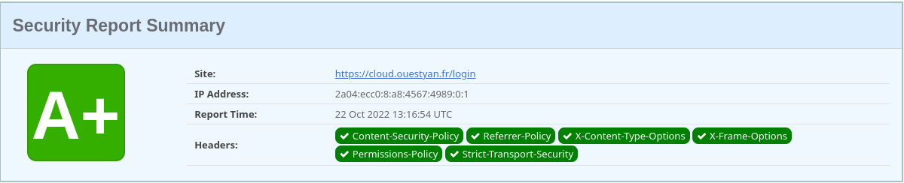

+++
title = 'HostMyServers, server32771 Debian 11 (Bullseye)'
date = 2022-11-09 00:00:00 +0100
categories = ['vps']
+++
{:width="80"}  
[Accès client](https://www.hostmyservers.fr/user)

- [Debian bullseye](#debian-bullseye)
    - [Reconfigurer locales](#reconfigurer-locales)
    - [NTP avec systemd-timesyncd](#ntp-avec-systemd-timesyncd)
    - [DNS resolvconf](#dns-resolvconf)
    - [Création utilisateur](#création-utilisateur)
    - [OpenSSH, clé et script](#openssh-clé-et-script)
    - [Outils, scripts motd et ssh_rc_bash](#outils-scripts-motd-et-ssh_rc_bash)
    - [Parefeu UFW](#parefeu-ufw)
    - [Nginx compilé](#nginx-compilé)
    - [Domaine et certificats](#domaine-et-certificats)
        - [OVH domaine ouestyan.fr](#ovh-domaine-ouestyanfr)
        - [Certificats Let's Encrypt](#certificats-lets-encrypt)
    - [Nginx security.conf.inc](#nginx-securityconfinc)
    - [Fail2ban](#fail2ban)
    - [Notifications](#notifications)
    - [Docker](#docker)
- [Sauvegardes](#sauvegardes)
    - [Données /srv/datayan](#données-srvdatayan)
    - [BorgBackup](#borgbackup)
- [ouestyan.fr](#ouestyanfr)
    - [Accueil](#accueil)
    - [Navidrome](#navidrome)
    - [Searx](#searx)
        - [Installation des paquets prérequis](#installation-des-paquets-prérequis)
        - [Installer searx et les dépendances](#installer-searx-et-les-dépendances)
        - [Configuration](#configuration)
        - [Vérifier en local](#vérifier-en-local)
        - [uwsgi](#uwsgi)
        - [nginx proxy searx](#nginx-proxy-searx)
    - [Nextcloud](#nextcloud)
        - [Transmission Torrent](#transmission-torrent)
        - [Installer transmission-daemon](#installer-transmission-daemon)
        - [Proxy nginx](#proxy-nginx)
        - [Dossiers et configuration](#dossiers-et-configuration)
        - [transmission.ouestyan.fr](#transmissionouestyanfr)
    - [Test de sécurité](#test-de-sécurité)

## Debian bullseye

{:height="60"}  

PARAMETRES D'ACCES:  
L'adresse IPv4 du VPS est : 45.145.166.178  
L'adresse IPv6 du VPS est : 2a04:ecc0:8:a8:4567:4989::1  

Connexion SSH en "root" 

    ssh root@45.145.166.178

Modifier le fichier des dépôts `/etc/apt/sources.list`

```
deb http://deb.debian.org/debian bullseye main contrib non-free
deb-src http://deb.debian.org/debian bullseye main contrib non-free

#deb http://deb.debian.org/debian bullseye-updates main contrib non-free
#deb-src http://deb.debian.org/debian bullseye-updates main contrib non-free

deb http://security.debian.org/debian-security bullseye-security main
deb-src http://security.debian.org/debian-security bullseye-security main
```

Rafraîchir 

    apt update && apt upgrade

Créer mot de passe  "root"

    passwd

Le paramétrage réseau par défaut `/etc/network/interfaces.d/50-cloud-init`  
Il faut commenter la ligne `dns-nameservers 194.9.173.89 2a04:ecc0:4::89` pour utiliser dnsmasq

```
# This file is generated from information provided by the datasource.  Changes
# to it will not persist across an instance reboot.  To disable cloud-init's
# network configuration capabilities, write a file
# /etc/cloud/cloud.cfg.d/99-disable-network-config.cfg with the following:
# network: {config: disabled}
auto lo
iface lo inet loopback
#    dns-nameservers 194.9.173.89 2a04:ecc0:4::89

auto eth0
iface eth0 inet static
    address 45.145.166.178/24
    gateway 45.145.166.1

# control-alias eth0
iface eth0 inet6 static
    address 2a04:ecc0:8:a8:4567:4989::1/64
    gateway 2a04:ecc0:8:a8::1
```

### Reconfigurer locales

installer le paquet locales-all

    apt-get install locales-all

### NTP avec systemd-timesyncd

Le service ntp de systemd s'appelle **systemd-timesyncd.service**  
La configuration se fait dans `/etc/systemd/timesyncd.conf`

>Si vous utilisez un autre service pour gérer NTP, assurez-vous de le(s) désactiver : ntpd chronyd

Installation

    sudo apt install systemd-timesyncd

Par défaut

    systemctl status systemd-timesyncd.service

```
● systemd-timesyncd.service - Network Time Synchronization
     Loaded: loaded (/lib/systemd/system/systemd-timesyncd.service; enabled; vendor preset: enabled)
     Active: active (running) since Sun 2022-09-25 02:50:09 UTC; 10h ago
       Docs: man:systemd-timesyncd.service(8)
   Main PID: 10822 (systemd-timesyn)
     Status: "Initial synchronization to time server 188.68.41.203:123 (0.debian.pool.ntp.org)."
      Tasks: 2 (limit: 4698)
     Memory: 1012.0K
        CPU: 54ms
     CGroup: /system.slice/systemd-timesyncd.service
             └─10822 /lib/systemd/systemd-timesyncd
```

Fuseau Europe/Paris

    sudo timedatectl set-timezone Europe/Paris

Horloge système synchronisée

    timedatectl

```
               Local time: dim. 2022-09-25 15:47:44 CEST
           Universal time: dim. 2022-09-25 13:47:44 UTC
                 RTC time: dim. 2022-09-25 13:47:45
                Time zone: Europe/Paris (CEST, +0200)
System clock synchronized: yes
              NTP service: active
          RTC in local TZ: no
```

### dnsmasq

  
[DNSmasq (installation et configuration)](/posts/DNSmasq/)

Installation

    sudo apt install dnsmasq

Si le paquet **resolvconf** est installé, dnsmasq utilisera sa sortie  plutôt que le contenu de `/etc/resolv.conf` pour trouver les serveurs de noms en amont. Décommenter la ligne `#IGNORE_RESOLVCONF=yes` empêche ce comportement.  
Notez que l'inclusion d'une ligne `resolv-file=<filename>` dans `/etc/dnsmasq.conf` n'est pas suffisante pour remplacer **resolvconf** si celui-ci est installé : la ligne `#IGNORE_RESOLVCONF=yes` doit être décommentée.

`/etc/default/dnsmasq`

```
# Whether or not to run the dnsmasq daemon; set to 0 to disable.
# Note that this is only valid when using SYSV init. For systemd,
# use "systemctl disable dnsmasq"
ENABLED=1

# By default search this drop directory for configuration options.
# Libvirt leaves a file here to make the system dnsmasq play nice.
# Comment out this line if you don't want this. The dpkg-* are file
# endings which cause dnsmasq to skip that file. This avoids pulling
# in backups made by dpkg.
CONFIG_DIR=/etc/dnsmasq.d,.dpkg-dist,.dpkg-old,.dpkg-new

# If the resolvconf package is installed, dnsmasq will use its output
# rather than the contents of /etc/resolv.conf to find upstream
# nameservers. Uncommenting this line inhibits this behaviour.
# Note that including a "resolv-file=<filename>" line in
# /etc/dnsmasq.conf is not enough to override resolvconf if it is
# installed: the line below must be uncommented.
IGNORE_RESOLVCONF=yes
```

Configuration de dnsmasq avec le fichier /etc/resolv.conf

Vous devez faire en sorte que toutes les requêtes soient envoyées à dnsmasq en ajoutant les adresses localhost comme seuls serveurs de noms dans le fichier `/etc/resolv.conf` 

```
#     DO NOT EDIT THIS FILE BY HAND -- YOUR CHANGES WILL BE OVERWRITTEN
# 127.0.0.53 is the systemd-resolved stub resolver.
# run "resolvectl status" to see details about the actual nameservers.

nameserver 127.0.0.1
```

Ouvrir le fichier `/etc/dnsmasq.conf` et effectuer les réglages de configuration 

```
domain-needed
expand-hosts
localise-queries

interface=lo

resolv-file=/etc/resolv.dnsmasq.conf
```

Explications

* **domain-needed** : Ne transmet pas les requêtes ne contenant pas un nom de domaine complet. Par exemple,une requête pour machine ne sera pas transmise aux serveurs DNS de votre FAI, alors qu’une requête pour machine.domain.com le sera. 
* Si vous souhaitez qu'un domaine soit automatiquement ajouté aux noms simples dans un fichier hosts, décommentez l'option **expand-hosts** 
* **localise-queries** : Retourne des réponses aux requêtes DNS dépendantes de l’interface sur laquelle la requête a été reçue, à partir du fichier /etc/hosts. Si un nom dans /etc/hosts a plus d’une adresse associée avec lui, et qu’une des adresses au moins est dans le même sous-réseau que l’interface sur laquelle la requête a été reçue, alors ne retourne que la(les) adresse(s) du sous-réseau considéré. Cela permet d’avoir dans /etc/hosts un serveur avec de multiples adresses, une pour chacune de ses interfaces, et de fournir aux hôtes l’adresse correcte (basée sur le réseau auquel ils sont attachés). Cette possibilité est actuellement limitée à IPv4. 

Pour lutter contre la censure sur Internet, [FDN](https://www.fdn.fr/actions/dns/) fait le choix de mettre à disposition de toutes et tous des résolveurs DNS récursifs ouverts.  
Le fichier des dns `/etc/resolv.dnsmasq.conf`

```
nameserver 80.67.169.12
nameserver 2001:910:800::12
nameserver 80.67.169.40
nameserver 2001:910:800::40
```

Redémarrer dnsmasq

    sudo systemctl restart dnsmasq

Vérifications, installer dnsutils au préalable (`sudo apt install dnsutils`)


### Création utilisateur

Utilisateur **hmsuser**  

    useradd -m -d /home/hmsuser/ -s /bin/bash hmsuser

Mot de passe **hmsuser**  

    passwd hmsuser

Visudo pour les accès root via utilisateur **hmsuser**  

```bash
echo "hmsuser     ALL=(ALL) NOPASSWD: ALL" >> /etc/sudoers
```

Déconnexion puis connexion ssh en mode utilisateur  

    ssh hmsuser@45.145.166.178

### OpenSSH, clé et script

{:height="70"}  
**connexion avec clé**  
<u>sur l'ordinateur de bureau</u>
Générer une paire de clé curve25519-sha256 (ECDH avec Curve25519 et SHA2) pour une liaison SSH avec le serveur.  

    ssh-keygen -t ed25519 -o -a 100 -f ~/.ssh/server32771

Envoyer les clés publiques sur le serveur KVM   

    ssh-copy-id -i ~/.ssh/server32771.pub hmsuser@45.145.166.178

<u>sur le serveur KVM</u>
On se connecte  

    ssh hmsuser@45.145.166.178

Modifier la configuration serveur SSH  

    sudo nano /etc/ssh/sshd_config

Modifier

```conf
Port = 55178
PermitRootLogin no
PasswordAuthentication no
```


Relancer openSSH  

    sudo systemctl restart sshd

Accès depuis le poste distant avec la clé privée  

    ssh hmsuser@45.145.166.178 -p 55178 -i ~/.ssh/server32771  

### Outils, scripts motd et ssh_rc_bash

{:height="50"}  
Installer utilitaires  

    sudo apt install rsync curl tmux jq figlet git


Motd

    sudo rm /etc/motd && sudo nano /etc/motd

```
  _  _           _    __  __        ___                              
 | || | ___  ___| |_ |  \/  | _  _ / __| ___  _ _ __ __ ___  _ _  ___
 | __ |/ _ \(_-<|  _|| |\/| || || |\__ \/ -_)| '_|\ V // -_)| '_|(_-<
 |_||_|\___//__/ \__||_|  |_| \_, ||___/\___||_|   \_/ \___||_|  /__/
                              |__/____ ___  ____  ____  _            
      ___ ___  _ _ __ __ ___  _ _|__ /|_  )|__  ||__  |/ |           
     (_-</ -_)| '_|\ V // -_)| '_||_ \ / /   / /   / / | |           
     /__/\___||_|   \_/ \___||_| |___//___| /_/   /_/  |_|           
                         _                          __               
     ___  _  _  ___  ___| |_  _  _  __ _  _ _      / _| _ _          
    / _ \| || |/ -_)(_-<|  _|| || |/ _` || ' \  _ |  _|| '_|         
    \___/ \_,_|\___|/__/ \__| \_, |\__,_||_||_|(_)|_|  |_|           
                              |__/                                   
```


Script **ssh_rc_bash**  
>**ATTENTION!!! Les scripts sur connexion peuvent poser des problèmes pour des appels externes autres que ssh**

    wget https://static.xoyaz.xyz/files/ssh_rc_bash
    chmod +x ssh_rc_bash # rendre le bash exécutable
    ./ssh_rc_bash        # exécution



### Parefeu UFW

{:width="50"} 

*UFW, ou pare - feu simple , est une interface pour gérer les règles de pare-feu dans Arch Linux, Debian ou Ubuntu. UFW est utilisé via la ligne de commande (bien qu'il dispose d'interfaces graphiques disponibles), et vise à rendre la configuration du pare-feu facile.*

Installation **Debian / Ubuntu**

    sudo apt install ufw

*Par défaut, les jeux de règles d'UFW sont vides, de sorte qu'il n'applique aucune règle de pare-feu, même lorsque le démon est en cours d'exécution.*   

Les règles 

```bash
sudo ufw allow 55178/tcp  # port SSH
sudo ufw allow http       # port 80
sudo ufw allow https      # port 443
sudo ufw allow DNS        # port 53
```

Activer le parefeu

    sudo ufw enable

```
Command may disrupt existing ssh connections. Proceed with operation (y|n)? y
Firewall is active and enabled on system startup
```

Status

     sudo ufw status verbose

```
Status: active
Logging: on (low)
Default: deny (incoming), allow (outgoing), disabled (routed)
New profiles: skip

To                         Action      From
--                         ------      ----
55178/tcp                  ALLOW IN    Anywhere                  
80/tcp                     ALLOW IN    Anywhere                  
443                        ALLOW IN    Anywhere                  
53 (DNS)                   ALLOW IN    Anywhere                  
55178/tcp (v6)             ALLOW IN    Anywhere (v6)             
80/tcp (v6)                ALLOW IN    Anywhere (v6)             
443 (v6)                   ALLOW IN    Anywhere (v6)             
53 (DNS (v6))              ALLOW IN    Anywhere (v6)             
```

### Nginx compilé

  

Utilisateur avec droits sudo  

Télécharger le bash

```
wget https://static.xoyaz.xyz/files/compilation-nginx-tls1.3.sh
chmod +x compilation-nginx-tls1.3.sh # rendre le bash exécutable
./compilation-nginx-tls1.3.sh        # exécution
```

A la fin de la compilation

```
Versions Nginx OpenSSL
nginx version: nginx/1.20.2
OpenSSL 1.1.1n  15 Mar 2022
```

### Domaine et certificats

Se connecter sur HMS pour configurer le reverse dns   
45.145.166.178 --> ouestyan.fr  
Demander par ticket la modification du reverse dns ipv6  
2a04:ecc0:8:a8:4567:4989:0:1 --> ouestyan.fr

Changer le hostname

    sudo hostnamectl set-hostname ouestyan.fr
    hostnamectl

```
   Static hostname: ouestyan.fr
         Icon name: computer-vm
           Chassis: vm
        Machine ID: 0e0cc9839fc64a049ba55e3248fab176
           Boot ID: f3913f931a8b4090a7d40ac500e2db0f
    Virtualization: kvm
  Operating System: Debian GNU/Linux 11 (bullseye)
            Kernel: Linux 5.10.0-18-cloud-amd64
      Architecture: x86-64
```

#### OVH domaine ouestyan.fr

{:width="50"}  
OVH configuration domaine **ouestyan.fr**

```
$TTL 3600
@	IN SOA dns17.ovh.net. tech.ovh.net. (2022092612 86400 3600 3600000 60)
         IN NS     ns17.ovh.net.
         IN NS     dns17.ovh.net.
         IN MX     10 ouestyan.fr.
         IN A      45.145.166.178
         IN AAAA   2a04:ecc0:8:a8:4567:4989::1
         IN CAA    128 issue "letsencrypt.org"
*        IN A      45.145.166.178
*        IN AAAA   2a04:ecc0:8:a8:4567:4989::1
```

#### Certificats Let's Encrypt

{:height="80"}  
Installation gestionnaire des certificats Let's Encrypt

```
cd ~
# socat est prérequis (installé par défaut)
git clone https://github.com/acmesh-official/acme.sh.git
cd acme.sh
./acme.sh --install 
```

Se reconnecter

Exporter les clés OVH API  

 
Génération des certificats  

    acme.sh --dns dns_ovh --server letsencrypt --issue --keylength ec-384 -d 'ouestyan.fr' -d '*.ouestyan.fr'
    
Ouvrir le  lien d'authentification et relancer la commande précédente après le message "OVH authentication Success !" et patienter...

Résultat de l'installation

```
[lun. 26 sept. 2022 08:36:37 CEST] Your cert is in: /home/hmsuser//.acme.sh/ouestyan.fr_ecc/ouestyan.fr.cer
[lun. 26 sept. 2022 08:36:37 CEST] Your cert key is in: /home/hmsuser//.acme.sh/ouestyan.fr_ecc/ouestyan.fr.key
[lun. 26 sept. 2022 08:36:38 CEST] The intermediate CA cert is in: /home/hmsuser//.acme.sh/ouestyan.fr_ecc/ca.cer
[lun. 26 sept. 2022 08:36:38 CEST] And the full chain certs is there: /home/hmsuser//.acme.sh/ouestyan.fr_ecc/fullchain.cer
```

Installation des certificats

```
sudo mkdir -p /etc/ssl/private/
sudo chown $USER -R /etc/ssl/private/
acme.sh --ecc --install-cert -d 'ouestyan.fr' -d '*.ouestyan.fr' --key-file /etc/ssl/private/ouestyan.fr-key.pem --fullchain-file /etc/ssl/private/ouestyan.fr-fullchain.pem  --reloadcmd 'sudo systemctl reload nginx.service'
```

Supprimer ` --reloadcmd 'sudo systemctl reload nginx.service'` à la ligne précédente si Nginx n'est pas installé
{: .prompt-warning }

Editer le crontab

    crontab -e

```
13 0 * * * "/home/hmsuser/.acme.sh"/acme.sh --cron --home "/home/hmsuser/.acme.sh" --renew-hook "/home/hmsuser/.acme.sh/acme.sh --ecc --install-cert -d 'ouestyan.fr' -d '*.ouestyan.fr' --key-file /etc/ssl/private/ouestyan.fr-key.pem --fullchain-file /etc/ssl/private/ouestyan.fr-fullchain.pem  --reloadcmd 'sudo systemctl reload nginx.service'" > /dev/null
```

### Nginx security.conf.inc

[Nginx headers,SSL,HSTS,OCSP](/posts/Nginx_headers_SSL_HSTS_OCSP/)

Créer un fichier pour un regroupement `/etc/nginx/conf.d/security.conf.inc` mode intermédiaire

```
   # /etc/nginx/conf.d/security.conf.inc
	ssl_session_timeout 1d;
	ssl_session_cache shared:SSL:50m;  # about 200000 sessions
	ssl_session_tickets off;
	
	
	# intermediate configuration
        ssl_protocols TLSv1.2 TLSv1.3;
        ssl_ciphers ECDHE-ECDSA-AES128-GCM-SHA256:ECDHE-RSA-AES128-GCM-SHA256:ECDHE-ECDSA-AES256-GCM-SHA384:ECDHE-RSA-AES256-GCM-SHA384:ECDHE-ECDSA-CHACHA20-POLY1305:ECDHE-RSA-CHACHA20-POLY1305:DHE-RSA-AES128-GCM-SHA256:DHE-RSA-AES256-GCM-SHA384;
        ssl_prefer_server_ciphers off;
 	
        # Pre-defined FFDHE group (RFC 7919)
        # From https://ssl-config.mozilla.org/ffdhe2048.txt
        # https://security.stackexchange.com/a/149818
        ssl_dhparam /etc/ssl/private/ffdhe2048.pem;

	# Follows the Web Security Directives from the Mozilla Dev Lab and the Mozilla Obervatory + Partners
	# https://wiki.mozilla.org/Security/Guidelines/Web_Security
	# https://observatory.mozilla.org/
	
	more_set_headers "Content-Security-Policy : upgrade-insecure-requests";
	more_set_headers "Referrer-Policy: same-origin;"
	
	more_set_headers "X-Content-Type-Options : nosniff";
	more_set_headers "X-XSS-Protection : 1; mode=block";
	more_set_headers "X-Download-Options : noopen";
	more_set_headers "X-Permitted-Cross-Domain-Policies : none";
	more_set_headers "X-Frame-Options : SAMEORIGIN";
	
	# Disable the disaster privacy thing that is FLoC
	more_set_headers "Permissions-Policy : interest-cohort=()";
	
	# Disable gzip to protect against BREACH
	# Read https://trac.nginx.org/nginx/ticket/1720 (text/ cannot be disabled!)
	gzip off;

   # Certificats Let's Encrypt 
   ssl_certificate /etc/ssl/private/ouestyan.fr-fullchain.pem;
   ssl_certificate_key /etc/ssl/private/ouestyan.fr-key.pem;
   
   # HSTS (ngx_http_headers_module is required) (63072000 seconds)
   more_set_headers "Strict-Transport-Security : max-age=63072000; includeSubDomains; preload";

   # OCSP settings
   ssl_stapling on;
   ssl_stapling_verify on;
   ssl_trusted_certificate /etc/ssl/private/ouestyan.fr-fullchain.pem;
   resolver 1.1.1.1;
```

Dans tous les Vhosts, il faut ajouter l'inclusion du fichier : `include /etc/nginx/conf.d/security.conf.inc;`


### Fail2ban

[Installer et configurer Fail2ban + UFW sur Debian 11](/posts/Debian_11_Fail2ban_UFW/)

### Notifications

`Il faut demander l'ouverture du port 25 au fournisseur du VPS`{: .prompt-warning }

Le serveur doit pouvoir expédier des messages de notification par messagerie   

1. Il faut ajouter le port TCP 25 au parefeu : `sudo ufw allow 25`  
2. Configurer DNS de votre fournisseur de domaine, ici OVH  
Ajouter enregistrement MX : **IN MX     10 ouestyan.fr.** (le point est obligatoire après fr)
2. Procédures d'installation et paramétrage &rarr; 
[Debian - Installer et configurer Postfix comme serveur SMTP d'envoi uniquement](/posts/Debian_Postfix_serveur_SMTP_envoi_uniquement/)

Test envoi message

    echo "Test envoi via postfix smtp" | mail -s "serveur debian" root

### Docker

[Docker + Docker Compose sur Debian, installation et utilisation](/posts/Docker-Debian-Buster/)

*    **Docker Engine** ou **Docker Daemon** correspondant au processus qui fait tourner Docker sur le système, en charge de la génération et l'exécution des containers
*    **Docker Registry** est un emplacement de stockage pour héberger les images de containers Docker (il peut être public ou privé)
*    **Docker Image** correspondant à un fichier qui contient la définition d'un container Docker (dépendances, configuration, etc.)
*    **Docker Client** correspondant à l'utilitaire en ligne de commande qui va permettre de gérer les containers (commande "docker")
*    **Docker Container** correspondant aux containers en eux-mêmes, tout en sachant qu'une image peut permettre de créer plusieurs containers avec chacun un identifiant unique


## Sauvegardes

### Données /srv/datayan

Le dossier datayan va contenir tous les dossiers de données :  
**BiblioCalibre  CalibreTechnique  media  musique  static  www**  
L'utilisateur doit avoir un ID=1000
{: .prompt-info }


**Opérations sur le serveur HostMyServers server32771 (yanfi.space)**  
Dans l'installation de base debian 11, l'utilisateur à un ID=1000  

Ajouter cet utilisateur au groupe users

    sudo usermod -a -G users $USER

Vérifier : `id $USER` &rarr; uid=1000(hmsuser) gid=1000(hmsuser) groups=1000(hmsuser),100(users)

Créer le dossier

    sudo mkdir -p /srv/datayan

Donner les droits

    sudo chown $USER:users -R /srv/datayan

### BorgBackup

{:height="50"}  
Installer borg : `sudo apt install borg`  
Créer un utilisateur borg et son répertoire "home" &rarr; `/srv/data/borg-backups` : `sudo useradd -d /srv/data -m -r -U borg`

Les clés publiques des serveurs autorisés se trouvent dans le fichier **authorized_keys** de l'utilisateur **borg**

```
root@ouestyan:/home/hmsuser# su - borg
$ pwd
/srv/data/borg-backups
$ cat .ssh/authorized_keys
ssh-ed25519 AAAAC3NzaC1lZDI1NTE5AAAAIMs2JATwIa9fPOk0gfOgm4YNIT9ZKfWwpXDamzZ5dVsh root@ouestline.xyz
ssh-ed25519 AAAAC3NzaC1lZDI1NTE5AAAAIPuVXP+pUjvedC/htJmKXamAotLESDCRqU0MOoD7vqCA root@422x.l.time4vps.cloud
```

## ouestyan.fr

### Accueil 

Déposer une image `wallpaper.jpg` dans le dossier `/var/www/default-www`  

Créer un fichier `/var/www/default-www/index/`  

``/
<!DOCTYPE/>
/>
<head>
 <meta charset="UTF-8"> 
 <title>ouestyan.fr</title>
<style type="text/css" media="screen" >
html { 
  margin:0;
  padding:0;
  background: url(wallpaper.jpg) no-repeat center fixed; 
  -webkit-background-size: cover; /* pour anciens Chrome et Safari */
  background-size: cover; /* version standardisée */
}
body { color: white; }
a:link {
  color: grey;
  background-color: transparent;
  text-decoration: none;
}

a {
  text-decoration: underline;
  background-color: transparent;
  color: #a00;
}
a:visited {
  color: #844;
}
a:hover, a:focus, a:active {
  text-decoration: none;
  color: white;
  background: #800;
}


</style>

</head>
<body>

<h1>Serveur ouestyan.fr</h1>


</body>
</>
```

**ouestyan.fr.conf**

Créer le fichier `/etc/nginx/conf.d/ouestyan.fr.conf` 

```nginx
server {
    listen 80;
    listen [::]:80;
    server_name ouestyan.fr;
    return 301 https://$host$request_uri;
}
# /etc/nginx/conf.d/ouestyan.fr.conf


server {
    listen 443 ssl http2;
    listen [::]:443 ssl http2;
    server_name ouestyan.fr;

    root /var/www/default-www;
    index index/;

    include /etc/nginx/conf.d/security.conf.inc;

    #include /etc/nginx/conf.d/ouestyan.fr.d/*.conf;

    access_log /var/log/nginx/ouestyan.fr-access.log;
    error_log /var/log/nginx/ouestyan.fr-error.log;
}
```

Lien <https://ouestyan.fr>   
{:width="500"}

### Navidrome

[Audio Navidrome, installation sur debian](/posts/Audio_Navidrome-installation_sur_debian/)

**<u>Installation navidrome</u>**

```
# Conditions préalables à la mise à jour et à l’installation
sudo apt update && sudo apt upgrade
sudo apt install libtag1-dev ffmpeg
# Utilisateur “navidrome”
sudo useradd -r -s /bin/false navidrome
# Créez un répertoire pour stocker l’exécutable Navidrome 
# et un répertoire de travail avec les permissions appropriées
sudo install -d -o navidrome -g navidrome /opt/navidrome
sudo install -d -o navidrome -g navidrome /var/lib/navidrome
# On utilise la version compilée disponible sous ~/navidrome
sudo mv navidrome /opt/navidrome/
sudo chown -R navidrome:navidrome /opt/navidrome
sudo chmod +x /opt/navidrome/navidrome
```

Fichier de configuration **navidrome.toml** : `sudo nano /var/lib/navidrome/navidrome.toml`

```
MusicFolder = "/srv/datayan/musique"
ND_PLAYLISTSPATH = "Playlists"
```

unité Systemd **navidrome.service** : `sudo nano /etc/systemd/system/navidrome.service`

```
[Unit]
Description=Navidrome Music Server and Streamer compatible with Subsonic/Airsonic
After=remote-fs.target network.target
AssertPathExists=/var/lib/navidrome

[Install]
WantedBy=multi-user.target

[Service]
User=navidrome
Group=navidrome
Type=simple
ExecStart=/opt/navidrome/navidrome --configfile "/var/lib/navidrome/navidrome.toml"
WorkingDirectory=/var/lib/navidrome
TimeoutStopSec=20
KillMode=process
Restart=on-failure

# See https://www.freedesktop.org/software/systemd/man/systemd.exec/
DevicePolicy=closed
NoNewPrivileges=yes
PrivateTmp=yes
PrivateUsers=yes
ProtectControlGroups=yes
ProtectKernelModules=yes
ProtectKernelTunables=yes
RestrictAddressFamilies=AF_UNIX AF_INET AF_INET6
RestrictNamespaces=yes
RestrictRealtime=yes
SystemCallFilter=~@clock @debug @module @mount @obsolete @reboot @setuid @swap
ReadWritePaths=/var/lib/navidrome

# You can uncomment the following line if you're not using the jukebox This
# will prevent navidrome from accessing any real (physical) devices
#PrivateDevices=yes

# You can change the following line to `strict` instead of `full` if you don't
# want navidrome to be able to write anything on your filesystem outside of
# /var/lib/navidrome.
ProtectSystem=full

# You can uncomment the following line if you don't have any media in /home/*.
# This will prevent navidrome from ever reading/writing anything there.
#ProtectHome=true

# You can customize some Navidrome config options by setting environment variables here. Ex:
#Environment=ND_BASEURL="/navidrome"
```

lancer le service

```bash
sudo systemctl daemon-reload
sudo systemctl start navidrome.service
sudo systemctl enable navidrome.service
```

Tester navidrome, exécuter la commande sur un poste local ayant accès via ssh au serveur distant

    ssh -L 9500:localhost:4533 hmsuser@45.145.166.178 -p 55178 -i /home/yann/.ssh/server32771

Ouvrir le lien `localhost:9500` dans un navigateur

**<u>Proxy nginx zic.ouestyan.fr</u>**

Le fichier de configuration nginx `/etc/nginx/conf.d/zic.ouestyan.fr.conf`

```
server {
    listen 80;
    listen [::]:80;
    server_name zic.ouestyan.fr;
    return 301 https://$host$request_uri;
}
server {
    listen 443 ssl http2;
    listen [::]:443 ssl http2;
    server_name zic.ouestyan.fr;

    include /etc/nginx/conf.d/security.conf.inc;

    location / { 
        proxy_pass              http://127.0.0.1:4533;
    } 

}
```

Valider et recharger ginx

    sudo nginx -t
    sudo systemctl reload nginx

Lien <https://zic.ouestyan.fr>  
{:width="500"}

### Searx

[Step by step installation](https://searx.github.io/searx/admin/installation-searx/#installation-basic)

#### Installation des paquets prérequis

```shell
sudo -H apt-get install -y \
    python3-dev python3-babel python3-venv \
    uwsgi uwsgi-plugin-python3 \
    git build-essential libxslt-dev zlib1g-dev libffi-dev libssl-dev \
    shellcheck
```

Créer un utilisateur système

```shell
sudo -H useradd --shell /bin/bash --system \
    --home-dir "/usr/local/searx" \
    --comment 'Privacy-respecting metasearch engine' searx

sudo -H mkdir "/usr/local/searx"
sudo -H chown -R "searx:searx" "/usr/local/searx"
```

#### Installer searx et les dépendances

```shell
# basculer sur utilisateur searx
sudo -H -u searx -i
# le prompt : searx@ouestyan:~$
# cloner le dépôt
git clone "https://github.com/searx/searx.git" "/usr/local/searx/searx-src"
# créer virtualenv
python3 -m venv "/usr/local/searx/searx-pyenv"
echo ". /usr/local/searx/searx-pyenv/bin/activate" >>  "/usr/local/searx/.profile"
```

Pour installer les dépendances de searx, quittez la session bash searx que vous avez ouverte ci-dessus et redémarrez-en une nouvelle. 
Avant l'installation, vérifiez d'abord si votre virtualenv provient du login (`~/.profile`) :


```shell
hmsuser@ouestyan:~$ sudo -H -u searx -i
(searx-pyenv) searx@ouestyan:~$ command -v python && python --version
/usr/local/searx/searx-pyenv/bin/python
Python 3.9.2

# update pip's boilerplate ..
pip install -U pip
pip install -U setuptools
pip install -U wheel
pip install -U pyyaml

# jump to searx's working tree and install searx into virtualenv
(searx-pyenv) searx@ouestyan:~$ cd "/usr/local/searx/searx-src"
(searx-pyenv) searx@ouestyan:~$ pip install -e .
```

#### Configuration

Ouvrez un deuxième terminal pour les tâches de configuration

Pour créer un /etc/searx/settings.yml initial, vous pouvez commencer par une copie du fichier `Origin : utils/templates/etc/searx/use_default_settings.yml`. Cette configuration utilise les paramètres par défaut de `Origin : searx/settings.yml` et est recommandée depuis la fusion du PR 2291.

Pour une installation minimale, configurez comme indiqué ci-dessous - remplacez searx@$(uname -n) par un nom de votre choix, définissez ultrasecretkey - et/ou modifiez /etc/searx/settings.yml selon vos besoins.

```shell
# paramètres searx
sudo -H mkdir -p "/etc/searx"
sudo -H cp "/usr/local/searx/searx-src/searx/settings.yml" \
             "/etc/searx/settings.yml"
# minimal setup
sudo -H sed -i -e "s/ultrasecretkey/$(openssl rand -hex 16)/g" "/etc/searx/settings.yml"
sudo -H sed -i -e "s/{instance_name}/searx@$(uname -n)/g" "/etc/searx/settings.yml"
```

Modifier le fichier de paramétrage `/etc/searx/settings.yml`

```
general:

    instance_name : "OuestSearx" # displayed name

ui:
    theme_args :
        oscar_style : logicodev-dark # default style of oscar
    results_on_new_tab: True  # Open result links in a new tab by default

# supprimer la ligne 'disabled : True' des éléments ci dessous ou positionner 'disabled : False'

  - name : ddg definitions
    engine : duckduckgo_definitions
    shortcut : ddd
    weight : 2

  - name : duckduckgo
    engine : duckduckgo
    shortcut : ddg

  - name : duckduckgo images
    engine : duckduckgo_images
    shortcut : ddi
    timeout: 3.0

  - name : startpage
    engine : startpage
    shortcut : sp
    timeout : 6.0
    disabled : False
    additional_tests:
      rosebud: *test_rosebud

# facultatif
# ajouter ligne 'disabled : True' sur certains éléments de la liste

  - name : bing
    engine : bing
    shortcut : bi
    disabled : True

  - name : bing images
    engine : bing_images
    shortcut : bii
    disabled : True

  - name : bing news
    engine : bing_news
    shortcut : bin
    disabled : True

  - name : bing videos
    engine : bing_videos
    shortcut : biv
    disabled : True

  - name : wikidata
    engine : wikidata
    shortcut : wd
    timeout : 3.0
    weight : 2
    tests: *tests_infobox
    disabled : True

  - name : google
    engine : google
    shortcut : go
    use_mobile_ui: false
    # additional_tests:
    #   android: *test_android
    disabled : True

  - name : google images
    engine : google_images
    shortcut : goi
    # additional_tests:
    #   android: *test_android
    #   dali:
    #     matrix:
    #       query: ['Dali Christ']
    #       lang: ['en', 'de', 'fr', 'zh-CN']
    #     result_container:
    #       - ['one_title_contains', 'Salvador']
    disabled : True

  - name : google news
    engine : google_news
    shortcut : gon
    # additional_tests:
    #   android: *test_android
    disabled : True

  - name : google videos
    engine : google_videos
    shortcut : gov
    # additional_tests:
    #   android: *test_android
    disabled : True

  - name : google scholar
    engine : google_scholar
    shortcut : gos
    disabled : True

```

#### Vérifier en local

Pour vérifier votre configuration searx, vous pouvez activer le débogage et démarrer la webapp. Searx recherche un fichier de configuration dans l'environnement exporté `$SEARX_SETTINGS_PATH`

```shell
# dans le second terminal (hmsuser@ouestyan:~$)
# enable debug ..
sudo -H sed -i -e "s/debug : False/debug : True/g" "/etc/searx/settings.yml"

# start webapp
$ sudo -H -u searx -i
# prompt --> (searx-pyenv) searx@ouestyan:~$ 
cd /usr/local/searx/searx-src
export SEARX_SETTINGS_PATH="/etc/searx/settings.yml"
# lancement de la webapp
python searx/webapp.py
```

Ouvrez un navigateur WEB et visitez http:// . Si vous êtes dans un conteneur ou dans un script, testez avec curl dans le second terminal

    curl --location --verbose --head --insecure localhost:8888

```
*   Trying 127.0.0.1:8888...
* Connected to localhost (127.0.0.1) port 8888 (#0)
> GET / HTTP/1.1
> Host: localhost:8888
> User-Agent: curl/7.74.0
> Accept: */*
> 
* Mark bundle as not supporting multiuse
* HTTP 1.0, assume close after body
< HTTP/1.0 200 OK
[...]
```
Si tout fonctionne bien, appuyez sur [CTRL-C] pour arrêter la webapp et désactiver l'option de débogage dans settings.yml. 

```shell
# disable debug
$ sudo -H sed -i -e "s/debug : True/debug : False/g" "/etc/searx/settings.yml"
```

Vous pouvez maintenant quitter searx en mode bash (entrez deux fois la commande exit). À ce stade, searx n'est pas un daemon , uwsgi le permet.


#### uwsgi

Créer le fichier `/etc/uwsgi/apps-available/searx.ini`

```ini
[uwsgi]

# uWSGI core
# ----------
#
# https://uwsgi-docs.readthedocs.io/en/latest/Options/#uwsgi-core

# Who will run the code
uid = searx
gid = searx

# set (python) default encoding UTF-8
env = LANG=C.UTF-8
env = LANGUAGE=C.UTF-8
env = LC_ALL=C.UTF-8

# chdir to specified directory before apps loading
chdir = /usr/local/searx/searx-src/searx

# searx configuration (settings.yml)
env = SEARX_SETTINGS_PATH=/etc/searx/settings.yml

# disable logging for privacy
disable-logging = true

# The right granted on the created socket
chmod-socket = 666

# Plugin to use and interpreter config
single-interpreter = true

# enable master process
master = true

# load apps in each worker instead of the master
lazy-apps = true

# load uWSGI plugins
plugin = python3,http

# By default the Python plugin does not initialize the GIL.  This means your
# app-generated threads will not run.  If you need threads, remember to enable
# them with enable-threads.  Running uWSGI in multithreading mode (with the
# threads options) will automatically enable threading support. This *strange*
# default behaviour is for performance reasons.
enable-threads = true


# plugin: python
# --------------
#
# https://uwsgi-docs.readthedocs.io/en/latest/Options/#plugin-python

# load a WSGI module
module = searx.webapp

# set PYTHONHOME/virtualenv
virtualenv = /usr/local/searx/searx-pyenv

# add directory (or glob) to pythonpath
pythonpath = /usr/local/searx/searx-src


# speak to upstream
# -----------------
#
# Activate the 'http' configuration for filtron or activate the 'socket'
# configuration if you setup your HTTP server to use uWSGI protocol via sockets.

# using IP:
#
# https://uwsgi-docs.readthedocs.io/en/latest/Options/#plugin-http
# Native HTTP support: https://uwsgi-docs.readthedocs.io/en/latest/HTTP/

http = 127.0.0.1:8888

# using unix-sockets:
#
# On some distributions you need to create the app folder for the sockets::
#
#   mkdir -p /run/uwsgi/app/searx
#   chown -R searx:searx  /run/uwsgi/app/searx
#
# socket = /run/uwsgi/app/searx/socket

# Cache
cache2 = name=searxcache,items=2000,blocks=2000,blocksize=4096,bitmap=1
```

Activer le fichier ini

    sudo -H ln -s /etc/uwsgi/apps-available/searx.ini /etc/uwsgi/apps-enabled/

Démarrer le service

    sudo -H service uwsgi start searx

Tester  localement pour vérifier : `curl --location --verbose --head --insecure localhost:8888`

Tester à partir d'un poste distant  
Exécuter sur un poste distant

    ssh -L 9500:localhost:8888 hmsuser@45.145.166.178 -p 55178 -i /home/yann/.ssh/server32771  

Sur le même poste , ouvrir le navigateur avec un lien <http://localhost:9500>

{:width="600"}

Après toute modification du fichier de configuration `/etc/searx/settings.yml`, il faut redémarrer le service **uwsgi** par la commande `sudo systemctl restart uwsgi`
{: .prompt-info }

#### nginx proxy searx

Le fichier de configuration nginx `/etc/nginx/conf.d/searx.ouestyan.fr.conf`

```
server {
    listen 80;
    listen [::]:80;
    server_name searx.ouestyan.fr;
    return 301 https://$host$request_uri;
}
server {
    listen 443 ssl http2;
    listen [::]:443 ssl http2;
    server_name searx.ouestyan.fr;

    include /etc/nginx/conf.d/security.conf.inc;

    location / {
      proxy_pass http://127.0.0.1:8888;

      proxy_set_header Host $host;
      proxy_set_header Connection       $http_connection;
      proxy_set_header X-Forwarded-For  $proxy_add_x_forwarded_for;
      proxy_set_header X-Scheme         $scheme;
      proxy_buffering                   off;
    }
}
```

Valider et recharger ginx

    sudo nginx -t
    sudo systemctl reload nginx

Lien <https://searx.ouestyan.fr>  

### Nextcloud

[Nextcloud Hub 3 (v25+)](/posts/Nextcloud_Hub_3_(v25+)/)

#### Transmission Torrent

[Installation Transmission Torrent](/posts/debian-transmission-daemon/) 

#### Installer transmission-daemon

Liste des commandes

```shell
sudo apt install transmission-cli transmission-common transmission-daemon
sudo systemctl stop transmission-daemon
sudo usermod -a -G debian-transmission $USER
```

#### Proxy nginx

Reverse proxy nginx `/etc/nginx/conf.d/transmission.ouestyan.fr.conf`

```
upstream transmission  {
    server 127.0.0.1:9091;
}

server {
    listen 80;
    listen [::]:80;
    server_name transmission.ouestyan.fr;
    return 301 https://$host$request_uri;
}
server {
    listen 443 ssl http2;
    listen [::]:443 ssl http2;
    server_name transmission.ouestyan.fr;

    include /etc/nginx/conf.d/security.conf.inc;

    access_log /var/log/nginx/trans-access.log;
    error_log /var/log/nginx/trans-error.log;

    location / {
    return 301 https://$server_name/transmission/;
		location ^~ /transmission {
		    proxy_set_header X-Real-IP $remote_addr;
		    proxy_set_header X-Forwarded-For $proxy_add_x_forwarded_for;
		    proxy_set_header Host $http_host;
		    proxy_set_header Connection "";
		    proxy_pass_header X-Transmission-Session-Id;
		       
			  location /transmission/rpc {
			    proxy_pass http://transmission;
			  }
			  location /transmission/web/ {
			    proxy_pass http://transmission;
			  }
			  location /transmission/upload {
			    proxy_pass http://transmission;
			  }
			  location /transmission/web/style/ {
			    alias /usr/share/transmission/web/style/;
			  }
			  location /transmission/web/javascript/ {
			    alias /usr/share/transmission/web/javascript/;
			  }
			  location /transmission/web/images/ {
			    alias /usr/share/transmission/web/images/;
			  }
			  location /transmission/ {
			    return 301 http://$server_name/transmission/web;
			  }
			  location /transmission/downloads/ {
			    alias /srv/transmission/completed/;
			    charset UTF-8;
			    autoindex on;
			    autoindex_exact_size off;
		     }
		 }

}

}
```

#### Dossiers et configuration

Créer les différents dossiers pour le suivi des téléchargements

```shell
sudo mkdir -p /srv/transmission/{watched,completed,progress}
# les droits
chown debian-transmission:www-data -R /srv/transmission/completed
chown debian-transmission:debian-transmission -R /srv/transmission/{watched,progress}
```

Modifier le fichier `/var/lib/transmission-daemon/info/settings.json`

```
"download-dir": "/srv/transmission/completed",
"incomplete-dir": "/srv/transmission/progress",

"rpc-authentication-required": true, // Activation de l’auth par mot de passe
"rpc-url": "/",
"rpc-bind-address": "0.0.0.0", // 127.0.0.1 pour écouter en local
"rpc-enabled": true, // Activation de l’interface web
"rpc-password": "MOT_DE_PASSE", // Tapez votre mot de passe, il sera salé au reload
"rpc-port": 9091, // Port d’écoute
"rpc-url": "/transmission/", // Correspond à l’URL d’accès
"rpc-username": "UTILISATEUR", // Nom d’utilisateur pour l’auth
"rpc-host-whitelist": "",
"rpc-host-whitelist-enabled": false,
"rpc-whitelist": "127.0.0.1", // IPs à whitelist
"rpc-whitelist-enabled": true, // Activation de la whitelist

# en fin de fichier
    "utp-enabled": true,
    "watch-dir": "/srv/transmission/watched",
    "watch-dir-enabled": true
}
```

le fichier json complet

```json
{
    "alt-speed-down": 50,
    "alt-speed-enabled": false,
    "alt-speed-time-begin": 540,
    "alt-speed-time-day": 127,
    "alt-speed-time-enabled": false,
    "alt-speed-time-end": 1020,
    "alt-speed-up": 50,
    "bind-address-ipv4": "0.0.0.0",
    "bind-address-ipv6": "::",
    "blocklist-enabled": false,
    "blocklist-url": "http://www.example.com/blocklist",
    "cache-size-mb": 4,
    "dht-enabled": true,
    "download-dir": "/srv/transmission/completed",
    "download-queue-enabled": true,
    "download-queue-size": 5,
    "encryption": 1,
    "idle-seeding-limit": 30,
    "idle-seeding-limit-enabled": false,
    "incomplete-dir": "/srv/transmission/progress",
    "incomplete-dir-enabled": false,
    "lpd-enabled": false,
    "message-level": 1,
    "peer-congestion-algorithm": "",
    "peer-id-ttl-hours": 6,
    "peer-limit-global": 200,
    "peer-limit-per-torrent": 50,
    "peer-port": 51413,
    "peer-port-random-high": 65535,
    "peer-port-random-low": 49152,
    "peer-port-random-on-start": false,
    "peer-socket-tos": "default",
    "pex-enabled": true,
    "port-forwarding-enabled": true,
    "preallocation": 1,
    "prefetch-enabled": true,
    "queue-stalled-enabled": true,
    "queue-stalled-minutes": 30,
    "ratio-limit": 2,
    "ratio-limit-enabled": false,
    "rename-partial-files": true,
    "rpc-authentication-required": false,
    "rpc-bind-address": "127.0.0.1",
    "rpc-enabled": true,
    "rpc-host-whitelist": "",
    "rpc-host-whitelist-enabled": false,
    "rpc-password": "{971fed709da0e448d0dec7ed65fe2600ce3ce916OvFJeoc6",
    "rpc-port": 9091,
    "rpc-url": "/transmission/",
    "rpc-username": "yannick",
    "rpc-whitelist": "127.0.0.1,::1",
    "rpc-whitelist-enabled": true,
    "scrape-paused-torrents-enabled": true,
    "script-torrent-done-enabled": false,
    "script-torrent-done-filename": "",
    "seed-queue-enabled": false,
    "seed-queue-size": 10,
    "speed-limit-down": 100,
    "speed-limit-down-enabled": false,
    "speed-limit-up": 100,
    "speed-limit-up-enabled": false,
    "start-added-torrents": true,
    "trash-original-torrent-files": false,
    "umask": 18,
    "upload-slots-per-torrent": 14,
    "utp-enabled": true,
    "watch-dir": "/srv/transmission/watched",
    "watch-dir-enabled": true
}
```

Pour éviter l'erreur " transmission UDP Failed to set receive buffer ..." , en mode su

```shell
sudo -s
echo "net.core.rmem_max = 4194304" >> /etc/sysctl.conf
echo "net.core.wmem_max = 1048576" >> /etc/sysctl.conf
sysctl -p
```

Redémarrer le service

    sudo systemctl start transmission-daemon

A chaque modification (en mode su)

```shell
systemctl stop transmission-daemon
rm /var/lib/transmission-daemon/.config/transmission-daemon/settings.json
rm /etc/transmission-daemon/settings.json 
# créer
nano /var/lib/transmission-daemon/info/settings.json
```

#### transmission.ouestyan.fr

Connexion sur le lien <https://transmission.ouestyan.fr>  
  
Saisir "yannick" et son mot de passe  

### Test de sécurité

[Analyse SSL](https://www.ssllabs.com/ssltest/index/) contre le site Web pour trouver le score et la vulnérabilité essentielle.  
  
<https://www.ssllabs.com/ssltest/analyze/?d=ouestyan.fr>

Les entêtes <https://securityheaders.com/>   
  
ouestyan.fr


cloud.ouestyan.fr


