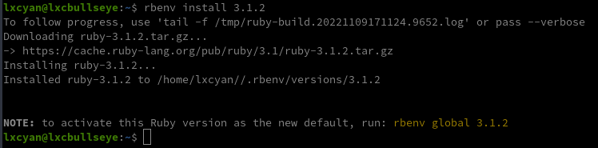
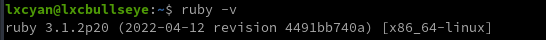
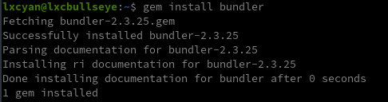

+++
title = 'Installation Ruby (via rbenv) + Jekyll (générateur de site statique) sur Debian'
date = 2022-11-09 00:00:00 +0100
categories = debian jekyll
+++
## Ruby


### Installer Rbenv

Rbenv est un outil léger de gestion des versions de Ruby qui vous permet de changer facilement de version de Ruby.

Par défaut, Rbenv ne gère pas l'installation des versions de Ruby. ruby-build est un outil qui vous aide à installer n'importe quelle version de Ruby dont vous pourriez avoir besoin. Il est disponible en tant que programme autonome et en tant que plugin pour rbenv.

**scripts d'installation rbenv-installer et rbenv-doctor**

Le script d'installation est destiné à une utilisation occasionnelle sur votre propre machine de développement. Pour automatiser l'installation sur plusieurs machines, il est préférable d'éviter d'utiliser ce script et de régler manuellement l'installation de rbenv et ruby-build. Certains environnements - comme les images de conteneurs destinées au développement ou à la production de Ruby - ne devraient pas du tout basculer entre plusieurs versions de Ruby, donc si vous y installez rbenv, vous faites probablement quelque chose de mal.
{: .prompt-warning }

Le script **rbenv-installer** installe ou met à jour **rbenv** sur votre système, rbenv est installé sous `~/.rbenv` 

De plus, ruby-build est également installé si rbenv install n'est pas déjà disponible.

```shell
# with curl
curl -fsSL https://github.com/rbenv/rbenv-installer/raw/HEAD/bin/rbenv-installer | bash

# alternatively, with wget
wget -q https://github.com/rbenv/rbenv-installer/raw/HEAD/bin/rbenv-installer -O- | bash
```

A la fin de l'exécution 

```
All done!
Note that this installer does NOT edit your shell configuration files:
1. Run `~/.rbenv/bin/rbenv init' to view instructions on how to configure rbenv for your shell.
2. Launch a new terminal window after editing shell configuration files.
3. (Optional) Run the doctor command to verify the installation:
   wget -q "https://github.com/rbenv/rbenv-installer/raw/HEAD/bin/rbenv-doctor" -O- | bash
```

Exécutez `~/.rbenv/bin/rbenv init' pour voir les instructions sur la façon de configurer rbenv pour votre shell.

    ~/.rbenv/bin/rbenv init

```shell
# Please add the following line to your `~/.bashrc' file,
# then restart your terminal.

eval "$(/home/lxcyan/.rbenv/bin/rbenv init - bash)"
```

Ajout au .bashrc

```shell
echo 'eval "$(/home/lxcyan/.rbenv/bin/rbenv init - bash)"' >> ~/.bashrc
source ~/.bashrc
```

**rbenv-doctor**  

Vous pouvez vérifier l'état de votre installation rbenv avec :

```shell
# avec curl
curl -fsSL https://github.com/rbenv/rbenv-installer/raw/HEAD/bin/rbenv-doctor | bash

# alternativement, avec wget
wget -q https://github.com/rbenv/rbenv-installer/raw/HEAD/bin/rbenv-doctor -O- | bash
```

Résultat de la vérification

```
Checking for `rbenv' in PATH: /home/lxcyan/.rbenv/bin/rbenv
Checking for rbenv shims in PATH: OK
Checking `rbenv install' support: /home/lxcyan//.rbenv/plugins/ruby-build/bin/rbenv-install (ruby-build 20221101-3-g971043c)
Counting installed Ruby versions: none
  There aren't any Ruby versions installed under `/home/lxcyan//.rbenv/versions'.
  You can install Ruby versions like so: rbenv install 3.1.2
Auditing installed plugins: OK
```

lister les dernières versions stables :

    rbenv install -l

```
2.7.6
3.0.4
3.1.2
jruby-9.3.9.0
mruby-3.1.0
picoruby-3.0.0
rbx-5.0
truffleruby-22.3.0
truffleruby+graalvm-22.3.0

Only latest stable releases for each Ruby implementation are shown.
Use 'rbenv install --list-all / -L' to show all local versions.
```

liste de toutes les versions locales :

    rbenv install -L

### Installer ruby

Maintenant que rbenv est installé sur notre système, nous pouvons facilement installer la dernière version stable de Ruby et la définir comme version par défaut 

```shell
rbenv install 3.1.2  # patienter quelques minute ...
```

Le résultat de l'installation ruby 3.1.2  


Alternativement à la commande `rbenv install`, vous pouvez télécharger et compiler Ruby manuellement dans un sous-répertoire de `~/.rbenv/versions`. Une entrée dans ce répertoire peut également être un lien symbolique vers une version de Ruby installée ailleurs sur le système de fichiers.
{: .prompt-info }

Définir une version de Ruby pour terminer l'installation et commencer à utiliser Ruby 

```shell
rbenv global 3.1.2 # définit la version par défaut de Ruby pour cette machine
# ou
rbenv local 3.1.2 # définit la version de Ruby pour ce répertoire
```

On choisit **global**

Vérifiez que Ruby a été correctement installé en affichant le numéro de version 

    ruby -v



### Désinstaller une version ruby

Désinstallation de ruby 

    rbenv uninstall 2.7.1

## Jekyll


### Installer jekyll

* [How To Install Jekyll on Ubuntu 18.04 / Debian 10 Linux](https://computingforgeeks.com/how-to-install-jekyll-on-ubuntu-18-04/)

On va utiliser gem pour installer Bundler qui est un outil utilisé pour gérer les dépendances de Gem et Jekyll 

    gem install bundler




Installer jekyll

```shell
gem install jekyll  # Patienter quelques minutes
```

Version jekyll installée

    jekyll -v


