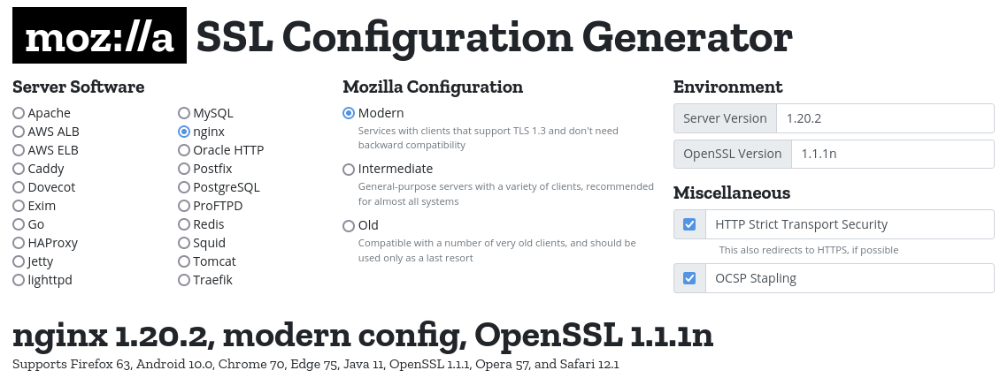
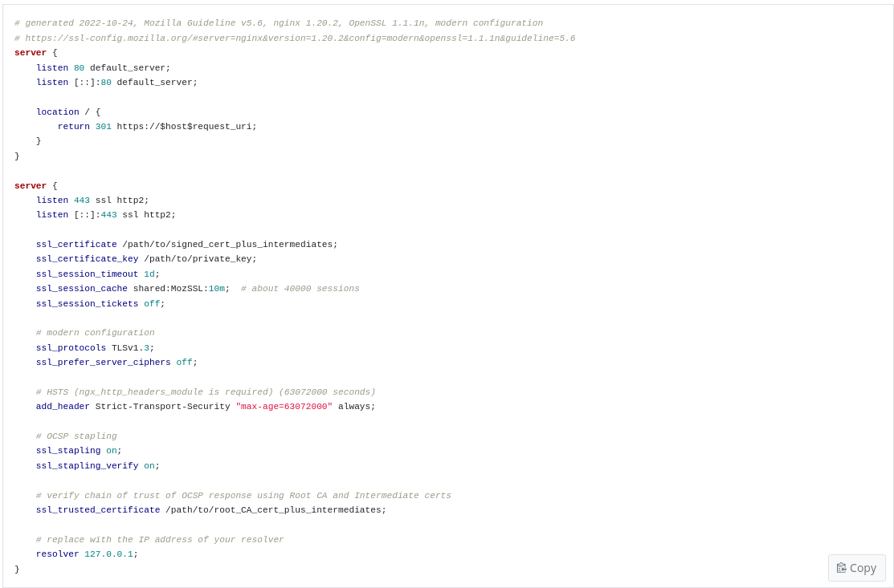
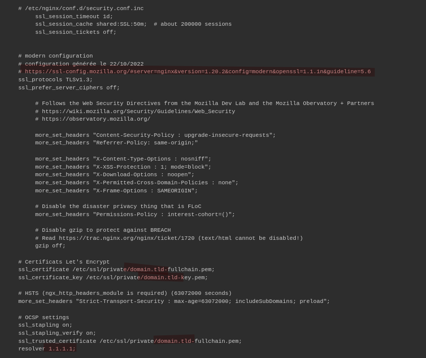

+++
title = 'Nginx headers,SSL,HSTS,OCSP'
date = 2022-11-09 00:00:00 +0100
categories = nginx
+++
*Créer un fichier de regroupement pour tous les paramètres*

## Prérequis

* Nginx compilé avec le module **headers-more-nginx-module**  
* Versions nginx et OpenSSL pour générer la configuration "modern", "intermediate" ou "old"  
* La configuration choisie est de type "modern" , uniquement TLS 1.3  


## SSL configuration 

Lien du générateur de configuration [SSL Configuration Generator](https://ssl-config.mozilla.org/)  
Exemple de configuration "modern" pour nginx version 1.20.2 et OpenSSL version 1.14.1.n  
  
  

## Configuration nginx

* Les certificats SSL valides sont dans le dossier `/etc/ssl/private/` et sont nommés  **domain.tld-fullchain.pem** pour le certificat et **domain.tld-key.pem** pour la clé      
* Le résolveur par défaut : 1.1.1.1   
* Remplacer **domain.tld** par le nom de votre domaine   


Fichier `/etc/nginx/conf.d/security.conf.inc` pour une **configuration moderne**  

```
   # /etc/nginx/conf.d/security.conf.inc
	ssl_session_timeout 1d;
	ssl_session_cache shared:SSL:50m;  # about 200000 sessions
	ssl_session_tickets off;
	
	
   # modern configuration
   # configuration générée le 22/10/2022
   # https://ssl-config.mozilla.org/#server=nginx&version=1.20.2&config=modern&openssl=1.1.1n&guideline=5.6
   ssl_protocols TLSv1.3;
   ssl_prefer_server_ciphers off;
	
   # Pre-defined FFDHE group (RFC 7919)
   # From https://ssl-config.mozilla.org/ffdhe2048.txt
   # https://security.stackexchange.com/a/149818
   ssl_dhparam /etc/ssl/private/ffdhe2048.pem;

	# Follows the Web Security Directives from the Mozilla Dev Lab and the Mozilla Obervatory + Partners
	# https://wiki.mozilla.org/Security/Guidelines/Web_Security
	# https://observatory.mozilla.org/
	
	more_set_headers "Content-Security-Policy : upgrade-insecure-requests";
	more_set_headers "Referrer-Policy: same-origin;"

	more_set_headers "X-Content-Type-Options : nosniff";
	more_set_headers "X-XSS-Protection : 1; mode=block";
	more_set_headers "X-Download-Options : noopen";
	more_set_headers "X-Permitted-Cross-Domain-Policies : none";
	more_set_headers "X-Frame-Options : SAMEORIGIN";
	
	# Disable the disaster privacy thing that is FLoC
	more_set_headers "Permissions-Policy : interest-cohort=()";
	
	# Disable gzip to protect against BREACH
	# Read https://trac.nginx.org/nginx/ticket/1720 (text/html cannot be disabled!)
	gzip off;

   # Certificats Let's Encrypt 
   ssl_certificate /etc/ssl/private/domain.tld-fullchain.pem;
   ssl_certificate_key /etc/ssl/private/domain.tld-key.pem;
   
   # HSTS (ngx_http_headers_module is required) (63072000 seconds)
   more_set_headers "Strict-Transport-Security : max-age=63072000; includeSubDomains; preload";

   # OCSP settings
   ssl_stapling on;
   ssl_stapling_verify on;
   ssl_trusted_certificate /etc/ssl/private/domain.tld-fullchain.pem;
   resolver 1.1.1.1;
```

Fichier `/etc/nginx/conf.d/security.conf.inc` pour une **configuration intermédiaire**  

```
   # /etc/nginx/conf.d/security.conf.inc
	ssl_session_timeout 1d;
	ssl_session_cache shared:SSL:50m;  # about 200000 sessions
	ssl_session_tickets off;
	
	
    # intermediate configuration
    # https://ssl-config.mozilla.org/#server=nginx&version=1.20.2&config=intermediate&openssl=1.1.1n&guideline=5.6
    ssl_protocols TLSv1.2 TLSv1.3;
    ssl_ciphers ECDHE-ECDSA-AES128-GCM-SHA256:ECDHE-RSA-AES128-GCM-SHA256:ECDHE-ECDSA-AES256-GCM-SHA384:ECDHE-RSA-AES256-GCM-SHA384:ECDHE-ECDSA-CHACHA20-POLY1305:ECDHE-RSA-CHACHA20-POLY1305:DHE-RSA-AES128-GCM-SHA256:DHE-RSA-AES256-GCM-SHA384;
    ssl_prefer_server_ciphers off;

   # Pre-defined FFDHE group (RFC 7919)
   # From https://ssl-config.mozilla.org/ffdhe2048.txt
   # https://security.stackexchange.com/a/149818
   ssl_dhparam /etc/ssl/private/ffdhe2048.pem;
	
	# Follows the Web Security Directives from the Mozilla Dev Lab and the Mozilla Obervatory + Partners
	# https://wiki.mozilla.org/Security/Guidelines/Web_Security
	# https://observatory.mozilla.org/
	
	more_set_headers "Content-Security-Policy : upgrade-insecure-requests";
	more_set_headers "Referrer-Policy: same-origin;"

	more_set_headers "X-Content-Type-Options : nosniff";
	more_set_headers "X-XSS-Protection : 1; mode=block";
	more_set_headers "X-Download-Options : noopen";
	more_set_headers "X-Permitted-Cross-Domain-Policies : none";
	more_set_headers "X-Frame-Options : SAMEORIGIN";
	
	# Disable the disaster privacy thing that is FLoC
	more_set_headers "Permissions-Policy : interest-cohort=()";
	
	# Disable gzip to protect against BREACH
	# Read https://trac.nginx.org/nginx/ticket/1720 (text/html cannot be disabled!)
	gzip off;

   # Certificats Let's Encrypt 
   ssl_certificate /etc/ssl/private/domain.tld-fullchain.pem;
   ssl_certificate_key /etc/ssl/private/domain.tld-key.pem;
   
   # HSTS (ngx_http_headers_module is required) (63072000 seconds)
   more_set_headers "Strict-Transport-Security : max-age=63072000; includeSubDomains; preload";

   # OCSP settings
   ssl_stapling on;
   ssl_stapling_verify on;
   ssl_trusted_certificate /etc/ssl/private/domain.tld-fullchain.pem;
   resolver 1.1.1.1;
```

Au lieu d'utiliser des groupes DH préconfigurés, ou de générer les leurs avec "openssl dhparam", les opérateurs devraient utiliser les groupes DH prédéfinis ffdhe2048, ffdhe3072 ou ffdhe4096 recommandés par l'IETF dans le [RFC 7919](https://www.rfc-editor.org/rfc/rfc7919). Ces groupes sont audités et peuvent être plus résistants aux attaques que ceux générés aléatoirement.
{: .prompt-info }

Le DH préconfiguré `/etc/ssl/private/ffdhe2048.pem`

```
-----BEGIN DH PARAMETERS-----
MIIBCAKCAQEA//////////+t+FRYortKmq/cViAnPTzx2LnFg84tNpWp4TZBFGQz
+8yTnc4kmz75fS/jY2MMddj2gbICrsRhetPfHtXV/WVhJDP1H18GbtCFY2VVPe0a
87VXE15/V8k1mE8McODmi3fipona8+/och3xWKE2rec1MKzKT0g6eXq8CrGCsyT7
YdEIqUuyyOP7uWrat2DX9GgdT0Kj3jlN9K5W7edjcrsZCwenyO4KbXCeAvzhzffi
7MA0BM0oNC9hkXL+nOmFg/+OTxIy7vKBg8P+OxtMb61zO7X8vC7CIAXFjvGDfRaD
ssbzSibBsu/6iGtCOGEoXJf//////////wIBAg==
-----END DH PARAMETERS-----
```

Dans tous les Vhosts, il faut ajouter l'inclusion du fichier : `include /etc/nginx/conf.d/security.conf.inc;`

## Exemples Vhost

Exemples

domain.tld

```
server {
    listen 80;
    listen [::]:80;
    server_name domain.tld;
    return 301 https://$host$request_uri;
}
# /etc/nginx/conf.d/domain.tld.conf


server {
    listen 443 ssl http2;
    listen [::]:443 ssl http2;
    server_name domain.tld;

    root /var/www/default-www;
    index index.html;

    include /etc/nginx/conf.d/security.conf.inc;

    #include /etc/nginx/conf.d/domain.tld.d/*.conf;

    access_log /var/log/nginx/domain.tld-access.log;
    error_log /var/log/nginx/domain.tld-error.log;
}
```

Remplacer **domain.tld** par votre domaine

## Liens

* [HTTP Headers That Protect Your Users](https://www.validbot.com/info/security-headers.php)