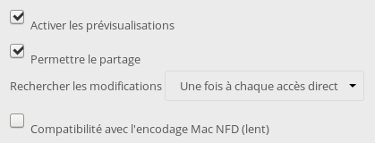

+++
title = 'Debian Transmission Torrent'
date = 2022-11-15 00:00:00 +0100
categories = application
+++
  

## Debian transmission-daemon

* [Installing Transmission Torrent Client on Debian](https://tweenpath.net/installing-transmission-torrent-client-debian/)
* [Transmission est le client BitTorrent installé par défaut sur Ubuntu](https://doc.ubuntu-fr.org/transmission)
* [Debian 10 64 Bits – Installation Transmission](https://memos.nadus.fr/debian-10-64-bits-installation-transmission/)

### Introduction

*Le Serveur Debian télécharge et partage des torrents avec une haute disponibilité (haut débit et capacité de stockage), le tout fonctionnant grâce à un daemon (service en arrière plan qui peut démarrer en même temps que le système) comme transmission-daemon et qui aura pour charge de télécharger et partager des fichiers torrent managés par une interface web.*

### Installation

```shell
sudo apt install transmission-cli transmission-common transmission-daemon
```

On arrête le daemon pour pouvoir modifier le fichier de configuration :


```shell
sudo systemctl stop transmission-daemon
```

### Configuration des utilisateurs et des autorisations

Il est recommandé de faire fonctionner Transmission sous son propre nom d'utilisateur pour des raisons de sécurité. Cela crée quelques problèmes d'accès aux fichiers et aux dossiers par Transmission ainsi que par votre compte 

Ajout de l'utilisateur au groupe transmission-daemon:

```shell
sudo usermod -a -G debian-transmission $USER
```

Avec la commande suivante, assurez-vous d'abord que l'utilisateur courant désigné par la variable $USER est bien le votre et non root ou tout autre, avant de créer le répertoire de téléchargement : 

    echo $USER

Si vous ne passez pas par `sudo` , remplaçer **/home/$USER** des lignes suivantes par **$HOME** !.
{: .prompt-warning }

Création du répertoire de téléchargement des fichiers torrent :

    mkdir $HOME/torrent

Afficher l'utilisateur (`echo $USER`) et éditer le fichier de configuration :

    sudo nano /etc/transmission-daemon/settings.json

```
"download-dir": "/home/cxbuser/torrent",
"rpc-host-whitelist-enabled": false,
"rpc-password": "password",
"rps-username": "username"
"rpc-whitelist-enabled": false,
"rpc-url": "/",  // /transmission par défaut
```

Gestion de la bande passante  (facultatif), laisser le serveur fonctionner de façon optimale

```
"alt-speed-down": 5000,            // 5 Mo/s max en download (en ko/s) - 50 (par défaut)
"alt-speed-enabled": true,         // Limite activée - false (par défaut)
"alt-speed-time-begin": 420,       // Bridage a partir de 7h (En nb de minute) - 540 (par défaut)
```

Activation planification (facultatif)

```
"alt-speed-time-day": 127,         // bridage tous les jours (voir doc.)
"alt-speed-time-enabled": true,    // On active la planification
"alt-speed-time-end": 1380,        // Heure de fin, 1380 min  = 23h
"alt-speed-up": 5000              // 5 Mo/s max en upload (en ko/s)
```

Gestion du ratio (facultatif), donner une limite de ratio, 6,ne pas oublier d’activer ce paramètre

```
"ratio-limit": 6,
"ratio-limit-enabled": true,
```

Si vous avez modifié l'utilisateur par défaut, lr fichier de paramétrage est 
`$HOME/.config/transmission-daemon/settings.json`  
{: .prompt-warning }


On redémarre le daemon transmission :

    sudo systemctl start transmission-daemon.service

`Parefeu (firewall) : Ouvrir le port 9091 en tcp`{: .prompt-warning }

Il ne vous reste qu'à vous rendre sur le serveur, ip ou nom de domaine, : port. Exemple :
XX.XXX.XXX.XXX:9091 ou nomdedomaine.fr:9091

**Modifier les permissions sur le répertoire de téléchargement**

Si vous avez transmission sur un serveur, vous pourriez vouloir modifier les fichiers téléchargés des stations locales. Un bon choix consiste à rendre le répertoire de téléchargement modifiable par un groupe d'utilisateurs de vos stations.

Changez l'umask dans **settings.json** pour `umask = 0` ou même `umask=7` (explication décimale, le langage de balisage json n'accepte que les nombres en base 10).   
Enfin, changez l'umask du démon de transmission en ajoutant `UMask=007` dans `/etc/systemd/system/multi-user.target.wants/transmission-daemon.service`

modifier les autorisations du répertoire de téléchargement et probablement changer le groupe d'utilisateurs par défaut du démon de transmission. 

ON recharge et on lance

    sudo systemctl daemon-reload
    sudo systemctl start transmission-daemon

## Erreurs

### Bad gatexay

**Bad gateway sur le navigateur**

    systemctl status transmission-daemon.service

```
root@vps70253415:/home/usernl# 
● transmission-daemon.service - Transmission BitTorrent Daemon
   Loaded: loaded (/lib/systemd/system/transmission-daemon.service; enabled; vendor preset: enabled)
   Active: failed (Result: signal) since Sat 2020-11-07 12:22:19 CET; 1 day 19h ago
  Process: 17699 ExecStart=/usr/bin/transmission-daemon -f --log-error (code=killed, signal=SEGV)
 Main PID: 17699 (code=killed, signal=SEGV)
   Status: "Idle."

Warning: Journal has been rotated since unit was started. Log output is incomplete or unavailable.
```

Le journal

    /usr/bin/transmission-daemon -f --log-error

```
[2020-11-09 07:55:27.304] UDP Failed to set receive buffer: requested 4194304, got 425984 (tr-udp.c:84)
[2020-11-09 07:55:27.304] UDP Failed to set send buffer: requested 1048576, got 425984 (tr-udp.c:95)
[2020-11-09 07:55:27.304] UDP Failed to set receive buffer: requested 4194304, got 425984 (tr-udp.c:84)
[2020-11-09 07:55:27.304] UDP Failed to set send buffer: requested 1048576, got 425984 (tr-udp.c:95)
```

*Ce message essaie de nous dire que, pour une raison quelconque, Transmission aimerait avoir 4 mégaoctets de tampon de réception et 1 mégaoctet de tampon d'envoi pour sa socket UDP. Il s'avère que le support de l'uTP, le protocole de transport uTorrent, est implémenté en utilisant une seule socket.  
En réglant les deux variables, il est possible d'obtenir plus facilement un débit plus élevé en utilisant l'uTP.  
Comme nous utilisons une seule socket UDP pour mettre en œuvre plusieurs sockets UTP, et comme nous ne sommes pas toujours en mesure de traiter un paquet UDP entrant en temps voulu, il est important d'utiliser un tampon de réception important. Le tampon d'envoi est probablement moins critique, nous l'augmentons néanmoins.*

Modifier le fichier `/etc/sysctl.conf`  
Nous avons fixé 16 Mio pour le tampon de réception et 4 Mio pour le tampon d'envoi)

    net.core.rmem_max = 16777216
    net.core.wmem_max = 4194304

Si vous avez décidé d'ajouter ces lignes ci-dessus, vous pouvez relire la configuration avec :

    sudo sysctl -p

Il n'est pas nécessaire de redémarrer le système pour qu'il prenne effet.

On redémarre le daemon transmission : `systemctl restart transmission-daemon.service` 

## Yunohost

A-Installation yunohost transmission en ligne de commande (mode su)

    yunohost app install transmission

```
Choose a domain for Transmission (default: yanfi.net) : 
Choose a path for Transmission (default: /torrent) : 
Succès ! La configuration de SSOwat a été générée
Succès ! Installation terminée
```

Dossiers

    ls -la /home/yunohost.transmission/

```
drwxrwxr-x+  5 debian-transmission www-data            4096 août   2 11:49 .
drwxr-xr-x  19 root                root                4096 août   2 11:49 ..
drwxrwxr-x+  2 debian-transmission www-data            4096 août   2 11:49 completed
drwxrwxr-x+  2 debian-transmission debian-transmission 4096 août   2 11:49 progress
drwxrwxr-x+  2 debian-transmission debian-transmission 4096 août   2 11:49 watched
```

B-Configurer les utilisateurs et les permissions

*Il est recommandé que Transmission fonctionne sous son propre nom d'utilisateur pour des raisons de sécurité.Cela crée quelques problèmes avec l'accès aux fichiers et dossiers par transmission ainsi qu'avec votre compte utilisateur).*  
Deux possibilités , l'une avec l' <u>utilisateur</u> et l'autre en créant un <u>groupe</u> sur lequel on ajoute des utilisateurs

<u>utilisateur</u>  
Modifier le groupe du dossier **completed** (remplacer *www-data* par *debian-transmission*)

    sudo chown debian-transmission.debian-transmission -R /home/yunohost.transmission/completed

Ajoutez le nom d'utilisateur au groupe debian-transmission :

    sudo usermod -a -G debian-transmission user

>NOTE : Changez "user" à votre propre nom d'utilisateur.

*REMARQUE : Lors de l'ajout d'un utilisateur à un nouveau groupe, l'utilisateur doit se déconnecter et se reconnecter pour qu'il prenne effet. Un redémarrage permettra également d'atteindre cet objectif.*

<u>groupe</u>  
Création d'un groupe 

    groupadd transmission-completed

Ajout des utilisateurs au groupe

```
usermod -a -G transmission-completed nextcloud
usermod -a -G transmission-completed www-data
usermod -a -G transmission-completed debian-transmission
```

Modification groupe du dossier **completed** (remplacer *www-data* par *transmission-completed*)

    chown -R debian-transmission:transmission-completed /home/yunohost.transmission/completed/

C-Nextcloud stockage externe

On ajoute le partage <u>local</u> dans **nextcloud** via les *stockages externes*  
Nom du dossier : Transmission  
Stockage externe : local  
Configuration : /home/yunohost.transmission/completed  
Paramètres  


