+++
title = 'Contabo Debian 11 (Bullseye) xoyize.xyz'
date = 2022-11-16 00:00:00 +0100
categories = ['vps']
+++
  
<https://contabo.com/en/>

Fournisseur : **Contabo**  
Accès client : <https://my.contabo.com/>  
Nom du plan : **VPS S SSD**  
Location Nuremberg (EU)  
RAM garantie : **8192 Mb**  
Bande passante mensuelle illimitée  
**Espace disque SSD 200 Go**  
Système d'exploitation : **Debian 11**  
Technologie de virtualisation **KVM**  
Emplacement du serveur Allemagne   
Frais d'installation 0.00 EUR  
Coût annuel 86.28€/An TTC  
Méthodes de paiement  PayPal  

IP address **109.123.254.249**  
Accès client : <https://my.contabo.com/>   

Autorisation à deux facteurs : <https://my.contabo.com/>  &rarr; Customer details et **Activate 2-factor authentication**  
Activer le reverse DNS IPV4 et IPV6 pour le domaine xoyize.xyz : Control panel → Reverse DNS management  
Désactiver VNC: Your services &rarr; Manage &rarr; VPS Control &rarr; Manage &rarr; Disable VNC et valider par un clic sur Disable


Sous-réseau IPv6   
*Chaque serveur dédié et chaque VPS est livré avec un sous-réseau IPv6 /64 en plus de son adresse IPv4. Vous pouvez utiliser les adresses de ce sous-réseau librement sur le serveur/VPS associé. IPv6 est déjà préconfiguré sur nos serveurs mais doit être activé explicitement dans certains cas. Vous trouverez comment activer IPv6 et d'autres informations sur le sujet dans notre tutoriel.*

| type d'abonnement |adresse IPv4 | sous-réseau IPv6  |
| :------------- |:-------------| :-----|
| VPS S SSD (no setup) | 109.123.254.249 | 2a02:c206:2108:3749::1 / 64 |


## Debian bullseye

{:height="60"}  

PARAMETRES D'ACCES:  
L'adresse IPv4 du VPS est : 109.123.254.249  
L'adresse IPv6 du VPS est : 2a02:c206:2108:3749::1  

On se connecte en root sur le VPS

    ssh root@109.123.254.249

```
Linux vmi1083749.contaboserver.net 5.10.0-12-amd64 #1 SMP Debian 5.10.103-1 (2022-03-07) x86_64
  _____
 / ___/___  _  _ _____ _   ___  ___
| |   / _ \| \| |_   _/ \ | _ )/ _ \
| |__| (_) | .` | | |/ _ \| _ \ (_) |
 \____\___/|_|\_| |_/_/ \_|___/\___/

Welcome!

This server is hosted by Contabo. If you have any questions or need help,
please don't hesitate to contact us at support@contabo.com.

root@vmi1083749:~# 
```

### Mise à jour + Réseau IPV6

**Mise à jour**, exécuter `apt update && apt upgrade`  
**Quelques outils**, exécuter `apt install tree tmux`  
**Activation ipv6**, exécuter `enable_ipv6` puis redémarrer `reboot` et se reconnecter ssh  

Vérifier l'adressage : `ip a`

```
1: lo: <LOOPBACK,UP,LOWER_UP> mtu 65536 qdisc noqueue state UNKNOWN group default qlen 1000
    link/loopback 00:00:00:00:00:00 brd 00:00:00:00:00:00
    inet 127.0.0.1/8 scope host lo
       valid_lft forever preferred_lft forever
    inet6 ::1/128 scope host 
       valid_lft forever preferred_lft forever
2: eth0: <BROADCAST,MULTICAST,UP,LOWER_UP> mtu 1500 qdisc pfifo_fast state UP group default qlen 1000
    link/ether 00:50:56:48:b5:5b brd ff:ff:ff:ff:ff:ff
    altname enp0s18
    altname ens18
    inet 109.123.254.249/20 brd 109.123.255.255 scope global eth0
       valid_lft forever preferred_lft forever
    inet6 2a02:c206:2108:3749::1/64 scope global 
       valid_lft forever preferred_lft forever
    inet6 fe80::250:56ff:fe48:b55b/64 scope link 
       valid_lft forever preferred_lft forever
```

### Date et heure + Synchro

{:height="40"}  
Activer le fuseau Europe/Paris

    timedatectl set-timezone Europe/Paris

Horloge système synchronisée

    timedatectl

```
               Local time: Mon 2022-11-14 17:15:19 CET
           Universal time: Mon 2022-11-14 16:15:19 UTC
                 RTC time: Mon 2022-11-14 16:15:20
                Time zone: Europe/Paris (CET, +0100)
System clock synchronized: yes
              NTP service: active
          RTC in local TZ: no
```

### Reconfigurer locales

Activer uniquement **en_US.UTF-8** et **fr_FR.UTF-8**

    dpkg-reconfigure locales

```
Generating locales (this might take a while)...
  en_US.UTF-8... done
  fr_FR.UTF-8... done
Generation complete.
```


### dnsmasq

  
[DNSmasq (installation et configuration)](/posts/DNSmasq/)

Installer dnsmasq

    apt install dnsmasq

Le paramétrage réseau par défaut `/etc/network/interfaces`  
Il faut commenter les lignes `dns-` pour utiliser dnsmasq

```
# The loopback network interface
auto lo
iface lo inet loopback

# The primary network interface
auto eth0
iface eth0 inet static
    address 109.123.254.249
    netmask 255.255.240.0
    gateway 109.123.240.1
    #dns-search invalid
    #dns-nameservers 161.97.189.52 161.97.189.51
    up ip route replace 109.123.240.0/20 via 109.123.240.1 dev eth0


iface eth0 inet6 static
    address 2a02:c206:2108:3749:0000:0000:0000:0001
    netmask 64
    gateway fe80::1
    accept_ra 0
    autoconf 0
    privext 0
```


Configuration de dnsmasq en éditant le fichier `/etc/resolv.conf`   

```
search contaboserver.net
nameserver 161.97.189.51
nameserver 161.97.189.52
```

Vous devez faire en sorte que toutes les requêtes soient envoyées à dnsmasq en ajoutant les adresses localhost comme seuls serveurs de noms dans le fichier `/etc/resolv.conf` 

```
nameserver 127.0.0.1
```

Faire une sauvegarde du fichier `mv /etc/dnsmasq.conf  /etc/dnsmasq.conf.default`  
Créer le fichier `/etc/dnsmasq.conf` et effectuer les réglages de configuration 

```shell
domain-needed
expand-hosts
localise-queries

interface=lo

resolv-file=/etc/resolv.dnsmasq.conf
```

Explications

* **domain-needed** : Ne transmet pas les requêtes ne contenant pas un nom de domaine complet. Par exemple,une requête pour machine ne sera pas transmise aux serveurs DNS de votre FAI, alors qu’une requête pour machine.domain.com le sera. 
* Si vous souhaitez qu'un domaine soit automatiquement ajouté aux noms simples dans un fichier hosts, décommentez l'option **expand-hosts** 
* **localise-queries** : Retourne des réponses aux requêtes DNS dépendantes de l’interface sur laquelle la requête a été reçue, à partir du fichier /etc/hosts. Si un nom dans /etc/hosts a plus d’une adresse associée avec lui, et qu’une des adresses au moins est dans le même sous-réseau que l’interface sur laquelle la requête a été reçue, alors ne retourne que la(les) adresse(s) du sous-réseau considéré. Cela permet d’avoir dans /etc/hosts un serveur avec de multiples adresses, une pour chacune de ses interfaces, et de fournir aux hôtes l’adresse correcte (basée sur le réseau auquel ils sont attachés). Cette possibilité est actuellement limitée à IPv4. 

Pour lutter contre la censure sur Internet, [FDN](https://www.fdn.fr/actions/dns/) fait le choix de mettre à disposition de toutes et tous des résolveurs DNS récursifs ouverts.  
Le fichier des dns `/etc/resolv.dnsmasq.conf`

```
nameserver 80.67.169.12
nameserver 2001:910:800::12
nameserver 80.67.169.40
nameserver 2001:910:800::40
```

Redémarrer dnsmasq

    systemctl restart dnsmasq

Vérifications, installer dnsutils au préalable (`apt install dnsutils`)

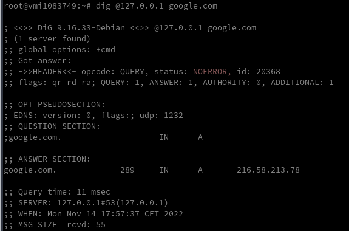

### Création utilisateur

{:height="50"}  
Utilisateur **ctbouser**  

    useradd -m -d /home/ctbouser/ -s /bin/bash ctbouser

Mot de passe **ctbouser**  

    passwd ctbouser

Visudo pour les accès root via utilisateur **ctbouser**, installer sudo : `apt install sudo`  

```bash
echo "ctbouser     ALL=(ALL) NOPASSWD: ALL" >> /etc/sudoers
```

Déconnexion puis connexion ssh en mode utilisateur  

    ssh ctbouser@109.123.254.249

### OpenSSH, clé et script

{:height="50"}  
**connexion avec clé**  
<u>sur l'ordinateur de bureau</u>
Générer une paire de clé curve25519-sha256 (ECDH avec Curve25519 et SHA2) pour une liaison SSH avec le serveur.  

    ssh-keygen -t ed25519 -o -a 100 -f ~/.ssh/contabovps

Envoyer les clés publiques sur le serveur KVM   

    ssh-copy-id -i ~/.ssh/contabovps.pub ctbouser@109.123.254.249

<u>sur le serveur KVM</u>
On se connecte  

    ssh ctbouser@109.123.254.249

Modifier la configuration serveur SSH  

    sudo nano /etc/ssh/sshd_config

Modifier

```conf
Port = 55249
PermitRootLogin no          # en fin de fichier
PasswordAuthentication no
```


Relancer openSSH  

    sudo systemctl restart sshd

Accès depuis le poste distant avec la clé privée  

    ssh ctbouser@109.123.254.249 -p 55249 -i ~/.ssh/contabovps  

### Outils, scripts motd et ssh_rc_bash

{:height="50"}  
Installer utilitaires  

    sudo apt install rsync curl tmux jq figlet git tree


Motd

    sudo rm /etc/motd && sudo nano /etc/motd

```
            ___            _          _                            
           / __| ___  _ _ | |_  __ _ | |__  ___                    
          | (__ / _ \| ' \|  _|/ _` || '_ \/ _ \                   
           \___|\___/|_||_|\__|\__,_||_.__/\___/                   
  _   __   ___    _  ___  ____    ___  ___  _ _     ___  _ _   ___ 
 / | /  \ / _ \  / ||_  )|__ /   |_  )| __|| | |   |_  )| | | / _ \
 | || () |\_, /_ | | / /  |_ \ _  / / |__ \|_  _|_  / / |_  _|\_, /
 |_| \__/  /_/(_)|_|/___||___/(_)/___||___/  |_|(_)/___|  |_|  /_/ 
                                                                   
```


Script **ssh_rc_bash**  
>**ATTENTION!!! Les scripts sur connexion peuvent poser des problèmes pour des appels externes autres que ssh**

```shell
wget https://static.xoyaz.xyz/files/ssh_rc_bash
chmod +x ssh_rc_bash # rendre le bash exécutable
./ssh_rc_bash        # exécution
```

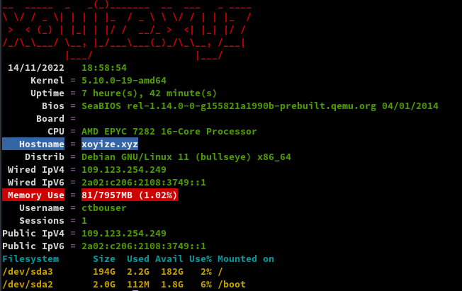

### Historique de la ligne de commande

Ajoutez la recherche d’historique de la ligne de commande au terminal  
Se connecter en utilisateur debian  
Tapez un début de commande précédent, puis utilisez shift + up (flèche haut) pour rechercher l’historique filtré avec le début de la commande.

```bash
# Global, tout utilisateur
echo '"\e[1;2A": history-search-backward' | sudo tee -a /etc/inputrc
echo '"\e[1;2B": history-search-forward' | sudo tee -a /etc/inputrc
```

### Parefeu UFW

{:width="50"} 

*UFW, ou pare - feu simple , est une interface pour gérer les règles de pare-feu dans Arch Linux, Debian ou Ubuntu. UFW est utilisé via la ligne de commande (bien qu'il dispose d'interfaces graphiques disponibles), et vise à rendre la configuration du pare-feu facile.*

Installation **Debian / Ubuntu**

    sudo apt install ufw

*Par défaut, les jeux de règles d'UFW sont vides, de sorte qu'il n'applique aucune règle de pare-feu, même lorsque le démon est en cours d'exécution.*   

Les règles 

```shell
sudo ufw allow 55249/tcp  # port SSH
sudo ufw allow http       # port 80
sudo ufw allow https      # port 443
sudo ufw allow DNS        # port 53
```

Activer le parefeu

    sudo ufw enable

```
Command may disrupt existing ssh connections. Proceed with operation (y|n)? y
Firewall is active and enabled on system startup
```

Status

     sudo ufw status verbose

```
Status: active
Logging: on (low)
Default: deny (incoming), allow (outgoing), disabled (routed)
New profiles: skip

To                         Action      From
--                         ------      ----
55249/tcp                  ALLOW IN    Anywhere                  
80/tcp                     ALLOW IN    Anywhere                  
443                        ALLOW IN    Anywhere                  
53 (DNS)                   ALLOW IN    Anywhere                  
55249/tcp (v6)             ALLOW IN    Anywhere (v6)             
80/tcp (v6)                ALLOW IN    Anywhere (v6)             
443 (v6)                   ALLOW IN    Anywhere (v6)             
53 (DNS (v6))              ALLOW IN    Anywhere (v6)             
```

### Nginx compilé

{:height="50"}  

Utilisateur avec droits sudo  

Télécharger le bash

```shell
wget https://static.xoyaz.xyz/files/compilation-nginx-tls1.3.sh
chmod +x compilation-nginx-tls1.3.sh # rendre le bash exécutable
./compilation-nginx-tls1.3.sh        # exécution
```

A la fin de la compilation

```
Versions Nginx OpenSSL
nginx version: nginx/1.22.1
OpenSSL 1.1.1n  15 Mar 2022
```

### Domaine et certificats

Se connecter sur HMS pour configurer le reverse dns   
109.123.254.249 --> xoyize.xyz  
Demander par ticket la modification du reverse dns ipv6  
2a04:ecc0:8:a8:4567:4989:0:1 --> xoyize.xyz

Changer le hostname

    sudo hostnamectl set-hostname xoyize.xyz
    hostnamectl

```
   Static hostname: xoyize.xyz
         Icon name: computer-vm
           Chassis: vm
        Machine ID: 9e9b14b1d9ae21acbd3793ac63720d60
           Boot ID: 75f900123d6b48bab465343fddbf3999
    Virtualization: kvm
  Operating System: Debian GNU/Linux 11 (bullseye)
            Kernel: Linux 5.10.0-19-amd64
      Architecture: x86-64
```

#### OVH domaine xoyize.xyz

{:width="50"}  
{:width="50"} configuration domaine **xoyize.xyz**

```
$TTL 3600
@	IN SOA dns106.ovh.net. tech.ovh.net. (2022111412 86400 3600 3600000 300)
         IN NS     ns106.ovh.net.
         IN NS     dns106.ovh.net.
         IN MX     10 xoyize.xyz.
         IN A      109.123.254.249
         IN AAAA   2a02:c206:2108:3749::1
         IN CAA    128 issue "letsencrypt.org"
*        IN A      109.123.254.249
*        IN AAAA   2a02:c206:2108:3749::1
```

#### Certificats Let's Encrypt

{:height="50"}  
socat est prérequis

    sudo apt install socat

Installation gestionnaire des certificats Let's Encrypt

```
cd ~
git clone https://github.com/acmesh-official/acme.sh.git
cd acme.sh
./acme.sh --install 
```

Se reconnecter

Exporter les clés OVH API  

 
Génération des certificats  

    acme.sh --dns dns_ovh --server letsencrypt --issue --keylength ec-384 -d 'xoyize.xyz' -d '*.xoyize.xyz'
    
Ouvrir le  lien d'authentification et relancer la commande précédente après le message "OVH authentication Success !" et patienter...

Résultat de l'installation

```
[Mon 14 Nov 2022 08:18:58 PM CET] Your cert is in: /home/ctbouser//.acme.sh/xoyize.xyz_ecc/xoyize.xyz.cer
[Mon 14 Nov 2022 08:18:58 PM CET] Your cert key is in: /home/ctbouser//.acme.sh/xoyize.xyz_ecc/xoyize.xyz.key
[Mon 14 Nov 2022 08:18:58 PM CET] The intermediate CA cert is in: /home/ctbouser//.acme.sh/xoyize.xyz_ecc/ca.cer
[Mon 14 Nov 2022 08:18:58 PM CET] And the full chain certs is there: /home/ctbouser//.acme.sh/xoyize.xyz_ecc/fullchain.cer
```

Installation des certificats

```
sudo mkdir -p /etc/ssl/private/
sudo chown $USER -R /etc/ssl/private/
acme.sh --ecc --install-cert -d 'xoyize.xyz' -d '*.xoyize.xyz' --key-file /etc/ssl/private/xoyize.xyz-key.pem --fullchain-file /etc/ssl/private/xoyize.xyz-fullchain.pem  --reloadcmd 'sudo systemctl reload nginx.service'
```

Supprimer `--reloadcmd 'sudo systemctl reload nginx.service'` à la ligne précédente si Nginx n'est pas installé
{: .prompt-warning }

Editer le crontab

    crontab -e

```
13 0 * * * "/home/ctbouser/.acme.sh"/acme.sh --cron --home "/home/ctbouser/.acme.sh" --renew-hook "/home/ctbouser/.acme.sh/acme.sh --ecc --install-cert -d 'xoyize.xyz' -d '*.xoyize.xyz' --key-file /etc/ssl/private/xoyize.xyz-key.pem --fullchain-file /etc/ssl/private/xoyize.xyz-fullchain.pem  --reloadcmd 'sudo systemctl reload nginx.service'" > /dev/null
```

### Nginx security.conf.inc

{:height="50"}  
[Nginx headers,SSL,HSTS,OCSP](/posts/Nginx_headers_SSL_HSTS_OCSP/)

Créer un fichier pour un regroupement `/etc/nginx/conf.d/security.conf.inc` mode intermédiaire

```nginx
   # /etc/nginx/conf.d/security.conf.inc
	ssl_session_timeout 1d;
	ssl_session_cache shared:SSL:50m;  # about 200000 sessions
	ssl_session_tickets off;
	
	
	# intermediate configuration
        ssl_protocols TLSv1.2 TLSv1.3;
        ssl_ciphers ECDHE-ECDSA-AES128-GCM-SHA256:ECDHE-RSA-AES128-GCM-SHA256:ECDHE-ECDSA-AES256-GCM-SHA384:ECDHE-RSA-AES256-GCM-SHA384:ECDHE-ECDSA-CHACHA20-POLY1305:ECDHE-RSA-CHACHA20-POLY1305:DHE-RSA-AES128-GCM-SHA256:DHE-RSA-AES256-GCM-SHA384;
        ssl_prefer_server_ciphers off;
 	
        # Pre-defined FFDHE group (RFC 7919)
        # From https://ssl-config.mozilla.org/ffdhe2048.txt
        # https://security.stackexchange.com/a/149818
        ssl_dhparam /etc/ssl/private/ffdhe2048.pem;

	# Follows the Web Security Directives from the Mozilla Dev Lab and the Mozilla Obervatory + Partners
	# https://wiki.mozilla.org/Security/Guidelines/Web_Security
	# https://observatory.mozilla.org/
	
	more_set_headers "Content-Security-Policy : upgrade-insecure-requests";
	more_set_headers "Referrer-Policy: same-origin;"
	
	more_set_headers "X-Content-Type-Options : nosniff";
	more_set_headers "X-XSS-Protection : 1; mode=block";
	more_set_headers "X-Download-Options : noopen";
	more_set_headers "X-Permitted-Cross-Domain-Policies : none";
	more_set_headers "X-Frame-Options : SAMEORIGIN";
	
	# Disable the disaster privacy thing that is FLoC
	more_set_headers "Permissions-Policy : interest-cohort=()";
	
	# Disable gzip to protect against BREACH
	# Read https://trac.nginx.org/nginx/ticket/1720 (text/ cannot be disabled!)
	gzip off;

   # Certificats Let's Encrypt 
   ssl_certificate /etc/ssl/private/xoyize.xyz-fullchain.pem;
   ssl_certificate_key /etc/ssl/private/xoyize.xyz-key.pem;
   
   # HSTS (ngx_http_headers_module is required) (63072000 seconds)
   more_set_headers "Strict-Transport-Security : max-age=63072000; includeSubDomains; preload";

   # OCSP settings
   ssl_stapling on;
   ssl_stapling_verify on;
   ssl_trusted_certificate /etc/ssl/private/xoyize.xyz-fullchain.pem;
   resolver 1.1.1.1;
```

Créer le fichier Diffie-Hellmann `/etc/ssl/private/ffdhe2048.pem`

```
-----BEGIN DH PARAMETERS-----
MIIBCAKCAQEA//////////+t+FRYortKmq/cViAnPTzx2LnFg84tNpWp4TZBFGQz
+8yTnc4kmz75fS/jY2MMddj2gbICrsRhetPfHtXV/WVhJDP1H18GbtCFY2VVPe0a
87VXE15/V8k1mE8McODmi3fipona8+/och3xWKE2rec1MKzKT0g6eXq8CrGCsyT7
YdEIqUuyyOP7uWrat2DX9GgdT0Kj3jlN9K5W7edjcrsZCwenyO4KbXCeAvzhzffi
7MA0BM0oNC9hkXL+nOmFg/+OTxIy7vKBg8P+OxtMb61zO7X8vC7CIAXFjvGDfRaD
ssbzSibBsu/6iGtCOGEoXJf//////////wIBAg==
-----END DH PARAMETERS-----
```

Dans tous les Vhosts, il faut ajouter l'inclusion du fichier : `include /etc/nginx/conf.d/security.conf.inc;`


### Fail2ban

{:height="50"} [Installer et configurer Fail2ban + UFW sur Debian 11](/posts/Debian_11_Fail2ban_UFW/)

Version installée : **Fail2Ban v0.11.2**


### Notifications 

{:height="50"}  

`Pour certains fournisseurs de VPS, il faut demander l'ouverture du port 25`{: .prompt-warning }

Le serveur doit pouvoir expédier des messages de notification par messagerie   

1. Il faut ajouter le port TCP 25 au parefeu : `sudo ufw allow 25`  
2. Configurer DNS de votre fournisseur de domaine, ici OVH  
Ajouter enregistrement MX : **IN MX     10 xoyize.xyz.** (le point est obligatoire après fr)
2. Procédures d'installation et paramétrage &rarr; 
[Debian - Installer et configurer Postfix comme serveur SMTP d'envoi uniquement](/posts/Debian_Postfix_serveur_SMTP_envoi_uniquement/)

Test envoi message

    echo "Test envoi via postfix smtp" | mail -s "serveur contabo xoyize.xyz" desti@mail.fr

### Docker (NON ACTIF)

{:height="50"}  
[Docker + Docker Compose sur Debian, installation et utilisation](/posts/Docker-Debian-Buster/)

*    **Docker Engine** ou **Docker Daemon** correspondant au processus qui fait tourner Docker sur le système, en charge de la génération et l'exécution des containers
*    **Docker Registry** est un emplacement de stockage pour héberger les images de containers Docker (il peut être public ou privé)
*    **Docker Image** correspondant à un fichier qui contient la définition d'un container Docker (dépendances, configuration, etc.)
*    **Docker Client** correspondant à l'utilitaire en ligne de commande qui va permettre de gérer les containers (commande "docker")
*    **Docker Container** correspondant aux containers en eux-mêmes, tout en sachant qu'une image peut permettre de créer plusieurs containers avec chacun un identifiant unique


## Sauvegardes

{:height="50"}  

### Données /srv/datayan

Le dossier datayan va contenir tous les dossiers de données :  
**BiblioCalibre  CalibreTechnique  media  musique  static  www**  
L'utilisateur doit avoir un ID=1000
{: .prompt-info }


**Opérations sur le serveur HostMyServers contabo (yanfi.space)**  
Dans l'installation de base debian 11, l'utilisateur à un ID=1000  

Ajouter cet utilisateur au groupe users

    sudo usermod -a -G users $USER

Vérifier : `id $USER` &rarr; uid=1000(ctbouser) gid=1000(ctbouser) groups=1000(ctbouser),100(users)

Créer le dossier

    sudo mkdir -p /srv/datayan

Donner les droits

    sudo chown $USER:users -R /srv/datayan

Créer un jeu de clés SSH pour se connecter au server32771 (45.145.166.178)  

    ssh-keygen -t ed25519 -o -a 100 -f ~/.ssh/hms32771

Ajouter la clé publique **hms32771.pub** au fichier **authorized_keys** du server32771 (45.145.166.178)   
Se connecter avec utilisateur **hmsuser**

    ssh -p 55178 -i /home/ctbouser/.ssh/hms32771 hmsuser@45.145.166.178

Dupliquer le contenu `/srv/datayan/` du distant server32771 (45.145.166.178)   

```shell
rsync -avz --progress --stats --human-readable --delete \
 --exclude={"media"} \
 --rsync-path="sudo rsync" -e "ssh -p 55178 -i /home/ctbouser/.ssh/hms32771 -o StrictHostKeyChecking=no -o UserKnownHostsFile=/dev/null" \
 hmsuser@45.145.166.178:/srv/datayan/* /srv/datayan/  
```

### BorgBackup

{:height="50"}  
Installer borgbackup :

    sudo apt install borgbackup

Créer un utilisateur **borg** et son répertoire "home" &rarr; `/srv/data/borg-backups` :

    sudo useradd -d /srv/data/borg-backups -m -r -U borg

Les clés publiques des serveurs autorisés se trouvent dans le fichier **authorized_keys** de l'utilisateur **borg**

```
root@ouestyan:/home/ctbouser# su - borg
$ pwd
/srv/data/borg-backups
$ mkdir /srv/data/borg-backups/.ssh
# Création du fichier des clés autorisées (de chaque serveur ) pour la  sauvegarde
$ nano /srv/data/borg-backups/.ssh/authorized_keys
```

Ajouter les clés publiques suivantes qui correspondent aux serveurs **ouestline.xyz** et **xoyaz.xyz**

```
ssh-ed25519 AAAAC3NzaC1lZDI1NTE5AAAAIMs2JATwIa9fPOk0gfOgm4YNIT9ZKfWwpXDamzZ5dVsh root@ouestline.xyz
ssh-ed25519 AAAAC3NzaC1lZDI1NTE5AAAAIPuVXP+pUjvedC/htJmKXamAotLESDCRqU0MOoD7vqCA root@422x.l.time4vps.cloud
```

## xoyize.xyz

### Accueil 

Déposer une image `wallpaper.jpg` dans le dossier `/var/www/default-www`  

Créer un fichier `/var/www/default-www/index/`  

``/
<!DOCTYPE/>
/>
<head>
 <meta charset="UTF-8"> 
 <title>xoyize.xyz</title>
<style type="text/css" media="screen" >
html { 
  margin:0;
  padding:0;
  background: url(wallpaper.jpg) no-repeat center fixed; 
  -webkit-background-size: cover; /* pour anciens Chrome et Safari */
  background-size: cover; /* version standardisée */
}
body { color: white; }
a:link {
  color: grey;
  background-color: transparent;
  text-decoration: none;
}

a {
  text-decoration: underline;
  background-color: transparent;
  color: #a00;
}
a:visited {
  color: #844;
}
a:hover, a:focus, a:active {
  text-decoration: none;
  color: white;
  background: #800;
}


</style>

</head>
<body>

<h1>Serveur xoyize.xyz</h1>


</body>
</>
```

**xoyize.xyz.conf**

Créer le fichier `/etc/nginx/conf.d/xoyize.xyz.conf` 

```nginx
server {
    listen 80;
    listen [::]:80;
    server_name xoyize.xyz;
    return 301 https://$host$request_uri;
}
# /etc/nginx/conf.d/xoyize.xyz.conf


server {
    listen 443 ssl http2;
    listen [::]:443 ssl http2;
    server_name xoyize.xyz;

    root /var/www/default-www;
    index index/;

    include /etc/nginx/conf.d/security.conf.inc;

    #include /etc/nginx/conf.d/xoyize.xyz.d/*.conf;

    access_log /var/log/nginx/xoyize.xyz-access.log;
    error_log /var/log/nginx/xoyize.xyz-error.log;
}
```

Recharger nginx

    sudo systemctl reload nginx

Lien <https://xoyize.xyz>   
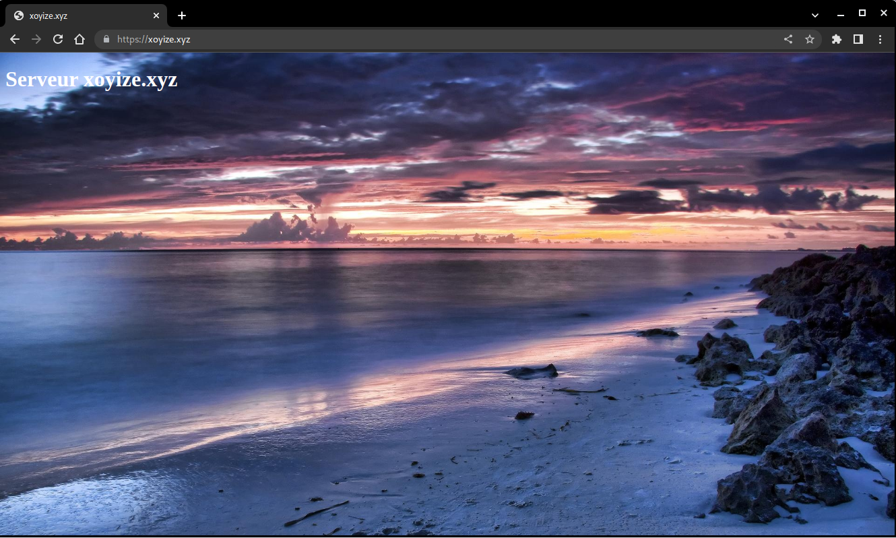{:width="500"}

### Navidrome

{:height="50"}  
[Audio Navidrome, installation sur debian](/posts/Audio_Navidrome-installation_sur_debian/)

**<u>Installation navidrome</u>**

```shell
# Conditions préalables à la mise à jour et à l’installation
sudo apt update && sudo apt upgrade
sudo apt install libtag1-dev ffmpeg
# Utilisateur “navidrome”
sudo useradd -r -s /bin/false navidrome
# Créez un répertoire pour stocker l’exécutable Navidrome 
# et un répertoire de travail avec les permissions appropriées
sudo install -d -o navidrome -g navidrome /opt/navidrome
sudo install -d -o navidrome -g navidrome /var/lib/navidrome
# On utilise la version compilée disponible sous ~/navidrome
sudo mv navidrome /opt/navidrome/
sudo chown -R navidrome:navidrome /opt/navidrome
sudo chmod +x /opt/navidrome/navidrome
```

Fichier de configuration **navidrome.toml** : `sudo nano /var/lib/navidrome/navidrome.toml`

```
MusicFolder = "/srv/datayan/musique"
ND_PLAYLISTSPATH = "/srv/datayan/musique/Playlists"
```

unité Systemd **navidrome.service** : `sudo nano /etc/systemd/system/navidrome.service`

```
[Unit]
Description=Navidrome Music Server and Streamer compatible with Subsonic/Airsonic
After=remote-fs.target network.target
AssertPathExists=/var/lib/navidrome

[Install]
WantedBy=multi-user.target

[Service]
User=navidrome
Group=navidrome
Type=simple
ExecStart=/opt/navidrome/navidrome --configfile "/var/lib/navidrome/navidrome.toml"
WorkingDirectory=/var/lib/navidrome
TimeoutStopSec=20
KillMode=process
Restart=on-failure

# See https://www.freedesktop.org/software/systemd/man/systemd.exec/
DevicePolicy=closed
NoNewPrivileges=yes
PrivateTmp=yes
PrivateUsers=yes
ProtectControlGroups=yes
ProtectKernelModules=yes
ProtectKernelTunables=yes
RestrictAddressFamilies=AF_UNIX AF_INET AF_INET6
RestrictNamespaces=yes
RestrictRealtime=yes
SystemCallFilter=~@clock @debug @module @mount @obsolete @reboot @setuid @swap
ReadWritePaths=/var/lib/navidrome

# You can uncomment the following line if you're not using the jukebox This
# will prevent navidrome from accessing any real (physical) devices
#PrivateDevices=yes

# You can change the following line to `strict` instead of `full` if you don't
# want navidrome to be able to write anything on your filesystem outside of
# /var/lib/navidrome.
ProtectSystem=full

# You can uncomment the following line if you don't have any media in /home/*.
# This will prevent navidrome from ever reading/writing anything there.
#ProtectHome=true

# You can customize some Navidrome config options by setting environment variables here. Ex:
#Environment=ND_BASEURL="/navidrome"
```

lancer le service

```bash
sudo systemctl daemon-reload
sudo systemctl start navidrome.service
sudo systemctl enable navidrome.service
```

Tester navidrome, exécuter la commande sur un poste local ayant accès via ssh au serveur distant

    ssh -L 9500:localhost:4533 ctbouser@109.123.254.249 -p 55249 -i /home/yann/.ssh/contabovps

Ouvrir le lien `localhost:9500` dans un navigateur


{:height="50"}  
**<u>Proxy nginx zic.xoyize.xyz</u>**

Le fichier de configuration nginx `/etc/nginx/conf.d/zic.xoyize.xyz.conf`

```nginx
server {
    listen 80;
    listen [::]:80;
    server_name zic.xoyize.xyz;
    return 301 https://$host$request_uri;
}
server {
    listen 443 ssl http2;
    listen [::]:443 ssl http2;
    server_name zic.xoyize.xyz;

    include /etc/nginx/conf.d/security.conf.inc;

    location / { 
        proxy_pass              http://127.0.0.1:4533;
    } 

}
```

Valider et recharger ginx

    sudo nginx -t
    sudo systemctl reload nginx

Lien <https://zic.xoyize.xyz>  
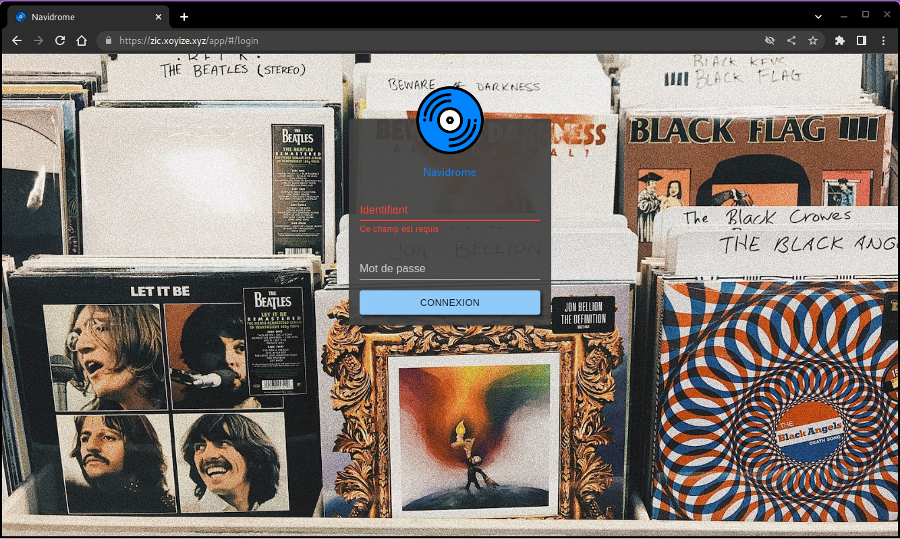{:width="500"}

### Searx

[Step by step installation](https://searx.github.io/searx/admin/installation-searx/#installation-basic)

#### Installation des paquets prérequis

```shell
sudo -H apt-get install -y \
    python3-dev python3-babel python3-venv \
    uwsgi uwsgi-plugin-python3 \
    git build-essential libxslt-dev zlib1g-dev libffi-dev libssl-dev \
    shellcheck
```

Créer un utilisateur système

```shell
sudo -H useradd --shell /bin/bash --system \
    --home-dir "/usr/local/searx" \
    --comment 'Privacy-respecting metasearch engine' searx

sudo -H mkdir "/usr/local/searx"
sudo -H chown -R "searx:searx" "/usr/local/searx"
```

#### Installer searx et les dépendances

```shell
# basculer sur utilisateur searx
sudo -H -u searx -i
# le prompt : searx@xoyize:~$
# cloner le dépôt
git clone "https://github.com/searx/searx.git" "/usr/local/searx/searx-src"
# créer virtualenv
python3 -m venv "/usr/local/searx/searx-pyenv"
echo ". /usr/local/searx/searx-pyenv/bin/activate" >>  "/usr/local/searx/.profile"
```

Pour installer les dépendances de searx, quittez la session bash searx que vous avez ouverte ci-dessus et redémarrez-en une nouvelle. 
Avant l'installation, vérifiez d'abord si votre virtualenv provient du login (`~/.profile`) :


```shell
ctbouser@xoyize:~$ sudo -H -u searx -i
(searx-pyenv) searx@xoyize:~$ command -v python && python --version
/usr/local/searx/searx-pyenv/bin/python
Python 3.9.2

# update pip's boilerplate ..
pip install -U pip
pip install -U setuptools
pip install -U wheel
pip install -U pyyaml

# jump to searx's working tree and install searx into virtualenv
(searx-pyenv) searx@xoyize:~$ cd "/usr/local/searx/searx-src"
# Ne pas oublier le "poin" à la fin de la commande
(searx-pyenv) searx@xoyize:~$ pip install -e .
# on sort
exit
```

#### Configuration

Pour créer un /etc/searx/settings.yml initial, vous pouvez commencer par une copie du fichier `Origin : utils/templates/etc/searx/use_default_settings.yml`. Cette configuration utilise les paramètres par défaut de `Origin : searx/settings.yml` et est recommandée depuis la fusion du PR 2291.

Pour une installation minimale, configurez comme indiqué ci-dessous - remplacez searx@$(uname -n) par un nom de votre choix, définissez ultrasecretkey - et/ou modifiez /etc/searx/settings.yml selon vos besoins.

```shell
# paramètres searx
sudo -H mkdir -p "/etc/searx"
sudo -H cp "/usr/local/searx/searx-src/searx/settings.yml" \
             "/etc/searx/settings.yml"
# minimal setup
sudo -H sed -i -e "s/ultrasecretkey/$(openssl rand -hex 16)/g" "/etc/searx/settings.yml"
sudo -H sed -i -e "s/{instance_name}/searx@$(uname -n)/g" "/etc/searx/settings.yml"
```

Modifier le fichier de paramétrage `/etc/searx/settings.yml`

```
general:

    instance_name : "XoSearx" # displayed name

ui:
    theme_args :
        oscar_style : logicodev-dark # default style of oscar
    results_on_new_tab: True  # Open result links in a new tab by default

# supprimer la ligne 'disabled : True' des éléments ci dessous ou positionner 'disabled : False'

  - name : ddg definitions
    engine : duckduckgo_definitions
    shortcut : ddd
    weight : 2

  - name : duckduckgo
    engine : duckduckgo
    shortcut : ddg

  - name : duckduckgo images
    engine : duckduckgo_images
    shortcut : ddi
    timeout: 3.0

  - name : startpage
    engine : startpage
    shortcut : sp
    timeout : 6.0
    disabled : False
    additional_tests:
      rosebud: *test_rosebud

# facultatif
# ajouter ligne 'disabled : True' sur certains éléments de la liste

  - name : bing
    engine : bing
    shortcut : bi
    disabled : True

  - name : bing images
    engine : bing_images
    shortcut : bii
    disabled : True

  - name : bing news
    engine : bing_news
    shortcut : bin
    disabled : True

  - name : bing videos
    engine : bing_videos
    shortcut : biv
    disabled : True

  - name : wikidata
    engine : wikidata
    shortcut : wd
    timeout : 3.0
    weight : 2
    tests: *tests_infobox
    disabled : True

  - name : google
    engine : google
    shortcut : go
    use_mobile_ui: false
    # additional_tests:
    #   android: *test_android
    disabled : True

  - name : google images
    engine : google_images
    shortcut : goi
    # additional_tests:
    #   android: *test_android
    #   dali:
    #     matrix:
    #       query: ['Dali Christ']
    #       lang: ['en', 'de', 'fr', 'zh-CN']
    #     result_container:
    #       - ['one_title_contains', 'Salvador']
    disabled : True

  - name : google news
    engine : google_news
    shortcut : gon
    # additional_tests:
    #   android: *test_android
    disabled : True

  - name : google videos
    engine : google_videos
    shortcut : gov
    # additional_tests:
    #   android: *test_android
    disabled : True

  - name : google scholar
    engine : google_scholar
    shortcut : gos
    disabled : True

```

#### Vérifier en local

Pour vérifier votre configuration searx, vous pouvez activer le débogage et démarrer la webapp. Searx recherche un fichier de configuration dans l'environnement exporté `$SEARX_SETTINGS_PATH`

```shell
# dans le terminal (ctbouser@ouestyan:~$)
# enable debug ..
sudo -H sed -i -e "s/debug : False/debug : True/g" "/etc/searx/settings.yml"

# start webapp
$ sudo -H -u searx -i
# prompt --> (searx-pyenv) searx@xoyize:~$ 
cd /usr/local/searx/searx-src
export SEARX_SETTINGS_PATH="/etc/searx/settings.yml"
# lancement de la webapp
python searx/webapp.py
```

Le serveur de test est en attente  
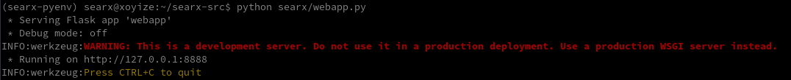


**Alternative A**  
Ouvrez un navigateur WEB et visitez http:// . Si vous êtes dans un conteneur ou dans un script, testez avec curl dans le second terminal

    curl --location --verbose --head --insecure localhost:8888

```
*   Trying 127.0.0.1:8888...
* Connected to localhost (127.0.0.1) port 8888 (#0)
> GET / HTTP/1.1
> Host: localhost:8888
> User-Agent: curl/7.74.0
> Accept: */*
> 
* Mark bundle as not supporting multiuse
* HTTP 1.0, assume close after body
< HTTP/1.0 200 OK
[...]
```

**Alternative B**  
Dans un terminal distant ayant un accès SSH au serveur xoyize.xyz

    ssh -L 9500:localhost:8888 ctbouser@109.123.254.249 -p 55249 -i /home/yann/.ssh/contabovps

Puis ouvrir un navigateur sur le lien <http://localhost:9500>

**Constat**  
Si tout fonctionne bien, appuyez sur [CTRL-C] pour arrêter la webapp et désactiver l'option de débogage dans settings.yml. 

```shell
# disable debug
$ sudo -H sed -i -e "s/debug : True/debug : False/g" "/etc/searx/settings.yml"
```

Vous pouvez maintenant quitter searx en mode bash (commande exit). À ce stade, searx n'est pas un daemon , uwsgi le permet.


#### uwsgi

Créer le fichier `/etc/uwsgi/apps-available/searx.ini`

```ini
[uwsgi]

# uWSGI core
# ----------
#
# https://uwsgi-docs.readthedocs.io/en/latest/Options/#uwsgi-core

# Who will run the code
uid = searx
gid = searx

# set (python) default encoding UTF-8
env = LANG=C.UTF-8
env = LANGUAGE=C.UTF-8
env = LC_ALL=C.UTF-8

# chdir to specified directory before apps loading
chdir = /usr/local/searx/searx-src/searx

# searx configuration (settings.yml)
env = SEARX_SETTINGS_PATH=/etc/searx/settings.yml

# disable logging for privacy
disable-logging = true

# The right granted on the created socket
chmod-socket = 666

# Plugin to use and interpreter config
single-interpreter = true

# enable master process
master = true

# load apps in each worker instead of the master
lazy-apps = true

# load uWSGI plugins
plugin = python3,http

# By default the Python plugin does not initialize the GIL.  This means your
# app-generated threads will not run.  If you need threads, remember to enable
# them with enable-threads.  Running uWSGI in multithreading mode (with the
# threads options) will automatically enable threading support. This *strange*
# default behaviour is for performance reasons.
enable-threads = true


# plugin: python
# --------------
#
# https://uwsgi-docs.readthedocs.io/en/latest/Options/#plugin-python

# load a WSGI module
module = searx.webapp

# set PYTHONHOME/virtualenv
virtualenv = /usr/local/searx/searx-pyenv

# add directory (or glob) to pythonpath
pythonpath = /usr/local/searx/searx-src


# speak to upstream
# -----------------
#
# Activate the 'http' configuration for filtron or activate the 'socket'
# configuration if you setup your HTTP server to use uWSGI protocol via sockets.

# using IP:
#
# https://uwsgi-docs.readthedocs.io/en/latest/Options/#plugin-http
# Native HTTP support: https://uwsgi-docs.readthedocs.io/en/latest/HTTP/

http = 127.0.0.1:8888

# using unix-sockets:
#
# On some distributions you need to create the app folder for the sockets::
#
#   mkdir -p /run/uwsgi/app/searx
#   chown -R searx:searx  /run/uwsgi/app/searx
#
# socket = /run/uwsgi/app/searx/socket

# Cache
cache2 = name=searxcache,items=2000,blocks=2000,blocksize=4096,bitmap=1
```

Sur certaines distributions, vous devez créer le dossier app pour les sockets 

```shell
sudo mkdir -p /run/uwsgi/app/searx
sudo chown -R searx:searx /run/uwsgi/app/searx
```

socket = /run/uwsgi/app/searx/socket

Activer le fichier ini

    sudo -H ln -s /etc/uwsgi/apps-available/searx.ini /etc/uwsgi/apps-enabled/

Démarrer le service

```shell
sudo -H service uwsgi start searx
# OU
sudo systemctl start uwsgi
```

Tester  localement pour vérifier : `curl --location --verbose --head --insecure localhost:8888`

Tester à partir d'un poste distant  
Exécuter sur un poste distant

    ssh -L 9500:localhost:8888 ctbouser@109.123.254.249 -p 55249 -i /home/yann/.ssh/contabovps  

Sur le même poste , ouvrir le navigateur avec un lien <http://localhost:9500>  
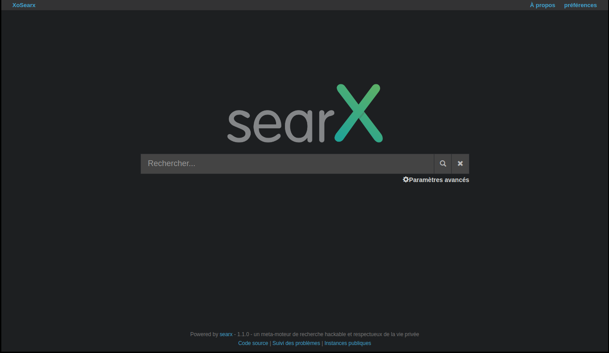{:width="600"}

Après toute modification du fichier de configuration `/etc/searx/settings.yml`, il faut redémarrer le service **uwsgi** par la commande `sudo systemctl restart uwsgi`
{: .prompt-info }

#### nginx proxy searx

{:height="50"}  
Le fichier de configuration nginx `/etc/nginx/conf.d/searx.xoyize.xyz.conf`

```nginx
server {
    listen 80;
    listen [::]:80;
    server_name searx.xoyize.xyz;
    return 301 https://$host$request_uri;
}
server {
    listen 443 ssl http2;
    listen [::]:443 ssl http2;
    server_name searx.xoyize.xyz;

    include /etc/nginx/conf.d/security.conf.inc;

    location / {
      proxy_pass http://127.0.0.1:8888;

      proxy_set_header Host $host;
      proxy_set_header Connection       $http_connection;
      proxy_set_header X-Forwarded-For  $proxy_add_x_forwarded_for;
      proxy_set_header X-Scheme         $scheme;
      proxy_buffering                   off;
    }
}
```

Valider et recharger ginx

    sudo nginx -t
    sudo systemctl reload nginx

Lien <https://searx.xoyize.xyz>  
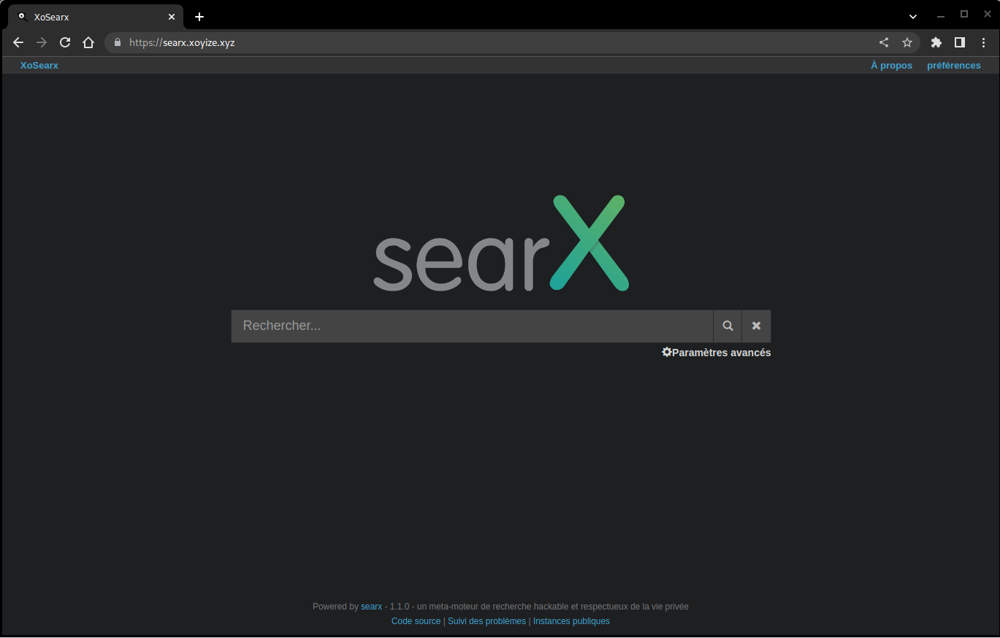{:width="600"}

### Nextcloud

[Nextcloud Hub 3 (v25+)](/posts/Nextcloud_Hub_3_(v25+)/)

#### Transmission Torrent

  
[Installation Transmission Torrent](/posts/debian-transmission-daemon/) 

#### Installer transmission-daemon

Liste des commandes

```shell
sudo apt install transmission-cli transmission-common transmission-daemon
sudo systemctl stop transmission-daemon
sudo usermod -a -G debian-transmission $USER
```

On arrête le daemon pour pouvoir modifier le fichier de configuration :

    sudo systemctl stop transmission-daemon.service

#### Proxy nginx

{:height="50"}  
Reverse proxy nginx `/etc/nginx/conf.d/transmission.xoyize.xyz.conf`

```nginx
upstream transmission  {
    server 127.0.0.1:9091;
}

server {
    listen 80;
    listen [::]:80;
    server_name transmission.xoyize.xyz;
    return 301 https://$host$request_uri;
}
server {
    listen 443 ssl http2;
    listen [::]:443 ssl http2;
    server_name transmission.xoyize.xyz;

    include /etc/nginx/conf.d/security.conf.inc;

    access_log /var/log/nginx/trans-access.log;
    error_log /var/log/nginx/trans-error.log;

    location / {
    return 301 https://$server_name/transmission/;
		location ^~ /transmission {
		    proxy_set_header X-Real-IP $remote_addr;
		    proxy_set_header X-Forwarded-For $proxy_add_x_forwarded_for;
		    proxy_set_header Host $http_host;
		    proxy_set_header Connection "";
		    proxy_pass_header X-Transmission-Session-Id;
		       
			  location /transmission/rpc {
			    proxy_pass http://transmission;
			  }
			  location /transmission/web/ {
			    proxy_pass http://transmission;
			  }
			  location /transmission/upload {
			    proxy_pass http://transmission;
			  }
			  location /transmission/web/style/ {
			    alias /usr/share/transmission/web/style/;
			  }
			  location /transmission/web/javascript/ {
			    alias /usr/share/transmission/web/javascript/;
			  }
			  location /transmission/web/images/ {
			    alias /usr/share/transmission/web/images/;
			  }
			  location /transmission/ {
			    return 301 http://$server_name/transmission/web;
			  }
			  location /transmission/downloads/ {
			    alias /srv/transmission/completed/;
			    charset UTF-8;
			    autoindex on;
			    autoindex_exact_size off;
		     }
		 }

}

}
```

#### Dossiers et configuration

{:height="50"}  
Créer les différents dossiers pour le suivi des téléchargements

```shell
sudo mkdir -p /srv/transmission/{watched,completed,progress}
# les droits
sudo chown debian-transmission:www-data -R /srv/transmission/completed
sudo chown debian-transmission:debian-transmission -R /srv/transmission/{watched,progress}
```

Modifier le fichier `/var/lib/transmission-daemon/info/settings.json`

```
"download-dir": "/srv/transmission/completed",
"incomplete-dir": "/srv/transmission/progress",

"rpc-authentication-required": true, // Activation de l’auth par mot de passe
"rpc-url": "/",
"rpc-bind-address": "0.0.0.0", // 127.0.0.1 pour écouter en local
"rpc-enabled": true, // Activation de l’interface web
"rpc-password": "MOT_DE_PASSE", // Tapez votre mot de passe, il sera salé au reload
"rpc-port": 9091, // Port d’écoute
"rpc-url": "/transmission/", // Correspond à l’URL d’accès
"rpc-username": "UTILISATEUR", // Nom d’utilisateur pour l’auth
"rpc-host-whitelist": "",
"rpc-host-whitelist-enabled": false,
"rpc-whitelist": "127.0.0.1", // IPs à whitelist
"rpc-whitelist-enabled": true, // Activation de la whitelist

# en fin de fichier
    "utp-enabled": true,
    "watch-dir": "/srv/transmission/watched",
    "watch-dir-enabled": true
}
```

Si on veut un accès par log et mot de passe, il faut modifier 3 paramètres

```
    "rpc-authentication-required": true,
    "rpc-password": "Mot de passe utilisateur",
    "rpc-username": "yako",
```

Le mot de passe sera chiffrée au premier lancement du service

le fichier json complet

```json
{
    "alt-speed-down": 50,
    "alt-speed-enabled": false,
    "alt-speed-time-begin": 540,
    "alt-speed-time-day": 127,
    "alt-speed-time-enabled": false,
    "alt-speed-time-end": 1020,
    "alt-speed-up": 50,
    "bind-address-ipv4": "0.0.0.0",
    "bind-address-ipv6": "::",
    "blocklist-enabled": false,
    "blocklist-url": "http://www.example.com/blocklist",
    "cache-size-mb": 4,
    "dht-enabled": true,
    "download-dir": "/srv/transmission/completed",
    "download-queue-enabled": true,
    "download-queue-size": 5,
    "encryption": 1,
    "idle-seeding-limit": 30,
    "idle-seeding-limit-enabled": false,
    "incomplete-dir": "/srv/transmission/progress",
    "incomplete-dir-enabled": false,
    "lpd-enabled": false,
    "max-peers-global": 200,
    "message-level": 1,
    "peer-congestion-algorithm": "",
    "peer-id-ttl-hours": 6,
    "peer-limit-global": 200,
    "peer-limit-per-torrent": 50,
    "peer-port": 51413,
    "peer-port-random-high": 65535,
    "peer-port-random-low": 49152,
    "peer-port-random-on-start": false,
    "peer-socket-tos": "default",
    "pex-enabled": true,
    "port-forwarding-enabled": true,
    "preallocation": 1,
    "prefetch-enabled": true,
    "queue-stalled-enabled": true,
    "queue-stalled-minutes": 30,
    "ratio-limit": 2,
    "ratio-limit-enabled": false,
    "rename-partial-files": true,
    "rpc-authentication-required": false,
    "rpc-bind-address": "127.0.0.1",
    "rpc-enabled": true,
    "rpc-host-whitelist": "",
    "rpc-host-whitelist-enabled": false,
    "rpc-password": "{37ed0549b52529120e94899628667f64d32f7908fhfjT0.Q",
    "rpc-port": 9091,
    "rpc-url": "/transmission/",
    "rpc-username": "yako",
    "rpc-whitelist": "127.0.0.1,::1",
    "rpc-whitelist-enabled": true,
    "scrape-paused-torrents-enabled": true,
    "script-torrent-done-enabled": false,
    "script-torrent-done-filename": "",
    "seed-queue-enabled": false,
    "seed-queue-size": 10,
    "speed-limit-down": 100,
    "speed-limit-down-enabled": false,
    "speed-limit-up": 100,
    "speed-limit-up-enabled": false,
    "start-added-torrents": true,
    "trash-original-torrent-files": false,
    "umask": 18,
    "upload-slots-per-torrent": 14,
    "utp-enabled": true,
    "watch-dir": "/srv/transmission/watched",
    "watch-dir-enabled": true
}
```

Pour éviter l'erreur " transmission UDP Failed to set receive buffer ..." , en mode su

```shell
echo "net.core.rmem_max = 4194304" >> /etc/sysctl.conf
echo "net.core.wmem_max = 1048576" >> /etc/sysctl.conf
sysctl -p
```

Redémarrer les services

```shell
sudo systemctl start transmission-daemon
sudo systemctl reload nginx
```

A chaque modification (en mode su)

```shell
systemctl stop transmission-daemon
rm /var/lib/transmission-daemon/.config/transmission-daemon/settings.json
rm /etc/transmission-daemon/settings.json 
# créer
nano /var/lib/transmission-daemon/info/settings.json
```

#### transmission.xoyize.xyz

Connexion sur le lien <https://transmission.xoyize.xyz>  
  
Saisir "yannick" et son mot de passe  

### Test de sécurité

{:height="50"}  
[Analyse SSL](https://www.ssllabs.com/ssltest/index/) contre le site Web pour trouver le score et la vulnérabilité essentielle.  
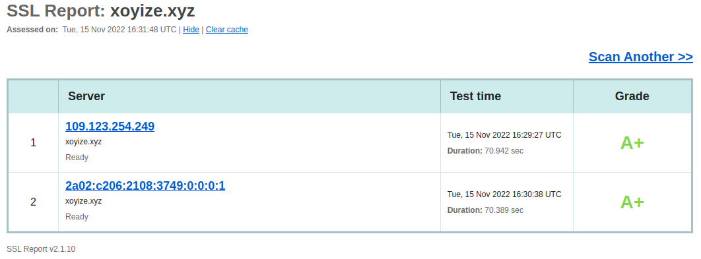  
<https://www.ssllabs.com/ssltest/analyze/?d=xoyize.xyz>

Les entêtes <https://securityheaders.com/>   
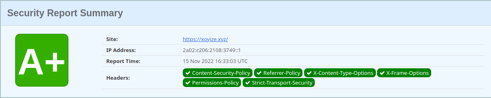  
xoyize.xyz

## Annexe

### ssh et ping erreur en IPV4

Impossible de se connecter en IPV4 par SSH et ping erreur depuis un poste distant  
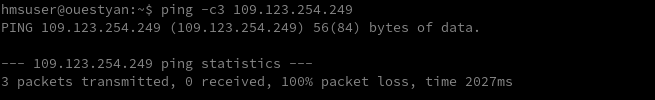  

L'exécution du ping par un utilisateur non root provoque une erreur "socket" en interne  
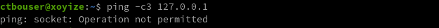  
*Sur une installation standard, la plupart des systèmes ne rencontrent pas ce problème.*

Résolution  
Ajout du paramètre : `net.ipv4.ping_group_range` dans le fichier `/etc/sysctl.conf`  

    net.ipv4.ping_group_range="0 2147483647"

Ce paramètre permettra aux utilisateurs non-roots d'exécuter ping 
Le définir temporairement à la volée avec la commande `sysctl` 

    sysctl net.ipv4.ping_group_range="0 2147483647"

  
