+++
title = 'Qemu/KVM - Virtuel Yunohost ouestyan.xyz (debian 11 image cloud Qcow2)'
date = 2022-11-18 00:00:00 +0100
categories = virtuel yunohost
+++
{:height=30}  {:height=30}  {:height=30}  
*installer une image virtuelle cloud debian 11 puis yunohost*  

## KVM debian bullseyes virtuel

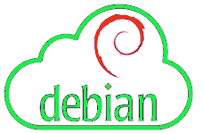{:height=30}  
*Si vous exploitez un nuage privé ou une plateforme de virtualisation fonctionnant avec KVM, comme OpenStack et oVirt. La manière la plus idéale de faire tourner une machine virtuelle Debian 11 est d'utiliser une image de nuage. Dans ce blog, nous vous montrons comment télécharger l'image officielle du nuage Debian 11 et créer une instance de machine virtuelle à partir de celle-ci sur l'hyperviseur KVM. Article original [Create Debian 11 (Bullseye) KVM Guest From Cloud Image](https://blog.programster.org/create-debian-11-kvm-guest-from-cloud-image)*

### Image Cloud Debian 11

Toutes les images de Debian 11 Cloud sont disponibles sur la [page officielle de téléchargement des images d'OS](https://cloud.debian.org/images/cloud/). Dans ce guide, nous allons télécharger l'image nocloud qcow2 :

    mkdir -p ~/virtuel/KVM/ && cd ~/virtuel/KVM/
    wget https://cloud.debian.org/images/cloud/bullseye/latest/debian-11-nocloud-amd64.qcow2

Vous pouvez vérifier plus de détails sur le fichier en utilisant la commande file :

    file debian-11-nocloud-amd64.qcow2

*debian-11-nocloud-amd64.qcow2: QEMU QCOW2 Image (v3), 2147483648 bytes*

### Créer machine virtuelle Debian 11

Ensuite, nous créons une machine virtuelle Debian 11 (bullseyes) à partir de notre image du nuage.

Définir la variable 

    export VM_NAME="yunobulls"

Une fois la variable exportée, créer l'image du disque racine de l'OS à partir de l'image du cloud téléchargée précédemment :

```bash
qemu-img convert \
  -f qcow2 \
  -O qcow2 \
  ~/virtuel/KVM/debian-11-nocloud-amd64.qcow2 \
  ~/virtuel/KVM/$VM_NAME.qcow2
```

Vérifiez la création du fichier si elle est réussie

    file  ~/virtuel/KVM/$VM_NAME.qcow2

*/home/yann/virtuel/KVM/yunobulls.qcow2: QEMU QCOW2 Image (v3), 2147483648 bytes*

    sudo du -sh ~/virtuel/KVM/$VM_NAME.qcow2

*912M	/home/yann/virtuel/KVM/yunobulls.qcow2*

Supprimer l'image cloud (FACULTATIF)

    rm ~/virtuel/KVM/debian-11-nocloud-amd64.qcow2

### Redimensionner le disque à la taille souhaitée.

>Notez que le disque racine que nous avons créé a une petite capacité de disque comme défini dans l'image de nuage par défaut.

Redimensionnons à la taille souhaitée pour le disque racine.


```bash
# 20 GB de disque
export VM_ROOT_DISK_SIZE=20G

# Resize Debian 11 VM disk
qemu-img resize \
  ~/virtuel/KVM/$VM_NAME.qcow2 \
  $VM_ROOT_DISK_SIZE
```

*Image resized.*

Confirmez la taille actuelle avec la commande qemu-img info :

    qemu-img  info ~/virtuel/KVM/$VM_NAME.qcow2

```
file format: qcow2
virtual size: 20 GiB (21474836480 bytes)
disk size: 912 MiB
cluster_size: 65536
Format specific information:
    compat: 1.1
    compression type: zlib
    lazy refcounts: false
    refcount bits: 16
    corrupt: false
    extended l2: false
```

Créez une nouvelle machine virtuelle Debian 11 à l'aide de la commande `virt-install`.  
Nous utilisons le réseau en pont , remplacer `network=default` par `bridge=br0`


```bash
sudo virt-install \
    --memory 2048 \
    --vcpus 1 \
    --name $VM_NAME \
    --disk ~/virtuel/KVM/$VM_NAME.qcow2,device=disk,bus=virtio,format=qcow2 \
    --os-type Linux \
    --os-variant debian11 \
    --network bridge=br0,model=virtio \
    --virt-type kvm \
    --graphics none \
    --import
```


A la fin de l'installation, on arrive sur le login (en mode console) : "root" sans mot de passe  

```
[...]
[  OK  ] Finished Update UTMP about System Runlevel Changes.

Debian GNU/Linux 11 debian ttyS0

debian login: 
```

Mise à jour

    apt update && apt upgrade
    reboot

### Box IPV6 et DMZ

Pour le nexthop IPV6 FreeBox

    ip a |grep "inet6 fe80"

*inet6 fe80::5054:ff:fe37:2d1b/64 scope link*

Paramètres de la Freebox, Configuration IPV6 &rarr; Délégation de préfixe  
Préfixe : 2a01:e34:eebf:5663::/64  
Next Hop : fe80::5054:ff:fe37:2d1b  

L'accès local sur ip 192.168.0.135  
Modifier l'accès DMZ de la box (FreeBox)  
Freebox : Paramètres avancés &rarr; Gestion des ports &rarr; DMZ  IP DMZ : 192.168.0.135  
  

Reverse DNS freebox ([Freebox Espace Abonné](https://subscribe.free.fr/login/)) : **ouestyan.xyz**  

### Debian Ip V4 V6 statiques

Passage en ip statique 192.168.0.135 et 2a01:e34:eebf:5663::1 (nexthop `fe80::5054:ff:fe37:2d1b`) 

    nano /etc/network/interfaces.d/staticv4v6

```
# The primary network interface
allow-hotplug enp1s0
#iface enp1s0 inet dhcp
iface enp1s0 inet static
 address 192.168.0.135
 netmask 255.255.255.0
 gateway 192.168.0.254
# This is an autoconfigured IPv6 interface
#iface enp1s0 inet6 auto
iface enp1s0 inet6 static
 address 2a01:e34:eebf:5663::1
 netmask 64
 post-up ip -6 route add default via fe80::8e97:eaff:fe39:66d6 dev enp1s0

```

Pour éviter l'erreur `ICMPv6: RA: ndisc_router_discovery failed to add default route`  
Correction, désactiver l’annonce des routes ([accept_ra](https://sysctl-explorer.net/net/ipv6/accept_ra/)) :

    nano /etc/sysctl.conf

```
# Uncomment the next line to enable packet forwarding for IPv6
#  Enabling this option disables Stateless Address Autoconfiguration
#  based on Router Advertisements for this host
net.ipv6.conf.all.forwarding=1

# Accept Router Advertisements
net.ipv6.conf.all.accept_ra=0

```

Activer `net.ipv6.conf.all.forwarding=1` et ajouter `net.ipv6.conf.all.accept_ra=0`   
Puis `sysctl -p` pour une validation immédiate  

reboot : `reboot`

Vérifier Adressage IP statique

    ip a

```
1: lo: <LOOPBACK,UP,LOWER_UP> mtu 65536 qdisc noqueue state UNKNOWN group default qlen 1000
    link/loopback 00:00:00:00:00:00 brd 00:00:00:00:00:00
    inet 127.0.0.1/8 scope host lo
       valid_lft forever preferred_lft forever
    inet6 ::1/128 scope host 
       valid_lft forever preferred_lft forever
2: enp1s0: <BROADCAST,MULTICAST,UP,LOWER_UP> mtu 1500 qdisc pfifo_fast state UP group default qlen 1000
    link/ether 52:54:00:37:2d:1b brd ff:ff:ff:ff:ff:ff
    inet 192.168.0.135/24 brd 192.168.0.255 scope global enp1s0
       valid_lft forever preferred_lft forever
    inet6 2a01:e34:eebf:5663::1/64 scope global 
       valid_lft forever preferred_lft forever
    inet6 fe80::5054:ff:fe37:2d1b/64 scope link 
       valid_lft forever preferred_lft forever

```

### Reconfigurer les clés SSH

Par défaut openssh ne fonctionne pas

```
    [FAILED] Failed to start OpenBSD Secure Shell server.
    sshd: no hostkeys available -- exiting.
```

Il faut regénérer les clés

    dpkg-reconfigure openssh-server

{:width=500}

## Yunohost


### Installer yunohost

* [Beta-stage testing for Yunohost 11.0/Bullseye and Buster->Bullseye migration ](https://forum.yunohost.org/t/beta-stage-testing-for-yunohost-11-0-bullseye-and-buster-bullseye-migration/18531)


Installation d'un nouveau YunoHost sur un Debian 11/Bullseye

    wget https://install.yunohost.org/bullseye -O install_script
    bash install_script -d testing

Patienter ...

```

 ┌───────────────────────────┤ SSH Configuration ├────────────────────────────┐
 │                                                                            │
 │ To improve the security of your server, it is recommended to let YunoHost  │
 │ manage the SSH configuration.                                              │
 │ Your current SSH configuration differs from the recommended configuration. │
 │ If you let YunoHost reconfigure it, the way you connect to your server     │
 │ through SSH will change in the following way:                              │
 │ - you will not be able to connect as root through SSH. Instead you should  │
 │ use the admin user ;                                                       │
 │                                                                            │
 │ Do you agree to let YunoHost apply those changes to your configuration and │
 │ therefore affect the way you connect through SSH ?                         │
 │                                                                            │
 │                     <Yes>                        <No>                      │
 │                                                                            │
 └────────────────────────────────────────────────────────────────────────────┘
Choix Yes

===============================================================================
You should now proceed with Yunohost post-installation. This is where you will
be asked for :
  - the main domain of your server ;
  - the administration password.

You can perform this step :
  - from the command line, by running 'yunohost tools postinstall' as root
  - or from your web browser, by accessing : 
    - https://192.168.0.135/ (local IP, if self-hosting at home)
    - https://78.235.245.102/ (global IP, if you're on a VPS)

If this is your first time with YunoHost, it is strongly recommended to take
time to read the administator documentation and in particular the sections
'Finalizing your setup' and 'Getting to know YunoHost'. It is available at
the following URL : https://yunohost.org/admindoc
===============================================================================
```

### Post-installation

admin mot de passe  
domaine ouestyan.xyz

    yunohost tools postinstall

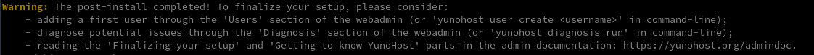

### Utilisateur

Création utilisateur

    yunohost user create yunoyan

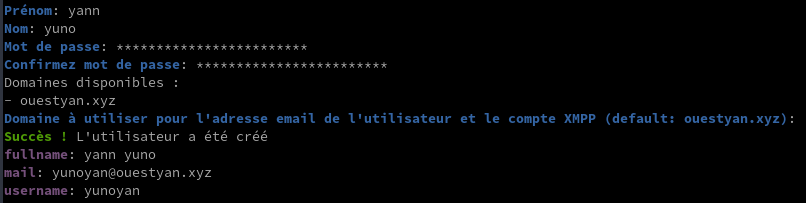

### DNS - ouestyan.xyz

{:width="50"} 

Domaine ouestyan.xyz **IPV6 ONLY**

    yunohost domain dns-conf ouestyan.xyz

```
; Basic ipv4/ipv6 records
@ 3600 IN AAAA 2a01:e34:eebf:5663::1

; Mail
@ 3600 IN MX 10 ouestyan.xyz.
@ 3600 IN TXT "v=spf1 a mx -all"
mail._domainkey 3600 IN TXT "v=DKIM1; h=sha256; k=rsa; p=MIGfMA0GCSqGSIb3DQEBAQUAA4GNADCBiQKBgQDFBpBoQJ17v9UlR4fGIgBfRPwxEsxFi5PoPSgLK6ae/uokOgc0w7iZf6ZeYSoTi+b9MZXHJwNxcVHX+cMm6pyJwg0
uRPITv2ys/NiSYl6qQESXzU41B5zjzUEL+hVNjRzgFAWQIQMpqco4YdfhClFG08x8JBRNjUc8VoQd0maZUwIDAQAB"
_dmarc 3600 IN TXT "v=DMARC1; p=none"


; XMPP
_xmpp-client._tcp 3600 IN SRV 0 5 5222 ouestyan.xyz.
_xmpp-server._tcp 3600 IN SRV 0 5 5269 ouestyan.xyz.
muc 3600 IN CNAME @
pubsub 3600 IN CNAME @
vjud 3600 IN CNAME @
xmpp-upload 3600 IN CNAME @

; Extra
* 3600 IN AAAA 2a01:e34:eebf:5663::1
@ 3600 IN CAA 128 issue "letsencrypt.org"
```

Copier le texte ci dessus

Se connecter sur OVH dans le domaine ouestyan.xyz  
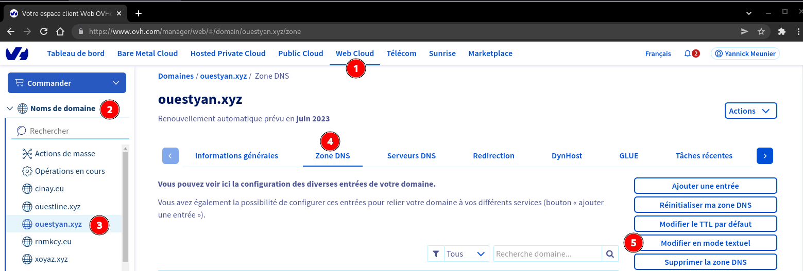

Coller le texte après la 4 ième ligne

```
$TTL 3600
@	IN SOA dns106.ovh.net. tech.ovh.net. (2022060600 86400 3600 3600000 60)
                         IN NS     dns106.ovh.net.
                         IN NS     ns106.ovh.net.
< Coller le texte ICI>
```

Cliquer sur suivant  
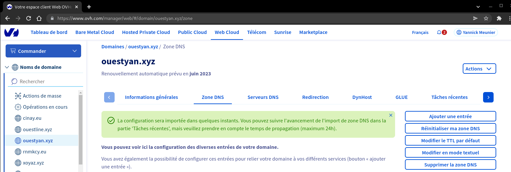

La configuration DNS OVH

```
$TTL 3600
@	IN SOA dns106.ovh.net. tech.ovh.net. (2022081401 86400 3600 3600000 60)
                         IN NS     ns106.ovh.net.
                         IN NS     dns106.ovh.net.
                         IN MX     10 ouestyan.xyz.
                         IN A      78.235.245.102
                         IN AAAA   2a01:e34:eebf:5663::1
                         IN CAA    128 issue "letsencrypt.org"
                         IN TXT    "v=spf1 a mx -all"
*                        IN A      78.235.245.102
*                        IN AAAA   2a01:e34:eebf:5663::1
_dmarc                   IN TXT    "v=DMARC1; p=none"
_xmpp-client._tcp        IN SRV    0 5 5222 ouestyan.xyz.
_xmpp-server._tcp        IN SRV    0 5 5269 ouestyan.xyz.
mail._domainkey          IN TXT    ( "v=DKIM1; h=sha256; k=rsa; p=MIGfMA0GCSqGSIb3DQEBAQUAA4GNADCBiQKBgQDVlYdbqqxjWskDN0a5FDBoaZg+TnZHefonMWDKSifzZkEWDd/ApGkQYl0iaVqrbiUOqZl1Hv580CbGrYdrTrSi8zFDPLAT2H5Xog8/ZiDK0AYtP5zzna/Nf7ybpQIXtLk/k3fHY5DI2rg6P/KHl5M5juhjk5vxGn/bhk1H600EjQIDAQAB" )
muc                      IN CNAME  ouestyan.xyz.
pubsub                   IN CNAME  ouestyan.xyz.
vjud                     IN CNAME  ouestyan.xyz.
xmpp-upload              IN CNAME  ouestyan.xyz.
```

### Certificats SSL Let's Encrypt

  
On active les certificats SSL pour le domaine

    yunohost domain cert-install ouestyan.xyz --no-checks

Vérifier validité

    yunohost domain cert status

```
certificates: 
  ouestyan.xyz: 
    CA_type: Let's Encrypt
    summary: Great!
    validity: 39
```

Renouvellement manuel

    yunohost domain cert renew

### Diagnostic et corrections

Lancer un diagnostic en mode su

    yunohost diagnosis run
    yunohost diagnosis run --force  # 14/08/2022

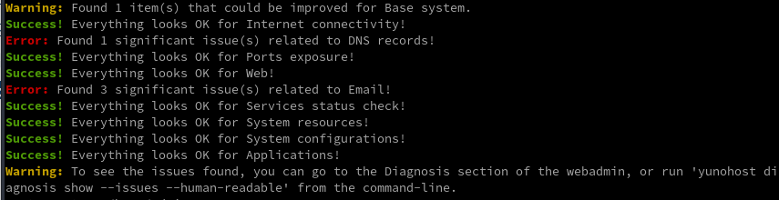

Il y a des erreurs liés au dns reverse IPV4 IPV6 qui n'est pas modifiable facilement chez free.fr   
Toutes les adresses IPV4 free.fr sont "blacklistées" chez SPAMHAUS  

Pour la lecture des erreurs

    yunohost diagnosis show --issues --human-readable

Les erreurs et corrections

`No reverse DNS is defined in IPv6`{: .prompt-danger }

```
[ERROR] No reverse DNS is defined in IPv6. Some emails may fail to get delivered or may get flagged as spam.
  - You should first try to configure the reverse DNS with ouestyan.xyz in your internet router interface or your hosting provider interface. (Some hosting provider may require you to send them a support ticket for this).
  - Some providers won't let you configure your reverse DNS (or their feature might be broken...). If your reverse DNS is correctly configured for IPv4, you can try disabling the use of IPv6 when sending emails by running 'yunohost settings set smtp.allow_ipv6 -v off'. Note: this last solution means that you won't be able to send or receive emails from the few IPv6-only servers out there.
```

Ne pas utiliser le smtp v6

    yunohost settings set smtp.allow_ipv6 -v off

`Your IP or domain 78.235.245.102 is blacklisted on Spamhaus ZEN`{: .prompt-danger }

```
[ERROR] Your IP or domain 78.235.245.102 is blacklisted on Spamhaus ZEN
  - The blacklist reason is: "https://www.spamhaus.org/query/ip/78.235.245.102"
  - After identifying why you are listed and fixed it, feel free to ask for your IP or domaine to be removed on https://www.spamhaus.org/zen/

```

Suivre la procédure sur le lien <https://www.spamhaus.org/zen/>  
Vérifier ensuite l'ip 78.235.245.102 sur le lien <https://check.spamhaus.org/>   
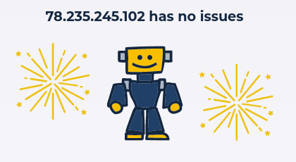

### Test envoi message

Si blocage spamhauss, aucun envoi de message est possible  
Sur terminal 1 exécuter la commande : `echo "Un mail de test" | mail -s "test envoi" vps@cinay.eu`  
Sur terminal 2 exécuter la commande : `tail -f /var/log/mail.log`
Message d'erreur dans le fichier `/var/log/mail.log`

```
Aug 14 07:14:06 ouestyan postfix/smtp[3238]: Trusted TLS connection established to cinay.eu[195.181.242.156]:25: TLSv1.3 with cipher TLS_AES_256_GCM_SHA384 (256/256 bits) key-exchange X25519 server-signature RSA-PSS (3072 bits) server-digest SHA256
Aug 14 07:14:06 ouestyan postfix/smtp[3238]: A6B77608D0: to=<vps@cinay.eu>, relay=cinay.eu[195.181.242.156]:25, delay=1.2, delays=0.03/0.04/0.81/0.34, dsn=5.7.1, status=bounced (host cinay.eu[195.181.242.156] said: 554 5.7.1 Service unavailable; Client host [78.235.245.102] blocked using zen.spamhaus.org (in reply to RCPT TO command))
Aug 14 07:14:06 ouestyan postsrsd[3225]: srs_forward: <""> not rewritten: No at sign in sender address
Aug 14 07:14:06 ouestyan postfix/cleanup[3224]: EAF4A608D2: message-id=<20220814071406.EAF4A608D2@ouestyan.xyz>
Aug 14 07:14:06 ouestyan postfix/qmgr[3006]: EAF4A608D2: from=<>, size=2288, nrcpt=1 (queue active)
Aug 14 07:14:06 ouestyan postfix/bounce[3239]: A6B77608D0: sender non-delivery notification: EAF4A608D2
Aug 14 07:14:06 ouestyan postfix/qmgr[3006]: A6B77608D0: removed
```


Pour vérifier qu'il n'y a plus de blocage  
Sur terminal 1 exécuter la commande : `echo "Un mail de test" | mail -s "test envoi" vps@cinay.eu`  
Sur terminal 2 exécuter la commande : `tail -f /var/log/mail.log`

```
Aug 14 07:44:39 ouestyan postfix/qmgr[3006]: 03298608D2: from=<admin@ouestyan.xyz>, size=340, nrcpt=1 (queue active)
Aug 14 07:44:39 ouestyan postfix/smtp[3338]: Trusted TLS connection established to cinay.eu[195.181.242.156]:25: TLSv1.3 with cipher TLS_AES_256_GCM_SHA384 (256/256 bits) key-exchange X25519 server-signature RSA-PSS (3072 bits)
Aug 14 07:44:40 ouestyan postfix/smtp[3338]: 03298608D2: to=<vps@cinay.eu>, relay=cinay.eu[195.181.242.156]:25, delay=1.8, delays=0.09/0.02/0.65/1, dsn=2.0.0, status=sent (250 2.0.0 Ok: queued as 1D31741E41)
Aug 14 07:44:40 ouestyan postfix/qmgr[3006]: 03298608D2: removed
```

### OpenSSH, clé et script

{height="70"}  
<u>sur l'ordinateur de bureau</u>
Générer une paire de clé curve25519-sha256 (ECDH avec Curve25519 et SHA2) nommé **yunokvm** pour une liaison SSH avec le serveur KVM.  

    ssh-keygen -t ed25519 -o -a 100 -f ~/.ssh/yunobulls

Envoyer les clés publiques sur le serveur KVM   

    ssh-copy-id -i ~/.ssh/yunobulls.pub admin@192.168.0.135

<u>sur le serveur Yunohost</u>
On se connecte  

    ssh admin@192.168.0.135

Sur votre serveur, la modification du fichier de configuration SSH pour désactiver l'authentification par mot de passe est gérée par un paramètre système 

    sudo yunohost settings set security.ssh.password_authentication -v no

Modifier le port SSH

*Pour empêcher les tentatives de connexion SSH par des robots qui analysent Internet à la recherche de tout serveur sur lequel SSH est activé, vous pouvez modifier le port SSH. Ceci est géré par un paramètre système, qui prend en charge la mise à jour de la configuration SSH et Fail2Ban.*

    sudo yunohost settings set security.ssh.port -v 55135

Accès depuis le poste distant avec la clé privée  

    ssh -p 55135 -i ~/.ssh/yunobulls admin@192.168.0.135

### Partage disque freebox

[Partage disque externe USB sur Freebox](/posts/Partage_disque_externe_USB_sur_Freebox/)

Installation paquet cifs-utils

    sudo apt install cifs-utils  # Debian

Création répertoire de montage

    sudo mkdir /mnt/freebox/

Edition fichier caché nommé .smbcredentials

    nano /home/$USER/.smbcredentials

Dans le fichier, ajoutez les lignes suivantes (remplacez les XXXX par votre login et mot de passe)

```
username=yannfreebox
password=xxxxxxxxxxxxxxx
```

Donnez les droits adéquats au fichier

```bash
sudo chown -R $USER:root /home/$USER/.smbcredentials
sudo chmod -R 775 /home/$USER/.smbcredentials
```

partage au démarrage, montage fstab

    sudo nano /etc/fstab

Ajouter les lignes suivantes au fichier

```
#mount freebox
//192.168.0.254/Disque\0401/ /mnt/freebox cifs credentials=/home/admin/.smbcredentials,iocharset=utf8,uid=1000,sec=ntlmv2,file_mode=0770,dir_mode=0775,vers=2.0
```

Montage immédiat : `sudo mount -a`  
Si aucune erreur, tester l'accès : `touch /mnt/freebox/test` et `ls /mnt/freebox/`

## Applications

### Nextcloud 25+

Créer le domaine cloud.ouestyan.xyz et les certificats

```shell
yunohost domain add cloud.ouestyan.xyz
yunohost domain cert-install cloud.ouestyan.xyz --no-checks
```

Installer la version nextcloud testing

```shell
git clone -b testing https://github.com/YunoHost-Apps/nextcloud_ynh
sudo yunohost app install nextcloud_ynh
```

Répondre aux différentes questions

```
DANGER! This app is not part of YunoHost's app catalog. Installing third-party apps may compromise the integrity and security of your system. You should probably NOT install it unless yo
u know what you are doing. NO SUPPORT will be provided if this app doesn't work or breaks your system... If you are willing to take that risk anyway, type 'Yes, I understand': Yes, I und
erstand
Choose the domain where this app should be installed [ouestyan.xyz | cloud.ouestyan.xyz]: cloud.ouestyan.xyz
Choose the URL path (after the domain) where this app should be installed: /
Choose an administrator user for this app [yunoyan]: yunoyan
Should this app be exposed to anonymous visitors? [yes | no]: yes
Access the users home folder from Nextcloud? [yes | no]: yes

```

### Keycloak

Ajouter domaine  **keycloak.ouestyan.xyz**  
Installer yunohost **redirect** pour le proxy nginx

    sudo yunohost app install https://github.com/YunoHost-Apps/redirect_ynh

```
Choose the domain where this app should be installed [ouestyan.xyz | cloud.ouestyan.xyz | keycloak.oues
tyan.xyz]: keycloak.ouestyan.xyz
Choose the URL path (after the domain) where this app should be installed: /
Redirect destination path: http://127.0.0.1:8080
Redirect type [public_302 | public_301 | public_proxy | private_proxy]: public_proxy
```

Lien  <https://keycloak.ouestyan.xyz/auth/>

## Hébergeur machines virtuelles (Hôte PC1)

### Lancer VM Yunohost au boot hôte

En ligne de commande et su sur l'hôte

    virsh autostart yunobulls            # activer autostart
    virsh autostart yunobulls --disable  # désactiver autostart

Gestionnaire machine virtuelle "yunobulls" sur l'hôte 

Démarrage automatique  
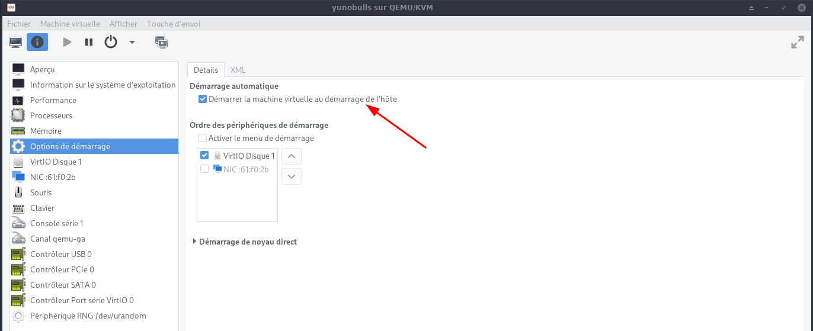  

### Instantané (snapshot) 

#### Créer un instantané (snapshot)

*Sur des hyperviseurs basés sur KVM, nous pouvons prendre des machines virtuelles ou un instantané de domaine à l'aide de la commande virsh.*

`Toutes les commandes seront exécutées en mode su`{: .prompt-warning }

Nous ne pouvons prendre l'instantané que des machines virtuelles dont le format de disque est Qcow2 et le format de disque brut n'est pas pris en charge par la commande kvm virsh, utilisez la commande ci-dessous pour convertir le format de disque brut en qcow2  
`qemu-img convert -f raw -O qcow2 image-name.img image-name.qcow2`
{: .prompt-info }

On se rend dans le répertoire

    cd ~/virtuel/KVM/

Répertorier toutes les machines virtuelles sur l'hyperviseur  

    virsh list --all

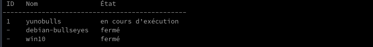

Créer un instantané de la machine virtuelle KVM (yunobulls)

    virsh snapshot-create-as --domain yunobulls --name yunobulls_20220625 --description "snap yunohost 25-06-2022"

Une fois l'instantané créé, répertorier les instantanés liés à la machine virtuelle

    virsh snapshot-list yunobulls

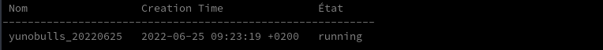

Pour répertorier les informations détaillées de l'instantané de la VM

    virsh snapshot-info --domain yunobulls --snapshotname yunobulls_20220625

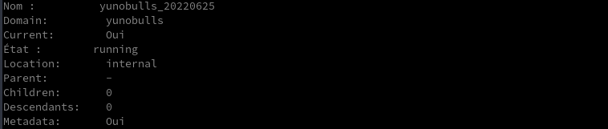

#### Rétablir/Restaurer la machine virtuelle KVM

Supposons que nous voulions rétablir ou restaurer la machine virtuelle yunohost sur l'instantané yunobulls_20220625

    virsh snapshot-revert yunobulls yunobulls_20220625

#### Supprimer les instantanés

Pour supprimer des instantanés de machine virtuelle KVM, obtenez d'abord les détails de l'instantané de la machine virtuelle à l'aide de la commande `virsh snapshot-list`, puis utilisez la commande `virsh snapshot-delete` pour supprimer l'instantané.

    virsh snapshot-list yunobulls


    virsh snapshot-delete --domain yunobulls --snapshotname yunobulls_20220625

