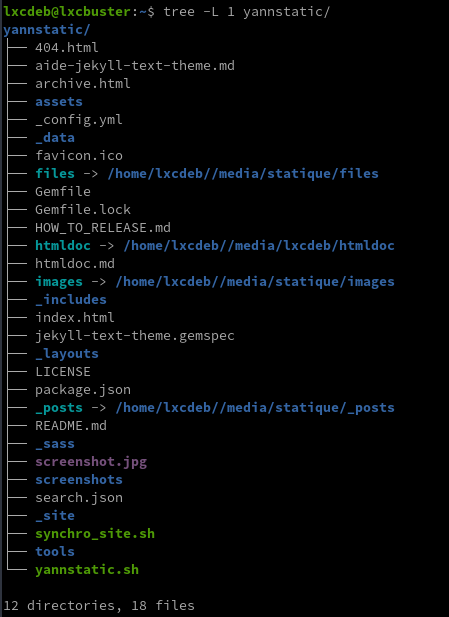
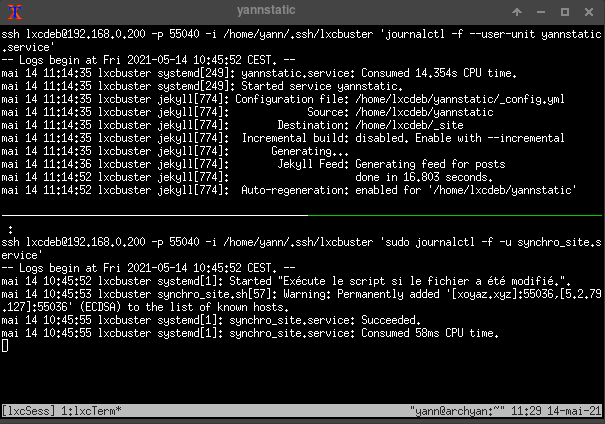
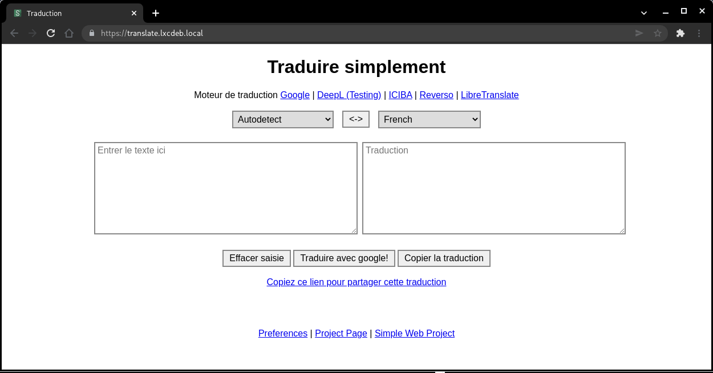
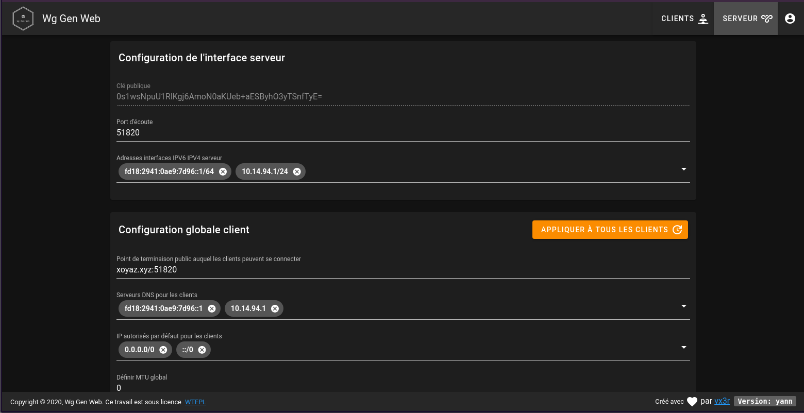
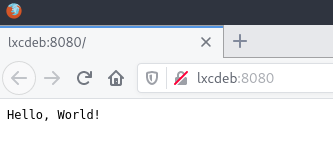
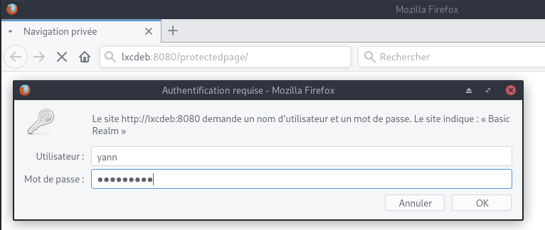
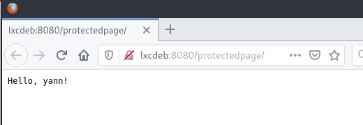
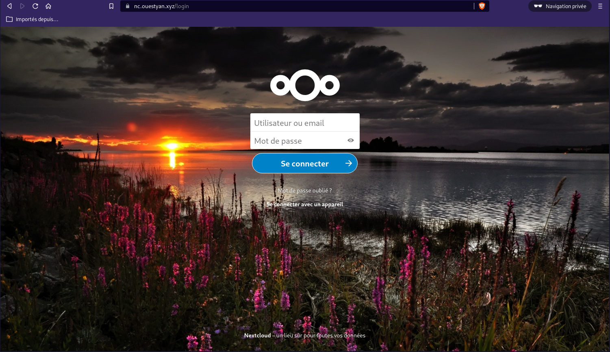

+++
title = 'Archlinux --> Container LXC debian buster lxcdeb (go, node, jekyll, nginx, php, mariadb)'
date = 2022-11-21 00:00:00 +0100
categories = ['virtuel']
+++
<div class="item">
  <div class="item__image">
    
  </div>
  <div class="item__content">
    <div class="item__header">
      <h4>Container lxc</h4>
    </div>
    <div class="item__description">
      <p>un container se compose d'un système de fichiers racine contenant le système à exécuter et d'un fichier de configuration décrivant les caractéristiques du système virtuel</p>
    </div>
  </div>
</div>

## Container lxc debian

* [Virtualisation - Containers LXC](https://madovi.xyz/doku.php?id=services:virtu:tuto:lxc_tuto1)  
* [containers LXC sécurisés](https://www.cert.ssi.gouv.fr/actualite/CERTFR-2017-ACT-039/)  
* [Virtualisation basée sur les LinuX Containers, aka LXC](https://connect.ed-diamond.com/GNU-Linux-Magazine/GLMF-159/Virtualisation-basee-sur-les-LinuX-Containers-aka-LXC)  
* [Linux Containers via LXC and Libvirt](https://blog.scottlowe.org/2013/11/27/linux-containers-via-lxc-and-libvirt/)  
* [Comment sauvegarder / déplacer des conteneurs LXC ?](https://fr.answacode.com/stackoverflow/23427129/comment-sauvegarder-deplacer-des-conteneurs-lxcandnbsp)
* [LXC (wiki ubuntu)](https://doc.ubuntu-fr.org/lxc)


Pour un réseau en pont (bridge - adresse IP container dans le même réseau que l'hôte) : [Archlinux KVM/QEMU - Virtual Machine Manager - Réseau (network)](/posts/Archlinux-KVM_QEMU-VMM/)

L'installation de **lxc** et de **arch-install-scripts** permettra au système hôte d'exécuter des lxcs privilégiés. 

    yay -S lxc arch-install-scripts

Stopper les services (si actifs) **lxc-net.service**, **lxc.service** :

```bash
sudo systemctl status lxc-net.service lxc.service
# si actifs exécuter la commande ci dessous
sudo systemctl stop lxc-net.service lxc.service
```

Passage en mode su

Création container lxc avec la distribution debian buster nommé **lxcbuster**

	lxc-create -n lxcbuster -t download -- --dist debian --release buster --arch amd64

```
Using image from local cache
Unpacking the rootfs

---
You just created a Debian buster amd64 (20201126_05:24) container.

To enable SSH, run: apt install openssh-server
No default root or user password are set by LXC.
```

Visible dans le dossier **/var/lib/lxc/lxcbuster/** avec la configuration `/var/lib/lxc/lxcbuster/config` 

```
# Template used to create this container: /usr/share/lxc/templates/lxc-download
# Parameters passed to the template: --dist debian --release buster --arch amd64
# Template script checksum (SHA-1): cef8d363f459d674e13125afae294b6764ba1001
# For additional config options, please look at lxc.container.conf(5)

# Uncomment the following line to support nesting containers:
#lxc.include = /usr/share/lxc/config/nesting.conf
# (Be aware this has security implications)


# Distribution configuration
lxc.include = /usr/share/lxc/config/common.conf
lxc.arch = linux64

# Container specific configuration
lxc.rootfs.path = dir:/var/lib/lxc/lxcbuster/rootfs
lxc.uts.name = lxcbuster

# Network configuration
lxc.net.0.type = empty
```

- le nom du container : lxc.utsname ;
- le nombre de périphériques d'interaction : lxc.tty et lxc.pts ;
- le chemin du système de fichiers racine : lxc.rootfs ;
- les points de montage fournis au container : lxc.mount.entry. Ici, ce sont des montages en mode bind pour que le système ait accès aux bibliothèques du système hôte. 

Configuration du réseau , modifier le fichier de configuration ( [Voir topic](https://forum.ubuntu-fr.org/viewtopic.php?id=1508291))

    /var/lib/lxc/lxcbuster/config

```
# Network configuration
lxc.net.0.type = veth
lxc.net.0.link = br0
lxc.net.0.flags = up
lxc.net.0.hwaddr = 00:16:3e:a2:19:55
```

- `lxc.network.type = veth` spécifie que nous créons une interface virtuelle rattachée à un bridge.
- `lxc.network.flags = up` spécifie que nous voulons activer l'interface au démarrage du container.
- `lxc.network.link = br0` spécifie le bridge auquel est rattachée l'interface virtuelle ; la création du bridge n'est pas du ressort de LXC et est à votre charge.
- `lxc.network.hwaddr = 00:16:3e:a2:19:55` spécifie l'adresse MAC attribuée à l'interface virtuelle.

Démarrer lxc-net.service pour l'interface réseau.

    systemctl start lxc-net.service
    systemctl status lxc-net.service


```
● lxc-net.service - LXC network bridge setup
     Loaded: loaded (/usr/lib/systemd/system/lxc-net.service; disabled; vendor >
     Active: active (exited) since Thu 2020-12-17 20:26:30 CET; 14s ago
       Docs: man:lxc
    Process: 32027 ExecStart=/usr/lib/lxc/lxc-net start (code=exited, status=0/>
   Main PID: 32027 (code=exited, status=0/SUCCESS)

déc. 17 20:26:30 archyan systemd[1]: Starting LXC network bridge setup...
déc. 17 20:26:30 archyan systemd[1]: Finished LXC network bridge setup.
```

Activer le service réseau 

    systemctl enable lxc-net.service # réseau au redémarrage

Démarrer le container (systemd)

	systemctl start lxc@lxcbuster.service   

Se lier au container (chroot)

	lxc-attach -n lxcbuster --clear-env	# On obtient le prompt root@lxcbuster:/#

**Sans le drapeau `--clear-env`, l'hôte passera ses propres variables d'environnement dans le container (y compris $PATH, donc certaines commandes ne fonctionneront pas lorsque les containers sont basés sur une autre distribution).**


### buster lxcbuster

{:height="20"}  
Modifier le mot de passe  root : `passwd`  
Installer les outils

	apt install ssh nano sudo

Pour un accès au terminal

	export TERM="xterm-256color"

Le réseau `ip a`

```
1: lo: <LOOPBACK,UP,LOWER_UP> mtu 65536 qdisc noqueue state UNKNOWN group default qlen 1000
    link/loopback 00:00:00:00:00:00 brd 00:00:00:00:00:00
    inet 127.0.0.1/8 scope host lo
       valid_lft forever preferred_lft forever
    inet6 ::1/128 scope host 
       valid_lft forever preferred_lft forever
2: eth0@if6: <BROADCAST,MULTICAST,UP,LOWER_UP> mtu 1500 qdisc noqueue state UP group default qlen 1000
    link/ether 00:16:3e:a2:cd:45 brd ff:ff:ff:ff:ff:ff link-netnsid 0
    inet 192.168.0.28/24 brd 192.168.0.255 scope global dynamic eth0
       valid_lft 43007sec preferred_lft 43007sec
    inet6 2a01:e0a:2de:2c70:216:3eff:fea2:cd45/64 scope global dynamic mngtmpaddr 
       valid_lft 86206sec preferred_lft 86206sec
    inet6 fe80::216:3eff:fea2:cd45/64 scope link 
       valid_lft forever preferred_lft forever
```

Hostname

    hostnamectl

```
   Static hostname: lxcbuster
         Icon name: computer-container
           Chassis: container
        Machine ID: fc8cc40bb62340ef9eeb9e1da578a4df
           Boot ID: d10d8285b24e48e88ffa6a0d10a66b21
    Virtualization: lxc
  Operating System: Debian GNU/Linux 10 (buster)
            Kernel: Linux 5.9.9-arch1-1
      Architecture: x86-64
```

Changer mot de passe root

    passwd root

Création  Utilisateur lxcdeb

    useradd -m -d /home/lxcdeb/ -s /bin/bash lxcdeb
    passwd lxcdeb

Accès sudo

    echo "lxcdeb     ALL=(ALL) NOPASSWD: ALL" >> /etc/sudoers

Locales fr UTF8 : `dpkg-reconfigure locales`  
Fuseau Europe/Paris : `dpkg-reconfigure tzdata`

Réseau avec ip statique

    nano /etc/network/interfaces

```
# This file describes the network interfaces available on your system
# and how to activate them. For more information, see interfaces(5).

# The loopback network interface
auto lo
iface lo inet loopback

auto eth0
iface eth0 inet static
 address 192.168.0.200
 netmask 255.255.255.0
 gateway 192.168.0.254
source /etc/network/interfaces.d/*
```

Sortir du chroot : `exit` et relancer le container `systemctl restart lxc@lxcbuster.service`  
Puis se connecter de nouveau au container `lxc-attach -n lxcbuster --clear-env` et vérifier `ip a`

```
1: lo: <LOOPBACK,UP,LOWER_UP> mtu 65536 qdisc noqueue state UNKNOWN group default qlen 1000
    link/loopback 00:00:00:00:00:00 brd 00:00:00:00:00:00
    inet 127.0.0.1/8 scope host lo
       valid_lft forever preferred_lft forever
    inet6 ::1/128 scope host 
       valid_lft forever preferred_lft forever
2: eth0@if10: <BROADCAST,MULTICAST,UP,LOWER_UP> mtu 1500 qdisc noqueue state UP group default qlen 1000
    link/ether 00:16:3e:a2:19:55 brd ff:ff:ff:ff:ff:ff link-netnsid 0
    inet 192.168.0.200/24 brd 192.168.0.255 scope global eth0
       valid_lft forever preferred_lft forever
    inet6 2a01:e0a:2de:2c70:216:3eff:fea2:1955/64 scope global dynamic mngtmpaddr 
       valid_lft 86157sec preferred_lft 86157sec
    inet6 fe80::216:3eff:fea2:1955/64 scope link 
       valid_lft forever preferred_lft forever
```

### SSH clé et script

{:width="80"}  
**connexion avec clé**  
<u>sur l'ordinateur de bureau</u>
Générer une paire de clé curve25519-sha256 (ECDH avec Curve25519 et SHA2) nommé **kvm-cinay** pour une liaison SSH avec le serveur KVM.  

    ssh-keygen -t ed25519 -o -a 100 -f ~/.ssh/lxcbuster

Envoyer la clé publique sur le serveur KVM   

    scp ~/.ssh/lxcbuster.pub lxcdeb@192.168.0.200:/home/lxcdeb/

<u>sur le serveur KVM</u>
On se connecte  

    ssh lxcdeb@192.168.0.200

Copier le contenu de la clé publique dans /home/$USER/.ssh/authorized_keys  

    cd ~

Sur le KVM ,créer un dossier .ssh  

```bash
mkdir .ssh
cat $HOME/lxcbuster.pub >> $HOME/.ssh/authorized_keys
chmod 600 $HOME/.ssh/authorized_keys  # donner les droits
rm $HOME/lxcbuster.pub  # effacer le fichier de la clé  
```

Modifier la configuration serveur SSH  

    sudo nano /etc/ssh/sshd_config 

Modifier

```conf
Port 55040
PasswordAuthentication no 
```

<u>session SSH ne se termine pas correctement lors d'un "reboot" à distance</u>  
Si vous tentez de **redémarrer/éteindre** une machine distance par **ssh**, vous pourriez constater que votre session ne se termine pas correctement, vous laissant avec un terminal inactif jusqu'à l'expiration d'un long délai d'inactivité. Il existe un bogue 751636 à ce sujet. Pour l'instant, la solution de contournement à ce problème est d'installer :  

    sudo apt install libpam-systemd  # installé par défaut sur debian buster

cela terminera la session ssh avant que le réseau ne tombe.  
Veuillez noter qu'il est nécessaire que PAM soit activé dans sshd.  

Relancer openSSH  

    sudo systemctl restart sshd

Accès depuis le poste distant avec la clé privée  

    ssh -p 55040 -i ~/.ssh/lxcbuster lxcdeb@192.168.0.200

Ajout utilisateur au journal

    sudo usermod -a -G systemd-journal $USER

Installer utilitaires

    sudo apt install netcat-openbsd rsync curl tmux jq figlet git dnsutils wget tree iptables lsof rsync -y

Motd

    sudo rm /etc/motd &&  sudo nano /etc/motd

```
     _       _     _               _   __   
  __| | ___ | |__ (_) __ _  _ _   / | /  \  
 / _` |/ -_)| '_ \| |/ _` || ' \  | || () | 
 \__,_|\___||_.__/|_|\__,_||_||_| |_| \__/  
  _           _               _             
 | |__ __ __ | |__  _  _  ___| |_  ___  _ _ 
 | |\ \ // _|| '_ \| || |(_-<|  _|/ -_)| '_|
 |_|/_\_\\__||_.__/ \_,_|/__/ \__|\___||_|  
```
                                                          
Créer les dossiers pour un montage externe

    mkdir -p $HOME/media
    mkdir -p $HOME/scripts

Sortie du container

    exit

### Partage dossier hôte avec container

**Hôte**  
Monter le dossier `/srv/media`  de l'hôte  sur le répertoire `$HOME/media` et le dossier `/home/yann/scripts`  de l'hôte  sur le répertoire `$HOME/scripts`

    mount -o bind /srv/media /var/lib/lxc/lxcbuster/rootfs/home/lxcdeb/media
    mount -o bind /home/yann/scripts /var/lib/lxc/lxcbuster/rootfs/home/lxcdeb/scripts

Ajouter au fichier /etc/fstab de l'hôte

LXC dossiers partagés

    /srv/media /var/lib/lxc/lxcbuster/rootfs/home/lxcdeb/media  none bind 0 0
    /home/yann/scripts /var/lib/lxc/lxcbuster/rootfs/home/lxcdeb/scripts  none bind 0 0

Pour les accès web depuis l'hôte, ajouter `192.168.0.200   lxcdeb` au  fichier **/etc/hosts**


### ERREURS

Accès SSH

```
ssh lxcdeb@192.168.0.200 -p 55040 -i /home/yann/.ssh/lxcbuster ''
ssh: connect to host 192.168.0.200 port 55040: Connection refused
```

Impossible d'ouvrir un terminal sous LXC

```
root@lxcbuster:/# nano /etc/ssh/sshd_config 
Error opening terminal: unknown.
```

**Solution**  

    echo "export TERM=xterm" | tee /etc/profile.d/set_term.sh && source /etc/profile

### Modifier ID groupe "users"

Pour avoir le même ID que sur archlinux 

    sudo groupmod -g 985 users

Ajout utilisateur au groupe "users"

    sudo usermod -aG users $USER

### Démarrage auto container

[How to auto-start unprivileged lxc containers?](https://serverfault.com/questions/620709/how-to-auto-start-unprivileged-lxc-containers)

Après un redémarrage de l'hôte, les containers LXC ne démarrent pas par défaut.

`On passe en mode sudo`{: .prompt-info }  

Le mode autostart est désactivé (AUTOSTART = 0)

    lxc-ls --fancy

```
NAME          STATE   AUTOSTART GROUPS IPV4 IPV6 UNPRIVILEGED 
lxcbuster     STOPPED 0         -      -    -    false        
```

Ajouter ce qui suit dans le fichier de configuration du container `/var/lib/lxc/lxcbuster/config`

```
lxc.start.auto = 1
lxc.start.delay = 5
```

`lxc.start.auto` : 0 indique qu’on ne démarrera pas automatiquement ce conteneur, et un 1 fera l’inverse  
`lxc.start.order` : Plus le nombre est grand, plus votre conteneur démarrera tôt.Pour des numéros égaux, ça démarrera en "même temps".   
`lxc.start.delay` : Cette variable va intercaller un délais avant le démarrage du prochain conteneur sur la liste.

Vérification, le mode autostart est activé (AUTOSTART = 1)

    lxc-ls --fancy

```
NAME          STATE   AUTOSTART GROUPS IPV4 IPV6 UNPRIVILEGED 
lxcbuster     STOPPED 1         -      -    -    false        
```

Vérifier démarrage et arrêt du mode autostart

    lxc-autostart
    lxc-ls --fancy

```
NAME          STATE   AUTOSTART GROUPS IPV4 IPV6 UNPRIVILEGED 
lxcbuster     RUNNING 1         -      192.168.0.200 2a01:e0a:2de:2c70:216:3eff:fe33:1955 false        
```

    lxc-autostart -s
    lxc-ls --fancy

```
NAME          STATE   AUTOSTART GROUPS IPV4 IPV6 UNPRIVILEGED 
lxcbuster     STOPPED 1         -      -    -    false        
```

Malgré le positionnement en démarrage au boot (AUTOSTART = 1), le container n'est pas lancé.  
Le problème est que le réseau en pont br0 n'est pas encore en service.
{: .prompt-warning }

Créer un service `lxc-autostart.service` qui va lancer le container au démarrage après l'activation du réseau en pont géré par le service **lxc-net**.

    nano /etc/systemd/system/lxc-autostart.service

```
[Unit]
Description=Lxc-autostart service
Requires=lxc-net.service
After=lxc-net.service

[Service]
Type=oneshot
ExecStart=/usr/bin/lxc-autostart
ExecStop=/usr/bin/lxc-autostart -s
RemainAfterExit=1

[Install]
WantedBy=multi-user.target
```

Après les changements

    systemctl daemon-reload

Lancement et activation

    systemctl restart lxc-autostart.service
    systemctl enable lxc-autostart.service

Status

    systemctl status lxc-autostart.service

```
● lxc-autostart.service - Lxc-autostart service
     Loaded: loaded (/etc/systemd/system/lxc-autostart.service; enabled; vendor preset: disabled)
     Active: active (exited) since Fri 2022-06-24 16:24:33 CEST; 1min 47s ago
TriggeredBy: ● lxc-autostart.timer
   Main PID: 28494 (code=exited, status=0/SUCCESS)
        CPU: 8ms

juin 24 16:24:33 archyan systemd[1]: Starting Lxc-autostart service...
juin 24 16:24:33 archyan systemd[1]: Finished Lxc-autostart service.
```

##  Générateur site statique Jekyll

 {:height="30"}
*Générer un site statique via jekyll*

**[Rbenv (gestionnaire version ruby)](https://github.com/rbenv)** est un outil léger de gestion des versions de Ruby qui vous permet de changer facilement de version de Ruby.

Par défaut, Rbenv ne gère pas l'installation des versions de Ruby. ruby-build est un outil qui vous aide à installer n'importe quelle version de Ruby dont vous pourriez avoir besoin. Il est disponible en tant que programme autonome et en tant que plugin pour rbenv.

Installez les dépendances nécessaires à l'outil ruby-build pour construire Ruby à partir des sources :

    sudo apt update
    sudo apt install git curl libssl-dev libreadline-dev zlib1g-dev autoconf bison build-essential libyaml-dev libreadline-dev libncurses5-dev libffi-dev libgdbm-dev

Ensuite, lancez la commande curl suivante pour installer les scripts rbenv et ruby-build :

    curl -sL https://github.com/rbenv/rbenv-installer/raw/main/bin/rbenv-installer | bash -

Si l'installation est réussie, le script imprimera quelque chose comme ceci :

```
Running doctor script to verify installation...
Checking for `rbenv' in PATH: not found
  You seem to have rbenv installed in `/home/dbsuser/.rbenv/bin', but that
  directory is not present in PATH. Please add it to PATH by configuring
  your `~/.bashrc', `~/.zshrc', or `~/.config/fish/config.fish'.
```

Avant de commencer à utiliser rbenv, nous devons ajouter $HOME/.rbenv/bin à notre PATH.

    echo 'export PATH="$HOME/.rbenv/bin:$PATH"' >> ~/.bashrc
    echo 'eval "$(rbenv init -)"' >> ~/.bashrc
    source ~/.bashrc

Configurez rbenv dans votre shell.

    ~/.rbenv/bin/rbenv init

```
# Load rbenv automatically by appending
# the following to ~/.bashrc:

eval "$(rbenv init - bash)"
```

Les exemples d'utilisation rbenv

```
# list latest stable versions:
$ rbenv install -l

# list all local versions:
$ rbenv install -L

# install a Ruby version:
$ rbenv install 2.7.3
```

Les dernières versions stables

    rbenv install -l

```
2.6.7
2.7.3
3.0.2
jruby-9.2.17.0
mruby-3.0.0
rbx-5.0
truffleruby-21.1.0
truffleruby+graalvm-21.1.0
```

Maintenant que rbenv est installé sur notre système, nous pouvons facilement installer la dernière version stable de Ruby

    rbenv install 3.0.2 # patientez de 3 à 8 minutes

```
Downloading ruby-3.0.2.tar.gz...
-> https://cache.ruby-lang.org/pub/ruby/3.0/ruby-3.0.2.tar.gz
Installing ruby-3.0.2...
Installed ruby-3.0.2 to /home/lxcdeb//.rbenv/versions/3.0.2
```

la définir comme version par défaut

    rbenv global 3.0.2

 Vérifiez que Ruby a été correctement installé en imprimant le numéro de version :

    ruby -v

`ruby 3.0.2p64 (2021-04-05 revision 0fb782ee38) [x86_64-linux]`

Installation de gems Ruby

Une fois que vous aurez installé quelques versions de Ruby, vous voudrez installer les gems. Tout d'abord, assurez-vous que la version cible de votre projet est bien celle que vous souhaitez en vérifiant la version rbenv (voir Référence des commandes). Pour sélectionner une autre version ,utiliser `rbenv global`. Ensuite, procédez à l'installation de **gems** comme vous le feriez normalement :

    gem install bundler

>Vous n'avez pas besoin de sudo pour installer gems. Typiquement, les versions Ruby seront installées et accessibles en écriture par votre utilisateur. Aucun privilège supplémentaire n'est nécessaire pour installer gems.

Vérifiez l'emplacement où les gemmes sont installées avec gem env :

    gem env home

`/home/lxcdeb/.rbenv/versions/3.0.2/lib/ruby/gems/3.0.0`

### yannstatic

    cd $HOME

Cloner le dépôt

    git clone https://gitea.cinay.eu/yann/yannstatic.git
    cd yannstatic

Création dossier documentation

    mkdir ~/yannstatic/doc

Bundle lit le fichier **Gemfile**

    bundle install # Patientez ...

```
Bundle complete! 3 Gemfile dependencies, 43 gems now installed.
Use `bundle info [gemname]` to see where a bundled gem is installed.
```

Info sur jekyll et créer un lien

    bundle info jekyll

```
  * jekyll (4.2.0)
	Summary: A simple, blog aware, static site generator.
	Homepage: https://jekyllrb.com
	Source Code: https://github.com/jekyll/jekyll
	Changelog: https://github.com/jekyll/jekyll/releases
	Bug Tracker: https://github.com/jekyll/jekyll/issues
	Path: /home/lxcdeb/.rbenv/versions/3.0.2/lib/ruby/gems/3.0.0/gems/jekyll-4.2.0
```

Création des liens sur les dossiers **files** , **images** , **_posts** et */doc**

```bash
ln -s $HOME/media/statique/images $HOME/yannstatic/images
ln -s $HOME/media/statique/files $HOME/yannstatic/files
ln -s $HOME/media/statique/_posts $HOME/yannstatic/_posts
ln -s $HOME/media/lxcdeb/doc $HOME/yannstatic/doc
```

Structure dossier yannstatic



### Génération dossier _site

Création du dossier **_site**

    cd ~/yannstatic
    jekyll build

```
Configuration file: /home/lxcdeb/yannstatic/_config.yml
            Source: /home/lxcdeb/yannstatic
       Destination: /home/lxcdeb/yannstatic/_site
 Incremental build: disabled. Enable with --incremental
      Generating... 
       Jekyll Feed: Generating feed for posts
                    done in 18.266 seconds.
 Auto-regeneration: disabled. Use --watch to enable.
```

**Service yannstatic**  
Environnement pour le PATH : `/usr/bin/env`  
Ce qui nous concerne : `/home/lxcdeb//.rbenv/shims`


Pour lancer le serveur **yannstatic** au démarrage, utilisation d'un <u>service systemd utilisateur</u>  

Création d'un service utilisateur "yannstatic" sous systemd

    mkdir -p ~/.config/systemd/user; nano ~/.config/systemd/user/yannstatic.service


Contenu du fichier

```ini
[Unit]
Description=service yannstatic

[Service]
ExecStart=/home/lxcdeb//.rbenv/shims/jekyll build --watch --source "/home/lxcdeb/yannstatic" --destination "/home/lxcdeb/yannstatic/_site"
Restart=on-abort


[Install]
WantedBy=default.target   
```

Lancer le service  **yannstatic** :

```
systemctl --user daemon-reload
systemctl --user start yannstatic
```

Vérifier

    systemctl --user status yannstatic

```bash
● yannstatic.service - service yannstatic
   Loaded: loaded (/home/lxcdeb/.config/systemd/user/yannstatic.service; disabled; vendor preset: enabled)
   Active: active (running) since Fri 2021-05-14 10:55:00 CEST; 14min ago
 Main PID: 617 (ruby)
    Tasks: 3 (limit: 19023)
   Memory: 543.3M
      CPU: 24.220s
   CGroup: /user.slice/user-1000.slice/user@1000.service/yannstatic.service
           └─617 ruby /home/lxcdeb//.rbenv/versions/3.0.2/bin/jekyll build --watch --source /home/lxcdeb/yannstatic

mai 14 10:55:00 lxcbuster systemd[249]: Started service yannstatic.
mai 14 10:55:00 lxcbuster jekyll[617]: Configuration file: /home/lxcdeb/yannstatic/_config.yml
mai 14 10:55:00 lxcbuster jekyll[617]:             Source: /home/lxcdeb/yannstatic
mai 14 10:55:00 lxcbuster jekyll[617]:        Destination: /home/lxcdeb/_site
mai 14 10:55:00 lxcbuster jekyll[617]:  Incremental build: disabled. Enable with --incremental
mai 14 10:55:00 lxcbuster jekyll[617]:       Generating...
mai 14 10:55:01 lxcbuster jekyll[617]:        Jekyll Feed: Generating feed for posts
mai 14 10:55:24 lxcbuster jekyll[617]:                     done in 23.464 seconds.
mai 14 10:55:24 lxcbuster jekyll[617]:  Auto-regeneration: enabled for '/home/lxcdeb/yannstatic'
```
    
Activation

    systemctl --user enable yannstatic

dire à systemd que l’instance d’un utilisateur soit tout le temps présente, du boot au shutdown, ce qui permet d’avoir des processus (services) utilisateurs qui tournent sans avoir de session ouverte.

    sudo loginctl enable-linger $USER

### Synchro locale -> serveurs distants

Le but est de synchroniser le dossier du container **/home/lxcdeb/yannstatic/_site** avec le(s) serveur(s) web distant(s)   
On a besoin d'un jeu de clé pour se connecter (un jeu par serveur distant)
{: .prompt-info }  

#### Connexion SSH yunohost xoyaz.xyz

Générer une paire de clé curve25519-sha256 (ECDH avec Curve25519 et SHA2) nommé **lxc-xoyaz** pour une liaison SSH avec le serveur KVM.  

    ssh-keygen -t ed25519 -o -a 100 -f ~/.ssh/lxc-xoyaz

Récupérer la clé publique (copier/coller) 

    cat ~/.ssh/lxc-xoyaz.pub

Se connecter sur le serveur xoyaz.xyz en admin

    ssh admin@xoyaz.xyz -p 55156 -i /home/yann/.ssh/server32771-admin

Et coller la clé publique en ajout au fichier `.ssh/authorized_keys` du serveur xoyaz.xyz

    echo "ssh-ed25519 AAAAC3NzaC1lZDI1NTE5AAAAIGobpcyH5GNVgQn/x8JDdsxRHZKGSOBFwTzyvLusg2x9 lxcdeb@lxcbuster" >> ~/.ssh/authorized_keys

faire une première connexion manuelle depuis lxc

    ssh -i ~/.ssh/lxc-xoyaz -p 55156 admin@xoyaz.xyz  

```bash
The authenticity of host '[xoyaz.xyz]:55156 ([2a02:7b40:c3b5:f29c::1]:55156)' can't be established.
ECDSA key fingerprint is SHA256:wJXkjOOuntZUf/S3mh5PN2Bjazci9mBSb1ug0UOf690.
Are you sure you want to continue connecting (yes/no)? yes
Warning: Permanently added '[xoyaz.xyz]:55156,[2a02:7b40:c3b5:f29c::1]:55156' (ECDSA) to the list of known hosts.
Debian GNU/Linux 11
Linux xoyaz.xyz 5.10.0-15-amd64 #1 SMP Debian 5.10.120-1 (2022-06-09) x86_64
     __   __                 _              _                 
     \ \ / /_  _  _ _   ___ | |_   ___  ___| |_               
      \ V /| || || ' \ / _ \| ' \ / _ \(_-<|  _|              
       |_|  \_,_||_||_|\___/|_||_|\___//__/ \__|              
  _  ___  ___     _  ___  _     ___  _ _  ___     _  ___   __ 
 / |/ _ \| __|   / |( _ )/ |   |_  )| | ||_  )   / || __| / / 
 | |\_, /|__ \ _ | |/ _ \| | _  / / |_  _|/ /  _ | ||__ \/ _ \
 |_| /_/ |___/(_)|_|\___/|_|(_)/___|  |_|/___|(_)|_||___/\___/
    __ __ ___  _  _  __ _  ___   __ __ _  _  ___              
    \ \ // _ \| || |/ _` ||_ / _ \ \ /| || ||_ /              
    /_\_\\___/ \_, |\__,_|/__|(_)/_\_\ \_, |/__|              
               |__/                    |__/                   
Last login: Fri Jun 24 11:03:17 2022 from 193.32.126.224
```

#### Connexion SSH yunohost xoyize.xyz

Générer un jeu de clés SSH avec les droits (chmod 600) **lxc-xoyize** pour accéder au serveur  xoyize.xyz   

    ssh-keygen -t ed25519 -o -a 100 -f ~/.ssh/lxc-xoyize

Se connecter au serveur yunohost xoyize depuis PC1  
et coller la clé publique `.ssh/lxc-xoyize.pub` en ajout au fichier `.ssh/authorized_keys` du serveur xoyize.xyz  

Première connexion

    ssh -p 55249 -i /home/lxcdeb/.ssh/lxc-xoyize admin@xoyize.xyz

```
The authenticity of host '[xoyize.xyz]:55249 ([2a02:c206:2108:3749::1]:55249)' can't be established.
ECDSA key fingerprint is SHA256:Yu2k+41nvvfwFi7B5Bo3Pp6RuZkw/Dw3oo8C340jMWI.
Are you sure you want to continue connecting (yes/no)? yes
Warning: Permanently added '[xoyize.xyz]:55249,[2a02:c206:2108:3749::1]:55249' (ECDSA) to the list of known hosts.
Linux xoyize.xyz 5.10.0-19-amd64 #1 SMP Debian 5.10.149-2 (2022-10-21) x86_64
   ___            _          _                 
  / __| ___  _ _ | |_  __ _ | |__  ___         
 | (__ / _ \| ' \|  _|/ _` || '_ \/ _ \        
  \___|\___/|_||_|\__|\__,_||_.__/\___/        
 __   __                 _              _      
 \ \ / /_  _  _ _   ___ | |_   ___  ___| |_    
  \ V /| || || ' \ / _ \| ' \ / _ \(_-<|  _|   
   |_|  \_,_||_||_|\___/|_||_|\___//__/ \__|   
                  _                            
 __ __ ___  _  _ (_) ___ ___    __ __ _  _  ___
 \ \ // _ \| || || ||_ // -_) _ \ \ /| || ||_ /
 /_\_\\___/ \_, ||_|/__|\___|(_)/_\_\ \_, |/__|
            |__/                      |__/     
Last login: Mon Nov 21 21:19:11 2022 from 2a01:e34:eebf:5660:216:3eff:fea2:1955
```

#### Connexion SSH serveur ouestyan.fr

Générer un jeu de clés SSH avec les droits (chmod 600) **lxc-ouestyan** pour accéder au serveur  ouestyan.fr   

    ssh-keygen -t ed25519 -o -a 100 -f ~/.ssh/lxc-ouestyan

Se connecter au serveur yunohost ouestyan depuis PC1  
et coller la clé publique en ajout au fichier `.ssh/authorized_keys`  
Première connexion

    ssh -p 55147 -i /home/lxcdeb/.ssh/lxc-ouestyan admin@ouestyan.fr

```
The authenticity of host '[ouestyan.fr]:55147 ([2a02:c207:2098:7283::1]:55147)' can't be established.
ECDSA key fingerprint is SHA256:KOdjXDjvSbvGIIWUS49ah8VHV3U2FAI027GwQHEBV6A.
Are you sure you want to continue connecting (yes/no)? yes
Warning: Permanently added '[ouestyan.fr]:55147,[2a02:c207:2098:7283::1]:55147' (ECDSA) to the list of known hosts.
Debian GNU/Linux 11
Linux ouestyan.fr 5.10.0-17-amd64 #1 SMP Debian 5.10.136-1 (2022-08-13) x86_64
 __   __                 _              _                
 \ \ / /_  _  _ _   ___ | |_   ___  ___| |_              
  \ V /| || || ' \ / _ \| ' \ / _ \(_-<|  _|             
   |_|  \_,_||_||_|\___/|_||_|\___//__/ \__|             
    __  ___     _  ____  _     _  _ _  ____  _ _         
   / / |_  )   / ||__  |/ |   / || | ||__  || | |        
  / _ \ / /  _ | |  / / | | _ | ||_  _| / /_|_  _|       
  \___//___|(_)|_| /_/_ |_|(_)|_|  |_| /_/(_) |_|__      
  ___  _  _  ___  ___| |_  _  _  __ _  _ _      / _| _ _ 
 / _ \| || |/ -_)(_-<|  _|| || |/ _` || ' \  _ |  _|| '_|
 \___/ \_,_|\___|/__/ \__| \_, |\__,_||_||_|(_)|_|  |_|  
                           |__/                          
Last login: Sun Aug 28 18:12:06 2022 from 138.199.15.150
```

#### Connexion SSH boîte de stockage BX11

Boite de stockage  `u326239@u326239.your-storagebox.de`  
Générer une paire de clé  

    ssh-keygen -t ed25519 -o -a 100 -f ~/.ssh/lxc-bx11

Ajout clé publique  à la boite de stockage et test

    sftp -P 23 -i ~/.ssh/lxc-bx11 u326239@u326239.your-storagebox.de


#### Connexion SSH serveur rnmkcy.eu - INACTIVE 

IP : **192.168.0.145**  
Générer une paire de clé curve25519-sha256 (ECDH avec Curve25519 et SHA2) pour une liaison SSH avec le serveur.  

    ssh-keygen -t ed25519 -o -a 100 -f ~/.ssh/lxc-lenovo

Ajouter le contenu de la clé publique `lxc-lenovo.pub` au fichier `.ssh/authorized_keys` du serveur rnmkcy.eu , tester

    ssh -p 55145 -i /home/lxcdeb/.ssh/lxc-lenovo.pub leno@192.168.0.145

```shell
The authenticity of host '[192.168.0.145]:55145 ([192.168.0.145]:55145)' can't be established.
ECDSA key fingerprint is SHA256:ZNP2P4qTNBZWpJaeZxIMdJjQ4X9qGNfKzVyfx2xfJ3Q.
Are you sure you want to continue connecting (yes/no)? yes
Warning: Permanently added '[192.168.0.145]:55145' (ECDSA) to the list of known hosts.

Linux think 5.10.0-10-amd64 #1 SMP Debian 5.10.84-1 (2021-12-08) x86_64
  _                                __  __  ____  __    __  
 | |    ___  _ _   ___ __ __ ___  |  \/  ||__  |/  \  /  \ 
 | |__ / -_)| ' \ / _ \\ V // _ \ | |\/| |  / /| () || () |
 |____|\___||_||_|\___/ \_/ \___/ |_|  |_| /_/  \__/  \__/ 
  _  ___  ___     _   __  ___     __     _  _ _   ___      
 / |/ _ \|_  )   / | / / ( _ )   /  \   / || | | | __|     
 | |\_, / / /  _ | |/ _ \/ _ \ _| () |_ | ||_  _||__ \     
 |_| /_/ /___|(_)|_|\___/\___/(_)\__/(_)|_|  |_| |___/     
Last login: Mon Jan  3 09:34:01 2022 from 192.168.0.42
```

#### synchro_site - service path et sh

* Dossier local : `/home/lxcdeb/yannstatic/_site`
* Dossiers distants : 
    * xoyaz.xyz &rarr; `/srv/datayan/static/` 
    * <s>hms.xoyaz.xyz &rarr; `/home/userhms/sshfs/static/`</s>
    * u277865.your-storagebox.de &rarr; `datayan/static/`

Installer netcat `sudo apt install netcat-openbsd` pour le test réponse  
Créer le script de synchro **~/scripts/synchro_site.sh**

    /home/lxcdeb/scripts/synchro_site.sh

Les droits en exécution

    chmod +x /home/lxcdeb/scripts/synchro_site.sh

#### Synchro temps réel

Avec les unités de chemin, vous pouvez surveiller les fichiers et les répertoires pour certains événements. Si un événement spécifique se produit, une unité de service est exécutée, et elle porte généralement le même nom que l'unité de chemin
{: .prompt-info }

Nous allons surveiller le fichier **sitemap.xml** du dossier *_site/*. Chaque fois que le fichier est fermé après une écriture, un script spécifique démarrera.

Dans le répertoire `/etc/systemd/system/` nous créons une unité de cheminement **synchro_site.path**

    sudo nano /etc/systemd/system/synchro_site.path

```ini
[Unit]
Description=Surveiller le fichier pour les changements

[Path]
PathChanged=/home/lxcdeb/yannstatic/_site/sitemap.xml
Unit=synchro_site.service

[Install]
WantedBy=multi-user.target
```

Dans la section `[Path]`, `PathChanged=` indique le chemin absolu du fichier à surveiller, tandis que `Unit=` indique l'unité de service à exécuter si le fichier change. Cette unité (**synchro_site.path**) doit être lancée lorsque le système est en mode multi-utilisateur.

Ensuite, nous créons l'unité de service correspondante, **synchro_site.service**, dans le répertoire `/etc/systemd/system/`    
Si le fichier **sitemap.xml** change (c'est-à-dire qu'il est à la fois écrit et fermé), l'unité de service suivante sera appelée pour exécuter le script spécifié :

    sudo nano /etc/systemd/system/synchro_site.service

```ini
[Unit] 
Description="Exécute le script si le fichier a été modifié."

[Service]
ExecStart=/home/lxcdeb/scripts/synchro_site.sh

[Install]
WantedBy=multi-user.target
```

Le script lance une synchronisation locale distante via rsync ssh  

Les deux nouvelles unités doivent être activées

    sudo systemctl enable synchro_site.{path,service}
    sudo systemctl start synchro_site.path

Voir le fichier journal

    sudo journalctl -f -u synchro_site.service

```
-- Logs begin at Sun 2020-08-09 13:26:16 UTC, end at Sun 2020-08-09 15:40:10 UTC. --
Aug 09 15:40:10 lxcbuster systemd[1]: Started "Rsync local distant".
```

### Surveillance générateur et synchro

Toute modification des fichiers markdown du dossier `/home/lxcdeb/yannstatic/_posts` entraîne la reconstruction du dossier `/home/lxcdeb/yannstatic/_site` par jekyll (option --watch)

    sudo lxc-attach -n lxcbuster --clear-env  # se lier au container lxcbuster
    journalctl --user-unit yannstatic.service  # construction dossier _site par jekyll

```bash
-- Logs begin at Fri 2021-05-14 10:45:52 CEST. --
mai 14 11:14:35 lxcbuster systemd[249]: yannstatic.service: Consumed 14.354s CPU time.
mai 14 11:14:35 lxcbuster systemd[249]: Started service yannstatic.
mai 14 11:14:35 lxcbuster jekyll[774]: Configuration file: /home/lxcdeb/yannstatic/_config.yml
mai 14 11:14:35 lxcbuster jekyll[774]:             Source: /home/lxcdeb/yannstatic
mai 14 11:14:35 lxcbuster jekyll[774]:        Destination: /home/lxcdeb/_site
mai 14 11:14:35 lxcbuster jekyll[774]:  Incremental build: disabled. Enable with --incremental
mai 14 11:14:35 lxcbuster jekyll[774]:       Generating...
mai 14 11:14:36 lxcbuster jekyll[774]:        Jekyll Feed: Generating feed for posts
mai 14 11:14:52 lxcbuster jekyll[774]:                     done in 16.803 seconds.
mai 14 11:14:52 lxcbuster jekyll[774]:  Auto-regeneration: enabled for '/home/lxcdeb/yannstatic'
```

**Alternative A (NON UTILISEE)** - Synchronisation par rsync, toute les minutes, du dossier local **_site** avec le dossier distant sur cinay.eu

    journalctl -u synchro_site.service # synchro container --> cinay.eu toute les minutes

```
Aug 10 09:41:18 lxcbuster synchro_site.sh[111]: total size is 307.32M  speedup is 3,043.58
Aug 10 09:41:18 lxcbuster systemd[1]: synchro_site.service: Succeeded.
[...]
Aug 10 09:42:18 lxcbuster synchro_site.sh[115]: total size is 307.32M  speedup is 3,043.58
Aug 10 09:42:18 lxcbuster systemd[1]: synchro_site.service: Succeeded.
```

**Alternative B (UTILISEE)** - Synchronisation à chaque réécriture du fichier `/home/lxcdeb/yannstatic/_site/sitemap.xml` qui suit la reconstruction du dossier _site par jekyll  
<u>Surveillance depuis lxcdeb</u>  

    journalctl -u synchro_site.service 

```bash
août 10 17:10:22 lxcbuster synchro_site.sh[1142]: total size is 306.70M  speedup is 622.66
août 10 17:10:22 lxcbuster systemd[1]: synchro_site.service: Succeeded.
[...]
août 10 17:18:30 lxcbuster synchro_site.sh[1151]: total size is 306.71M  speedup is 624.51
août 10 17:18:30 lxcbuster systemd[1]: synchro_site.service: Succeeded.
```

En utilisant le tag "lxcbuster"

    journalctl -t lxcbuster

```
-- Logs begin at Fri 2021-12-10 07:52:34 CET, end at Fri 2021-12-10 08:34:14 CET. --
déc. 10 07:53:33 lxcbuster lxcbuster[247]: Synchro _site lxc et yanfi.space -> OK
déc. 10 07:53:35 lxcbuster lxcbuster[252]: Synchro _site lxc et hms.xoyaz.xyz -> OK
déc. 10 07:53:38 lxcbuster lxcbuster[256]: Synchro _site lxc et u277865@u277865.your-storagebox.de -> OK
```

<u>Surveillance depuis l'hôte</u>  
Créer un fichier `$HOME/scripts/tmux-lxc.sh` pour visualiser la construction et la synchro du site statique

    nano $HOME/scripts/tmux-lxc.sh

```bash
#!/bin/bash    

# COLUMNSxROWS+X+Y -> xterm -geometry 400x200+100+350
# xterm -geometry 100x30+100+350 -T yannstatic -e '/home/yannick/scripts/tmux-lxc.sh'
# On supprime la session "lxcSess" si existante                         
 
if [[ `tmux list-sessions | grep 'lxcSess' | wc -l` != 0 ]]
   then  
       # On ferme la session active
       tmux kill-session -t lxcSess
fi


# Créer une bannière dans /etc/motd sur chaque serveur
# Nom du domaine en ascii voir lien http://patorjk.com/software/taag/#p=display&h=1&f=Small
echo "fin fi"
# Créer session + terminal 
tmux new  -d -s lxcSess -n lxcTerm
# Séparation horizontale en 2 du terminal
tmux split-window -v -p 50
# | 0         |
# |           |
# |-----------|
# | 1         |
# |           |
# Sélection terminal HAUT
tmux selectp -t 0
# 
tmux send-keys -t lxcSess 'sshm lxcdeb exe "journalctl -f --user-unit yannstatic.service"' C-m
# Sélection terminal BAS
tmux selectp -t 1
#  
tmux send-keys -t lxcSess "sshm lxcdeb exe 'sudo journalctl -f -u synchro_site.service'" C-m

# Afficher la session 
tmux a -t lxcSess
#
# Tuer la session
# tmux kill-session -t lxcSess
```

Le rendre exécutable

    chmod +x $HOME/scripts/tmux-lxc.sh

Accès graphique via menu xfce , `$HOME/.local/share/applications/menulibre-tmuxlxc.desktop`

```
[Desktop Entry]
Version=1.1
Type=Application
Name=Static-synchro
Comment=multi fenêtres
Icon=final-term
Exec=xterm -rv -geometry 100x30+100+350 -T yannstatic -e '/home/yann/scripts/tmux-lxc.sh'
Actions=
Categories=Utility;
Path=
Terminal=false
StartupNotify=false
```

{:width="600"}

## php8.0 - Nginx - Mariadb

### PHP8 - Composer

{:width="50"}  

Ajout du dépôt sury.org

    sudo -s

Pour installer la version de 8 de php, ajouter le dépôt sury.

```bash
apt install -y lsb-release apt-transport-https ca-certificates wget
wget -O /etc/apt/trusted.gpg.d/php.gpg https://packages.sury.org/php/apt.gpg
echo "deb https://packages.sury.org/php/ $(lsb_release -sc) main" |tee /etc/apt/sources.list.d/php.list
```

Installer php8.0

Mise à jour des dépôts :

    apt update

Installation des paquets php de base

    apt install php8.0 php8.0-fpm php8.0-sqlite3 php8.0-gd

PHP Composer est un outil de gestion de paquets. Cela évite d’avoir à gérer manuellement les paquets PHP pour une application. Vous pouvez facilement installer tous les packages requis à l’aide de Composer. Il gère une liste des packages requis dans un fichier JSON appelé composer.json.

    curl -sS https://getcomposer.org/installer | php
    sudo mv composer.phar /usr/local/bin/composer
    chmod +x /usr/local/bin/composer

### Nginx

{:width="50"}

**Light**

Installation [Nginx Light + PHP 8](/posts/nginx-light/)

    sudo apt install nginx-light

**Normal+Extras** (pour le module fancyindex)

    sudo apt install nginx nginx-extras

Le status nginx

    systemctl status nginx

```
● nginx.service - A high performance web server and a reverse proxy server
   Loaded: loaded (/lib/systemd/system/nginx.service; enabled; vendor preset: enabled)
   Active: active (running) since Mon 2021-03-08 15:16:08 CET; 1min 53s ago
     Docs: man:nginx(8)
 Main PID: 17654 (nginx)
    Tasks: 5 (limit: 19026)
   Memory: 3.5M
   CGroup: /system.slice/nginx.service
           ├─17654 nginx: master process /usr/sbin/nginx -g daemon on; master_process on;
           ├─17655 nginx: worker process
           ├─17656 nginx: worker process
           ├─17657 nginx: worker process
           └─17658 nginx: worker process

mars 08 15:16:08 lxcbuster systemd[1]: Starting A high performance web server and a reverse proxy serve
mars 08 15:16:08 lxcbuster systemd[1]: Started A high performance web server and a reverse proxy server
```

Modifier la configuration nginx

    /etc/nginx/nginx.conf

```
user www-data;
worker_processes auto;
pid /run/nginx.pid;
include /etc/nginx/modules-enabled/*.conf;

events {
	worker_connections 768;
}

http {

	##
	# Basic Settings
	##

	sendfile on;
	tcp_nopush on;
	tcp_nodelay on;
	keepalive_timeout 65;
	types_hash_max_size 2048;
	# server_tokens off;

	# server_names_hash_bucket_size 64;
	# server_name_in_redirect off;

	include /etc/nginx/mime.types;
	default_type application/octet-stream;

	##
	# SSL Settings
	##

	ssl_protocols TLSv1.2 TLSv1.3; # Dropping SSLv3, ref: POODLE
	ssl_prefer_server_ciphers off;

	##
	# Logging Settings
	##

	access_log /var/log/nginx/access.log;
	error_log /var/log/nginx/error.log;

	##
	# Gzip Settings
	##

	gzip on;

	##
	# Virtual Host Configs
	##

	include /etc/nginx/conf.d/*.conf;
	#include /etc/nginx/sites-enabled/*;
}
```

La configuration par défaut `/etc/nginx/conf.d/default.conf`  

```
# Default server configuration
#
server {
	listen 80 default_server;
	listen [::]:80 default_server;

	root /var/www//;

	# Add index.php to the list if you are using PHP
	index index/;

	#server_name _;
	server_name lxcdeb;

    location ~ \.php$ {
        include snippets/fastcgi-php.conf;
        fastcgi_pass unix:/run/php/php8.0-fpm.sock;
    }

	include /etc/nginx/conf.d/lxcdeb.d/*.conf;
}

server {
        listen 8080;
        listen [::]:8080;

        root /home/lxcdeb/yannstatic/_site/;

        # Add index.php to the list if you are using PHP
        index index/;

        server_name _;

}
```

Créer le dossier : `sudo mkdir -p /etc/nginx/conf.d/lxcdeb.d/`   
Attribuer les droits "utilisateur" au dossier  : `sudo chown www-data.$USER -R /var/www// && sudo chmod 775 -R /var/www//`  
Relancer le service : `sudo systemctl restart nginx`  
Test PHP : `sudo -s; echo "<?php phpinfo(); ?>" > /var/www//info.php`  

Vérification http://192.168.0.200 et http://192.168.0.200/info.php

**Modification root du site web**  
Pour le rendre accessible depuis le poste linux on va créer un lien sur `/var/www`

    mkdir $HOME/media/lxcdeb
    cp -a /var/www/ $HOME/media/lxcdeb/
    sudo rm -r /var/www//
    sudo ln -s $HOME/media/lxcdeb/ /var/www/

**Image sur la page d'accueil (facultatif)**  

Déposer une image dans le dossier `/var/www/`  
Créer le fichier `/var/www//index/`  

Lien <http://lxcdeb>  

#### Certificats auto-signés

Pour utiliser le protocole ssl en local, il faut créer une autorité de certification ([Générer des certificats SSL auto-signés avec mkcert](/posts/Generer_des_certificats_SSL_auto-signes_avec_mkcert/))  

Création de certificats locaux :

    mkcert 'lxcdeb.local' 'static.lxcdeb.local' 'ebook.lxcdeb.local' localhost 127.0.0.1 ::1

```
Created a new certificate valid for the following names 📜
 - "lxcdeb.local"
 - "static.lxcdeb.local"
 - "ebook.lxcdeb.local"
 - "localhost"
 - "127.0.0.1"
 - "::1"

The certificate is at "./lxcdeb.local+5.pem" and the key at "./lxcdeb.local+5-key.pem" ✅

It will expire on 6 August 2024 🗓
```

Copier les certificats

```shell
sudo cp lxcdeb.local+4.pem /etc/ssl/certs
sudo cp lxcdeb.local+4-key.pem /etc/ssl/private
```

Créer le fichier `/etc/nginx/conf.d/lxcdeb.local.conf`

```nginx
server {
  listen  80;
  server_name lxcdeb.local;
  return 301 https://;
  root /var/www/;
}
server {
  listen *:443 ssl http2;
  server_name lxcdeb.local;
  ssl_certificate /etc/ssl/certs/lxcdeb.local+4.pem;
  ssl_certificate_key /etc/ssl/private/lxcdeb.local+4-key.pem;
  root /var/www/;

include /etc/nginx/conf.d/lxcdeb.d/*.conf;

}

server {
  listen *:443 ssl http2;
  server_name static.lxcdeb.local;
  ssl_certificate /etc/ssl/certs/lxcdeb.local+4.pem;
  ssl_certificate_key /etc/ssl/private/lxcdeb.local+4-key.pem;
  root /home/lxcdeb/media/lxcdeb/_site;

}

server {
  listen *:443 ssl http2;
  server_name ebook.lxcdeb.local;
  ssl_certificate /etc/ssl/certs/lxcdeb.local+4.pem;
  ssl_certificate_key /etc/ssl/private/lxcdeb.local+4-key.pem;
    location / { 
        proxy_pass              http://127.0.0.1:8083;
    } 

}

```

Ajouter une ligne au fichier /etc/hosts de PC1 (qui lance le container lxc)

```
192.168.0.200   lxcdeb lxcdeb.local static.lxcdeb.local ebook.lxcdeb.local
```

Renommer le fichier de configuration par défaut et recharger nginx

    sudo mv /etc/nginx/conf.d/default.conf /etc/nginx/conf.d/default.conf.sav
    sudo systemctl reload nginx

### Mariadb

{:width="50"}

En mode su

    sudo -s

Installer MariaDb

    apt install mariadb-server -y

Générer et sauvegarder un mot de passe pour mysql

    echo $(head -c 12 /dev/urandom | openssl enc -base64) > /etc/mysql/mdp

Sécurité mysql root

    mysql -uroot -e "GRANT ALL ON *.* TO 'admin'@'localhost' IDENTIFIED BY '$(cat /etc/mysql/mdp)' WITH GRANT OPTION; FLUSH PRIVILEGES;"

Utilisateur

    sudo -s
    echo $(head -c 12 /dev/urandom | openssl enc -base64) > /etc/mysql/mdpuser
    mysql -uroot -e "CREATE USER 'lxcmaria'@'localhost' IDENTIFIED BY '$(cat /etc/mysql/mdpuser)'; GRANT ALL PRIVILEGES ON *.* TO 'lxcmaria'@'localhost'; FLUSH PRIVILEGES;"
    exit

Test connexion

    mysql -u lxcmaria -p$(cat /etc/mysql/mdpuser)

## Développement

### Diceware, osm-new, devel, dplus

Le fichier de configuration

    /etc/nginx/conf.d/lxcdeb.d/locations.conf

```
location /diceware/ {

    # Path to source
    alias /home/lxcdeb/media/diceware/;
    index index/;
		# First attempt to serve request as file, then
		# as directory, then fall back to displaying a 404.
		try_files $uri $uri/ =404;
}

location /osm-new/ {

    # Path to source
    alias /home/lxcdeb/media/osm-new/;
    index index/;
		# First attempt to serve request as file, then
		# as directory, then fall back to displaying a 404.
		try_files $uri $uri/ =404;
}

location /devel/ {
    alias /home/lxcdeb/media/devel/;
    location ~ \.php$ {
        include snippets/fastcgi-php.conf;
        fastcgi_pass unix:/run/php/php8.0-fpm.sock;
    }


    fancyindex on;              # Enable fancy indexes.
    fancyindex_exact_size off;  # Output human-readable file sizes.
}

location /dplus/ {
    alias /home/lxcdeb/media/dplus/;
    location ~ \.php$ {
        include snippets/fastcgi-php.conf;
        fastcgi_pass unix:/run/php/php8.0-fpm.sock;
    }


    fancyindex on;              # Enable fancy indexes.
    fancyindex_exact_size off;  # Output human-readable file sizes.
}
```

Vérification et relance nginx : `sudo nginx -t` et `sudo systemctl restart nginx`  
http://192.168.0.200/diceware/  

Accès depuis PC1 si `/etc/hosts` contient `192.168.0.200	lxcdeb`  
<http://lxcdeb:4533>

### Installer Go, nvm, Node et yarn

{:width="50"}  
[Installer Golang go sur Linux](/posts/go/)  

    wget https://golang.org/dl/go1.17.3.linux-amd64.tar.gz
    sudo tar -C /usr/local -xzf go1.17.3.linux-amd64.tar.gz
    rm go1.17.3.linux-amd64.tar.gz

Chemins Go ajoutés au fichier `~/.bashrc`

    echo "export PATH=$PATH:/usr/local/go/bin" >> $HOME/.bashrc
    source $HOME/.bashrc

{:width="50"}  
[Archlinux Debian , installation des paquets node.js npm nvm yarn](/posts/Archlinux-Debian-Node.js-Nvm-Npm-Yarn/)  

    curl -o- https://raw.githubusercontent.com/nvm-sh/nvm/v0.39.1/install.sh | bash

Fermer puis réouvrir le terminal   

    nvm --version
0.39.1

Les versions node

    nvm ls-remote

Au 11 octobre 2021 : node lts Fermium et node last version 16.11.0

    nvm install --lts         # Installer Latest LTS: Fermium
    nvm install --latest-npm  # dernière version
    nvm ls                    # versions installées

```
       v16.13.2
        v17.0.1
->      v17.3.1
default -> node (-> v17.3.1)
```

Utiliser la version 17

    nvm use 17.3.1

Installer yarn

    npm install yarn -g

Les versions

```bash
echo "npm : " `npm --version` && echo "node : " `node --version` && go version && echo "yarn : " `yarn --version` && mysql --version

npm :  8.7.0
node :  v17.3.1
go version go1.17.3 linux/amd64
yarn :  1.22.18
mysql  Ver 15.1 Distrib 10.3.34-MariaDB, for debian-linux-gnu (x86_64) using readline 5.2
```


### Calibre-web

Bibliothèque : /home/lxcdeb/media/BiblioCalibre  
Utilisateur : yannick/yannick49600  
https://ebook.lxcdeb.local/  

Configuration de l’interface utilisateur :
Titre "ebook.lxcdeb.local"   
Thème sombre  

[Lier le champ “lu” avec calibre-web](/posts/calibre-web-gestion-livres/#lier-le-champ-lu-avec-calibre-web)

### FacilMapFr

[FacilMap](https://facilmap.org/) est une carte en ligne polyvalente, respectueuse de la vie privée, à code source ouvert, qui combine différents services basés sur OpenStreetMap et permet de trouver facilement des lieux, de planifier des itinéraires et de créer des cartes personnalisées remplies de marqueurs, de lignes et d'itinéraires.

Mise en service

    git clone 
Création d'une base de données

    sudo mysql -uroot

```
CREATE DATABASE facilmap;
CREATE USER "facilmapuser"@"localhost";
SET password FOR "facilmapuser"@"localhost" = password('ResurgiCroateBuvoteGageure');
GRANT ALL PRIVILEGES ON facilmap.* TO "facilmapuser"@"localhost" IDENTIFIED BY "ResurgiCroateBuvoteGageure";
FLUSH PRIVILEGES;
EXIT
```

Utiliser la version node lts : 

    nvm install --lts
    nvm use --lts 
    npm install yarn -g

1. Lancez `yarn install` pour installer les dépendances.
2. Lancez `yarn build` pour construire les paquets JS.
3. Copiez `config.env.example` dans `config.env` et ajustez les paramètres.
4. Lancez `yarn server` dans le répertoire `server`.

Vous trouverez plus de détails dans le [Guide de l'administrateur](https://docs.facilmap.org/administrators/server/#standalone) et le [Guide du développeur](https://docs.facilmap.org/developers/development/dev-setup/).


### Traduction translate.lxcdeb.local

#### Installation application web pour la traduction

Prérequis

    sudo apt install python3-pip python3-msgpack virtualenv

Mise à jour pip

    python3 -m pip install --upgrade pip

Installer environnement virtuel

    pip3 install virtualenv

Cloner le dépôt 

    git clone https://gitea.xoyaz.xyz/yann/simplytranslatefr SimplyTranslate-Web
    cd ~/SimplyTranslate-Web

Créer un environnement pour l'application

    /home/lxcdeb/.local/bin/virtualenv SimplyTranslateDev

activer l'environnement virtuel  

    source SimplyTranslateDev/bin/activate

Mettre à jour pip dans l'environnement

    /home/lxcdeb/SimplyTranslate-Web/SimplyTranslateDev/bin/python -m pip install --upgrade pip

Installer les dépendances

    pip install -r requirements.txt

Pour le test direct, exécuter 

    /home/lxcdeb/SimplyTranslate-Web/SimplyTranslateDev/bin/hypercorn main:app --bind 127.0.0.1:5000

Test local sur un ordinateur qui a l'accès SSH

    ssh -L 9500:localhost:5000 lxcdeb@192.168.0.200 -p 55040 -i /home/yann/.ssh/lxcbuster

Sur ce même ordinateur lancer le navigateur avec le lien <http://localhost:9500>  

Une fois que vous avez terminé de tester l'application, appuyez sur ctrl + c pour arrêter le processus et désactiver l'environnement virtuel.

    deactivate

#### Création d'un service

Créer un service pour s'assurer que notre application fonctionne juste après le démarrage du système.

    sudo nano /etc/systemd/system/simplytranslate.service

```
[Unit]
Description=hypercorn instance to serve SimplyTranslate
After=network.target

[Service]
WorkingDirectory=/home/lxcdeb/SimplyTranslate-Web
ExecStart=/home/lxcdeb/SimplyTranslate-Web/SimplyTranslateDev/bin/hypercorn \
          --bind 127.0.0.1:5000 \
          main:app

[Install]
WantedBy=multi-user.target
```

Le fichier d'unité, le fichier de configuration source ou les drop-ins de `simplytranslate.service` ont changé sur le disque. Exécutez 'sudo systemctl daemon-reload' pour recharger les unités.

    sudo systemctl start simplytranslate
    sudo systemctl status simplytranslate

```
● simplytranslate.service - hypercorn instance to serve SimplyTranslate
   Loaded: loaded (/etc/systemd/system/simplytranslate.service; disabled; vendor preset: enabled)
   Active: active (running) since Mon 2022-06-06 09:57:24 CEST; 10s ago
 Main PID: 9953 (hypercorn)
    Tasks: 1 (limit: 19012)
   Memory: 64.2M
      CPU: 461ms
   CGroup: /system.slice/simplytranslate.service
           └─9953 /home/lxcdeb/SimplyTranslate-Web/SimplyTranslateDev/bin/python /home/lxcdeb/SimplyTranslate-Web/SimplyTranslateDev/bin/hypercorn --bind 127.0.0.1:5000 main:app

juin 06 09:57:24 lxcbuster systemd[1]: Started hypercorn instance to serve SimplyTranslate.
juin 06 09:57:24 lxcbuster hypercorn[9953]: [2022-06-06 09:57:24 +0200] [9953] [INFO] Running on http://127.0.0.1:5000 (CTRL + C to quit)
```

#### nginx

Création de certificats locaux 

    mkcert 'lxcdeb.local' 'static.lxcdeb.local' 'ebook.lxcdeb.local' 'translate.lxcdeb.local' localhost 127.0.0.1 ::1

```
Created a new certificate valid for the following names 📜
 - "lxcdeb.local"
 - "static.lxcdeb.local"
 - "ebook.lxcdeb.local"
 - "translate.lxcdeb.local"
 - "localhost"
 - "127.0.0.1"
 - "::1"

The certificate is at "./lxcdeb.local+6.pem" and the key at "./lxcdeb.local+6-key.pem" ✅

It will expire on 6 September 2024 🗓
```

Copier les certificats

```shell
sudo cp lxcdeb.local+6.pem /etc/ssl/certs/lxcdeb.local.pem
sudo cp lxcdeb.local+6-key.pem /etc/ssl/private/lxcdeb.local-key.pem
```

Ajouter ce qui suit au fichier `/etc/nginx/conf.d/lxcdeb.local.conf`

```
server {
  listen *:443 ssl http2;
  server_name translate.lxcdeb.local;
  ssl_certificate /etc/ssl/certs/lxcdeb.local.pem;
  ssl_certificate_key /etc/ssl/private/lxcdeb.local-key.pem;
    location / {
        proxy_pass              http://127.0.0.1:5000;
    }

}
```

Recharger nginx

    sudo systemctl reload nginx

Modifier le fichier `/etc/hosts` sur l'ordinateur où sera lancé le navigateur

```
192.168.0.200   lxcdeb lxcdeb.local static.lxcdeb.local ebook.lxcdeb.local translate.lxcdeb.local
```

Ouvrir le lien https://translate.lxcdeb.local  


---

## NON INSTALLE

### Navidrome

[Archlinux Debian - Compilation go Audio Navidrome](/posts/Archlinux_Debian-Compilation_go_Audio_Navidrome/)

### Wireguard Web

*On va ajouter une authentificatio basic go*

Cloner le dépôt dans le répertoire de travail `$HOME/media/devel`  

```
git clone https://gitea.cinay.eu/yann/wg-gen-web.git $HOME/media/devel/wg-gen-web-lxc  # Cloner le dépôt
cd $HOME/media/devel
sudo mkdir -p /usr/local/go/src/wg-gen-web
sudo cp -r wg-gen-web-lxc/{api,auth,core,util,version,model,storage,template} /usr/local/go/src/wg-gen-web/
```

Construction

```
cd $HOME/media/devel/wg-gen-web-lxc/cmd/wg-gen-web/
go build -o deb-wg-gen-web
cd ../../ui
npm install
npm audit fix
npm run build
```

Exécution locale dans un dossier temporaire `build`

```
mkdir -p $HOME/media/devel/wg-gen-web-lxc/build
cp $HOME/media/devel/wg-gen-web-lxc/cmd/wg-gen-web/deb-wg-gen-web $HOME/media/devel/wg-gen-web-lxc/build
mkdir -p $HOME/media/devel/wg-gen-web-lxc/build/ui
cp -r $HOME/media/devel/wg-gen-web-lxc/ui/dist $HOME/media/devel/wg-gen-web-lxc/build/ui/
```

Créer un environnement de test avec un dossier wireguard fictif 

    mkdir -p $HOME/media/devel/wg-gen-web-lxc/build/wg # dossier wireguard
    nano $HOME/media/devel/wg-gen-web-lxc/build/.env # le fichier env 

```
# IP address to listen to
SERVER=127.0.0.1
# port to bind
PORT=8080
# Gin framework release mode
GIN_MODE=release
# where to write all generated config files
WG_CONF_DIR=/home/lxcdeb/devel/wg-gen-web-lxc/build/wg
# WireGuard main config file name, generally <interface name>.conf
WG_INTERFACE_NAME=wg0.conf

# SMTP settings to send email to clients
SMTP_HOST=smtp.gmail.com
SMTP_PORT=587
SMTP_USERNAME=account@gmail.com
SMTP_PASSWORD=*************
SMTP_FROM=Wg Gen Web <account@gmail.com>

# set provider name to fake to disable auth, also the default
OAUTH2_PROVIDER_NAME=fake
```

le paramètre `WG_CONF_DIR=/home/lxcdeb/devel/wg-gen-web-lxc/build/wg`

Le fichier setver.json dans le dossier wg

    nano /home/lxcdeb/devel/wg-gen-web-lxc/build/wg/server.json

```
{
 "address": [
    "fd18:2941:0ae9:7d96::1/64",
    "10.14.94.1/24"
  ],
  "listenPort": 51820,
  "mtu": 0,
  "privateKey": "UEQCgh/6a2RQbF9+qqylVjqLCK/mRwqRPc/4vjRsYXg=",
  "publicKey": "0s1wsNpuU1RlKgj6AmoN0aKUeb+aESByhO3yTSnfTyE=",
  "endpoint": "xoyaz.xyz:51820",
  "persistentKeepalive": 16,
  "dns": [
    "fd18:2941:0ae9:7d96::1",
    "10.14.94.1"
  ],
  "allowedips": [
    "0.0.0.0/0",
    "::/0"
  ],
  "preUp": "",
  "postUp": "iptables -A FORWARD -i wg0 -j ACCEPT; iptables -t nat -A POSTROUTING -o eth0 -j MASQUERADE; ip6tables -A FORWARD -i wg0 -j ACCEPT; ip6tables -t nat -A POSTROUTING -o eth0 -j MASQUERADE",
  "preDown": "",
  "postDown": "iptables -D FORWARD -i wg0 -j ACCEPT; iptables -t nat -D POSTROUTING -o eth0 -j MASQUERADE; ip6tables -D FORWARD -i wg0 -j ACCEPT; ip6tables -t nat -D POSTROUTING -o eth0 -j MASQUERADE",
  "updatedBy": "lxcdeb",
  "created": "2020-10-25T08:31:50.589913433Z",
  "updated": "2020-10-25T08:31:50.589913433Z"
}
```

Lancer le serveur wg web sur le terminal 

    cd /home/lxcdeb/devel/wg-gen-web-lxc/build/
    ./deb-wg-gen-web 

```
INFO[0000] Lancement de la version Web de Wg Gen : yann 
WARN[0000] Oauth n'est pas utilisé, aucune authentification réelle ne sera effectuée 
```

On utilise la redirection port SSH pour accès à la page Web Wireguard  
Vérification,ouvrir un terminal sur le client linux qui dispose des clés ssh et lancer la commande

    ssh -L 9000:localhost:8080 lxcdeb@192.168.0.200 -p 55040 -i /home/yannick/.ssh/lxcbuster

Ouvrir un navigateur sur le client et saisir localhost:9000 pour afficher le gestionnaire web de wireguard

{:width="600"}


### Authentification basic (NON UTILISEE)

Test avec utilisateur **yann** ,générer le fichier <http://www.htaccesstools.com/htpasswd-generator/>

    yann:$apr1$6ic0w29v$QoGLq3zOomKq6pCSwart0/

**go-http-auth**  
Mise en œuvre de l'authentification HTTP dans Go

Il s'agit d'une implémentation de l'authentification HTTP Basic et HTTP Digest en langage Go. Elle est conçue comme un simple habillage des fonctions de `http.RequestHandler`.  
Caractéristiques

*    Prend en charge l'authentification HTTP Basic et HTTP Digest.
*    Prend en charge les fichiers formatés par htpasswd et htdigest.
*    Rechargement automatique des fichiers de mots de passe.
*    Interface enfichable pour le stockage des utilisateurs et des mots de passe.
*    Prise en charge de MD5, SHA1 et BCrypt pour le stockage des mots de passe d'authentification Basic.
*    Taille du cache nonce Digest configurable avec expiration.
*    Wrapper pour les anciens gestionnaires http (interface http.HandlerFunc)

Cloner le dépôt

    git clone https://github.com/abbot/go-http-auth $HOME/media/devel/go-http-auth

Les tests

    cd $HOME/media/devel/go-http-auth/examples

Erreur de construction

```
lxcdeb@lxcbuster:/home/lxcdeb/devel/go-http-auth/examples$ go build basic.go
../basic.go:13:2: cannot find package "golang.org/x/crypto/bcrypt" in any of:
	/usr/local/go/src/golang.org/x/crypto/bcrypt (from $GOROOT)
	/home/lxcdeb/go/src/golang.org/x/crypto/bcrypt (from $GOPATH)

lxcdeb@lxcbuster:/home/lxcdeb/devel/go-http-auth/examples$ go get -u -v golang.org/x/crypto/bcrypt
get "golang.org/x/crypto/bcrypt": found meta tag get.metaImport{Prefix:"golang.org/x/crypto", VCS:"git", RepoRoot:"https://go.googlesource.com/crypto"} at //golang.org/x/crypto/bcrypt?go-get=1
get "golang.org/x/crypto/bcrypt": verifying non-authoritative meta tag
golang.org/x/crypto (download)
get "golang.org/x/crypto/blowfish": found meta tag get.metaImport{Prefix:"golang.org/x/crypto", VCS:"git", RepoRoot:"https://go.googlesource.com/crypto"} at //golang.org/x/crypto/blowfish?go-get=1
get "golang.org/x/crypto/blowfish": verifying non-authoritative meta tag
golang.org/x/crypto/blowfish
golang.org/x/crypto/bcrypt

```

Construction

    go build basic.go

Un fichier exécutable `basic` est généré , on l'exécute

    ./basic 

Test sur navigateur lxcdeb:8080

**auth-basic-go**  

    cd $HOME/media/devel/auth-basic-go

Le fichier `auth-basic.go`

```
package main

 import (
         "fmt"
         auth "github.com/abbot/go-http-auth"
         "github.com/gorilla/mux"
         "net/http"
 )

 func Home(w http.ResponseWriter, r *http.Request) {
         w.Write([]byte("Hello, World!"))
 }

 func Protected(w http.ResponseWriter, r *auth.AuthenticatedRequest) {
         w.Write([]byte(fmt.Sprintf("Hello, %s!", r.Username)))
 }

 func main() {

         // read from .htpasswd file
         htpasswd := auth.HtpasswdFileProvider("./.htpasswd")
         authenticator := auth.NewBasicAuthenticator("Basic Realm", htpasswd)

         mx := mux.NewRouter()
         mx.HandleFunc("/", Home)
         mx.HandleFunc("/protectedpage/", authenticator.Wrap(Protected))

         http.ListenAndServe(":8080", mx)
 }
```

Erreur de construction

```
lxcdeb@lxcbuster:/home/lxcdeb/devel/auth-basic-go$ go build auth-basic.go 
auth-basic.go:5:10: cannot find package "github.com/abbot/go-http-auth" in any of:
	/usr/local/go/src/github.com/abbot/go-http-auth (from $GOROOT)
	/home/lxcdeb/go/src/github.com/abbot/go-http-auth (from $GOPATH)
auth-basic.go:6:10: cannot find package "github.com/gorilla/mux" in any of:
	/usr/local/go/src/github.com/gorilla/mux (from $GOROOT)
	/home/lxcdeb/go/src/github.com/gorilla/mux (from $GOPATH)

lxcdeb@lxcbuster:/home/lxcdeb/devel/go-http-auth/examples$ go get -u -v github.com/abbot/go-http-auth
github.com/abbot/go-http-auth (download)
get "golang.org/x/crypto/bcrypt": found meta tag get.metaImport{Prefix:"golang.org/x/crypto", VCS:"git", RepoRoot:"https://go.googlesource.com/crypto"} at //golang.org/x/crypto/bcrypt?go-get=1
get "golang.org/x/crypto/bcrypt": verifying non-authoritative meta tag
golang.org/x/crypto (download)
get "golang.org/x/crypto/blowfish": found meta tag get.metaImport{Prefix:"golang.org/x/crypto", VCS:"git", RepoRoot:"https://go.googlesource.com/crypto"} at //golang.org/x/crypto/blowfish?go-get=1
get "golang.org/x/crypto/blowfish": verifying non-authoritative meta tag
github.com/abbot/go-http-auth

lxcdeb@lxcbuster:/home/lxcdeb/devel/go-http-auth/examples$ go get -u -v github.com/gorilla/mux
github.com/gorilla/mux (download)
github.com/gorilla/mux

```

Construction et lancement

    go build auth-basic.go
    ./auth-basic.go

{:width="200"}  
{:width="500"}  
{:width="500"}  


Liens 

* [Custom Http Basic authentication using Gin framework ](https://www.pandurang-waghulde.com/2018/09/custom-http-basic-authentication-using/)
* [Basic Authentication in Go with Gin](https://vikaspogu.dev/posts/golang-basicauth-gin/)

### ouestyan.xyz

#### Domaine

{:width="50"}  
Accessible uniquement en IPV6   
Sous-domaines : lxc,dev et nc  

Modifier la zone DNS OVH ouestyan.xyz

```
$TTL 3600
@	IN SOA dns106.ovh.net. tech.ovh.net. (2021101104 86400 3600 3600000 60)
                           IN NS     dns106.ovh.net.
                           IN NS     ns106.ovh.net.
*                          IN AAAA   2a01:e0a:2de:2c70:216:3eff:fe33:1955
```

#### Certificats

{:width="80"}

**Création des Certificats**  
Installation gestionnaire des certificats Let's Encrypt

```
cd ~
sudo apt install socat # prérequis
git clone https://github.com/acmesh-official/acme.sh.git
cd acme.sh
./acme.sh --install --no-cron 
```

`--no-cron` : On ne peut pas utiliser crontab pour le renouvellement car container pas ouvert 24/24h
{: .prompt-warning }

Les clés OVH API   
Génération des certificats  

    acme.sh --dns dns_ovh --server letsencrypt --issue --keylength ec-384 -d '*.ouestyan.xyz'

Installation des certificats

```
sudo mkdir -p /etc/ssl/private/
sudo chown $USER -R /etc/ssl/private/
acme.sh --ecc --install-cert -d '*.ouestyan.xyz' --key-file /etc/ssl/private/ouestyan.xyz-key.pem --fullchain-file /etc/ssl/private/ouestyan.xyz-fullchain.pem
```

Ajouter `--reloadcmd 'sudo systemctl reload nginx.service'` à la ligne précédente si Nginx est installé
{: .prompt-warning }

**Renouvellement manuel des certificats**

Le serveur **lxcdeb** n'est pas sous tension 24h/24h. Le renouvellement des certificats doit être testé au démarrage du serveur et une fois par jour. Pour cela on utilise un service et un timer systemd utilisateur.
{: .prompt-warning }

Le fonctionnement de systemd impose cependant d’avoir deux fichiers : *service*, qui contient la définition du programme et *timer*, qui dit “quand” le lancer et ils doivent porter le même nom 

Créer le dossier systemd utilisateur

    mkdir -p ~/.config/systemd/user

Si vous gérez déjà vos services via systemd, vous avez déjà utilisé des “unit” systemd de type “service”.  
Ces “unit” permettent de définir un process et son mode d’éxécution.  
Pour implémenter un “timer” sous systemd, il va nous falloir un fichier “service”.  

Pour notre tâche à planifier, nous allons avoir au final 3 fichiers :

* Le fichier “service” qui va dire quel script exécuter
* Le fichier “timer” qui va indiquer quand il doit être exécuté.
* Le script à exécuter

>A noter que par convention, les fichiers service et timer doivent avoir le même nom

Nous devons exécuter ,une fois par jour , un script de renouvellement certificat /home/lxcdeb/renouvcertif sur un ordinateur qui n’est pas sous tension 24/24h.

Pour le fichier service `~/.config/systemd/user/renouvcertif.service`, une base simple

```
[Unit]
Description=renouvellement certificat

[Service]
Type=simple
ExecStart=/bin/bash /home/lxcdeb/renouvcertif.sh
StandardError=journal
Type=oneshot
```

Je fournis une description à mon service, indique que c’est un process de type simple, le chemin vers mon script et je rajoute que le flux d’erreur est envoyé dans le journal.Il ne faut pas de section [Install] car le script va être piloté par le fichier timer.
La ligne Type=oneshot est importante, c’est elle qui dit à systemd de ne pas relancer le service en boucle.

Le fichier “timer” `~/.config/systemd/user/renouvcertif.timer`

```
[Unit]
Description=renouvellement certificat

[Timer]
OnBootSec=15min
OnUnitActiveSec=1d

Unit=renouvcertif.service

[Install]
WantedBy=timers.target
```

>Ceci exécute le fichier .service correspondant 15 minutes après le démarrage et ensuite tous les jours pendant que le système est actif.

Le script `/home/lxcdeb/renouvcertif.sh`

```
#!/bin/bash
flag="/var/tmp/$(basename -- $0).flag"

if [ -e "$flag" ] ;then
  if [ "$(date +%F)" == "$(date +%F -r $flag)" ]; then
   # script déjà exécuté 1 fois aujourd'hui, on sort
   echo "script déjà exécuté ce jour, présence du flag $flag"
   exit 0 # sortie sans erreur
  fi
fi
echo "Exécution du script"
touch "$flag"

echo "Exécution de la commande de renouvellement"
"/home/lxcdeb/.acme.sh"/acme.sh --cron --home "/home/lxcdeb/.acme.sh" --renew-hook "/home/lxcdeb/.acme.sh/acme.sh --ecc --install-cert -d 'lxc.ouestyan.xyz' -d 'dev.ouestyan.xyz' -d 'nc.ouestyan.xyz' --key-file /etc/ssl/private/ouestyan.xyz-key.pem --fullchain-file /etc/ssl/private/ouestyan.xyz-fullchain.pem  --reloadcmd 'sudo systemctl reload nginx.service'"
echo "Fin renouvellement certificat"

exit 0
```

Le rendre exécutable

    chmod +x renouvcertif.sh

Activation et démarrage du timer

Il est possible de tester le service avec un simple `systemctl --user start renouvcertif.service`, de regarder les logs avec `systemctl --user status renouvcertif.service`.

```
● renouvcertif.service - renouvellement certificat
   Loaded: loaded (/home/lxcdeb/.config/systemd/user/renouvcertif.service; static; vendor preset: enabled)
   Active: inactive (dead)

sept. 20 14:00:32 lxcbuster bash[2091]: [lundi 20 septembre 2021, 14:00:32 (UTC+0200)] ===Starting cron===
sept. 20 14:00:32 lxcbuster bash[2091]: [lundi 20 septembre 2021, 14:00:32 (UTC+0200)] Renew: 'lxc.ouestyan.xyz'
sept. 20 14:00:41 lxcbuster bash[2091]: [lundi 20 septembre 2021, 14:00:41 (UTC+0200)] Skip, Next renewal time is:
sept. 20 14:00:41 lxcbuster bash[2091]: [lundi 20 septembre 2021, 14:00:41 (UTC+0200)] Add '--force' to force to r
sept. 20 14:00:41 lxcbuster bash[2091]: [lundi 20 septembre 2021, 14:00:41 (UTC+0200)] Skipped lxc.ouestyan.xyz_ec
sept. 20 14:00:41 lxcbuster bash[2091]: [lundi 20 septembre 2021, 14:00:41 (UTC+0200)] ===End cron===
sept. 20 14:00:41 lxcbuster bash[2091]: Fin renouvellement certificat
sept. 20 14:00:41 lxcbuster systemd[72]: renouvcertif.service: Succeeded.
sept. 20 14:00:41 lxcbuster systemd[72]: Started renouvellement certificat.
sept. 20 14:00:41 lxcbuster systemd[72]: renouvcertif.service: Consumed 273ms CPU time.
```

Ensuite, pour qu’il soit actif, il faut prévenir systemd

    systemctl --user enable renouvcertif.timer
    systemctl --user start renouvcertif.timer

Gestion et suivi d’un timer

Pour voir la liste des “timers” actifs et la date de leur dernière et prochaine exécution

    systemctl --user list-timers

```
NEXT                          LEFT     LAST                          PASSED    UNIT               ACTIVATES
Tue 2021-09-28 17:10:09 CEST  23h left Mon 2021-09-27 17:03:01 CEST  10min ago renouvcertif.timer renouvcertif.service
```

et accéder aux logs de vos “timers” :

    systemctl --user status renouvcertif.service

```
[...]
sept. 27 17:10:09 lxcbuster systemd[72]: Starting renouvellement certificat...
sept. 27 17:10:09 lxcbuster bash[837]: script déjà exécuté ce jour, présence du flag /var/tmp/renouvcertif.sh.flag
sept. 27 17:10:09 lxcbuster systemd[72]: renouvcertif.service: Succeeded.
sept. 27 17:10:09 lxcbuster systemd[72]: Started renouvellement certificat.
sept. 27 17:10:09 lxcbuster systemd[72]: renouvcertif.service: Consumed 3ms CPU time.
```

En cas de modification du *.timer* ou du *.service*, ne pas oublier de faire un `systemctl --user daemon-reload` pour que la version actualisée de vos fichiers soit prise en compte par systemd.
{: .prompt-info }

### dev.ouestyan.xyz

[Filebrowser - Un excellent gestionnaire de fichiers Web](https://blog.desdelinux.net/fr/filebrowser-un-excelente-administrador-de-archivos-web/)
Créer une “unit” utilisateur pour le service filebrowser

    mkdir -p ~/.config/systemd/user

Le fichier unit filebrowser.service:

    nano ~/.config/systemd/user/filebrowser.service

```
[Unit]
Description=Instance filebrowser

[Service]
ExecStart=/home/lxcdeb/media/devel/filebrowser --address 192.168.0.200 --port 8085

Type=simple

[Install]
WantedBy=default.target
```

Une fois ce fichier placé au bon endroit, il suffit de reloader systemd puis on peut démarrer le service:

    systemctl --user daemon-reload
    systemctl --user start filebrowser.service
    systemctl --user status filebrowser.service
    systemctl --user enable filebrowser.service

Accès sécurisé ipv6  sur le dossier devel  
le fichier de configuration `/etc/nginx/conf.d/dev.ouestyan.xyz.conf`

```
server {
    listen [::]:443 ssl http2;
    server_name dev.ouestyan.xyz;

    # Use Mozilla's guidelines for SSL/TLS settings
    # https://mozilla.github.io/server-side-tls/ssl-config-generator/
    # NOTE: some settings below might be redundant
    ssl_certificate /etc/ssl/private/ouestyan.xyz-fullchain.pem;
    ssl_certificate_key /etc/ssl/private/ouestyan.xyz-key.pem;

    # TLS 1.3 only
    ssl_protocols TLSv1.3;
    ssl_prefer_server_ciphers off;
 
    # HSTS (ngx_http_headers_module is required) (63072000 seconds)
    add_header Strict-Transport-Security "max-age=63072000" always;
 
	# Virtual Host Configs
	include /etc/nginx/conf.d/lxcdeb.d/*.conf;

    # OCSP stapling
    ssl_stapling on;
    ssl_stapling_verify on;
 
    # verify chain of trust of OCSP response using Root CA and Intermediate certs
    ssl_trusted_certificate /etc/ssl/private/ouestyan.xyz-fullchain.pem;
 
    # replace with the IP address of your resolver
    resolver 1.1.1.1;


    # Add headers to serve security related headers
    # Before enabling Strict-Transport-Security headers please read into this
    # topic first.
    #add_header Strict-Transport-Security "max-age=15768000; includeSubDomains; preload;" always;
    #
    # WARNING: Only add the preload option once you read about
    # the consequences in https://hstspreload.org/. This option
    # will add the domain to a hardcoded list that is shipped
    # in all major browsers and getting removed from this list
    # could take several months.
    add_header Referrer-Policy "no-referrer" always;
    add_header X-Content-Type-Options "nosniff" always;
    add_header X-Download-Options "noopen" always;
    add_header X-Frame-Options "SAMEORIGIN" always;
    add_header X-Permitted-Cross-Domain-Policies "none" always;
    add_header X-Robots-Tag "none" always;
    add_header X-XSS-Protection "1; mode=block" always;

    # Remove X-Powered-By, which is an information leak
    fastcgi_hide_header X-Powered-By;

    # Path to the root of your installation
    root /home/lxcdeb/media/devel;
    location / {
        proxy_pass http://192.168.0.200:8085;
    }

}
```

Pour le lancement au boot

    sudo loginctl enable-linger $USER

Avec fancyindex

```
    fancyindex on;              # Enable fancy indexes.
    fancyindex_localtime on;
    fancyindex_exact_size off;
    fancyindex_header "/.theme/header/";
    fancyindex_footer "/.theme/footer/";
    fancyindex_ignore "examplefile/"; # Ignored files will not show up in the directory listing, but will still be public.
    fancyindex_ignore ".theme"; # Making sure folder where files are don't show up in the listing.
    fancyindex_name_length 255; # Maximum file name length in bytes, change as you like.

    location ~ \.php$ {
        include snippets/fastcgi-php.conf;
        fastcgi_pass unix:/run/php/php8.0-fpm.sock;
    }

```

#### Cartographie - carte.ouestyan.xyz

**FacilMapYan**

* Le site (en) <https://facilmap.org> 
* La documentation (en) <https://docs.facilmap.org/>
* Projet de traduction en français de [FacilMap](https://github.com/facilmap/facilmap)

Le fichier de configuration nginx `/etc/nginx/conf.d/carte.ouestyan.xyz.conf`

```
server {
    listen [::]:443 ssl http2;
    server_name carte.ouestyan.xyz;

    # Use Mozilla's guidelines for SSL/TLS settings
    # https://mozilla.github.io/server-side-tls/ssl-config-generator/
    # NOTE: some settings below might be redundant
    ssl_certificate /etc/ssl/private/ouestyan.xyz-fullchain.pem;
    ssl_certificate_key /etc/ssl/private/ouestyan.xyz-key.pem;

    # TLS 1.3 only
    ssl_protocols TLSv1.3;
    ssl_prefer_server_ciphers off;
 
    # HSTS (ngx_http_headers_module is required) (63072000 seconds)
    add_header Strict-Transport-Security "max-age=63072000" always;
 
    # OCSP stapling
    ssl_stapling on;
    ssl_stapling_verify on;
 
    # verify chain of trust of OCSP response using Root CA and Intermediate certs
    ssl_trusted_certificate /etc/ssl/private/ouestyan.xyz-fullchain.pem;
 
    # replace with the IP address of your resolver
    resolver 1.1.1.1;


    # Add headers to serve security related headers
    # Before enabling Strict-Transport-Security headers please read into this
    # topic first.
    #add_header Strict-Transport-Security "max-age=15768000; includeSubDomains; preload;" always;
    #
    # WARNING: Only add the preload option once you read about
    # the consequences in https://hstspreload.org/. This option
    # will add the domain to a hardcoded list that is shipped
    # in all major browsers and getting removed from this list
    # could take several months.
    add_header Referrer-Policy "no-referrer" always;
    add_header X-Content-Type-Options "nosniff" always;
    add_header X-Download-Options "noopen" always;
    add_header X-Frame-Options "SAMEORIGIN" always;
    add_header X-Permitted-Cross-Domain-Policies "none" always;
    add_header X-Robots-Tag "none" always;
    add_header X-XSS-Protection "1; mode=block" always;

    # Remove X-Powered-By, which is an information leak
    fastcgi_hide_header X-Powered-By;

    location / {
        proxy_pass http://127.0.0.1:55080;
    }

}
```


### Nextcloud 

#### local nc.lxcdeb

  
*Installer un nextcloud pour une utilisation dans le réseau local et externe via IPV6.*

installer les paquets PHP nécessaires à nextcloud

    apt install php8.0 php8.0-cli php8.0-gd php8.0-imap php8.0-mysql php8.0-soap php8.0-apcu php8.0-common php8.0-gmp  php8.0-intl php8.0-opcache php8.0-xml php8.0-curl php8.0-igbinary php8.0-readline  php8.0-zip php8.0-bcmath php8.0-fpm php8.0-imagick php8.0-mbstring php8.0-redis imagemagick

Certificats locaux `nc.lxcdeb` ou let's encrypt domaine `nc.ouestyan.xyz`

**Générer et signer automatiquement un certificat SSL pour le domaine nc.lxcdeb**  
Dossier certificats

    sudo mkdir -p /etc/ssl/private/

générer le certificat avec la commande suivante

    sudo openssl req -x509 -nodes -days 365 -newkey rsa:2048 -keyout /etc/ssl/private/nc.lxcdeb.key -out /etc/ssl/private/nc.lxcdeb.crt

On vous demandera des informations sur votre organisation. Comme il s'agit d'une auto-signature, le seul qui compte vraiment est le «Common Name», qui doit être défini sur votre nom de domaine ou sur l'adresse IP de votre serveur.

    Common Name (e.g. server FQDN or YOUR name) []:nc.lxcdeb


**Installation nextcloud :** Suivre la procédure [Nextcloud 22 Nginx, PHP8.0, MariaDB et SSL/TLS cloud.xoyaz.xyz](/posts/Nextcloud22_Nginx_PHP8-FPM_MariaDB_SSL-TLS/) en modifiant le "domaine".

**Résumé des opérations** 

Php8.0 installé   
Créer un utilisateur nextcloud : `sudo useradd -r nextcloud`  
Ajout utilisateur lxcdeb au groupe www-data : `sudo usermod -aG www-data lxcdeb`  
Création du pool nextcloud `/etc/php/8.0/fpm/pool.d/nextcloud.conf`  
Mémoire PHP  
OpCache  
Recharger php fpm : `sudo systemctl restart php8.0-fpm.service`  

La base de données mysql nextcloud avec le mot de passe dans `/etc/mysql/nextcloud_mdp`  

    sudo -s
    openssl rand -hex 16 > /etc/mysql/nextcloud_mdp  # Générer et sauver le mot de passe
    mysql
    CREATE DATABASE nextcloud; CREATE USER "nextcloud"@"localhost"; SET password FOR "nextcloud"@"localhost" = password('nextcloud_mdp'); GRANT ALL PRIVILEGES ON nextcloud.* TO "nextcloud"@"localhost" IDENTIFIED BY "nextcloud_mdp"; FLUSH PRIVILEGES;

En mode utilisateur, télécharger nextcloud : `cd media/devel; wget https://download.nextcloud.com/server/releases/latest.tar.bz2`  
Décompresser l’archive Nextcloud : `tar -xvf latest.tar.bz2`  
Supprimer l’archive Nextcloud : `rm latest.tar.bz2`  
Modifiez le propriétaire et le groupe du répertoire : `sudo chown -R nextcloud:www-data nextcloud`  
Droits en écriture au groupe : `sudo chmod g+w -R /home/lxcdeb/media/devel/nextcloud/`

[Installing from command line](https://docs.nextcloud.com/server/19/admin_manual/installation/command_line_installation/)  
Accès au dossier nextcloud : `cd ~/media/devel/nextcloud`  

```
php occ  maintenance:install --database \
"mysql" --database-name "nextcloud"  --database-user "nextcloud" --database-pass \
"password" --admin-user "admin" --admin-pass "password"
```

Le résultat est le suivant : **Nextcloud was successfully installed**

>NOTE: si utilisateur et groupe différents la commade débute par `sudo -u www-data php`

Ajouter les lignes suivantes dans le fichier  `config/config.php` :

```
  'default_phone_region' => 'FR',
  'memcache.local' => '\OC\Memcache\APCu',
  'memcache.distributed' => '\OC\Memcache\Redis',
  'memcache.locking' => '\OC\Memcache\Redis',
  'redis' => [
     'host'     => 'localhost',
     'port'     => 6379,
  ],
```

[Comment créer un serveur cloud privé local avec Nextcloud ?](https://www.hebergeurcloud.com/creer-un-serveur-cloud-prive-nextcloud/).  
Nextcloud maintient une liste interne de domaines de confiance. Seules les requêtes adressées à ces domaines obtiennent une réponse du serveur Nextcloud. Par défaut, le seul domaine approuvé est localhost (le serveur ne peut répondre qu’à lui-même) : `php occ config:system:get trusted_domains` donne *localhost*   
Vous devez ajouter l’adresse IP de votre serveur ou le domaine local à la liste des domaines approuvés.  

    php occ config:system:set trusted_domains 1 --value nc.lxcdeb

*System config value trusted_domains => 1 set to string nc.lxcdeb*

Le fichier de configuration nginx pour nextcloud : `/etc/nginx/conf.d/nc.lxcdeb.conf`

```
upstream php-handler {
    server unix:/run/php/nextcloud.sock;
}

server {
    listen 80;
    listen [::]:80;
    server_name nc.lxcdeb;
    # enforce https
    return 301 https://$server_name:443$request_uri;
}

server {
    listen 443 ssl http2;
    listen [::]:443 ssl http2;
    server_name nc.lxcdeb;

    # Use Mozilla's guidelines for SSL/TLS settings
    # https://mozilla.github.io/server-side-tls/ssl-config-generator/
    # NOTE: some settings below might be redundant
    ssl_certificate /etc/ssl/private/nc.lxcdeb.crt;
    ssl_certificate_key /etc/ssl/private/nc.lxcdeb.key;

    # TLS 1.3 only
    ssl_protocols TLSv1.3;
    ssl_prefer_server_ciphers off;
 
    # HSTS (ngx_http_headers_module is required) (63072000 seconds)
    add_header Strict-Transport-Security "max-age=63072000" always;
 

    # Add headers to serve security related headers
    # Before enabling Strict-Transport-Security headers please read into this
    # topic first.
    #add_header Strict-Transport-Security "max-age=15768000; includeSubDomains; preload;" always;
    #
    # WARNING: Only add the preload option once you read about
    # the consequences in https://hstspreload.org/. This option
    # will add the domain to a hardcoded list that is shipped
    # in all major browsers and getting removed from this list
    # could take several months.
    add_header Referrer-Policy "no-referrer" always;
    add_header X-Content-Type-Options "nosniff" always;
    add_header X-Download-Options "noopen" always;
    add_header X-Frame-Options "SAMEORIGIN" always;
    add_header X-Permitted-Cross-Domain-Policies "none" always;
    add_header X-Robots-Tag "none" always;
    add_header X-XSS-Protection "1; mode=block" always;

    # Remove X-Powered-By, which is an information leak
    fastcgi_hide_header X-Powered-By;

    # Path to the root of your installation
    root /home/lxcdeb/media/devel/nextcloud;

    location = /robots.txt {
        allow all;
        log_not_found off;
        access_log off;
    }

    # The following 2 rules are only needed for the user_webfinger app.
    # Uncomment it if you're planning to use this app.
    #rewrite ^/.well-known/host-meta /public.php?service=host-meta last;
    #rewrite ^/.well-known/host-meta.json /public.php?service=host-meta-json last;

    # The following rule is only needed for the Social app.
    # Uncomment it if you're planning to use this app.
    #rewrite ^/.well-known/webfinger /public.php?service=webfinger last;

    location = /.well-known/carddav {
      return 301 $scheme://$host:$server_port/remote.php/dav;
    }
    location = /.well-known/caldav {
      return 301 $scheme://$host:$server_port/remote.php/dav;
    }

    # Anything else is dynamically handled by Nextcloud
    location ^~ /.well-known            { return 301 /index.php$uri; }


    # set max upload size
    client_max_body_size 512M;
    fastcgi_buffers 64 4K;

    # Enable gzip but do not remove ETag headers
    gzip on;
    gzip_vary on;
    gzip_comp_level 4;
    gzip_min_length 256;
    gzip_proxied expired no-cache no-store private no_last_modified no_etag auth;
    gzip_types application/atom+xml application/javascript application/json application/ld+json application/manifest+json application/rss+xml application/vnd.geo+json application/vnd.ms-fontobject application/x-font-ttf application/x-web-app-manifest+json application//+xml application/xml font/opentype image/bmp image/svg+xml image/x-icon text/cache-manifest text/css text/plain text/vcard text/vnd.rim.location.xloc text/vtt text/x-component text/x-cross-domain-policy;

    # Uncomment if your server is build with the ngx_pagespeed module
    # This module is currently not supported.
    #pagespeed off;

    location / {
        rewrite ^ /index.php;
    }

    location ~ ^\/(?:build|tests|config|lib|3rdparty|templates|data)\/ {
        deny all;
    }
    location ~ ^\/(?:\.|autotest|occ|issue|indie|db_|console) {
        deny all;
    }

    location ~ ^\/(?:index|remote|public|cron|core\/ajax\/update|status|ocs\/v[12]|updater\/.+|oc[ms]-provider\/.+|.+\/richdocumentscode\/proxy)\.php(?:$|\/) {
        fastcgi_split_path_info ^(.+?\.php)(\/.*|)$;
        set $path_info $fastcgi_path_info;
        try_files $fastcgi_script_name =404;
        include fastcgi_params;
        fastcgi_param SCRIPT_FILENAME $document_root$fastcgi_script_name;
        fastcgi_param PATH_INFO $path_info;
        fastcgi_param HTTPS on;
        # Avoid sending the security headers twice
        fastcgi_param modHeadersAvailable true;
        # Enable pretty urls
        fastcgi_param front_controller_active true;
        fastcgi_pass php-handler;
        fastcgi_intercept_errors on;
        fastcgi_request_buffering off;
    }

    location ~ ^\/(?:updater|oc[ms]-provider)(?:$|\/) {
        try_files $uri/ =404;
        index index.php;
    }

    # Adding the cache control header for js, css and map files
    # Make sure it is BELOW the PHP block
    location ~ \.(?:css|js|woff2?|svg|gif|map)$ {
        try_files $uri /index.php$request_uri;
        add_header Cache-Control "public, max-age=15778463";
        # Add headers to serve security related headers (It is intended to
        # have those duplicated to the ones above)
        # Before enabling Strict-Transport-Security headers please read into
        # this topic first.
        #add_header Strict-Transport-Security "max-age=15768000; includeSubDomains; preload;" always;
        #
        # WARNING: Only add the preload option once you read about
        # the consequences in https://hstspreload.org/. This option
        # will add the domain to a hardcoded list that is shipped
        # in all major browsers and getting removed from this list
        # could take several months.
        add_header Referrer-Policy "no-referrer" always;
        add_header X-Content-Type-Options "nosniff" always;
        add_header X-Download-Options "noopen" always;
        add_header X-Frame-Options "SAMEORIGIN" always;
        add_header X-Permitted-Cross-Domain-Policies "none" always;
        add_header X-Robots-Tag "none" always;
        add_header X-XSS-Protection "1; mode=block" always;

        # Optional: Don't log access to assets
        access_log off;
    }

    location ~ \.(?:png/|ttf|ico|jpg|jpeg|bcmap|mp4|webm)$ {
        try_files $uri /index.php$request_uri;
        # Optional: Don't log access to other assets
        access_log off;
    }
}
```

Vérifier et relancer php-fpm et nginx

    sudo nginx -t
    sudo systemctl restart php8.0-fpm && sudo systemctl restart nginx

Accès par le lien <https://nc.lxcdeb> , il faut accepter d'être non sécurisé car le certificat est auto signé.  

Activer l'application "External storage support"   
Stockage externe : gpxfiles Local /home/lxcdeb/media/devel/gpxfiles/  
Installer application gpxpod

#### Nextcloud avec certificats SSL

Via le domaine nc.ouestyan.xyz accessible localement sur le port 8090 et en externe sur le port 443 via le protocole ssl avec certificats Let's Encrypt.  
Le fichier de configuration nginx `/etc/nginx/conf.d/nc.lxcdeb.conf`

    sudo nano /etc/nginx/conf.d/nc.lxcdeb.conf

```
upstream php-handler {
    server unix:/run/php/nextcloud.sock;
}

server {
    listen [2a01:e0a:2de:2c70:216:3eff:fe33:1955]:8090 ssl http2;
    server_name nc.ouestyan.xyz;

    # Use Mozilla's guidelines for SSL/TLS settings
    # https://mozilla.github.io/server-side-tls/ssl-config-generator/
    # NOTE: some settings below might be redundant
#    ssl_certificate /etc/ssl/private/nc.lxcdeb.crt;
#    ssl_certificate_key /etc/ssl/private/nc.lxcdeb.key;
    ssl_certificate /etc/ssl/private/ouestyan.xyz-fullchain.pem;
    ssl_certificate_key /etc/ssl/private/ouestyan.xyz-key.pem;

    # TLS 1.3 only
    ssl_protocols TLSv1.3;
    ssl_prefer_server_ciphers off;
 
    # HSTS (ngx_http_headers_module is required) (63072000 seconds)
    add_header Strict-Transport-Security "max-age=63072000" always;
 

    # Add headers to serve security related headers
    # Before enabling Strict-Transport-Security headers please read into this
    # topic first.
    #add_header Strict-Transport-Security "max-age=15768000; includeSubDomains; preload;" always;
    #
    # WARNING: Only add the preload option once you read about
    # the consequences in https://hstspreload.org/. This option
    # will add the domain to a hardcoded list that is shipped
    # in all major browsers and getting removed from this list
    # could take several months.
    add_header Referrer-Policy "no-referrer" always;
    add_header X-Content-Type-Options "nosniff" always;
    add_header X-Download-Options "noopen" always;
    add_header X-Frame-Options "SAMEORIGIN" always;
    add_header X-Permitted-Cross-Domain-Policies "none" always;
    add_header X-Robots-Tag "none" always;
    add_header X-XSS-Protection "1; mode=block" always;

    # Remove X-Powered-By, which is an information leak
    fastcgi_hide_header X-Powered-By;

    # Path to the root of your installation
    root /home/lxcdeb/media/devel/nextcloud;

    location = /robots.txt {
        allow all;
        log_not_found off;
        access_log off;
    }

    # The following 2 rules are only needed for the user_webfinger app.
    # Uncomment it if you're planning to use this app.
    #rewrite ^/.well-known/host-meta /public.php?service=host-meta last;
    #rewrite ^/.well-known/host-meta.json /public.php?service=host-meta-json last;

    # The following rule is only needed for the Social app.
    # Uncomment it if you're planning to use this app.
    #rewrite ^/.well-known/webfinger /public.php?service=webfinger last;

    location = /.well-known/carddav {
      return 301 $scheme://$host:$server_port/remote.php/dav;
    }
    location = /.well-known/caldav {
      return 301 $scheme://$host:$server_port/remote.php/dav;
    }

    # Anything else is dynamically handled by Nextcloud
    location ^~ /.well-known            { return 301 /index.php$uri; }


    # set max upload size
    client_max_body_size 512M;
    fastcgi_buffers 64 4K;

    # Enable gzip but do not remove ETag headers
    gzip on;
    gzip_vary on;
    gzip_comp_level 4;
    gzip_min_length 256;
    gzip_proxied expired no-cache no-store private no_last_modified no_etag auth;
    gzip_types application/atom+xml application/javascript application/json application/ld+json application/manifest+json application/rss+xml application/vnd.geo+json application/vnd.ms-fontobject application/x-font-ttf application/x-web-app-manifest+json application//+xml application/xml font/opentype image/bmp image/svg+xml image/x-icon text/cache-manifest text/css text/plain text/vcard text/vnd.rim.location.xloc text/vtt text/x-component text/x-cross-domain-policy;

    # Uncomment if your server is build with the ngx_pagespeed module
    # This module is currently not supported.
    #pagespeed off;

    location / {
        rewrite ^ /index.php;
    }

    location ~ ^\/(?:build|tests|config|lib|3rdparty|templates|data)\/ {
        deny all;
    }
    location ~ ^\/(?:\.|autotest|occ|issue|indie|db_|console) {
        deny all;
    }

    location ~ ^\/(?:index|remote|public|cron|core\/ajax\/update|status|ocs\/v[12]|updater\/.+|oc[ms]-provider\/.+|.+\/richdocumentscode\/proxy)\.php(?:$|\/) {
        fastcgi_split_path_info ^(.+?\.php)(\/.*|)$;
        set $path_info $fastcgi_path_info;
        try_files $fastcgi_script_name =404;
        include fastcgi_params;
        fastcgi_param SCRIPT_FILENAME $document_root$fastcgi_script_name;
        fastcgi_param PATH_INFO $path_info;
        fastcgi_param HTTPS on;
        # Avoid sending the security headers twice
        fastcgi_param modHeadersAvailable true;
        # Enable pretty urls
        fastcgi_param front_controller_active true;
        fastcgi_pass php-handler;
        fastcgi_intercept_errors on;
        fastcgi_request_buffering off;
    }

    location ~ ^\/(?:updater|oc[ms]-provider)(?:$|\/) {
        try_files $uri/ =404;
        index index.php;
    }

    # Adding the cache control header for js, css and map files
    # Make sure it is BELOW the PHP block
    location ~ \.(?:css|js|woff2?|svg|gif|map)$ {
        try_files $uri /index.php$request_uri;
        add_header Cache-Control "public, max-age=15778463";
        # Add headers to serve security related headers (It is intended to
        # have those duplicated to the ones above)
        # Before enabling Strict-Transport-Security headers please read into
        # this topic first.
        #add_header Strict-Transport-Security "max-age=15768000; includeSubDomains; preload;" always;
        #
        # WARNING: Only add the preload option once you read about
        # the consequences in https://hstspreload.org/. This option
        # will add the domain to a hardcoded list that is shipped
        # in all major browsers and getting removed from this list
        # could take several months.
        add_header Referrer-Policy "no-referrer" always;
        add_header X-Content-Type-Options "nosniff" always;
        add_header X-Download-Options "noopen" always;
        add_header X-Frame-Options "SAMEORIGIN" always;
        add_header X-Permitted-Cross-Domain-Policies "none" always;
        add_header X-Robots-Tag "none" always;
        add_header X-XSS-Protection "1; mode=block" always;

        # Optional: Don't log access to assets
        access_log off;
    }

    location ~ \.(?:png/|ttf|ico|jpg|jpeg|bcmap|mp4|webm)$ {
        try_files $uri /index.php$request_uri;
        # Optional: Don't log access to other assets
        access_log off;
    }
}

server {
    listen [::]:443 ssl http2;
    server_name nc.ouestyan.xyz;

    # Use Mozilla's guidelines for SSL/TLS settings
    # https://mozilla.github.io/server-side-tls/ssl-config-generator/
    # NOTE: some settings below might be redundant
    ssl_certificate /etc/ssl/private/ouestyan.xyz-fullchain.pem;
    ssl_certificate_key /etc/ssl/private/ouestyan.xyz-key.pem;

    # TLS 1.3 only
    ssl_protocols TLSv1.3;
    ssl_prefer_server_ciphers off;
 
    # HSTS (ngx_http_headers_module is required) (63072000 seconds)
    add_header Strict-Transport-Security "max-age=63072000" always;
 
	# Virtual Host Configs
	include /etc/nginx/conf.d/lxcdeb.d/*.conf;

    # OCSP stapling
    ssl_stapling on;
    ssl_stapling_verify on;
 
    # verify chain of trust of OCSP response using Root CA and Intermediate certs
    ssl_trusted_certificate /etc/ssl/private/ouestyan.xyz-fullchain.pem;
 
    # replace with the IP address of your resolver
    resolver 1.1.1.1;


    # Add headers to serve security related headers
    # Before enabling Strict-Transport-Security headers please read into this
    # topic first.
    #add_header Strict-Transport-Security "max-age=15768000; includeSubDomains; preload;" always;
    #
    # WARNING: Only add the preload option once you read about
    # the consequences in https://hstspreload.org/. This option
    # will add the domain to a hardcoded list that is shipped
    # in all major browsers and getting removed from this list
    # could take several months.
    add_header Referrer-Policy "no-referrer" always;
    add_header X-Content-Type-Options "nosniff" always;
    add_header X-Download-Options "noopen" always;
    add_header X-Frame-Options "SAMEORIGIN" always;
    add_header X-Permitted-Cross-Domain-Policies "none" always;
    add_header X-Robots-Tag "none" always;
    add_header X-XSS-Protection "1; mode=block" always;

    # Remove X-Powered-By, which is an information leak
    fastcgi_hide_header X-Powered-By;

    # Path to the root of your installation
    root /home/lxcdeb/media/devel/nextcloud;

    location = /robots.txt {
        allow all;
        log_not_found off;
        access_log off;
    }

    # The following 2 rules are only needed for the user_webfinger app.
    # Uncomment it if you're planning to use this app.
    #rewrite ^/.well-known/host-meta /public.php?service=host-meta last;
    #rewrite ^/.well-known/host-meta.json /public.php?service=host-meta-json last;

    # The following rule is only needed for the Social app.
    # Uncomment it if you're planning to use this app.
    #rewrite ^/.well-known/webfinger /public.php?service=webfinger last;

    location = /.well-known/carddav {
      return 301 $scheme://$host:$server_port/remote.php/dav;
    }
    location = /.well-known/caldav {
      return 301 $scheme://$host:$server_port/remote.php/dav;
    }

    # Anything else is dynamically handled by Nextcloud
    location ^~ /.well-known            { return 301 /index.php$uri; }

    # set max upload size
    client_max_body_size 512M;
    fastcgi_buffers 64 4K;

    # Enable gzip but do not remove ETag headers
    gzip on;
    gzip_vary on;
    gzip_comp_level 4;
    gzip_min_length 256;
    gzip_proxied expired no-cache no-store private no_last_modified no_etag auth;
    gzip_types application/atom+xml application/javascript application/json application/ld+json application/manifest+json application/rss+xml application/vnd.geo+json application/vnd.ms-fontobject application/x-font-ttf application/x-web-app-manifest+json application//+xml application/xml font/opentype image/bmp image/svg+xml image/x-icon text/cache-manifest text/css text/plain text/vcard text/vnd.rim.location.xloc text/vtt text/x-component text/x-cross-domain-policy;

    # Uncomment if your server is build with the ngx_pagespeed module
    # This module is currently not supported.
    #pagespeed off;

    location / {
        rewrite ^ /index.php;
    }

    location ~ ^\/(?:build|tests|config|lib|3rdparty|templates|data)\/ {
        deny all;
    }
    location ~ ^\/(?:\.|autotest|occ|issue|indie|db_|console) {
        deny all;
    }

    location ~ ^\/(?:index|remote|public|cron|core\/ajax\/update|status|ocs\/v[12]|updater\/.+|oc[ms]-provider\/.+|.+\/richdocumentscode\/proxy)\.php(?:$|\/) {
        fastcgi_split_path_info ^(.+?\.php)(\/.*|)$;
        set $path_info $fastcgi_path_info;
        try_files $fastcgi_script_name =404;
        include fastcgi_params;
        fastcgi_param SCRIPT_FILENAME $document_root$fastcgi_script_name;
        fastcgi_param PATH_INFO $path_info;
        fastcgi_param HTTPS on;
        # Avoid sending the security headers twice
        fastcgi_param modHeadersAvailable true;
        # Enable pretty urls
        fastcgi_param front_controller_active true;
        fastcgi_pass php-handler;
        fastcgi_intercept_errors on;
        fastcgi_request_buffering off;
    }

    location ~ ^\/(?:updater|oc[ms]-provider)(?:$|\/) {
        try_files $uri/ =404;
        index index.php;
    }

    # Adding the cache control header for js, css and map files
    # Make sure it is BELOW the PHP block
    location ~ \.(?:css|js|woff2?|svg|gif|map)$ {
        try_files $uri /index.php$request_uri;
        add_header Cache-Control "public, max-age=15778463";
        # Add headers to serve security related headers (It is intended to
        # have those duplicated to the ones above)
        # Before enabling Strict-Transport-Security headers please read into
        # this topic first.
        #add_header Strict-Transport-Security "max-age=15768000; includeSubDomains; preload;" always;
        #
        # WARNING: Only add the preload option once you read about
        # the consequences in https://hstspreload.org/. This option
        # will add the domain to a hardcoded list that is shipped
        # in all major browsers and getting removed from this list
        # could take several months.
        add_header Referrer-Policy "no-referrer" always;
        add_header X-Content-Type-Options "nosniff" always;
        add_header X-Download-Options "noopen" always;
        add_header X-Frame-Options "SAMEORIGIN" always;
        add_header X-Permitted-Cross-Domain-Policies "none" always;
        add_header X-Robots-Tag "none" always;
        add_header X-XSS-Protection "1; mode=block" always;

        # Optional: Don't log access to assets
        access_log off;
    }

    location ~ \.(?:png/|ttf|ico|jpg|jpeg|bcmap|mp4|webm)$ {
        try_files $uri /index.php$request_uri;
        # Optional: Don't log access to other assets
        access_log off;
    }
}
```

Vérifier et recharger nginx

    sudo nginx -t
    sudo systemctl reload nginx

Accessibilité 

{:width="500"}  
https://nc.ouestyan.xyz:8090/login  

{:width="500"}  
https://nc.ouestyan.xyz

### InfluxDB Telegraf Grafana 

[InfluxDB Telegraf Grafana](/posts/InfluxDB-Telegraf-Grafana/) &rarr; http://lxcdeb:3000  
Monitorer un onduleur , après installation client apc ([UPS APC (apcupsd) - Onduleur "Eaton Protection Station 800 USB"](/posts/UPS-APC-Onduleur-USB/)) , voir lien ci-dessus  


