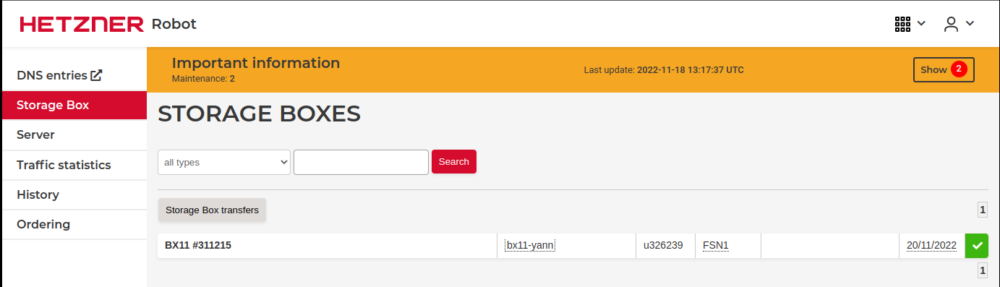
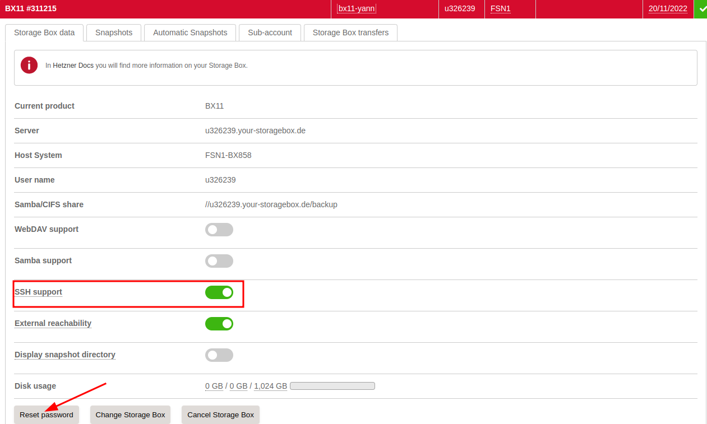
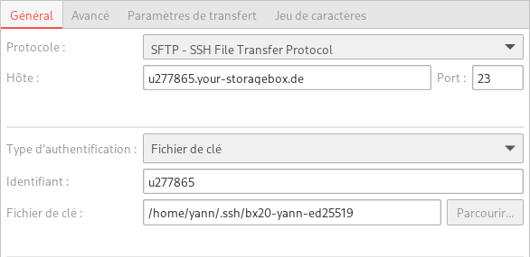

+++
title = 'Boîtes de stockage BX11 Hetzner Online Storage Box'
date = 2022-11-22 00:00:00 +0100
categories = ['borgbackup']
+++
Les boîtes de stockage vous offrent un stockage en ligne sûr et pratique pour vos données. Obtenez une boîte de stockage dans l'un des centres de données allemands de Hetzner Online ! Avec les boîtes de stockage Hetzner Online, vous pouvez accéder à vos données en déplacement partout où vous avez un accès Internet. Les boîtes de stockage peuvent être utilisées comme un disque de stockage supplémentaire auquel vous pouvez accéder facilement depuis votre ordinateur personnel, votre smartphone ou votre tablette. Les boîtes de stockage en ligne Hetzner sont disponibles avec différents protocoles standard qui supportent tous un large éventail d'applications. Nous disposons d'un assortiment de forfaits divers, afin que vous puissiez choisir la capacité de stockage qui correspond le mieux à vos besoins individuels. Et vous pouvez à tout moment modifier votre choix sans problème !
{: .prompt-info }


### bx11

Stockage disponible : 	1 TB  
Trafic : illimité `*`  
Emplacement :FSN1 (Falkenstein) Allemagne  
Instantanés 10  
à partir de 3.81 € par mois + 0,00 € de frais d'installation unique  
Prix incluant la TVA de 19 %.  


### Caractéristiques de base

Après la souscription, accéder à la boîte de stockage <https://robot.hetzner.com/storage>  
{:width="600"}  
Donner un nom : **bx11-yann**  

Détails, double-clic sur **u326239**, activer **SSH** et Reset password  
{:width="600"}  

## Authentification par clé SSH

**Authentification par clé SSH pour Backup Spaces et Storage Boxes**

*Si vous utilisez SCP, SFTP, rsync ou BorgBackup, vous pouvez vous connecter en utilisant l'authentification par clé SSH sans saisir de mot de passe.*

`Remarque importante :`{: .prompt-warning } selon le port SSH du compte de sauvegarde/boîte de stockage que vous utilisez, vous devrez peut-être utiliser un format spécifique pour la clé SSH publique.

* Pour le port SSH 22 (SFTP et SCP uniquement), vous devez utiliser une clé publique SSH au format RFC4716.  
* Pour le port SSH 23 (SFTP, SCP, rsync et BorgBackup), vous devez utiliser une clé publique SSH commune au format OpenSSH.  

Si vous souhaitez utiliser les services sur les deux ports, vous devez stocker la clé publique SSH dans les deux formats.
{: .prompt-info }

L'utilisation d'une clé ed25519 n'est pas prise en charge sur le port SSH 22.
{: .prompt-warning }

Chaque **sous-compte** nécessite son propre fichier `authorized_keys`.

Générer une paire de clé curve25519-sha256 (ECDH avec Curve25519 et SHA2) pour une liaison SSH avec le serveur.  

    ssh-keygen -t ed25519 -o -a 100 -f ~/.ssh/bx11-yann-ed25519

**Création du fichier authorized_keys**

Insérez les clés publiques SSH requises dans un nouveau fichier local `authorized_keys` nommé `storagebox_authorized_keys`

Pour SSH sur le port 23 (SCP, SFTP, Rsync et Borg Backup), ajoutez la clé publique SSH au format OpenSSH :

    cat .ssh/bx11-yann-ed25519.pub >> storagebox_authorized_keys

**Téléchargement des authorized_keys sur bx11-yann**

Maintenant vous devez télécharger le fichier authorized_keys généré vers le compte Storage Box/Backup **bx11-yann**   
Créer le répertoire `.ssh` avec les droits de fichier `0700 (rwx------)` et créer le fichier `authorized_keys` avec les clés SSH publiques et les droits de fichier `0600 (rw-------)` 

Vous pouvez le faire avec la commande suivante 

    echo -e "mkdir .ssh \n chmod 700 .ssh \n put storagebox_authorized_keys .ssh/authorized_keys \n chmod 600 .ssh/authorized_keys" | sftp u326239@u326239.your-storagebox.de

Résultat de la commande

```
The authenticity of host 'u326239.your-storagebox.de (116.202.54.25)' can't be established.
RSA key fingerprint is SHA256:EMlfI8GsRIfpVkoW1H2u0zYVpFGKkIMKHFZIRkf2ioI.
This host key is known by the following other names/addresses:
    ~/.ssh/known_hosts:109: u277865.your-storagebox.de
Are you sure you want to continue connecting (yes/no/[fingerprint])? yes
Warning: Permanently added 'u326239.your-storagebox.de' (RSA) to the list of known hosts.
u326239@u326239.your-storagebox.de's password: 
Connected to u326239.your-storagebox.de.
sftp> mkdir .ssh 
sftp>  chmod 700 .ssh 
Changing mode on /.ssh
sftp>  put storagebox_authorized_keys .ssh/authorized_keys 
Uploading storagebox_authorized_keys to /.ssh/authorized_keys
storagebox_authorized_keys                                       100%   94     1.3KB/s   00:00    
sftp>  chmod 600 .ssh/authorized_keys
Changing mode on /.ssh/authorized_keys
```

### Connexion SFTP sans mot de passe

En fonction du format de clé SSH que vous avez téléchargé, vous devriez pouvoir vous connecter sans mot de passe sur le port 22 et/ou 23 :

    sftp -P 23 -i ~/.ssh/bx11-yann-ed25519 u326239@u326239.your-storagebox.de

Résultat de la commande

```
The authenticity of host '[u326239.your-storagebox.de]:23 ([116.202.54.25]:23)' can't be established.
ED25519 key fingerprint is SHA256:XqONwb1S0zuj5A1CDxpOSuD2hnAArV1A3wKY7Z3sdgM.
This host key is known by the following other names/addresses:
    ~/.ssh/known_hosts:110: [u277865.your-storagebox.de]:23
Are you sure you want to continue connecting (yes/no/[fingerprint])? yes
Warning: Permanently added '[u326239.your-storagebox.de]:23' (ED25519) to the list of known hosts.
Connected to u326239.your-storagebox.de.
sftp> 
```

Saisir *quit* pour sortir...

## Accès SSH/rsync/SCP/SFTP/Filezilla

### SSH

Vous pouvez accéder à votre Storage Box via une connexion SSH pour y utiliser **rsync** et **BorgBackup**.  
Utilisez le port 23 pour accéder à votre Storage Box dans ce but.

Pour créer une connexion SSH sur votre boîte de stockage, activez d'abord le paramètre de support SSH pour votre boîte de stockage via l'interface d'administration du Robot  
({:height="30"})  


Remarques importantes : Pour l'authentification par clé SSH, vous devez enregistrer une clé SSH publique au format OpenSSH normal sur votre boîtier de stockage. Ne sauvegardez pas la clé au format RFC4716.
{: .prompt-warning }

Seul le répertoire `/home/` est accessible en écriture sur le boîtier de stockage. Pour adresser des répertoires ou des fichiers sur le Storage Box, nous vous recommandons donc d'utiliser des chemins relatifs. Par exemple, pour télécharger le fichier `/server1/full_backup.tar.gz` à partir du Storage Box, vous pouvez utiliser les chemins de fichiers suivants :  

```bash
server1/full_backup.tar.gz
./server1/full_backup.tar.gz
```

L'accès interactif SSH n'est pas autorisé.
{: .prompt-info }


### rsync

Vous pouvez utiliser rsync pour synchroniser l'état actuel de vos répertoires de fichiers sur votre boîte de stockage. Par exemple, pour synchroniser un répertoire local vers la Storage Box, vous pouvez utiliser rsync comme suit :

```bash
rsync --progress -e 'ssh -p23' --recursive <local_directory> <username>@<username>.your-storagebox.de:<target_directory>
```

Pour retélécharger un répertoire de la Storage Box, il suffit de permuter les répertoires :

```bash
rsync --progress -e 'ssh -p23' --recursive <username>@<username>.your-storagebox.de:<remote_directory> <local_directory>
```

Il n'est pas possible de personnaliser l'ID de l'utilisateur et du groupe des fichiers téléchargés.
{: .prompt-info }

### SCP

Vous pouvez également utiliser SCP via le port 23. Pour télécharger un fichier via SCP, vous pouvez exécuter la commande suivante :

    scp -P 23 <local_file> <username>@<username>.your-storagebox.de:<remote_file>

Pour télécharger à nouveau le fichier, il suffit de permuter les fichiers cible et source :

    scp -P 23 <username>@<username>.your-storagebox.de:<remote_file> <local_file>

### SFTP

Accéder à votre Storage Box via SFTP est similaire à y accéder avec un client FTP. Pour démarrer une session SFTP, veuillez exécuter la commande suivante :

    sftp -P 23 <username>@<username>.your-storagebox.de

Vous pouvez ensuite télécharger des fichiers en utilisant `put` et les télécharger en utilisant `get`. Avec `ls`, vous obtenez une liste de répertoires :

```bash
sftp> put 100MB.file
Uploading 100MB.file to /home/100MB.file
100MB.file                           100%  100MB  78.7MB/s   00:01
sftp> ls -ahl
drwxr-xr-x    0 12345      12345     16B  Mar 28 10:55 .
dr-x--x--x    0 0          0         10B  Mar 27 12:16 ..
-rw-r--r--    0 12345      12345     100M Mar 28 11:34 100MB.file
sftp> get 100MB.file
Fetching /home/100MB.file to 100MB.file
/home/100MB.file                     100%  100MB 110.6MB/s   00:00
sftp> quit
```

### Filezilla

Parammétrage de l'accès  
{:width="400"}

## BorgBackup

*Avec BorgBackup, vous pouvez enregistrer des sauvegardes cryptées et dupliquées sur votre Storage Box*

**Introduction**

BorgBackup (en abrégé : Borg) est un programme de sauvegarde à déduplication. La compression et le cryptage authentifié sont également supportés en option.

L'objectif principal de Borg est de fournir une solution de sauvegarde efficace et sécurisée. Grâce à la déduplication, le processus de sauvegarde avec Borg est très rapide et rend Borg très intéressant pour les sauvegardes quotidiennes. Vous pouvez remarquer que Borg est nettement plus rapide que d'autres méthodes, en fonction de la quantité de données et du nombre de modifications que vous devez sauvegarder. Avec Borg, toutes les données sont déjà cryptées côté client, ce qui fait de Borg un bon choix pour les systèmes hébergés.

Vous trouverez de plus amples informations sur BorgBackup sur le [site officiel](https://www.borgbackup.org/).

### Étape 1 - Installation

Il y a trois façons d'installer Borg.

*    Distribution package
*    Binaire autonome
*    A partir de la source

Dans la documentation de Borg, vous trouverez des descriptions très détaillées des différentes méthodes.

Pour des raisons de compatibilité, veuillez utiliser une version actuelle de Borg ! (> = 1.0.9)
{: .prompt-info }

### Étape 2 - Flux de travail avec Borg

#### Étape 2.1 - Activation de Borg et configuration de votre boîtier de stockage

Pour que Borg soit activé sur votre boîtier de stockage, vous devez d'abord activer le service sur l'interface web de Robot. Pour ce faire, allez à la page des paramètres de votre boîtier de stockage dans Robot et activer "SSH support"  

Voir paragraphe ["Authentification par clé SSH"](#authentification-par-clé-ssh)

Maintenant, vous devez créer le répertoire pour le référentiel de sauvegarde dans la boîte de stockage. Par exemple, créez un dossier 'backups', et en dessous, un dossier 'server1'. Le dossier 'server1' sera ensuite initialisé comme référentiel Borg à l'étape suivante. Sous 'backups', vous pouvez ensuite créer d'autres répertoires pour les autres serveurs que vous souhaitez sauvegarder.

/backups/server1

#### Étape 2.2 - Initialisation du référentiel Borg

Si vous utilisez une clé SSH, et qu'il ne s'agit pas de la clé par défaut, vous avez la possibilité de spécifier la clé souhaitée en utilisant la variable d'environnement BORG_RSH. Vous pouvez spécifier la commande SSH que Borg doit utiliser. La commande standard est simplement 'ssh'.

    export BORG_RSH='ssh -i /home/userXY/.ssh/id_ed25519'.

Lors de l'initialisation de Borg, il vous sera demandé un mot de passe pour votre référentiel. Ce n'est qu'avec ce mot de passe que vous pourrez accéder au référentiel à l'avenir. Il est donc requis pour chaque opération de lecture ou d'écriture sur le référentiel. Vous devez être capable de bien vous souvenir du mot de passe car il ne peut pas être restauré ! Pour éviter de devoir saisir le mot de passe à chaque appel de Borg, vous pouvez éventuellement définir la variable d'environnement BORG_PASSPHRASE.

    export BORG_PASSPHRASE="top_secret_passphrase"

Tout d'abord, vous devez initialiser le référentiel Borg. Le référentiel n'est rien de plus qu'un dossier sur votre boîte de stockage que Borg fournit avec quelques structures de base. Toutes les sauvegardes sont stockées dans ce dossier.

La commande suivante initialise le dossier '/backups/server1' sur votre unité de stockage.

    borg init --encryption=repokey ssh://u123456@u123456.your-storagebox.de:23/./backups/server1

#### Étape 2.3 - Créer la première sauvegarde

Par exemple, utilisez la commande suivante pour sauvegarder les dossiers 'src' et 'build' de votre répertoire personnel vers le référentiel de votre boîte de stockage. Vous devez donner un nom unique à chaque sauvegarde. Un horodatage est utile pour créer des noms uniques.

    borg create ssh://u123456@u123456.your-storagebox.de:23/./backups/server1::2017_11_11_initial ~/src ~/built

Vous pouvez appeler Borg create en utilisant de nombreuses autres options. Vous pouvez le faire, par exemple, pour voir la progression d'une sauvegarde pendant son traitement ou pour voir les statistiques de la sauvegarde une fois qu'elle est terminée. En outre, vous pouvez spécifier des modèles d'exclusion et d'autres choses.

Pour plus d'informations, veuillez consulter la [documentation de Borg create](http://borgbackup.readthedocs.io/en/stable/usage/create.html)

#### Étape 2.4 - Sauvegardes suivantes (incrémentielles)

Les sauvegardes suivantes sont identiques à la première. Grâce à la déduplication, elles sont toutefois beaucoup plus rapides et extrêmement économes en mémoire, puisqu'elles sont uniquement incrémentielles.

Vous devez seulement ajuster le nom de la sauvegarde lors de la sauvegarde suivante. Rappelez-vous que vous devez utiliser des noms uniques comme mentionné ci-dessus.

Utilisez simplement l'option '--stats' sur la prochaine sauvegarde pour voir à quel point elle est efficace.

    borg create --stats ssh://u123456@u123456.your-storagebox.de:23/./backups/server1::2017_11_12 ~/src ~/built

#### Étape 2.5 - Autres commandes Borg, notamment List archives, restore backups

La documentation de Borg fournit une description très détaillée de toutes les commandes de Borg.

Il est préférable de commencer par jeter un coup d'oeil à la [section quickstart](https://borgbackup.readthedocs.io/en/stable/quickstart.html) puis de se plonger dans la [section usage](https://borgbackup.readthedocs.io/en/stable/usage/general.html) pour entrer dans les détails.

La documentation fournit de nombreux exemples de listage d'archives ou de restauration de sauvegardes. Il est également possible, par exemple, d'afficher les différences entre les sauvegardes ou de supprimer les anciennes sauvegardes pour récupérer de l'espace de stockage.

#### Étape 2.6 - Automatiser les sauvegardes avec Cron

Créez un répertoire pour le fichier journal.

    mkdir -p /var/log/borg

Tout d'abord, créez un script qui exécutera les sauvegardes. Cela pourrait ressembler au script suivant et se trouver sous `/usr/local/bin/backup.sh` 

```bash
#!/usr/bin/env bash

##
## Set environment variables
##

## if you don't use the standard SSH key,
## you have to specify the path to the key like this
# export BORG_RSH="ssh -i /home/userXY/.ssh/id_ed25519"

## You can save your borg passphrase in an environment
## variable, so you don't need to type it in when using borg
# export BORG_PASSPHRASE="top_secret_passphrase"

##
## Set some variables
##

LOG="/var/log/borg/backup.log"
BACKUP_USER="u602"
REPOSITORY_DIR="server1"

## Tip: If using with a Backup Space you have to use
## 'your-storagebox.de' instead of 'your-backup.de'

REPOSITORY="ssh://${BACKUP_USER}@${BACKUP_USER}.your-storagebox.de:23/./backups/${REPOSITORY_DIR}"

##
## Output to a logfile
##

exec > >(tee -i ${LOG})
exec 2>&1

echo "###### Backup started: $(date) ######"

##
## At this place you could perform different tasks
## that will take place before the backup, e.g.
##
## - Create a list of installed software
## - Create a database dump
##

##
## Transfer the files into the repository.
## In this example the folders root, etc,
## var/www and home will be saved.
## In addition you find a list of excludes that should not
## be in a backup and are excluded by default.
##

echo "Transfer files ..."
borg create -v --stats                   \
    $REPOSITORY::'{now:%Y-%m-%d_%H:%M}'  \
    /root                                \
    /etc                                 \
    /var/www                             \
    /home                                \
    --exclude /dev                       \
    --exclude /proc                      \
    --exclude /sys                       \
    --exclude /var/run                   \
    --exclude /run                       \
    --exclude /lost+found                \
    --exclude /mnt                       \
    --exclude /var/lib/lxcfs

echo "###### Backup ended: $(date) ######"
```

Maintenant, testez le script avant de créer le cronjob.

    chmod u+x /usr/local/bin/backup.sh
    /usr/local/bin/backup.sh

Si tout fonctionne bien, vous pouvez maintenant exécuter le script comme un cronjob. Ouvrez crontab en tant que root :

    crontab -e

Et ajoutez la ligne suivante pour exécuter une sauvegarde quotidienne à 00:00.

    0 0 * * * /usr/local/bin/backup.sh > /dev/null 2>&1

### Étape 3 - Conseils

#### Étape 3.1 - Sauvegarde complète du système

Si vous voulez sauvegarder l'ensemble du système de votre serveur Linux, vous devez vous rappeler que tous les fichiers et dossiers n'ont pas leur place dans une sauvegarde. Certains doivent être exclus par défaut.

Pour cela, la commande create a une option --exclude ou vous pouvez spécifier un fichier d'exclusion. L'utilisation est décrite en détail dans la documentation de Borg create.

Voici un exemple d'appel à borg create pour une sauvegarde du système complet :

```bash
borg create -v --stats                   \
    $REPOSITORY::'{now:%Y-%m-%d_%H:%M}'  \
    /                                    \
    --exclude /dev                       \
    --exclude /proc                      \
    --exclude /sys                       \
    --exclude /var/run                   \
    --exclude /run                       \
    --exclude /lost+found                \
    --exclude /mnt                       \
    --exclude /var/lib/lxcfs
```

#### Étape 3.2 - Déduplication et fiabilité

Puisque BorgBackup utilise la déduplication, vous pouvez faire des sauvegardes très rapidement et sans utiliser beaucoup de stockage.

Mais vous devez aussi être conscient que chaque fichier est sauvegardé exactement une fois. Si un fichier est endommagé par une panne de disque, par exemple, ce fichier sera corrompu dans toutes les sauvegardes suivantes.

C'est pourquoi il est préférable de stocker les données très importantes dans plus d'un référentiel !

#### Étape 3.3 - Version de Borg sur le serveur

Pour éviter les problèmes de compatibilité, il est recommandé d'utiliser la même version de Borg Backup sur votre serveur et sur la Storage Box / Backup Space.

Pour chaque mise à jour majeure, il y a une version disponible, qui est régulièrement et promptement mise à jour par nous. Vous pouvez spécifier la version que vous souhaitez utiliser sur votre Storage Box / Espace de Sauvegarde avec le paramètre Borg `--remote-path`
Si le paramètre n'est pas spécifié, la dernière version disponible sur la Storage Box / Backup Space est utilisée.

Actuellement, les versions 1.0 et 1.1 sont installées. La dernière version, donc 1.1. est la version par défaut. Si vous voulez toujours utiliser la version 1.0, utilisez :

    borg init --encryption = repokey --remote-path = borg-1.0
ssh: //u123456@u123456.your-storagebox.de: 23 /./ backups / server1

borg-1.0 correspond à la version 1.0.x.

Le journal des modifications de la documentation de BorgBackup fournit des informations sur les changements entre les versions et les éventuels problèmes de compatibilité, le cas échéant.

#### Étape 3.4 - Borg et SSH

BorgBackup utilise SSH sur le port 23. L'accès SSH est limité à Borg et le login n'est pas possible !
Étape 3.5 - Utiliser Borg et SFTP / SCP en parallèle avec keyfile

Comme décrit ci-dessus, Borg requiert la clé publique normale, tandis que SFTP/SCP requiert la clé SSH au format RFC4716. Si vous utilisez à la fois Borg et SFTP/SCP, les deux clés (format RFC4716 et normal) doivent être stockées dans le fichier authorized_keys.

#### Étape 3.6 - Fichier clé Borg et mot de passe

Le mot de passe que vous choisissez pour votre dépôt Borg ne sera pas enregistré chez nous et ne pourra pas être récupéré par nous ! Gardez-le en sécurité.

En mode repokey (par défaut), la clé du repo est située dans la configuration du repo, c'est-à-dire sur le boîtier de stockage. Il est recommandé d'enregistrer une sauvegarde de la clé. Vous trouverez de plus amples informations dans la documentation Borg.

### Conclusion

Avec Borgbackup vous avez installé et configuré un logiciel automatisé et peu encombrant pour vos sauvegardes.